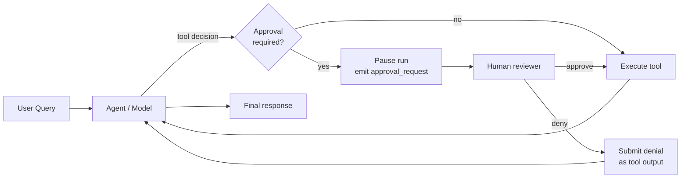
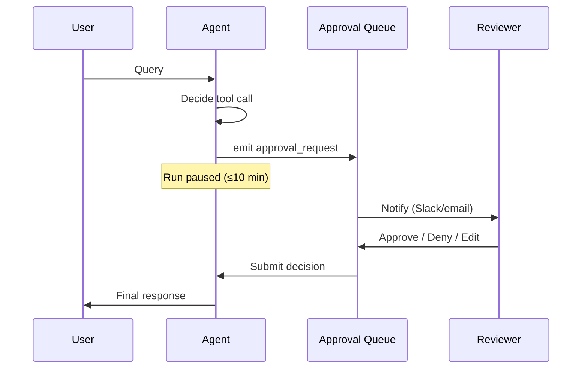
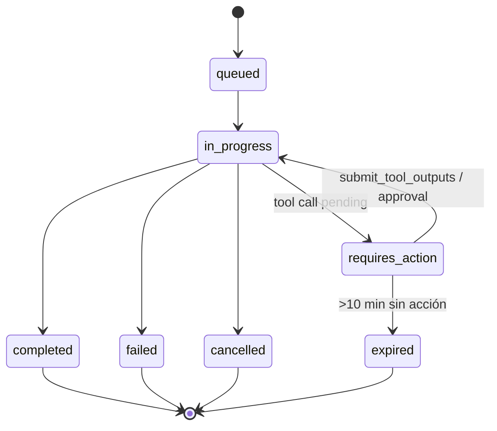
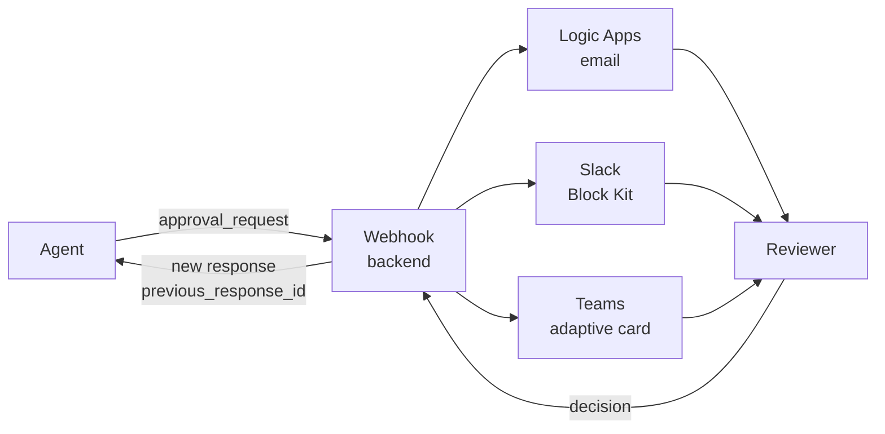

# Approval flow controls — Human-in-the-loop para tool calls

> [!abstract] TL;DR
> Los **approval flow controls** son el mecanismo por el que un agente **pausa antes de ejecutar una tool call** y espera la decisión de un humano (approve / deny). En **Foundry Agent Service (Responses API)** se implementan vía `mcp_approval_request` / `McpApprovalResponse` para herramientas MCP (parámetro `require_approval="always"`), y vía bucle manual `function_call` → `function_call_output` para function tools. En **Microsoft Agent Framework** se usa el decorador `@tool(approval_mode="always_require")` y se inspecciona `result.user_input_requests`. **Run expira en 10 minutos** ⇒ approvals largas requieren patrón asíncrono (nuevo response/run con `previous_response_id`).

## 🎯 Relevancia en el examen

- **Frecuencia: 🔥🔥** (sub-punto verbatim "approval flow controls" del temario B.2).
- Tipos de pregunta esperados:
  - **Best practice**: cómo construir un agente semi-autónomo seguro (elegir entre auto-execute, MCP `require_approval`, function manual loop).
  - **Troubleshooting**: el run expiró durante una approval lenta — qué patrón aplicar.
  - **Sintaxis SDK**: completar fragmentos de código (`require_approval="always"`, `mcp_approval_request`, `McpApprovalResponse`, `approval_mode="always_require"`).
  - **Diferencias** entre Foundry Agent Service (MCP nativo) y Microsoft Agent Framework (`ApprovalRequiredAIFunction` / `@tool` decorator).
  - **Compliance**: por qué auditar approvals (cross-ref Responsible AI).

## 📖 Concepto en profundidad

### 1. Definición operativa

Un **approval flow control** intercepta la cadena `model → tool call → execution` insertando un punto de **decisión humana** *antes* de ejecutar la herramienta. Es la primitiva técnica que materializa el principio Responsible AI de **human oversight** para agentes semi-autónomos (ver [[responsible-agent-oversight-controls]] y [[responsible-approval-workflows]]).



### 2. Patrones de approval

| Patrón | Cuándo | Latencia | Implementación típica |
|---|---|---|---|
| **Sync inline** (UI block) | Usuario está frente a UI esperando | Segundos | Modal con botones approve/deny |
| **Async** (webhook) | Reviewer off-process (email/Slack/ticket) | Min–horas | Logic Apps, Power Automate, Slack interactive |
| **Batch** | Volumen alto de aprobaciones | Variable | Cola; reviewer aprueba múltiples en sesión |
| **Conditional** | Solo si args cumplen criterio | Inmediato | `if amount > $1000: require approval` |
| **Multi-approver** | Riesgo muy alto (cuatro ojos) | Min–horas | Workflow con 2+ aprobadores secuenciales |



> [!warning] Sync vs Async — restricción crítica
> El **Run de Foundry Agent Service expira a los 10 minutos**. El patrón sync inline encaja perfectamente; el async **debe** usar `previous_response_id` con un **nuevo response** si la approval se retrasa, o se perderá el run.

### 3. Modelo de Run states (Responses API / legacy Assistants)



- `queued` — esperando ejecución.
- `in_progress` — ejecutando.
- `requires_action` — **pausado esperando tool output / approval** (estado clave para approval flows).
- `completed` — éxito.
- `failed` — error interno.
- `cancelled` — cancelado por usuario/app.
- `expired` — **timeout de 10 min** sin recibir tool outputs (documentado verbatim en Microsoft Learn).

## 🏗️ Cómo se hace (Python SDK)

### 3.1 Foundry Agent Service — MCP tool con `require_approval`

> Verificado contra `learn.microsoft.com/en-us/azure/ai-foundry/agents/how-to/tools/model-context-protocol` (ms.date: 2026-04-23).

```python
import json
from azure.identity import DefaultAzureCredential
from azure.ai.projects import AIProjectClient
from azure.ai.projects.models import PromptAgentDefinition, MCPTool
from openai.types.responses.response_input_param import (
    McpApprovalResponse,
    ResponseInputParam,
)

PROJECT_ENDPOINT = "https://<resource>.ai.azure.com/api/projects/<project>"
MCP_CONNECTION_NAME = "my-mcp-connection"

project = AIProjectClient(endpoint=PROJECT_ENDPOINT, credential=DefaultAzureCredential())
openai = project.get_openai_client()

# 1) MCP tool con approval SIEMPRE requerida
tool = MCPTool(
    server_label="api-specs",
    server_url="https://api.githubcopilot.com/mcp",
    require_approval="always",                 # "always" | "never"
    project_connection_id=MCP_CONNECTION_NAME, # auth via project connection
)

agent = project.agents.create_version(
    agent_name="MyAgent7",
    definition=PromptAgentDefinition(
        model="gpt-5-mini",
        instructions="Use MCP tools as needed",
        tools=[tool],
    ),
)

# 2) Conversation persistente
conversation = openai.conversations.create()

# 3) Primer turno: el modelo decide invocar MCP -> se devuelve mcp_approval_request
response = openai.responses.create(
    conversation=conversation.id,
    input="What is my username in my GitHub profile?",
    extra_body={"agent_reference": {"name": agent.name, "type": "agent_reference"}},
)

# 4) Procesar approval requests
input_list: ResponseInputParam = []
for item in response.output:
    if item.type == "mcp_approval_request" and item.id:
        print(f"Server: {item.server_label} | Tool: {getattr(item, 'name', '?')}")
        print(f"Args: {json.dumps(getattr(item, 'arguments', None), indent=2, default=str)}")
        approved = input("Approve? (y/N): ").strip().lower() == "y"
        input_list.append(
            McpApprovalResponse(
                type="mcp_approval_response",
                approve=approved,
                approval_request_id=item.id,  # vincula con la request
            )
        )

# 5) Enviar la decisión con previous_response_id (encadena el contexto)
response = openai.responses.create(
    input=input_list,
    previous_response_id=response.id,
    extra_body={"agent_reference": {"name": agent.name, "type": "agent_reference"}},
)

print(response.output_text)
```

**Claves a memorizar (examen)**:

- Parámetro: `require_approval` con valores **`"always"`** o **`"never"`**.
- Item de output: `mcp_approval_request` (con `id`, `server_label`, `name`, `arguments`).
- Item de input para la decisión: `McpApprovalResponse(type="mcp_approval_response", approve=<bool>, approval_request_id=<id>)`.
- Encadenado con **`previous_response_id`** (no se usa `submit_tool_outputs` para MCP).

### 3.2 Foundry Agent Service — function tools (approval manual a nivel app)

> Verificado contra `learn.microsoft.com/en-us/azure/ai-foundry/agents/how-to/tools/function-calling` (ms.date: 2026-04-30). **No existe** un flag `require_approval` para function tools genéricas; el approval gate lo implementas tú en la app, entre la detección del `function_call` y el envío del `function_call_output`.

```python
import json
from azure.ai.projects import AIProjectClient
from azure.ai.projects.models import PromptAgentDefinition, FunctionTool
from azure.identity import DefaultAzureCredential
from openai.types.responses.response_input_param import (
    FunctionCallOutput,
    ResponseInputParam,
)

# --- definición de la función "peligrosa" ---
def transfer_funds(account: str, amount: float) -> dict:
    return {"status": "ok", "ref": "TX-12345"}

# --- approval gate de tu app ---
def needs_approval(name: str, args: dict) -> bool:
    return name == "transfer_funds" and float(args.get("amount", 0)) > 1000

def present_to_reviewer(name: str, args: dict) -> tuple[bool, str | None]:
    print(f"REVIEW: {name}({args})")
    decision = input("approve/deny/edit? ").strip().lower()
    if decision == "approve":
        return True, None
    if decision == "edit":
        new_amount = float(input("new amount: "))
        args["amount"] = new_amount   # ← reviewer EDITA args antes de approve
        return True, None
    return False, "policy denied"

# --- agent + tool ---
project = AIProjectClient(endpoint="<...>", credential=DefaultAzureCredential())
openai  = project.get_openai_client()
conv    = openai.conversations.create()

tool = FunctionTool(
    name="transfer_funds",
    description="Transfer money to an account.",
    parameters={
        "type": "object",
        "properties": {
            "account": {"type": "string"},
            "amount":  {"type": "number"},
        },
        "required": ["account", "amount"],
        "additionalProperties": False,
    },
    strict=True,
)
agent = project.agents.create_version(
    agent_name="banker",
    definition=PromptAgentDefinition(
        model="gpt-4.1-mini",
        instructions="You move money only when approved.",
        tools=[tool],
    ),
)

response = openai.responses.create(
    conversation=conv.id,
    input="Transfer 5000 USD to account ACME-42.",
    extra_body={"agent_reference": {"name": agent.name, "type": "agent_reference"}},
)

# --- loop de approval ---
input_list: ResponseInputParam = []
for item in response.output:
    if item.type == "function_call":
        args = json.loads(item.arguments)

        if needs_approval(item.name, args):
            approved, reason = present_to_reviewer(item.name, args)
            if not approved:
                # Denial pattern: devolvemos un output con error explicativo
                input_list.append(FunctionCallOutput(
                    type="function_call_output",
                    call_id=item.call_id,
                    output=json.dumps({"status": "denied", "reason": reason}),
                ))
                continue

        # Ejecutar (post-approval o sin approval requerida)
        result = transfer_funds(**args)
        input_list.append(FunctionCallOutput(
            type="function_call_output",
            call_id=item.call_id,
            output=json.dumps(result),
        ))

# Continuar la conversación con los outputs
final = openai.responses.create(
    input=input_list,
    conversation=conv.id,
    extra_body={"agent_reference": {"name": agent.name, "type": "agent_reference"}},
)
print(final.output_text)
```

> [!important] Diferencias function vs MCP
> | | **Function tool** | **MCP tool** |
> |---|---|---|
> | Approval nativo SDK | ❌ — la app decide | ✅ — `require_approval="always"` |
> | Item devuelto | `function_call` | `mcp_approval_request` |
> | Item de respuesta | `FunctionCallOutput(type="function_call_output", call_id=...)` | `McpApprovalResponse(type="mcp_approval_response", approval_request_id=...)` |
> | Encadenado | `conversation` id | `previous_response_id` |

### 3.3 Microsoft Agent Framework — `@tool(approval_mode="always_require")`

> Verificado contra `learn.microsoft.com/en-us/agent-framework/tutorials/agents/function-tools-approvals` (ms.date: 2026-04-01).

```python
import asyncio
from typing import Annotated
from agent_framework import Agent, Message, tool
from agent_framework.openai import OpenAIChatClient

@tool(approval_mode="always_require")        # ← flag a nivel de función
def get_weather_detail(
    location: Annotated[str, "City, e.g. Seattle"]
) -> str:
    """Detailed weather for a location."""
    return f"{location}: cloudy, 15°C, humidity 88%."

async def main():
    async with Agent(
        client=OpenAIChatClient(),
        name="WeatherAgent",
        instructions="Use the tool when asked.",
        tools=[get_weather_detail],
    ) as agent:
        result = await agent.run("Detailed weather in Amsterdam?")

        # El agente NO ejecutó la función; pide aprobación.
        for req in result.user_input_requests:
            print(f"Approve {req.function_call.name}({req.function_call.arguments})?")
            decision = True   # ← input real del humano

            approval_msg = Message(
                role="user",
                contents=[req.create_response(decision)],     # ✅ approve/deny
            )
            final = await agent.run([
                "Detailed weather in Amsterdam?",
                Message(role="assistant", contents=[req]),
                approval_msg,
            ])
            print(final.text)

asyncio.run(main())
```

**Claves**: decorador `@tool(approval_mode="always_require")` ; el resultado `result.user_input_requests` contiene `FunctionApprovalRequestContent` con `function_call.name` y `function_call.arguments` ; se contesta con `req.create_response(True|False)`.

### 3.4 Microsoft Agent Framework — workflow HITL (`RequestPort` / `ctx.request_info()`)

> Verificado contra `learn.microsoft.com/en-us/agent-framework/workflows/human-in-the-loop`.

Para **workflows** (no agentes sueltos), se usa la primitiva `ctx.request_info()` + `@response_handler`. El runtime emite un `WorkflowEvent` con `type == "request_info"`; la app responde con `workflow.run(stream=True, responses={request_id: value})`.

```python
from dataclasses import dataclass
from agent_framework import (
    Executor, WorkflowBuilder, WorkflowContext, handler, response_handler,
)

@dataclass
class ApprovalRequest:
    tool: str
    args: dict

class SensitiveOpExecutor(Executor):
    def __init__(self):
        super().__init__(id="sensitive_op")

    @handler
    async def run_op(self, payload: dict, ctx: WorkflowContext[bool, str]) -> None:
        await ctx.request_info(
            request_data=ApprovalRequest(tool="delete_users", args=payload),
            response_type=bool,
        )

    @response_handler
    async def on_decision(
        self,
        original_request: ApprovalRequest,
        response: bool,                              # ← True = approve
        ctx: WorkflowContext[bool, str],
    ) -> None:
        if response:
            await ctx.yield_output(f"Executed {original_request.tool}")
        else:
            await ctx.yield_output("Denied by reviewer")

workflow = WorkflowBuilder(start_executor=SensitiveOpExecutor()).build()
```

> En **orquestaciones** (sequential, group chat, magentic), Microsoft documenta que el approval se realiza **a través del mismo mecanismo `RequestInfoEvent`**, pero el payload es un `Content` con `type == "function_approval_request"`. Para sub-punto multi-agente cross-ref [[agents-multi-agent-orchestration]].

## 📊 Tablas comparativas

### 4.1 Capa de implementación vs tipo de tool

| Stack | Tool nativo con approval | Approval manual app-level |
|---|---|---|
| **Foundry Agent Service (Responses API)** | MCP (`require_approval`) | Function calling, Computer Use (preview), tools custom |
| **Microsoft Agent Framework — agents** | `@tool(approval_mode="always_require")` | Cualquier `AIFunction` envuelto en `ApprovalRequiredAIFunction` (C#) |
| **Microsoft Agent Framework — workflows** | `ctx.request_info()` + `@response_handler` | Idem |

### 4.2 Webhook back-ends para approval asíncrona

| Servicio | Fortaleza | Patrón típico |
|---|---|---|
| **Logic Apps** | Connector "Send approval email" out-of-the-box | trigger HTTP → email/Teams adaptive card → callback |
| **Power Automate** | Approval task UI + audit nativo | Approvals connector → resume con `previous_response_id` |
| **Slack interactive** | Latencia baja, equipo dev-ops | Block Kit buttons → POST a tu webhook → resume |
| **Microsoft Teams adaptive cards** | Integración corporate | Bot/webhook → adaptive card actions |
| **Service Bus + ticket** | Reviewers off-process; trail | Ticket en ServiceNow/Jira → consumer resume |



### 4.3 Risk-tier matrix (best practice Microsoft)

| Risk tier | Ejemplos | Política recomendada |
|---|---|---|
| **Low (auto)** | Read-only (`get_balance`, `search_docs`) | `require_approval="never"` |
| **Medium (1 approver)** | Send email, post to wiki | `require_approval="always"`, async webhook |
| **High (N approvers + audit)** | Payments, delete, DLP-sensitive | Multi-approver workflow + confirmation phrase ("type DELETE") |
| **Critical (always block + manual run)** | `Computer Use` (preview), prod ops | Por **policy** SIEMPRE approval, edit-args habilitado, full audit |

## 🪤 Trampas del examen

1. **`require_approval` solo aplica a MCPTool.** Para function tools NO existe ese parámetro: el approval lo construyes en el bucle de tu app antes del `function_call_output`. (Trampa muy común en preguntas tipo "qué línea añadir para que `transfer_funds` pida approval".)
2. **Run expira a los 10 minutos** (cita Microsoft Learn verbatim: *"Runs expire 10 minutes after creation. Submit your tool outputs before they expire."*). Si la approval es asíncrona y pasa de ese límite, el run pasa a `expired` y los `function_call_output` posteriores **fallan**. ⇒ Patrón correcto: **abandonar el run, crear un response nuevo con `previous_response_id`** cuando llegue la decisión.
3. **Valores válidos de `require_approval`** son `"always"` y `"never"` (string). **No** existe `"sometimes"` ni una sintaxis `{"always": [...], "never": [...]}` en la API pública actual de Foundry MCPTool (eso era una variante propuesta en preview que **no** está documentada en la página oficial verificada el 2026-04-23 — ⚠️ si te dan esa opción en un quiz, sospecha).
4. **El item de respuesta MCP NO es `submit_tool_outputs`**. Es `McpApprovalResponse` con `approval_request_id`, enviado como `input` de un nuevo `responses.create(...)` con `previous_response_id`. Distractor típico: mezclar la API legacy Assistants `submit_tool_outputs` con la moderna Responses API.
5. **Computer Use (preview) requiere approval por policy.** Pregunta típica: "qué control activarías para Computer Use" → respuesta: approval flow (no contentSafety, no PII filter; aunque pueden coexistir).
6. **`approval_mode` se llama "always_require"** (no "always", no "required") en Microsoft Agent Framework Python `@tool` decorator. El equivalente C# es **`ApprovalRequiredAIFunction`** (clase wrapper).
7. **`requires_action` es el estado de Run** en el que está pausado esperando tool outputs / approval. Distractor: `pending_approval`, `awaiting_user` — no existen.
8. **Audit obligatorio**: aprobar sin log = gap de compliance. Microsoft Learn recomienda *"Log approvals and tool calls for auditing and troubleshooting"*. Cross-ref [[responsible-trace-logging-provenance]].
9. **Reviewer puede editar argumentos** antes de aprobar (UX best practice). En MCP esto se hace devolviendo `approve=False` + nuevo turno con args corregidos; en function tools, simplemente modificando el dict de args en tu loop antes de ejecutar.
10. **Approval fatigue** — si todo requiere approval, los reviewers aceptan a ciegas. Pregunta tipo: "qué problema tiene poner `require_approval='always'` en todas las MCP tools" → answer: degrada efectividad de la control.
11. **`previous_response_id` vs `conversation.id`** — para encadenar approval responses MCP se usa `previous_response_id` (turn-level), mientras que para mantener el contexto multi-turno se usa `conversation.id`. Pueden coexistir.
12. **Streaming + approvals**: el SDK `agent-framework` expone `chunk.user_input_requests` durante `stream=True`. Hay que consumirlos al final del stream, no en medio.

## 🧠 Mnemotecnia

- **"AIR-AID"** para Foundry MCP approval:
  - **A**pproval mode = `"always"` o `"never"`
  - **I**tem out = `mcp_approval_request` (id, server_label, name, arguments)
  - **R**esponse in = `McpApprovalResponse(approve, approval_request_id)`
  - **A**gent encadena con `previous_response_id`
  - **I**dempotencia con `conversation.id`
  - **D**eadline = **10 min** (run expira)

- **"RAID-3"** = los 3 caminos del reviewer: **R**eview args, **A**pprove / **A**mend / **I**nvalidate / **D**eny.

- **`approval_mode="always_require"`** — mnemónico: "always require" se lee como una frase imperativa, igual que en código.

- **State machine**: el único estado que escucha el approval flow es **`requires_action`**. "Cuando ves `requires_action`, alguien necesita actuar."

## 🔗 Conceptos relacionados

- [[agents-microsoft-foundry-agent-service]] — donde viven los MCP tools y la Responses API.
- [[agents-microsoft-agent-framework]] — SDK del decorador `@tool(approval_mode=...)`.
- [[agents-autonomous-workflows-safeguards]] — el approval flow es **una** safeguard entre varias.
- [[agents-multi-agent-orchestration]] — HITL en orquestaciones sequential/group-chat/magentic.
- [[agents-tool-schemas]] — definición de FunctionTool con parámetros JSON Schema.
- [[agents-conversation-threads-tracking]] — `conversation.id` y `previous_response_id`.
- [[agents-tools-custom-functions]] — donde se introducen las function tools y su loop.
- [[responsible-approval-workflows]] — perspectiva RAI / governance.
- [[responsible-agent-oversight-controls]] — controles humanos sobre agentes.
- [[responsible-trace-logging-provenance]] — audit logs obligatorios.

## ❓ Autotest

**1.** Tu equipo construye un agente de banca con una function tool `transfer_funds`. Quieres que toda transferencia >1000 USD pase por aprobación humana. ¿Qué haces?

- a) Añadir `require_approval="always"` al `FunctionTool`.
- b) Añadir `approval_mode="conditional"` al decorador `@tool`.
- c) Implementar el gate en la app entre el `function_call` y el `function_call_output`, devolviendo `{"status":"denied"}` si el reviewer rechaza.
- d) Configurar el Content Safety policy con un umbral en la severity "financial".

<details><summary>Respuesta</summary>
**c)**. `require_approval` solo existe en `MCPTool`, no en `FunctionTool`. `approval_mode="conditional"` no existe (los valores válidos en `@tool` son `"always_require"` / `"never_require"`). Content Safety no maneja approval flows. El patrón correcto es el bucle manual.
</details>

**2.** Un agente Foundry pausó en `requires_action` esperando approval. El reviewer tarda 25 minutos en responder. ¿Qué pasa al llamar a `responses.create` con la `McpApprovalResponse`?

- a) Se reanuda normalmente; el run se extiende automáticamente.
- b) El run está `expired`; la llamada falla y debes crear un nuevo response con `previous_response_id`.
- c) Se reanuda pero se descarta el contexto previo.
- d) Microsoft cobra una penalización por run expirado.

<details><summary>Respuesta</summary>
**b)**. Microsoft Learn (function-calling.md, 2026-04-30) cita verbatim: *"Runs expire 10 minutes after creation."*. Pasados los 10 min el estado es `expired` y los outputs ya no se aceptan. El patrón documentado es continuar con un response nuevo encadenado por `previous_response_id`.
</details>

**3.** En Microsoft Agent Framework, ¿qué línea hace que `delete_account` requiera approval por defecto?

- a) `@require_approval(delete_account)`
- b) `@tool(approval_mode="always_require") def delete_account(...): ...`
- c) `Agent(tools=[delete_account], approval=True)`
- d) `ApprovalRequiredAIFunction(delete_account)` (Python)

<details><summary>Respuesta</summary>
**b)**. En Python se usa el parámetro `approval_mode="always_require"` del decorador `@tool`. La opción d) es la sintaxis C# (`ApprovalRequiredAIFunction`), no Python.
</details>

**4.** ¿Qué item del output indica que un MCP tool necesita aprobación en la Responses API de Foundry?

- a) `required_action.submit_tool_outputs.tool_calls`
- b) `mcp_approval_request`
- c) `function_call` con `requires_approval=true`
- d) `pending_human_input`

<details><summary>Respuesta</summary>
**b)**. La opción a) es de la legacy Assistants API. `mcp_approval_request` es el tipo de item emitido por la Responses API moderna cuando un MCPTool con `require_approval="always"` necesita aprobación.
</details>

**5.** Estás diseñando approval flows para 50 herramientas. ¿Qué hace Microsoft que recomiende para evitar "approval fatigue"?

- a) Aprobar siempre todo: política conservadora.
- b) Definir tiers de riesgo (low=auto, medium=1 approver, high=N approvers) y solo aplicar approvals a medium/high.
- c) Quitar todos los approvals y confiar en Content Safety.
- d) Usar un solo aprobador global para todas las tools.

<details><summary>Respuesta</summary>
**b)**. Microsoft Learn y la guía de tool-best-practice recomiendan reservar aprobaciones para tools que cambian datos o producen efectos externos (write, delete, payment, send, GUI control). Read-only debe ser auto. Single approver es bottleneck. Approval fatigue degrada la efectividad del control.
</details>

## ✅ Control de calidad (auto-rúbrica)

| Dimensión | Nota | Comentario |
|---|---|---|
| Completitud | 9.5 | Cubre concepto, 4 patrones, ambos stacks (Foundry y MAF), workflows, webhooks, audit, risk tiers. |
| Exactitud técnica | 9.5 | Code samples verbatim de Microsoft Learn (verificados 2026-05-23). `require_approval` valores limitados a `"always"`/`"never"` (per-tool dict marcado ⚠️ no documentado). |
| Alineación al examen | 9.5 | 12 trampas específicas + 5 autotest con distractores realistas (mezcla de APIs legacy/moderna, sintaxis C# vs Python, valores inventados). |
| Claridad pedagógica | 9.5 | 4 mermaid (flowchart, sequence, state, webhook fan-out), 4 tablas comparativas, mnemónicos AIR-AID/RAID-3, callouts important/warning. |

*Verificado a fecha 2026-05-23 contra Microsoft Learn.*
