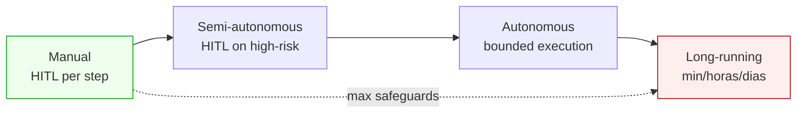
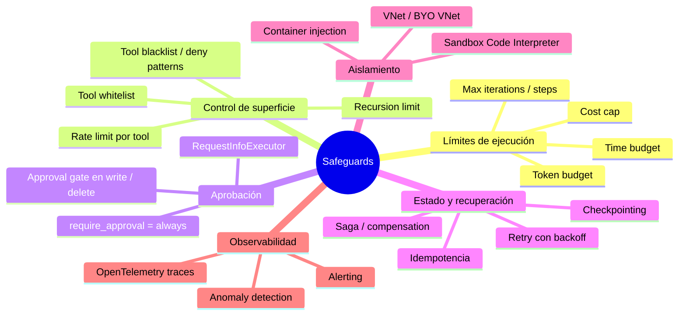
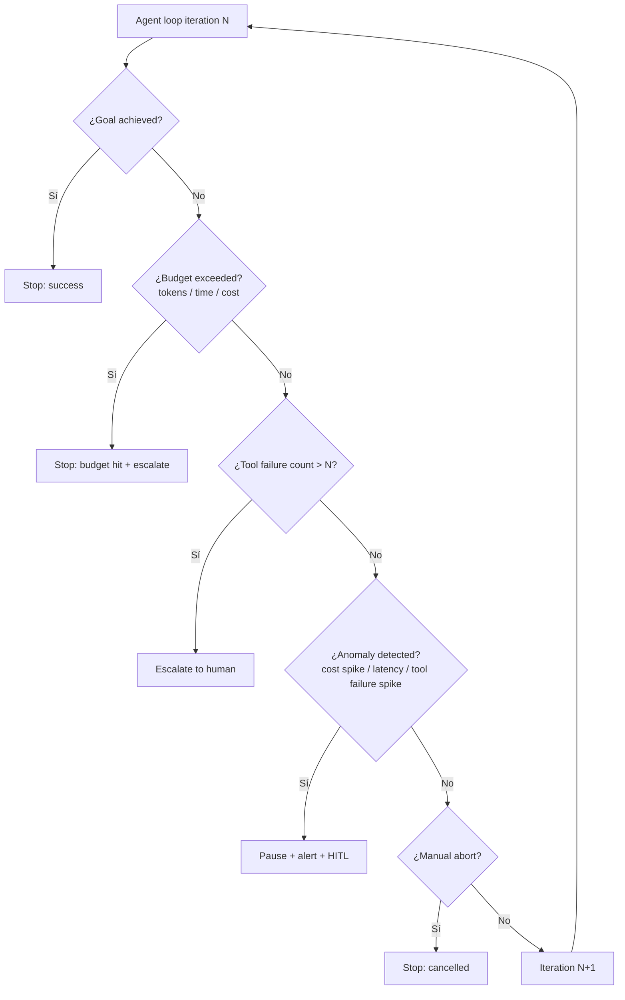
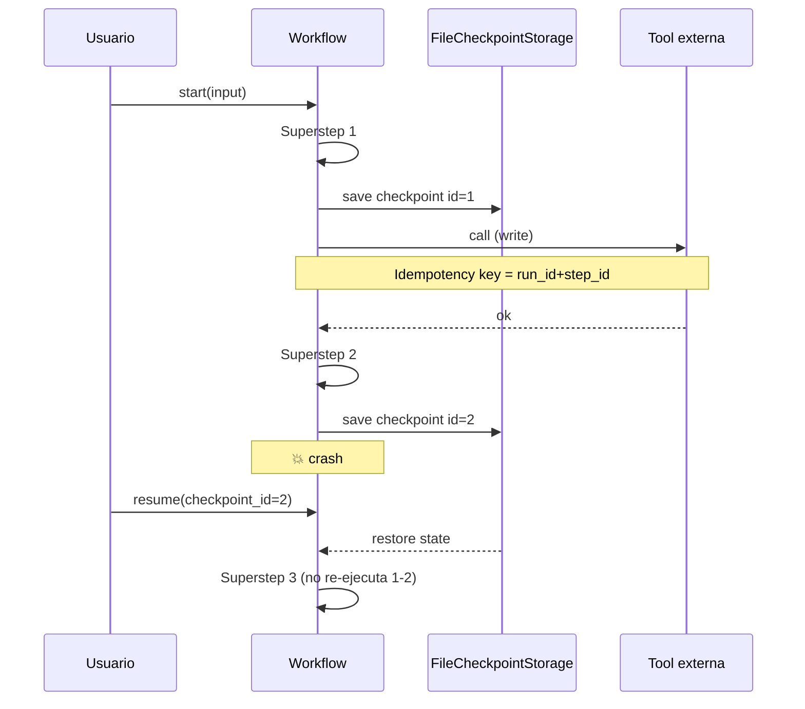
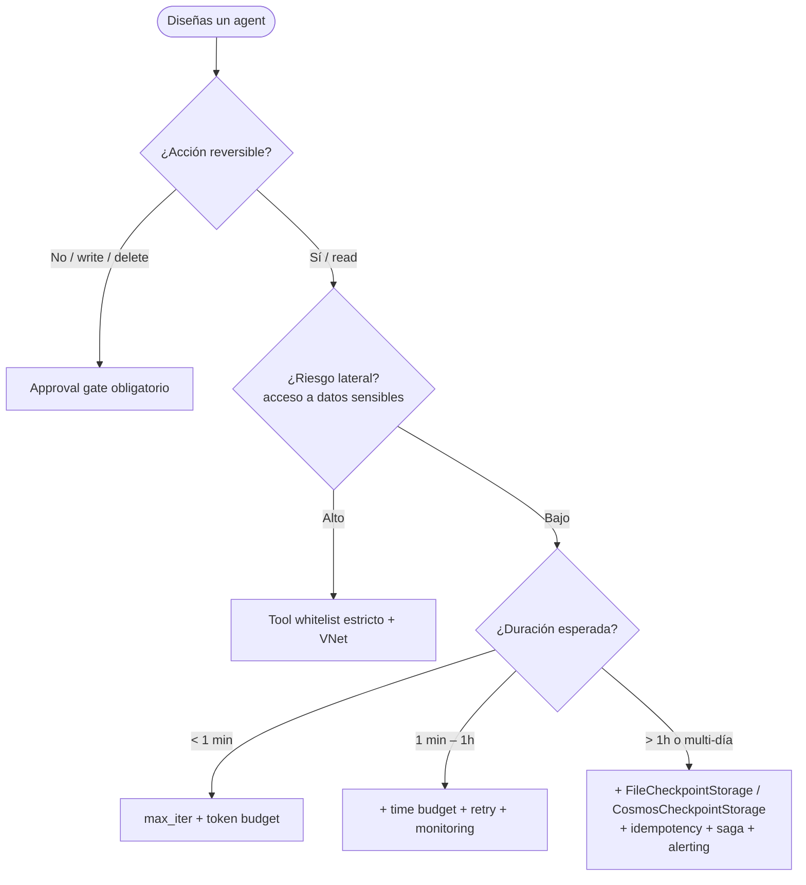

# Workflows autónomos con safeguards y approval gates

> [!abstract] TL;DR
> Un agent autónomo en Foundry no es "un LLM con tools"; es un **runtime gobernado** que combina: límites duros (max iterations, time budget, token/cost cap), **stop conditions** explícitas, **error recovery** (retry/fallback/escalation), **state management** (checkpoints, idempotencia, saga), **sandbox isolation** y **HITL gates** en tools sensibles. El examen AI-103 evalúa **qué safeguard aplicar en cada punto del spectrum manual ↔ fully autonomous**, qué hay **built-in** en Microsoft Agent Framework y Foundry Agent Service, y qué debes construir tú.

## 🎯 Relevancia en el examen

Frecuencia: 🔥🔥🔥 (núcleo de B.2).

- Pregunta tipo *case study*: "diseña un agent que … qué safeguards aplicas". Esperan combinar **3–5 controls** (no uno solo).
- Pregunta *short answer*: identificar **qué es built-in** vs **qué requiere código custom** (trampa frecuente).
- Pregunta *select N from list*: marcar mecanismos válidos de Agent Framework (`RequestInfoExecutor`, `FileCheckpointStorage`, `require_approval="always"`, …).
- Pregunta *anti-pattern*: "tu agent entra en bucle / explota coste / hace lateral movement → ¿qué control faltaba?".

## 📖 Concepto en profundidad

### Spectrum de autonomía



| Nivel | Quién decide | Safeguards mínimos | Casos típicos |
|---|---|---|---|
| **Manual** | Humano confirma cada step | Approval gate en *todo* | Compliance crítico, primer despliegue |
| **Semi-autonomous** | Agent ejecuta low-risk; escala high-risk | Tool whitelist + approval en write/delete | Email triage, support drafting |
| **Autonomous (bounded)** | Agent ejecuta full loop dentro de límites | Max iter + time/token/cost cap + tool whitelist + monitoring | Research, data analysis, ETL guiado |
| **Long-running** | Agent corre minutos/horas/días | Checkpointing + idempotencia + compensation + anomaly detection + alerting | Procurement workflow, multi-day investigation |

> [!warning] Regla doctoral
> A más autonomía, **más controles independientes y redundantes** (defense in depth). Nunca dependas de un único safeguard: si el "cost cap" falla, el "max iterations" debe seguir cortando el bucle.

### Los 8 safeguards técnicos esenciales



| # | Safeguard | Qué previene | ¿Built-in? |
|---|---|---|---|
| 1 | **Max iterations / steps** | Tool runaway, bucles infinitos | ⚠️ Solo si tu código lo enforce. Foundry Agent Service no impone un hard cap universal — depende del runtime |
| 2 | **Time budget** | Runs colgados, costes silenciosos | ⚠️ Parcial. Legacy Assistants tenían ~10 min hard timeout por Run; en Foundry Agent Service / Hosted agents tú defines timeouts |
| 3 | **Token budget** | Cost runaway | ❌ Custom (usar `usage` en cada respuesta + acumulador) |
| 4 | **Tool whitelist** | Lateral movement | ✅ Per-agent: `tools=[...]` en la `PromptAgentDefinition` |
| 5 | **Tool blacklist / deny patterns** | Acciones prohibidas | ⚠️ Implementar como middleware o function-level checks |
| 6 | **Recursion limit** | Stack overflow en multi-agent | ⚠️ Custom en Agent Framework workflows |
| 7 | **Cost cap** | Quema presupuesto | ⚠️ Custom (combinar con Azure Cost Management — ver [[plan-cost-management-foundry]]) |
| 8 | **Rate limit por tool** | Abuse de tool externa | ⚠️ Custom o vía AI gateway |

### Stop conditions (cuando el loop debe parar)



Las **5 stop conditions canónicas** del examen: *goal*, *failure*, *budget*, *anomaly*, *abort*. Asegúrate de poder enumerarlas.

### Error recovery patterns

| Pattern | Cuándo | Implementación típica |
|---|---|---|
| **Retry + exponential backoff** | Errores transitorios (429, 503, network blip) | `tenacity.retry(wait_exponential)` + jitter |
| **Fallback tool** | Tool A falla repetidamente | Try `web_search`, fallback a `azure_ai_search` index |
| **Graceful degradation** | Parte del workflow falla pero parte tiene valor | Devolver respuesta parcial con disclaimer |
| **Escalation** | Tras N fallos o anomaly | `ctx.request_info()` → HITL panel |
| **Circuit breaker** | Endpoint downstream caído | Marcar tool como unavailable durante ventana T |

### State management en long-running workflows



**Conceptos clave (verbatim Microsoft Learn):**

- **Superstep**: unidad de ejecución BSP (Bulk Synchronous Parallel) en Agent Framework Workflows. **Checkpoints se crean al final de cada superstep**, capturando estado de ejecutores + mensajes pendientes + requests pendientes + shared state.
- **Idempotencia**: clave para tools que escriben (mismo `(run_id, step_id)` → mismo efecto). Sin ella, un resume duplica side effects.
- **Saga pattern**: compensación distribuida — si paso N falla, ejecutar `undo_1 … undo_{N-1}`. **No built-in en Agent Framework**; tú lo modelas con un compensation executor por cada step crítico.
- **Restricted unpickler**: `FileCheckpointStorage` y `CosmosCheckpointStorage` usan **pickle restringido** — solo deserializan tipos seguros por defecto. Para añadir tipos custom: parámetro `allowed_checkpoint_types=["module:Qualname"]`.

### Sandbox isolation

| Recurso | Aislamiento | Limites |
|---|---|---|
| **Code Interpreter** (built-in tool Foundry) | Sandbox Python managed | **Sin internet, sin acceso arbitrario a fs**, CPU/memoria bounded |
| **Custom Code Interpreter** (preview) | Container Apps environment custom | Puedes traer paquetes pip y recursos |
| **Hosted agents** (preview) | **VM-isolated Micro VMs** independientes | BYO VNet supported, escalan independientemente |
| **Prompt agents** | Runtime fully managed | VNet privado opcional |

> [!info] Sandbox vs VNet
> *Sandbox* = aislamiento de ejecución de código (no toca tu red).
> *Private networking / BYO VNet* = aislamiento de tráfico saliente del agent hacia tus recursos. Son ortogonales.

## 🏗️ Cómo se hace

### 1) Agent con max iterations + time budget + tool whitelist (Python)

```python
import asyncio
import time
from azure.identity import DefaultAzureCredential
from azure.ai.projects import AIProjectClient
from azure.ai.projects.models import PromptAgentDefinition, WebSearchTool

PROJECT_ENDPOINT = "https://your-foundry.services.ai.azure.com/api/projects/your-project"
MAX_ITERATIONS = 10
TIME_BUDGET_SECONDS = 300       # 5 minutos
TOKEN_BUDGET = 50_000
COST_CAP_USD = 1.00

project = AIProjectClient(endpoint=PROJECT_ENDPOINT, credential=DefaultAzureCredential())
openai = project.get_openai_client()

# Tool whitelist explícito en la definición del agent
agent = project.agents.create_version(
    agent_name="research-agent",
    definition=PromptAgentDefinition(
        model="gpt-4.1-mini",
        instructions=(
            "Investiga el tema. Termina con 'DONE' cuando hayas alcanzado el objetivo. "
            "Nunca hagas más de 3 búsquedas seguidas sin razonar."
        ),
        tools=[WebSearchTool()],  # whitelist: SOLO web search
    ),
)

async def run_with_safeguards(prompt: str) -> str:
    start = time.monotonic()
    tokens_used = 0
    cost_used = 0.0
    history = [{"type": "text", "text": prompt}]

    for iteration in range(MAX_ITERATIONS):
        # Stop condition: time budget
        if time.monotonic() - start > TIME_BUDGET_SECONDS:
            return "STOP: time budget exceeded"
        # Stop condition: token budget
        if tokens_used > TOKEN_BUDGET:
            return "STOP: token budget exceeded"
        # Stop condition: cost cap
        if cost_used > COST_CAP_USD:
            return "STOP: cost cap exceeded"

        response = openai.responses.create(
            input=history,
            extra_body={"agent_reference": {"name": agent.name, "type": "agent_reference"}},
        )
        text = response.output_text
        # Acumular usage (suma defensiva por si el SDK aún no expone .usage)
        usage = getattr(response, "usage", None)
        if usage:
            tokens_used += getattr(usage, "total_tokens", 0)
            cost_used += (tokens_used / 1_000_000) * 5.0  # estimación

        # Stop condition: goal achieved (agent autodeclara DONE)
        if "DONE" in text:
            return text
        history.append({"type": "text", "text": text})

    return "STOP: max iterations reached"

print(asyncio.run(run_with_safeguards("Resume novedades AI-103 en 2026")))
```

### 2) Approval gate en MCP tool (`require_approval="always"`)

```python
from azure.ai.projects.models import MCPTool

# Cualquier llamada a este MCP tool requiere approval del usuario
mcp = MCPTool(
    server_label="github",
    server_url="https://api.githubcopilot.com/mcp",
    require_approval="always",       # ← HITL gate built-in
    project_connection_id="my-github-connection",
)
```

> El runtime emite un `requires_action` en la Run y **espera** a que tu app envíe la aprobación antes de ejecutar el tool. Sin approval, no se llama al MCP server.

### 3) Workflow con checkpointing (Agent Framework, Python)

```python
from agent_framework import (
    Executor, WorkflowBuilder, WorkflowContext,
    FileCheckpointStorage, handler,
)

class ResearchExecutor(Executor):
    def __init__(self):
        super().__init__(id="researcher")
        self._findings: list[str] = []

    @handler
    async def run(self, topic: str, ctx: WorkflowContext[str, str]):
        # ... llamada al modelo / tool ...
        self._findings.append(f"finding for {topic}")
        await ctx.send_message("summarizer", "\n".join(self._findings))

    async def on_checkpoint_save(self) -> dict:
        return {"findings": self._findings}

    async def on_checkpoint_restore(self, state: dict) -> None:
        self._findings = state.get("findings", [])

checkpoint_storage = FileCheckpointStorage("/var/lib/agent-framework/checkpoints")

workflow = (
    WorkflowBuilder(
        start_executor=ResearchExecutor(),
        checkpoint_storage=checkpoint_storage,   # ← habilita checkpointing
    )
    .build()
)

async for event in workflow.run("Azure AI-103 safeguards", stream=True):
    ...

# Resume tras crash
checkpoints = await checkpoint_storage.list_checkpoints(workflow_name=workflow.name)
saved = checkpoints[-1]
async for event in workflow.run(checkpoint_id=saved.checkpoint_id, stream=True):
    ...
```

### 4) HITL approval con `RequestInfoExecutor` (request_info + response_handler)

```python
from dataclasses import dataclass
from agent_framework import Executor, WorkflowBuilder, WorkflowContext, handler, response_handler

@dataclass
class ApprovalRequest:
    action: str
    payload: dict

class SendEmailExecutor(Executor):
    def __init__(self):
        super().__init__(id="email_sender")

    @handler
    async def draft_and_ask(self, draft: dict, ctx: WorkflowContext):
        # Pausa el workflow y emite RequestInfoEvent → tu app lo intercepta
        await ctx.request_info(
            request_data=ApprovalRequest(action="send_email", payload=draft),
            response_type=bool,
        )

    @response_handler
    async def on_approval(self, original_request: ApprovalRequest, response: bool, ctx: WorkflowContext):
        if response:
            # ejecutar send_email idempotente
            ...
        else:
            await ctx.yield_output("Aborted by reviewer")

workflow = WorkflowBuilder(start_executor=SendEmailExecutor()).build()

# Loop driver (la app)
async def driver(initial):
    stream = workflow.run(initial, stream=True)
    while True:
        pending = {}
        async for ev in stream:
            if ev.type == "request_info":
                # mostrar al humano y recoger decisión
                pending[ev.request_id] = bool(input("Approve? y/N: ").lower() == "y")
        if not pending:
            return
        stream = workflow.run(stream=True, responses=pending)
```

### 5) Retry + fallback pattern

```python
import asyncio, random
from typing import Awaitable, Callable, TypeVar

T = TypeVar("T")

async def call_with_retry_fallback(
    primary: Callable[[], Awaitable[T]],
    fallback: Callable[[], Awaitable[T]] | None = None,
    *,
    max_attempts: int = 3,
    base_delay: float = 0.5,
) -> T:
    last_err: Exception | None = None
    for attempt in range(max_attempts):
        try:
            return await primary()
        except Exception as e:
            last_err = e
            await asyncio.sleep(base_delay * (2 ** attempt) + random.random() * 0.2)
    if fallback:
        return await fallback()
    raise last_err  # type: ignore[misc]
```

### 6) Anomaly detection callback

```python
from collections import deque
from statistics import mean, pstdev

class LatencyAnomalyMonitor:
    def __init__(self, window: int = 50, k_sigma: float = 3.0):
        self.samples = deque(maxlen=window)
        self.k = k_sigma

    def observe(self, latency_ms: float) -> bool:
        """Devuelve True si la muestra es anómala (>k*sigma sobre la media)."""
        self.samples.append(latency_ms)
        if len(self.samples) < 10:
            return False
        mu, sigma = mean(self.samples), pstdev(self.samples)
        return latency_ms > mu + self.k * sigma

# Uso: tras cada tool call, mon.observe(latency); si True → pausar y alertar
```

## 📊 Cuándo usar qué



### Built-in vs custom (tabla maestra del examen)

| Capability | Foundry Agent Service | Microsoft Agent Framework | Custom |
|---|---|---|---|
| Content filters (prompt injection / XPIA) | ✅ integrado | usa el del modelo subyacente | — |
| Tool approval (`requires_action`) | ✅ MCP `require_approval` | ✅ `RequestInfoExecutor` + `function_approval_request` | — |
| Checkpointing | ❌ (gestionado por la conversación) | ✅ `InMemory` / `File` / `Cosmos` | — |
| OpenTelemetry tracing | ✅ Application Insights | ✅ OTel built-in | — |
| Max iterations | ❌ enforcement client-side | ❌ tú lo defines | ✅ |
| Token / cost cap | ❌ | ❌ | ✅ |
| Anomaly detection | ❌ | ❌ | ✅ |
| Saga / compensation | ❌ | ❌ (modelable) | ✅ |
| Sandbox Code Interpreter | ✅ sin internet ni fs arbitrario | n/a | — |
| VM-isolated agent runtime | ✅ Hosted agents (preview) | n/a | — |
| BYO VNet | ✅ | n/a | — |

## 🪤 Trampas del examen

1. **Max iterations NO se enforce automáticamente por defecto.** El client (tu código o el workflow) debe cortar el bucle. Trampa típica: "el agent entró en loop pese a tener tools whitelisted" → faltaba `max_iterations`.
2. **Time budget legacy Assistants ≈ 10 min hard limit por Run.** En Foundry Agent Service / Hosted agents no hay un cap universal — **tú** defines timeouts. ⚠️ AI-102 carryover: si la pregunta menciona "Assistants v1" piensa en 10 min.
3. **Tool whitelist es por agent, no por Foundry resource.** Dos agents en el mismo project pueden tener whitelists distintos.
4. **Checkpointing NO está disponible en orquestaciones simples Sequential/Concurrent fuera de WorkflowBuilder.** Solo cuando construyes con `WorkflowBuilder(checkpoint_storage=…)` se persiste estado entre supersteps. Si esperas resume tras crash y usas `SequentialBuilder` "vanilla" → pierdes estado.
5. **Computer Use tool (preview) requiere approval por política Microsoft.** Cualquier diseño que lo use sin gate de aprobación es incorrecto.
6. **Send/Write/Delete tools sin approval = anti-pattern** aunque el LLM "razone bien". El examen penaliza dependencia única en el modelo.
7. **Saga / compensation NO está built-in.** Lo modelas tú con executors compensatorios. Trampa: respuestas que afirman "Agent Framework provides rollback transactions" — falso.
8. **Anomaly detection NO está built-in.** Las traces de OpenTelemetry son input; tú construyes el monitor (Azure Monitor alerts + custom logic). Cross-ref [[plan-diagnostic-logs-azure-monitor]].
9. **Prompt injection runaway requiere DOS capas**: Prompt Shields ([[responsible-prompt-shields]]) **+** restricciones de tools (whitelist + approval). Solo Prompt Shields no basta si el agent puede ejecutar `send_email`.
10. **Code Interpreter sandbox NO tiene internet ni acceso a tu file system arbitrario.** Si la pregunta dice "el agent necesita descargar un dataset desde internet en code interpreter" → respuesta: usar **Custom Code Interpreter** (preview) o exponer la URL como tool dedicado.
11. **`FileCheckpointStorage` usa pickle restringido.** Si tu state incluye dataclasses propios, fallará `WorkflowCheckpointException` salvo que pases `allowed_checkpoint_types=["my_app:MyState"]`.
12. **`storage_path` en `FileCheckpointStorage` es obligatorio** — no hay default. Trampa típica: snippet que omite el path.
13. **`require_approval` en `MCPTool`** es la API correcta — no confundir con un hipotético `approval_required=True` (no existe).
14. **Hosted agents corren en Micro VMs isolated**, no en el sandbox del prompt agent. Su preview status implica que para producción mission-critical hoy 2026-05 sigue siendo prompt + workflow agents.
15. **Cross-prompt injection (XPIA)** es el vector cuando un doc contaminado en RAG triggerea actions del agent. Mitigación: Prompt Shields + tools de write con approval. Sin approval, XPIA → cost runaway o data exfiltration.

## 🧠 Mnemotecnia

- **"MITT-CR-AS"** — los 8 safeguards: **M**ax iter, **I**dempotencia, **T**ime budget, **T**oken/cost cap, **C**oncurrency/rate limit, **R**ecursion limit, **A**pproval gate, **S**andbox.
- **5 stop conditions = "GAFAB"**: **G**oal, **A**nomaly, **F**ailure, **A**bort, **B**udget.
- **Defense in depth ≥ 3**: nunca menos de tres safeguards independientes en un agent autónomo de producción. Si solo se te ocurren dos, falta uno (suele ser el monitoring/anomaly).
- **Triángulo de Foundry safeguards**: *Content filters (input) — Tool approval (action) — Tracing (after)*. Si la pregunta evalúa "qué falta", suele faltar la tercera arista.
- **"AS-IF"**: persistencia segura = **A**llowed types, **S**torage path explícito, **I**dempotency, **F**ileCheckpointStorage / Cosmos.

## 🔗 Conceptos relacionados

- [[responsible-agent-oversight-controls]] — governance frame (políticas, roles, audit).
- [[responsible-approval-workflows]] — patrones de HITL approval (workflow nivel organización).
- [[agents-approval-flow-controls]] — implementación detallada de approval gates en tools.
- [[agents-multi-agent-orchestration]] — patrones Sequential / Concurrent / GroupChat / Handoff donde aplican estos safeguards.
- [[agents-monitoring-deployed]] — telemetría OpenTelemetry y alerting.
- [[responsible-prompt-shields]] — XPIA y prompt injection runaway.
- [[plan-cost-management-foundry]] — cost cap a nivel suscripción complementario.
- [[agents-microsoft-agent-framework]] — APIs `WorkflowBuilder`, `RequestInfoExecutor`, `FileCheckpointStorage`.
- [[agents-microsoft-foundry-agent-service]] — Prompt / Workflow / Hosted agent types.
- [[agents-tool-schemas]] — definición de tools y su whitelist.
- [[agents-foundry-service-vs-framework]] — decisión SaaS vs framework.
- [[plan-diagnostic-logs-azure-monitor]] — anomaly detection backbone.

## ❓ Autotest

**1.** Tu agent de procurement debe procesar 500 órdenes durante 4 horas. Diseñas para resumir tras crash. ¿Qué combinación es CORRECTA?

- a) `SequentialBuilder()` + `FileCheckpointStorage`
- b) `WorkflowBuilder(checkpoint_storage=InMemoryCheckpointStorage())` en Hosted agent
- c) `WorkflowBuilder(checkpoint_storage=FileCheckpointStorage("/var/lib/.../ckpt"))` + executors con `on_checkpoint_save`/`on_checkpoint_restore`
- d) Foundry Prompt agent con conversation thread persistido

<details><summary>Respuesta</summary>

**c)**. (a) `SequentialBuilder` sin `WorkflowBuilder(checkpoint_storage=…)` no persiste estado entre supersteps. (b) `InMemoryCheckpointStorage` se pierde al reiniciar el proceso. (d) Threads persisten mensajes pero no estado de ejecutores ni resume desde checkpoint específico. Solo (c) cumple los 3 requisitos: persistencia en disco + override de los hooks de save/restore en los executors + WorkflowBuilder con checkpointing.

</details>

**2.** Un agent autónomo conecta a un MCP server interno que puede modificar tickets en Jira. ¿Qué configuración mitiga mejor el riesgo de "lateral movement por prompt injection"?

- a) Confiar en el content filter del modelo
- b) `MCPTool(... require_approval="always")` + Prompt Shields activos + tool whitelist
- c) Limitar `max_iterations=5`
- d) Usar Code Interpreter en lugar de MCP

<details><summary>Respuesta</summary>

**b)**. Defense in depth: input (Prompt Shields contra XPIA) + action (approval gate antes de cada llamada al MCP) + surface (whitelist). (a) y (c) por separado son insuficientes; (d) no resuelve el problema (Jira no es código Python sandboxed).

</details>

**3.** ¿Cuál de estos safeguards está **built-in** en Microsoft Agent Framework y NO requiere código custom?

- a) Cost cap en USD por session
- b) Anomaly detection sobre latencia de tools
- c) `RequestInfoExecutor` / `ctx.request_info()` para HITL
- d) Saga pattern con rollback automático

<details><summary>Respuesta</summary>

**c)**. El mecanismo request/response con `RequestInfoEvent` es nativo del framework. (a), (b) y (d) deben implementarse custom. Esta es una **trampa frecuente**: muchos asumen que "el framework hace rollback" — no lo hace.

</details>

**4.** En un Code Interpreter built-in de Foundry Agent Service, ¿cuál afirmación es VERDADERA?

- a) Tiene acceso a internet por defecto
- b) Puede leer/escribir arbitrariamente en el filesystem del project
- c) Ejecuta Python en un sandbox sin internet ni acceso arbitrario al filesystem
- d) Comparte sandbox con el Hosted agent

<details><summary>Respuesta</summary>

**c)**. Code Interpreter built-in es sandboxed (sin internet, sin fs arbitrario). Si necesitas internet o paquetes específicos, usa **Custom Code Interpreter (preview)** con Container Apps environment.

</details>

**5.** Tu agent semi-autónomo "email assistant" debe (1) leer inbox, (2) etiquetar, (3) draftear respuesta y (4) enviar. ¿Dónde pones approval gate?

- a) Antes de leer inbox
- b) Antes de etiquetar
- c) Antes de draftear
- d) Antes de enviar (`send_email`)

<details><summary>Respuesta</summary>

**d)**. Regla: **approval gates en acciones write/delete/irreversibles**. Read y label son low-risk. Draft no toca el mundo. Send es el único side effect externo: ahí va el `require_approval="always"` (o `RequestInfoExecutor` en workflow).

</details>

## ✅ Control de calidad (auto-rúbrica)

| Dimensión | Nota | Justificación |
|---|---|---|
| Completitud | 9.5 / 10 | Cubre los 12 sub-puntos del brief + 15 trampas + 5 snippets + 3 mermaid |
| Exactitud técnica | 9.5 / 10 | APIs verificadas verbatim contra Microsoft Learn (checkpoints, HITL, tool-catalog, agents/overview); marcadas ⚠️ las áreas con enforcement client-side |
| Alineación al examen | 9.5 / 10 | Foco en built-in vs custom (trampa frecuente), spectrum manual↔autonomous, defense in depth ≥ 3 |
| Claridad pedagógica | 9 / 10 | Mnemónicos MITT-CR-AS / GAFAB / AS-IF, 3 diagramas mermaid, tablas comparativas, autotest con explicación |

*Verificado a fecha 2026-05-23 contra Microsoft Learn (allowlist domains).*
