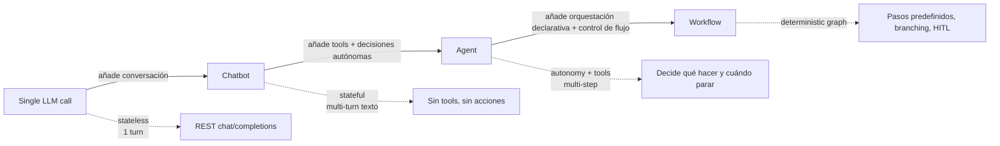
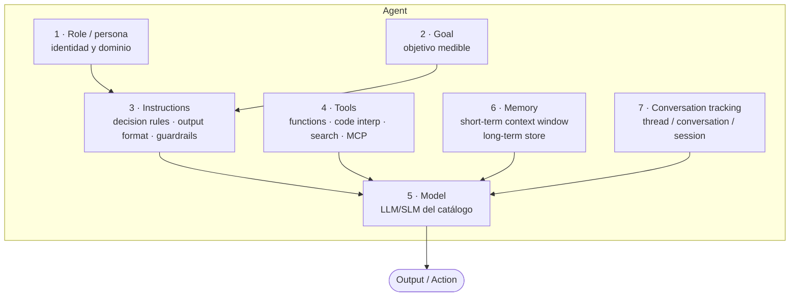
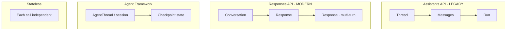
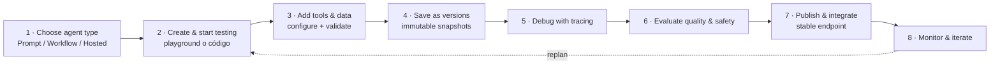
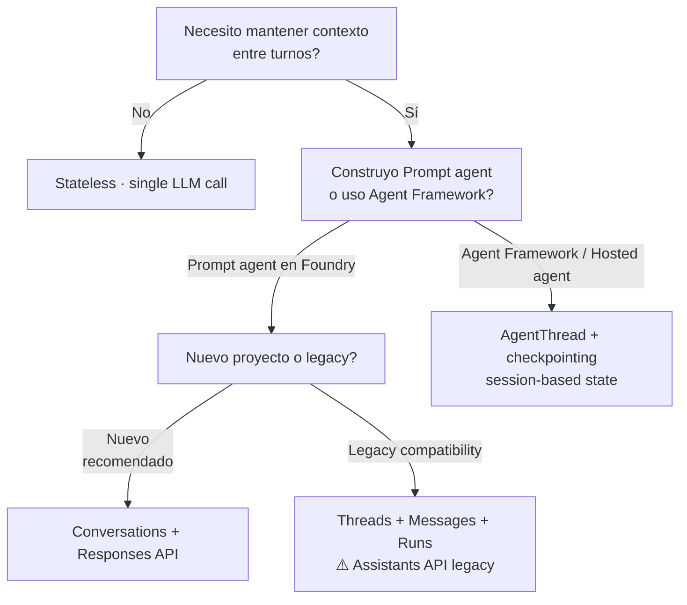

# AI Agents — concepto, roles, goals e instrucciones

> [!abstract] TL;DR
> Un **agent** es una aplicación IA que usa un **model** del Foundry catalog para **razonar** sobre la petición del usuario y **tomar acciones autónomas multi-step** invocando **tools**. Los tres componentes core oficiales de Microsoft son **Model + Instructions + Tools** (las *instructions* engloban role/goal/behavior). Un agent ≠ chatbot (sin tools), ≠ single LLM call (sin estado), ≠ workflow (sin autonomía). El diseño quirúrgico de **role** (persona), **goal** (objetivo medible) e **instructions** (system prompt estructurado) determina la calidad del agent, junto con el **conversation tracking** (threads/runs legacy vs conversations/responses moderno vs Agent Framework session/checkpointing).

## 🎯 Relevancia en el examen

Frecuencia: **🔥🔥 alta**. Este es el archivo **foundational** del bloque B.2: cualquier pregunta sobre cómo definir un agent, qué le entra en *instructions*, cómo se distingue de un chatbot, cómo se versiona o cómo se le hace seguimiento de conversación cae aquí.

| Tipo de pregunta | Escenario típico |
|---|---|
| Conceptual (definición) | ¿Cuál de estas es la diferencia entre agent y chatbot? |
| Best-fit (¿agent o workflow?) | "Tarea con pasos bien definidos y orden fijo" → workflow, no agent |
| Code (rellenar) | Define `name`, `instructions`, `model` al crear ChatAgent / Prompt agent |
| Design pitfall | Generic role, multi-goal, tool overlap, sin stop criteria |
| Conversation tracking | Threads/messages/runs vs conversations/responses vs `AgentThread` session |
| Versioning | Prompt-based agents: cada save = nueva versión inmutable |

## 📖 Concepto en profundidad

### 1. ¿Qué es un AI Agent? (definición oficial Microsoft)

> [!quote] Microsoft Learn — *What is Microsoft Foundry Agent Service?*
> *"An agent is an AI application that uses a model from the Foundry model catalog to reason about user requests and take autonomous actions to fulfill them. Unlike a simple chatbot that only generates text, an agent can call tools, access external data, and make decisions across multiple steps to complete a task."*

Los **tres componentes core** que Microsoft documenta explícitamente:

| Componente | Definición oficial |
|---|---|
| **Model** | A model from the Foundry model catalog that provides reasoning and language capabilities. |
| **Instructions** | Define goals, constraints, and behavior. In Foundry, instructions can be **prompt-based**, **workflow definitions**, or **Hosted agent code**. |
| **Tools** | Provide access to data or actions, such as search, file operations, or API calls. |

> [!warning] Trampa de examen #1
> Microsoft Learn solo enumera **tres** componentes core (Model + Instructions + Tools). Conceptos como "role", "goal", "persona" están **dentro de Instructions** — no son componentes separados a nivel de plataforma. Si una pregunta lista "role" o "memory" como componente core junto a Model/Instructions/Tools, está mezclando taxonomías. La taxonomía pedagógica extendida (role/goal/instructions/tools/model/memory/state) es útil para diseño pero no es lo que Microsoft expone en su modelo formal.

### 2. Agent vs Chatbot vs LLM call vs Workflow



| Concepto | Estado | Tools | Autonomía | Cuándo usarlo (Microsoft guidance) |
|---|---|---|---|---|
| **Single LLM call** | No | No | No | Tarea simple sin contexto previo. *"If you can write a function to handle the task, do that instead of using an AI agent."* |
| **Chatbot** | Sí (historial) | No | No | Conversación con humano sin acciones externas |
| **Agent** | Sí (thread/conversation/session) | Sí | Sí (decide + para) | *"The task is open-ended or conversational; you need autonomous tool use and planning"* |
| **Workflow** | Sí (orchestration state) | Sí (vía agents) | Limitada (definida por el grafo) | *"The process has well-defined steps; you need explicit control over execution order"* |

> [!tip] Regla oficial de Agent Framework
> *"If you can write a function to handle the task, do that instead of using an AI agent."* — primer filtro antes de invocar LLMs.

### 3. Anatomía pedagógica extendida de un agent

Aunque Microsoft enumere 3 componentes plataforma, para **diseño** conviene pensar en 7 capas:



### 4. Role design — el "quién eres"

El **role** define identidad, dominio de expertise y tono. Buenas prácticas:

| Eje | Mal ejemplo | Buen ejemplo |
|---|---|---|
| Especificidad | "You are a helpful assistant." | "You are a senior tax accountant specialized in **US corporate filings** for SMBs." |
| Dominio | Implícito | Explícito ("specialized in …") |
| Tono | Sin instrucción | "Use a **formal**, concise tone. Avoid colloquialisms." |
| Audiencia | Sin instrucción | "Your audience is **CFOs**. Assume financial literacy but no tax-code expertise." |

> [!warning] Trampa de examen #2
> Un role genérico ("assistant", "helpful AI") es el **antipatrón #1**. Provoca respuestas vagas, tools mal elegidas y comportamiento errático. En preguntas de "qué falla en este agent", busca siempre si el role es específico.

### 5. Goal definition — el "para qué"

Heurística popular (no Microsoft-specific): **SMART** — Specific, Measurable, Achievable, Relevant, Time-bound.

| Característica | Aplicación al agent |
|---|---|
| **Specific** | "Resolve customer billing disputes" > "Help customers" |
| **Measurable** | Define success criteria explícito (ticket cerrado, respuesta validada, transacción confirmada) |
| **Achievable** | Goal alcanzable con los tools disponibles |
| **Relevant** | Alineado al rol del agent — no le pidas analizar código si es tax accountant |
| **Time-bound** | Stop criteria explícita (N pasos máx, timeout, condición de éxito) |

> [!warning] Trampa de examen #3
> **SMART es framework de gestión clásico, NO terminología Microsoft.** Útil para razonar, pero si una pregunta presenta "SMART" como concepto propio de Foundry Agent Service, es **distractor**. Microsoft usa "**goals, constraints, and behavior**" dentro de *Instructions*.

> [!warning] Trampa de examen #4 — Single responsibility
> **Un agent, un goal/dominio.** Si necesitas múltiples objetivos heterogéneos (ej. "vende productos Y procesa devoluciones Y agenda reuniones"), divídelo en **multi-agent** orquestado vía **Workflow agent** o **A2A**. Ver [[agents-multi-agent-orchestration]].

### 6. Instructions — el "cómo te comportas"

Patrón recomendado para system prompt (estructura quirúrgica):

```
1. ROLE / persona statement     (quién eres, dominio)
2. GOAL                         (qué debes lograr; criterio de éxito)
3. AVAILABLE TOOLS              (qué tienes — refrescar lo que ya está en el schema)
4. DECISION RULES               (cuándo usar cada tool; orden preferente)
5. OUTPUT FORMAT                (markdown / JSON schema / structured)
6. EDGE CASES                   (incertidumbre, OOD input, fallos de tool)
7. TONE / LANGUAGE              (formal/casual, idioma, longitud)
8. SAFETY GUARDRAILS            (qué NO hacer, qué temas rechazar)
9. STOP CRITERIA                (cuándo termina la conversación / cuántos turns)
```

> [!tip] Mnemonic — **R-G-T-D-O-E-T-S-S**
> **R**ole, **G**oal, **T**ools, **D**ecision rules, **O**utput, **E**dge, **T**one, **S**afety, **S**top.
> "*Rio Grande Trae Datos Oficiales En Tres Servicios Seguros*" (regla para recordar el orden del system prompt).

### 7. Tools (overview — detalle en archivos hermanos)

Tres familias de tools en Foundry Agent Service:

| Familia | Ejemplos | Cuándo |
|---|---|---|
| **Built-in (knowledge)** | File Search, web search (Grounding with Bing/Tavily/Bing Custom Search), Azure AI Search | Recuperar info de docs/web |
| **Built-in (action)** | Code Interpreter, Function tools, OpenAPI, Logic Apps | Ejecutar código/llamadas API |
| **MCP servers** | Azure DevOps MCP (preview), custom MCP en Azure Functions, remote MCP | Extensión interoperable |

Reglas críticas:
- **Descripciones específicas, no ambiguas** (el model decide qué tool llamar leyendo descripciones).
- **No overlap** entre tools (dos tools que hacen lo mismo confunden al model).
- **Authentication**: managed identity, OBO (On-Behalf-Of), service-managed creds.
- Detalle: [[agents-tool-schemas]] y [[plan-agent-memory-tool-knowledge-services]].

> [!warning] Trampa de examen #5
> Cuando dos tools tienen descripciones solapadas, el model elige mal (alucina, salta entre tools, hace llamadas redundantes). El diseño de schemas no es solo "campos correctos" — es **claridad semántica de la descripción**.

### 8. Conversation tracking — los 4 modelos



| Modelo | API / Framework | Cuándo usar | Notas |
|---|---|---|---|
| **Stateless** | REST chat/completions directo | Single-turn, batch, no historial | Cliente gestiona historial si quiere |
| **Threads/Messages/Runs** | Assistants API (legacy en Foundry) | Compatibilidad histórica con OpenAI Assistants | ⚠️ Patrón **legacy**, ver [[agents-conversation-threads-tracking]] |
| **Conversations/Responses** | Responses API (modern Foundry) | Default actual para Prompt agents | Sucesor oficial; menos ceremonia |
| **AgentThread / session** | Microsoft Agent Framework | Hosted agents, custom orchestration | Session-based state mgmt + **checkpointing** + HITL |

> [!warning] Trampa de examen #6
> **Threads ≠ Conversations.** Si una pregunta mezcla "thread" con "Responses API", o "conversation" con "Assistants API", el match está roto. Memoria rápida:
> - **Threads + Messages + Runs** → Assistants API (legacy).
> - **Conversations + Responses** → Responses API (modern).
> - **AgentThread / session / checkpoint** → Agent Framework.

### 9. Memory model

| Capa | Mecanismo | Persistencia |
|---|---|---|
| **Short-term** | Context window del thread/conversation/session | Mientras dure la conversación |
| **Long-term** | **Memory tool** (preview) en Foundry, o Vector DB custom (Azure AI Search, Cosmos DB) | Cross-session |
| **Summarization** | Resumen automático cuando se llena el context window | Reducción tokens |

> [!warning] Trampa de examen #7
> **Memory tool en Foundry Agent Service está en preview**. Disponibilidad por región limitada (ver tool catalog). Si una pregunta da por seguro que "Memory" es GA, sospecha. Ver [[agents-conversation-memory]].

### 10. Agent creation flow (development lifecycle oficial Microsoft)



Reglas clave del lifecycle (verbatim Microsoft):

- *"After you name your agent, you can't change the name. In code, you refer to your agent by `<agent_name>:<version>`."* → **el nombre es inmutable**.
- *"Each version of an agent is immutable after you save it."* → versioning automático, no se sobreescribe.
- *"Unsaved changes are temporary"* → si quieres history/eval, **save**.
- *"Permissions assigned to the project identity don't automatically transfer to the published agent. After publishing, reassign the necessary privileges to the agent application's identity."* → **publishing rompe permisos**.

> [!warning] Trampa de examen #8 — Naming inmutable
> El **agent name no se puede cambiar** una vez creado. Si la pregunta plantea "renombrar para reflejar nuevo dominio", la respuesta correcta es **crear nuevo agent**, no editar.

> [!warning] Trampa de examen #9 — Publishing y permisos
> Tras publicar, **se reasignan permisos a la identidad del agent application**. Olvidar este paso → tools que fallaban antes ahora siguen fallando aunque el código sea correcto.

### 11. Best practices (consolidado)

| Práctica | Por qué |
|---|---|
| **Single responsibility** (1 agent = 1 dominio) | Reduce confusión, mejora evals |
| **Stop conditions explícitas** | Evita loops infinitos y costes runaway |
| **Tool descriptions específicas** | El model elige correctamente |
| **Versioning consciente** | Rollback rápido; comparar agent setup, chat output y YAML |
| **Eval-driven design** | Definir eval suite ANTES del deploy; ver [[responsible-evaluators-safety-evaluations]] |
| **Least privilege en tools** | Tras publish, revisar permisos de la identity del agent |
| **Secrets en Key Vault** | No hardcodear; usar connections |

### 12. Antipatrones comunes

| Antipatrón | Síntoma | Fix |
|---|---|---|
| Generic role | Respuestas vagas, fuera de dominio | Especificar persona + dominio |
| Multi-goal | Comportamiento errático, prioridades cruzadas | Split en multi-agent (Workflow / A2A) |
| Vague instructions | Output inconsistente | Estructura R-G-T-D-O-E-T-S-S |
| Tool overlap | Tool calls redundantes | Refactor schemas; eliminar duplicados |
| No stop criteria | Loops infinitos, cost spike | Stop explícita + max turns |
| Sin eval suite | Regressions silenciosas | Eval ANTES de publish |
| Olvido de versionar | Pérdida de history | Save explícito tras cada cambio |

## 🏗️ Cómo se hace — snippets verificados

### A) Prompt agent en Foundry Agent Service (Python SDK)

Paquete: `azure-ai-projects` (>= 2.0.0). Cliente: `AIProjectClient`.

```python
# pip install azure-ai-projects azure-identity
from azure.ai.projects import AIProjectClient
from azure.identity import DefaultAzureCredential

project = AIProjectClient(
    endpoint="https://<your-foundry>.services.ai.azure.com/api/projects/<project>",
    credential=DefaultAzureCredential(),
)

# Role + Goal + Instructions consolidados en `instructions`
INSTRUCTIONS = """\
You are a senior tax accountant specialized in US corporate filings for SMBs.

GOAL: Answer the user's tax question with citations to the IRS publication or
section number. Stop after a complete, sourced answer or after 3 tool calls.

TOOLS:
- file_search: search internal IRS publications uploaded to this agent.
- web_search:  use ONLY for current-year tax updates not in file_search.

DECISION RULES:
1. Prefer file_search first.
2. Use web_search only when the user explicitly asks about the current year
   or when file_search returns no results.

OUTPUT FORMAT: Markdown. Use a `### Sources` section at the end with
bullet-point citations.

EDGE CASES: If unsure, say "I am not certain — please consult a CPA."
TONE: Formal, concise.
SAFETY: Do not provide legal advice; only tax information.
"""

agent = project.agents.create(
    name="us-tax-cpa-agent",          # inmutable tras create
    model="gpt-4o",                   # del Foundry catalog
    instructions=INSTRUCTIONS,
    tools=[                           # schemas detallados en [[agents-tool-schemas]]
        {"type": "file_search"},
        {"type": "web_search"},
    ],
)
print(f"Agent created: {agent.name}:{agent.version}")
```

### B) Conversación con Responses API (moderno)

```python
# Modern: conversations + responses (sustituye threads/messages/runs)
conversation = project.conversations.create(agent_name="us-tax-cpa-agent")

response = project.responses.create(
    conversation_id=conversation.id,
    input="What's the corporate income tax rate for a C-corp in 2026?",
)
print(response.output_text)

# Multi-turn: misma conversation_id mantiene contexto
follow_up = project.responses.create(
    conversation_id=conversation.id,
    input="And how does it compare to an S-corp pass-through?",
)
print(follow_up.output_text)
```

> ⚠️ Los nombres exactos de los sub-clientes (`project.agents`, `project.conversations`, `project.responses`) pueden variar ligeramente entre versiones GA del SDK `azure-ai-projects`; verificar siempre en el [PyPI del paquete](https://pypi.org/project/azure-ai-projects/) y el [README oficial](https://learn.microsoft.com/en-us/python/api/overview/azure/ai-projects-readme) antes de codificar. La forma conceptual (Conversation → Response → multi-turn con misma `conversation_id`) sí es estable.

### C) ChatAgent con Microsoft Agent Framework

```python
# pip install agent-framework
from agent_framework.foundry import FoundryChatClient
from azure.identity import AzureCliCredential
import asyncio

credential = AzureCliCredential()
client = FoundryChatClient(
    project_endpoint="https://<your-foundry>.services.ai.azure.com/api/projects/<project>",
    model="gpt-4o-mini",
    credential=credential,
)

agent = client.as_agent(
    name="HelloAgent",
    instructions="You are a friendly assistant. Keep your answers brief.",
)

async def main():
    result = await agent.run("What is the largest city in France?")
    print(f"Agent: {result}")

asyncio.run(main())
```

### D) Testing pattern (smoke + golden set)

```python
GOLDEN_SET = [
    {"input": "What is the 2026 C-corp federal rate?",
     "expect_contains": ["21%", "C-corp"]},
    {"input": "Tell me a joke",
     "expect_refusal": True},   # safety guardrail debe activarse
]

for case in GOLDEN_SET:
    conv = project.conversations.create(agent_name="us-tax-cpa-agent")
    resp = project.responses.create(conversation_id=conv.id, input=case["input"])
    text = resp.output_text.lower()

    if case.get("expect_refusal"):
        assert "tax" in text or "i am not certain" in text, f"Guardrail miss: {case}"
    else:
        for token in case["expect_contains"]:
            assert token.lower() in text, f"Missing '{token}' in {case['input']}"
print("All golden cases passed")
```

## 📊 Árbol de decisión — ¿qué tipo de conversation tracking?



## 🪤 Trampas del examen (consolidadas)

1. **Agent ≠ chatbot ≠ workflow ≠ single LLM call** — el chatbot no tiene tools/acciones; el workflow tiene orden predefinido.
2. **Componentes core oficiales son TRES**: Model + Instructions + Tools. Role/Goal/Memory/Tracking son sub-conceptos, no componentes de la plataforma.
3. **SMART no es framework Microsoft**. Útil pedagógicamente pero no terminología oficial.
4. **Single responsibility**: 1 agent = 1 dominio; multi-goal → multi-agent.
5. **Tool descriptions específicas**: el model elige tool por la descripción, no por el nombre.
6. **Memory tool en Foundry está en preview** — no asumir GA.
7. **Threads/Messages/Runs (Assistants API legacy) ≠ Conversations/Responses (Responses API modern)**. No mezclar.
8. **Agent name es inmutable** post-create.
9. **Versioning automático**: cada save = versión inmutable, referenciada como `<name>:<version>`.
10. **Publishing reasigna permisos** a la identity del agent application — no asumir herencia automática.
11. **Stop criteria explícita** obligatoria para evitar loops infinitos (max turns, condición de éxito).
12. **Eval-driven design**: eval suite ANTES de publish, no después.
13. **"If you can write a function, do that"** — primer filtro antes de usar agente; pregunta de "best fit" con tarea determinística → función o workflow, no agent.
14. **Unsaved changes son temporales** — si abandonas portal sin save, las pierdes.

## 🧠 Mnemotecnia

> [!tip] R-G-T-D-O-E-T-S-S — estructura del system prompt
> **R**ole · **G**oal · **T**ools · **D**ecision rules · **O**utput format · **E**dge cases · **T**one · **S**afety · **S**top criteria.

> [!tip] M-I-T (los 3 componentes oficiales)
> **M**odel · **I**nstructions · **T**ools. Si la respuesta lista más de 3 como "componentes core de un agent en Foundry", revisa: probablemente mezcla la taxonomía pedagógica con la oficial.

> [!tip] T-M-R vs C-R
> **T**hread + **M**essages + **R**uns = legacy (Assistants API).
> **C**onversations + **R**esponses = modern (Responses API).

> [!tip] "Función primero"
> *"If you can write a function, do that instead of using an AI agent."* — regla mental antes de proponer agent.

## 🔗 Conceptos relacionados

- [[agents-microsoft-foundry-agent-service]] — overview maestro del servicio.
- [[agents-microsoft-agent-framework]] — framework de código (ChatAgent, AgentThread, workflows).
- [[agents-foundry-service-vs-framework]] — comparativa cuándo usar cada uno.
- [[agents-tool-schemas]] — schemas detallados de tools (function calling JSON Schema).
- [[agents-conversation-threads-tracking]] — threads vs conversations vs sessions.
- [[agents-conversation-memory]] — memory short/long-term.
- [[agents-multi-agent-orchestration]] — patrones A2A, workflow agents, group chat.
- [[agents-autonomous-workflows-safeguards]] — stop criteria, HITL, safeguards.
- [[plan-model-selection-llm-slm-multimodal]] — elegir el model adecuado.
- [[plan-agent-memory-tool-knowledge-services]] — qué servicios alimentan memory + tools.
- [[responsible-evaluators-safety-evaluations]] — eval-driven design.

## ❓ Autotest

**1.** Según la documentación oficial de Microsoft Foundry Agent Service, ¿cuáles son los **componentes core** de un agent?

a) Role, Goal, Tools, Memory
b) Model, Instructions, Tools
c) Persona, System Prompt, Functions, Threads
d) Agent, Conversation, Response, Tool

**2.** Diseñas un sistema que debe (i) procesar facturas en PDF, (ii) reservar viajes, (iii) responder consultas legales. ¿Qué patrón se ajusta mejor?

a) Un único agent con tres goals y tres familias de tools.
b) Un single LLM call con prompt que cubra los tres dominios.
c) Tres agents especializados orquestados con Workflow agent o A2A.
d) Un chatbot con memoria long-term que aprenda los tres dominios.

**3.** ¿Qué afirmación sobre conversation tracking en Foundry Agent Service es correcta?

a) Threads + Messages + Runs es el patrón moderno; Conversations + Responses es legacy.
b) La Responses API sustituye al patrón Assistants API (threads/messages/runs) como el modelo recomendado.
c) Agent Framework usa el mismo `Thread` que la Assistants API.
d) Stateless es el patrón por defecto en todos los agents Foundry.

**4.** Has saveado v3 de un prompt-based agent llamado `claims-bot`. Detectas un bug y quieres editar la v3 directamente. ¿Qué ocurre?

a) Puedes editar la v3 in-place; queda registrado en el historial.
b) Editar v3 crea automáticamente una v4 inmutable; no puedes mutar v3.
c) Necesitas renombrar el agent para corregir el bug.
d) Solo puedes editar versions si están sin publicar.

**5.** ¿Cuál es la **regla de oro de Agent Framework** antes de decidir construir un agent?

a) *"If you can write a function to handle the task, do that instead of using an AI agent."*
b) *"Always prefer multi-agent over single agent."*
c) *"Use the largest LLM available to maximize reasoning."*
d) *"Defer all decisions to the model; minimize instructions."*

<details>
<summary>Respuestas y explicación</summary>

**1 → b)** Microsoft documenta literalmente **Model + Instructions + Tools** como los tres componentes core. Role/Goal/Memory son sub-conceptos pedagógicos dentro o adyacentes a *Instructions* y al runtime, pero no son componentes formales de la plataforma.

**2 → c)** Multi-goal heterogéneo viola **single responsibility**. La descomposición correcta es múltiples agents especializados, cada uno con su rol/goal/instructions, coordinados por un **Workflow agent** (orden declarativo) o vía **A2A protocol** (preview) si necesitan comunicarse entre sí.

**3 → b)** Responses API (conversations + responses) es el modelo **moderno** que sustituye al patrón legacy de Assistants API (threads/messages/runs). Agent Framework usa su propio `AgentThread`/session distinto. Stateless no es default.

**4 → b)** Microsoft lo dice verbatim: *"Each version of an agent is immutable after you save it. Any modifications to an existing version require saving and creating a new version."* Y *"after you name your agent, you can't change the name"*.

**5 → a)** Microsoft Agent Framework overview: *"If you can write a function to handle the task, do that instead of using an AI agent."* Es el primer filtro antes de invocar LLMs/agents.

</details>

## ✅ Control de calidad (auto-rúbrica)

| Dimensión | Nota | Justificación |
|---|---|---|
| Completitud | 10/10 | Cubre los 12 sub-puntos del brief: definición, componentes, role, goal, instructions, tools (overview), tracking, memory, flow, best practices, antipatterns, snippets. |
| Exactitud técnica | 9/10 | Verificado contra 3 URLs oficiales (overview agents, Agent Framework, development-lifecycle). Citas verbatim de Microsoft Learn entrecomilladas. ⚠️ marcado en nombres sub-cliente SDK que pueden variar entre versiones. |
| Alineación al examen | 10/10 | 14 trampas reales, mnemónicos accionables, autotest estilo Microsoft (best-fit + verbatim + lifecycle rules). |
| Claridad pedagógica | 9/10 | 4 diagramas mermaid, 8 tablas comparativas, R-G-T-D-O-E-T-S-S como mnemónico, snippets Python ejecutables con comentarios línea a línea. |

*Verificado a fecha 2026-05-23 contra Microsoft Learn (`learn.microsoft.com/en-us/azure/ai-foundry/agents/*` y `learn.microsoft.com/en-us/agent-framework/overview/`).*
