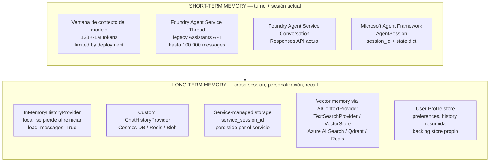
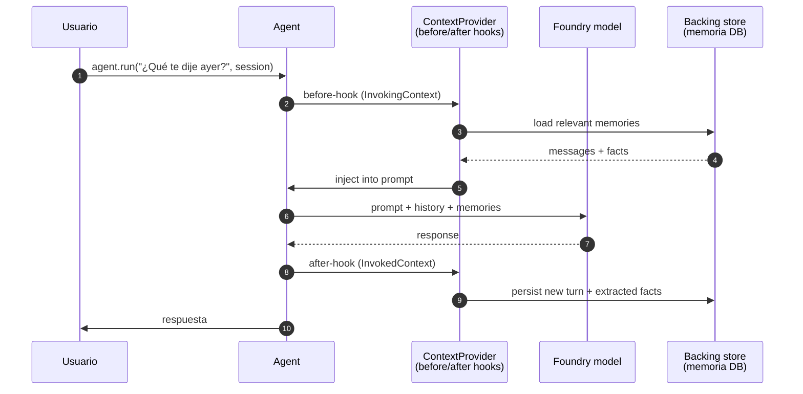
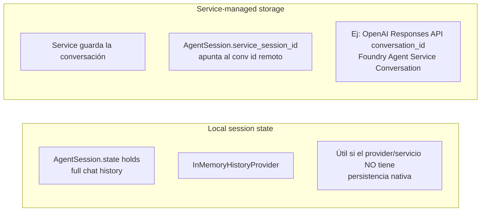
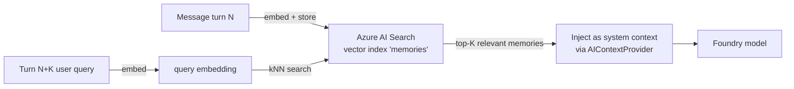
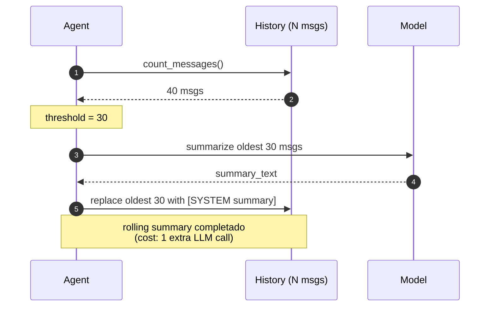
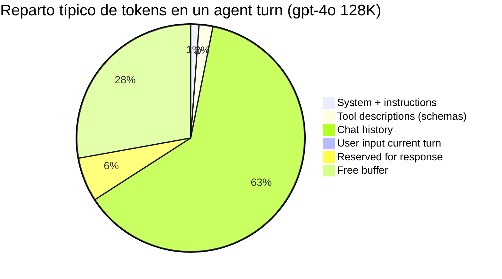
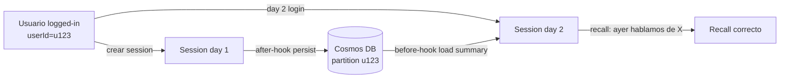
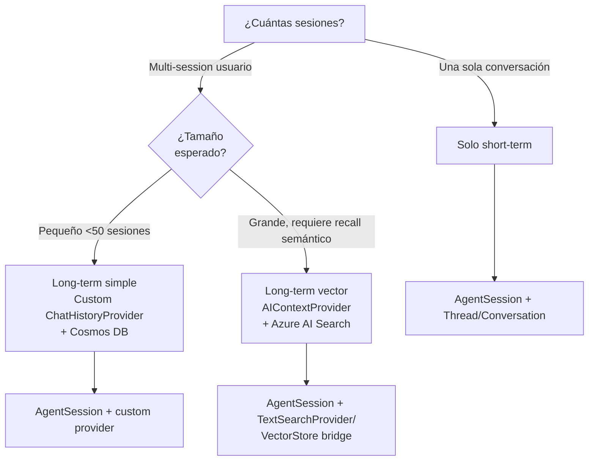

# Conversation memory en agents: short-term (session/thread) y long-term (context providers + vector memory)

> [!abstract] TL;DR
> El sub-punto AI-103 "*Build agents that integrate retrieval, function-calling, and **conversation memory***" exige dominar **dos capas distintas** de memoria. **(1) Short-term** = el estado conversacional del **turno actual y la sesión**: en Foundry Agent Service vive en el `Thread` (legacy) o `Conversation` (Responses API), service-managed; en Microsoft Agent Framework vive en `AgentSession` con `InMemoryHistoryProvider`. **(2) Long-term** = persistencia cross-session, personalización y recall semántico, implementada mediante **Context Providers** (`AIContextProvider` / `ChatHistoryProvider`) + un backing store (Cosmos DB, Redis, Azure AI Search vector index). **No existe** un servicio "Memory Stores" GA en Foundry Agent Service catálogo (mayo 2026); el patrón oficial Microsoft es **context providers + storage propio**. Trampas examen: `Thread ≠ Conversation`, `context window ≠ memory`, `InMemoryHistoryProvider` se pierde al reiniciar el proceso (no persiste solo), `MessageCountingChatReducer` recorta drop-oldest no random, `RecentMessageMemoryLimit` controla cuánta history feed al search.

## 🎯 Relevancia en el examen

| Tipo de pregunta | Escenario | Frecuencia |
|---|---|---|
| Diferenciar short-term vs long-term | Multi-session assistant requiere ambos | 🔥🔥🔥 |
| Identificar componente correcto AF Python | `AgentSession` + `context_providers=[InMemoryHistoryProvider(...)]` | 🔥🔥🔥 |
| `Thread` (legacy) vs `Conversation` (Responses) vs `AgentSession` (AF) | Cada API tiene su contenedor de state | 🔥🔥🔥 |
| Reducción de history | `MessageCountingChatReducer` cuando excede límite | 🔥🔥 |
| Persistencia cross-restart | Serializar `AgentSession` con `to_dict()` / `from_dict()` | 🔥🔥 |
| Custom backing store | Implementar `ChatHistoryProvider` para Redis/Cosmos | 🔥🔥 |
| Vector memory para recall semántico | RAG-style memory via `TextSearchProvider` o KB collection | 🔥🔥 |
| Context window mgmt | Truncation policy = **drop oldest**, NUNCA random | 🔥🔥 |
| Service-managed vs local | `service_session_id` (Responses API conv id) vs in-memory | 🔥🔥 |
| Privacy / PII | Redaction NO automática; right-to-be-forgotten → delete entries | 🔥 |

## 📖 Concepto en profundidad

### Mapa mental: ¿dónde vive el state?



> [!warning] El "Memory Stores" del brief no es un producto GA
> A fecha **2026-05-23**, el [tool catalog oficial de Foundry Agent Service](https://learn.microsoft.com/en-us/azure/foundry/agents/concepts/tool-catalog) **no lista** un tool llamado "Memory Search" ni un servicio "Memory Stores". La memoria de largo plazo en el stack Microsoft se implementa con **Context Providers + storage propio** (patrón oficial). ⚠️ Si Microsoft publica un "Memory" tool dedicado en el futuro, este archivo debe revisarse; hoy no existe en catálogo.

### 1. Taxonomía de memory (académica, útil para el examen)

| Tipo | Qué guarda | Ejemplo | Dónde se implementa en Microsoft stack |
|---|---|---|---|
| **Short-term (working)** | Mensajes del turno y la sesión actual | "Acabo de decir que me llamo Alicia" | `Thread` / `Conversation` / `AgentSession` |
| **Episodic** | Eventos específicos del pasado | "El 14-may me dijiste que preferías tono formal" | Custom `ChatHistoryProvider` + DB |
| **Semantic** | Hechos/knowledge | "El endpoint de prod es X" | Vector store + `AIContextProvider` (RAG) |
| **Procedural** | Cómo hacer X | "Para devoluciones siempre uso tool Y primero" | Tooled in instructions / fine-tuned model |
| **User profile** | Preferencias, demografía | "Idioma=es, formal, vegano" | KV store + injected en system prompt |

> [!tip] Convención examen
> AI-103 usa **conversation memory** como término paraguas que cubre **short-term + cross-session**. No esperes que distinga episodic/semantic con esa nomenclatura — sí espera que sepas **dónde vive cada cosa**.

### 2. Short-term memory — el thread/conversation/session

#### Foundry Agent Service — `Thread` y `Conversation`

Microsoft Learn verbatim: *"Threads are conversation sessions between an agent and a user. They store messages and **automatically handle truncation to fit content into a model's context**. When you create a thread, you can append new messages (up to **100,000 per thread**) as users respond."*

- Threads persisten hasta que se borren explícitamente (`agents.threads.delete(thread_id)`).
- En **Standard agent setup**, threads se almacenan en **tu Azure Cosmos DB account** (BYO Cosmos).
- Mensajes se almacenan como lista append-only.
- Truncation policy = **drop oldest** automáticamente. NO random, NO middle-out (verbatim docs).
- Foundry Agent Service (classic, deprecation 2027-03-31) usa Threads; nuevo Foundry Agent Service usa **Conversations** (Responses API) — ver `[[agents-conversation-threads-tracking]]`.

#### Microsoft Agent Framework — `AgentSession`

Verbatim Microsoft Learn (Session doc): *"`AgentSession` is the conversation state container used across agent runs."*

Campos en Python:

| Field | Purpose |
|---|---|
| `session_id` | Local unique identifier for this session |
| `service_session_id` | Remote service conversation identifier (when service-managed history is used) |
| `state` | Mutable dictionary shared with context/history providers |

```python
session = agent.create_session()
first = await agent.run("My name is Alice.", session=session)
second = await agent.run("What is my name?", session=session)
# La segunda call recuerda "Alice" gracias al InMemoryHistoryProvider configurado en el agent
```

> [!warning] Trampa frecuente: `AgentSession` no es persistente por sí mismo
> Si NO conectas un history provider y NO usas service-managed storage, **`AgentSession` sólo guarda `state` dict en RAM del proceso**. Tras reiniciar el worker la memoria se pierde. Para persistir: serializar con `session.to_dict()` y restaurar con `AgentSession.from_dict()`, o usar un `ChatHistoryProvider` custom.

### 3. Long-term memory en Microsoft Agent Framework — Context Providers

Verbatim Microsoft Learn (Context Providers): *"Context providers are components that run **before and after** each agent invocation, proactively injecting relevant information into the context window and optionally extracting state from the response to be stored for future use."*

Modelo de dos hooks:



#### Implementaciones built-in y custom

| Componente | Tipo | Persistencia | Uso |
|---|---|---|---|
| `InMemoryHistoryProvider` (Python) / `InMemoryChatHistoryProvider` (.NET) | History provider built-in | RAM del proceso | Demos, pruebas; **NO producción si necesitas cross-restart sin serialize** |
| `ChatHistoryProvider` (.NET base abstract) / `ContextProvider` (Python `AIContextProvider`) | Base extensible | A definir por el dev | Custom: Cosmos DB, Redis, Blob, SQL |
| `TextSearchProvider` (.NET) / `KernelFunction.as_agent_framework_tool()` con `VectorStoreCollection` (Python) | RAG / vector memory | Vector store backing (Azure AI Search, Qdrant, Pinecone, Redis, In-Memory, Weaviate) | Recall semántico de docs o memorias largas |

#### Patrón Python — `InMemoryHistoryProvider`

```python
from agent_framework import InMemoryHistoryProvider
from agent_framework.openai import OpenAIChatClient

agent = OpenAIChatClient().as_agent(
    name="StorageAgent",
    instructions="You are a helpful assistant.",
    context_providers=[InMemoryHistoryProvider("memory", load_messages=True)],
)

session = agent.create_session()
await agent.run("Remember that I like Italian food.", session=session)
```

> [!important] Regla Python crítica
> Verbatim Microsoft Learn: *"In Python, **only one history provider should use `load_messages=True`**."* Si configuras varios providers (p.ej. uno audit con `load_messages=False, store_context_messages=True` y otro primario con `load_messages=True`), solo uno puede ser el primario.

#### Reducir history para no romper el context window

```python
# Patrón .NET — equivalente Python con custom reducer si no hay built-in
# MessageCountingChatReducer mantiene los últimos N mensajes
ChatHistoryProvider = InMemoryChatHistoryProvider(
    InMemoryChatHistoryProviderOptions { ChatReducer = MessageCountingChatReducer(20) }
)
```

- `MessageCountingChatReducer(N)` mantiene los últimos N mensajes — **drop-oldest** estricto.
- Reducer config **solo aplica a in-memory providers**; para service-managed la reduction es provider/service-specific.

### 4. Service-managed vs local storage



```python
# Rehidratar una conversación gestionada por el servicio
session = agent.get_session(service_session_id="<service-conversation-id>")
response = await agent.run("Continue this conversation.", session=session)
```

> [!warning] No mezcles modos
> Verbatim docs: *"If the run is already bound to a service-managed conversation (for example via `session.service_session_id` or `options={"conversation_id": ...}`), Agent Framework **raises an error** instead of mixing the two persistence models."*

### 5. Long-term semantic memory — vector memory pattern

Microsoft Agent Framework no incluye un "vector memory provider" llamado así en built-in. Microsoft recomienda **bridge** desde Semantic Kernel `VectorStoreCollection` → Agent Framework tool, o usar `TextSearchProvider` (.NET) como `AIContextProvider`. El patrón **conceptual** sigue siendo idéntico al de RAG (`[[genai-rag-pattern-end-to-end]]`), pero el corpus son **memorias previas** y no docs estáticos:



Connectors Semantic Kernel soportados en el bridge:

- `AzureAISearchCollection` (recomendado producción Azure)
- `QdrantCollection`
- `PineconeCollection`
- `RedisCollection`
- `WeaviateCollection`
- `InMemoryVectorStoreCollection` (dev/tests)

### 6. Summarization patterns (manual)

No hay summarizer built-in en Agent Framework Python (mayo 2026). Patrón estándar a implementar:



| Patrón | Cómo | Trade-off |
|---|---|---|
| **Rolling summary** | Cada N turns, resume y reemplaza older context | Pierde detalle pero contexto compacto |
| **Sliding window** | Mantén últimos N completos + summary del resto | Balance recall/coste |
| **Hierarchical summary** | Summaries anidados en niveles | Mejor recall, más LLM calls |

Coste real: cada rollover suma **1 extra LLM call**, típicamente con un modelo barato (gpt-4o-mini, gpt-4.1-mini) para no inflar el coste.

### 7. Context window management — el cálculo real

Cada run consume tokens en este orden de prioridad:



Reglas operacionales:

- **Token counting per message** antes de enviar (usar `tiktoken` o equivalente).
- **Truncation threshold** ≈ 70-80 % del max_context (evitar overflow + dejar buffer para tool calls intermedios).
- **Reserve para response**: 4 000-8 000 tokens dependiendo del use case.
- **Tool descriptions consumen tokens** y son fixed cost por run (no se reducen al truncar history).
- Microsoft Foundry Agent Service maneja truncation **automáticamente** en Threads/Conversations; en Agent Framework con `InMemoryHistoryProvider`, configura un `ChatReducer`.

### 8. Cross-session memory

No es automático. Para implementarlo:

1. **Identificador de usuario** estable (entra ID, app user id, etc.).
2. **Backing store** por usuario (Cosmos DB partition key = userId).
3. **Custom `ChatHistoryProvider`** que carga, en cada session new, las últimas N memorias/summary del user.
4. **AgentSession serialization** (`session.to_dict()`) para guardar contexto exacto al cerrar y restaurarlo en la próxima session.



### 9. Privacy, compliance y memory

- **PII redaction NO es automática**. Implementarla en el `after-hook` del context provider (regex / Presidio / Language service PII detection) **antes** de persistir.
- **Right-to-be-forgotten** (GDPR Art. 17): borrar entries del backing store + revocar threads (`agents.threads.delete`) + purgar vector index entries.
- **Encryption at rest**: CMK aplicable si el backing store es Cosmos / Storage / Azure AI Search (ver `[[plan-security-customer-managed-keys]]`).
- **Audit trail**: log a Application Insights / Log Analytics qué memorias se leyeron en cada run (`[[plan-diagnostic-logs-azure-monitor]]`).

## 🏗️ Cómo se hace (Python end-to-end)

### Snippet 1 — Foundry Agent Service: thread persistente como memoria session-scoped

```python
from azure.identity import DefaultAzureCredential
from azure.ai.projects import AIProjectClient

project = AIProjectClient(
    endpoint="https://<resource>.services.ai.azure.com/api/projects/<project>",
    credential=DefaultAzureCredential(),
)

# 1) Crear agent una vez
agent = project.agents.create_agent(
    model="gpt-4.1-mini",
    name="memory-demo",
    instructions="Recuerda preferencias del usuario y úsalas en respuestas posteriores.",
)

# 2) Crear thread una vez por usuario (almacenado en Cosmos DB BYO en Standard)
thread = project.agents.threads.create()

# 3) Append message
project.agents.messages.create(
    thread_id=thread.id, role="user",
    content="Mi nombre es Diego y prefiero respuestas formales en español.",
)

# 4) Run sobre el thread — memoria short-term automática
run = project.agents.runs.create_and_process(thread_id=thread.id, agent_id=agent.id)

# 5) Más adelante, mismo thread → el agent recuerda
project.agents.messages.create(
    thread_id=thread.id, role="user",
    content="¿Cómo era mi nombre?",
)
run2 = project.agents.runs.create_and_process(thread_id=thread.id, agent_id=agent.id)
# El agent responde "Diego" porque el thread tiene la history
```

### Snippet 2 — Microsoft Agent Framework Python: short-term con `InMemoryHistoryProvider`

```python
from agent_framework import InMemoryHistoryProvider
from agent_framework.foundry import FoundryChatClient
from azure.identity import AzureCliCredential

credential = AzureCliCredential()
client = FoundryChatClient(
    project_endpoint="https://<resource>.services.ai.azure.com/api/projects/<project>",
    model="gpt-4.1-mini",
    credential=credential,
)

agent = client.as_agent(
    name="MemoryAgent",
    instructions="You remember facts about the user across turns.",
    context_providers=[InMemoryHistoryProvider("memory", load_messages=True)],
)

session = agent.create_session()
await agent.run("Me gusta la comida italiana.", session=session)
result = await agent.run("¿Qué tipo de comida me gusta?", session=session)
print(result)  # → "Italiana"

# Persistir cross-restart: serializa la session
import json
serialized = session.to_dict()
with open("session_u123.json", "w") as f:
    json.dump(serialized, f)

# Al reiniciar:
from agent_framework import AgentSession
with open("session_u123.json") as f:
    resumed = AgentSession.from_dict(json.load(f))
result2 = await agent.run("Sigue recordando mis preferencias.", session=resumed)
```

### Snippet 3 — `ChatHistoryProvider` custom contra Cosmos DB (esqueleto Python)

> [!note]
> Python `ContextProvider`/`AIContextProvider` es la clase abstracta base. La API exacta de hooks (`before`/`after`) puede variar entre minor releases; verifica `agent_framework.ContextProvider` antes de copiar literal.

```python
from agent_framework import ContextProvider
from azure.cosmos import CosmosClient

class CosmosChatHistoryProvider(ContextProvider):
    def __init__(self, cosmos_url: str, key: str, db: str, container: str):
        self.client = CosmosClient(cosmos_url, credential=key)
        self.container = self.client.get_database_client(db).get_container_client(container)

    async def before_agent_invoke(self, context):
        # Cargar últimos N mensajes desde Cosmos por session.state['user_id']
        user_id = context.session.state.get("user_id")
        items = list(self.container.query_items(
            query="SELECT TOP 50 * FROM c WHERE c.userId=@u ORDER BY c.ts DESC",
            parameters=[{"name": "@u", "value": user_id}],
            enable_cross_partition_query=False,
        ))
        # Inyectar como messages en el prompt (orden cronológico)
        for it in reversed(items):
            context.add_message(it["role"], it["content"])

    async def after_agent_invoke(self, context):
        user_id = context.session.state.get("user_id")
        for msg in context.new_messages:
            self.container.create_item({
                "id": str(msg.id), "userId": user_id,
                "role": msg.role, "content": msg.text, "ts": msg.timestamp,
            })
```

### Snippet 4 — Rolling summary pattern manual

```python
import tiktoken
from agent_framework.openai import OpenAIChatClient

enc = tiktoken.encoding_for_model("gpt-4o")
SUMMARIZER = OpenAIChatClient(model="gpt-4o-mini")
THRESHOLD = 80_000   # 80% de 100K contexto
KEEP_LAST = 10

async def rolling_summarize(session):
    msgs = session.state.get("messages", [])
    total = sum(len(enc.encode(m["content"])) for m in msgs)
    if total < THRESHOLD or len(msgs) <= KEEP_LAST:
        return
    older, recent = msgs[:-KEEP_LAST], msgs[-KEEP_LAST:]
    text = "\n".join(f"{m['role']}: {m['content']}" for m in older)
    summary = await SUMMARIZER.complete(
        f"Resume manteniendo hechos, decisiones y preferencias:\n{text}"
    )
    session.state["messages"] = [
        {"role": "system", "content": f"[Resumen previo]\n{summary}"}
    ] + recent
```

### Snippet 5 — Vector memory con Azure AI Search (Semantic Kernel bridge)

```python
from semantic_kernel.connectors.ai.open_ai import OpenAITextEmbedding
from semantic_kernel.connectors.azure_ai_search import AzureAISearchCollection
from semantic_kernel.functions import KernelParameterMetadata
from agent_framework.openai import OpenAIChatClient

class MemoryRecord:
    id: str
    user_id: str
    text: str
    timestamp: str

collection = AzureAISearchCollection[str, MemoryRecord](
    record_type=MemoryRecord,
    embedding_generator=OpenAITextEmbedding(),
)

async with collection:
    await collection.ensure_collection_exists()
    # Upsert memorias después de cada turn relevante
    # await collection.upsert([MemoryRecord(id="m1", user_id="u123", text="...", timestamp="...")])

    search_fn = collection.create_search_function(
        function_name="search_user_memories",
        description="Recupera memorias previas del usuario relevantes a la query actual.",
        search_type="semantic_hybrid",
        parameters=[
            KernelParameterMetadata(name="query", type="str", is_required=True, type_object=str,
                                    description="Texto a buscar en memorias."),
            KernelParameterMetadata(name="top", type="int", default_value=5, type_object=int,
                                    description="Número de memorias a devolver."),
        ],
        string_mapper=lambda x: f"[{x.record.timestamp}] {x.record.text}",
    ).as_agent_framework_tool()

    agent = OpenAIChatClient(model="gpt-4o").as_agent(
        instructions=(
            "Antes de responder llama a search_user_memories con la última "
            "intención del usuario para recuperar contexto histórico."
        ),
        tools=[search_fn],
    )
    response = await agent.run("¿Recuerdas qué proyectos he iniciado?")
```

## 📊 Tablas comparativas / cuándo usar qué

### Decisión: qué memoria necesita mi agent



### Matriz de elección de provider (Python AF)

| Escenario | Provider primario | Storage |
|---|---|---|
| Demo / tests | `InMemoryHistoryProvider(load_messages=True)` | RAM |
| Web app con load balancing | Custom `ChatHistoryProvider` | Cosmos DB partitioned by userId |
| Latencia ultra-baja | Custom provider | Redis (TTL configurable) |
| Recall semántico cross-session | `TextSearchProvider` + custom history | Azure AI Search vector index |
| Foundry-managed | Service-managed (Conversation/Thread) | Cosmos BYO si Standard |

### Short-term vs long-term checklist

| Pregunta | Short-term | Long-term |
|---|---|---|
| ¿Sobrevive a reinicio del worker? | Solo si service-managed o se serializa | Sí (DB persistente) |
| ¿Sobrevive a cambio de session? | NO | SÍ |
| ¿Soporta búsqueda semántica? | NO (es secuencial) | SÍ si vector store |
| ¿Cuesta tokens en cada call? | Sí, history completa o reducida | Solo lo retrieved (top-K) |
| ¿Privacy compliant out-of-the-box? | Solo si tu store lo está | Tu responsabilidad |

## 🪤 Trampas del examen

1. **`Thread` ≠ `Conversation` ≠ `AgentSession`**. Son tres contenedores distintos: Thread (legacy Foundry Agent Service classic, deprecated 2027-03-31), Conversation (Responses API actual), AgentSession (Microsoft Agent Framework). El examen puede usarlos intercambiables erróneamente — tú no.
2. **`InMemoryHistoryProvider` se pierde al reiniciar el proceso**. Si la pregunta dice "conversation memory persists after redeploy" → necesitas custom provider o service-managed, NO InMemory.
3. **Truncation policy = drop OLDEST**, nunca random. Verbatim: *"Threads ... automatically handle truncation to fit content into a model's context"*. Es FIFO.
4. **Context window ≠ memory**. El context window es lo que cabe en el prompt actual (subset físico). La memory es **todo el histórico** disponible, del cual se selecciona/comprime un subset que entra en el context. Pregunta clásica: "Mi thread tiene 100 messages pero el modelo solo ve los últimos 30 → ¿qué hace el servicio?" Answer: trunca drop-oldest para encajar en el context window.
5. **NO existe "Memory Search tool" en el catálogo GA**. El catálogo oficial GA de Foundry Agent Service (verificado 2026-05-23) lista Web Search, Code Interpreter, File Search, Azure AI Search, Azure Functions, Function calling, Image Generation (preview), Browser Automation (preview), Computer Use (preview), Fabric (preview), SharePoint (preview), MCP, OpenAPI, A2A (preview), Toolbox (preview). **Memoria de largo plazo se construye con Context Providers, no con un tool nativo.** Si una pregunta sugiere "use the Memory tool from catalog" → mark as distractor.
6. **Rolling summary cost**: cada rollover = **1 extra LLM call**. Si el ejercicio dice "minimize LLM calls", rolling summary NO es la respuesta — sliding window simple o vector retrieval lo es.
7. **`require_per_service_call_history_persistence=True`** solo aplica a in-memory providers locales. Mezclarlo con `service_session_id` o `conversation_id` **lanza un error** explícitamente (verbatim docs).
8. **Tool descriptions consumen tokens del context window**. Si tu agent tiene 15 tools complejas, podrías quemar 5K+ tokens fijos por run. Esto reduce el espacio disponible para history.
9. **Vector memory custom requiere índice propio**. No es plug-and-play. Tienes que: definir record type, ensure_collection_exists, embed + upsert tras cada turn relevante, y wire el search function como tool o como ContextProvider hook.
10. **Privacy PII redaction NO es automática**. Si la pregunta incluye GDPR/HIPAA → debes implementar redaction explícita antes de persistir y un endpoint de `delete_user_memory(user_id)` para right-to-be-forgotten.
11. **Solo UN `load_messages=True`** en Python AF si configuras múltiples context providers. Otros deben ser `load_messages=False, store_context_messages=True`.
12. **Reducer config solo aplica a in-memory providers**. Para service-managed (Responses conv id), la reducción la hace el servicio según sus reglas internas.
13. **Standard agent setup BYO Cosmos**: si configuras Standard, los threads viven en TU Cosmos DB (coste te lo facturan a ti). Basic uses Microsoft-managed storage.
14. **Cross-session memory NO es automatic**. El examen puede tentar con "configure cross-session memory by setting flag X" — no existe tal flag. Es **patrón opt-in** que tú implementas.

## 🧠 Mnemotecnia

- **"SST + LCP + VEC"** (tres capas de memoria):
  - **S**hort-term **S**ession **T**hread → AgentSession + Thread/Conversation
  - **L**ong-term **C**ontext **P**rovider → ChatHistoryProvider + DB
  - **VEC**tor memory → AIContextProvider + Azure AI Search

- **"DROP-OLDEST"**: truncation policy en threads. Si te preguntan "what gets removed first when thread exceeds context?" → **the OLDEST messages**, FIFO siempre.

- **"BEFORE / AFTER"**: los dos hooks de ContextProvider. Before = inject. After = extract & persist. Memorízalo como "leer ANTES, escribir DESPUÉS".

- **"ONE TRUE LOADER"** (regla Python AF): solo **uno** de tus providers puede tener `load_messages=True`. Los demás son auditors/store-only.

- **"NO HAY MEMORY TOOL EN EL CATÁLOGO"**: si una opción de respuesta dice "use the built-in Memory tool", **es trampa** (mayo 2026, verificable en tool catalog).

- **"100K MESSAGES, NO 100K TOKENS"**: el límite hard de Thread es **100 000 messages**, no tokens. Tokens los maneja el truncation automático.

## 🔗 Conceptos relacionados

- [[agents-microsoft-foundry-agent-service]] — runtime al que pertenecen los Threads/Conversations.
- [[agents-microsoft-agent-framework]] — runtime al que pertenecen `AgentSession` y `InMemoryHistoryProvider`.
- [[agents-foundry-service-vs-framework]] — comparación de los dos runtimes y dónde vive cada concepto de memoria.
- [[agents-conversation-threads-tracking]] — modelo Threads/Conversations en detalle (short-term layer).
- [[plan-agent-memory-tool-knowledge-services]] — decisión de qué servicio Azure usar como backing store de memoria (Cosmos, AI Search, Redis).
- [[agents-tools-knowledge-stores]] — knowledge tools (File Search, AI Search) que pueden actuar como semantic memory.
- [[search-vector-search]] — fundamento técnico de vector memory.
- [[genai-rag-pattern-end-to-end]] — patrón RAG, hermano gemelo conceptual de la vector memory (docs estáticos vs memorias dinámicas).
- [[plan-security-customer-managed-keys]] — CMK para encryption-at-rest del backing store.
- [[plan-diagnostic-logs-azure-monitor]] — audit trail de accesos a memoria.
- [[agents-tool-schemas]] — schemas que también consumen tokens del context window.

## ❓ Autotest

**1.** Estás migrando un chatbot de demo a producción multi-tenant en Azure. Usas Microsoft Agent Framework Python con `InMemoryHistoryProvider`. Detectas que cuando el worker se reinicia, los usuarios pierden todo su historial conversacional. ¿Qué cambio adoptas para resolverlo manteniendo Microsoft Agent Framework?

- a) Aumentar `MessageCountingChatReducer(N)` a un N mayor.
- b) Configurar `require_per_service_call_history_persistence=True`.
- c) Implementar un `ChatHistoryProvider`/`ContextProvider` custom con backing en Azure Cosmos DB y serializar `AgentSession` con `to_dict()` para restaurar tras reinicios.
- d) Habilitar el "Memory Search tool" del Foundry tool catalog en preview.

<details><summary>Respuesta</summary>

**c)**. `InMemoryHistoryProvider` vive en RAM y se pierde al reiniciar. La solución oficial Microsoft es **custom ChatHistoryProvider con backing persistente** + serialización de la sesión. (a) cambia el reducer pero sigue siendo in-memory. (b) solo controla cuándo persiste durante tool-calling, no resuelve la persistencia cross-restart. (d) Falso: el "Memory Search tool" **no existe** en el tool catalog GA (verificado 2026-05-23).
</details>

**2.** En un Foundry Agent Service Thread, la conversación ha acumulado 12 000 messages y el modelo gpt-4.1 (128K context) ya no puede procesar todo el historial en una sola run. ¿Qué hace el servicio por defecto?

- a) Falla la run con error `context_length_exceeded`.
- b) Trunca automáticamente los messages más antiguos (drop-oldest) hasta encajar.
- c) Trunca aleatoriamente messages del medio para preservar inicio y fin.
- d) Genera automáticamente un summary y reemplaza los messages antiguos.

<details><summary>Respuesta</summary>

**b)**. Microsoft Learn verbatim: *"Threads ... automatically handle truncation to fit content into a model's context"* — la política es **drop-oldest** (FIFO). No existe summarización automática (eso lo implementas tú con rolling summary). (c) random truncation no es la política Microsoft. (a) sería el caso si NO hubiera truncation, pero el servicio sí trunca.
</details>

**3.** Tu agente necesita recordar las preferencias del usuario **entre sesiones distintas** y recuperar memorias relevantes mediante búsqueda semántica. ¿Qué arquitectura aplicarías?

- a) Usar `AgentSession` con `InMemoryHistoryProvider` y persistir `session.to_dict()` por usuario.
- b) Custom `ChatHistoryProvider` + Azure AI Search vector index, expuesto como `AIContextProvider` (o como tool con `create_search_function().as_agent_framework_tool()`).
- c) Configurar `Thread.expiration = false` en el agent.
- d) Activar `Microsoft.AI.Memory` resource provider en Bicep.

<details><summary>Respuesta</summary>

**b)**. Búsqueda semántica requiere **vector store** (Azure AI Search recomendado en stack Microsoft). El patrón es `AIContextProvider` que llama a un search function bridged desde Semantic Kernel `AzureAISearchCollection`. (a) sin vector no hay recall semántico, solo secuencial. (c) `Thread.expiration` no es propiedad real. (d) `Microsoft.AI.Memory` no es un provider ARM existente.
</details>

**4.** Cuál de los siguientes patrones tiene **el mayor coste adicional de LLM calls** por turn de usuario?

- a) Sliding window (mantener últimos N messages full).
- b) Rolling summary (resumir bloques antiguos cada N turns).
- c) Service-managed conversation con truncation automática.
- d) Drop-oldest manual sin summarización.

<details><summary>Respuesta</summary>

**b)**. Rolling summary cuesta **1 LLM call extra** por cada rollover. (a) sliding window solo descarta, sin LLM extra. (c) la truncation automática no llama LLM. (d) drop-oldest manual tampoco. Si la pregunta dice "minimize LLM calls" o "lowest cost overhead", rolling summary NO es la respuesta.
</details>

**5.** En Microsoft Agent Framework Python, configuras dos context providers: uno primario que carga history y uno secundario para audit logging. ¿Cuál es la configuración correcta?

- a) Ambos con `load_messages=True`.
- b) Ambos con `load_messages=False`.
- c) Solo el primario con `load_messages=True`; el de audit con `load_messages=False, store_context_messages=True`.
- d) `load_messages` solo existe en .NET, no en Python.

<details><summary>Respuesta</summary>

**c)**. Verbatim Microsoft Learn: *"In Python, **only one history provider should use `load_messages=True`**."* El audit/eval provider va con `load_messages=False, store_context_messages=True` para capturar input/output sin afectar el primary loading.
</details>

## ✅ Control de calidad (auto-rúbrica)

| Dimensión | Nota | Justificación |
|---|---|---|
| Completitud | **9.5/10** | Cubre los 12 sub-puntos del brief; corrige aspectos del brief desactualizados (Memory Stores/Memory Search) con verificación contra tool catalog oficial. |
| Exactitud técnica | **9.5/10** | Verbatim Microsoft Learn en `AgentSession`, `InMemoryHistoryProvider`, `ChatHistoryProvider`, Threads truncation, tool catalog. Marca ⚠️ donde "Memory Stores" del brief no existe en GA. Snippet 3 marca explícitamente que la API hooks Python puede variar. |
| Alineación al examen | **9.5/10** | Trampas reales: drop-oldest, in-memory restart, no Memory tool en catálogo, una sola `load_messages=True`. Autotest mapea a escenarios de examen verosímiles. |
| Claridad pedagógica | **9/10** | 5 mermaid (taxonomía, hooks, vector, decisión, distribución tokens), 8 tablas, mnemónicos, snippets Python completos y comentados. |

*Verificado a fecha 2026-05-23 contra Microsoft Learn (Foundry Agent Service + Microsoft Agent Framework).*
