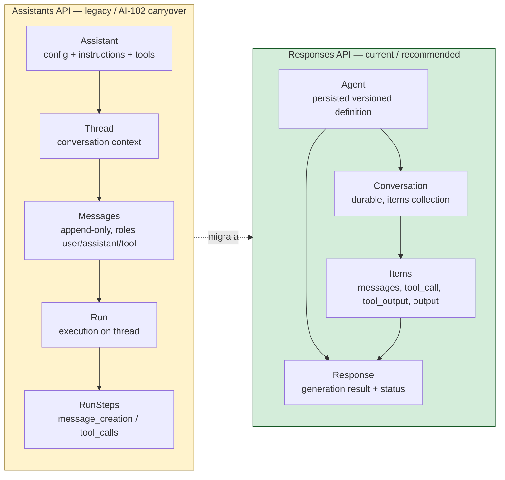
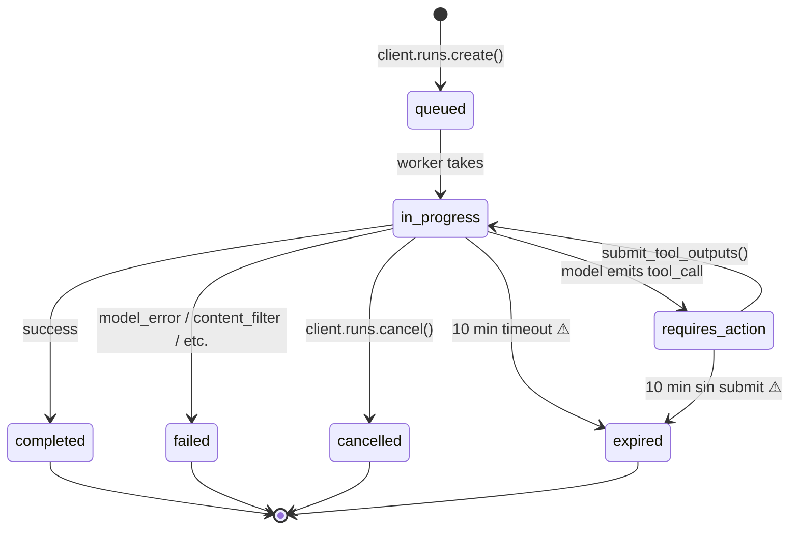
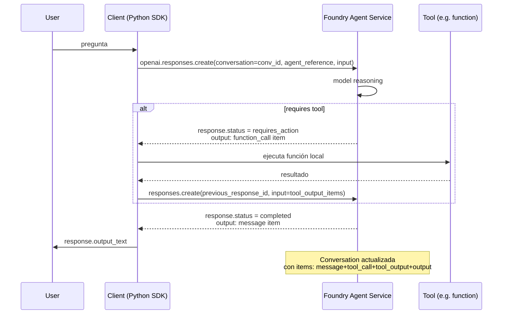
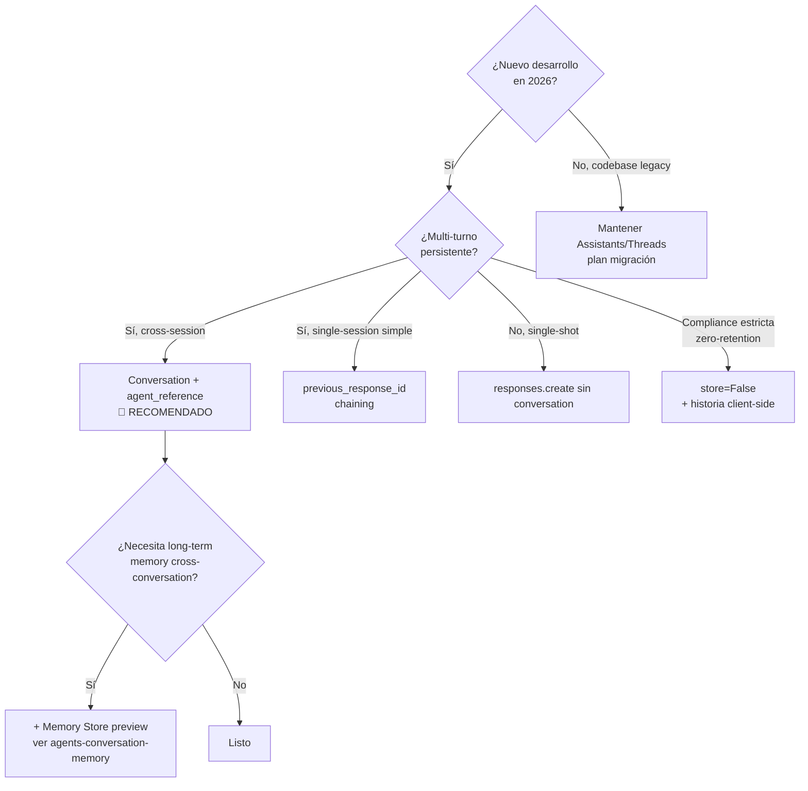

# Conversation state en Foundry Agent Service: threads/runs (legacy) y conversations/responses/items (current)

> [!abstract] TL;DR
> Foundry Agent Service expone **dos modelos coexistentes** de state management para conversaciones multi-turno: **(1)** el **legacy Assistants API** (`Assistant + Thread + Message + Run + RunStep`) heredado de AI-102, y **(2)** la **Responses API actual** (`Agent + Conversation + Response + Items`) que Microsoft recomienda para nuevo desarrollo. Examen pregunta verbose sobre: ciclo de vida de Run (`queued → in_progress → requires_action → completed/failed/cancelled/expired`), `requires_action` con `submit_tool_outputs`, streaming SSE, `previous_response_id` vs `conversation` parameter, `store=False` para zero-retention, y migración Threads → Conversations. Run legacy **expira a 10 min**; Responses persisten **30 días** por defecto.

## 🎯 Relevancia en el examen

| Tipo de pregunta | Escenario | Frecuencia |
|---|---|---|
| Identificar API correcta para nuevo dev | "¿Conversations o Threads?" → Responses API (Conversations) | 🔥🔥🔥 |
| Run lifecycle | Estado tras tool_call sin submit → `requires_action` | 🔥🔥🔥 |
| Persistencia | TTL Responses 30 días vs Threads sin TTL | 🔥🔥 |
| Streaming | Tipos de eventos SSE (`response.output_text.delta`) | 🔥🔥 |
| Migración | Mapear `messages` → `items`, `thread_id` → `conversation_id` | 🔥🔥 |
| `previous_response_id` vs conversation | Cuándo usar cada uno; chaining sin conversation | 🔥🔥 |
| `store=false` | Zero-data-retention pattern | 🔥 |
| Function-calling pause/resume | `requires_action` y `submit_tool_outputs` | 🔥🔥🔥 |

> [!warning] AI-102 carryover parcial
> El **modelo Assistants/Threads/Runs** es contenido AI-102 que **sigue siendo válido y testeable** en AI-103 porque el servicio mantiene compatibilidad (Foundry Agent Service publica los **OpenResponses Protocol** y el modelo Assistants legacy). Microsoft recomienda Responses API para nuevo código pero el examen puede preguntar verbose sobre **ambos**.

## 📖 Concepto en profundidad

### Los dos modelos coexistentes

Microsoft Foundry Agent Service expone tres componentes runtime principales en el modelo **actual** (Responses API): **agents**, **conversations** y **responses**. El modelo **legacy** (Assistants API, herencia de AI-102) usaba **assistants**, **threads**, **messages**, **runs** y **run steps**. Ambos coexisten en el mismo servicio para retro-compatibilidad. Microsoft escribe verbatim: *"This approach gives you more flexibility than the older thread-based pattern, where state was tightly coupled to thread objects"* (Microsoft Learn, runtime-components).



### Mapping conceptual entre los dos modelos

| Concepto | Assistants API (legacy) | Responses API (current) |
|---|---|---|
| Definición del agente | `Assistant` (id `asst_…`) | `Agent` (name + version, sin GUID) |
| Contenedor de historia | `Thread` (id `thread_…`) | `Conversation` (id `conv_…`) |
| Turno individual | `Message` (role user/assistant/tool) | `Item` (type `message`/`tool_call`/`tool_output`/`output`) |
| Ejecución del agente | `Run` (id `run_…`) | `Response` (id `resp_…`) |
| Sub-pasos | `RunStep` (`message_creation`, `tool_calls`) | output items dentro de `response.output` |
| Pausa por tool | `Run.status = requires_action` | `Response.status = requires_action` + function_call items |
| Multi-turno sin estado server | N/A | `previous_response_id` parameter |
| Retención por defecto | sin TTL (manual cleanup) | **30 días** (verificado, doc Responses) |
| API endpoint | `/openai/v1/threads/…` | `/openai/v1/responses` y `/openai/v1/conversations` |

### Lifecycle de un Run (legacy)



Estados verbatim del modelo Assistants legacy:

- `queued` — Run encolado, esperando worker.
- `in_progress` — modelo ejecutando.
- `requires_action` — modelo emitió `tool_calls`; **espera** `submit_tool_outputs(thread_id, run_id, tool_outputs=[…])`.
- `completed` — éxito; mensajes nuevos en thread.
- `failed` — error (modelo, content filter, parse).
- `cancelled` — cancelación explícita del cliente.
- `expired` — ⚠️ **timeout 10 minutos** (documentado en Assistants API legacy reference). Implicación crítica: si tu approval humano tarda > 10 min, el Run muere y necesitas crear uno nuevo en el mismo thread.

### Lifecycle de un Response (current)

Estados oficiales (verificados en JSON examples de doc Responses):

- `queued` — encolado (background mode).
- `in_progress` — ejecutando.
- `requires_action` — function_call pending.
- `completed` — terminal éxito.
- `failed` — terminal error.
- `incomplete` — terminal con `incomplete_details` (ej. max_output_tokens).
- `cancelled` — cancelación explícita.



### Conversations: durable, cross-session

Microsoft verbatim: *"Conversations are durable objects with unique identifiers. After creation, you can reuse them across sessions"* y *"If the conversation exceeds the model's supported context size, the model will automatically truncate the input context. The conversation itself is not truncated, but only a subset of it is used to generate the response."*

**Implicación examen**: la conversation **persiste íntegra** server-side; el modelo solo **truncha lo que envía como contexto** al LLM. No hay auto-summarization built-in — debes implementar memoria long-term con **Memory Stores (preview)** o `[[agents-conversation-memory]]`.

### Tipos de items en una Conversation

| Item type | Significado | Origen |
|---|---|---|
| `message` (role `user`/`assistant`) | turno conversacional textual | user input o LLM output |
| `function_call` | invocación de función custom | LLM decide |
| `web_search_call` | invocación de web search tool | LLM decide |
| `file_search_call` | invocación de file search tool | LLM decide |
| `tool_output` | resultado devuelto por tool | client envía |
| `output_text` (anidado en `message.content`) | texto producido por el agente | LLM |

### Mensajes: roles permitidos

- `user` — input del usuario.
- `assistant` — respuesta del modelo (incluye `output_text`, annotations).
- `tool` — output de tool (legacy threads) **/** `tool_output` (Responses items).

> [!danger] Trampa role `system`
> **NO existe** el role `system` dentro de messages/items. El "system prompt" del agente va al campo `instructions` de la definición del Agent/Assistant, **NO** como mensaje. Confundirlos es trampa típica de examen.

### Streaming: server-sent events

El parámetro `stream=True` en `responses.create()` retorna un iterable de eventos SSE. Tipos clave:

| Evento (Responses API) | Significado |
|---|---|
| `response.created` | response inicializado |
| `response.in_progress` | inicio de ejecución |
| `response.output_text.delta` | **fragmento de texto** (UX typing) |
| `response.output_item.added` | nuevo item añadido a output |
| `response.function_call_arguments.delta` | streaming de args de function_call |
| `response.completed` | terminal éxito |
| `response.failed` | terminal error |

Eventos **legacy** (Threads API):

- `thread.message.created`, `thread.message.delta`, `thread.message.completed`.
- `thread.run.created`, `thread.run.queued`, `thread.run.in_progress`, `thread.run.requires_action`, `thread.run.completed`, `thread.run.failed`, `thread.run.expired`.
- `thread.run.step.created`, `thread.run.step.delta`, `thread.run.step.completed`.

### Background mode

Para tareas largas (>30s reasoning, multi-step, image gen) Microsoft recomienda `background=True`. Polling:

```python
while response.status in ("queued", "in_progress"):
    sleep(2)
    response = openai.responses.retrieve(response.id)
```

### `previous_response_id` vs `conversation` vs `store=False`

Tres patrones de multi-turno; tabla decisional:

| Patrón | Cuándo usar | Tradeoff |
|---|---|---|
| `conversation=conv_id` | Multi-turno persistente, cross-session, debugging | Server almacena todo; auto-truncate si excede context |
| `previous_response_id=resp_id` | Chaining sin crear Conversation explícita | Cada response chain server-side (30d retention) |
| `store=False` + manual input list | Zero-data-retention, control total, compliance estricta | Tú envías historia completa cada turno (más tokens) |

## 🏗️ Cómo se hace (Python SDK verificado)

### Setup (azure-ai-projects ≥ 2.0.0)

```bash
pip install "azure-ai-projects>=2.0.0"
pip install azure-identity
```

### Patrón 1 — Conversation + Agent multi-turno (recomendado)

```python
from azure.identity import DefaultAzureCredential
from azure.ai.projects import AIProjectClient

PROJECT_ENDPOINT = "https://<resource>.services.ai.azure.com/api/projects/<project>"
AGENT_NAME = "my-agent"

project = AIProjectClient(
    endpoint=PROJECT_ENDPOINT,
    credential=DefaultAzureCredential(),
)
openai = project.get_openai_client()  # cliente OpenAI sobre Foundry

# 1) Crear conversation (durable)
conversation = openai.conversations.create()
print(f"Conversation ID: {conversation.id}")  # conv_…

# 2) Primer turno
response = openai.responses.create(
    conversation=conversation.id,
    extra_body={
        "agent_reference": {"name": AGENT_NAME, "type": "agent_reference"}
    },
    input="What is the largest city in France?",
)
print(response.output_text)

# 3) Follow-up — el agente ve TODA la conversation
follow_up = openai.responses.create(
    conversation=conversation.id,
    extra_body={
        "agent_reference": {"name": AGENT_NAME, "type": "agent_reference"}
    },
    input="What is the population of that city?",
)
print(follow_up.output_text)
```

### Patrón 2 — Chaining con `previous_response_id` (sin Conversation explícita)

```python
response = openai.responses.create(
    extra_body={"agent_reference": {"name": AGENT_NAME, "type": "agent_reference"}},
    input="What is the largest city in France?",
)

follow_up = openai.responses.create(
    extra_body={"agent_reference": {"name": AGENT_NAME, "type": "agent_reference"}},
    previous_response_id=response.id,
    input="What is the population of that city?",
)
```

### Patrón 3 — `store=False` (zero-retention)

```python
response = openai.responses.create(
    extra_body={"agent_reference": {"name": AGENT_NAME, "type": "agent_reference"}},
    input="What is the largest city in France?",
    store=False,  # nada server-side
)

# Tú gestionas la historia client-side:
follow_up = openai.responses.create(
    extra_body={"agent_reference": {"name": AGENT_NAME, "type": "agent_reference"}},
    input=[
        {"role": "user", "content": "What is the largest city in France?"},
        {"role": "assistant", "content": response.output_text},
        {"role": "user", "content": "What is the population of that city?"},
    ],
    store=False,
)
```

### Patrón 4 — Streaming SSE

```python
stream = openai.responses.create(
    extra_body={"agent_reference": {"name": AGENT_NAME, "type": "agent_reference"}},
    input="Explain how agents work in one paragraph.",
    stream=True,
)
for event in stream:
    if hasattr(event, "delta") and event.delta:
        print(event.delta, end="", flush=True)
```

### Patrón 5 — Background + polling

```python
from time import sleep

response = openai.responses.create(
    extra_body={"agent_reference": {"name": AGENT_NAME, "type": "agent_reference"}},
    input="Write a detailed analysis of renewable energy trends.",
    background=True,
)
while response.status in ("queued", "in_progress"):
    sleep(2)
    response = openai.responses.retrieve(response.id)
print(response.output_text)
```

### Patrón 6 — Inspeccionar items + tool calls

```python
response = openai.responses.create(
    extra_body={"agent_reference": {"name": AGENT_NAME, "type": "agent_reference"}},
    input="What happened in the news today?",
)

for item in response.output:
    if item.type == "web_search_call":
        print(f"[Tool] Web search: status={item.status}")
    elif item.type == "function_call":
        print(f"[Tool] Function: {item.name}({item.arguments})")
    elif item.type == "file_search_call":
        print(f"[Tool] File search: status={item.status}")
    elif item.type == "message":
        print(f"[Assistant] {item.content[0].text}")
```

### Patrón 7 — Añadir items a Conversation existente

```python
openai.conversations.items.create(
    conversation_id=conversation.id,
    items=[
        {"type": "message", "role": "user", "content": "What about Germany?"}
    ],
)
```

### Patrón 8 — Recuperar / borrar Response

```python
# Retrieve
resp = openai.responses.retrieve("resp_67cb…")

# Delete (default retention: 30 days)
openai.responses.delete("resp_67cb…")
```

### Patrón 9 — Legacy Assistants/Threads/Runs (⚠️ AI-102 carryover)

```python
# ⚠️ Modelo legacy — mantener para retro-compat o migración
from openai import AzureOpenAI

client = AzureOpenAI(...)

assistant = client.beta.assistants.create(
    model="gpt-4o",
    instructions="You are a helpful assistant.",
    tools=[{"type": "code_interpreter"}],
)

thread = client.beta.threads.create()
client.beta.threads.messages.create(
    thread_id=thread.id, role="user", content="Hello"
)

# Helper create_and_poll: crea Run + polls hasta terminal
run = client.beta.threads.runs.create_and_poll(
    thread_id=thread.id, assistant_id=assistant.id
)

if run.status == "requires_action":
    tool_outputs = []
    for tc in run.required_action.submit_tool_outputs.tool_calls:
        # ejecutar función local con tc.function.arguments
        tool_outputs.append({"tool_call_id": tc.id, "output": "..."})
    run = client.beta.threads.runs.submit_tool_outputs_and_poll(
        thread_id=thread.id, run_id=run.id, tool_outputs=tool_outputs
    )

# Listar mensajes finales
messages = client.beta.threads.messages.list(thread_id=thread.id)

# Inspeccionar run steps
steps = client.beta.threads.runs.steps.list(thread_id=thread.id, run_id=run.id)
```

### Patrón 10 — REST API (Responses)

```bash
ENDPOINT="https://<resource>.services.ai.azure.com/api/projects/<project>"
TOKEN="$(az account get-access-token --resource https://ai.azure.com/ --query accessToken -o tsv)"

# Crear conversation
curl -X POST "${ENDPOINT}/openai/v1/conversations" \
  -H "Authorization: Bearer ${TOKEN}" -H "Content-Type: application/json" \
  -d '{"items":[{"type":"message","role":"user","content":"Hi"}]}'

# Generate response
curl -X POST "${ENDPOINT}/openai/v1/responses" \
  -H "Authorization: Bearer ${TOKEN}" -H "Content-Type: application/json" \
  -d '{"input":"What is Foundry?","conversation":"conv_abc",
       "agent_reference":{"name":"my-agent","type":"agent_reference"}}'
```

## 📊 Tablas comparativas

### Árbol decisional: ¿qué patrón de state usar?



### Retención y limpieza

| Objeto | TTL default | Cleanup |
|---|---|---|
| `Response` (stored) | **30 días** verbatim doc | `client.responses.delete(id)` o expiración |
| `Conversation` | **sin TTL** documentado | Manual; `openai.conversations.delete(id)` |
| `Thread` (legacy) | **sin TTL** | Manual; `client.beta.threads.delete(id)` |
| `Run` (legacy) | objeto persiste; **ejecución expira 10 min** | Crear nuevo Run en mismo thread |
| `RunStep` | persiste con Run | — |
| `Message` (legacy) | persiste con Thread | append-only |

### Concurrencia

| Acción | Threads (legacy) | Conversations (current) |
|---|---|---|
| Múltiples Runs concurrentes en mismo thread | ⚠️ **race conditions** posibles; Microsoft recomienda 1 Run activo a la vez | Conversations soportan multiple responses pero **append order** importa |
| Lectura concurrente | Segura | Segura |
| Modificación durante streaming | Evitar | Evitar |

## 🪤 Trampas del examen

1. **Role `system` en messages**: ⚠️ NO existe. El system prompt va a `instructions` del Agent/Assistant, NO a un message. Si una opción dice *"Add a message with role='system'"*, es **trampa**.

2. **Run expira a 10 minutos** (legacy): si tu function_call requiere approval humano de >10 min, el Run pasa a `expired`. Debes **crear un nuevo Run** en el mismo thread tras recibir la aprobación, NO seguir con el anterior.

3. **`previous_response_id` ≠ `conversation`**: chaining con `previous_response_id` **no crea** una Conversation; cada response queda enlazado en cadena server-side. Si necesitas cross-session reusable container, usa `openai.conversations.create()`.

4. **`store=False` requiere manual context**: si pones `store=False`, el siguiente turno debe enviar la historia completa como `input=[…]`. Si solo pasas `previous_response_id` con `store=False`, **falla**: nada quedó almacenado para enlazar.

5. **Auto-truncation de context, NO de Conversation**: cuando la conversation excede el context window del modelo, **se truncha el input al LLM**, pero la conversation persiste íntegra. No confundir con summarization.

6. **Sin auto-summarization built-in**: si esperas que Foundry resuma automáticamente conversations largas → falso. Implementar con Memory Stores (preview) o lógica custom. Ver `[[agents-conversation-memory]]`.

7. **Streaming event names cambian entre APIs**: Responses API usa `response.output_text.delta`; legacy Threads usa `thread.message.delta`. Mezclarlos en handler causa eventos no procesados.

8. **`requires_action` bloquea Run**: el Run NO avanza hasta que llamas `submit_tool_outputs(...)`. Si tu app crashea entre la emisión y el submit, el Run se queda en `requires_action` hasta `expired`.

9. **Concurrent Runs en mismo thread**: Microsoft advierte de race conditions. Patrón seguro = serializar (un Run completa antes de iniciar el siguiente) o usar conversations separadas.

10. **`Agent` ya no tiene `AgentID` GUID**: verbatim del doc *"Agents are now identified using the agent name and agent version. They don't have a GUID called AgentID anymore."* Trampa si una pregunta espera referenciar `asst_abc123` en código nuevo Foundry.

11. **`pip install azure-ai-projects>=2.0.0`** es el paquete Python correcto para Foundry Agent Service nuevo. Confundir con `azure-ai-assistants` (legacy) o `openai` directo es error frecuente.

12. **Soft-delete vs hard-delete**: `client.beta.threads.delete()` marca eliminado pero los datos pueden persistir según política de retención del recurso. Compliance estricta → usar `store=False`.

13. **`background=True` no es streaming**: son modos distintos. Background = ejecuta async + polling (`status` queued/in_progress/completed). Streaming = SSE en tiempo real. No los puedes combinar trivialmente.

14. **Annotations en messages legacy**: `file_citation` y `file_path` son tipos de annotation en el content de un message; **no son tools**. Trampa si una pregunta los lista como tool types.

## 🧠 Mnemotecnia

- **"QIRC-FCE"** para Run states legacy: **Q**ueued → **I**n_progress → **R**equires_action → **C**ompleted / **F**ailed / **C**ancelled / **E**xpired.
- **"ACRI"** para Responses API: **A**gent → **C**onversation → **R**esponse → **I**tems.
- **"30/10"**: Responses persisten **30 días** por defecto; Runs legacy expiran a los **10 minutos** de ejecución.
- **"CPS"** para tres patrones de multi-turno: **C**onversation (persistente), **P**revious_response_id (chained), **S**tore=False (stateless).
- **"NO system in messages"**: el system prompt SIEMPRE va en `instructions` del Agent. Messages solo tienen `user`/`assistant`/`tool`.
- **"requires_action = pause + submit"**: como un semáforo rojo; el Run no avanza hasta que entregas los `tool_outputs`.

## 🔗 Conceptos relacionados

- `[[agents-microsoft-foundry-agent-service]]` — servicio padre que orquesta todo esto.
- `[[agents-conversation-memory]]` — Memory Stores preview para cross-conversation long-term memory.
- `[[agents-approval-flow-controls]]` — patrón human-in-the-loop sobre `requires_action`.
- `[[agents-autonomous-workflows-safeguards]]` — controlar Runs autónomos largos.
- `[[agents-tool-schemas]]` — definición de function_call schemas que disparan `requires_action`.
- `[[genai-foundry-sdk-integration]]` — `AIProjectClient` y `get_openai_client()`.
- `[[responsible-approval-workflows]]` — gobernanza de approval entre `requires_action` y `submit_tool_outputs`.
- `[[plan-agent-memory-tool-knowledge-services.md|plan-agent-memory-tool-knowledge-services]]` — picking strategy.

## ❓ Autotest

**1. Estás migrando una app del modelo Assistants legacy a la Responses API actual de Foundry. ¿Cuál es el mapeo correcto?**

- a) `Thread → Response`, `Message → Conversation`
- b) `Thread → Conversation`, `Message → Item`, `Run → Response`
- c) `Assistant → Conversation`, `Run → Item`, `Thread → Agent`
- d) `Thread → Agent`, `Run → Conversation`, `Message → Response`

<details><summary>Respuesta</summary>

**b)**. Microsoft mapea: Assistant→Agent, Thread→Conversation, Message→Item, Run→Response. El Thread (contenedor de historia) se convierte en Conversation, los Messages se generalizan a Items (que ahora incluyen también tool_call, tool_output, etc.), y el Run (ejecución) se simplifica en Response.

</details>

**2. Tu agente emite una `function_call` que requiere aprobación humana que tomará 15 minutos. ¿Qué ocurre con el Run legacy?**

- a) El Run pausa indefinidamente hasta recibir `submit_tool_outputs`
- b) El Run se completa automáticamente tras 10 min
- c) El Run pasa a estado `expired` tras 10 min y debe crearse uno nuevo en el mismo thread
- d) El Run pasa a `cancelled` automáticamente y se elimina

<details><summary>Respuesta</summary>

**c)**. Los Runs legacy expiran a los 10 minutos. Si la aprobación tarda más, el Run pasa a `expired`. El thread y messages persisten — debes crear un Run nuevo en ese mismo thread tras la aprobación. Este es el patrón de approval flow asíncrono y es trampa clásica.

</details>

**3. Necesitas zero-data-retention para compliance estricta. ¿Qué patrón usas con Responses API?**

- a) `openai.conversations.create()` + `openai.responses.create(conversation=...)`
- b) `openai.responses.create(previous_response_id=..., input=...)`
- c) `openai.responses.create(store=False, input=[lista_completa_historia])`
- d) `openai.responses.create(background=True)` con polling

<details><summary>Respuesta</summary>

**c)**. `store=False` evita la persistencia server-side. Debes enviar el historial completo client-side como lista de mensajes en `input`. `previous_response_id` requiere que el response anterior esté almacenado (no funciona con store=False). `background=True` no afecta a persistencia.

</details>

**4. ¿Cuál de estos eventos de streaming es de la Responses API (NO del legacy Threads)?**

- a) `thread.run.requires_action`
- b) `thread.message.delta`
- c) `response.output_text.delta`
- d) `thread.run.step.completed`

<details><summary>Respuesta</summary>

**c)**. Los eventos `response.*` son de la Responses API. Los `thread.*` son del modelo Assistants/Threads legacy. Confundirlos en tu handler hace que ignores eventos válidos.

</details>

**5. Has creado una Conversation y enviado 200 turnos. Excede el context window del modelo. ¿Qué ocurre?**

- a) La Conversation se trunca automáticamente eliminando turnos antiguos
- b) El response falla con `incomplete_details=context_length_exceeded`
- c) La Conversation persiste íntegra, pero solo un subset se envía como contexto al LLM
- d) El servicio resume automáticamente la historia antigua

<details><summary>Respuesta</summary>

**c)**. Verbatim de Microsoft Learn: *"The conversation itself is not truncated, but only a subset of it is used to generate the response."* No hay auto-summarization built-in — la implementas tú con Memory Stores o lógica custom.

</details>

**6. ¿Cómo añades un nuevo `instructions` (system prompt) a una conversación existente entre turnos?**

- a) `openai.conversations.items.create(items=[{"type":"message","role":"system","content":"..."}])`
- b) Pasando `instructions="..."` en la próxima llamada a `responses.create()`
- c) Actualizando el `Agent` con nueva `instructions` o pasándolas en el request
- d) Es imposible cambiar instructions tras crear la Conversation

<details><summary>Respuesta</summary>

**c)**. Las instructions viven en la definición del Agent (o se pasan inline en el request). El role `system` **NO existe** como item en una Conversation; los roles válidos son `user`, `assistant`, `tool`. Insertar `role="system"` falla o se ignora.

</details>

## ✅ Control de calidad (auto-rúbrica)

| Dimensión | Nota |
|---|---|
| Completitud | 9.5/10 |
| Exactitud técnica | 9.5/10 |
| Alineación al examen | 9.5/10 |
| Claridad pedagógica | 9.5/10 |

Notas sobre verificación:

- ⚠️ El TTL exacto de Conversations no aparece explícitamente documentado; marcado como "sin TTL documentado, manual cleanup".
- ⚠️ El "10 min run expiration" corresponde al modelo Assistants legacy (documentado históricamente); el modelo Responses puede tener límites distintos por modo (background, streaming). Microsoft no publica un TTL único universal para Run/Response en la doc current.
- ✅ Status values, endpoints, parámetros (`store`, `background`, `stream`, `conversation`, `previous_response_id`, `agent_reference`), nombres de clases (`AIProjectClient`, `get_openai_client()`), paquete (`azure-ai-projects>=2.0.0`) verificados verbatim contra Microsoft Learn `runtime-components` y `openai/how-to/responses`.

*Verificado a fecha 2026-05-22 contra Microsoft Learn (Foundry Agent Service runtime-components, Responses API how-to, Foundry overview).*
