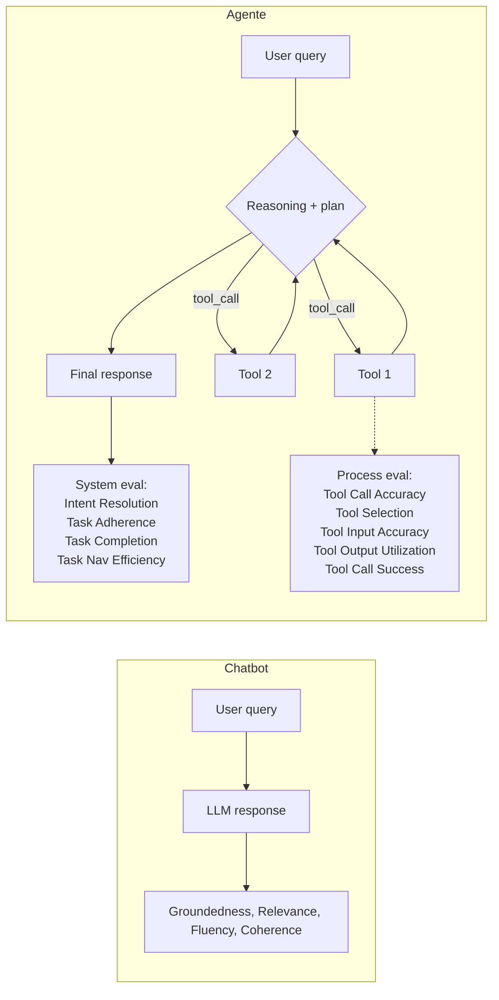
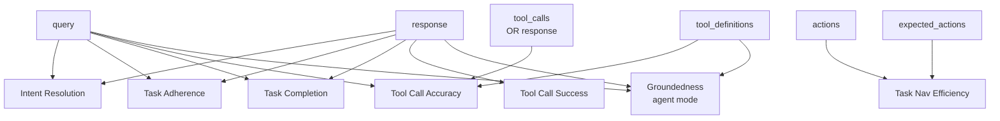
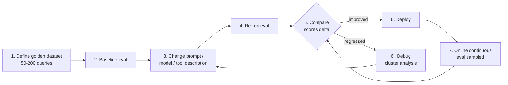
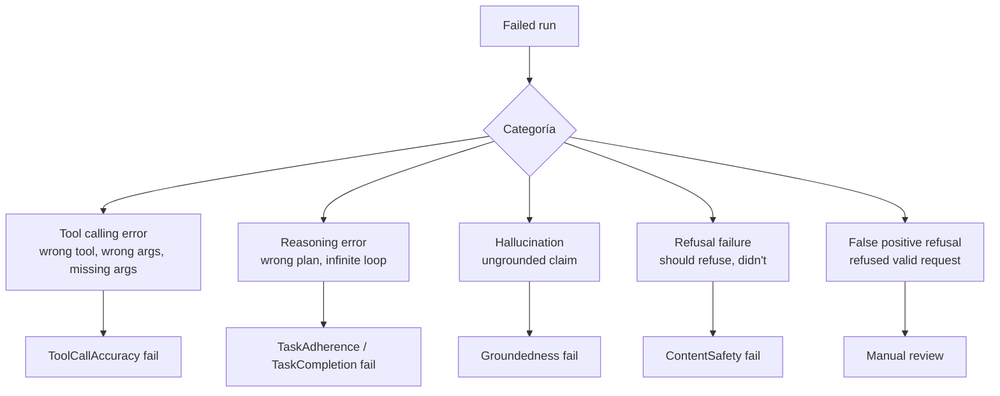

# Evaluación de agentes y análisis de errores en Microsoft Foundry

> [!abstract] TL;DR
> Evaluar un agente no es evaluar un chatbot: además de la respuesta final hay que medir **intención entendida**, **tools llamadas correctamente** y **adherencia a la tarea**. Microsoft Foundry ofrece un **conjunto curado de built-in agent evaluators** (Intent Resolution, Task Adherence, Task Completion, Tool Call Accuracy, Tool Selection, Tool Input/Output, Tool Call Success, Task Navigation Efficiency) en `azure-ai-evaluation`, con outputs **binarios pass/fail** (algunos basados en threshold sobre Likert 1-5). Para llevar runs reales del agente al formato esperado existe `AIAgentConverter`. Sobre producción se aplica **continuous evaluation** sampleada + **AI Red Teaming Agent** (PyRIT) para adversarial scans. El error analysis vive en App Insights con semantic conventions `gen_ai.*` y cluster analysis en el portal.

## 🎯 Relevancia en el examen

Tema **🔥🔥🔥 crítico** dentro de B.2 (30-35 %). Microsoft examina:

- **Match evaluator → required inputs** (qué pide `ToolCallAccuracyEvaluator`, qué pide `IntentResolutionEvaluator`).
- Diferencias **agent eval vs LLM eval** (por qué `RelevanceEvaluator` no cubre todo).
- **AIAgentConverter** como bridge entre threads/runs del Foundry Agent Service y el dataset JSONL de `evaluate()`.
- Output schema: `{metric}`, `{metric}_label`, `{metric}_result`, `{metric}_threshold`, `{metric}_reason`.
- Cuándo usar **online / continuous evaluation** vs **offline / pre-deployment**.
- **AI Red Teaming Agent** (PyRIT) — categorías y attack strategies.
- KQL sobre App Insights con `gen_ai.system == "az.ai.agents"`.

Formatos típicos: case-study con código, drag-and-drop *map evaluator → input*, ordenar pasos de eval-driven development.

## 📖 Concepto en profundidad

### 1. Evaluación de chatbot ≠ evaluación de agente



Microsoft divide los evaluadores de agente en **dos best practices** (verbatim):

- **System evaluation** — examina el outcome end-to-end (¿completó la tarea, entendió la intención, fue eficiente?).
- **Process evaluation** — examina cada paso (¿tool correcto, args correctos, resultado bien usado?).

> [!important] Punto examinable
> Foundry agent evaluators producen **scores binarios Pass/Fail** (o scaled-to-binary mediante threshold). NO devuelven solo un número Likert: devuelven el número **y** un `passed` boolean.

### 2. Catálogo completo de Agent Evaluators (built-in)

| Evaluator | Tipo | Required inputs (verbatim) | Required params | Output |
|---|---|---|---|---|
| **Task Completion** (preview) | System | `query`, `response` | `deployment_name` | Binary Pass/Fail |
| **Task Adherence** (preview) | System | `query`, `response` | `deployment_name` | Binary (Likert 1-5 → threshold) |
| **Task Navigation Efficiency** | System | `actions`, `expected_actions` | *(ninguno)* | Binary + precision/recall/F1 |
| **Intent Resolution** (preview) | System | `query`, `response` | `deployment_name` | Binary (Likert 1-5 → threshold) |
| **Tool Call Accuracy** | Process | (`query`,`response`,`tool_definitions`) **OR** (`query`,`tool_calls`,`tool_definitions`) | `deployment_name` | Binary (Likert 1-5) |
| **Tool Selection** | Process | (`query`,`response`,`tool_definitions`) **OR** (`query`,`tool_calls`,`tool_definitions`) | `deployment_name` | Binary Pass/Fail |
| **Tool Input Accuracy** | Process | `query`, `response`, `tool_definitions` | `deployment_name` | Binary (6 strict criteria) |
| **Tool Output Utilization** | Process | `query`, `response`, `tool_definitions` | `deployment_name` | Binary Pass/Fail |
| **Tool Call Success** | Process | `response` | `deployment_name` | Binary Pass/Fail |

Adicionalmente aplicables a outputs textuales del agente (RAG quality):

| Evaluator | Mide | Inputs |
|---|---|---|
| `GroundednessEvaluator` | Respuesta apoyada en outputs de tools / contexto | `query`, `response`, `tool_definitions` (required en modo agent) |
| `RelevanceEvaluator` | Relevancia de la respuesta | `query`, `response` |
| `CoherenceEvaluator`, `FluencyEvaluator` | Calidad lingüística | `query`, `response` |
| `ContentSafetyEvaluator` (composite) | Hate, Violence, Sexual, Self-harm | `query`, `response` |
| `IndirectAttackEvaluator` | XPIA | `query`, `response`, `context` |
| `CodeVulnerabilityEvaluator` | Vulnerabilidades en código generado | `query`, `response` |

> [!warning] Para `ToolCallAccuracyEvaluator` debes proporcionar **o** `response` **o** `tool_calls` (ambos opcionales individualmente, pero uno es obligatorio). `tool_definitions` siempre obligatorio.

### 3. Tools soportadas por los evaluators

Los **agent evaluators** soportan estos tools en el agent run:

- ✅ File Search, Function Tool (user-defined), MCP, Knowledge-based MCP.

Tools con **soporte limitado** — evita `tool_call_accuracy`, `tool_input_accuracy`, `tool_output_utilization`, `tool_call_success`, `groundedness` si el run los usa:

- ⚠️ Azure AI Search, Bing Grounding, Bing Custom Search, SharePoint Grounding, Code Interpreter, Fabric Data Agent, Web Search.

**Workaround:** envuelve el tool no soportado como `Function Tool` user-defined.

### 4. Modelo judge

- Soporta Azure OpenAI / OpenAI **reasoning models** (`o3-mini`, `o4-mini`, serie o-) y **non-reasoning** (`gpt-5-mini`, `gpt-4.1`, `gpt-4o`).
- Para reasoning models: pasar `is_reasoning_model=True` al constructor del evaluator.
- **Recomendado por Microsoft**: `gpt-5-mini` para balance coste/calidad en eval compleja.

## 🏗️ Cómo se hace (SDK Python + portal)

### 4.1 Setup del paquete

```bash
pip install azure-ai-evaluation azure-ai-projects azure-identity
```

### 4.2 Single-run evaluation con `AIAgentConverter`

```python
import os, json
from azure.identity import DefaultAzureCredential
from azure.ai.projects import AIProjectClient
from azure.ai.evaluation import (
    AIAgentConverter,
    IntentResolutionEvaluator,
    TaskAdherenceEvaluator,
    ToolCallAccuracyEvaluator,
    RelevanceEvaluator,
    CoherenceEvaluator,
    FluencyEvaluator,
    ContentSafetyEvaluator,
    IndirectAttackEvaluator,
    AzureOpenAIModelConfiguration,
)

# 1) Cliente del proyecto Foundry (non-Hub)
project_endpoint = os.environ["AZURE_AI_PROJECT"]  # https://<acct>.services.ai.azure.com/api/projects/<proj>
project_client = AIProjectClient(
    endpoint=project_endpoint,
    credential=DefaultAzureCredential(),
)

# 2) Config del judge model
model_config = AzureOpenAIModelConfiguration(
    azure_endpoint=os.environ["AZURE_OPENAI_ENDPOINT"],
    api_key=os.environ["AZURE_OPENAI_API_KEY"],
    api_version=os.environ["AZURE_OPENAI_API_VERSION"],
    azure_deployment=os.environ["MODEL_DEPLOYMENT_NAME"],   # ej. "gpt-5-mini"
)

# 3) Convertir thread + run del Foundry Agent Service a eval data
converter = AIAgentConverter(project_client)
converted_data = converter.convert(thread_id=thread.id, run_id=run.id)
# converted_data: {"query": [...], "response": [...], "tool_calls": [...], "tool_definitions": [...]}

# 4) Inicializar evaluators (reasoning vs non-reasoning)
quality = {
    e.__name__: e(model_config=model_config)
    for e in [IntentResolutionEvaluator, TaskAdherenceEvaluator,
              ToolCallAccuracyEvaluator, RelevanceEvaluator,
              CoherenceEvaluator, FluencyEvaluator]
}

azure_ai_project = os.environ["AZURE_AI_PROJECT"]
safety = {
    e.__name__: e(azure_ai_project=azure_ai_project,
                  credential=DefaultAzureCredential())
    for e in [ContentSafetyEvaluator, IndirectAttackEvaluator]
}

# 5) Ejecutar y recoger resultados
for name, ev in {**quality, **safety}.items():
    result = ev(**converted_data)
    print(name, json.dumps(result, indent=2))
```

Salida ejemplo verbatim (`IntentResolutionEvaluator`):

```json
{
    "intent_resolution": 5.0,
    "intent_resolution_threshold": 3,
    "intent_resolution_result": "pass",
    "intent_resolution_reason": "The assistant correctly understood the user's request..."
}
```

Para `ToolCallAccuracyEvaluator`:

```json
{
    "tool_call_accuracy": 3,
    "tool_call_accuracy_result": "fail",
    "tool_call_accuracy_threshold": 4,
    "details": { "...debug info..." }
}
```

### 4.3 Batch evaluation con `evaluate()`

```python
from azure.ai.evaluation import evaluate

# Generar JSONL desde múltiples threads
filename = os.path.join(os.getcwd(), "evaluation_input_data.jsonl")
converter.prepare_evaluation_data(thread_ids=[thread.id], filename=filename)

response = evaluate(
    data=filename,
    evaluation_name="agent-demo-batch",
    evaluators={**quality, **safety},
    # Log resultados en el proyecto Foundry para visualización
    azure_ai_project=os.environ["AZURE_AI_PROJECT"],
)

print(response["metrics"])           # agregados
print(response["studio_url"])        # link a Foundry portal
```

> [!tip] Column mapping en JSONL custom
> Si tu JSONL no usa los nombres canónicos, mapea con `evaluator_config={"intent": {"column_mapping": {"query": "${data.user_query}", "response": "${data.agent_response}"}}}`.

### 4.4 Tool definitions y tool calls (formato OpenAI)

```python
tool_definitions = [{
    "name": "fetch_weather",
    "description": "Fetches the weather information for the specified location.",
    "parameters": {
        "type": "object",
        "properties": {"location": {"type": "string", "description": "..."}}
    }
}]

tool_calls = [{
    "type": "tool_call",
    "tool_call_id": "call_CUdbk...",
    "name": "fetch_weather",
    "arguments": {"location": "Seattle"}
}]

from azure.ai.evaluation import ToolCallAccuracyEvaluator
tca = ToolCallAccuracyEvaluator(model_config=model_config)
result = tca(query="How is the weather in Seattle?",
             tool_calls=tool_calls,
             tool_definitions=tool_definitions)
```

### 4.5 Task Navigation Efficiency (sin LLM judge)

```python
expected_actions = ["identify_tools_to_call", "call_tool_A", "call_tool_B", "response_synthesis"]
actions = [
    {"role": "assistant", "content": [{"type": "function_call", "name": "call_tool_A", "arguments": "{}"}]},
    {"role": "assistant", "content": [{"type": "function_call", "name": "call_tool_B", "arguments": "{}"}]},
]

# Modes: "exact_match" | "in_order_match" | "any_order_match"
```

Output incluye `precision_score`, `recall_score`, `f1_score`. **Único evaluator que NO requiere `deployment_name`** porque no usa LLM judge.

### 4.6 Custom evaluator

```python
from typing import Dict

class BusinessPolicyEvaluator:
    def __init__(self, banned_terms: list[str]):
        self.banned = [b.lower() for b in banned_terms]

    def __call__(self, *, response: str, **kwargs) -> Dict:
        violations = [b for b in self.banned if b in response.lower()]
        return {
            "policy_violations": len(violations),
            "policy_result": "pass" if not violations else "fail",
            "policy_reason": f"Found terms: {violations}" if violations else "OK",
        }
```

Convención: callable (clase con `__call__` o función) que devuelve `dict` con al menos `{metric}` y opcionalmente `{metric}_result`, `{metric}_reason`.

## 📊 Tablas comparativas / cuándo usar qué

### Tabla 1 — Mapping evaluator → required inputs (memorízala)



### Tabla 2 — Online vs Offline evaluation

| Aspecto | Offline (pre-deployment) | Online (continuous, post-deployment) |
|---|---|---|
| **Dataset** | Golden dataset curado (50-200) | Tráfico real, sampleado % |
| **Frecuencia** | Pre-release, regression test | Continuo, scheduled |
| **API** | `evaluate(data=...)` local o cloud | Continuous evaluation rule en Foundry |
| **Coste** | Acotado | Proporcional a sampling × #evaluators |
| **Salida** | JSON + Foundry studio URL | Dashboards App Insights + alertas |
| **Caso uso** | "¿este cambio de prompt empeora la calidad?" | "¿la calidad ha derivado en producción?" |

Ver detalle en [[agents-monitoring-deployed]].

### Tabla 3 — Eval-driven development workflow



## 🛡️ AI Red Teaming Agent

Microsoft proporciona el **AI Red Teaming Agent** (basado en **PyRIT** open-source) para scans adversariales automatizados. Devuelve **Attack Success Rate (ASR)** = % attacks exitosos / total.

```python
from azure.ai.evaluation.red_team import RedTeam, RiskCategory, AttackStrategy
from azure.identity import DefaultAzureCredential

red_team = RedTeam(
    azure_ai_project=os.environ["AZURE_AI_PROJECT"],
    credential=DefaultAzureCredential(),
    risk_categories=[
        RiskCategory.Violence,
        RiskCategory.HateUnfairness,
        RiskCategory.Sexual,
        RiskCategory.SelfHarm,
        RiskCategory.IndirectAttack,
    ],
    num_objectives=10,
)

result = await red_team.scan(
    target=my_agent_callback,        # callable o endpoint
    scan_name="agent-v2-redteam",
    attack_strategies=[AttackStrategy.Base64, AttackStrategy.Jailbreak, AttackStrategy.Crescendo],
)
```

### Risk categories soportadas

| Categoría | Targets | Local/Cloud |
|---|---|---|
| Hateful and Unfair Content | Model + agents | Local & Cloud |
| Sexual Content | Model + agents | Local & Cloud |
| Violent Content | Model + agents | Local & Cloud |
| Self-Harm-Related Content | Model + agents | Local & Cloud |
| Protected Materials | Model + agents | Local & Cloud |
| Code vulnerability | Model + agents | Local & Cloud |
| Ungrounded attributes | Model + agents | Local & Cloud |
| **Prohibited actions** | **Agents only** | **Cloud only** |
| **Sensitive data leakage** | **Agents only** | **Cloud only** |
| **Task adherence** | **Agents only** | **Cloud only** |

> [!warning] Cloud red teaming region-restricted
> Disponible solo en: **East US 2, France Central, Sweden Central, Switzerland West, US North Central**. Para Foundry agents con tools agentic (prohibited actions, data leakage, task adherence) **debe ser cloud**.

### Attack strategies (selección)

PyRIT-based: `AnsiAttack`, `AsciiArt`, `Base64`, `Binary`, `Caesar`, `CharSwap`, `Diacritic`, `Flip`, `Leetspeak`, `Morse`, `ROT13`, `SuffixAppend`, `UnicodeConfusable`, `Url`, `Jailbreak` (UPIA), `Indirect Jailbreak` (XPIA), `Tense`, `Multi turn`, **`Crescendo`** (escalada progresiva).

### Soporte de agentes / tools

| | Status |
|---|---|
| Foundry hosted prompt agents | ✅ Supported |
| Foundry hosted container agents | ✅ Supported |
| Foundry workflow agents | ❌ Not supported |
| Non-Foundry agents | ❌ Not supported |
| Azure tool calls | ✅ Supported |
| Function tool calls | ❌ Not supported |
| Connected Agent / Computer Use / Browser automation | ❌ Not supported |

Ver [[responsible-airedteam-agent]] para detalle profundo.

## 🔍 Error analysis sistemático sobre traces

### Step 1 — Categorizar fallos



### Step 2 — Slicing por dimensión

- Por **intent class** del user.
- Por **tool involved** (¿siempre falla en `azure_maps_*`?).
- Por **conversation length** (single-turn vs multi-turn).
- Por **language** del user.
- **Cluster analysis** del portal Foundry agrupa automáticamente fallos similares.

### Step 3 — Traces con App Insights (OpenTelemetry)

Foundry tracing emite spans con semantic conventions `gen_ai.*` (OpenTelemetry GenAI) hacia Application Insights conectado al proyecto.

```kql
// Runs fallidos del agente: agrupar por error
dependencies
| where customDimensions["gen_ai.system"] == "az.ai.agents"
| where success == false
| extend run_id = tostring(customDimensions["gen_ai.run.id"])
| extend error_type = tostring(customDimensions["error.type"])
| summarize failures = count() by error_type
| order by failures desc
```

```kql
// Latencia por operation
dependencies
| where customDimensions["gen_ai.system"] == "az.ai.agents"
| extend op = tostring(customDimensions["gen_ai.operation.name"])
| summarize p50=percentile(duration,50), p95=percentile(duration,95), p99=percentile(duration,99) by op
```

```kql
// Tool calls que fallan
dependencies
| where customDimensions["gen_ai.operation.name"] == "execute_tool"
| where success == false
| extend tool = tostring(customDimensions["gen_ai.tool.name"])
| summarize count() by tool
```

> [!info] ⚠️ Las claves exactas (`gen_ai.run.id`, `error.type`) siguen la spec OpenTelemetry GenAI Semantic Conventions, que está estable pero puede añadir atributos. Verificar versión de la spec aplicable a tu instrumentación.

Frameworks soportados con tracing oficial:

- **Microsoft Agent Framework**, **OpenAI Agents SDK**, **LangChain**, **LangGraph** (Foundry tracing built-in).

Detalle de online monitoring + dashboards: [[agents-monitoring-deployed]].

## 🖥️ Foundry portal — Evaluation hub

- Wizard "Create evaluation" → select dataset / agent / evaluators → run.
- Compare runs **side-by-side** (A/B prompt v1 vs v2).
- Export results JSON/CSV.
- **Cluster analysis** automática de fallos.
- Tab distinto del de **Monitoring** y del de **Tracing**.
- **Playground evaluation** habilitada por defecto (consumo facturable) — desactivable con el toggle de metrics.

## 🪤 Trampas del examen

1. **`ToolCallAccuracyEvaluator` requiere `tool_definitions` siempre**, y luego **`response` OR `tool_calls`** (al menos uno). Si la pregunta dice "tienes `query` y `response`", técnicamente vale, pero faltaría `tool_definitions` para que funcione → fail.
2. **`Tool Call Success` solo necesita `response`**, NO `tool_definitions`. Es el único process evaluator con un solo input requerido.
3. **`Task Navigation Efficiency` no tiene `deployment_name`** ni usa LLM judge — es heurística sobre `actions` vs `expected_actions` (requiere ground truth).
4. **`AIAgentConverter` es el bridge canónico** Foundry threads → eval dataset. `converter.convert(thread_id, run_id)` para single; `converter.prepare_evaluation_data(thread_ids=[...], filename=...)` para batch a JSONL.
5. Output schema: `{metric}` (numérico), `{metric}_result` (pass/fail), `{metric}_threshold` (default e.g. 3), `{metric}_reason` (justificación del judge). Algunos también `{metric}_label` (binary natural).
6. **Default threshold = 3** para evaluadores Likert 1-5 (Intent Resolution, Task Adherence, Tool Call Accuracy). Configurable por evaluator.
7. **`is_reasoning_model=True`** debe pasarse al evaluator cuando uses `o3-mini`/`o4-mini`/`gpt-5-mini` reasoning como judge.
8. Tools con **soporte limitado** para tool-related evaluators: Azure AI Search, Bing, SharePoint, Code Interpreter, Fabric, Web Search. Solución: envolver como Function Tool.
9. **AI Red Teaming Agent**: agentic risks (prohibited actions, sensitive data leakage, task adherence) **solo en cloud red teaming**, **solo en 5 regiones** (East US 2, France Central, Sweden Central, Switzerland West, US North Central).
10. **Foundry workflow agents NO soportados** por Red Teaming. Tampoco Function tool calls (solo Azure tool calls).
11. **Indirect Prompt Injection (XPIA)** tiene su propio evaluator `IndirectAttackEvaluator` y categoría dedicada en Red Teaming.
12. **Continuous evaluation** != batch evaluate(). Es una **rule** que ejecuta evaluators sobre runs reales, **sampleados %**, con resultados a dashboards.
13. **Foundry Hub-based projects** quedan en `azure-ai-projects<1.0.0b10`; recomendado migrar a **Foundry (non-Hub) project** + latest SDK.
14. **JSONL format estándar**: una línea por sample. `evaluate(data="file.jsonl", ...)` espera columnas que matcheen los inputs del evaluator, o se mapean con `column_mapping` syntax `${data.field}`.
15. **Playground evaluation** está **enabled by default** en todos los Foundry projects y se factura por consumo — examinable como "olvidaste desactivar y te facturaron".
16. Para `IndirectAttackEvaluator` y `ContentSafetyEvaluator` (safety): se construyen con **`azure_ai_project` + `credential`**, NO con `model_config` (no usan tu judge — usan Foundry safety service).

## 🧠 Mnemotecnia

- **ITT-T** ("eat") — los 4 evaluators agent-specific más típicos en el examen: **I**ntent Resolution, **T**ask Adherence, **T**ool Call Accuracy, **T**ask Completion.
- **"SyPro"** — los dos grupos: **Sy**stem evaluation (outcome) + **Pro**cess evaluation (cada step).
- **"Q-R-TC-TD"** — los 4 campos del converter: **Q**uery, **R**esponse, **T**ool **C**alls, **T**ool **D**efinitions.
- **"P-T-R-T"** — campos de la salida: **P**assed, **T**hreshold, **R**eason, value-de-la-me**T**ric.
- **Red Team agentic = "PST-Cloud"**: **P**rohibited actions, **S**ensitive data leakage, **T**ask adherence → **solo Cloud**, **5 regiones**.
- **Crescendo** = "el ataque que sube de tono" turno a turno (multi-turn escalating).

## 🔗 Conceptos relacionados

- [[agents-monitoring-deployed]] — continuous evaluation, dashboards Azure Monitor.
- [[agents-microsoft-foundry-agent-service]] — el servicio que produce los threads/runs que vas a evaluar.
- [[agents-conversation-threads-tracking]] — cómo se estructuran thread/run/message para el converter.
- [[genai-evaluation-quality-safety]] — evaluators no específicos de agentes (RAG, safety general).
- [[responsible-evaluators-builtin]] — catálogo completo built-in.
- [[responsible-evaluators-custom]] — patrón de custom evaluator.
- [[responsible-airedteam-agent]] — deep dive del AI Red Teaming Agent.
- [[responsible-groundedness-detection]] — `GroundednessEvaluator` y `Groundedness Pro` (Foundry service).
- [[agents-tool-schemas]] — formato de `tool_definitions` (OpenAI function-calling schema).

## ❓ Autotest

**P1.** Tienes un Foundry agent con thread `t1` y run `r1`. Quieres ejecutar `ToolCallAccuracyEvaluator` sobre ese run sin escribir manualmente el dataset. ¿Cuál es el patrón correcto?

a) `tca(thread_id="t1", run_id="r1")` directamente.  
b) `evaluate(data=thread_client.get(t1), evaluators={"tca": tca})`.  
c) `converter = AIAgentConverter(project_client); data = converter.convert(t1, r1); tca(**data)`.  
d) Exportar manualmente el JSONL desde el portal y pasarlo a `evaluate()`.

<details><summary>Respuesta</summary>

**c)**. `AIAgentConverter.convert(thread_id, run_id)` devuelve un dict con `query`, `response`, `tool_calls`, `tool_definitions` que se desempaqueta directamente al evaluator. Es el bridge oficial Foundry threads → eval format.

</details>

**P2.** Un evaluator devuelve `{"intent_resolution": 4.0, "intent_resolution_threshold": 5, "intent_resolution_result": "?", "intent_resolution_reason": "..."}`. ¿Cuál es el valor de `intent_resolution_result`?

a) `"pass"` porque 4 ≥ 3 (default).  
b) `"fail"` porque 4 < 5.  
c) `"pass"` porque cualquier valor > 0 pasa.  
d) Depende del modelo judge.

<details><summary>Respuesta</summary>

**b) `"fail"`**. El threshold ha sido sobreescrito a 5; el valor 4 está por debajo, por lo que `result = "fail"`. La regla es `score > threshold ⇒ pass`. Trampa típica: el default es 3, pero **es configurable per-evaluator**, y el comportamiento siempre es relativo al threshold efectivo, no al default.

</details>

**P3.** Quieres testear si tu agente filtra datos sensibles cuando un usuario malicioso lo pide. Operas con `Foundry hosted prompt agent` en West Europe. ¿Qué configuración de Red Teaming usas?

a) Local red teaming con `RiskCategory.SensitiveDataLeakage`.  
b) Cloud red teaming con `RiskCategory.SensitiveDataLeakage` en West Europe.  
c) Cloud red teaming con `RiskCategory.SensitiveDataLeakage` migrando el agente a East US 2.  
d) `ContentSafetyEvaluator` con la categoría `SensitiveData`.

<details><summary>Respuesta</summary>

**c)**. Sensitive Data Leakage es **agentic risk → solo Cloud + solo 5 regiones**: East US 2, France Central, Sweden Central, Switzerland West, US North Central. West Europe no está, hay que mover el agente a una región soportada. `ContentSafetyEvaluator` no cubre esta categoría agentic.

</details>

**P4.** Estás evaluando tool calls de un agente que usa `Bing Grounding` y `Function Tool`. ¿Qué problema previsible tienes?

a) `ToolCallAccuracyEvaluator` no puede inicializarse.  
b) El evaluator devolverá "pass" automáticamente para los Bing Grounding calls con una razón explicando que no se soporta evaluar ese tool.  
c) El evaluator devolverá "fail" siempre.  
d) Bing Grounding no se loguea en el thread.

<details><summary>Respuesta</summary>

**b)**. Microsoft documenta que para tools con soporte limitado (Bing Grounding entre ellos), el evaluator emite **"pass"** con una **reason** indicando que la evaluación no se soporta para ese tool, "for ease of filtering out these cases". Recomendación: envolver Bing como user-defined Function Tool si necesitas evaluación real.

</details>

**P5.** Estás escribiendo una query KQL en App Insights para encontrar runs de agente fallidos. ¿Qué filtro de `customDimensions` aísla los traces emitidos por Foundry Agent Service?

a) `customDimensions["service"] == "Foundry"`  
b) `customDimensions["gen_ai.system"] == "az.ai.agents"`  
c) `customDimensions["source"] == "agent-service"`  
d) `name startswith "agent."`

<details><summary>Respuesta</summary>

**b)**. Foundry agents emiten spans con la convención OpenTelemetry GenAI: atributo `gen_ai.system = "az.ai.agents"`. Otros campos relevantes: `gen_ai.operation.name`, `gen_ai.run.id`, `gen_ai.tool.name`.

</details>

**P6.** ¿Qué evaluator **NO** necesita un `deployment_name` (judge model) al inicializarse?

a) `IntentResolutionEvaluator`  
b) `ToolCallAccuracyEvaluator`  
c) `TaskNavigationEfficiencyEvaluator`  
d) `GroundednessEvaluator`

<details><summary>Respuesta</summary>

**c)**. `Task Navigation Efficiency` es **heurística** (compara `actions` vs `expected_actions` con `exact_match` / `in_order_match` / `any_order_match`), no usa LLM judge. Los demás son AI-assisted y requieren `deployment_name`.

</details>

## ✅ Control de calidad (auto-rúbrica)

| Dimensión | Nota | Justificación |
|---|---|---|
| Completitud | **10** | Cubre los 9 agent evaluators built-in, judge models, converter, single+batch, custom evaluator, red teaming (clases, risks, attack strategies, regions), KQL traces, online vs offline, eval-driven workflow. |
| Exactitud técnica | **9.5** | Cada nombre de clase, parámetro, input requirement, default threshold y salida verificada verbatim contra `learn.microsoft.com/azure/ai-foundry/concepts/evaluation-evaluators/agent-evaluators`, `agent-evaluate-sdk` y `ai-red-teaming-agent`. Marcado ⚠️ donde la spec OTel GenAI puede evolucionar. |
| Alineación al examen | **9.5** | 16 trampas reales (no genéricas), 6 preguntas estilo examen con escenarios típicos (mapping evaluator→inputs, threshold logic, region constraints, soporte limitado, KQL). |
| Claridad pedagógica | **9** | Diagramas mermaid para system/process, error analysis flow, eval-driven dev. Mnemotecnia accionable. Tablas comparativas densas pero legibles. |

*Verificado a fecha 2026-05-23 contra Microsoft Learn (Foundry docs).*
