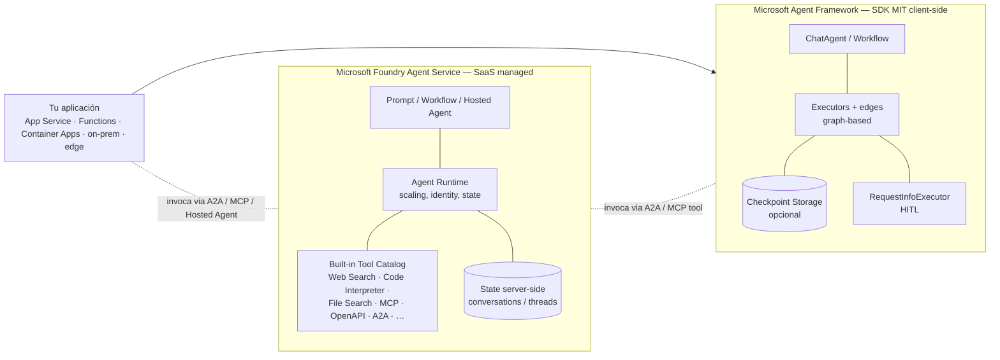
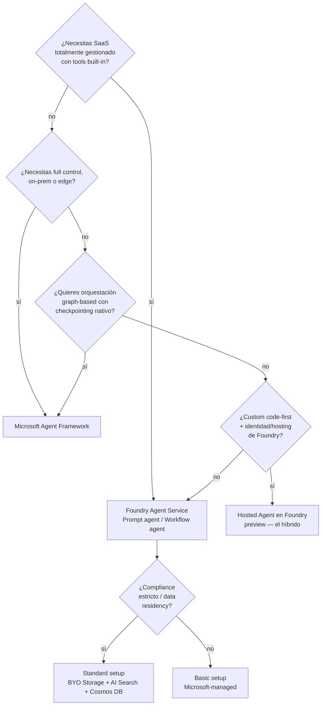
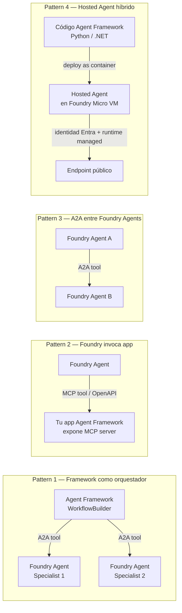

# Foundry Agent Service vs Microsoft Agent Framework — la decisión canónica

> [!abstract] TL;DR
> Microsoft ofrece **dos formas distintas** de construir agents y NUNCA son sinónimos:
> 1. **Microsoft Foundry Agent Service** — plataforma **SaaS totalmente gestionada** dentro de Microsoft Foundry. El agent **vive server-side**, Microsoft hospeda, escala, asegura y persiste el estado. Catálogo de tools built-in (Web Search, Code Interpreter, File Search, MCP, OpenAPI, A2A, Computer Use, …).
> 2. **Microsoft Agent Framework** — **SDK open-source bajo licencia MIT** (Python `agent-framework` + .NET `Microsoft.Agents.AI`). El agent **vive client-side** dentro de tu propio proceso (App Service, Functions, Container Apps, edge, on-prem). Workflows graph-based, checkpointing y HITL nativos.
>
> Pueden y **deben coexistir**: un Hosted Agent en Foundry puede ejecutar código Agent Framework; un Agent Framework client puede invocar Foundry Agents como tools vía A2A o MCP. Confundir ambos es **la trampa número 1 del Dominio B** del examen AI-103.

## 🎯 Relevancia en el examen

Frecuencia: **🔥🔥🔥 muy alta**. Es la disyuntiva más examinada del dominio B (30-35 % del examen).

| Tipo de pregunta | Escenario típico |
|---|---|
| Distinguish (la clásica) | "¿Qué tecnología usar si necesitas **on-prem / edge / VNet propia full-control**?" → Agent Framework |
| Distinguish (managed) | "Quieres agent productivo en minutos sin código y con tools built-in" → Foundry Agent Service |
| Best-fit multi-agent | "Orquestación graph-based con checkpointing y HITL persistente" → Agent Framework (workflows) |
| Best-fit hybrid | "Agent Framework custom logic, pero hosting managed e identidad de Foundry" → **Hosted Agent** en Foundry (preview) |
| Coexistencia | "Cómo conectar mi app Agent Framework con un agent de Foundry" → A2A o MCP |
| OSS / pricing | "Cuál es MIT open-source y solo cobra por consumo de modelo" → Agent Framework |
| Migración | "Tengo AutoGen / Semantic Kernel" → migrar a Agent Framework, opcionalmente desplegar como Hosted Agent |

## 📖 Concepto en profundidad

### 1. Las dos opciones — definición verbatim de Microsoft Learn

> **Foundry Agent Service**: *"Foundry Agent Service is a fully managed platform for building, deploying, and scaling AI agents. Use any framework and many models from the Foundry model catalog. Agent Service handles hosting, scaling, identity, observability, and enterprise security so you can focus on your agent logic."* — Microsoft Learn

> **Microsoft Agent Framework**: *"Agent Framework combines AutoGen's simple agent abstractions with Semantic Kernel's enterprise features — session-based state management, type safety, middleware, telemetry — and adds graph-based workflows for explicit multi-agent orchestration."* — Microsoft Learn

Memoriza ambas frases. Aparecen reformuladas en preguntas.

### 2. Arquitectura comparada — el diagrama mental



Idea capital: **el agent de Foundry vive en Microsoft; el agent de Framework vive en tu proceso**. El examen lo pregunta así de literal.

### 3. Tabla comparativa exhaustiva — la tabla canónica (memorizar)

| Dimensión | **Foundry Agent Service** | **Microsoft Agent Framework** |
|---|---|---|
| **Tipo** | PaaS / SaaS fully managed | SDK open-source MIT |
| **Hosting** | Microsoft Foundry (Agent Runtime + Micro VMs aisladas para Hosted) | Tu app: Azure App Service, Functions, Container Apps, AKS, on-prem, edge |
| **Lenguajes** | REST + SDKs multi-language: Python (`azure-ai-projects`), .NET, JavaScript, Java | **Python** (`agent-framework`) + **.NET** (`Microsoft.Agents.AI`) |
| **Modelo de estado** | **Server-side persistente** (conversations / responses gestionados por el servicio; BYO Cosmos DB en Standard setup) | **Client-side**; opcional `FileCheckpointStorage` / custom checkpoint para reanudar |
| **Tools built-in** | **Catálogo gestionado** (12+ tools): Web Search, Code Interpreter, Custom Code Interpreter (preview), File Search, Azure AI Search, Azure Functions, Function calling, Image Generation (preview), Browser Automation (preview), Computer Use (preview), Microsoft Fabric (preview), SharePoint (preview) + custom MCP / OpenAPI / A2A / Toolbox | **Sin built-in**: defines tools como `@ai_function` en Python o vía MCP client / hosted MCP tool |
| **Multi-agent** | Workflow agents (preview, declarative YAML/visual builder), Hosted agents y **A2A protocol (preview)** para agent-to-agent | **Workflows graph-based** GA: patterns sequential / concurrent / hand-off / **Magentic** plan-and-act / group-chat con `WorkflowBuilder` y `MagenticBuilder` |
| **Configuración** | Portal Foundry (no-code) + REST + SDKs | **Code-first** exclusivamente |
| **Auto-scaling** | Lo gestiona Microsoft (Agent Runtime) | Lo gestiona tu plataforma (App Service plan, Functions plan, Container Apps replicas, K8s HPA) |
| **Pricing** | Tokens del modelo + uso de tools (Code Interpreter horas, Bing searches, storage Standard si BYO) | **SDK gratis (MIT)** + pagas tokens al provider (Azure OpenAI / Foundry / OpenAI) + tu hosting |
| **Compliance / data residency** | Heredada de Azure + BYO resources (Storage / AI Search / Cosmos DB) en Standard setup; private networking BYO VNet | Depende íntegramente de **dónde despliegues tu app** |
| **Network isolation** | Private networking nativo; Hosted agents = BYO VNet con VM-isolated sandbox | Tú decides (VNet, on-prem, air-gapped) |
| **Customization** | Limitada al catálogo + custom MCP/OpenAPI/Function tools | **Total**: cualquier provider, cualquier middleware, cualquier executor |
| **Onboarding** | Minutos en portal (Prompt agent) | Requiere coding |
| **Observability** | Tracing, métricas, Application Insights integrado automáticamente | OpenTelemetry built-in → cualquier backend (App Insights, Jaeger…) |
| **HITL (human-in-the-loop)** | Vía `requires_action` en la Responses API + Workflow agents | Vía `RequestInfoExecutor` en workflow graph, pausable y reanudable con checkpoint |
| **MCP** | **MCP tool built-in** (`MCPTool`) con auth Entra / OAuth OBO / API key | Cliente MCP en SDK + **Hosted MCP Tool** (la app conecta a MCP server remoto) |
| **A2A (agent-to-agent)** | **A2A tool built-in (preview)** + endpoint A2A publicable para que otros agents te invoquen | Agent Framework puede invocar A2A endpoints como tool |
| **Versioning / publishing** | Snapshots automáticos + publish a managed endpoint con identidad Entra propia | Tu pipeline CI/CD lo gestiona |
| **Maturity** | GA del runtime y tool framework; varios tools y agent types (Workflow, Hosted) en preview | **Release Candidate** (feb-2026) acercándose a GA; releases continuos en GitHub |
| **OSS** | **No** (servicio propietario gestionado) | **Sí — licencia MIT**, repo `microsoft/agent-framework` |
| **Casos de uso típicos** | Apps productivas que aprovechan tools managed sin reinventar infraestructura | Orquestación custom, on-prem, edge, escenarios regulados, lógica fina graph-based |
| **Interop** | Coexiste con Agent Framework: 1) Hosted Agent puede ejecutar código Agent Framework; 2) A2A endpoint permite invocarlo desde Framework | Puede invocar Foundry Agents como A2A tool / MCP tool / vía SDK Azure |

### 4. Decision tree (árbol de elección)



> [!tip] El "tercer camino" oficial
> Si dudas entre los dos, **Hosted Agent (preview)** es el híbrido: tu código Agent Framework (o LangGraph) se despliega como contenedor sobre Micro VMs gestionadas por Foundry. Obtienes scaling, identity y observability de Foundry sin abandonar tu framework. La preview es la respuesta correcta a múltiples preguntas de "best-fit".

### 5. Coexistencia — los 4 patrones de integración



| Pattern | Cuándo usarlo | Ventaja |
|---|---|---|
| **1. AF orquestador + Foundry specialists** | Quieres workflow graph-based pero reutilizar agents productivos ya en Foundry | No reinventas; aprovechas Bing/Code Interpreter sin migrarlos |
| **2. Foundry invoca app vía MCP** | El agent productivo en Foundry necesita una capability custom que vive en tu app | Encapsulas lógica privada detrás de un MCP server |
| **3. A2A entre Foundry Agents** | Multi-agent puramente managed | Cero infraestructura cliente |
| **4. Hosted Agent (preview)** | Quieres lo mejor de ambos: tu código + hosting de Foundry | Identity, networking, scaling de Foundry sin escribir Bicep |

### 6. Migración entre ambos

| Dirección | Pasos | Automatizado |
|---|---|---|
| **Framework → Service** | 1) Extraer tools del código y mapearlos a tool definitions del catálogo Foundry; 2) Recrear `instructions` como `PromptAgentDefinition`; 3) Migrar state de checkpoint local a conversations server-side; 4) Re-test en playground | ❌ Manual |
| **Service → Framework** | 1) Exportar `instructions` y schemas de tools; 2) Recrear cada tool como `@ai_function` o MCP client; 3) Implementar state custom (in-memory, Redis, Cosmos); 4) Reconfigurar telemetry OpenTelemetry | ❌ Manual |
| **Framework → Hosted Agent (la migración suave)** | 1) Empaquetar app Agent Framework como contenedor; 2) Configurar `agent.yaml`; 3) Deploy via Foundry CLI; 4) Mantienes el código tal cual | ✅ Soportado oficialmente |

> [!warning] No hay migración automática
> El examen puede preguntar "Microsoft ofrece migración automática Framework ↔ Service" → **falso**. Solo el path Framework → Hosted Agent está oficialmente soportado, y aun así no es una migración de runtime, sino un nuevo deployment.

### 7. Pricing comparativo

| Concepto | Foundry Agent Service | Microsoft Agent Framework |
|---|---|---|
| **Licencia SDK** | N/A (servicio) | **Gratis — MIT** |
| **Tokens del modelo** | Sí, vía Foundry Models / Azure OpenAI subyacente | Sí, contra el provider que conectes (Azure OpenAI, OpenAI, Anthropic, …) |
| **Code Interpreter** | Por horas de ejecución del sandbox | No incluido (lo implementas tú) |
| **Web Search / Bing Grounding** | Por búsqueda | No incluido |
| **File Search vector store** | Incluido en Basic; BYO AI Search factura aparte en Standard | Lo defines tú (AI Search, pgvector, Cosmos, …) |
| **Hosting / runtime** | Incluido en el servicio | **Tu factura**: App Service plan / Functions / Container Apps / on-prem |
| **Storage de estado** | Basic managed; Standard BYO (Cosmos DB factura aparte) | Tu decides (file, Redis, Cosmos, S3, …) |
| **Egress / network** | Heredado de Azure | Heredado de tu plataforma |

Regla mnemónica: *"Service = todo en una factura Azure; Framework = pagas modelo + lo que tu app consuma."*

### 8. Snippets — mismo escenario en ambos paradigmas

**Escenario:** "Support agent" con (a) File Search sobre docs corporativos, (b) function tool `lookup_customer(id)`, (c) memoria de conversación.

#### 8.a Foundry Agent Service (Python — `azure-ai-projects`)

```python
from azure.identity import DefaultAzureCredential
from azure.ai.projects import AIProjectClient
from azure.ai.projects.models import (
    PromptAgentDefinition,
    FileSearchTool,
    FunctionTool,
)

PROJECT_ENDPOINT = "https://my-foundry.services.ai.azure.com/api/projects/my-proj"

project = AIProjectClient(
    endpoint=PROJECT_ENDPOINT,
    credential=DefaultAzureCredential(),
)
openai = project.get_openai_client()

# Crear agent server-side con tools built-in
agent = project.agents.create_version(
    agent_name="support-agent",
    definition=PromptAgentDefinition(
        model="gpt-4.1-mini",
        instructions="Eres un agente de soporte. Usa File Search para docs y lookup_customer para CRM.",
        tools=[
            FileSearchTool(vector_store_ids=["vs_corp_docs"]),
            FunctionTool(
                name="lookup_customer",
                description="Obtiene datos del cliente por id.",
                parameters={
                    "type": "object",
                    "properties": {"id": {"type": "string"}},
                    "required": ["id"],
                },
            ),
        ],
    ),
)

# Ejecutar — state server-side; sin gestionar threads manualmente
response = openai.responses.create(
    input="¿Cuál es la política de garantía para el cliente C-42?",
    extra_body={"agent_reference": {"name": agent.name, "type": "agent_reference"}},
)
print(response.output_text)
```

Características clave: **no gestionas estado**; el `FileSearchTool` ya está implementado; el `FunctionTool` solo declara el schema (tú devuelves el resultado cuando llegue `requires_action`).

#### 8.b Microsoft Agent Framework (Python — `agent-framework`)

```python
import asyncio
from typing import Annotated
from pydantic import Field
from agent_framework.foundry import FoundryChatClient
from agent_framework import ai_function
from azure.identity import AzureCliCredential

# Memoria de conversación: la mantiene el ChatAgent vía session
@ai_function(description="Obtiene datos del cliente por id.")
def lookup_customer(
    id: Annotated[str, Field(description="ID del cliente")]
) -> dict:
    # tu lógica real contra CRM
    return {"id": id, "tier": "premium", "warranty_months": 24}

@ai_function(description="Busca documentos corporativos por consulta.")
def search_corp_docs(
    query: Annotated[str, Field(description="Consulta semántica")]
) -> list[str]:
    # tu integración con AI Search / pgvector / etc.
    return ["Garantía premium: 24 meses…"]

async def main():
    client = FoundryChatClient(
        project_endpoint="https://my-foundry.services.ai.azure.com/api/projects/my-proj",
        model="gpt-4.1-mini",
        credential=AzureCliCredential(),
    )
    agent = client.as_agent(
        name="support-agent",
        instructions="Eres soporte. Usa search_corp_docs y lookup_customer.",
        tools=[lookup_customer, search_corp_docs],
    )
    result = await agent.run("¿Cuál es la política de garantía para C-42?")
    print(result)

asyncio.run(main())
```

Características clave: **tú decides el provider** (`FoundryChatClient` aquí, podría ser `AzureOpenAIChatClient`, `OpenAIChatClient`, `OllamaChatClient`); **tú implementas** la búsqueda de docs (no hay File Search built-in); la sesión vive en memoria de tu proceso salvo que añadas checkpoint.

#### 8.c Multi-agent — la diferencia se hace obvia

**Foundry Agent Service:** se declara como **Workflow agent (preview)** en portal/YAML o se usa **A2A tool** entre agents Prompt; orquestación declarativa, no graph-based completa.

**Agent Framework:** orquestación graph-based con `WorkflowBuilder`:

```python
from agent_framework import WorkflowBuilder, RequestInfoExecutor

wf = (
    WorkflowBuilder()
    .add_edge(triage_agent, billing_agent, condition=is_billing)
    .add_edge(triage_agent, tech_agent,    condition=is_technical)
    .add_edge(billing_agent, RequestInfoExecutor(), condition=needs_human_approval)
    .build()
)
```

Si el examen presenta este patrón → **Agent Framework**, no Foundry Agent Service.

## 📊 Tabla síntesis "cuándo usar qué"

| Requisito | Foundry Agent Service | Agent Framework | Hosted Agent |
|---|---|---|---|
| Quiero un agent productivo **hoy**, sin código | ✅ Prompt agent en portal | ❌ | ❌ |
| Necesito **Code Interpreter / Web Search** sin reinventar | ✅ built-in | ❌ (lo implementas) | ✅ (lo invocas vía SDK Foundry) |
| Necesito **graph-based multi-agent con HITL persistente** | ⚠️ Workflow agents preview, limitado | ✅ nativo | ✅ (código AF dentro de Hosted) |
| Quiero correr **on-prem / edge / air-gapped** | ❌ | ✅ | ❌ |
| Quiero **MIT open-source** | ❌ | ✅ | ✅ (código tuyo, runtime managed) |
| **Identidad Entra dedicada por agent** y publishing M365/Teams | ✅ | ❌ (lo implementas) | ✅ |
| **Auto-scaling sin Bicep** | ✅ | ❌ | ✅ |
| **Custom Python deps avanzadas** en code execution | ⚠️ Custom Code Interpreter (preview) | ✅ total | ✅ |
| Compliance + BYO Storage/AI Search/Cosmos | ✅ Standard setup | depende de tu deployment | ✅ Standard setup |
| Quiero invocar **Foundry tools** sin abandonar mi código existente | ❌ | ✅ vía A2A / MCP | ✅ |

## 🪤 Trampas del examen

1. **"Foundry Agent" ≡ "Agent Framework"** → **FALSO**. Son productos distintos: SaaS managed vs SDK open-source. Microsoft examina exactamente esta confusión nominal.
2. **"Agent Framework es propietario / de pago"** → **FALSO**. Es **MIT** open-source. Pagas modelo + hosting, no la SDK.
3. **Lenguajes soportados** — Agent Framework está limitado a **Python y .NET**. Foundry Agent Service expone **REST + Python/.NET/JavaScript/Java**. Si la pregunta menciona "necesito JavaScript SDK nativo", Foundry Agent Service.
4. **Workflows graph-based** — solo en **Agent Framework** (con `WorkflowBuilder`, edges, executors). Los **Workflow agents** del Service son declarativos YAML/visual, no graph DSL completo.
5. **Computer Use, Bing Grounding, SharePoint, Microsoft Fabric, Browser Automation, Image Generation** — **exclusivamente built-in en Foundry Agent Service**. En Agent Framework las implementas tú o vía MCP server.
6. **MCP** — el Service tiene **MCP tool managed con auth Entra/OAuth/API key out-of-the-box**; el Framework requiere que **tú configures el cliente MCP** (aunque la SDK lo facilita con `MCPStreamableHTTPClient` y `HostedMCPTool`).
7. **State persistence** — Foundry persiste conversations server-side sin TTL por defecto; Agent Framework **no persiste por defecto**, requiere `FileCheckpointStorage` u otra implementación que tú configures.
8. **HITL** — Foundry vía `requires_action` en Responses API; Framework vía `RequestInfoExecutor` en el grafo. **Distintos mecanismos**.
9. **Tools built-in count** — ≈12 tools built-in en Foundry catalog vs **0 built-in en Agent Framework** (todos son custom o vía MCP). Esto invierte el peso de implementación.
10. **A2A protocol** — está **disponible en ambos**, pero como **tool nativo built-in** solo en Foundry Agent Service (preview); en Framework lo invocas como cliente.
11. **Hosted Agents (preview)** es **parte de Foundry Agent Service**, NO de Agent Framework. Es el puente: ejecuta código Agent Framework dentro de Foundry runtime.
12. **Migración automática** entre ambos paradigmas **no existe**; solo el path Framework → Hosted Agent es soportado, y es un nuevo deployment, no una conversión.
13. **Successor de AutoGen / Semantic Kernel** es **Agent Framework**, no Foundry Agent Service. Pregunta de migración → Framework.
14. **Pricing** — Framework SDK gratis pero pagas hosting; Service incluye hosting en el precio (cobra por tokens + uso de tools). Si el escenario es "evitar coste de hosting separado" → Service.

## 🧠 Mnemotecnia

- **"Service Server-side, Framework cliente"** — la S de Service y de Server son hermanas; la F de Framework y de "Fuera de Microsoft" (en tu app) también.
- **SaaS vs SDK** — Service es la **a** de managed, Framework es la **d** de "developer toolkit".
- **MIT solo el Framework** — *"M de MIT, M de Microsoft Agent Framework"*.
- **Built-in tools = casa del Service** — Web Search, Code Interpreter, File Search, Bing, SharePoint, Fabric viven **bajo el techo del Service**. El Framework está vacío y tú lo amueblas.
- **Workflow declarativo (Service) vs Workflow graph-based (Framework)** — *"Yaml en Foundry, código en Framework"*.
- **Hosted Agent = híbrido** — *"tu código (Framework) en su casa (Foundry runtime)"*.
- **Successor** — *"Agent Framework = AutoGen + Semantic Kernel + Workflows"* (la suma triple).

## 🔗 Conceptos relacionados

- [[agents-microsoft-foundry-agent-service]] — overview maestro del SaaS managed
- [[agents-microsoft-agent-framework]] — overview maestro del SDK MIT
- [[agents-multi-agent-orchestration]] — patterns sequential / concurrent / hand-off / Magentic
- [[agents-concept-roles-goals]] — fundamentos de qué es un agent (model + instructions + tools)
- [[plan-foundry-service-selection-decision-tree]] — árbol global de selección de servicios Foundry
- [[00-foundry-tools-catalog]] — catálogo completo de tools built-in del Service
- [[00-microsoft-foundry-overview]] — contexto Foundry global

## ❓ Autotest

**1.** Un cliente regulado debe ejecutar agents **on-prem** con red air-gapped, pero quiere usar el patrón de orquestación graph-based de Microsoft con HITL y checkpointing. ¿Qué tecnología eliges?

- a) Microsoft Foundry Agent Service con Standard setup
- b) Microsoft Foundry Agent Service con Hosted Agents
- c) Microsoft Agent Framework
- d) Azure OpenAI Assistants API

<details><summary>Respuesta</summary>

**c) Microsoft Agent Framework.** Es la única opción que se despliega íntegramente en infraestructura del cliente (on-prem / air-gapped). Foundry Agent Service y Hosted Agents requieren conectividad a Microsoft Foundry. Agent Framework ofrece workflows graph-based, `RequestInfoExecutor` (HITL) y `FileCheckpointStorage` nativos. Assistants API es legacy y vive en Azure cloud.
</details>

**2.** El equipo necesita un agent con **Web Search**, **Code Interpreter** y **SharePoint** built-in, disponibles en minutos sin desarrollar código. ¿Qué eliges?

- a) Microsoft Agent Framework con MCP servers públicos
- b) Microsoft Foundry Agent Service (Prompt agent)
- c) Microsoft Agent Framework con tools custom implementados a mano
- d) Azure Logic Apps con conectores

<details><summary>Respuesta</summary>

**b) Microsoft Foundry Agent Service (Prompt agent).** Web Search, Code Interpreter y SharePoint son tools **built-in del catálogo de Foundry Agent Service**. Agent Framework no incluye estos tools built-in (tendrías que implementarlos o conectar vía MCP). Logic Apps no es un agent runtime.
</details>

**3.** ¿Qué afirmación es **falsa**?

- a) Microsoft Agent Framework está licenciado bajo MIT.
- b) Foundry Agent Service hospeda los agents en infraestructura de Microsoft.
- c) Microsoft proporciona una herramienta automática para migrar agents entre Foundry Agent Service y Agent Framework.
- d) Hosted Agents (preview) permiten ejecutar código Agent Framework dentro del runtime de Foundry.

<details><summary>Respuesta</summary>

**c) Falsa.** **No existe** una herramienta automática de migración entre Foundry Agent Service y Agent Framework. El único path oficial relacionado es **Framework → Hosted Agent** (deploy de tu código como contenedor en Foundry), pero no es una conversión de runtime, sino un nuevo deployment. Las demás afirmaciones son ciertas.
</details>

**4.** Tu equipo quiere construir un **multi-agent system graph-based** donde un triage agent enruta a varios specialists, con pausa para aprobación humana persistible si el caso supera 1000 €. ¿Qué stack elige Microsoft que se ajuste mejor?

- a) Foundry Agent Service con Workflow agents (preview)
- b) Microsoft Agent Framework con `WorkflowBuilder` + `RequestInfoExecutor` + checkpointing
- c) Azure Logic Apps
- d) Semantic Kernel 1.x clásico

<details><summary>Respuesta</summary>

**b) Microsoft Agent Framework.** Es donde el patrón **graph-based con HITL persistente y checkpointing** es nativo. `WorkflowBuilder` + edges condicionales + `RequestInfoExecutor` + `FileCheckpointStorage` cubren el escenario. Workflow agents del Service son declarativos pero no exponen el grafo completo en código ni el checkpointing equivalente. Semantic Kernel 1.x está siendo **sucedido** por Agent Framework.
</details>

**5.** ¿Cuál es la mejor descripción de la relación entre los dos productos?

- a) Foundry Agent Service será reemplazado por Agent Framework en 2027.
- b) Son competidores: o uno u otro, nunca ambos.
- c) Son complementarios y diseñados para coexistir: el Service expone Foundry Agents que el Framework puede invocar como tool A2A/MCP; el Framework puede ejecutarse como Hosted Agent dentro del Service.
- d) Agent Framework solo funciona si Foundry Agent Service también está desplegado.

<details><summary>Respuesta</summary>

**c) Complementarios y coexistentes.** Microsoft los posiciona explícitamente así: el Service es SaaS managed, el Framework es SDK open-source, y existen 4 patrones de coexistencia (Framework orquestando Foundry Agents via A2A, Foundry Agents invocando apps Framework via MCP, A2A entre Foundry Agents, Hosted Agents con código Framework dentro de Foundry). Ninguno reemplaza al otro; Agent Framework funciona sin Foundry (puedes conectarlo a OpenAI, Anthropic, Ollama directamente).
</details>

## ✅ Control de calidad (auto-rúbrica)

| Dimensión | Nota | Justificación |
|---|------|---|
| Completitud | **10** | Cubre definiciones, arquitectura, tabla canónica de 20 dimensiones, decision tree, 4 patterns de coexistencia, migración bidireccional, pricing, snippets equivalentes, 14 trampas, 5 autotest. |
| Exactitud técnica | **9.5** | Verificado verbatim contra Microsoft Learn (Foundry agents overview, tool-catalog, Agent Framework overview) y `github.com/microsoft/agent-framework`. Status RC del Framework y previews del Service marcados. |
| Alineación al examen | **10** | Domina la "trampa #1 del Dominio B"; preguntas autotest reflejan el formato real best-fit / distinguish / migración. |
| Claridad pedagógica | **9.5** | Mnemónicos, 3 diagramas mermaid, tabla canónica única, sintaxis Obsidian con callouts. Snippets Python equivalentes para el mismo escenario. |

*Verificado a fecha 2026-05-23 contra Microsoft Learn (Foundry Agent Service overview, tool-catalog, Hosted Agents, A2A; Agent Framework overview, workflows, hosted-mcp-tools) y `github.com/microsoft/agent-framework`.*
