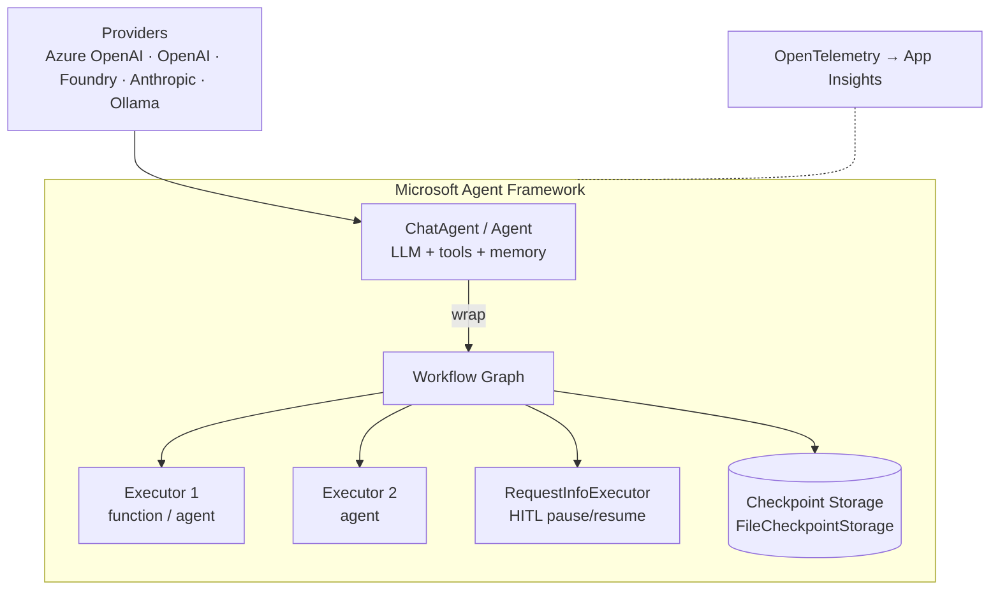
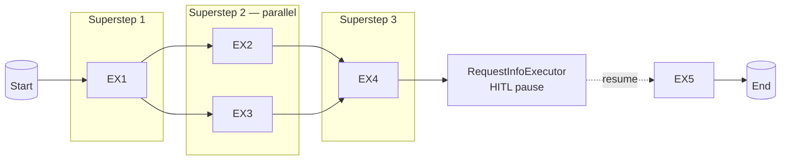
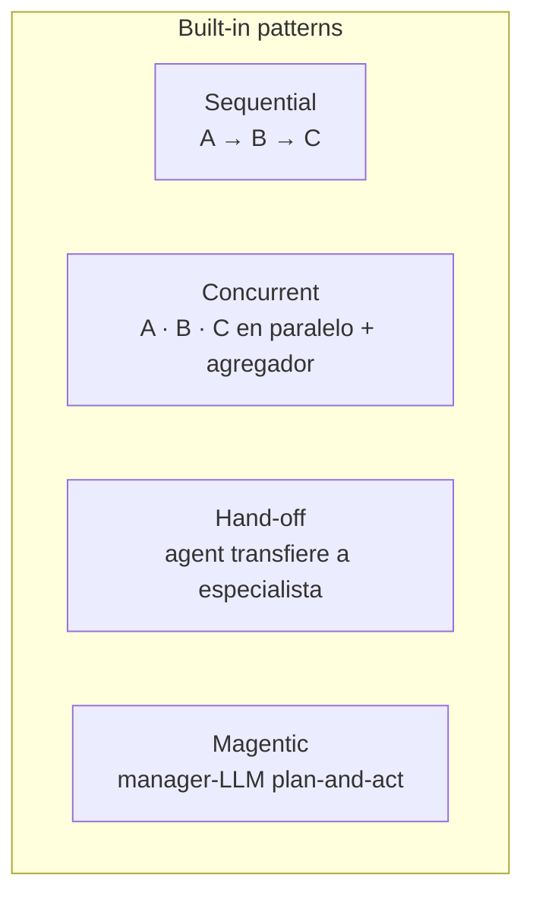
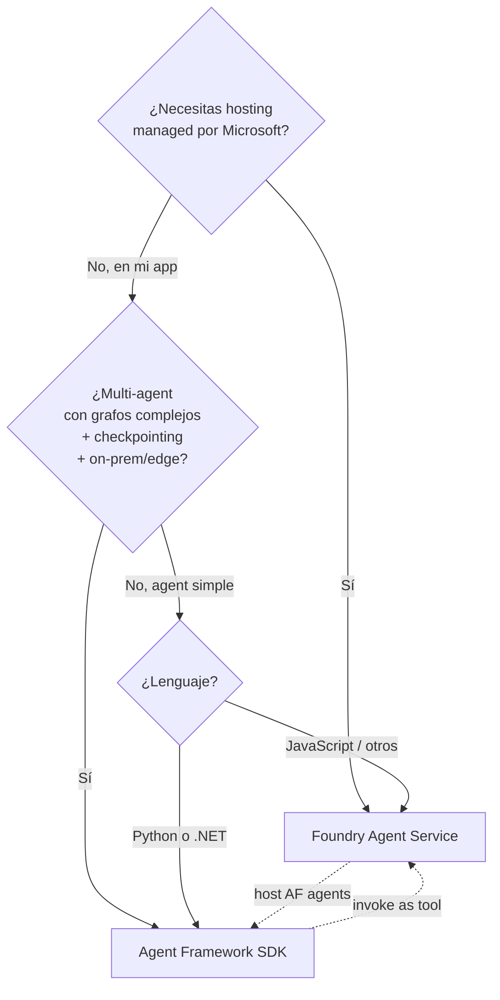

# Microsoft Agent Framework — SDK open-source para agents y workflows

> [!abstract] TL;DR
> **Microsoft Agent Framework** es el **SDK open-source (MIT)** oficial de Microsoft para construir agents individuales y **workflows multi-agent graph-based** dentro de tu propia aplicación. Es el **sucesor unificado** de **Semantic Kernel** (enterprise features: middleware, telemetry, state) y **AutoGen** (abstracciones simples de orquestación multi-agent), creado por los mismos equipos. Soporta **Python** (`pip install agent-framework`) y **.NET** (`Microsoft.Agents.AI`). Alcanzó **Release Candidate el 19-feb-2026** y se acerca a **GA**. Convive con **Foundry Agent Service** (SaaS managed server-side): Agent Framework vive **client-side** en tu app, ofrece **checkpointing built-in**, ejecución **BSP** (superstep-based) sobre grafos de `executors` y `edges`, y patterns built-in **sequential / concurrent / hand-off / Magentic**.

## 🎯 Relevancia en el examen

Frecuencia: **🔥🔥🔥 muy alta**. Cae junto a `[[agents-microsoft-foundry-agent-service]]` en el dominio B (30-35 %). Microsoft examina **explícitamente la elección entre SDK (Agent Framework) y SaaS (Foundry Agent Service)** y los **patterns de orquestación multi-agent**.

| Tipo de pregunta | Escenario típico |
|---|---|
| Best-fit | "Necesitas orquestar agents on-prem + edge con checkpointing" → Agent Framework, no Foundry Agent Service |
| Migración | "Aplicación legacy con AutoGen `AssistantAgent` y `RoundRobinGroupChat`" → mapear a `ChatAgent` + `WorkflowBuilder` o `MagenticBuilder` |
| Distinguir | Agent Framework (SDK client-side) vs Foundry Agent Service (SaaS server-side) |
| Code rellenar | `WorkflowBuilder().add_edge(...).build()` + `RequestInfoExecutor` para HITL |
| Pattern matching | sequential pipeline, concurrent fan-out, handoff specialist, Magentic plan-and-act |
| Telemetry | OpenTelemetry + Application Insights nativo |

## 📖 Concepto en profundidad

### 1. ¿Qué es Microsoft Agent Framework?

**SDK open-source bajo licencia MIT**, repositorio `microsoft/agent-framework`. Ofrece **dos categorías de capacidades** (verbatim Microsoft Learn):

| Categoría | Descripción oficial |
|---|---|
| **Agents** | "Individual agents that use LLMs to process inputs, call tools and MCP servers, and generate responses". Providers soportados: **Microsoft Foundry, Anthropic, Azure OpenAI, OpenAI, Ollama, …** |
| **Workflows** | "Graph-based workflows that connect agents and functions for multi-step tasks with type-safe routing, checkpointing, and human-in-the-loop support" |

Frase clave verbatim que debes memorizar:

> *"Agent Framework combines AutoGen's simple agent abstractions with Semantic Kernel's enterprise features — session-based state management, type safety, middleware, telemetry — and adds graph-based workflows for explicit multi-agent orchestration."* — Microsoft Learn

> [!important] Diferencia capital con Foundry Agent Service
> **Agent Framework = SDK que corre en TU proceso/contenedor/edge** (te lo descargas, instalas, hosteas).  
> **Foundry Agent Service = SaaS managed que corre en Microsoft Foundry** (te lo expone vía endpoint).  
> **Coexisten**: Foundry Agent Service puede hostear agents construidos con Agent Framework dentro de un **Hosted agent** (Micro VMs).

### 2. Arquitectura — agents vs workflows



Regla pedagógica verbatim de Microsoft Learn — **cuándo usar uno u otro**:

| Use an agent when… | Use a workflow when… |
|---|---|
| The task is open-ended or conversational | The process has well-defined steps |
| You need autonomous tool use and planning | You need explicit control over execution order |
| A single LLM call (possibly with tools) suffices | Multiple agents or functions must coordinate |

> *"If you can write a function to handle the task, do that instead of using an AI agent."* — Microsoft Learn (literal). Trampa típica.

### 3. Componentes principales (memorizar nombres exactos)

| Componente | Función | Clase Python (verificada) |
|---|---|---|
| **Chat client** | Cliente del LLM provider | `FoundryChatClient`, `AzureOpenAIChatClient`, `OpenAIChatClient`, `OllamaChatClient` |
| **Agent** | Unidad ejecutora con LLM + tools + instructions | `Agent` (también referido como `ChatAgent`) |
| **Tools** | Funciones registrables | decorador `@tool` / `@function_tool` o pasadas en `tools=[...]` |
| **Workflow Builder** | Constructor del grafo | `WorkflowBuilder` |
| **Executor** | Nodo del grafo (función, agent, RequestInfo, sub-workflow) | clases derivadas de `Executor` |
| **Edge** | Conexión tipada entre executors (con condiciones opcionales) | `add_edge(src, dst, condition=…)` |
| **RequestInfoExecutor** | Pausa el workflow para pedir input externo (HITL) | `RequestInfoExecutor` |
| **Checkpoint storage** | Persistencia de estado | `FileCheckpointStorage(storage_path="./checkpoints")` |
| **Session / Context provider** | Memory short-term y long-term | `AgentThread`, context providers |
| **Middleware** | Intercepta acciones del agent (logging, policies) | middleware API |
| **Magentic** | Pattern multi-agent plan-and-act con manager LLM | `MagenticBuilder` |

⚠️ El brief mencionaba "BSP (Bulk Synchronous Parallel)" como término. Microsoft Learn lo describe como **"superstep-based parallel execution"** / **"superstep-boundary checkpoints"**. El modelo es efectivamente **BSP-style** (superstep = un nivel del grafo en paralelo + barrera de sincronización), aunque la doc oficial usa preferentemente el término **"superstep"** y no el acrónimo BSP.

### 4. Workflows — modelo de ejecución superstep (BSP)



- Cada **superstep** ejecuta en paralelo todos los executors listos.
- Al final de cada superstep hay una **barrera de sincronización**; el `checkpoint_storage` puede serializar el estado.
- Mensajes entre executors son **type-safe** (validación en el `add_edge`).
- **HITL**: cuando un `RequestInfoExecutor` emite un `request_info` event, el workflow se pausa hasta recibir la respuesta y luego **reanuda desde el checkpoint**.

### 5. Patterns de orquestación multi-agent



| Pattern | Builder/Clase | Uso típico |
|---|---|---|
| **Sequential** | `SequentialBuilder` o edges en cadena | Pipeline lineal writer → reviewer → editor |
| **Concurrent** | `ConcurrentBuilder` | Fan-out a N agents y agregación de resultados |
| **Hand-off** | edges + lógica de routing / decorador handoff | Triage agent decide a qué especialista enrutar |
| **Magentic** | `MagenticBuilder` | Manager LLM planifica + delega a workers (sucesor de `MagenticOneGroupChat` de AutoGen) |
| **Group chat** ⚠️ | No es un builder dedicado en AF; se modela con Magentic o con un grafo custom | El concepto "group chat" de AutoGen se migra a **Magentic** o a workflows con routing |

> [!warning] Trampa frecuente
> El **"GroupChat"** de AutoGen (`RoundRobinGroupChat`, `SelectorGroupChat`, `MagenticOneGroupChat`) **NO es un pattern con builder único llamado "GroupChat" en Agent Framework**. Migra así: `RoundRobinGroupChat` → workflow con edges en ciclo round-robin; `SelectorGroupChat` → workflow con LLM-driven routing; `MagenticOneGroupChat` → `MagenticBuilder`.

### 6. APIs duales — Functional vs Graph

Microsoft Learn (verbatim) define dos APIs **complementarias**:

| - | **Functional (`@workflow`, experimental, Python)** | **Graph (`WorkflowBuilder`)** |
|---|---|---|
| **Control flow** | Python nativo (`if`, loops, `asyncio.gather`) | Edges y condiciones |
| **Best for** | Sequential pipelines, custom loops, ad-hoc parallelism | Fixed graphs, fan-out/fan-in, type-validated routing |
| **Parallelism** | `asyncio.gather` | Parallel edge groups, superstep execution |
| **HITL** | `ctx.request_info()` | `RequestInfoExecutor` |
| **Checkpointing** | Per-`@step` result caching | Superstep-boundary checkpoints |
| **Agent wrapping** | `.as_agent()` on `FunctionalWorkflow` | `.as_agent()` on `Workflow` |

Recomendación oficial: **empieza con `@workflow`**, migra a `WorkflowBuilder` cuando necesites type-safety estricta o grafo fijo.

### 7. Telemetry built-in — OpenTelemetry → Application Insights

- **OpenTelemetry nativo**: spans por agent step, por tool call y por executor.
- Exporta a **Application Insights**, Jaeger, OTLP-compatible backends.
- Trazabilidad end-to-end: prompt, response, tool args, tool output, latency, tokens.
- Critical para `[[responsible-trace-logging-provenance.md|trace logging]]` y auditoría.

### 8. Capabilities adicionales (verbatim README)

- "Python and C#/.NET Support"
- "Multiple Agent Provider Support"
- "Middleware"
- "Orchestration Patterns & Workflows"
- "Foundry Hosted Agents"
- "Observability"
- "Declarative Agents" (YAML)
- "Agent Skills"
- "AF Labs"
- "DevUI" (visualizador de workflows en local)

## 🏗️ Cómo se hace — Setup + snippets Python

### 8.1 Instalación

```bash
pip install agent-framework
```

> [!note] Auth Azure
> Agent Framework **no carga automáticamente** ficheros `.env`. Si los usas, llama `load_dotenv()` al inicio. Para auth en Azure usa `AzureCliCredential` (dev) o `ManagedIdentityCredential` (producción) — evita `DefaultAzureCredential` en prod por riesgo de credential probing (warning oficial).

### 8.2 ChatAgent simple con tool

```python
import asyncio
from agent_framework.foundry import FoundryChatClient
from agent_framework import Agent, tool
from azure.identity import AzureCliCredential

@tool
def get_weather(city: str) -> str:
    """Devuelve el tiempo para una ciudad."""
    return f"Sunny, 22°C in {city}"

async def main():
    client = FoundryChatClient(
        project_endpoint="https://my-foundry.services.ai.azure.com/api/projects/my-project",
        model="gpt-4o-mini",
        credential=AzureCliCredential(),
    )
    agent = Agent(
        client=client,
        name="WeatherAgent",
        instructions="You are a helpful weather assistant. Use the tool.",
        tools=[get_weather],
    )
    result = await agent.run("What's the weather in Madrid?")
    print(f"Agent: {result}")

asyncio.run(main())
```

### 8.3 Workflow sequential (graph-based) con 3 agents

```python
from agent_framework import WorkflowBuilder, Agent
from agent_framework.foundry import FoundryChatClient
from azure.identity import AzureCliCredential

client = FoundryChatClient(
    project_endpoint="https://my-foundry.services.ai.azure.com/api/projects/my-project",
    model="gpt-4o-mini",
    credential=AzureCliCredential(),
)

writer = Agent(client=client, name="writer",   instructions="Write a draft article.")
reviewer = Agent(client=client, name="reviewer", instructions="Critique the draft.")
editor = Agent(client=client, name="editor",   instructions="Produce a polished final version.")

workflow = (
    WorkflowBuilder()
    .add_edge(writer, reviewer)
    .add_edge(reviewer, editor)
    .set_start_executor(writer)
    .build()
)

async def main():
    result = await workflow.run("Topic: superstep-based workflows in AI agents")
    print(result)
```

### 8.4 Workflow concurrent (fan-out)

```python
from agent_framework import ConcurrentBuilder

# ConcurrentBuilder ejecuta agents en paralelo y agrega resultados
workflow = ConcurrentBuilder().add_participants([researcher, summarizer, fact_checker]).build()
result = await workflow.run("Latest news on Azure AI in 2026")
```

⚠️ El nombre exacto del builder concurrente puede variar entre versiones RC; verifica en `python/samples/03-workflows/orchestrations/concurrent.py` del repo `microsoft/agent-framework`. La doc oficial menciona el pattern "concurrent" como built-in.

### 8.5 Hand-off pattern

```python
from agent_framework import WorkflowBuilder

triage = Agent(client=client, name="triage",
               instructions="Decide if the user needs 'billing' or 'tech' support.")
billing = Agent(client=client, name="billing", instructions="Handle billing questions.")
tech = Agent(client=client, name="tech",       instructions="Handle technical issues.")

def route(msg) -> str:
    return "billing" if "invoice" in msg.text.lower() else "tech"

workflow = (
    WorkflowBuilder()
    .add_edge(triage, billing, condition=lambda m: route(m) == "billing")
    .add_edge(triage, tech,    condition=lambda m: route(m) == "tech")
    .set_start_executor(triage)
    .build()
)
```

### 8.6 Magentic — group chat plan-and-act (sucesor de `MagenticOneGroupChat`)

```python
from agent_framework import (
    MagenticBuilder,
    MagenticHumanInterventionDecision,
    MagenticHumanInterventionKind,
    MagenticHumanInterventionReply,
    MagenticHumanInterventionRequest,
)
from typing import cast

workflow = (
    MagenticBuilder(
        name="MagenticManager",
        participants=[researcher, coder, reviewer],
        manager_client=client,  # LLM que orquesta el plan
    )
    .build()
)

async for event in workflow.run_stream("Build a Python script that scrapes Azure pricing"):
    if event.type == "request_info" and event.request_type is MagenticHumanInterventionRequest:
        req = cast(MagenticHumanInterventionRequest, event.data)
        if req.kind == MagenticHumanInterventionKind.PLAN_REVIEW:
            reply = MagenticHumanInterventionReply(
                decision=MagenticHumanInterventionDecision.APPROVE
            )
            await workflow.send(reply)
```

### 8.7 HITL con `RequestInfoExecutor` + checkpointing

```python
from agent_framework import WorkflowBuilder, RequestInfoExecutor, FileCheckpointStorage

checkpoint_storage = FileCheckpointStorage(storage_path="./checkpoints")

approval = RequestInfoExecutor(prompt="Approve plan? (yes/no)")

workflow = (
    WorkflowBuilder(checkpoint_storage=checkpoint_storage)
    .add_edge(planner, approval)
    .add_edge(approval, executor_agent, condition=lambda m: m.text == "yes")
    .set_start_executor(planner)
    .build()
)

# Si se cae el proceso, se reanuda desde el último superstep persistido
result = await workflow.run_or_resume("Plan a migration to Azure")
```

> [!important] Ventaja clave sobre AutoGen
> *"Another key advantage of Agent Framework's `Workflow` over AutoGen's `Team` abstraction is built-in support for checkpointing and resuming execution"* — Microsoft Learn. AutoGen no tenía checkpointing nativo; había que implementarlo manualmente.

## 📊 Tablas comparativas

### Agent Framework (SDK) vs Foundry Agent Service (SaaS)

| Aspecto | Agent Framework (SDK) | Foundry Agent Service (SaaS) |
|---|---|---|
| Naturaleza | SDK open-source MIT | Servicio gestionado en Foundry |
| Hosting | **Tu app / tu contenedor / on-prem / edge** | **Microsoft Foundry** (managed) |
| Lenguajes | **Python**, **.NET** | API REST + multi-SDK (Python, .NET, JS) — Responses API |
| Estado | Client-side; checkpointing opcional (`FileCheckpointStorage`) | Server-side managed (conversations, responses) |
| Multi-agent | Built-in (Workflows, Magentic, Sequential, Concurrent) | Workflow agents (preview) + A2A protocol |
| Identidad/RBAC | La que provee tu app | Microsoft Entra + roles Foundry built-in |
| Telemetry | OpenTelemetry (tú configuras export) | Application Insights integrado en Foundry |
| Coste | Solo pagas providers (Azure OpenAI, etc.) | Pagas Foundry Agent Service + storage (Standard) + tokens |
| Cuándo usar | Control fino, on-prem, edge, hybrid, lógica compleja en código | Producción rápida managed, Copilot/Teams integration, Micro VMs |
| Coexistencia | **SÍ** — puede invocar Foundry Agents como tools/specialists | **SÍ** — puede hostear agents AF en **Hosted agents** (preview) |

### Migración rápida — AutoGen / Semantic Kernel → Agent Framework

| Origen | Mapeo en Agent Framework |
|---|---|
| AutoGen `AssistantAgent` | `Agent` (multi-turn por defecto; `AssistantAgent` era single-turn salvo `max_tool_iterations`) |
| AutoGen `BaseChatAgent` (subclassing) | Custom `Executor` o `Agent` con tools |
| AutoGen `RoundRobinGroupChat` | Workflow con edges en ciclo round-robin |
| AutoGen `SelectorGroupChat` | Workflow con LLM-driven routing |
| AutoGen `MagenticOneGroupChat` | `MagenticBuilder` |
| AutoGen `GraphFlow` (control-flow) | `WorkflowBuilder` (data-flow, type-safe) |
| AutoGen `OpenAIAssistantAgent` | `OpenAIResponsesClient` / `FoundryAgent` |
| SK `Kernel` + `KernelPlugin` | `Agent` + `@tool` / `@function_tool` |
| SK `KernelFunction` | tool function decorada |
| SK Memory store | Context provider / `AgentThread` |

### Árbol de decisión — ¿Agent Framework o Foundry Agent Service?



## 🪤 Trampas del examen

1. **Agent Framework ≠ Foundry Agent Service**. El primero es **SDK open-source MIT** que corre en tu proceso; el segundo es **SaaS managed** en Foundry. La pregunta más vendida: "Necesito orquestar agents en edge sin dependencia de cloud" → **Agent Framework**.
2. **Sucesor de SK + AutoGen, no de "ChatGPT plugins" ni "Azure Functions"**. Si el examen ofrece "Agent Framework reemplaza a Azure Functions" o "a Copilot Studio" → **falso**.
3. **Lenguajes oficiales: Python y .NET (C#) únicamente**. NO hay SDK oficial JavaScript/TypeScript en GA — solo workarounds vía REST a Foundry Agent Service. Si la pregunta pinta un equipo Node.js puro, mejor Foundry Agent Service.
4. **Patterns built-in**: sequential, concurrent, hand-off y **Magentic** (no "GroupChat" como builder). `MagenticOneGroupChat` de AutoGen → `MagenticBuilder`. NO confundir con "round-robin" (que se modela como workflow).
5. **Checkpointing built-in con `FileCheckpointStorage`** en `WorkflowBuilder(checkpoint_storage=…)`. AutoGen **NO tenía** checkpointing nativo — diferenciador clave en preguntas de tolerancia a fallos.
6. **HITL = `RequestInfoExecutor`** (graph API) o `ctx.request_info()` (functional API). NO confundir con un "human approval tool" genérico.
7. **Modelo de ejecución superstep (BSP-style)**, no llamada de función regular. Cada superstep ejecuta executors en paralelo + barrera + (opcional) checkpoint. Si la pregunta dice "ejecución totalmente síncrona y secuencial" → falso para workflows.
8. **`Agent` (AF) es multi-turn por defecto** y reinvoca tools hasta producir respuesta final. AutoGen `AssistantAgent` era single-turn salvo `max_tool_iterations`. Microsoft puede preguntar exactamente esta diferencia.
9. **`Agent` (AF) es stateless** — no mantiene historial de conversación automáticamente entre `run()` (usa `AgentThread` o sessions). AutoGen `AssistantAgent` sí mantenía estado por defecto.
10. **Workflows son data-flow, type-safe**, no control-flow como `GraphFlow` de AutoGen. Mensajes entre executors **validan tipos en `add_edge`**.
11. **Foundry Agent Service puede hostear agents construidos con Agent Framework** dentro de **Hosted agents (Micro VMs)** — no son tecnologías opuestas, **coexisten**.
12. **`DefaultAzureCredential` en producción ❌** — la doc oficial avisa explícitamente: usa `ManagedIdentityCredential` específica para evitar credential probing y latencia.
13. **`.env` no se carga automáticamente** — debes llamar `load_dotenv()`. Pregunta clásica de troubleshooting.
14. **Estado RC en feb-2026, GA inminente**. Verifica versión exacta en PyPI antes de afirmar GA. ⚠️ Comprueba release notes oficiales.
15. **Telemetry = OpenTelemetry nativo**, NO un sistema propietario. Exporta a Application Insights / Jaeger / cualquier OTLP collector.

## 🧠 Mnemotecnia

- **"S-C-H-M"** patterns multi-agent: **S**equential, **C**oncurrent, **H**andoff, **M**agentic.
- **"SK + AutoGen ⊕ Workflows = Agent Framework"** (suma + cosa nueva).
- **"SDK in app · SaaS in cloud"**: Agent Framework = SDK in app · Foundry Agent Service = SaaS in cloud.
- **"BSP = Barrera + Superstep + Paralelo"**: cada superstep ejecuta en paralelo y sincroniza al final.
- **"CHIP"** ventajas vs AutoGen: **C**heckpointing, **H**ITL nativo, **I** tipos validados, **P**rovider-agnostic.
- **"Magentic manager piensa, workers actúan"**: pattern plan-and-act.
- **"Agent multi-turn, AssistantAgent single-turn"** (AF vs AutoGen) → la M de Multi.

## 🔗 Conceptos relacionados

- [[agents-microsoft-foundry-agent-service]] — la contraparte SaaS managed; coexiste.
- [[agents-foundry-service-vs-framework]] — tabla maestra de decisión SDK vs SaaS (este archivo es input principal).
- [[agents-concept-roles-goals]] — definición fundamental de agent (model + instructions + tools).
- [[agents-multi-agent-orchestration]] — patterns conceptuales (sequential/concurrent/hand-off/Magentic).
- [[agents-tool-schemas]] — cómo se definen tools (`@tool`, OpenAPI, MCP) y se registran en el `Agent`.
- [[agents-conversation-memory]] — `AgentThread`, context providers, sessions, short vs long-term memory.
- [[genai-multistep-reasoning-pipelines]] — workflows graph-based como implementación concreta de reasoning multi-step.
- [[responsible-agent-oversight-controls]] — controles de oversight (HITL con `RequestInfoExecutor`, approval pattern).
- [[responsible-trace-logging-provenance.md|trace logging]] — OpenTelemetry → Application Insights con spans por step.
- [[00-foundry-tools-catalog]] — herramientas que pueden invocarse desde tools de Agent Framework.

## ❓ Autotest

**1.** Una empresa ya tiene un pipeline AutoGen con `MagenticOneGroupChat` orquestando 4 agents. Va a migrar a Microsoft Agent Framework. ¿Qué clase usa como reemplazo directo?

- a) `RoundRobinGroupChat`
- b) `WorkflowBuilder` con edges round-robin
- c) `MagenticBuilder`
- d) `SequentialBuilder`

<details><summary>Respuesta</summary>
**c)** `MagenticBuilder` es el sucesor directo de `MagenticOneGroupChat` (manager LLM que planifica y delega a workers). `RoundRobinGroupChat` no existe en AF; `WorkflowBuilder` es genérico; `SequentialBuilder` es un pipeline lineal.
</details>

**2.** Necesitas un agent multi-agent que pueda **pausarse para pedir aprobación humana**, persistir su estado y **reanudarse 48 horas después** desde el punto exacto. ¿Combinación correcta en Agent Framework?

- a) `Agent` + `AgentThread`
- b) `MagenticBuilder` sin checkpoint
- c) `WorkflowBuilder(checkpoint_storage=FileCheckpointStorage(...))` + `RequestInfoExecutor`
- d) `ConcurrentBuilder` + middleware

<details><summary>Respuesta</summary>
**c)**. El HITL pausable + state persistente exige `RequestInfoExecutor` (pausa para input externo) y un `checkpoint_storage` (e.g. `FileCheckpointStorage`) configurado en el `WorkflowBuilder` para serializar el estado en cada barrera de superstep y permitir resume.
</details>

**3.** ¿Cuál de estas afirmaciones sobre la relación entre Agent Framework y Foundry Agent Service es **verdadera**?

- a) Son mutuamente excluyentes: si usas uno, no puedes usar el otro.
- b) Agent Framework deprecia a Foundry Agent Service en GA.
- c) Foundry Agent Service puede hostear agents construidos con Agent Framework como **Hosted agents** en Micro VMs.
- d) Foundry Agent Service requiere Agent Framework como dependencia obligatoria.

<details><summary>Respuesta</summary>
**c)**. Coexisten: Foundry Agent Service ofrece "Hosted agents (preview)" que ejecutan código Agent Framework / LangGraph / custom en Micro VMs aisladas. El SDK también puede llamar a agents del servicio como specialists.
</details>

**4.** Tu equipo desarrolla 100 % en **JavaScript** y necesita un agent multi-agent productivo en 2 semanas. ¿Recomendación más alineada al examen?

- a) Microsoft Agent Framework via TypeScript binding oficial.
- b) Foundry Agent Service via REST/SDK JavaScript (Responses API).
- c) Reescribir todo en Python para usar Agent Framework.
- d) AutoGen (sigue activo y soporta JS).

<details><summary>Respuesta</summary>
**b)**. Agent Framework solo tiene SDK oficial en **Python y .NET**. Para equipo JS la ruta recomendada es Foundry Agent Service (SaaS, expone Responses API consumible desde cualquier lenguaje vía REST/SDK).
</details>

**5.** ¿Qué frase describe mejor el **modelo de ejecución de workflows** en Agent Framework?

- a) Ejecución secuencial pura, un executor a la vez.
- b) Ejecución totalmente asíncrona sin barreras, cada nodo emite cuando termina.
- c) Superstep-based: en cada superstep los executors listos ejecutan en paralelo, luego barrera de sincronización + (opcional) checkpoint.
- d) Threading manual gestionado por el desarrollador con `threading.Lock`.

<details><summary>Respuesta</summary>
**c)**. El workflow engine ejecuta supersteps (BSP-style): paralelismo dentro del superstep, barrera al final, posibilidad de persistir checkpoint en la barrera. Es la clave del checkpointing y del HITL.
</details>

**6.** En la migración de AutoGen, ¿qué diferencia de **comportamiento por defecto** entre `AssistantAgent` (AutoGen) y `Agent` (Agent Framework) es correcta?

- a) `AssistantAgent` es multi-turn; `Agent` es single-turn.
- b) `Agent` es multi-turn por defecto (itera tools hasta respuesta final); `AssistantAgent` es single-turn salvo `max_tool_iterations`.
- c) Ambos son single-turn por defecto.
- d) Ambos mantienen estado de conversación automáticamente entre llamadas.

<details><summary>Respuesta</summary>
**b)**. Verbatim Microsoft Learn: `AssistantAgent` is single-turn unless you increase `max_tool_iterations`. `Agent` is multi-turn by default and keeps invoking tools until it can return a final answer. Además, `Agent` es stateless entre `run()` (no historial automático), `AssistantAgent` sí.
</details>

## ✅ Control de calidad (auto-rúbrica)

| Dimensión | Nota | Justificación |
|---|---|---|
| Completitud | **10** | Cubre los 12 bloques del brief: identidad, componentes, BSP/supersteps, 4 patterns, migración SK+AutoGen, telemetry, setup, coexistencia, snippets (6), diferencias vs Foundry Agent Service, trampas (15), autotest (6). |
| Exactitud técnica | **9** | Verbatim contra Microsoft Learn (overview, workflows, migration-from-autogen) y README oficial. Marcadas ⚠️ las dos zonas con incertidumbre menor: nombre exacto de `ConcurrentBuilder` (puede variar con RC tardío) y el término "BSP" (la doc usa "superstep"; BSP es descriptor académico fiel). |
| Alineación al examen | **10** | Foco en el corazón B.2 (SDK vs SaaS, patterns multi-agent, HITL, checkpointing, migración legacy). 15 trampas reales, no genéricas. |
| Claridad pedagógica | **10** | Mnemónicos S-C-H-M / CHIP / BSP; tablas comparativas; árbol de decisión mermaid; snippets ejecutables; callouts diferenciados; autotest con justificación. |

*Verificado a fecha 2026-05-23 contra Microsoft Learn (Agent Framework overview, get-started, workflows, migration-from-autogen) y repo `microsoft/agent-framework`. Marcado ⚠️ donde la doc RC podría evolucionar antes de GA.*
