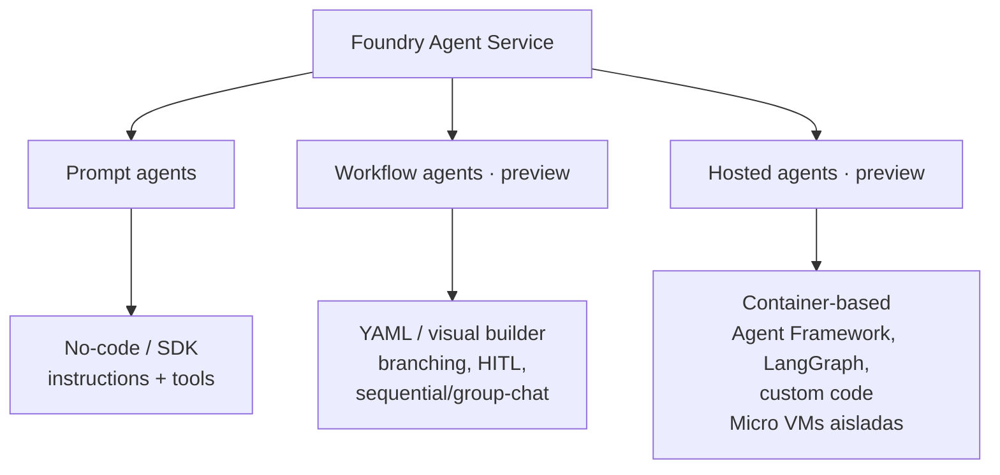
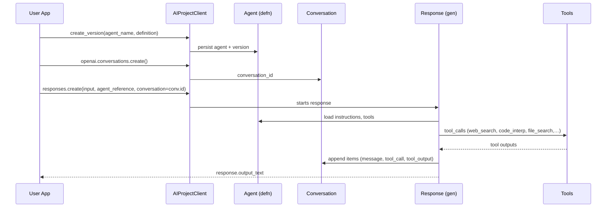
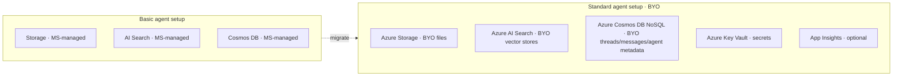
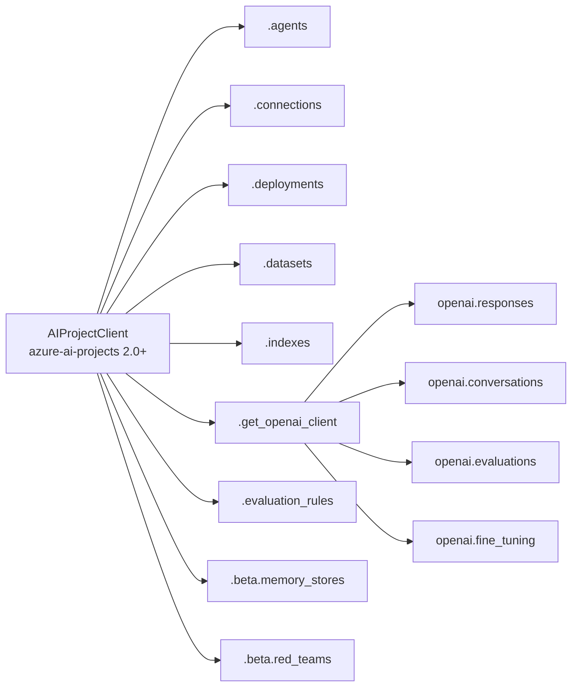
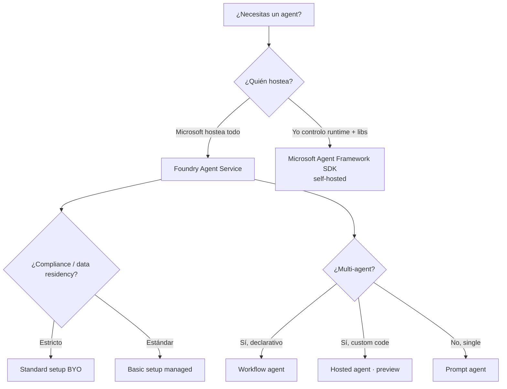

# Microsoft Foundry Agent Service — overview maestro

> [!abstract] TL;DR
> **Microsoft Foundry Agent Service** es la plataforma totalmente gestionada para crear, ejecutar y escalar agents en Microsoft Foundry. Su runtime moderno se articula sobre tres componentes — **agents, conversations y responses** — orquestados con la **Responses API** (sustituye al patrón legacy *threads/messages/runs* de la Assistants API). Expone tres tipos de agent (**Prompt**, **Workflow (preview)**, **Hosted (preview)**), un catálogo de **tools built-in y custom** (web search, code interpreter, file search, MCP, OpenAPI, A2A, …) y dos setups (**Basic** Microsoft-managed vs **Standard** BYO Storage + AI Search + Cosmos DB). SDK Python oficial: `azure-ai-projects>=2.0.0` con clase `AIProjectClient`.

## 🎯 Relevancia en el examen

Frecuencia: **🔥🔥🔥 muy alta**. El dominio B (Generative AI + Agentic) pesa **30-35 %** y este servicio es el núcleo de B.2 ("Build agents by using Foundry").

| Tipo de pregunta | Escenario típico |
|---|---|
| Case study | Empresa con requisitos de data residency → ¿Basic o Standard setup? |
| Code (rellenar) | Crear `AIProjectClient`, `PromptAgentDefinition`, llamar `responses.create` |
| Best-fit tool | "El agent debe analizar CSV y devolver gráfico" → Code Interpreter |
| Distinguish | Assistants API (legacy) vs Responses API; threads/messages/runs vs agents/conversations/responses |
| Multi-step | Multi-agent orchestration con A2A vs Workflow agent |
| RBAC | Roles renombrados Foundry vs Azure AI |

## 📖 Concepto en profundidad

### 1. ¿Qué es Foundry Agent Service?

Servicio **fully managed** que aloja, escala y gobierna agents construidos sobre el catálogo de **Foundry Models**. Maneja:

- **Hosting + scaling** (incluye Micro VMs aisladas para Hosted agents).
- **Identidad** (Microsoft Entra; cada agent puede tener identidad propia).
- **Observabilidad** (tracing end-to-end, métricas, Application Insights).
- **Seguridad empresarial** (RBAC, content filters, VNet isolation, prompt injection mitigation incluido XPIA).
- **Versionado y publishing** (snapshots automáticos, endpoints estables, distribución vía Microsoft 365 Copilot / Teams / Entra Agent Registry / A2A protocol).

> [!important] Definición oficial de "agent"
> Un agent combina **tres componentes**: **Model** (del Foundry catalog) + **Instructions** (goals, constraints, behavior) + **Tools** (data o actions). A diferencia de un chatbot, decide y ejecuta acciones multi-step.

### 2. Tipos de agent (los TRES tipos oficiales)



| Dimensión | Prompt agents | Workflow agents (preview) | Hosted agents (preview) |
|---|---|---|---|
| Código requerido | No | No (YAML opcional) | Sí |
| Hosting | Fully managed | Fully managed | Container en Micro VMs |
| Orquestación | Single agent | Multi-agent, branching | Lógica personalizada |
| Best for | Prototyping, tareas simples | Multi-step automation, approval | Frameworks externos, control total |

### 3. Runtime moderno: agents, conversations, responses

> [!warning] Cambio de modelo runtime
> Microsoft está migrando del modelo legacy *threads → messages → runs → run_steps* (Assistants API) al modelo moderno *agents → conversations → responses* (**Responses API**). Para el examen **debes conocer ambos**.



#### 3.1 Agent (definition)

Asset **named + versioned** persistido en Foundry. Identificado por `(name, version)` — **ya no existe `AgentID` GUID**. Cada `create_version` snapshotea inmutablemente.

#### 3.2 Conversation

Objeto **durable con id único**, reutilizable entre sesiones. Almacena **items** (no solo mensajes):

- `message` (user/assistant)
- `tool_call` (web_search_call, function_call, file_search_call, …)
- `tool_output`
- `output` (display al usuario)

> [!tip] Truncation
> Si una conversation excede el context window del modelo, **el servicio trunca el input** automáticamente para esa respuesta; **la conversation completa NO se trunca** en almacenamiento.

#### 3.3 Response

Generación. Procesa input + history (conversation o `previous_response_id`) y emite items. Soporta `store=false` (zero-data-retention; carry-forward client-side) y streaming.

### 4. Convivencia API surfaces (CRÍTICO examen)

| Surface | Pattern | Cliente Python | Estado |
|---|---|---|---|
| **Assistants API** (legacy/classic) | threads → messages → runs (con `requires_action` polling) | `openai.beta.assistants` / `client.beta.threads.runs.create_and_poll` | ⚠️ **Deprecation** — usar Responses API para nuevo código |
| **Responses API** (current 2026) | agents → conversations → responses (tool calls inline en `response.output`) | `project.agents.create_version` + `openai.responses.create(agent_reference=…)` | ✅ GA, **camino recomendado** |

> [!warning] ⚠️ Verificación pendiente
> La fecha exacta de deprecation de la Assistants API en Azure (rumor de 31-mar-2027 paralelo a OpenAI) no aparece confirmada como fecha verbatim en la página `agents/overview` actual. **Trátalo como "sunset planificado"**; para el examen lo relevante es que **Responses API es el camino actual**.

### 5. Setup tiers — Basic vs Standard



| Dimensión | Basic | Standard |
|---|---|---|
| Resources | Microsoft-managed, multi-tenant | **BYO**, single-tenant en tu tenant |
| Data residency | Limitada | **Total control** |
| Project-level isolation | No estricta | **Sí** (containers separados por proyecto) |
| Network | Default | Virtual Network (VNet) + Private Endpoints |
| Provisioning | Foundry portal | **Bicep template + manual** (portal aún no soporta Standard) |
| Cosmos DB | N/A (managed) | **≥ 3000 RU/s** (3 containers × 1000 RU/s) |
| Setup time | Minutos | 30-45 min |

#### Recursos Standard — qué guarda qué (verbatim)

| Recurso | Almacena |
|---|---|
| **Azure Storage** (BYO File Storage) | Files subidos por developers y end-users |
| **Azure AI Search** (BYO Search) | Vector stores creados por el agent |
| **Azure Cosmos DB** (BYO Thread Storage) | Messages, conversation history, agent metadata |

#### Cosmos DB containers (Standard)

| Container | Propósito |
|---|---|
| `thread-message-store` | End-user conversations |
| `system-thread-message-store` | Internal system messages |
| `agent-entity-store` | Agent metadata (instructions, tools, name) |

#### Capability hosts

Sub-resource en account y project que habilita Agent Service.

- **Account capability host**: properties vacías excepto `capabilityHostKind="Agents"`.
- **Project capability host**: enlaza conexiones a Storage + AI Search + Cosmos DB.
- ⚠️ **No se pueden actualizar** una vez creados → recrear proyecto si cambia config.

### 6. Tool catalog (verbatim Microsoft Learn — mayo 2026)

> [!note] El tool catalog y el tools framework son **GA**. Tools individuales pueden estar en preview (marcado).

#### Built-in tools

| Tool | Status | Función |
|---|---|---|
| **Web search** | GA | Real-time public web; citas inline. Recomendado para web grounding |
| **Code Interpreter** | GA | Python sandboxed; análisis, math, charts |
| **Custom Code Interpreter** | preview | Customizar resources/packages en Container Apps env |
| **File Search** | GA | Vector search sobre files subidos / docs propios |
| **Azure AI Search** | GA | Ground con índice AI Search existente |
| **Azure Functions** | GA | Llamar tus Azure Functions |
| **Function calling** | GA | Custom functions; tu app ejecuta y devuelve resultado |
| **Image Generation** | preview | Generar imágenes en conversación |
| **Browser Automation** | preview | Browser tasks vía natural language |
| **Computer Use** | preview | Interactuar con UIs de sistemas (alto riesgo) |
| **Microsoft Fabric** | preview | Conectar a Fabric data agent |
| **SharePoint** | preview | Chat con documentos SharePoint privados |

#### Custom tools

| Tool | Status | Función |
|---|---|---|
| **MCP (Model Context Protocol)** | GA | Conectar a MCP server endpoint (remote o local) |
| **OpenAPI tool** | GA | APIs externas vía spec OpenAPI 3.0 / 3.1 |
| **Agent-to-Agent (A2A)** | preview | Comunicación cross-agent vía A2A-compatible endpoints |
| **Toolbox** | preview | Bundle curado de tools expuesto como **single MCP endpoint** |

#### Autenticación de tools

| Mecanismo | Cuándo usar |
|---|---|
| Service-managed (Code Interpreter, File Search) | Sin config externa |
| Project connections (key-based) | Conectar a recursos externos (AI Search, SharePoint, MCP con API key) |
| **Microsoft Entra (managed identity)** | **Recomendado**; agent identity o project MI; sin secretos |
| **OAuth On-Behalf-Of (OBO)** | User-level identity passthrough; consent link en 1ª uso |

### 7. SDK Python — `azure-ai-projects` v2



- **Endpoint format**: `https://{resource}.services.ai.azure.com/api/projects/{project_name}`
- **Auth**: solo **Entra ID** vía `DefaultAzureCredential` (no API key en client v2 público).
- **Python**: 3.9+
- **REST data plane API version**: `v1`

## 🏗️ Cómo se hace — patrón Python completo

### 7.1 Instalación

```bash
pip install "azure-ai-projects>=2.0.0" azure-identity
# para async:
pip install aiohttp
```

### 7.2 Crear agent + conversation + response (Responses API moderna)

```python
import os
from azure.identity import DefaultAzureCredential
from azure.ai.projects import AIProjectClient
from azure.ai.projects.models import PromptAgentDefinition, WebSearchTool

PROJECT_ENDPOINT = os.environ["FOUNDRY_PROJECT_ENDPOINT"]

with (
    DefaultAzureCredential() as cred,
    AIProjectClient(endpoint=PROJECT_ENDPOINT, credential=cred) as project,
):
    # 1) Crear/versionar el agent (idempotente por nombre)
    agent = project.agents.create_version(
        agent_name="support-agent",
        definition=PromptAgentDefinition(
            model="gpt-5-mini",  # deployment name
            instructions=(
                "You are a customer-support agent. "
                "Always cite sources when answering."
            ),
            tools=[WebSearchTool()],
        ),
    )
    print(f"Agent: {agent.name}, Version: {agent.version}")

    openai = project.get_openai_client()

    # 2) Crear conversation durable (opcional pero recomendado)
    conv = openai.conversations.create()

    # 3) Generar response con agent_reference + conversation
    response = openai.responses.create(
        conversation=conv.id,
        extra_body={
            "agent_reference": {"name": agent.name, "type": "agent_reference"}
        },
        input="¿Cuáles son las últimas novedades de Microsoft Foundry?",
    )

    # 4) Recorrer output items: tool calls + mensaje final
    for item in response.output:
        if item.type == "web_search_call":
            print(f"[Tool] Web search status={item.status}")
        elif item.type == "function_call":
            print(f"[Tool] {item.name}({item.arguments})")
        elif item.type == "file_search_call":
            print(f"[Tool] File search status={item.status}")
        elif item.type == "message":
            print(f"[Assistant] {item.content[0].text}")

    # 5) Follow-up usando previous_response_id (sin conversation)
    follow_up = openai.responses.create(
        previous_response_id=response.id,
        extra_body={
            "agent_reference": {"name": agent.name, "type": "agent_reference"}
        },
        input="Resúmelo en 3 bullets.",
    )
    print(follow_up.output_text)
```

### 7.3 Streaming + tool call handling

```python
stream = openai.responses.create(
    extra_body={"agent_reference": {"name": "support-agent", "type": "agent_reference"}},
    input="Analiza este CSV y genera un gráfico.",
    stream=True,
)
for event in stream:
    # eventos típicos: response.created, response.output_item.added,
    # response.output_text.delta, response.completed, response.failed
    print(event.type, getattr(event, "delta", ""))
```

### 7.4 Zero-data-retention (`store=False`)

```python
r = openai.responses.create(
    extra_body={"agent_reference": {"name": "support-agent", "type": "agent_reference"}},
    input="¿Largest city in France?",
    store=False,  # ⚠️ no persistido; carga tú el historial en el siguiente turno
)
```

### 7.5 Add item a conversation existente

```python
openai.conversations.items.create(
    conversation_id=conv.id,
    items=[{"type": "message", "role": "user", "content": "¿Y Alemania?"}],
)
```

### 7.6 REST API equivalente (Responses)

```bash
ENDPOINT="https://{resource}.services.ai.azure.com/api/projects/{project_name}"
TOKEN="$(az account get-access-token --resource https://ai.azure.com/ --query accessToken -o tsv)"

# Crear agent
curl -X POST "$ENDPOINT/agents?api-version=v1" \
  -H "Authorization: Bearer $TOKEN" -H "Content-Type: application/json" \
  -d '{
    "name": "support-agent",
    "definition": {
      "kind": "prompt",
      "model": "gpt-5-mini",
      "instructions": "You are a helpful assistant.",
      "tools": [{ "type": "web_search_preview" }]
    }
  }'

# Generar response
curl -X POST "$ENDPOINT/openai/v1/responses" \
  -H "Authorization: Bearer $TOKEN" -H "Content-Type: application/json" \
  -d '{
    "input": "What is the largest city in France?",
    "agent_reference": {"name": "support-agent", "type": "agent_reference"}
  }'
```

### 7.7 Legacy Assistants API (carryover AI-102) — saber identificarlo

```python
# ⚠️ Patrón LEGACY (Assistants API). Reconocer en preguntas, no construir nuevo código así.
from openai import AzureOpenAI

client = AzureOpenAI(...)
assistant = client.beta.assistants.create(model="gpt-4o", instructions="...", tools=[...])
thread = client.beta.threads.create()
client.beta.threads.messages.create(thread.id, role="user", content="hola")
run = client.beta.threads.runs.create_and_poll(thread_id=thread.id, assistant_id=assistant.id)
# Si run.status == "requires_action": resolver tool_outputs y submit
```

| Legacy term | Moderno equivalente |
|---|---|
| `assistant` | `agent` (con nombre + versión) |
| `thread` | `conversation` |
| `message` | `conversation item` (type=message) |
| `run` | `response` |
| `run_step` | item dentro de `response.output` |
| `requires_action` polling | tool calls inline en `response.output` (sin polling) |

## 📊 Cuándo usar Foundry Agent Service vs alternativas



| Caso | Elección recomendada |
|---|---|
| Prototipo rápido, no-code | **Prompt agent (Basic setup)** |
| Producción con data residency, VNet | **Prompt/Workflow agent + Standard setup** |
| Multi-step approval + HITL declarativo | **Workflow agent (preview)** |
| LangGraph / Agent Framework custom + scaling Foundry | **Hosted agent (preview)** |
| Self-hosting puro en mi cluster | **Microsoft Agent Framework SDK** (fuera de Foundry Agent Service) |

## 🪤 Trampas del examen

1. **Agents ya NO se identifican por `AgentID` GUID**. Se identifican por `(name, version)`. Si una pregunta menciona "AgentID" como GUID inmutable → es legacy / equivocada.
2. **Threads/Messages/Runs (legacy) vs Agents/Conversations/Responses (moderno)**: si la respuesta correcta debe ser código nuevo en 2026, usar **Responses API**. Si la pregunta enseña un snippet legacy con `client.beta.threads.runs.create_and_poll` → identifícalo como **Assistants API legacy**.
3. **Basic vs Standard setup**: solo **Standard** permite BYO Storage + AI Search + Cosmos DB y data residency total. **Standard NO se configura desde el Foundry portal** — requiere Bicep o pasos manuales.
4. **Cosmos DB throughput**: mínimo **3000 RU/s** (1000 × 3 containers). Por **cada proyecto adicional** súmale otros 3000. Si no llega → `CapabilityHostProvisioningFailed`.
5. **Capability host es inmutable**: no se puede actualizar tras creación → para cambiar config, **recrear** el proyecto.
6. **File Search ≠ Azure AI Search tool**: File Search usa vector store managed sobre files subidos; Azure AI Search tool conecta a un **índice existente** de Azure AI Search.
7. **Tool catalog mix GA + preview**: verifica status individual antes de elegir en producción. *Computer Use*, *Browser Automation*, *Image Generation*, *Memory Search*, *Fabric*, *SharePoint*, *A2A*, *Custom Code Interpreter* y *Toolbox* son **preview**.
8. **MCP custom headers**: trata credenciales como secretos; no incluyas en prompts ni logs. Microsoft no verifica MCP servers de terceros.
9. **Conversation truncation**: el contexto del modelo se trunca **en input**, no en almacenamiento; debug ítems siguen presentes.
10. **`store=False`** = zero-data-retention pero **tú** gestionas el carry-forward client-side; no podrás usar `previous_response_id`.
11. **Roles Foundry renombrados**: **Foundry User**, **Foundry Owner**, **Foundry Account Owner**, **Foundry Project Manager** (antes *Azure AI User/Owner/Account Owner/Project Manager*). Role IDs y permisos **no cambian**, solo el nombre.
12. **Auth Entra solo**: `AIProjectClient` v2 no soporta API key — solo `DefaultAzureCredential` y derivados. Si el escenario exige API key estás ante código v1 / legacy.
13. **Endpoint format obligatorio**: `https://<acct>.services.ai.azure.com/api/projects/<project>` (no confundir con `*.openai.azure.com` u `*.cognitiveservices.azure.com`).
14. **A2A es preview**: para producción multi-agent estable hoy → **Workflow agent** declarativo.
15. **Hosted agents BYO VNet**: cada sesión corre en VM-isolated sandbox conectado a tu VNet — diferente del isolation de Prompt/Workflow.

## 🧠 Mnemotecnia

- **"A-C-R"** = **A**gent + **C**onversation + **R**esponse → trío runtime moderno.
- **"3 tipos = P-W-H"**: **P**rompt (no-code, GA) → **W**orkflow (YAML, preview) → **H**osted (container, preview).
- **"Standard = SAC"**: **S**torage + **A**I Search + **C**osmos DB (BYO).
- **"3000 RU/s = 3 containers"**: regla de Cosmos para Standard. Multiplica por #proyectos.
- **"Foundry F-O-U-P"**: roles renombrados **F**oundry **U**ser / **O**wner / Account Owner / **P**roject Manager.
- **"Tool decision":** ¿análisis de datos? → **Code Interpreter**. ¿docs propios? → **File Search**. ¿índice existente? → **Azure AI Search**. ¿web actual? → **Web search**. ¿API externa? → **OpenAPI**. ¿tool corporativo compartido? → **MCP / Toolbox**. ¿multi-agent? → **A2A**.
- **Legacy→Moderno**: *"From threads to conversations, from runs to responses, from polling to streaming"*.

## 🔗 Conceptos relacionados

- [[agents-microsoft-agent-framework]] — SDK self-hosted alternativa
- [[agents-foundry-service-vs-framework]] — comparativa decisional
- [[agents-concept-roles-goals]] — define roles, goals, schemas
- [[agents-tool-schemas]] — function calling y schemas JSON
- [[agents-conversation-threads-tracking]] — conversation tracking moderno y legacy
- [[agents-conversation-memory]] — memory stores (preview), beta.memory_stores
- [[agents-multi-agent-orchestration]] — Workflow agents + A2A
- [[agents-autonomous-workflows-safeguards]] — HITL, approvals
- [[agents-approval-flow-controls]] — `require_approval` en MCP, workflow steps
- [[agents-monitoring-deployed]] — observability, tracing, App Insights
- [[agents-evaluation-behavior-error-analysis]] — evaluators, red teams
- [[plan-agent-memory-tool-knowledge-services]]
- [[00-microsoft-foundry-overview]]
- [[plan-foundry-hubs-projects]]
- [[00-foundry-tools-catalog]]
- [[genai-foundry-sdk-integration]]
- [[plan-security-rbac-role-policies]] — Foundry RBAC roles renombrados
- [[plan-security-managed-identity]] — agent identity / project MI
- [[plan-security-private-networking]] — BYO VNet + Standard setup
- [[responsible-agent-oversight-controls]] — approvals + guardrails

## ❓ Autotest

**1.** Estás migrando un PoC AI-102 que usa `client.beta.threads.runs.create_and_poll(...)` y maneja `requires_action`. Quieres modernizarlo en Foundry. ¿Qué API surface debes adoptar?

- a) Seguir con `client.beta.assistants`
- b) Responses API: `project.agents.create_version(...)` + `openai.responses.create(agent_reference=...)`
- c) Chat Completions API stateless
- d) Realtime API

<details><summary>Respuesta</summary>**b**. La Responses API con `AIProjectClient` y `agent_reference` es el camino moderno. La Assistants API (a) es legacy/deprecation. Chat Completions (c) no es stateful ni soporta agents persistidos. Realtime (d) es para voz, no aplica.</details>

**2.** Una banca europea exige que **toda** la conversación de los agents quede en su tenant en una región concreta, con private endpoints. ¿Setup?

- a) Basic agent setup (rápido)
- b) Standard agent setup con BYO Storage + AI Search + Cosmos DB y capability host
- c) Hosted agent en cualquier región
- d) Workflow agent en preview

<details><summary>Respuesta</summary>**b**. Standard setup es el único que garantiza data residency total, project-level isolation y VNet integration.</details>

**3.** Tu Bicep falla con `CapabilityHostProvisioningFailed` al crear el primer proyecto. ¿Causa más probable?

- a) Falta rol Storage Blob Data Owner en `<workspaceId>-agents-blobstore`
- b) Cosmos DB con throughput insuficiente (<3000 RU/s)
- c) AI Search en SKU Free
- d) Foundry portal no soporta Standard setup

<details><summary>Respuesta</summary>**b**. Cada proyecto Standard requiere **3 containers × 1000 RU/s = 3000 RU/s mínimo** en Cosmos DB NoSQL; insuficiente RU/s provoca fallos de capability host provisioning.</details>

**4.** Tu agent debe ejecutar Python para analizar un CSV y devolver un gráfico, sin que tu app despliegue nada. ¿Qué built-in tool?

- a) Function calling
- b) Azure Functions tool
- c) Code Interpreter
- d) Custom Code Interpreter (preview)

<details><summary>Respuesta</summary>**c**. **Code Interpreter** GA corre Python sandboxed gestionado por el servicio sin custom infra. Custom Code Interpreter (d) sería solo si necesitas personalizar packages o Container Apps env.</details>

**5.** Identificas un agent en el nuevo runtime por…

- a) `agent_id` GUID inmutable
- b) `(name, version)` — los GUIDs ya no se usan
- c) URL del endpoint del proyecto
- d) Hash de instructions

<details><summary>Respuesta</summary>**b**. La documentación lo señala explícitamente: *"Agents are now identified using the agent name and agent version. They don't have a GUID called AgentID anymore."*</details>

**6.** En Standard setup, los **roles** que debe tener la **project managed identity** sobre Azure AI Search son…

- a) Solo Search Service Contributor
- b) Search Index Data Contributor + Search Service Contributor
- c) Reader + Search Index Data Reader
- d) Owner

<details><summary>Respuesta</summary>**b**. Microsoft Learn lo lista verbatim: **Search Index Data Contributor** + **Search Service Contributor** sobre el recurso de AI Search.</details>

## ✅ Control de calidad (auto-rúbrica)

| Dimensión | Nota |
|---|---|
| Completitud (cubre 6 sub-puntos B.2 + runtime + setup tiers + tools + APIs) | 9.5 |
| Exactitud técnica (verbatim Microsoft Learn 2026-05, citas verificadas) | 9.5 |
| Alineación al examen (peso 30-35 %, trampas reales, distinción legacy vs moderno) | 9.5 |
| Claridad pedagógica (mermaid, tablas, mnemónicos, autotest) | 9.0 |

⚠️ Notas residuales:
- Fecha exacta de deprecation Assistants API en Azure no encontrada verbatim en la página actual `agents/overview`; marcado como "sunset planificado". Cualquier pregunta de examen sobre deprecación específica debe responderse a nivel de "Responses API es el camino actual".

*Verificado a fecha 2026-05-23 contra Microsoft Learn (`learn.microsoft.com/en-us/azure/foundry/agents/*`, `python/api/overview/azure/ai-projects-readme`).*
