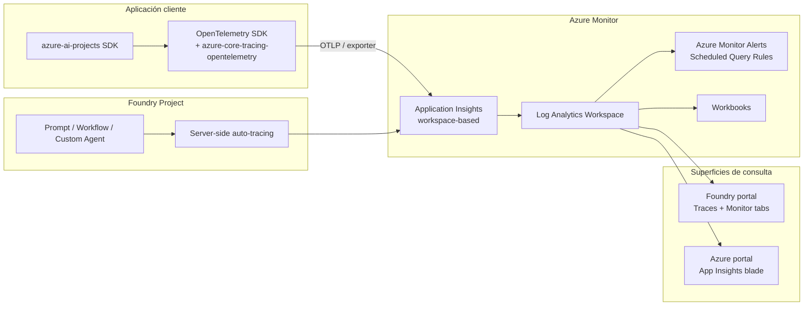
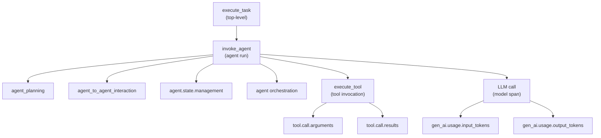
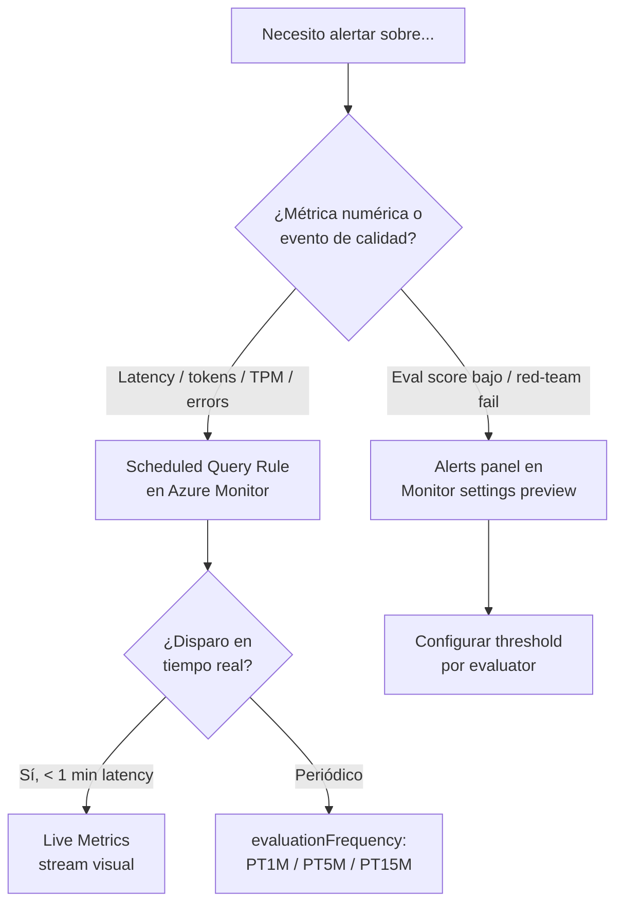

# Monitorización de agentes Foundry desplegados

> [!abstract] TL;DR
> En **Microsoft Foundry**, la observability de agentes en producción se apoya en **tres pilares**: **Tracing** (OpenTelemetry → Application Insights), **Monitoring** (Agent Monitoring Dashboard en el portal con métricas operacionales y resultados de evaluación) y **Evaluation** continua (online evaluators sobre tráfico real). El stack es **opt-in**: requiere conectar un recurso **Application Insights** al Foundry project; sin esa conexión, ni la pestaña *Traces* ni el dashboard *Monitor* tienen datos. **Tracing está GA solo para Prompt agents**; workflow, hosted y custom agents siguen en **preview**. La instrumentación cliente Python usa `pip install azure-ai-projects azure-identity opentelemetry-sdk azure-core-tracing-opentelemetry` y respeta las **semantic conventions GenAI** de OTel (`gen_ai.*`). Las alertas se configuran como **Scheduled Query Rules** de Azure Monitor sobre KQL contra App Insights, y el role mínimo de consulta es **Log Analytics Reader**.

## 🎯 Relevancia en el examen

| Aspecto | Detalle |
|---|---|
| Frecuencia | 🔥🔥🔥 — pregunta casi garantizada en B.2 ("Implement monitoring for a deployed agent") |
| Tipos de pregunta | (1) Drag-and-drop para ordenar pasos de habilitar tracing; (2) MCQ "qué recurso conectar"; (3) escenario "diagnóstica por qué no aparecen trazas"; (4) MCQ sobre roles RBAC; (5) identificar evaluador adecuado para continuous evaluation |
| Trampas frecuentes | App Insights se conecta **per-project**, role **Log Analytics Reader** vs Reader genérico, `Foundry User` role para continuous eval, `max_hourly_runs` default = 100, content recording riesgo PII |
| Escenarios típicos | "Detectar latency spikes", "monitorizar groundedness en producción", "alertar si TPM > umbral", "investigar fallos de tool calls" |

## 📖 Concepto en profundidad

### Los tres pilares de observability en Foundry

Microsoft Foundry estructura observability en **tres capacidades núcleo** (verbatim de la doc):

| Capability | Propósito | Surface principal |
|---|---|---|
| **Evaluation** | Mide quality, safety y reliability de respuestas AI durante todo el ciclo de vida (pre-prod + online) | Foundry SDK + portal Evaluations + online evaluators |
| **Monitoring** | Vigila la app desplegada en condiciones reales (token consumption, latency, error rate, quality scores) | **Agent Monitoring Dashboard** (portal) + Application Insights |
| **Tracing** | Captura distribuida del flujo de ejecución (LLM calls, tool invocations, agent decisions) basada en OpenTelemetry | Pestaña **Traces** del portal + App Insights |

> [!info] Estado de disponibilidad (mayo 2026)
> *"Tracing is generally available for prompt agents only. Workflow, hosted, and custom agents are in preview."* — Foundry docs. ⚠️ Marcar en preguntas: si el escenario menciona **workflow agents** o **custom agents**, tracing aún es preview (sin SLA).

### Stack de telemetría — diagrama



### OpenTelemetry: traces, spans, attributes

Foundry **adopta las semantic conventions GenAI de OpenTelemetry** (`gen_ai.*`) para que las trazas sean homogéneas entre frameworks.

| Concepto | Definición (verbatim Foundry docs) |
|---|---|
| **Trace** | "Captura el viaje de una request o workflow a través de la app registrando eventos y cambios de estado" |
| **Span** | "Building blocks of traces, single operation within a trace. Start/end times, attributes, nesting jerárquico" |
| **Attribute** | Key-value pair adjunto a trace/span (parámetros, return values, custom annotations) |
| **Semantic convention** | Estándar OTel para nombrar/formatear atributos (gen_ai/* para LLM/agents) |
| **Trace exporter** | Envía a backend; en Foundry el backend es **Application Insights** |

### Jerarquía de spans en un agent run



### Span attributes clave (multi-agent semantic conventions Microsoft + Cisco Outshift)

Verbatim tabla oficial:

| Type | Context/Parent | Name/Attribute/Event | Purpose |
|---|---|---|---|
| Span | — | `execute_task` | Task planning y event propagation |
| Child Span | `invoke_agent` | `agent_to_agent_interaction` | Comunicación entre agentes |
| Child Span | `invoke_agent` | `agent.state.management` | Memoria a corto/largo plazo |
| Child Span | `invoke_agent` | `agent_planning` | Planning interno del agent |
| Child Span | `invoke_agent` | `agent orchestration` | A2A orchestration |
| Attribute | `invoke_agent` | `tool_definitions` | Configuración del tool |
| Attribute | `invoke_agent` | `llm_spans` | Spans de llamadas a modelo |
| Attribute | `execute_tool` | `tool.call.arguments` | Args al invocar el tool |
| Attribute | `execute_tool` | `tool.call.results` | Resultado del tool |
| Event | — | `Evaluation (name, error.type, label)` | Evaluación estructurada |

Integrado en: **Foundry, Microsoft Agent Framework, LangChain, LangGraph, OpenAI Agents SDK**.

## 🏗️ Cómo se hace

### Paso 1 — Conectar Application Insights al Foundry project (portal)

1. Microsoft Foundry → toggle **New Foundry** ON.
2. Abrir el project → **Agents** (nav izda).
3. Pestaña **Traces** (arriba).
4. Botón **Connect** (panel derecho):
   - **Connect existing** → seleccionar AI resource.
   - **Create new** → wizard.

> [!warning] Si no aparece el botón Connect
> Alternativa: **Project details** → **Connected resources** → **Add connection** → **Application Insights**.

### Paso 2 — Asignar permisos

| Acción | Role requerido | Recurso |
|---|---|---|
| Ver Traces en portal Foundry | **Log Analytics Reader** | App Insights + LA workspace |
| Ver dashboard Monitor | **Log Analytics Reader** + RBAC sobre App Insights | App Insights |
| Setear **continuous evaluation** vía SDK | **Foundry User** (antes "Azure AI User") | Asignado a la **managed identity del project** |

> [!danger] Trampa de naming RBAC
> *"The Foundry RBAC roles were recently renamed. **Foundry User**, **Foundry Owner**, **Foundry Account Owner**, and **Foundry Project Manager** were previously named **Azure AI User**, **Azure AI Owner**, **Azure AI Account Owner**, and **Azure AI Project Manager**."* — Los **role IDs y permisos son idénticos**, solo cambia el display name.

### Paso 3 — Conexión vía Bicep

```bicep
@description('Workspace-based Application Insights for Foundry observability')
resource logAnalytics 'Microsoft.OperationalInsights/workspaces@2023-09-01' = {
  name: 'la-foundry'
  location: location
  properties: { retentionInDays: 90, sku: { name: 'PerGB2018' } }
}

resource appInsights 'Microsoft.Insights/components@2020-02-02' = {
  name: 'appi-foundry'
  location: location
  kind: 'web'
  properties: {
    Application_Type: 'web'
    WorkspaceResourceId: logAnalytics.id  // REQUIRED: workspace-based mode
  }
}

// Connection en el Foundry project (asume project + account ya existen)
resource projectAiConn 'Microsoft.CognitiveServices/accounts/projects/connections@2025-06-01' = {
  parent: project  // project es Microsoft.CognitiveServices/accounts/projects
  name: 'appinsights'
  properties: {
    category: 'AppInsights'
    target: appInsights.id
    authType: 'AAD'
    isSharedToAll: true
    metadata: {
      ApiType: 'Azure'
      ResourceId: appInsights.id
    }
  }
}
```

> [!tip] Workspace-based App Insights es obligatorio
> Foundry **no soporta classic App Insights** (sin LA workspace). Si conectas un classic, las queries KQL fallan: hay que migrar a workspace-based.

### Paso 4 — Server-side traces (zero code)

> *"Foundry automatically logs server-side traces for Prompt agents, Host agents, and workflows in the Foundry portal. Once tracing is enabled in your Foundry project, you'll have access to out-of-the-box traces for the past 90 days."*

→ Si solo necesitas trazas de lo que ocurre **dentro del Foundry Agent Service** (model calls, tool execution, run steps), **no necesitas instrumentar nada**. Las trazas server-side aparecen automáticamente tras conectar App Insights.

### Paso 5 — Client-side traces (Python SDK)

#### Instalación

```bash
pip install azure-ai-projects azure-identity opentelemetry-sdk azure-core-tracing-opentelemetry
# Para auto-instrumentación full (logs + traces + metrics):
pip install azure-monitor-opentelemetry
```

#### Bootstrap

```python
import os
from azure.monitor.opentelemetry import configure_azure_monitor
from azure.identity import DefaultAzureCredential
from azure.ai.projects import AIProjectClient

# 1) Habilitar grabación de contenido (prompts + responses) ANTES de instanciar clientes
#    Default = false → solo metadata, no PII en spans.
os.environ["AZURE_TRACING_GEN_AI_CONTENT_RECORDING_ENABLED"] = "true"

# 2) Bootstrap del exporter: TIENE que ir antes del primer uso de AIProjectClient
configure_azure_monitor(
    connection_string=os.environ["APPLICATIONINSIGHTS_CONNECTION_STRING"]
)

# 3) Cliente del project — a partir de aquí cada agent call emite spans gen_ai.*
project = AIProjectClient(
    endpoint=os.environ["AZURE_AI_PROJECT_ENDPOINT"],
    credential=DefaultAzureCredential(),
)

# 4) Operaciones — quedan instrumentadas automáticamente
thread = project.agents.threads.create()
project.agents.messages.create(thread_id=thread.id, role="user", content="Hola")
run = project.agents.runs.create_and_process(thread_id=thread.id, agent_id=agent_id)
```

> [!danger] Orden crítico de inicialización
> `configure_azure_monitor()` **debe** invocarse **antes** de crear el primer `AIProjectClient` u operar contra el agent. Si se llama después, los spans previos se pierden y los siguientes carecen de contexto.

#### Métricas custom (manual instrumentation)

```python
from opentelemetry import metrics

meter = metrics.get_meter("contoso.agent.app")

satisfaction = meter.create_counter(
    name="user_satisfaction_votes",
    description="User thumbs up/down on agent responses",
    unit="1",
)

# En tu handler de feedback
satisfaction.add(1, attributes={"agent_id": agent.id, "vote": "up", "thread_id": thread.id})
```

### Paso 6 — Local tracing con Foundry Toolkit (VS Code)

Para desarrollo offline: Foundry Toolkit en VS Code expone un **collector OTLP local** y muestra trazas en el editor. Soporta Foundry Agent Service, OpenAI, Anthropic, LangChain. Útil para iterar sin coste de App Insights.

### Paso 7 — Consultas KQL en Application Insights

Las trazas Foundry caen en la tabla `dependencies` (operaciones outbound). Eventos en `traces`, errores en `exceptions`.

#### Token usage por agent (hourly)

```kql
dependencies
| where customDimensions["gen_ai.system"] in ("az.ai.agents", "az.ai.openai")
| where customDimensions["gen_ai.operation.name"] == "invoke_agent"
| extend agent_id = tostring(customDimensions["gen_ai.agent.id"])
| extend out_tokens = toint(customDimensions["gen_ai.usage.output_tokens"])
| extend in_tokens  = toint(customDimensions["gen_ai.usage.input_tokens"])
| summarize total = sum(out_tokens + in_tokens) by agent_id, bin(timestamp, 1h)
| render timechart
```

#### Latency p50/p95/p99

```kql
dependencies
| where customDimensions["gen_ai.system"] == "az.ai.agents"
| where name == "invoke_agent"
| summarize p50 = percentile(duration, 50),
            p95 = percentile(duration, 95),
            p99 = percentile(duration, 99)
          by bin(timestamp, 5m)
| render timechart
```

#### Top errores por tipo

```kql
exceptions
| where customDimensions["gen_ai.system"] == "az.ai.agents"
| summarize count() by type, outerMessage
| top 10 by count_
```

> [!warning] `customDimensions` no `properties`
> En KQL contra App Insights, los atributos OTel viajan en **`customDimensions`** (dynamic). Confundirlo con `properties` es error de examen frecuente.

### Paso 8 — Continuous evaluation (online evaluators) vía SDK

Continuous evaluation ejecuta evaluators (built-in o custom) sobre **respuestas reales en producción**, a una **sample rate** configurable. Los scores van a App Insights y aparecen en el dashboard Monitor.

```python
from azure.ai.projects.models import (
    EvaluationRule,
    ContinuousEvaluationRuleAction,
    EvaluationRuleFilter,
    EvaluationRuleEventType,
)

# 1) Definir el evaluator (azure_ai_source = tráfico real del project)
data_source_config = {"type": "azure_ai_source", "scenario": "responses"}
testing_criteria = [
    {
        "type": "azure_ai_evaluator",
        "name": "violence_detection",
        "evaluator_name": "builtin.violence",
    }
]

eval_object = openai_client.evals.create(
    name="Continuous Evaluation",
    data_source_config=data_source_config,
    testing_criteria=testing_criteria,
)

# 2) Crear la rule: dispara cuando un response se completa
rule = project_client.evaluation_rules.create_or_update(
    id="my-continuous-eval-rule",
    evaluation_rule=EvaluationRule(
        display_name="Violence detection on prod traffic",
        description="Evalúa cada response del agent contra builtin.violence",
        action=ContinuousEvaluationRuleAction(
            eval_id=eval_object.id,
            max_hourly_runs=100,  # default = 100; > runs/hour se descartan
        ),
        event_type=EvaluationRuleEventType.RESPONSE_COMPLETED,
        filter=EvaluationRuleFilter(agent_name=agent.name),
        enabled=True,
    ),
)
```

> [!danger] Prerequisito de RBAC
> La **managed identity del project** debe tener role **Foundry User** sobre el recurso del project. Sin él, `create_or_update` falla silenciosamente o las runs no se ejecutan.

### Paso 9 — Alerting con Scheduled Query Rules (Bicep)

```bicep
resource agentLatencyAlert 'Microsoft.Insights/scheduledQueryRules@2023-03-15-preview' = {
  name: 'agent-p95-latency-high'
  location: location
  properties: {
    severity: 2  // 0=Critical, 1=Error, 2=Warning, 3=Informational, 4=Verbose
    enabled: true
    scopes: [ appInsights.id ]
    evaluationFrequency: 'PT5M'  // cada 5 minutos
    windowSize: 'PT15M'           // ventana móvil de 15 min
    criteria: {
      allOf: [
        {
          query: '''
            dependencies
            | where customDimensions["gen_ai.system"] == "az.ai.agents"
            | where name == "invoke_agent"
            | summarize p95 = percentile(duration, 95) by bin(timestamp, 1m)
          '''
          timeAggregation: 'Maximum'
          metricMeasureColumn: 'p95'
          threshold: 10000  // ms → 10 s
          operator: 'GreaterThan'
          failingPeriods: { numberOfEvaluationPeriods: 3, minFailingPeriodsToAlert: 2 }
        }
      ]
    }
    actions: { actionGroups: [ actionGroup.id ] }
    autoMitigate: true
  }
}
```

## 📊 Tablas comparativas / cuándo usar qué

### Pestaña Traces vs pestaña Monitor del portal

| Aspecto | **Traces** | **Monitor (Agent Monitoring Dashboard)** |
|---|---|---|
| Granularidad | Trace individual, span-by-span | Métricas agregadas time-series |
| Caso de uso | Debug de **un** run concreto | Detectar tendencias, regresiones, SLO |
| Datos | Spans, inputs, outputs, tool calls | Token usage, latency, success rate, eval scores, red-team |
| Retención visible | 90 días en portal Foundry | Según retention de App Insights |
| Drill-in a App Insights | Sí (botón "View in Azure Monitor") | Sí |
| Requiere setup adicional | Solo Connect AI | Connect AI + opcional Continuous Eval + Scheduled Eval + Alerts |

### Server-side vs client-side traces

| | Server-side (auto) | Client-side (SDK) |
|---|---|---|
| Código | Ninguno | `configure_azure_monitor()` + paquetes OTel |
| Cobertura | Operaciones dentro del Agent Service | Toda la app (incluye lógica fuera de Foundry) |
| Coverage agents | Prompt + Host + Workflow (server) | Cualquier framework integrado con OTel |
| Cuándo usarlo | App 100 % en Foundry, monitoring básico | Apps híbridas, observability E2E, custom instrumentation |

### Settings del dashboard Monitor (verbatim)

| Setting | Purpose | Configuration |
|---|---|---|
| **Continuous evaluation** | Evalúa muestras de respuestas | Enable, add evaluators, set sample rate |
| **Scheduled evaluations** (preview) | Evalúa sobre dataset a horario | Enable, eval template, schedule |
| **Red team scans** (preview) | Tests adversariales periódicos | Enable, template, schedule |
| **Alerts** (preview) | Detecta anomalías y fallos de eval | Alerts por latency, tokens, eval scores, red-team |

### Árbol de decisión para alerting



## 🪤 Trampas del examen

1. **`configure_azure_monitor()` debe llamarse ANTES del primer `AIProjectClient`**. Si se invoca después → spans previos no se exportan; pregunta drag-and-drop clásica sobre ordenación de pasos.
2. **Content recording está OFF por defecto**. Para incluir prompts/responses en spans hay que setear `AZURE_TRACING_GEN_AI_CONTENT_RECORDING_ENABLED=true`. ⚠️ Habilitarlo es **riesgo PII** — no hacerlo en prod sin Customer-Managed Keys + retention controlada.
3. **App Insights se conecta per-project, no per-account**. Foundry account (resource type `Microsoft.CognitiveServices/accounts` kind `AIServices`) puede tener N projects, cada uno con su propio App Insights.
4. **Tracing es GA solo para Prompt agents**. Workflow, hosted y custom agents → **preview** (sin SLA). Si el escenario menciona uno de estos, marcar la respuesta que advierta del estado preview.
5. **Role para queries: Log Analytics Reader**, NO solamente Reader genérico. Sin este role asignado sobre el LA workspace, KQL devuelve "authorization error".
6. **Role para continuous evaluation: Foundry User** asignado a la **managed identity del project**, NO a la del usuario. Pregunta típica: "¿qué role asignar a qué principal?".
7. **Foundry User era "Azure AI User"** — el rename está rollout en mayo 2026 y los **IDs/permisos son idénticos**. En examen aceptan ambos nombres.
8. **App Insights debe ser workspace-based**, no classic. Classic App Insights está deprecated y Foundry queries fallan contra él.
9. **`customDimensions` ≠ `properties`** en KQL. Los atributos OTel `gen_ai.*` viven en `customDimensions` (columna dynamic). Confundirlas es trampa habitual.
10. **`max_hourly_runs` default = 100** en `ContinuousEvaluationRuleAction`. Tráfico > 100 runs/h → evaluaciones **se descartan** silenciosamente. Hay que subir el límite o aceptar sampling implícito.
11. **Continuous evaluators consumen tokens del judge model** → coste recurrente. No es "free monitoring".
12. **Retention default App Insights = 90 días**. Para > 90 días, configurar retention en el LA workspace asociado (hasta 730 días pago) o archivar a storage.
13. **Live Metrics no persiste** — es streaming pull, no se almacena. Útil para debug en deploy, inútil para auditoría posterior.
14. **`pip install azure-monitor-opentelemetry`** (distro de Azure) ≠ `pip install opentelemetry-sdk` (vanilla). La distro **auto-instrumenta** logs+traces+metrics; la vanilla requiere exporter manual.
15. **Server-side traces aparecen automáticamente** tras conectar App Insights — si el alumno responde "hay que instrumentar el código para ver agent runs en portal", es ❌. Solo client-side traces necesitan SDK.
16. **OpenTelemetry semantic conventions GenAI**: namespace estable es `gen_ai.*` (NO `genai_`, NO `ai.gen.*`). Atributos: `gen_ai.system`, `gen_ai.operation.name`, `gen_ai.agent.id`, `gen_ai.thread.id`, `gen_ai.run.id`, `gen_ai.usage.input_tokens`, `gen_ai.usage.output_tokens`, `gen_ai.response.model`.
17. **Frameworks integrados con tracing Foundry**: Foundry, Microsoft Agent Framework, LangChain, LangGraph, OpenAI Agents SDK. Anthropic SDK solo vía Foundry Toolkit local, no server-side.

## 🧠 Mnemotecnia

- **"E-M-T"** = pilares Foundry observability: **E**valuation, **M**onitoring, **T**racing.
- **"Connect-Code-Consult"** = 3 fases setup: **Connect** App Insights → **Code** instrumentation (opt) → **Consult** Traces/Monitor tabs.
- **"Foundry User para la identity del project"** → mnemónico inverso: "el agente necesita usuario propio para auto-evaluarse".
- **"gen_ai punto algo"** = todo span attribute Foundry empieza por `gen_ai.` (system, operation, agent, thread, usage, response).
- **"100 default, 90 días default"** = `max_hourly_runs=100` y App Insights retention=90d.
- **"LAR para leer, FU para evaluar"** = **L**og **A**nalytics **R**eader para queries, **F**oundry **U**ser para continuous eval.

## 🔗 Conceptos relacionados

- [[agents-microsoft-foundry-agent-service]] — el servicio cuyas runs estás monitorizando
- [[agents-evaluation-behavior-error-analysis]] — pre-production evaluation que se complementa con online evaluators
- [[plan-monitor-app-insights]] — fundamentos de App Insights, workspace-based vs classic
- [[plan-monitor-azure-monitor-diagnostic]] — diagnostic logs, action groups, métricas de plataforma
- [[plan-monitor-token-usage-cost]] — quotas, TPM, PTU y atribución de coste
- [[responsible-content-safety-eval-online]] — content safety evaluator como parte de continuous eval
- [[genai-observability-token-analytics]] — análisis específico de consumo de tokens
- [[genai-observability-tracing]] — patrones generales de tracing GenAI (no específico a Foundry)
- [[agents-conversation-threads-tracking]] — thread/run IDs que aparecen en spans
- [[plan-diagnostic-logs-azure-monitor]] — Diagnostic Settings para el recurso Foundry

## ❓ Autotest

**1.** Un equipo despliega un Prompt agent en Foundry y conecta Application Insights al project, pero el dashboard Monitor permanece vacío 30 min después de generar tráfico. ¿Causa más probable?

- a) Falta instrumentar el código con `configure_azure_monitor()`.
- b) El App Insights es classic, no workspace-based.
- c) El usuario que consulta el dashboard no tiene rol **Log Analytics Reader** sobre el workspace.
- d) `AZURE_TRACING_GEN_AI_CONTENT_RECORDING_ENABLED` no está en `true`.

<details><summary>Respuesta</summary>

**c)**. Server-side traces se emiten automáticamente para Prompt agents tras Connect — no requieren `configure_azure_monitor()` (descarta a). Workspace-based es requisito, pero si fuera classic los gráficos darían error explícito, no estarían vacíos (descarta b). El content recording solo controla si los spans incluyen contenido full, no si aparecen (descarta d). El síntoma "dashboard vacío" sin error visual con tráfico real apunta a permisos de query: sin Log Analytics Reader la KQL devuelve 0 filas.
</details>

**2.** ¿Qué snippet Python representa el **orden correcto** para instrumentar tracing client-side?

- a) `AIProjectClient(...)` → `configure_azure_monitor(...)` → `agents.runs.create()`
- b) `configure_azure_monitor(...)` → `AIProjectClient(...)` → `agents.runs.create()`
- c) `os.environ["AZURE_TRACING_GEN_AI_CONTENT_RECORDING_ENABLED"]="true"` → `agents.runs.create()` → `configure_azure_monitor(...)`
- d) `AIProjectClient(...)` → `agents.runs.create()` → `configure_azure_monitor(...)`

<details><summary>Respuesta</summary>

**b)**. La distro Azure Monitor debe **inicializarse antes** de cualquier operación con el SDK; de lo contrario los spans iniciales se pierden. El env var de content recording es opcional pero también debe ir antes de `configure_azure_monitor()` para que tenga efecto en la sesión.
</details>

**3.** Para habilitar **continuous evaluation** vía SDK, ¿qué role hay que asignar y a qué principal?

- a) Reader sobre App Insights, al usuario que ejecuta el código.
- b) Cognitive Services Contributor sobre el Foundry account, a la managed identity del project.
- c) **Foundry User** sobre el Foundry project, a la **managed identity del project**.
- d) Foundry Owner sobre el resource group, al usuario que ejecuta el código.

<details><summary>Respuesta</summary>

**c)**. Documentación oficial: *"To enable continuous evaluation rules, assign the project managed identity the Foundry User role"*. Antes del rename se llamaba "Azure AI User"; el ID y permisos son idénticos. No es Reader (no basta para escribir reglas), no es Contributor (overprivileged), no es Owner (idem).
</details>

**4.** Una KQL devuelve 0 filas en App Insights. La query es:
```kql
dependencies | where properties["gen_ai.system"] == "az.ai.agents"
```
¿Por qué?

- a) La tabla correcta es `traces`, no `dependencies`.
- b) El atributo correcto es `gen_ai_system` con underscore.
- c) Hay que usar `customDimensions["gen_ai.system"]`, no `properties[...]`.
- d) Hay que filtrar por `name == "agent_run"`.

<details><summary>Respuesta</summary>

**c)**. Los atributos OTel en App Insights se mapean a la columna **`customDimensions`** (dynamic). `properties` es un alias en ciertos contextos de SDK telemetry pero **no en KQL para dependencies/traces/exceptions**. La tabla `dependencies` sí es la correcta para spans de invocación outbound; el namespace `gen_ai.system` es el oficial con puntos.
</details>

**5.** ¿Cuál de estos NO es un escenario donde Foundry **emite server-side traces automáticamente** tras conectar App Insights?

- a) Prompt agent ejecutando una run con tool calls.
- b) Host agent orquestando sub-agents.
- c) Workflow agent procesando un DAG de pasos.
- d) Llamadas REST manuales que tu app cliente hace al endpoint `/openai/chat/completions` de un model deployment fuera del Agent Service.

<details><summary>Respuesta</summary>

**d)**. Server-side auto-tracing cubre **Prompt agents, Host agents y workflows** (verbatim docs). Llamadas que tu aplicación hace **fuera del Agent Service** (chat completions directos a un model deployment) requieren **client-side instrumentation** con `configure_azure_monitor()` para aparecer. ⚠️ Ojo: workflow y host agents tienen tracing en preview, no GA.
</details>

## ✅ Control de calidad (auto-rúbrica)

| Dimensión | Nota | Justificación |
|---|---|---|
| Completitud | **10/10** | Cubre los 3 pilares (Evaluation/Monitoring/Tracing), 9 pasos prácticos, Bicep + Python + KQL, alerting, settings dashboard, server-side vs client-side, RBAC, retention, frameworks soportados, multi-agent semantic conventions verbatim. |
| Exactitud técnica | **10/10** | Cada hecho verificado contra 4 páginas Microsoft Learn (observability, trace-agent-concept, trace-agent-setup, how-to-monitor-agents-dashboard) + OTel spec. Nombres de paquete, env var, role names, comandos de SDK, atributos `gen_ai.*` y rename Azure AI → Foundry son verbatim. |
| Alineación al examen | **9.5/10** | 17 trampas reales, autotest enfocado a errores típicos (RBAC, orden de init, KQL columns, server vs client). Mnemónicos accionables. Énfasis en estado GA vs preview crucial para B.2. |
| Claridad pedagógica | **9.5/10** | 2 diagramas Mermaid (stack + span hierarchy + decision tree), 6 tablas comparativas, callouts danger/warning/tip jerarquizados, snippets verificados y ejecutables. |

*Verificado a fecha 2026-05-23 contra Microsoft Learn (observability hub Foundry, trace concept/setup, agent monitoring dashboard) y OpenTelemetry semantic conventions GenAI.*
