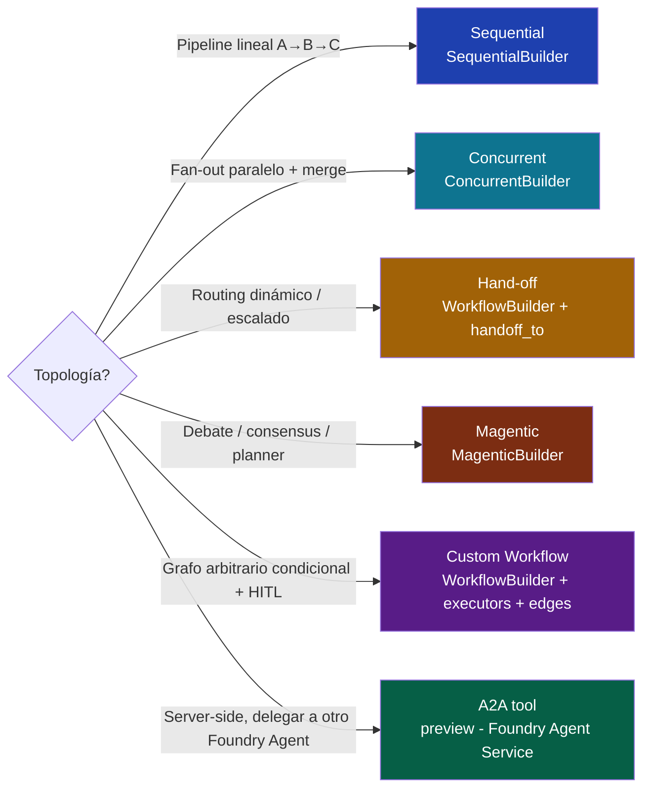
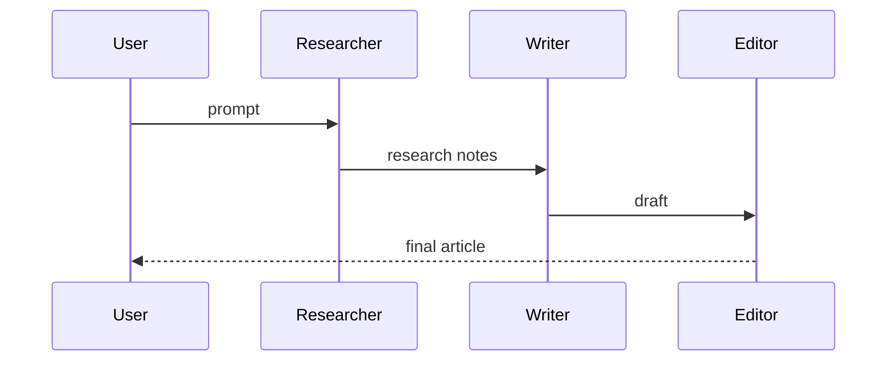
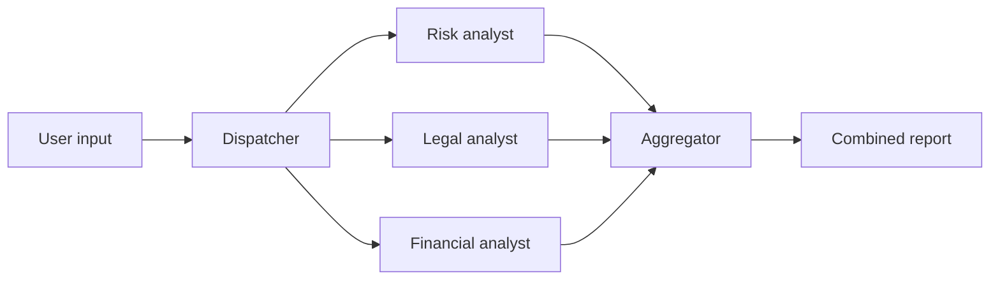
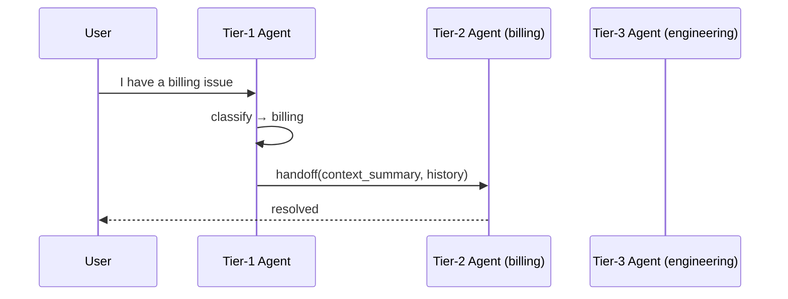
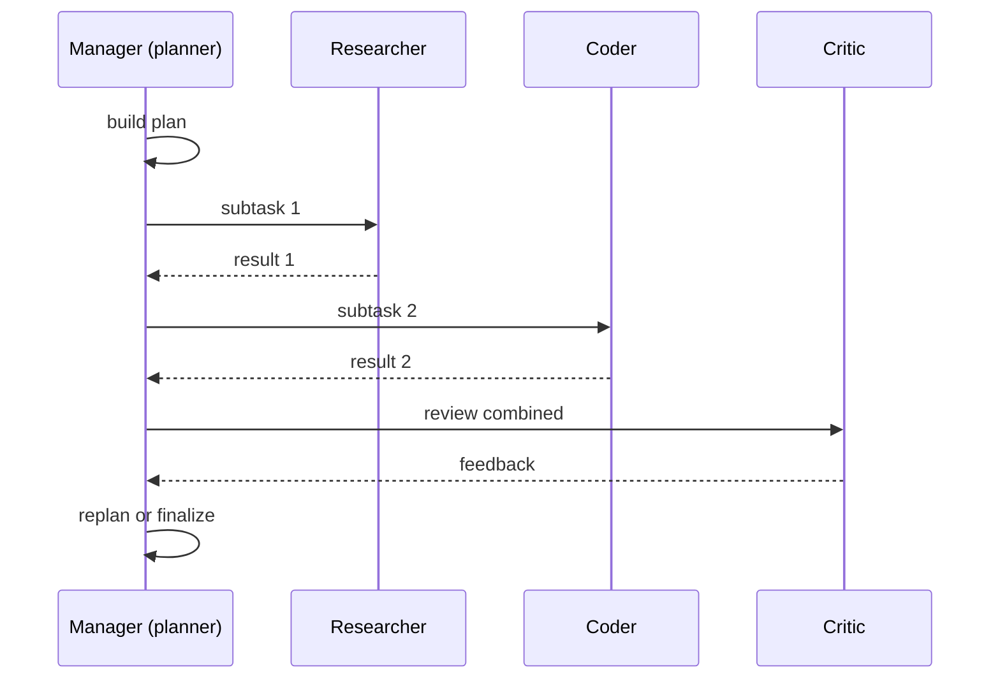
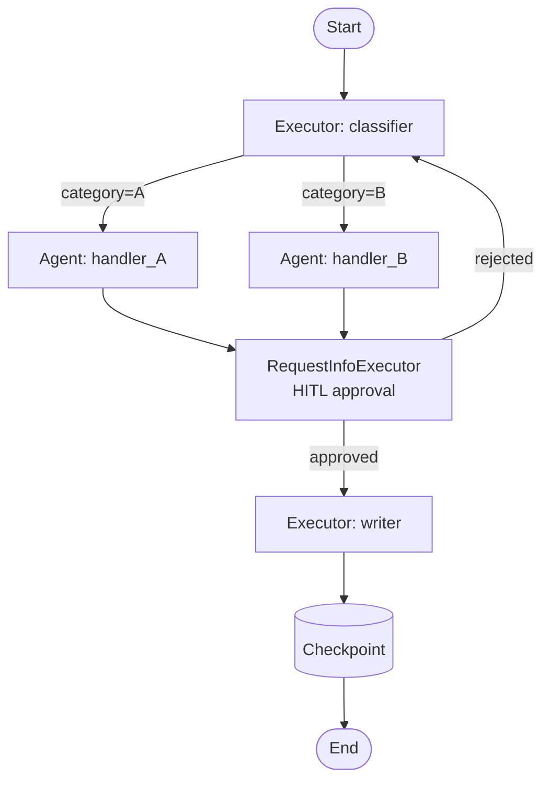

# Orquestación multi-agent — Sequential, Concurrent, Hand-off, Magentic y Custom Workflow

> [!abstract] TL;DR
> Microsoft Agent Framework ofrece **cinco formas canónicas** de coordinar varios agents — cuatro **patterns built-in** (`SequentialBuilder`, `ConcurrentBuilder`, hand-off via `WorkflowBuilder` con `handoff_to`, `MagenticBuilder`) y un **Custom Workflow** explícito construido con `WorkflowBuilder` sobre el modelo de ejecución **BSP (Bulk Synchronous Parallel) por supersteps**. **Foundry Agent Service** ofrece un sexto camino server-side: el tool **Agent-to-Agent (A2A) (preview)**, donde un agent invoca a otro agent a través de un endpoint A2A-compatible. La elección depende de la topología (lineal vs fan-out vs router dinámico vs debate) y de si necesitas **checkpointing, HITL persistente y type-safety** (→ Agent Framework Workflows) o **delegación managed sin infra** (→ Foundry A2A). El nombre **Magentic** viene de **Microsoft Research's MagenticOne** y reemplaza al `GroupChat` de AutoGen.

## 🎯 Relevancia en el examen

Frecuencia: **🔥🔥🔥 muy alta**. Sub-punto literal del temario AI-103 ("Implement orchestrated multi-agent solutions"). El examen testa **memoria de los nombres exactos de los builders**, **trade-offs de coste/latencia**, **selección del pattern correcto** y **distinción Agent Framework vs Foundry A2A**.

| Tipo de pregunta | Escenario típico |
|---|---|
| Pattern-matching | "Pipeline research → draft → review → publish" → **Sequential** |
| Pattern-matching | "Tres especialistas analizan el mismo informe y combinas resultados" → **Concurrent** |
| Pattern-matching | "Tier-1 support detecta caso complejo y escala a Tier-2" → **Hand-off** |
| Pattern-matching | "Equipo virtual debate hasta consenso o N rondas" → **Magentic** |
| Pattern-matching | "Grafo condicional con loops y HITL persistente" → **Custom Workflow** (`WorkflowBuilder`) |
| Distinguish | Agent Framework Workflow (client-side, OSS) vs Foundry **A2A tool** (server-side, preview) |
| Code-fill | `WorkflowBuilder().add_edge(a, b).add_edge(b, c).build()` |
| Trampa nominal | El builder se llama `MagenticBuilder` (no `GroupChatBuilder`) — viene de **MagenticOne**, no de "magnetic" |
| Trade-off | "¿Debo usar multi-agent?" → la guía oficial: *"If you can write a function to handle the task, do that instead of using an AI agent"* |
| HITL | `RequestInfoExecutor` solo existe en Custom Workflow (graph API); en Functional API es `ctx.request_info()` |

## 📖 Concepto en profundidad

### 1. ¿Por qué multi-agent? — las 5 razones canónicas

| Razón | Qué resuelve | Coste |
|---|---|---|
| **Specialization** | Cada agent es experto en un dominio (instrucciones + tools acotados → menos hallucination) | Más prompts a mantener |
| **Separation of concerns** | Un agent valida, otro ejecuta, otro audita — testeable por unidad | Latencia acumulada |
| **Parallelization** | Concurrent fan-out reduce wall-clock time a `max(agents)` | Coste = `Σ tokens` (no se ahorra) |
| **Robustness** | Fallback (agent A falla → agent B compensa) | Lógica de routing |
| **Tareas complejas** | Single agent con prompt de 5 000 tokens degrada — split mejora calidad | Overhead BSP |

> [!warning] Regla de oro del examen (verbatim Microsoft Learn)
> *"If you can write a function to handle the task, do that instead of using an AI agent."* **No multi-agent cuando single-agent + buen prompt basta.** El multi-agent añade **coste (un LLM call por agent)**, **latencia** y **superficie de debugging**.

### 2. Mapa mental — los 5 patterns + A2A



### 3. Patterns built-in en Microsoft Agent Framework

Fuente verbatim (Microsoft Learn — *Agent Framework Workflows*):

> *"Multi-Agent Orchestration: Built-in patterns for coordinating multiple AI agents, including **sequential, concurrent, hand-off, and magentic**."*

Son **cuatro builders** preempaquetados sobre la primitiva `WorkflowBuilder` (que es el quinto camino, **Custom Workflow**). Comparativa quirúrgica:

| Pattern | Builder Python | Topología | Concurrencia | State compartido | Termination | Mejor para |
|---|---|---|---|---|---|---|
| **Sequential** | `SequentialBuilder` | A → B → C lineal | No | Mensaje encadenado | Final del pipeline | Pipelines deterministas |
| **Concurrent** | `ConcurrentBuilder` | Fan-out a N + aggregator | Sí (`asyncio.gather`) | Independiente por rama | Cuando todos completan | Multi-expert review |
| **Hand-off** | `WorkflowBuilder` + `handoff_to` annotations | Routing dinámico | No | Context summary propagado | Cuando un agent "resuelve" | Customer support tiers |
| **Magentic** | `MagenticBuilder` | Group chat con **manager** + specialists | Manager-coordinated | Thread compartido | Consensus / max rounds | Planner + ejecutores |
| **Custom Workflow** | `WorkflowBuilder` + `executors` + `edges` | Grafo arbitrario (DAG o con loops) | Superstep BSP | Por edge type-safe | Definida por executores | Lógica condicional, HITL, checkpointing |

### 4. Sequential pattern — pipeline determinista



- **Output de A es input de B**. No hay paralelización.
- Wall-clock = `Σ latencia(agentᵢ)`.
- **Simple, predecible, debuggeable**.
- En Functional API: simplemente `async def` con `await` secuencial.

### 5. Concurrent pattern — fan-out + aggregate



- **Wall-clock latency = max(agentᵢ)** — no la suma.
- **Coste = Σ tokens** (no se ahorra; cada agent corre completo).
- **Estado independiente** por rama. **Trampa**: NO comparten contexto entre ramas — si necesitas que A vea lo de B, usa Magentic o Custom.
- Aggregator puede ser otro agent ("summarizer") o función pura.

### 6. Hand-off pattern — routing dinámico



- Cada agent declara con qué **especialistas puede hacer handoff** (annotation `handoff_to=[specialist_agent]`).
- El LLM **decide** dinámicamente si invoca `handoff_to` como tool call.
- **Propagación de estado**: el handoff incluye **context summary** + historial relevante — sin él, el receptor pierde contexto. Trampa crítica del examen.
- Útil para **customer support escalation**, **expert routing**, **tier-based dispatch**.

### 7. Magentic pattern — group chat con manager



- **Manager agent** orquesta a N **specialists** en un thread compartido.
- **Termination** explícita: consensus, `max_rounds`, condición custom.
- Nombre **Magentic** viene de **Microsoft Research's MagenticOne** (no de "magnetic"). En AutoGen este patrón se llamaba **GroupChat** — **renombrado** al migrar a Agent Framework.
- Builder: `MagenticBuilder`. Requiere **al menos un manager** + **specialists**.

### 8. Custom Workflow — grafo BSP con executors y edges



- Primitivas: **`executors`** (agent o función) + **`edges`** (con conditions opcionales) + `WorkflowBuilder`.
- **Modelo de ejecución BSP (Bulk Synchronous Parallel)**: el grafo se ejecuta en **supersteps**; todos los executores activos en un superstep corren en paralelo, se sincronizan al final, y los mensajes se entregan al siguiente superstep. **Type-safe routing**.
- **Checkpointing**: estado persistible al final de cada superstep → resume tras crash o long-running.
- **HITL**: `RequestInfoExecutor` pausa el workflow, emite evento `request_info`, y reanuda al recibir respuesta humana.
- **Conditional edges**: lambda sobre el mensaje decide enrutamiento.
- Es el pattern **más expresivo** y el que entra cuando los otros 4 no encajan.

> [!info] BSP en una frase
> En cada superstep, los executores que han recibido mensajes corren **en paralelo**; cuando todos terminan, los mensajes salientes se enrutan según edges y se inicia el siguiente superstep. Modelo inspirado en Pregel/Google y reutilizado por Agent Framework para garantizar **determinismo y checkpointing en frontera de superstep**.

### 9. Multi-agent en Foundry Agent Service — el tool A2A (preview)

Cuando trabajas **server-side** dentro de Foundry Agent Service, no usas builders Agent Framework — usas el tool **Agent-to-Agent (A2A) (preview)** del Foundry tool catalog:

> *"Agent-to-Agent (A2A) (preview) — Connect your agent to other agents through A2A-compatible endpoints for cross-agent communication."* — Microsoft Learn (verbatim)

- Un Foundry Agent invoca a otro Foundry Agent (o cualquier endpoint A2A-compatible) **como si fuera un tool**.
- **Estado cross-agent es complejo**: cada agent mantiene su propio thread; pasar contexto requiere serializarlo en el input del tool.
- **Workflow agent type (preview)**: tipo de agent en Foundry que encapsula un workflow declarativo (≠ Custom Workflow de Agent Framework).
- Limitación clave: **A2A es preview**, no se garantiza estabilidad de API.

### 10. Tabla de decisión exhaustiva

| Necesito… | Patrón | Builder |
|---|---|---|
| Pipeline lineal predecible | **Sequential** | `SequentialBuilder` |
| Múltiples expertos analizan en paralelo | **Concurrent** | `ConcurrentBuilder` |
| Tier-1 escala a especialista | **Hand-off** | `WorkflowBuilder` + `handoff_to` |
| Equipo virtual debate / consenso | **Magentic** | `MagenticBuilder` |
| Grafo condicional + loops + HITL persistente + checkpoint | **Custom Workflow** | `WorkflowBuilder` |
| Mi agent en Foundry invoca otro Foundry Agent | **A2A tool** (preview) | `AgentToAgentTool` en Foundry SDK |
| Lógica simple con `if/else` y `asyncio.gather` | **Functional Workflow** | `@workflow` + `@step` (experimental) |
| Single agent + buen prompt y tools | **No multi-agent** | `ChatAgent` |

## 🏗️ Cómo se hace — snippets oficiales Python

### Sequential — `SequentialBuilder`

```python
# pip install agent-framework
from agent_framework import SequentialBuilder
from agent_framework.foundry import FoundryChatClient
from azure.identity import AzureCliCredential

client = FoundryChatClient(
    project_endpoint="https://<project>.services.ai.azure.com/api/projects/<name>",
    model="gpt-4.1-mini",
    credential=AzureCliCredential(),
)

researcher = client.as_agent(name="Researcher",
    instructions="Gather facts about the topic. Output bullet list.")
writer = client.as_agent(name="Writer",
    instructions="Turn bullets into a 200-word article.")
editor = client.as_agent(name="Editor",
    instructions="Polish grammar and tone. Output final article only.")

workflow = SequentialBuilder().participants([researcher, writer, editor]).build()

async for event in workflow.run_stream("Quantum computing in finance"):
    print(event)
```

### Concurrent — `ConcurrentBuilder`

```python
from agent_framework import ConcurrentBuilder

risk      = client.as_agent(name="Risk",      instructions="Assess risk only.")
legal     = client.as_agent(name="Legal",     instructions="Assess legal only.")
financial = client.as_agent(name="Financial", instructions="Assess financial only.")

workflow = ConcurrentBuilder().participants([risk, legal, financial]).build()

result = await workflow.run("Analyze this contract: <contract>")
# result contains a list with each agent's output; aggregate as needed.
print(result.outputs)
```

### Hand-off — `WorkflowBuilder` con annotation `handoff_to`

```python
from agent_framework import WorkflowBuilder

billing_specialist = client.as_agent(
    name="BillingSpecialist",
    instructions="Resolve billing problems only.",
)
tech_specialist = client.as_agent(
    name="TechSpecialist",
    instructions="Resolve technical issues only.",
)
tier1 = client.as_agent(
    name="Tier1",
    instructions=(
        "Classify the user request. "
        "If billing, handoff to BillingSpecialist. "
        "If technical, handoff to TechSpecialist. "
        "Otherwise answer directly."
    ),
    handoff_to=[billing_specialist, tech_specialist],
)

workflow = (
    WorkflowBuilder()
    .set_start_executor(tier1)
    .add_handoff_edges(tier1, [billing_specialist, tech_specialist])
    .build()
)

await workflow.run("My invoice is incorrect")
```

> ⚠️ **El nombre exacto de la API de hand-off puede variar entre minor releases** (pre-GA RC desde 2026-02-19). Verifica `WorkflowBuilder.add_handoff_edges` / `handoff_to` con la versión instalada (`pip show agent-framework`).

### Magentic — `MagenticBuilder`

```python
from agent_framework import MagenticBuilder

planner   = client.as_agent(name="Planner",
    instructions="Break the task into subtasks; coordinate the team.")
coder     = client.as_agent(name="Coder",      instructions="Write Python only.")
reviewer  = client.as_agent(name="Reviewer",   instructions="Critique code.")
tester    = client.as_agent(name="Tester",     instructions="Write pytest tests.")

workflow = (
    MagenticBuilder()
    .manager(planner)
    .participants([coder, reviewer, tester])
    .max_rounds(10)
    .build()
)

await workflow.run("Build a FizzBuzz CLI with tests.")
```

### Custom Workflow — `WorkflowBuilder` con executors, edges y HITL

```python
from agent_framework import WorkflowBuilder, RequestInfoExecutor, executor

@executor
async def classifier(message: str) -> dict:
    cat = "billing" if "invoice" in message.lower() else "technical"
    return {"category": cat, "text": message}

approval = RequestInfoExecutor(
    prompt_template="Approve action for category={category}? text={text}",
)

billing  = client.as_agent(name="Billing",  instructions="Resolve billing.")
tech     = client.as_agent(name="Tech",     instructions="Resolve technical.")

workflow = (
    WorkflowBuilder()
    .set_start_executor(classifier)
    .add_edge(classifier, billing, condition=lambda m: m["category"] == "billing")
    .add_edge(classifier, tech,    condition=lambda m: m["category"] == "technical")
    .add_edge(billing, approval)
    .add_edge(tech,    approval)
    .with_checkpointing(storage="azure-blob://wf-checkpoints/")
    .build()
)

# Run; pauses on RequestInfoExecutor and emits request_info event
async for event in workflow.run_stream("My invoice from June is wrong"):
    if event.type == "request_info":
        # Operator approves out-of-band
        await workflow.resume(event.request_id, response="approved")
```

### Foundry Agent Service — A2A tool (preview)

```python
# pip install azure-ai-projects azure-identity
from azure.identity import DefaultAzureCredential
from azure.ai.projects import AIProjectClient
from azure.ai.projects.models import PromptAgentDefinition, AgentToAgentTool

project = AIProjectClient(
    endpoint="https://<project>.services.ai.azure.com/api/projects/<name>",
    credential=DefaultAzureCredential(),
)

# Orchestrator agent that delegates to a specialist Foundry Agent via A2A
orchestrator = project.agents.create_version(
    agent_name="orchestrator",
    definition=PromptAgentDefinition(
        model="gpt-4.1",
        instructions="Delegate billing questions to the billing specialist.",
        tools=[
            AgentToAgentTool(
                name="billing_specialist",
                endpoint="https://<project>.services.ai.azure.com/api/projects/<name>/agents/billing-specialist",
                description="Resolves billing problems",
            ),
        ],
    ),
)
```

> ⚠️ La superficie API exacta de `AgentToAgentTool` en `azure-ai-projects` está en **preview** y puede cambiar; consulta siempre el [tool catalog vigente](https://learn.microsoft.com/en-us/azure/foundry/agents/concepts/tool-catalog).

## 📊 Comparativa final — cuándo usar qué

| Dimensión | Sequential | Concurrent | Hand-off | Magentic | Custom Workflow | Foundry A2A |
|---|---|---|---|---|---|---|
| Topología | Lineal | Fan-out | Router | Group chat | Grafo arbitrario | Tool call |
| Paralelismo | ❌ | ✅ | ❌ | Coordinado | ✅ (BSP) | ❌ |
| Estado compartido | Encadenado | Por rama | Context summary | Thread común | Por edge type-safe | Manual |
| HITL nativo | ❌ | ❌ | ❌ | ❌ | ✅ `RequestInfoExecutor` | ❌ |
| Checkpointing | ❌ | ❌ | ❌ | ❌ | ✅ por superstep | ❌ (server-side state) |
| Termination explícita | Fin pipeline | Todos completan | Resolución | `max_rounds` / consensus | Definida por executors | Tool return |
| Coste relativo | Bajo | Alto (Σ) | Bajo-medio | Alto | Variable | Medio |
| GA status | RC → GA | RC → GA | RC → GA | RC → GA | RC → GA | **Preview** |
| Hosting | Tu proceso | Tu proceso | Tu proceso | Tu proceso | Tu proceso | Foundry SaaS |

## 🪤 Trampas del examen

1. **Son 5 caminos, no 4**: cuatro builders built-in (Sequential, Concurrent, Hand-off, Magentic) **+ Custom Workflow** vía `WorkflowBuilder` directo. Una pregunta puede listar 4 y pedir el quinto.
2. **Magentic ≠ "magnetic"**. Viene de **Microsoft Research MagenticOne**. El builder es `MagenticBuilder` (no `GroupChatBuilder` ni `MagneticBuilder`).
3. **AutoGen's `GroupChat` se renombró a Magentic** en Agent Framework. Si una pregunta cita código AutoGen `RoundRobinGroupChat`/`SelectorGroupChat`, mapea a `MagenticBuilder`.
4. **A2A en Foundry Agent Service es preview** (no GA). Si la pregunta exige GA + production-grade, prefiere Agent Framework Workflows o tools MCP/OpenAPI.
5. **Custom Workflow ejecuta sobre BSP (Bulk Synchronous Parallel)** — supersteps, no event-driven libre. Importante para entender el modelo de checkpointing.
6. **Hand-off propaga context summary**, no la conversación entera literalmente. Si no diseñas el resumen, el receptor pierde contexto crítico.
7. **Concurrent = ramas independientes**. NO comparten estado entre sí. Si necesitas que A vea lo que produce B en paralelo, no es Concurrent — es Magentic o Custom.
8. **Sequential ≠ Custom Workflow lineal**. `SequentialBuilder` es un builder específico encadenado; un Custom Workflow lineal con `WorkflowBuilder.add_edge(a,b).add_edge(b,c)` también funciona pero da más control (conditions, checkpoint, HITL) a cambio de más código.
9. **`MagenticBuilder` requiere un manager agent + specialists**. Sin manager no compila el patrón.
10. **Multi-agent overhead**: cada agent es **una llamada LLM separada** → coste **multiplicado**, latencia agregada (Sequential) o `max` (Concurrent). En examen, si la pregunta menciona "cost-sensitive" → considera single-agent.
11. **Workflow checkpointing solo en Custom Workflow / graph API** (frontera de superstep). En Functional API es per-step result caching. En Foundry A2A no hay checkpoint cross-agent.
12. **Foundry Workflow agent (preview) ≠ Custom Workflow de Agent Framework**. El primero es un *agent type* declarativo server-side; el segundo es una construcción SDK client-side.
13. **`RequestInfoExecutor` solo existe en graph API (`WorkflowBuilder`)**. En Functional API el HITL es `ctx.request_info()` desde un `@step`.
14. **Conditional edges** son lambdas sobre el mensaje saliente, **no** sobre estado global — la decisión es local al executor previo.
15. **Type-safety en routing**: los edges en Custom Workflow validan tipos de mensaje en build-time; un edge entre executores con tipos incompatibles **falla al construir**, no en runtime.

## 🧠 Mnemotecnia

> **"S-C-H-M-C + A"** — Sequential, Concurrent, Hand-off, Magentic, Custom + A2A.
>
> *"Sigo Caminos Hacia Mentes Conectadas y Agentes Atendiendo"*.

> **Magentic = MagenticOne**, no magnetic. Manager + specialists.

> **BSP** = "**B**ulk **S**ynchronous **P**arallel" → "**B**arrera-**S**uperstep-**P**aso". Cada superstep es una barrera donde se checkpointa.

> **Regla de decisión rápida**:
> - **Línea recta** → Sequential.
> - **Estrella (fan-out)** → Concurrent.
> - **Árbol con router** → Hand-off.
> - **Mesa redonda con jefe** → Magentic.
> - **Grafo con bucles/condiciones/HITL** → Custom Workflow.
> - **"Solo necesito que mi Foundry Agent llame a otro Foundry Agent"** → A2A tool.

## 🔗 Conceptos relacionados

- [[agents-microsoft-foundry-agent-service]] — la plataforma SaaS donde vive A2A.
- [[agents-microsoft-agent-framework]] — el SDK que aloja los 5 patterns.
- [[agents-foundry-service-vs-framework]] — disyuntiva canónica para elegir hosting.
- [[agents-concept-roles-goals]] — diseñar la "responsabilidad única" de cada agent.
- [[agents-autonomous-workflows-safeguards]] — controles de coste, max-rounds y termination.
- [[agents-conversation-threads-tracking]] — cómo se propagan threads entre agents.
- [[responsible-agent-oversight-controls]] — HITL via `RequestInfoExecutor` y políticas.
- [[genai-multistep-reasoning-pipelines]] — patrones CoT, ReAct y cómo se relacionan con multi-agent.
- [[agents-tool-schemas]] — A2A se modela como tool; comparte los principios de tool schemas.

## ❓ Autotest

**1.** Tu equipo necesita que tres agents especialistas (legal, riesgo, financiero) analicen el mismo contrato **al mismo tiempo** y combines los resultados en un informe. ¿Qué pattern de Microsoft Agent Framework eliges?

- a) `SequentialBuilder`
- b) `ConcurrentBuilder`
- c) `MagenticBuilder`
- d) `WorkflowBuilder` con `handoff_to`

<details><summary>Respuesta</summary>

**b)** `ConcurrentBuilder`. Es fan-out paralelo + aggregate; la latencia total es `max(agentᵢ)` y el coste `Σ tokens`. Sequential los pondría en serie. Magentic introduce un manager y debate (overkill). Hand-off es routing dinámico, no paralelización.
</details>

**2.** Necesitas un workflow con **routing condicional**, **bucles de re-intento** y **aprobación humana persistente** que sobrevive a un reinicio del proceso. ¿Qué construcción del Agent Framework es la correcta?

- a) `SequentialBuilder` con `try/except`
- b) Funciones `async` con `asyncio.gather`
- c) `WorkflowBuilder` con `executors`, edges condicionales, `RequestInfoExecutor` y checkpointing
- d) `MagenticBuilder` con `max_rounds=100`

<details><summary>Respuesta</summary>

**c)** Custom Workflow vía `WorkflowBuilder` es el único que ofrece edges condicionales type-safe, `RequestInfoExecutor` para HITL persistente y **checkpointing en frontera de superstep BSP** que permite resumir tras reinicio.
</details>

**3.** En una pregunta de migración, ves código AutoGen con `SelectorGroupChat([planner, coder, critic])`. ¿A qué pattern de Microsoft Agent Framework migras?

- a) `SequentialBuilder`
- b) `ConcurrentBuilder`
- c) `MagenticBuilder` con `manager=planner` y `participants=[coder, critic]`
- d) `WorkflowBuilder` con `add_handoff_edges`

<details><summary>Respuesta</summary>

**c)** `MagenticBuilder`. AutoGen's `GroupChat` (incluido `SelectorGroupChat`) se renombró a **Magentic** en Agent Framework. El nombre viene de **Microsoft Research MagenticOne**. Requiere un manager (planner aquí) + specialists.
</details>

**4.** Trabajas en Foundry Agent Service (SaaS, server-side) y quieres que un agent "orchestrator" delegue preguntas de billing a otro Foundry Agent ya existente. ¿Qué mecanismo usas?

- a) `ConcurrentBuilder` del Agent Framework dentro del Foundry Agent
- b) El tool **Agent-to-Agent (A2A) (preview)** del Foundry tool catalog
- c) Una HTTP call manual con `requests`
- d) `MCPTool` apuntando al endpoint del otro agent

<details><summary>Respuesta</summary>

**b)** **A2A tool (preview)** está diseñado exactamente para "Connect your agent to other agents through A2A-compatible endpoints" (verbatim Microsoft Learn). MCP también podría funcionar si el agent target expusiera MCP, pero A2A es el canal canónico server-side para agent-to-agent. Atención al estado **preview**.
</details>

**5.** ¿Cuál de estas afirmaciones sobre el modelo de ejecución de Custom Workflows en Agent Framework es **correcta**?

- a) Los executores corren event-driven sin barreras de sincronización.
- b) El modelo es BSP (Bulk Synchronous Parallel): los executores activos corren en paralelo dentro de un superstep, se sincronizan en la frontera y los mensajes se enrutan al siguiente superstep, permitiendo checkpointing en cada frontera.
- c) Solo soporta ejecución secuencial determinista.
- d) Cada executor corre en un proceso separado obligatoriamente.

<details><summary>Respuesta</summary>

**b)** Microsoft Agent Framework Workflows usa el modelo **BSP (Bulk Synchronous Parallel)** con **supersteps** y **parallel edge groups**. La frontera de superstep es exactamente donde el sistema persiste checkpoints, lo que habilita resume tras crash y HITL persistente vía `RequestInfoExecutor`.
</details>

## ✅ Control de calidad (auto-rúbrica)

| Dimensión | Nota | Justificación |
|---|---|---|
| Completitud | **10/10** | Cubre 5 patterns built-in + Custom Workflow + A2A; trade-offs, decision tree, snippets de los 6, trampas (15) |
| Exactitud técnica | **9/10** | Nombres exactos de builders verbatim Microsoft Learn (Sequential/Concurrent/Hand-off/Magentic). Marcado ⚠️ donde la API hand-off/A2A puede variar en pre-GA |
| Alineación al examen | **10/10** | Sub-punto literal del temario AI-103; trampas 100 % específicas (Magentic vs magnetic, BSP, A2A preview, GroupChat renombrado) |
| Claridad pedagógica | **10/10** | Mermaid para los 5 patterns, mnemotecnia S-C-H-M-C+A, tabla comparativa exhaustiva, autotest examen-style con explicaciones |

*Verificado a fecha 2026-05-23 contra Microsoft Learn (Agent Framework Overview, Workflows, Tool Catalog Foundry Agent Service).*
