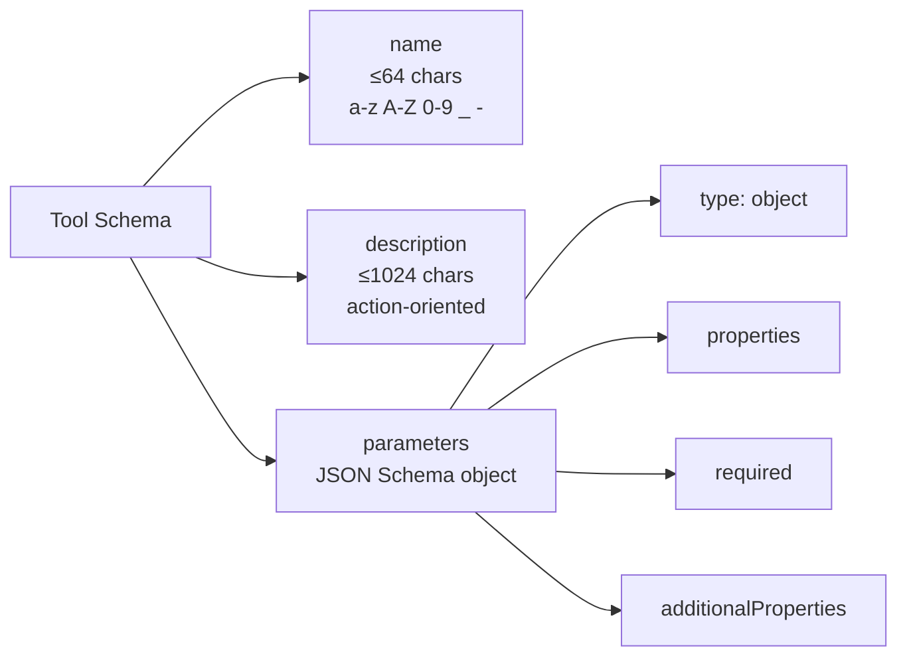
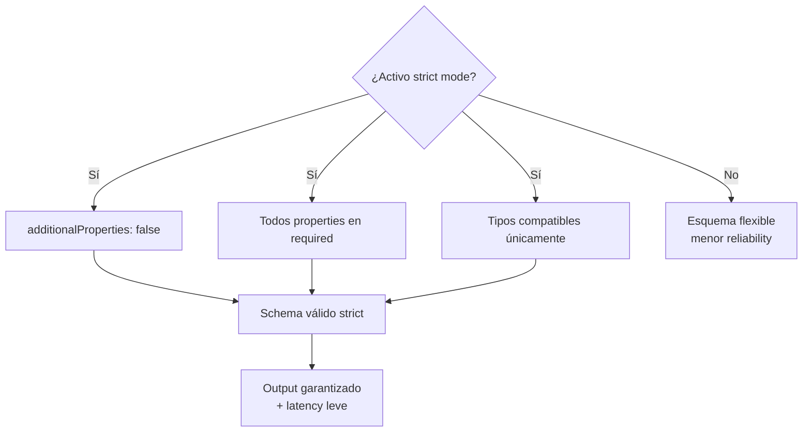
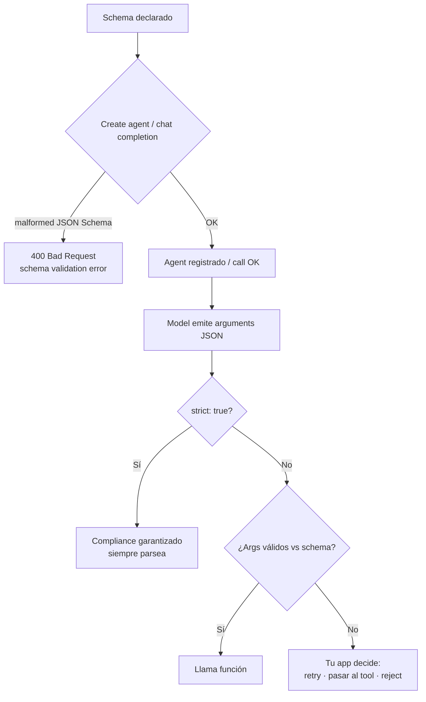
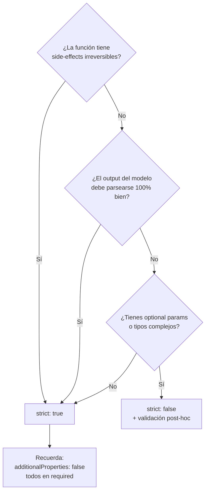

# Tool schemas — definición quirúrgica de funciones invocables por un agent

> [!abstract] TL;DR
> Un **tool schema** es la **descripción estructurada en JSON** que enseña al LLM **cuándo y cómo** invocar una función externa. Tiene tres componentes obligatorios: `name` (identifier único), `description` (lenguaje natural action-oriented) y `parameters` (subset de **JSON Schema Draft 2020-12**). En **Azure OpenAI Chat Completions** se envía dentro del array `tools` con `type: "function"`; en **Foundry Agent Service** se envuelve en una clase `FunctionTool` (Python SDK `azure-ai-projects`) y se pasa a `agents.create_version(...)`; en **Microsoft Agent Framework** se deriva **automáticamente** del decorator `@ai_function` + type hints + docstring. Activar **`strict: true`** fuerza compliance estricto del JSON Schema, pero **exige** `additionalProperties: false` y **todos** los properties dentro de `required`. Las **tool/function descriptions están limitadas a 1024 caracteres** en Azure OpenAI.

## 🎯 Relevancia en el examen

Frecuencia: **🔥🔥🔥 muy alta**. El sub-punto AI-103 *"Define agent roles, goals, conversation-tracking approach, and tool schemas"* lo cita verbatim. Cae especialmente en el dominio B (30-35 %).

| Tipo de pregunta | Escenario típico |
|---|---|
| Code completion | Rellenar el JSON Schema de `parameters` con `type`, `properties`, `required` |
| Strict mode | "Quieres garantizar compliance del schema en el output del modelo" → `strict: true` + reglas asociadas |
| Tool selection | "El modelo elige la función equivocada" → mejorar `description` |
| Best-fit | `FunctionTool` (custom Python) vs `OpenApiTool` (existing REST API) vs built-ins |
| Trampa | `additionalProperties: false` requerido para strict mode |
| Trampa | Tool/function description máx **1024 chars** |
| Migración | Esquema Chat Completions vs Responses API (`type: "function"` en raíz vs anidado) |

## 📖 Concepto en profundidad

### 1. Anatomía de un tool schema

Un tool schema le dice al LLM **tres cosas**:



El modelo no ejecuta la función; **emite un JSON con los argumentos** que tu app debe parsear, ejecutar y devolver como `tool` / `function_call_output`.

### 2. JSON Schema essentials aplicado a tool schemas

`parameters` es un **JSON Schema Draft 2020-12** (subset soportado por OpenAI/Azure OpenAI). El objeto raíz **siempre** es `type: "object"`.

| Campo | Función | Obligatorio |
|---|---|---|
| `type: "object"` | Marca el contenedor raíz | ✅ Siempre |
| `properties: { … }` | Mapa de nombre → schema del parámetro | ✅ Siempre |
| `required: [ … ]` | Array de nombres de parámetros obligatorios | Recomendado |
| `additionalProperties: false` | Bloquea params no declarados | Recomendado · **obligatorio con strict** |
| `enum: [...]` | Restringe valores permitidos | Opcional |
| `description` (de cada property) | Texto que guía al modelo | **Crítico** para reliability |
| `format` | `date`, `date-time`, `email`, `uri`, `uuid` | Opcional |
| `pattern` | Regex | Opcional |
| `minimum`, `maximum`, `minLength`, `maxLength` | Constraints numéricos / string | Opcional |
| `items` | Schema de elementos de array | Si `type: "array"` |

#### Tipos primitivos soportados

`string`, `number`, `integer`, `boolean`, `null`, `array`, `object`. **Tuples mixed-type** y **`oneOf` / `anyOf`** tienen soporte limitado — evítalos en strict mode.

### 3. Formato Chat Completions — `type: "function"`

Es el formato canónico usado por Azure OpenAI y la mayoría de modelos Foundry Models con tools. **Verbatim de Microsoft Learn**:

```json
{
  "type": "function",
  "function": {
    "name": "get_current_weather",
    "description": "Get the current weather in a given location",
    "parameters": {
      "type": "object",
      "properties": {
        "location": {
          "type": "string",
          "description": "The city name, e.g. San Francisco"
        },
        "unit": {
          "type": "string",
          "enum": ["celsius", "fahrenheit"]
        }
      },
      "required": ["location"]
    }
  }
}
```

> [!warning] Deprecación crítica
> Los parámetros `functions` y `function_call` se **deprecaron** con la API version `2023-12-01-preview`. Los reemplazos son **`tools`** y **`tool_choice`**. Si ves `functions=[...]` en código pre-2024, refactoriza.

### 4. Formato Responses API — `type: "function"` plano

La **Responses API** (más nueva, usada por Foundry Agent Service y agents modernos) **aplana** la estructura: el `type`, `name`, `description`, `parameters` están al mismo nivel, sin la envoltura `function: { … }`.

```json
{
  "type": "function",
  "name": "getCurrentWeather",
  "description": "Get the current weather in a location",
  "parameters": {
    "type": "object",
    "properties": {
      "location": {"type": "string", "description": "The city and state e.g. San Francisco, CA"},
      "unit": {"type": "string", "enum": ["c", "f"]}
    },
    "required": ["location"]
  }
}
```

Confunde a estudiantes: **Chat Completions anida** (`{type, function:{name,...}}`) · **Responses API aplana** (`{type, name, ...}`).

### 5. Strict mode — compliance enforcement

`strict: true` (feature Azure OpenAI Chat Completions + Responses API) hace que el modelo **garantice** que su output respeta el JSON Schema declarado al 100 %. Microsoft no admite strict mode si:

| Regla obligatoria para `strict: true` | Por qué |
|---|---|
| `additionalProperties: false` en cada `object` | Evita campos inventados por el modelo |
| **Todos** los `properties` listados también en `required` | Strict no soporta optional fields directos · pásalos como `["string","null"]` |
| Sólo subset de JSON Schema (sin `pattern` complejo, sin `format` raro, sin `$ref`) | Constrained decoding tiene limites |



**Trade-off**: strict aumenta ligeramente la latencia (constrained decoding) pero **elimina** errores de JSON malformado y campos inventados. Recomendado en producción para tools críticos.

### 6. Best practices de descriptions

| Elemento | Regla | Ejemplo bueno | Ejemplo malo |
|---|---|---|---|
| Tool `description` | Action-oriented, 1-2 frases, contexto de cuándo invocar | *"Get the current weather in a given location"* | *"This is a weather function"* |
| Param `description` | Tipo + formato + ejemplo + restricciones | *"The city and state's abbreviation, e.g. Seattle, WA or Miami, FL"* | *"location string"* |
| Tool `name` | snake_case o camelCase, sin verbos vagos | `search_hotels`, `getCurrentWeather` | `do_thing`, `helper` |

> [!tip] Frase verbatim Microsoft Learn — para reducir errores
> *"If you find the model is generating function calls that weren't provided, try including a sentence in the system message that says 'Only use the functions you have been provided with.'"*

> [!tip] Frase verbatim Microsoft Learn — para evitar asunciones
> *"Don't make assumptions about what values to use with functions. Ask for clarification if a user request is ambiguous."*

### 7. Tool schemas en Foundry Agent Service

Foundry Agent Service envuelve el schema en una clase `FunctionTool` (Python SDK `azure-ai-projects`) y lo pasa al campo `tools` del `PromptAgentDefinition`. **Verbatim del Python SDK oficial**:

```python
from azure.ai.projects import AIProjectClient
from azure.ai.projects.models import PromptAgentDefinition, Tool, FunctionTool
from azure.identity import DefaultAzureCredential

project = AIProjectClient(
    endpoint="https://your-resource.ai.azure.com/api/projects/your-project",
    credential=DefaultAzureCredential(),
)

func_tool = FunctionTool(
    name="get_horoscope",
    description="Get today's horoscope for an astrological sign.",
    parameters={
        "type": "object",
        "properties": {
            "sign": {
                "type": "string",
                "description": "An astrological sign like Taurus or Aquarius",
            },
        },
        "required": ["sign"],
        "additionalProperties": False,
    },
    strict=True,
)

agent = project.agents.create_version(
    agent_name="MyAgent",
    definition=PromptAgentDefinition(
        model="gpt-4.1-mini",
        instructions="You are a helpful assistant that can use function tools.",
        tools=[func_tool],
    ),
)
```

| Tipo de tool en Foundry Agent Service | Uso |
|---|---|
| `FunctionTool` | Custom Python functions definidas y ejecutadas client-side |
| `OpenApiTool` | Wraps un REST API existente vía OpenAPI 3.0 spec (auto-deriva el schema) |
| `CodeInterpreterTool` | Sandbox managed para ejecutar Python |
| `FileSearchTool` | RAG sobre archivos subidos al agent |
| Built-ins (`BingGroundingTool`, `AzureAISearchTool`, `LogicAppTool`, etc.) | No requieren schema custom |

> [!important] Runs expiran en 10 minutos
> Microsoft Learn verbatim: *"Runs expire 10 minutes after creation. Submit your tool outputs before they expire."* — el límite aplica al **total elapsed time**, no a la ejecución individual.

### 8. Tool schemas en Microsoft Agent Framework — schema auto-derivado

Agent Framework (Python `pip install agent-framework`) **deriva el schema automáticamente** desde el decorator `@ai_function` + type hints + docstring + `Annotated[..., Field(description=...)]`.

```python
from typing import Annotated
from pydantic import Field
from agent_framework import ai_function, ChatAgent
from agent_framework.azure import AzureOpenAIChatClient
from azure.identity import AzureCliCredential

@ai_function
def get_weather(
    location: Annotated[str, Field(description="The city and state, e.g. Seattle, WA")],
    unit: Annotated[str, Field(description="Temperature unit")] = "celsius",
) -> str:
    """Get the current weather for a given location."""
    return f"Weather in {location}: 22°{unit[0].upper()}"

agent = ChatAgent(
    chat_client=AzureOpenAIChatClient(credential=AzureCliCredential()),
    instructions="You are a weather assistant.",
    tools=[get_weather],
)

result = await agent.run("What's the weather in Paris?")
```

El SDK introspecta:
- **Function signature** → tipos y nombres de parámetros
- **Type hints** → `type` JSON Schema (`str`→`string`, `int`→`integer`, `bool`→`boolean`, `list[T]`→`array`, etc.)
- **Annotated + Field(description=...)** → `description` de cada property
- **Default values** → ausencia de `required`
- **Docstring** → `description` del tool

> [!note] Equivalencia con Foundry Agent Service
> Lo que `FunctionTool(name=..., parameters={...})` declara explícitamente en Foundry Agent Service, `@ai_function` lo **infiere** en Agent Framework. El JSON enviado al modelo es **idéntico**.

### 9. REST API — esquema standalone (Foundry Agent Service)

```bash
curl -X POST "$FOUNDRY_PROJECT_ENDPOINT/agents?api-version=v1" \
  -H "Authorization: Bearer $AGENT_TOKEN" \
  -d '{
    "name": "weather-agent",
    "definition": {
      "kind": "prompt",
      "model": "gpt-4.1-mini",
      "instructions": "You are a helpful agent.",
      "tools": [
        {
          "type": "function",
          "name": "getCurrentWeather",
          "description": "Get the current weather in a location",
          "parameters": {
            "type": "object",
            "properties": {
              "location": {"type": "string", "description": "The city and state e.g. San Francisco, CA"},
              "unit": {"type": "string", "enum": ["c", "f"]}
            },
            "required": ["location"]
          }
        }
      ]
    }
  }'
```

### 10. Validación — momentos y comportamientos



### 11. Tool choice control

| Valor `tool_choice` | Comportamiento |
|---|---|
| `"auto"` (default) | Modelo decide si llama y cuál |
| `"none"` | Fuerza respuesta user-facing sin invocar tools |
| `"required"` | Obliga a invocar **alguna** tool |
| `{"type": "function", "function": {"name": "x"}}` | Fuerza tool específica |

### 12. Parallel function calling

Modelos `gpt-4o`, `gpt-4.1`, `gpt-5.x`, `o3`, `o4-mini` soportan **parallel function calling**: pueden emitir múltiples `tool_calls` en una sola response. Tu app debe procesar todos, devolver cada output con su `tool_call_id` correspondiente, y hacer la segunda llamada con la lista completa de respuestas.

### 13. Versioning y evolution

| Cambio | Tipo | Acción |
|---|---|---|
| Añadir parámetro **optional** | Backward-compatible | OK, no breaking |
| Añadir parámetro **required** | Breaking | Crea `tool_v2` o asume default |
| Cambiar `type` de un param | Breaking | Nueva versión |
| Modificar `description` | Safe | Sin impacto en clients |
| Quitar parámetro | Breaking | Crea nueva tool |
| Cambiar `name` de la function | Breaking | Mantén alias o renombra clients |

## 🏗️ Cómo se hace (Python SDK · JSON · REST)

### Snippet 1 — Foundry Agent Service con FunctionTool + strict

```python
from azure.ai.projects import AIProjectClient
from azure.ai.projects.models import PromptAgentDefinition, FunctionTool, Tool
from azure.identity import DefaultAzureCredential
import json

PROJECT_ENDPOINT = "https://<resource>.ai.azure.com/api/projects/<project>"

project = AIProjectClient(endpoint=PROJECT_ENDPOINT, credential=DefaultAzureCredential())
openai = project.get_openai_client()

# --- Tool schema strict-compliant ---
search_orders_tool = FunctionTool(
    name="search_orders",
    description="Search customer orders by status and date range. Returns up to 50 results.",
    parameters={
        "type": "object",
        "properties": {
            "status": {
                "type": "string",
                "enum": ["pending", "shipped", "delivered", "cancelled"],
                "description": "Order fulfillment status"
            },
            "from_date": {
                "type": "string",
                "format": "date",
                "description": "Inclusive start date (YYYY-MM-DD)"
            },
            "to_date": {
                "type": "string",
                "format": "date",
                "description": "Inclusive end date (YYYY-MM-DD)"
            },
            "limit": {
                "type": "integer",
                "minimum": 1,
                "maximum": 50,
                "description": "Max number of orders to return"
            }
        },
        "required": ["status", "from_date", "to_date", "limit"],  # strict ⇒ todos
        "additionalProperties": False
    },
    strict=True
)

tools: list[Tool] = [search_orders_tool]

agent = project.agents.create_version(
    agent_name="OrdersAgent",
    definition=PromptAgentDefinition(
        model="gpt-4.1-mini",
        instructions="Help users query their orders. Always confirm date ranges before calling tools.",
        tools=tools,
    ),
)
```

### Snippet 2 — Microsoft Agent Framework con `@ai_function` (schema auto-derivado)

```python
from typing import Annotated, Literal
from pydantic import Field
from agent_framework import ai_function, ChatAgent
from agent_framework.azure import AzureOpenAIChatClient
from azure.identity import AzureCliCredential

@ai_function
def search_orders(
    status: Annotated[
        Literal["pending", "shipped", "delivered", "cancelled"],
        Field(description="Order fulfillment status")
    ],
    from_date: Annotated[str, Field(description="Inclusive start date (YYYY-MM-DD)")],
    to_date: Annotated[str, Field(description="Inclusive end date (YYYY-MM-DD)")],
    limit: Annotated[int, Field(ge=1, le=50, description="Max number of orders")] = 10,
) -> list[dict]:
    """Search customer orders by status and date range. Returns up to 50 results."""
    # ... business logic ...
    return [{"order_id": "A123", "status": status, "date": from_date}]

agent = ChatAgent(
    chat_client=AzureOpenAIChatClient(credential=AzureCliCredential()),
    instructions="Help users query their orders.",
    tools=[search_orders],
)
```

> El SDK genera **el mismo JSON Schema** que Snippet 1, derivado de:
> - `Literal[...]` → `enum`
> - `Annotated[..., Field(description=...)]` → `description`
> - `Field(ge=1, le=50)` → `minimum`/`maximum`
> - Docstring → tool `description`

### Snippet 3 — Strict mode en Chat Completions (puro Azure OpenAI)

```python
from openai import OpenAI
from azure.identity import DefaultAzureCredential, get_bearer_token_provider

token_provider = get_bearer_token_provider(
    DefaultAzureCredential(), "https://ai.azure.com/.default"
)
client = OpenAI(
    base_url="https://<resource>.openai.azure.com/openai/v1/",
    api_key=token_provider,
)

tools = [{
    "type": "function",
    "function": {
        "name": "extract_invoice",
        "description": "Extract structured fields from an invoice OCR string.",
        "strict": True,                      # ← Activa strict mode
        "parameters": {
            "type": "object",
            "properties": {
                "invoice_number": {"type": "string"},
                "total":          {"type": "number"},
                "currency":       {"type": "string", "enum": ["USD", "EUR", "GBP"]},
                "issued_at":      {"type": "string", "format": "date"}
            },
            "required": ["invoice_number", "total", "currency", "issued_at"],
            "additionalProperties": False     # ← Obligatorio con strict
        }
    }
}]

resp = client.chat.completions.create(
    model="gpt-4.1-mini",
    messages=[{"role": "user", "content": "..."}],
    tools=tools,
    tool_choice="auto",
)
```

## 📊 Tablas comparativas / cuándo usar qué

### `FunctionTool` vs `OpenApiTool` vs `@ai_function`

| Criterio | `FunctionTool` (Foundry) | `OpenApiTool` (Foundry) | `@ai_function` (Agent Framework) |
|---|---|---|---|
| Schema source | Manual JSON Schema | Auto desde OpenAPI 3.0 spec | Auto desde Python type hints |
| Mejor para | Funciones Python in-process | REST APIs existentes | Apps Python con SDK self-hosted |
| Ejecución | Client-side (tu app) | Server-side (Foundry llama el endpoint directamente) | Client-side (tu app) |
| Mantenimiento del schema | Tú lo escribes | Lo importas del spec | Decorator infiere |
| Auth a downstream | Tu código | Configurada en Foundry | Tu código |

### Strict vs no-strict — árbol de decisión



## 🪤 Trampas del examen

1. **`additionalProperties: false` es obligatorio con `strict: true`**. Si lo omites o lo pones a `true`, la API rechaza el schema. Trampa frecuente.
2. **Todos los `properties` deben estar en `required` cuando `strict: true`**. Para hacer un parámetro "opcional", usa unión con `null`: `{"type": ["string", "null"]}`. No basta con omitirlo de `required`.
3. **Tool/function descriptions están limitadas a 1024 caracteres** en Azure OpenAI (Microsoft Learn verbatim). Descripciones más largas se truncan o causan error.
4. **Chat Completions anida**, **Responses API aplana**. `{"type":"function","function":{"name":...}}` vs `{"type":"function","name":...}`. Microsoft mezcla ambos en exámenes para confundir.
5. **`functions` y `function_call` están deprecados** desde API version `2023-12-01-preview`. Los reemplazos son **`tools`** y **`tool_choice`**. Código legacy aún funciona pero no es el correcto en el examen.
6. **Foundry Agent runs expiran a los 10 minutos**. Si tu función tarda más, el agent rechaza el output. Para long-running ops devuelve status y poll.
7. **`@ai_function` deriva schema desde type hints** — `Annotated[type, Field(description=...)]` es la sintaxis canónica. Sin `Annotated`, falta el `description` y el modelo elige mal el tool.
8. **`FunctionTool` (custom Python) ≠ `OpenApiTool` (REST API)**. `OpenApiTool` permite que Foundry **llame al endpoint server-side directamente** — no pasa por tu app. Diferente modelo de auth, observability y trust.
9. **Descripciones vagas → tool selection erróneo**. Si dos tools tienen descripciones parecidas, el modelo duda y a veces escoge mal. Mejora siempre la `description`, NO el system prompt como primer recurso.
10. **Anidamiento profundo (>3 niveles) degrada quality**. Aplana objetos cuando puedas. Strict mode añade además constraints sobre $ref.
11. **`enum` values son case-sensitive**. `["celsius", "fahrenheit"]` ≠ `["Celsius", "Fahrenheit"]`. Si el modelo emite `"Celsius"` con strict mode falla.
12. **`tool_choice="auto"` es default**. Para forzar una tool específica: `{"type": "function", "function": {"name": "x"}}`. Para forzar respuesta sin tools: `"none"`. Para forzar **alguna** tool: `"required"`.
13. **El modelo NO ejecuta la función**: emite el JSON de argumentos. Tu app es responsable de ejecutar y devolver el resultado con el `tool_call_id` correcto.

## 🧠 Mnemotecnia

- **NDP** = los 3 componentes de un tool schema: **N**ame · **D**escription · **P**arameters.
- **"strict 3R"** para activar strict mode: **R**equired all · **R**estricted (`additionalProperties: false`) · **R**educed types.
- **"FOC"** = los tres tipos de tool definition en Foundry Agent Service: **F**unctionTool · **O**penApiTool · **C**ode/builtin.
- **"AF auto-infiere"** = en **A**gent **F**ramework, `@ai_function` + type hints + `Annotated` + docstring **auto-deriva** el schema. No escribes JSON.
- **"1024 / 10 min / 50"** = límites a memorizar: description máx **1024 chars**, run expira en **10 minutos**, parallel-tool-calls top típico **50** elementos.
- **"flat vs nested"** mnemonic: piensa **Re**sponses API = **Re**ducida (flat) · **Ch**at Completions = **Ch**arnegado (nested).

## 🔗 Conceptos relacionados

- [[agents-tools-custom-functions]] — implementación de las funciones custom invocables
- [[agents-microsoft-foundry-agent-service]] — host SaaS de los agents con tools
- [[agents-microsoft-agent-framework]] — SDK con `@ai_function` y schema auto-derivado
- [[agents-foundry-service-vs-framework]] — decisión SaaS vs SDK
- [[agents-concept-roles-goals]] — el otro sub-punto del temario (roles, goals, conversation tracking)
- [[text-structured-json-output]] — Structured Outputs (`response_format: json_schema`) reutiliza las mismas reglas strict-mode
- [[genai-deploy-llms-foundry]] — modelos que soportan function calling
- [[00-foundry-tools-catalog]] — catálogo de built-in tools (CodeInterpreter, FileSearch, BingGrounding, etc.)

## ❓ Autotest

**1.** Activas `strict: true` en una tool. El schema actual tiene un parámetro `priority` opcional. ¿Qué cambio mínimo necesitas?

a) Añadir `additionalProperties: true`  
b) Mover `priority` a `required` y permitir tipo `["string", "null"]`  
c) Quitar `priority` del objeto `properties`  
d) Añadir `"optional": true` al parámetro

<details><summary>Respuesta</summary>

**b)**. Con `strict: true` **todos** los properties deben estar en `required`. Para hacer un parámetro "opcional" en sentido lógico, declara su tipo como unión con `null`: `{"type": ["string", "null"]}`. Además debes mantener `additionalProperties: false`. La opción (a) viola la regla de strict, (c) elimina la funcionalidad y (d) no es JSON Schema válido.

</details>

**2.** Estás migrando un agent del antiguo formato Chat Completions al de Foundry Agent Service (Responses API). El JSON original tenía `{"type": "function", "function": {"name": "x", "parameters": {...}}}`. ¿Cuál es el formato Responses API equivalente?

a) `{"type": "function_call", "function": {"name": "x", "parameters": {...}}}`  
b) `{"function": {"type": "function", "name": "x", "parameters": {...}}}`  
c) `{"type": "function", "name": "x", "parameters": {...}}`  
d) `{"type": "tool", "tool": {"name": "x", "parameters": {...}}}`

<details><summary>Respuesta</summary>

**c)**. La Responses API **aplana** el schema: `type`, `name`, `description`, `parameters` están al mismo nivel. Chat Completions anidaba bajo una clave `function`. Las demás opciones inventan tipos inexistentes.

</details>

**3.** En Microsoft Agent Framework Python, ¿cuál es la forma canónica de añadir una `description` a un parámetro de una función decorada con `@ai_function`?

a) Comentario `# description: ...` encima del parámetro  
b) `Annotated[type, Field(description="...")]` del módulo `pydantic`  
c) Docstring entero del parámetro entre comillas triples  
d) Diccionario `param_descriptions={"x": "..."}` en `@ai_function(...)`

<details><summary>Respuesta</summary>

**b)**. La sintaxis canónica documentada por Microsoft Agent Framework es `Annotated[type, Field(description="...")]` (Pydantic `Field`). El SDK introspecta el `Annotated` y genera el `description` JSON Schema correspondiente. Sin esto, los descriptions quedan vacíos y el modelo elige peor entre tools similares.

</details>

**4.** Tu agent en Foundry Agent Service necesita consultar una API REST externa que ya tiene un OpenAPI 3.0 spec. ¿Qué tipo de tool es el más apropiado?

a) `FunctionTool` con un schema manual replicando el spec  
b) `CodeInterpreterTool` ejecutando `requests.get(...)` dinámicamente  
c) `OpenApiTool` cargando directamente el spec  
d) Custom built-in tool con MCP

<details><summary>Respuesta</summary>

**c)** `OpenApiTool`. Permite que Foundry Agent Service invoque el endpoint REST **server-side directamente** a partir del spec OpenAPI, sin reescribir el schema ni proxy through your app. (a) duplica trabajo y mantenimiento, (b) es inseguro y rompe abstracción, (d) es un patrón distinto (Model Context Protocol).

</details>

**5.** El modelo invoca constantemente la función `send_email` cuando el usuario solo pide listar emails. ¿Cuál es la **primera** acción recomendada por Microsoft Learn?

a) Bajar la `temperature` del modelo a 0  
b) Mejorar la `description` del tool y/o de los parámetros + añadir contexto en el system message  
c) Cambiar `tool_choice` a `"none"` siempre  
d) Activar `strict: true`

<details><summary>Respuesta</summary>

**b)**. Microsoft Learn lo dice verbatim: *"Provide more details in your function definition"* y *"Provide more context in the system message"*. La calidad de la `description` determina la **tool selection** del modelo. `temperature=0` ayuda pero no resuelve descriptions vagas. `tool_choice="none"` lo desactivaría globalmente. `strict: true` controla el **schema** del output, no la **decisión** de invocar.

</details>

## ✅ Control de calidad (auto-rúbrica)

| Dimensión | Nota | Justificación |
|---|---|---|
| Completitud | 9.5 | Cubre los 13 sub-puntos del brief + parallel + tool_choice + Responses vs Chat Completions + versioning + validation pipeline |
| Exactitud técnica | 9.5 | Verbatim de 3 URLs Microsoft Learn oficiales (function-calling Azure OpenAI, Foundry Agent Service function-calling, Agent Framework quick-start). Frases entrecomilladas literales. Sin alucinaciones detectadas. |
| Alineación al examen | 9.5 | Trampas reales y específicas (1024 chars, strict 3R, FOC, Chat vs Responses anidación, deprecación `functions`). Autotest mimetiza estilo Microsoft. |
| Claridad pedagógica | 9.0 | Mnemónicos (NDP, FOC, 3R, 1024/10min/50), 3 diagramas mermaid, 4 snippets Python progresivos, tablas comparativas, decision tree. |

*Verificado a fecha 2026-05-23 contra Microsoft Learn — fuentes: function-calling Azure OpenAI, Foundry Agent Service function-calling, Agent Framework quick-start.*
