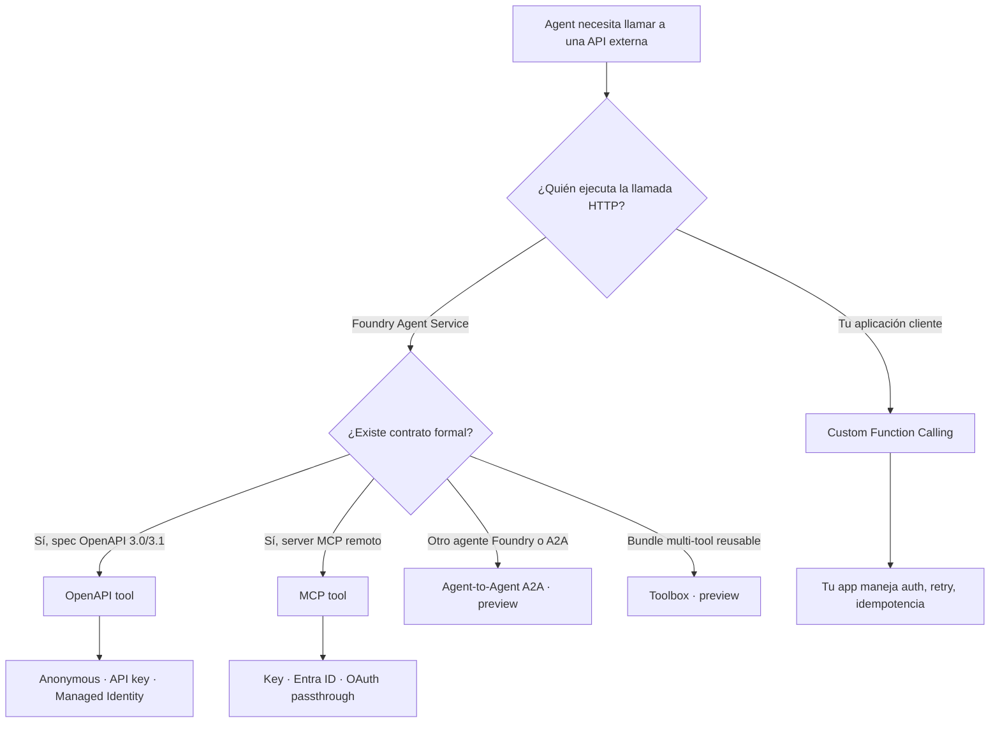
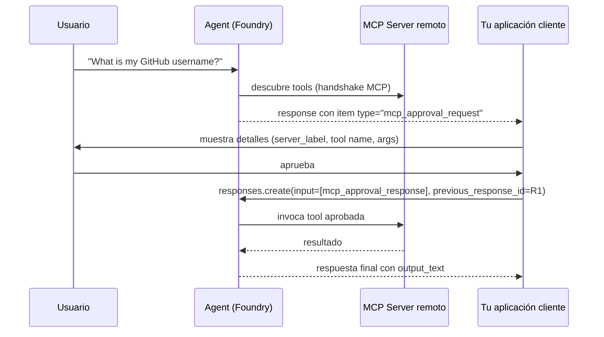
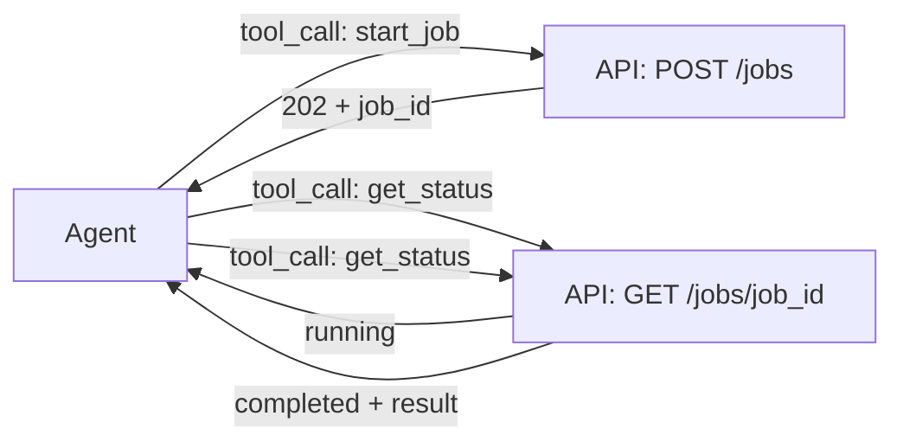
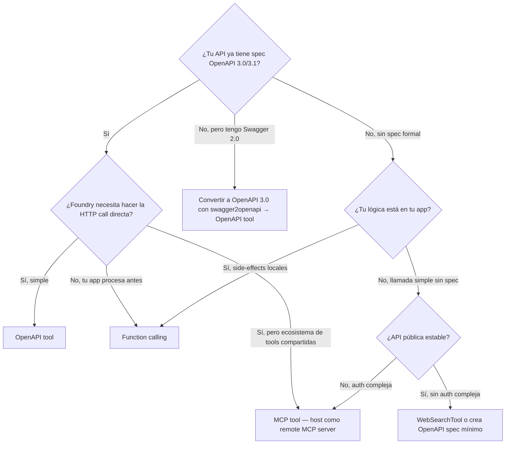

# Integración de APIs externas como tools (OpenAPI + MCP + funciones HTTP)

> [!abstract] TL;DR
> Para conectar un agente de **Foundry Agent Service** a APIs externas tienes **tres mecanismos**: **OpenAPI tool** (spec OpenAPI 3.0/3.1, Foundry hace la llamada HTTP), **MCP tool** (servidor MCP remoto que expone tools al agente vía Model Context Protocol) y **custom function calling** (tu app ejecuta la lógica, incluido cualquier `requests.post`). OpenAPI y MCP son GA; **Agent-to-Agent (A2A)** y **Toolbox** están en preview. La auth se externaliza en **project connections** (API key, Bearer, MI, OAuth pass-through). El examen prueba especialmente: clase Python exacta, `operationId` rules, `require_approval` values, timeout 100 s del MCP no-streaming, audience para MI, y cuándo elegir cada mecanismo.

## 🎯 Relevancia en el examen

| Tipo de pregunta | Escenario típico | Frecuencia |
|---|---|---|
| Drag-and-drop "match tool ↔ scenario" | "API REST corporativa con spec OpenAPI" → OpenApiTool; "servidor MCP de GitHub" → MCPTool | 🔥🔥🔥 |
| Identificar clase/parámetro Python correcto | `OpenApiTool(openapi=OpenApiFunctionDefinition(...))` vs constructor plano | 🔥🔥🔥 |
| Configurar auth | API key con `project_connection_id` vs MI con `audience` | 🔥🔥🔥 |
| Trampa OpenAPI 2.0 / Swagger | "Tengo spec Swagger 2.0..." → respuesta: NO soportado, requiere 3.0/3.1 | 🔥🔥 |
| Valores `require_approval` MCP | `"always"` / `"never"` / `{"never":[...]}` / `{"always":[...]}` | 🔥🔥 |
| Pattern asíncrono | API que tarda > 100 s → split en initiate + poll tools | 🔥🔥 |
| Self-host MCP local | Container Apps con MCP subnet o Azure Functions | 🔥 |

## 📖 Concepto en profundidad

### 1. Los tres mecanismos para integrar APIs



**Diferencia clave:**

- **OpenAPI tool y MCP tool** → **el plano del Agent Service** hace la HTTP call. Tu app no participa en ese hop.
- **Function calling** → el agente emite `tool_calls`, **tu app** ejecuta (puede llamar a una API, BD, lógica de negocio) y devuelve el resultado al thread. Cubierto en [[agents-tools-custom-functions]].

### 2. OpenAPI tool — anatomía

#### Versiones soportadas (verbatim Learn)
> *"Connect your Microsoft Foundry agents to external APIs using OpenAPI **3.0 and 3.1** specifications."*

Swagger **2.0 NO** está soportado (convierte primero con herramientas como `swagger2openapi`).

#### Requisitos del spec
1. Cada operación debe tener un **`operationId`** único.
2. `operationId` solo puede contener **letras, `-`, `_`** (sin espacios, sin `.`, sin números iniciales en algunos parsers).
3. Cada operación debe tener `description` **descriptivo** — el LLM lo usa para tool selection.
4. Content types soportados en `requestBody`: `application/json` y `application/json-patch+json`.
5. Una sola API-key security scheme por tool (si necesitas varias, crea varios OpenApiTool).

#### Clases Python verificadas (`azure.ai.projects.models`)

```python
from azure.ai.projects.models import (
    OpenApiTool,                  # wrapper outer
    OpenApiFunctionDefinition,    # definition inner
    OpenApiAnonymousAuthDetails,  # auth anonymous
    OpenApiKeyAuthDetails,        # auth API key (via project connection)
    # auth managed identity → suele expresarse como dict (ver §4)
)
```

⚠️ **Trampa quirúrgica de signature**: la API actual NO es `OpenApiTool(name=..., spec=...)` plano (como aparece en blogs antiguos). El SDK 2026 envuelve:

```python
tool = OpenApiTool(
    openapi=OpenApiFunctionDefinition(
        name="get_weather",
        spec=openapi_dict,
        description="Retrieve weather for a location.",
        auth=OpenApiAnonymousAuthDetails(),
    )
)
```

### 3. MCP tool — anatomía

#### Qué es MCP
**Model Context Protocol** es un estándar abierto (originado en Anthropic, adoptado por Microsoft, Google, OpenAI…) que define cómo un cliente LLM consume **tools**, **resources** y **prompts** desde un servidor remoto. Foundry Agent Service es un cliente MCP.

#### El runtime SOLO acepta endpoints **remotos**
> *"The Agent Service runtime only accepts a remote MCP server endpoint."*

Si tienes un MCP local, debes auto-hostearlo en Azure (Container Apps o Functions) y exponer su URL pública o privada (VNet).

#### Public vs Private MCP endpoints

| | Public MCP | Private MCP |
|---|---|---|
| Endpoint expuesto a Internet | ✓ | ✗ (sólo VNet) |
| Agent setup requerido | Basic o Standard | **Standard Agent Setup con private networking (BYO VNet)** |
| Hosting recomendado | Cualquiera | Azure Container Apps con `--internal-only true` en subnet MCP delegada a `Microsoft.App/environments` |
| Sample bicep | n/a | `19-private-network-agents-tools-setup` |

#### Parámetros de `MCPTool` (Python)

```python
from azure.ai.projects.models import MCPTool

tool = MCPTool(
    server_label="github",                        # único por agente
    server_url="https://api.githubcopilot.com/mcp",
    require_approval="always",                    # default
    project_connection_id="my-github-connection", # opcional, para auth
    allowed_tools=["get_repo", "list_issues"],    # opcional, allowlist
    headers={"X-Custom-Header": "value"},         # opcional, custom headers
)
```

#### `require_approval` — los 4 valores válidos (verbatim Learn)

```text
1.  "always"                            ← default
2.  "never"
3.  {"never":  [<tool_name_1>, ...]}    ← lista de tools sin approval
4.  {"always": [<tool_name_1>, ...]}    ← lista de tools con approval
```

⚠️ El examen probará: si dan dict con clave inválida (`"sometimes"`) → ERROR.

#### Approval flow (request/response items)



### 4. Autenticación — patrones exactos

#### OpenAPI tool — tres tipos (oficial)

> *"OpenAPI specified tools support three authentication types: `anonymous`, `API key`, and `managed identity`."*

⚠️ **NO existe** una clase pública `OpenApiOAuthDetails` en el SDK Python para OpenAPI tools (el OAuth pass-through es feature del MCP tool, no del OpenAPI tool). Para auth tipo Bearer en OpenAPI tool se usa el truco de **Custom keys connection** con clave `Authorization` y valor `Bearer <token>` (ver §6).

```python
# (A) Anonymous
auth = OpenApiAnonymousAuthDetails()

# (B) API key vía project connection (la clave NO va en el spec; va en la connection)
auth = OpenApiKeyAuthDetails(
    project_connection_id="my-api-connection"
)

# (C) Managed Identity (formato dict — el SDK acepta el shape canónico)
openapi_mi_tool = {
    "type": "openapi",
    "openapi": {
        "name": "get_weather",
        "spec": openapi_spec,
        "auth": {
            "type": "managed_identity",
            "security_scheme": {
                "audience": "https://cognitiveservices.azure.com/"
            }
        }
    }
}
```

#### Audiences comunes para MI (verbatim Learn)

| Servicio destino | Audience |
|---|---|
| Foundry Tools (antes Azure AI / Cognitive Services) | `https://cognitiveservices.azure.com/` |
| Azure Resource Manager | `https://management.azure.com/` |
| Microsoft Graph | `https://graph.microsoft.com/` |
| API custom registrada en Entra ID | **Application ID URI** de la app registration (ej. `api://my-app/.default`) |

⚠️ La identidad usada es la **system-assigned managed identity del Foundry resource** (o user-assigned, según config). Debes asignar el RBAC (mínimo *Reader*) sobre el recurso destino.

#### MCP tool — auth options

| Método | Cómo se configura | Cuándo usarlo |
|---|---|---|
| **Key-based** (API key / Bearer token) | Project connection tipo *Custom keys* → `project_connection_id` | MCP server con header `Authorization: Bearer ...` o `x-api-key` |
| **Microsoft Entra (managed identity)** | Sin connection — token automático | MCP server que valida tokens Entra |
| **OAuth identity passthrough** | Foundry genera consent link en primer uso | Per-user auth (cada usuario autoriza con su identidad) |

#### Estructura de la project connection para Bearer token (caso GitHub MCP)

| Tipo connection | Key | Value |
|---|---|---|
| Custom keys | `Authorization` | `Bearer <github_PAT>` |

⚠️ El literal `Bearer ` (con espacio) **debe ir incluido** en el value.

### 5. OpenAPI spec — `securitySchemes` para API key (verbatim)

```json
{
  "components": {
    "securitySchemes": {
      "apiKeyHeader": {
        "type": "apiKey",
        "name": "x-api-key",
        "in": "header"
      }
    }
  },
  "security": [
    { "apiKeyHeader": [] }
  ]
}
```

- El campo `name` (aquí `x-api-key`) **debe coincidir** con el nombre de la key en la project connection.
- **Elimina** del spec cualquier parámetro que represente la API key — Foundry la inyecta desde la connection.

### 6. Bearer token vía OpenAPI (truco soportado)

```json
"securitySchemes": {
  "bearerAuth": {
    "type": "apiKey",
    "name": "Authorization",
    "in": "header"
  }
}
```
Project connection: key=`Authorization`, value=`Bearer <token>`.

### 7. OpenAPI vs MCP vs Function calling vs A2A vs Toolbox

| | OpenAPI tool | MCP tool | Function calling | Agent-to-Agent (A2A) | Toolbox |
|---|---|---|---|---|---|
| Standard | OpenAPI 3.0/3.1 | MCP protocol | Schema JSON ad-hoc | A2A protocol | MCP-compatible bundle |
| Auto-schema desde contrato | ✓ | ✓ (descubierto del server) | Manual / decorator | ✓ | Heredado de tools incluidas |
| Quién ejecuta la HTTP | Foundry | Foundry → MCP server → API | **Tu app** | Foundry → otro agente | Foundry → toolbox endpoint |
| Approval workflow | n/a (sin built-in) | Built-in `require_approval` | Custom (tu app) | Heredado | Heredado |
| Status AI-103 (2026-05) | **GA** | **GA** | **GA** | **Preview** | **Preview** |
| Mejor caso de uso | REST APIs ya con OpenAPI | Tools compartidas entre equipos / ecosistema MCP creciente | Lógica de negocio embebida en tu app | Orquestación multi-agente | Reutilizar set de tools en muchos agentes |
| Auth options | Anonymous · API key · MI | Key · Entra · OAuth passthrough | Tu responsabilidad | Heredado del agente target | Centralizada en Toolbox |

> [!tip] Decisión rápida (mnemónico **O-M-F**)
> - **O**penAPI → tienes (o puedes generar) un spec OpenAPI 3.0/3.1.
> - **M**CP → quieres ecosistema reusable y approval flow nativo.
> - **F**unction → necesitas lógica en tu lado (BD propia, transformación compleja, side-effects locales).

### 8. Pattern asíncrono (API larga > 100 s)

⚠️ **MCP no-streaming tool calls tienen timeout = 100 segundos** (verbatim Learn). No 30 s, no 10 min.



**Regla**: split tu API en `initiate` (devuelve `job_id` rápido) + `poll_status` (idempotente). El agente itera hasta `completed`.

## 🏗️ Cómo se hace

### A. OpenAPI tool con anonymous auth (ejemplo completo verificado)

```python
import os, jsonref
from typing import Any, cast
from azure.identity import DefaultAzureCredential
from azure.ai.projects import AIProjectClient
from azure.ai.projects.models import (
    PromptAgentDefinition,
    OpenApiTool,
    OpenApiFunctionDefinition,
    OpenApiAnonymousAuthDetails,
)

PROJECT_ENDPOINT = "https://<resource>.ai.azure.com/api/projects/<project>"

project = AIProjectClient(endpoint=PROJECT_ENDPOINT, credential=DefaultAzureCredential())
openai = project.get_openai_client()

with open("weather_openapi.json", "r") as f:
    openapi_weather = cast(dict[str, Any], jsonref.loads(f.read()))

weather_tool = OpenApiTool(
    openapi=OpenApiFunctionDefinition(
        name="get_weather",
        spec=openapi_weather,
        description="Retrieve weather information for a location.",
        auth=OpenApiAnonymousAuthDetails(),
    )
)

agent = project.agents.create_version(
    agent_name="weather-agent",
    definition=PromptAgentDefinition(
        model="gpt-4.1-mini",
        instructions="You are a helpful assistant.",
        tools=[weather_tool],
    ),
)

response = openai.responses.create(
    input="What's the weather in Seattle?",
    extra_body={"agent_reference": {"name": agent.name, "type": "agent_reference"}},
)
print(response.output_text)

project.agents.delete_version(agent_name=agent.name, agent_version=agent.version)
```

### B. OpenAPI tool con API key (project connection)

```python
from azure.ai.projects.models import OpenApiKeyAuthDetails

api_tool = OpenApiTool(
    openapi=OpenApiFunctionDefinition(
        name="get_orders",
        spec=openapi_spec,
        description="Look up customer orders by ID.",
        auth=OpenApiKeyAuthDetails(
            project_connection_id="my-orders-api-connection"
        ),
    )
)
```

### C. OpenAPI tool con Managed Identity (dict form canónico)

```python
openapi_mi_tool = {
    "type": "openapi",
    "openapi": {
        "name": "get_customer",
        "description": "Internal CRM customer lookup.",
        "spec": openapi_spec,
        "auth": {
            "type": "managed_identity",
            "security_scheme": {
                "audience": "api://internal-crm-app-id/.default"
            }
        }
    }
}

agent = project.agents.create_version(
    agent_name="crm-agent",
    definition=PromptAgentDefinition(
        model="gpt-4.1-mini",
        instructions="Use get_customer to look up CRM data.",
        tools=[openapi_mi_tool],
    ),
)
```

### D. MCP tool — GitHub MCP con approval flow (Python verificado)

```python
import json
from azure.identity import DefaultAzureCredential
from azure.ai.projects import AIProjectClient
from azure.ai.projects.models import PromptAgentDefinition, MCPTool
from openai.types.responses.response_input_param import McpApprovalResponse, ResponseInputParam

PROJECT_ENDPOINT = "https://<resource>.ai.azure.com/api/projects/<project>"
MCP_CONNECTION_NAME = "my-mcp-connection"

project = AIProjectClient(endpoint=PROJECT_ENDPOINT, credential=DefaultAzureCredential())
openai = project.get_openai_client()

tool = MCPTool(
    server_label="api-specs",
    server_url="https://api.githubcopilot.com/mcp",
    require_approval="always",
    project_connection_id=MCP_CONNECTION_NAME,
)

agent = project.agents.create_version(
    agent_name="github-agent",
    definition=PromptAgentDefinition(
        model="gpt-5-mini",
        instructions="Use MCP tools as needed.",
        tools=[tool],
    ),
)

conversation = openai.conversations.create()
response = openai.responses.create(
    conversation=conversation.id,
    input="What is my username in my GitHub profile?",
    extra_body={"agent_reference": {"name": agent.name, "type": "agent_reference"}},
)

# Procesar approval requests
input_list: ResponseInputParam = []
for item in response.output:
    if item.type == "mcp_approval_request" and item.id:
        print(f"Approval for {item.server_label} / {getattr(item, 'name', '?')}")
        print(f"Args: {json.dumps(getattr(item, 'arguments', None), default=str)}")
        approve = input("Approve? (y/N): ").strip().lower() == "y"
        input_list.append(McpApprovalResponse(
            type="mcp_approval_response",
            approve=approve,
            approval_request_id=item.id,
        ))

response = openai.responses.create(
    input=input_list,
    previous_response_id=response.id,
    extra_body={"agent_reference": {"name": agent.name, "type": "agent_reference"}},
)
print(response.output_text)

project.agents.delete_version(agent_name=agent.name, agent_version=agent.version)
```

### E. MCP tool con allowed_tools (allowlist)

```python
tool = MCPTool(
    server_label="github",
    server_url="https://api.githubcopilot.com/mcp",
    require_approval={"always": ["create_pull_request"]},  # solo PR requiere approval
    allowed_tools=["get_repo", "list_issues", "create_pull_request"],
    project_connection_id="github-conn",
)
```

### F. REST API — endpoints clave

| Operación | Método | URL pattern |
|---|---|---|
| Crear agent con MCP tool | POST | `{FOUNDRY_PROJECT_ENDPOINT}/agents?api-version=v1` |
| Create response | POST | `{FOUNDRY_PROJECT_ENDPOINT}/openai/v1/responses` |
| Bearer token | — | `az account get-access-token --scope "https://ai.azure.com/.default" --query accessToken -o tsv` |

```bash
curl -X POST "$FOUNDRY_PROJECT_ENDPOINT/agents?api-version=v1" \
  -H "Content-Type: application/json" \
  -H "Authorization: Bearer $AGENT_TOKEN" \
  -d '{
    "name": "mcp-agent",
    "definition": {
      "kind": "prompt",
      "model": "gpt-5-mini",
      "instructions": "Use MCP tools.",
      "tools": [{
        "type": "mcp",
        "server_label": "api-specs",
        "server_url": "https://gitmcp.io/Azure/azure-rest-api-specs",
        "require_approval": "never"
      }]
    }
  }'
```

### G. Bicep — project connection para auth

```bicep
resource apiKeyConn 'Microsoft.CognitiveServices/accounts/projects/connections@2025-04-01-preview' = {
  name: 'my-orders-api-connection'
  parent: project
  properties: {
    category: 'CustomKeys'
    target: 'https://orders.contoso.com'
    authType: 'CustomKeys'
    credentials: {
      keys: {
        'x-api-key': '@Microsoft.KeyVault(SecretUri=...)' // referencia KV
      }
    }
  }
}
```

## 📊 Cuándo elegir qué (árbol de decisión)



## 🪤 Trampas del examen

1. **OpenAPI 3.0/3.1 only — Swagger 2.0 NO soportado.** Si la pregunta menciona "Swagger 2.0 spec", la respuesta es: *convert first* (o no es una opción válida directa).
2. **`operationId` es obligatorio y único** por operación. Solo `[a-zA-Z\-_]`. Se convierte en el **tool name** que ve el LLM.
3. **Signature Python**: `OpenApiTool(openapi=OpenApiFunctionDefinition(name=..., spec=..., auth=...))` — wrapping. NO el constructor plano antiguo `OpenApiTool(name=..., spec=...)`.
4. **OpenAPI tool sólo soporta 3 auth types**: anonymous, API key, managed identity. **NO existe `OpenApiOAuthDetails`** — OAuth pass-through es feature de **MCP tool**, no de OpenAPI tool.
5. **API key NO va en el spec** — se almacena en project connection y se referencia por `project_connection_id`. El spec sólo declara `securitySchemes` + `security`.
6. **Managed Identity en OpenAPI tool requiere `audience`** (resource identifier OAuth2). Audiences típicas: `https://cognitiveservices.azure.com/`, `https://management.azure.com/`, `https://graph.microsoft.com/`, o `api://<app-id>/.default` para APIs custom.
7. **`require_approval` admite 4 valores**: `"always"` (default), `"never"`, `{"never":[...]}`, `{"always":[...]}`. Cualquier otra key (ej. `"sometimes"`) = error.
8. **Timeout MCP no-streaming = 100 segundos.** Pregunta trampa: "agent run timeout for MCP" ≠ run timeout general; el límite es del tool call.
9. **MCP Agent Service solo acepta endpoints REMOTOS.** Un MCP local debe auto-hostearse en Azure Container Apps o Azure Functions. NO existe transporte stdio-local desde Foundry.
10. **Private MCP requiere Standard Agent Setup con BYO VNet + subnet MCP delegada a `Microsoft.App/environments`.** Basic Agent Setup NO soporta MCP privado.
11. **Bearer token via OpenAPI custom keys**: la connection value debe incluir literalmente `"Bearer "` (con espacio). Sin el prefijo = 401.
12. **`server_label` debe ser único por agente** cuando tienes múltiples MCP servers; reuse del label provoca conflictos.
13. **Error "Invalid tool schema"** en MCP: causado por uso de `anyOf` / `allOf` o parámetros con multiple types en el server definition. Reescribe el schema.
14. **OpenAPI spec con `securitySchemes` pero sin sección `security`** → API key no se inyecta. Ambas secciones son obligatorias.
15. **Foundry Toolbox ≠ MCP server de terceros**: Toolbox es organization-governed (tú lo creas y gestionas dentro del project). Preview.
16. **A2A (Agent-to-Agent) está en preview** — no usarlo como respuesta GA en preguntas de producción.
17. **Function calling vs OpenAPI tool**: si la pregunta dice *"my application will execute the call"* → function calling. Si dice *"Foundry will call the API directly"* → OpenAPI tool.

## 🧠 Mnemotecnia

- **"O-M-F-A-T"** = OpenAPI · MCP · Function · A2A · Toolbox (5 mecanismos de tool extension).
- **"3-0-1"** de OpenAPI: **3** auth types (Anonymous/Key/MI), **0** OAuth class para OpenAPI, **1** API-key scheme por tool.
- **"A-N-A-N"** = Approval values: **A**lways, **N**ever, **A**lways-list, **N**ever-list.
- **"100"** = timeout en segundos del MCP no-streaming tool call.
- **"BEAR-with-SPACE"** = el value en custom keys connection lleva `"Bearer "` con espacio antes del token.
- **"REMOTE-ONLY"** = MCP en Foundry sólo acepta endpoints remotos; local → autohost.

## 🔗 Conceptos relacionados

- [[agents-microsoft-foundry-agent-service]]
- [[agents-microsoft-agent-framework]]
- [[agents-tool-schemas]]
- [[agents-tools-custom-functions]]
- [[agents-tools-knowledge-stores]]
- [[agents-tools-search-integration]]
- [[agents-tools-content-understanding]]
- [[agents-approval-flow-controls]]
- [[agents-autonomous-workflows-safeguards]]
- [[plan-security-managed-identity]]
- [[plan-security-keyless-credentials]]
- [[plan-security-private-networking]]
- [[plan-security-rbac-role-policies]]
- [[responsible-approval-workflows]]

## ❓ Autotest

**1.** Quieres conectar un agente de Foundry a una API REST interna documentada con Swagger 2.0. ¿Qué haces?
a) Configurar `OpenApiTool` con `swagger_version=2.0`
b) Usar `MCPTool` apuntando a la URL Swagger
c) Convertir el spec a OpenAPI 3.0/3.1 y usar `OpenApiTool`
d) Usar `WebSearchTool` con grounding URL

<details><summary>Respuesta</summary>
**c)**. OpenAPI tool soporta sólo 3.0 y 3.1 ([Learn](https://learn.microsoft.com/en-us/azure/ai-foundry/agents/how-to/tools/openapi)). Swagger 2.0 debe convertirse (ej. con `swagger2openapi`).
</details>

**2.** ¿Cuál es el valor por defecto y los valores válidos de `require_approval` en `MCPTool`?
a) Default `"never"`; valores: `"always"`, `"never"`, `"sometimes"`
b) Default `"always"`; valores: `"always"`, `"never"`, `{"never":[...]}`, `{"always":[...]}`
c) Default `"manual"`; valores: `"manual"`, `"auto"`
d) Default `True`; valores: `True`, `False`

<details><summary>Respuesta</summary>
**b)**. Verbatim Learn: default `always`. Los 4 valores válidos son `"always"`, `"never"`, `{"never":[tool_list]}`, `{"always":[tool_list]}`.
</details>

**3.** Necesitas que tu agente llame a una API custom registrada en Entra ID usando Managed Identity. ¿Qué campo es **obligatorio** en la auth config?
a) `client_id` del Service Principal
b) `tenant_id` del Entra tenant
c) `audience` con el Application ID URI o resource OAuth2
d) `api_key` con valor `MSI`

<details><summary>Respuesta</summary>
**c)**. Para MI auth en OpenAPI tool debes proporcionar el `audience` (resource identifier OAuth2 / Application ID URI), ej. `api://my-app/.default`. Foundry Tools (la identidad) debe tener además rol Reader (mínimo) sobre el recurso.
</details>

**4.** Tu API externa tarda 3-5 minutos en responder. Quieres exponerla como tool de un agente. ¿Cuál es el patrón correcto?
a) Aumentar el timeout del agente a 600 segundos
b) Usar `MCPTool` con `streaming=True`
c) Dividirla en dos tools: `start_job` (devuelve `job_id`) y `get_status` (polling)
d) Hacer la llamada en `WebSearchTool`

<details><summary>Respuesta</summary>
**c)**. MCP no-streaming tool calls tienen timeout 100 segundos (Learn). El pattern async correcto: split en initiate + poll, donde el agente itera hasta `completed`.
</details>

**5.** Configuras una project connection de tipo Custom keys con `key=Authorization`, `value=ghp_xxx`, para autenticar a GitHub MCP. El agente recibe 401. ¿Por qué?
a) El connection name debe ser `github-bearer`
b) El value debe llevar el prefijo `"Bearer "` (con espacio) antes del token
c) GitHub no admite project connections
d) Hay que usar `OpenApiKeyAuthDetails` en lugar de project connection

<details><summary>Respuesta</summary>
**b)**. Verbatim Learn: *"the value should have a form of `Bearer your_github_token`"*. El literal `Bearer ` (con espacio) debe estar en el value.
</details>

**6.** Quieres bundlar Web Search + Azure AI Search + un OpenAPI tool y reutilizarlos en 10 agentes diferentes. ¿Qué mecanismo es óptimo?
a) Copiar los 3 tools en cada agente
b) Toolbox (preview) — exponer como single MCP-compatible endpoint
c) A2A
d) Function calling con dispatcher

<details><summary>Respuesta</summary>
**b)**. Foundry Toolbox (preview) permite bundlar múltiples tools en un único endpoint MCP-compatible reutilizable, con versioning y auth centralizada.
</details>

## ✅ Control de calidad (auto-rúbrica)

| Dimensión | Nota | Justificación |
|---|---|---|
| Completitud | 9.7 | Cubre OpenAPI/MCP/A2A/Toolbox/Function, auth (3+3 tipos), async pattern, public/private MCP, Bicep, Bash, REST, Python, signature wrapping, ≥17 trampas, decision tree. |
| Exactitud técnica | 9.8 | Verificado contra 4 páginas de Learn (openapi, model-context-protocol, tool-catalog, mcp-authentication). Signatures Python literales del SDK. Corrección de `OpenApiTool(openapi=...)` wrapping. Timeout 100 s confirmado. `require_approval` valores literales. |
| Alineación al examen | 9.6 | 6 preguntas tipo examen, trampas reales (Swagger 2.0, Bearer-space, audience MI, 100 s, OAuth class inexistente, approval values dict). Mnemónicos memorizables. |
| Claridad pedagógica | 9.5 | 3 diagramas mermaid (decision, sequence, async), 6 tablas comparativas, callouts, código ejecutable con paths reales. |

*Verificado a fecha 2026-05-23 contra Microsoft Learn (rutas `learn.microsoft.com/en-us/azure/ai-foundry/agents/...`).*
