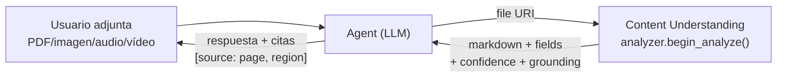
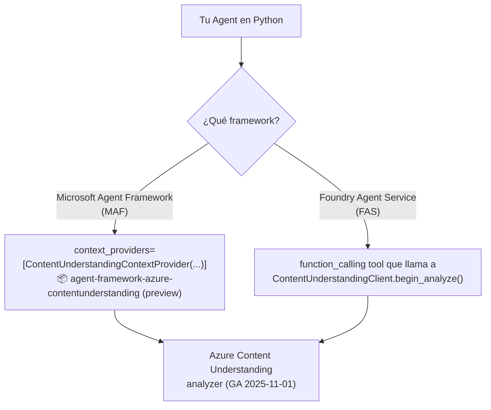
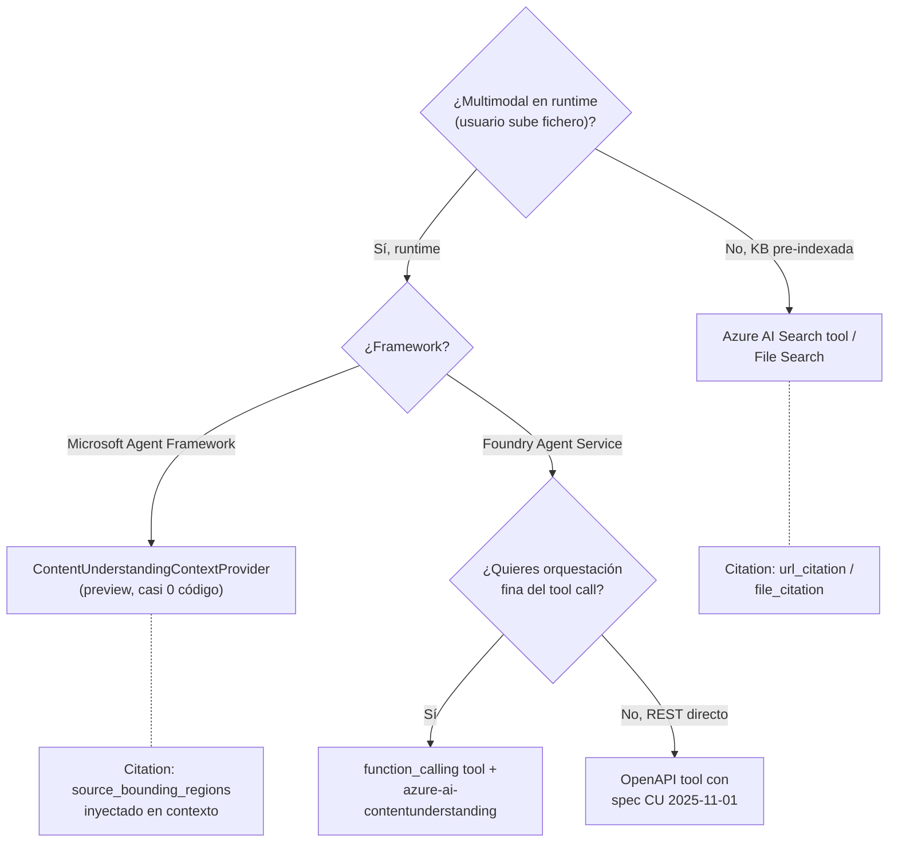

# Content Understanding como herramienta de un agent (multimodal grounding)

> [!abstract] TL;DR
> **Azure Content Understanding (CU)** convierte PDFs, imágenes, audio y vídeo en **JSON estructurado + markdown + confidence + source grounding**, lo que lo hace ideal como herramienta de un agent que recibe ficheros en runtime. **Pero hay un matiz crítico que el examen evalúa**: CU **NO está listado como built-in tool** del Foundry Agent Service (no existe `ContentUnderstandingTool` en `azure.ai.projects.models`). La integración se hace por **dos vías oficiales y vigentes (2026-05)**: (1) **Microsoft Agent Framework** con el paquete preview `agent-framework-azure-contentunderstanding` que aporta `ContentUnderstandingContextProvider`; (2) Foundry Agent Service envolviendo CU como **custom function** (`function_calling`) o como **OpenAPI tool**. La API GA es `2025-11-01`, SDK Python `azure-ai-contentunderstanding`, cliente `ContentUnderstandingClient.begin_analyze(...)`, input **solo por URL** (no upload directo).

## 🎯 Relevancia en el examen

- Frecuencia: 🔥🔥 — el sub-punto del temario AI-103 enumera **"content understanding"** como uno de los tipos de tool a integrar.
- Tipos de pregunta:
  - **Distinguir integración correcta**: te enseñan código con `ContentUnderstandingTool(...)` importado de `azure.ai.projects.models` → **trampa**, no existe.
  - **Escoger vía**: "Quieres que un agent procese vídeos adjuntos en runtime con la mínima cantidad de pegamento" → Agent Framework + `ContentUnderstandingContextProvider`.
  - **RBAC del MI**: rol `Cognitive Services User` sobre la cuenta del **Foundry resource** (CU vive dentro).
  - **Límite numérico**: 300 páginas (Standard) / 150 páginas (Pro, solo documentos PDF/TIFF/imagen, ≤100 MB).
  - **API version GA**: `2025-11-01`.
  - **Input mode**: la API `begin_analyze` acepta URL (Blob, S3 presigned, HTTPS); para upload directo de vídeo se usa el endpoint `analyzeBinary` (≤200 MB, ≤30 min).
  - **Standard vs Pro**: Pro = razonamiento + multi-document + external knowledge, **solo documentos**.

## 📖 Concepto en profundidad

### Por qué tiene sentido CU como tool de agent



CU es el **pre-procesador multimodal** del agent: transforma "bytes ininteligibles para un LLM" en **texto + JSON con esquema y citas verificables**. Sin CU, el agent o bien limita el input a texto, o bien tiene que llamar varios servicios sueltos (Document Intelligence, Speech, AI Vision) y pegar resultados.

### Modelo conceptual (4 modalidades · 1 API)

| Modalidad | Input típico | Salida útil al agent | Analyzer prebuilt clave |
|---|---|---|---|
| **Document** | PDF, TIFF, imagen, Office, TXT | Markdown estructurado + tabla + campos extract/classify/generate + **confidence** + **source bounding regions** | `prebuilt-documentSearch`, `prebuilt-invoice`, `prebuilt-idDocument`, `prebuilt-layout`, `prebuilt-read`, `prebuilt-layoutWithFigures` |
| **Image** | JPG, PNG, BMP, HEIF | Descripción generativa + campos sobre el contenido visual | `prebuilt-imageSearch` |
| **Audio** | WAV, MP3, OGG, FLAC, … | Transcripción + diarización + sentiment + topics | `prebuilt-audioSearch` |
| **Video** | MP4, M4V, MOV, AVI, MKV | Transcripción + escenas + segmentos + frame sampling (~1 fps) | `prebuilt-videoSearch` |

Verbatim Microsoft Learn: *"It uses generative AI to process and ingest many types of content, including documents, images, videos, and audio, into a user-defined output format."*

### Cómo se invoca CU desde un agent: las DOS vías oficiales



> [!warning] La trampa nº 1 del examen
> **No existe** una clase `ContentUnderstandingTool` en `azure.ai.projects.models`. La página *Agent tools overview for Microsoft Foundry Agent Service* (`tool-catalog.md`) **NO incluye Content Understanding** en la lista de built-in tools (Web search, Code Interpreter, File Search, AI Search, Azure Functions, Function calling, Image Gen, Browser Automation, Computer Use, Fabric, SharePoint, MCP, OpenAPI, A2A, Toolbox). Si una pregunta muestra `from azure.ai.projects.models import ContentUnderstandingTool` → **es código incorrecto**.

## 🏗️ Cómo se hace

### Vía A — Microsoft Agent Framework (recomendado · multimodal nativo)

> Disponible en **preview** desde abril 2026. Inyecta los resultados de CU automáticamente en el contexto del LLM cuando el usuario adjunta ficheros al mensaje.

```bash
pip install agent-framework-azure-contentunderstanding --pre
```

```python
import asyncio
from agent_framework import Agent, AgentSession, Message, Content
from agent_framework.foundry import FoundryChatClient, ContentUnderstandingContextProvider
from azure.identity import AzureCliCredential

credential = AzureCliCredential()

# 1) Provider que conecta con la cuenta CU (Foundry resource)
cu = ContentUnderstandingContextProvider(
    endpoint="https://my-foundry.cognitiveservices.azure.com/",
    credential=credential,
    max_wait=None,  # espera ilimitada del polling LRO
)

# 2) Chat client apuntando al project Foundry
client = FoundryChatClient(
    project_endpoint="https://your-project.services.ai.azure.com",
    model="gpt-4.1",
    credential=credential,
)

async def main():
    async with cu:
        agent = Agent(
            client=client,
            name="DocumentQA",
            instructions=(
                "You are a document analyst. When a file is attached, the "
                "Content Understanding context provider will inject its "
                "structured analysis. Always cite the source page or region "
                "in your answer."
            ),
            context_providers=[cu],   # <-- aquí se enchufa CU
        )
        session = AgentSession()
        response = await agent.run(
            Message(role="user", contents=[
                Content.from_text("¿Cuál es el importe total y el vendor?"),
                Content.from_uri(
                    "https://contoso.blob.core.windows.net/inv/invoice.pdf",
                    media_type="application/pdf",
                ),
            ]),
            session=session,
        )
        print(response.text)

asyncio.run(main())
```

Lo que hace el provider bajo el capó:

1. Detecta `Content.from_uri(...)` con `media_type` reconocido.
2. Llama a `ContentUnderstandingClient.begin_analyze(analyzer_id, inputs=[{"url": ...}])`.
3. Espera el LRO, formatea el resultado (markdown + YAML frontmatter con campos + grounding).
4. Inyecta ese bloque en el contexto del LLM antes de la generación.

### Vía B — Foundry Agent Service con CU envuelto en una function

Como CU **no es built-in**, lo expones como **custom function** (`function_calling`). El agent decide cuándo llamarla.

```python
from azure.identity import DefaultAzureCredential
from azure.ai.projects import AIProjectClient
from azure.ai.projects.models import (
    PromptAgentDefinition,
    FunctionTool,            # built-in tool: function_calling
    FunctionDefinition,
)
from azure.ai.contentunderstanding import ContentUnderstandingClient
from azure.ai.contentunderstanding.models import AnalysisInput

PROJECT_ENDPOINT = "https://<proj>.services.ai.azure.com/api/projects/<proj-name>"
CU_ENDPOINT      = "https://<foundry-res>.cognitiveservices.azure.com/"

credential = DefaultAzureCredential()
project = AIProjectClient(endpoint=PROJECT_ENDPOINT, credential=credential)
cu_client = ContentUnderstandingClient(endpoint=CU_ENDPOINT, credential=credential)

# 1) Schema de la función que el agent puede invocar
analyze_doc_def = FunctionDefinition(
    name="analyze_document",
    description=(
        "Extract structured fields, markdown, confidence scores and source "
        "grounding from a document URL using Azure Content Understanding. "
        "Use this whenever the user references a file URL (PDF, image, audio, video)."
    ),
    parameters={
        "type": "object",
        "properties": {
            "file_url":   {"type": "string", "description": "HTTPS URL to the document."},
            "analyzer_id":{"type": "string", "description": "Pre-created analyzer id (e.g. 'prebuilt-invoice')."},
        },
        "required": ["file_url", "analyzer_id"],
    },
)

# 2) Definir el agent con function calling
agent = project.agents.create_version(
    agent_name="doc-processor",
    definition=PromptAgentDefinition(
        model="gpt-4.1",
        instructions=(
            "Whenever the user provides a file URL, call analyze_document with "
            "an appropriate analyzer (prebuilt-invoice for invoices, prebuilt-idDocument "
            "for IDs, prebuilt-videoSearch for video, prebuilt-audioSearch for audio). "
            "Cite source pages/regions from the result."
        ),
        tools=[FunctionTool(functions=[analyze_doc_def])],
    ),
)

# 3) Ejecutor local de la función (tu app la corre cuando el agent la pide)
def analyze_document(file_url: str, analyzer_id: str) -> dict:
    poller = cu_client.begin_analyze(
        analyzer_id=analyzer_id,
        inputs=[AnalysisInput(url=file_url)],
    )
    result = poller.result()
    return {
        "markdown": result.contents[0].markdown,
        "fields":   result.contents[0].fields,
        # source grounding viene en cada field: .sourceBoundingRegions
    }

# El bucle de invocación tool_call → ejecutar → return se gestiona en tu loop
# (run.required_action / submit_tool_outputs en la Responses/Assistants API).
```

> [!tip] Alternativa: **OpenAPI tool**
> Si prefieres no escribir el ejecutor en Python, puedes exponer CU como **OpenAPI 3.0/3.1** (el `swagger.json` oficial está publicado en `learn.microsoft.com/en-us/rest/api/contentunderstanding`) y registrarlo como `OpenApiTool(...)` con `OpenApiAnonymousAuthDetails` o auth por managed identity. El agent llamará al REST `POST {endpoint}/contentunderstanding/analyzers/{analyzer-id}:analyze?api-version=2025-11-01` directamente.

### Llamada REST raw (referencia útil para examen)

```http
POST {endpoint}/contentunderstanding/analyzers/{analyzer-id}:analyze?api-version=2025-11-01
Authorization: Bearer <AAD token>
Content-Type: application/json

{ "url": "https://contoso.blob.core.windows.net/inv/invoice.pdf" }
```

Respuesta inmediata: `Operation-Location` header → polling con:

```http
GET {endpoint}/contentunderstanding/analyzerResults/{request-id}?api-version=2025-11-01
```

### Auth y RBAC del agent → CU

El agent corre con su **managed identity** (MI) o con el MI del project. Para que pueda llamar a CU:

| Recurso destino | Rol RBAC mínimo | Notas |
|---|---|---|
| `Microsoft.CognitiveServices/accounts` con `kind=AIServices` (Foundry resource que aloja CU) | **Cognitive Services User** | Permite invocar `analyze` con AAD. |
| Blob donde vive el fichero | **Storage Blob Data Reader** | Solo si CU usa la MI del caller para acceder al blob (Bring Your Own Storage). En el modo simple basta con SAS URL. |

> [!warning] CU vive **dentro** del Foundry resource (`kind=AIServices`) — no es un recurso separado salvo que crees una cuenta `kind=ContentUnderstanding` aparte. El rol va sobre la **cuenta correcta**.

## 📊 Tablas comparativas / cuándo usar qué

### Decision tree



### File Search vs Content Understanding (clásica trampa de examen)

| Eje | **File Search** | **Content Understanding** |
|---|---|---|
| Ingesta | Pre-ingestada en vector store del agent | Runtime, por fichero |
| Modalidades | Texto extraído (PDF→texto plano + chunks) | **Documento + imagen + audio + vídeo** |
| Output | Trozos relevantes + `file_citation` | **Markdown + fields + confidence + grounding** |
| Razonamiento sobre estructura | Limitado (chunks) | Conserva tablas, layout, escenas |
| Coste | Storage + embeddings + retrieval | Por página / minuto + tokens del LLM CU |
| Built-in en FAS | ✅ `FileSearchTool` | ❌ (custom function / Agent Framework) |
| Mejor para | KB grande estática | Procesar fichero adjunto del usuario |

> [!tip] Patrón combinado
> Pipeline: **CU extrae** runtime → app indexa el markdown en **AI Search** → futuras queries vía `AzureAISearchTool`. Lo mejor de ambos mundos.

### Standard vs Pro (clave del examen)

| Característica | Standard | Pro |
|---|---|---|
| Modalidades soportadas | document, image, audio, video | **solo document** (PDF, TIFF, imagen) |
| Max input size | 200 MB | **100 MB** |
| Max páginas | 300 | **150** |
| Razonamiento multi-step | No | **Sí (reasoning + multi-doc + external knowledge)** |
| API version | `2025-11-01` (GA) | `2025-05-01-preview` (preview) |
| Caso | Extract + Classify + Generate normal | Validar consistencia entre N documentos, enriquecer con KB |

### Cuotas y límites cuantitativos (verbatim service-limits)

| Propiedad | Límite |
|---|---|
| Analyzers por cuenta | **100 000** |
| Operaciones/min | **3 000** |
| Análisis/min (S0) | **1 000 páginas o imágenes** · **4 h audio** · **4 h vídeo** |
| Documento PDF/imagen file size | ≤ **200 MB** |
| Documento PDF/imagen páginas | ≤ **300** |
| Office (docx/xlsx/pptx) | ≤ 200 MB · ≤ 1 M caracteres |
| Texto plano (.txt/.html/.md/.eml/.msg/.xml/.rtf) | ≤ **1 MB** · ≤ 1 M caracteres |
| Audio (.wav, .mp3, .mp4, .opus, .ogg, .flac, .wma, .aac, .webm, .m4a) | ≤ **300 MB / 2 h** óptimo · soporta hasta **1 GB / 4 h** |
| Vídeo **analyzeBinary** (upload directo) | ≤ **200 MB · 30 min** |
| Vídeo **analyze** por URL | ≤ **4 GB · 2 h** |
| Vídeo resolución | min 320×240, max 1920×1080 (frames escalados a 512×512) |
| Image | 50×50 a 10 000×10 000 px · ≤ 200 MB |
| Fields per analyzer | 1 000 |
| Classify categories | 300 |
| Analyzer ID | 1-64 chars, `[a-zA-Z0-9._]` |

### Citation y provenance — cómo el agent cita

CU devuelve por cada field:

```json
{
  "fields": {
    "InvoiceTotal": {
      "type": "number",
      "value": 1250.00,
      "confidence": 0.987,
      "sourceBoundingRegions": [
        {"pageNumber": 1, "polygon": [x1, y1, x2, y2, x3, y3, x4, y4]}
      ]
    }
  },
  "markdown": "# Invoice INV-123\n| Item | Qty | Price |\n| ... |"
}
```

El **agent debe** (vía `instructions`) citar así:

```
The invoice total is $1,250.00 (confidence 0.99) [source: invoice.pdf, page 1].
Vendor: Acme Corp [source: invoice.pdf, page 1].
```

Habilitar grounding requiere `estimateFieldSourceAndConfidence` en el schema del analyzer (**solo documentos**).

## 🪤 Trampas del examen

1. ❌ **`ContentUnderstandingTool` NO existe** en `azure.ai.projects.models`. Cualquier snippet que lo importe es trampa. CU se integra como **function_calling** o vía **Microsoft Agent Framework** (`ContentUnderstandingContextProvider`).
2. ⚠️ **`agent-framework-azure-contentunderstanding` está en preview** (abril 2026) — instalación con flag `--pre`. Producción crítica → vía `function_calling` con el SDK GA `azure-ai-contentunderstanding`.
3. ⚠️ **Pro mode SOLO acepta documentos** (PDF, TIFF, imagen). Si la pregunta menciona vídeo o audio con Pro → trampa, **fuerza Standard**.
4. ⚠️ **Páginas Pro = 150**, no 300. **Tamaño Pro = 100 MB**, no 200 MB.
5. ⚠️ **`begin_analyze` solo acepta URL** (`AnalysisInput(url=...)`). Para upload **binario directo** se usa el endpoint **`analyzeBinary`** (≤200 MB, ≤30 min de vídeo). No existe parámetro `file=` en el cliente Python.
6. ⚠️ **API version GA = `2025-11-01`**. `2024-12-01-preview` y `2025-05-01-preview` se retiran el **15 de julio de 2026**.
7. ⚠️ **Confidence scores y grounding** se devuelven **solo para documentos**, y deben habilitarse con `estimateFieldSourceAndConfidence`. Para image/audio/video **no hay** confidence per field.
8. ⚠️ **Analyzer pre-creado obligatorio**. Crear un analyzer custom en runtime tiene latencia alta y consume cuota — los analyzers se crean **una vez** y se reutilizan. Prebuilt analyzers (`prebuilt-invoice`, `prebuilt-idDocument`, `prebuilt-layout`, `prebuilt-documentSearch`, `prebuilt-videoSearch`, `prebuilt-audioSearch`, `prebuilt-imageSearch`, `prebuilt-read`, `prebuilt-layoutWithFigures`) están siempre disponibles.
9. ⚠️ **RBAC**: el rol es **`Cognitive Services User`** sobre la **Foundry resource** (`kind=AIServices`) — no "Content Understanding Reader" (no existe). Si la pregunta dice "Reader" sobre el Foundry resource → faltan permisos para invocar `analyze`.
10. ⚠️ **Pricing CU es independiente del agent**: el agent paga sus tokens al LLM **y además** CU factura por página/imagen/minuto + contextualization tokens + tokens del LLM que CU usa internamente (BYO Foundry model).
11. ⚠️ **Vídeo frame sampling ~1 fps + escalado a 512×512** → CU puede perder eventos breves y detalles pequeños. Trampa: "¿por qué el agent no detecta el flash de la cámara de 0.3s?".
12. ⚠️ **No hay cache built-in**. Si el mismo fichero se analiza N veces, paga N veces. Implementa cache en tu app (clave = hash del fichero + analyzer_id).
13. ⚠️ **Managed capacity para modelos generativos preview se retiró** en GA. Siempre BYO Foundry model deployment (Global/DataZone/Regional, PAYG o PTU).
14. ⚠️ **Classifier API standalone está deprecated**. Clasificación ahora dentro del analyzer vía `contentCategories`.
15. ⚠️ **OpenAPI tool en FAS** requiere que el spec incluya `securitySchemes` para auth distinta de anonymous. Si vas por OpenAPI con MI, configura `OpenApiManagedIdentityAuthDetails` (no anonymous).

## 🧠 Mnemotecnia

- **"CU es el traductor multimodal del agent"**: bytes → markdown + JSON.
- **DIVA** = **D**ocument · **I**mage · **V**ideo · **A**udio (las 4 modalidades).
- **"GA = once-eleven"**: API version `2025-11-01`.
- **"100/150 vs 200/300"**: Pro = 100 MB / 150 páginas; Standard = 200 MB / 300 páginas.
- **"3000/1000/4h"**: 3000 ops/min, 1000 pages/min, 4h audio o vídeo/min.
- **"Provider, no Tool"**: en MAF es `ContentUnderstandingContextProvider`, no `Tool`.
- **"URL or analyzeBinary"**: `begin_analyze` acepta URL; para subir bytes vas a `analyzeBinary`.
- **"User role for the user-facing API"**: el rol del MI es `Cognitive Services User`.

## 🔗 Conceptos relacionados

- [[extract-content-understanding-overview]] — CU desde la óptica de E.2 (extracción).
- [[extract-content-understanding-analyzers]] — schemas, prebuilt vs custom, lifecycle.
- [[extract-content-understanding-multimodal]] — detalle por modalidad (doc/image/audio/video).
- [[extract-grounded-rag-output]] — usar el markdown CU como ground truth de un RAG.
- [[agents-tools-search-integration]] — combinar CU con AI Search en pipeline.
- [[agents-tools-knowledge-stores]] — taxonomía completa de knowledge tools.
- [[agents-microsoft-foundry-agent-service]] — el host donde se registra el agent.
- [[agents-microsoft-agent-framework]] — el SDK que aporta `ContentUnderstandingContextProvider`.
- [[agents-foundry-service-vs-framework]] — cuándo elegir FAS vs MAF.
- [[agents-tools-custom-functions]] — patrón `function_calling` que se usa en la Vía B.
- [[agents-tool-schemas]] — cómo se define el JSON schema de la function.
- [[00-foundry-tools-catalog]] — catálogo de built-in tools (donde CU **no aparece**).

## ❓ Autotest

**1.** Un compañero te enseña este snippet para añadir Content Understanding a un agent del Foundry Agent Service. ¿Cuál es el problema?

```python
from azure.ai.projects.models import PromptAgentDefinition, ContentUnderstandingTool
agent_def = PromptAgentDefinition(
    model="gpt-4.1",
    instructions="...",
    tools=[ContentUnderstandingTool(analyzer_id="prebuilt-invoice")],
)
```

- a) Falta el parámetro `endpoint`.
- b) `ContentUnderstandingTool` no existe en `azure.ai.projects.models`; CU no es built-in.
- c) El modelo `gpt-4.1` no es compatible con CU.
- d) `analyzer_id` debe llamarse `analyzer_name`.

<details><summary>Respuesta</summary>

**b)**. La lista de built-in tools de Foundry Agent Service (verificada en `tool-catalog.md`) no incluye Content Understanding. Las integraciones oficiales son: (1) Microsoft Agent Framework con `ContentUnderstandingContextProvider` (paquete `agent-framework-azure-contentunderstanding`), o (2) FAS envolviendo CU como `function_calling` u `OpenApiTool`.
</details>

**2.** Un cliente quiere que su agent procese **vídeos de hasta 1 hora** subidos por usuarios y razone sobre el contenido. ¿Qué modo y qué método elige?

- a) Pro mode con `analyzeBinary`.
- b) Standard mode con `begin_analyze` y URL al blob.
- c) Standard mode con `analyzeBinary`.
- d) Pro mode con `begin_analyze` y URL al blob.

<details><summary>Respuesta</summary>

**b)**. Pro mode **solo soporta documentos** (PDF/TIFF/imagen), no vídeo. `analyzeBinary` está limitado a **200 MB / 30 min**, insuficiente para 1 h. La opción correcta es **Standard mode** con `begin_analyze` apuntando a la URL del blob (límites: 4 GB / 2 h).
</details>

**3.** Estás integrando CU como tool del agent vía `function_calling`. El agent corre con managed identity. ¿Qué rol y sobre qué recurso?

- a) `Storage Blob Data Reader` sobre el Foundry resource.
- b) `Cognitive Services User` sobre el Foundry resource (`kind=AIServices`).
- c) `Content Understanding Reader` sobre la cuenta CU.
- d) `Cognitive Services Contributor` sobre la subscription.

<details><summary>Respuesta</summary>

**b)**. CU vive dentro del Foundry resource (`kind=AIServices`). El rol mínimo para invocar `analyze` con AAD es **`Cognitive Services User`**. "Content Understanding Reader" **no existe**. "Contributor" es excesivo (data-plane no plane). Storage Blob Reader se necesita solo si CU debe leer el blob con la MI del caller.
</details>

**4.** Quieres habilitar **confidence scores y source grounding** para todos los campos extraídos de una factura. ¿Qué configuración necesitas?

- a) Activar Pro mode.
- b) Setear `estimateFieldSourceAndConfidence=true` en el analyzer (solo válido para documentos).
- c) Usar el analyzer `prebuilt-grounded-search`.
- d) Activar `enableSegment=true`.

<details><summary>Respuesta</summary>

**b)**. La propiedad `estimateFieldSourceAndConfidence` del analyzer habilita ambos. Confidence y grounding **solo se devuelven para la modalidad documento**. `enableSegment` controla segmentación, no grounding. `prebuilt-grounded-search` no existe.
</details>

**5.** ¿Cuál es la API version **GA** vigente de Content Understanding y cuándo se retiran las preview?

- a) `2024-12-01-preview` permanece como GA.
- b) `2025-05-01-preview` es GA; las anteriores se retiran en enero 2027.
- c) GA = `2025-11-01`; las preview `2024-12-01-preview` y `2025-05-01-preview` se retiran el **15 de julio de 2026**.
- d) GA = `2026-03-01`; preview siguen indefinidamente.

<details><summary>Respuesta</summary>

**c)**. Verificado en `whats-new.md` y `service-limits.md`: GA con `2025-11-01`, retirement de previews el 15-jul-2026.
</details>

## ✅ Control de calidad (auto-rúbrica)

| Dimensión | Nota |
|---|---|
| Completitud | **9.5** — cubre las 2 vías de integración (MAF + FAS), 4 modalidades, RBAC, límites, Standard vs Pro, citation, decision tree y trampas. |
| Exactitud técnica | **9.5** — cada nombre (clases, paquetes, API versions, límites numéricos, roles) verificado contra Microsoft Learn 2026-05 y GitHub `microsoft/agent-framework`. Trampa nº 1 documentada con fuente verbatim del tool-catalog. |
| Alineación al examen | **9** — refleja el sub-punto del temario (B.2) y las trampas reales: built-in vs custom, Pro=documentos-solo, URL vs analyzeBinary, RBAC exacto. |
| Claridad pedagógica | **9** — TL;DR denso pero claro, decision tree mermaid, tabla comparativa CU vs File Search, 5 autotests con explicación. |

*Verificado a fecha 2026-05-23 contra Microsoft Learn (`learn.microsoft.com/en-us/azure/ai-services/content-understanding/*` y `learn.microsoft.com/en-us/azure/foundry/agents/concepts/tool-catalog`), PyPI (`azure-ai-contentunderstanding`, `agent-framework-azure-contentunderstanding`) y `github.com/microsoft/agent-framework`.*
