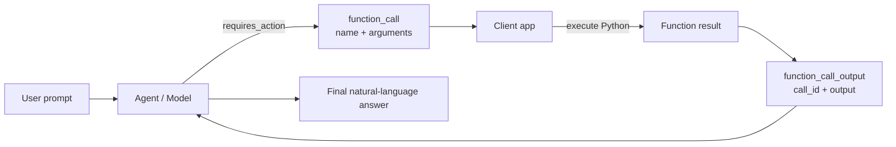
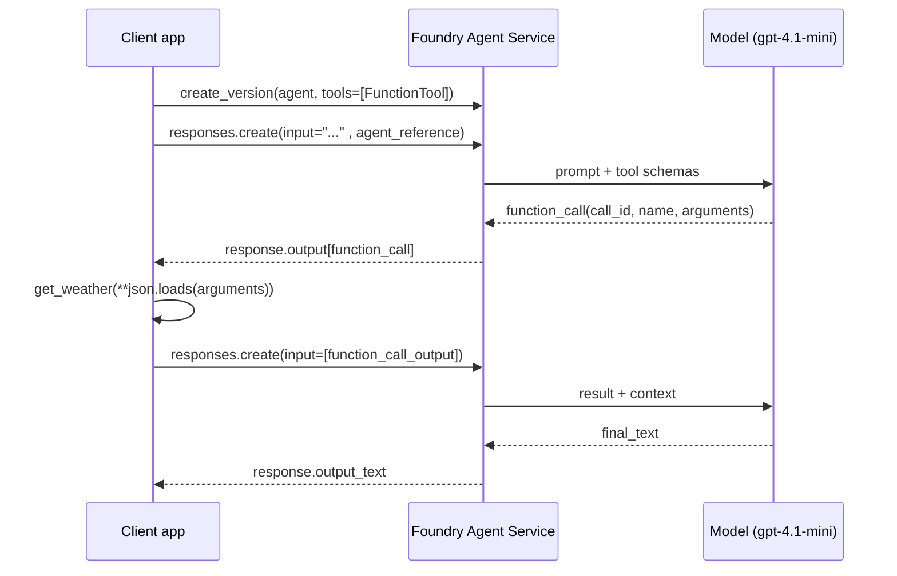
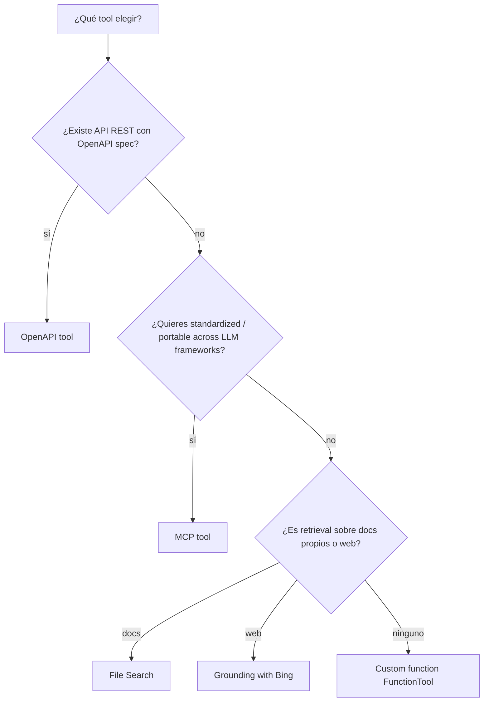

# Custom functions — el escape hatch programable de los agents

> [!abstract] TL;DR
> Una **custom function** es código **Python que tú escribes** y registras como tool de un agent. El modelo decide cuándo llamarla, devuelve un **`function_call`** con argumentos JSON, **tu app la ejecuta client-side**, y le devuelves el resultado como **`function_call_output`** para que componga la respuesta final. En **Foundry Agent Service** se define con la clase `FunctionTool` (paquete `azure-ai-projects`) pasando un **JSON Schema** explícito y se procesa con un **execution loop** que itera sobre `response.output`. En **Microsoft Agent Framework** (paquete `agent-framework`) el schema se **deriva automáticamente** de type hints + docstring; basta con pasar la función al parámetro `tools=[...]` del agent. Diferencias críticas: built-in tools (File Search, Bing) corren **server-side**; las custom functions corren **client-side** y el dev es responsable de la ejecución, retries, errores y del **10-minute run expiration**.

## 🎯 Relevancia en el examen

Frecuencia: **🔥🔥🔥 muy alta**. El sub-punto AI-103 *"Integrate agent tools, including APIs, knowledge stores, search, content understanding, and custom functions"* lo cita verbatim. Es el tool **más preguntado** en B.2.

| Tipo de pregunta | Escenario típico |
|---|---|
| Code completion | Rellenar el execution loop: detectar `function_call`, ejecutar, enviar `function_call_output` |
| Class identification | `FunctionTool` (Foundry Agent Service) vs `@ai_function` (Agent Framework) |
| Best-fit | Custom function vs OpenAPI tool vs MCP vs built-in (File Search/Bing) |
| Schema | Strict mode (`strict: true`) requirements (`additionalProperties: false`, todos en `required`) |
| Trampa | Run timeout 10 min — devolver tool outputs antes |
| Trampa | Errores: **return** error en output, NO `raise` |
| Trampa | Portal Foundry muestra agents pero **no ejecuta** custom functions |
| Trampa | `tool_choice` valores (`auto` / `required` / `none` / `{"type":"function","function":{"name":"X"}}`) |
| Security | Tool args y outputs son **untrusted input** — validar siempre |

## 📖 Concepto en profundidad

### 1. ¿Qué es una custom function?

Una **custom function** (también llamada *function tool*) es:

- Una función **Python** definida por el desarrollador.
- Cuyo schema (name + description + parameters) se **registra** con el agent.
- Que el LLM puede **decidir invocar** durante un run.
- Cuya **ejecución ocurre client-side** en tu proceso/servicio (no en el servicio Foundry).
- Cuyo resultado se **devuelve al agent** para que continúe la conversación.



### 2. Custom function vs otros tools

| Tool type | Ejecución | Maintained by | Use case |
|---|---|---|---|
| **Custom function (`FunctionTool`)** | **Client-side** (tu código) | Tú | Business logic propia, integraciones internas, ML models propios |
| **OpenAPI tool** | Service-side (Foundry llama HTTP) | Tú (spec) + Foundry | API REST existente con OpenAPI 3.0 spec |
| **MCP tool** | MCP server (remote o local) | Tú o terceros | Tools estandarizados portables |
| **File Search / Bing / Azure AI Search** | Service-side | Microsoft | Knowledge retrieval, grounding |
| **Code Interpreter** | Service-side sandbox | Microsoft | Ejecutar código Python generado |

> [!warning] La diferencia clave
> Custom functions = **tú ejecutas el código**. El service solo coordina. Por eso eres responsable del **error handling**, del **timeout** y del **submit_tool_outputs antes de 10 minutos**.

### 3. Anatomía del flujo (Foundry Agent Service, Responses API)



Cinco pasos en doc oficial:

1. **Define function tools** — describe `name`, `parameters`, `description`.
2. **Create an agent** — registra la function definition en el agent.
3. **Send a prompt** — el agent analiza y genera `function_call` si lo necesita.
4. **Execute and return** — tu app ejecuta y devuelve `function_call_output`.
5. **Get the final response** — el agent compone la respuesta natural-language.

### 4. JSON Schema del parameters (cinco campos clave)

```jsonc
{
  "type": "object",
  "properties": {
    "city":  { "type": "string", "description": "City name, e.g., Madrid" },
    "unit":  { "type": "string", "enum": ["celsius", "fahrenheit"] }
  },
  "required": ["city"],
  "additionalProperties": false
}
```

| Campo | Obligatorio | Comentario |
|---|---|---|
| `type: "object"` | sí | El root siempre object |
| `properties` | sí | Map de parámetros |
| `required` | recomendado | Si `strict: true`, **todos** deben estar en `required` |
| `additionalProperties` | en strict, debe ser `false` | Bloquea props extra |
| `enum` / `description` | opcional | Mejora tool selection y validación |

> [!tip] Reglas del strict mode (`strict: true`)
> - `additionalProperties: false` **obligatorio**.
> - Todas las properties **deben estar en `required`** (no opcionales). Para "opcional" usa `["type", "null"]`.
> - Solo un subset de JSON Schema soportado.
> - Pro: garantiza compliance del output → no más argumentos malformados.

## 🏗️ Cómo se hace

### 5. Foundry Agent Service con `FunctionTool` (SDK Python `azure-ai-projects`)

#### Patrón verificado (doc oficial, 2026-04-30)

```python
import json
from azure.ai.projects import AIProjectClient
from azure.ai.projects.models import (
    PromptAgentDefinition,
    Tool,
    FunctionTool,
)
from azure.identity import DefaultAzureCredential
from openai.types.responses.response_input_param import (
    FunctionCallOutput,
    ResponseInputParam,
)

# 1. Define your Python function (client-side)
def get_horoscope(sign: str) -> str:
    """Generate a horoscope for the given astrological sign."""
    return f"{sign}: Next Tuesday you will befriend a baby otter."

# 2. Connect to the project
PROJECT_ENDPOINT = "https://<resource>.ai.azure.com/api/projects/<project>"
project = AIProjectClient(
    endpoint=PROJECT_ENDPOINT,
    credential=DefaultAzureCredential(),
)
openai = project.get_openai_client()

# 3. Create a multi-turn conversation
conversation = openai.conversations.create()

# 4. Define the FunctionTool schema (JSON Schema for parameters)
func_tool = FunctionTool(
    name="get_horoscope",
    parameters={
        "type": "object",
        "properties": {
            "sign": {
                "type": "string",
                "description": "An astrological sign like Taurus or Aquarius",
            },
        },
        "required": ["sign"],
        "additionalProperties": False,
    },
    description="Get today's horoscope for an astrological sign.",
    strict=True,
)
tools: list[Tool] = [func_tool]

# 5. Create the agent version with the tool registered
agent = project.agents.create_version(
    agent_name="MyAgent",
    definition=PromptAgentDefinition(
        model="gpt-4.1-mini",
        instructions="You are a helpful assistant that can use function tools.",
        tools=tools,
    ),
)

# 6. First response — model may emit a function_call
response = openai.responses.create(
    input="What is my horoscope? I am an Aquarius.",
    conversation=conversation.id,
    extra_body={"agent_reference": {"name": agent.name, "type": "agent_reference"}},
)

# 7. Execution loop — handle function_call items
input_list: ResponseInputParam = []
for item in response.output:
    if item.type == "function_call" and item.name == "get_horoscope":
        result = get_horoscope(**json.loads(item.arguments))
        input_list.append(
            FunctionCallOutput(
                type="function_call_output",
                call_id=item.call_id,
                output=json.dumps({"horoscope": result}),
            )
        )

# 8. Submit tool outputs and obtain the final natural-language answer
final = openai.responses.create(
    input=input_list,
    conversation=conversation.id,
    extra_body={"agent_reference": {"name": agent.name, "type": "agent_reference"}},
)
print(final.output_text)

# 9. Cleanup
project.agents.delete_version(agent_name=agent.name, agent_version=agent.version)
openai.conversations.delete(conversation_id=conversation.id)
```

> [!warning] Recuerda los nombres exactos
> - Paquete pip: **`azure-ai-projects`** (latest).
> - Clase principal: **`AIProjectClient`**.
> - Tool wrapper: **`FunctionTool`** (en `azure.ai.projects.models`).
> - Definition wrapper: **`PromptAgentDefinition`**.
> - Output wrapper: **`FunctionCallOutput`** desde `openai.types.responses.response_input_param`.
> - Method de creación: **`project.agents.create_version(...)`** (no `agents.create_agent`).

### 6. Microsoft Agent Framework — schema auto-derivado

#### Paquete pip

```bash
pip install agent-framework
```

#### Patrón con función decorada y registro automático ⚠️

> [!warning] ⚠️ Nota de versión
> La API pública del SDK Python de Agent Framework ha evolucionado rápidamente desde 2026-02. El patrón verificado oficial en *Step 1: Your First Agent* expone la clase **`Agent`** (no `ChatAgent`) y la integración Foundry vía **`FoundryChatClient`**. Para custom functions, el patrón canónico consiste en pasar **funciones Python con type hints + docstrings** al parámetro `tools=[...]` del agent. El decorator `@ai_function` se documenta como mecanismo opcional para añadir metadata explícita (description override) y declarar parámetros con `Annotated[..., Field(description=...)]`. Si el examen pregunta por el nombre exacto del decorator, **`@ai_function`** es el más recurrente. Verifica siempre contra la versión actual del SDK porque puede cambiar.

```python
import asyncio
from typing import Annotated
from pydantic import Field
from agent_framework import ai_function          # decorator opcional
from agent_framework.foundry import FoundryChatClient
from agent_framework import Agent
from azure.identity import AzureCliCredential

# Schema se deriva auto desde signature + docstring + Annotated
@ai_function(description="Get current weather for a city")
def get_weather(
    city: Annotated[str, Field(description="City name, e.g., Madrid")],
    unit: Annotated[str, Field(description="celsius or fahrenheit")] = "celsius",
) -> str:
    """Returns a short weather report for the requested city."""
    return f"15°{unit[0].upper()}, sunny in {city}"

client = FoundryChatClient(
    project_endpoint="https://your-project.services.ai.azure.com",
    model="gpt-4.1-mini",
    credential=AzureCliCredential(),
)

agent = Agent(
    client=client,
    name="weather-bot",
    instructions="Help the user with weather queries.",
    tools=[get_weather],          # 👈 paso directo, sin schema manual
)

async def main():
    result = await agent.run("What's the weather in Madrid in fahrenheit?")
    print(result)

asyncio.run(main())
```

#### De qué deriva el schema

| Elemento Python | Mapea a campo del schema |
|---|---|
| Nombre de la función | `name` |
| `description=` en `@ai_function` (o docstring si no) | `description` |
| Type hints (`str`, `int`, `bool`, `list[X]`, `Literal[...]`, …) | `properties[*].type` y `enum` |
| `Annotated[T, Field(description=...)]` | `properties[*].description` |
| Default values (`= "celsius"`) | parámetro **no** se añade a `required` |
| `async def` vs `def` | Auto-detección por el framework |

#### Tipos soportados auto

- Primitives: `str`, `int`, `float`, `bool`.
- Collections: `list[X]`, `dict[str, X]`.
- Optional: `Optional[X]` o `X | None`.
- Enum: `Literal["a", "b", "c"]`.
- Pydantic `BaseModel` (alternativa a múltiples params: usa el model como input).

```python
from pydantic import BaseModel
from typing import Literal

class WeatherQuery(BaseModel):
    city: str
    unit: Literal["celsius", "fahrenheit"] = "celsius"
    detail_level: int = Field(ge=1, le=5, default=3)

@ai_function(description="Get weather with structured query")
def get_weather_v2(query: WeatherQuery) -> str:
    return f"{query.city}: 15° ({query.unit})"
```

### 7. Sync vs Async functions

```python
import aiohttp

@ai_function(description="Fetch product data by id")
async def fetch_data(id: str) -> dict:
    async with aiohttp.ClientSession() as session:
        async with session.get(f"https://api.example.com/data/{id}") as resp:
            return await resp.json()
```

- **Sync** (`def`): bloquea el thread mientras corre.
- **Async** (`async def`): recomendado para I/O bound (HTTP, DB).
- Agent Framework **auto-detecta**: no hay que indicar nada.
- En Foundry Agent Service tú escribes el loop, así que tú decides el modelo de ejecución.

### 8. Error handling — patrón canónico

> [!danger] La regla de oro: NO `raise` excepciones uncaught
> Si la función lanza una excepción sin capturar y tu execution loop no la maneja, el run **falla**. La best practice oficial es **devolver el error como output estructurado** para que el agent pueda razonar sobre él (re-preguntar, escalar, intentar alternativa).

```python
@ai_function(description="Look up customer by ID")
def lookup_customer(customer_id: str) -> dict:
    try:
        customer = db.query(customer_id)
        return {"status": "success", "data": customer}
    except NotFoundError:
        return {
            "status": "error",
            "code": "not_found",
            "message": f"Customer {customer_id} not found",
        }
    except Exception:
        # No leakeamos detalles internos al modelo
        return {"status": "error", "code": "internal", "message": "Internal error"}
```

### 9. Parámetros de control de calling

#### `tool_choice` (control determinista)

| Valor | Comportamiento |
|---|---|
| `"auto"` (default) | El modelo decide si llama tools |
| `"required"` | Debe llamar **al menos una** tool |
| `"none"` | No puede llamar tools |
| `{"type": "function", "function": {"name": "X"}}` | Fuerza la tool concreta `X` |

#### `parallel_tool_calls`

- Default **`true`** en la mayoría de modelos.
- `false` ⇒ tool calls secuenciales (más predictible, menor latencia variability).
- Trade-off: paralelo es más rápido si las llamadas son independientes; secuencial es necesario si la salida de una tool alimenta a la siguiente.

## 📊 Cuándo usar custom function vs alternativas



| Criterio | Custom function | OpenAPI tool | MCP tool |
|---|---|---|---|
| Ejecución | Client-side | Service-side (HTTP) | MCP server |
| Setup | Mínimo (Python + JSON Schema) | Spec OpenAPI 3.0 | MCP server endpoint |
| Portabilidad | Acoplada a tu app | Portable a otros clientes vía HTTP | Estandarizada, multi-platform |
| Cuándo brilla | Business logic propia, ML models, integraciones rápidas | API REST estable existente | Compartir tools entre múltiples agents/teams |

## 🪤 Trampas del examen

1. **`FunctionTool` (Foundry Agent Service) vs `@ai_function` (Agent Framework)**: dos APIs distintas. La pregunta suele dar un import y preguntar el siguiente paso — si ves `azure.ai.projects.models`, vas con schema manual; si ves `agent_framework`, schema auto.
2. **El portal Foundry no ejecuta custom functions**: muestra los agents y permite hacer runs, pero "**doesn't support adding, removing, or updating function definitions on an agent**" y no ejecuta el callback. Necesitas SDK o REST.
3. **Run expira a los 10 minutos**: *"Runs expire 10 minutes after creation. Submit your tool outputs before they expire."* Si tu función tarda >30 s, devuelve un status y haz polling separado, no bloquees el run.
4. **Submit_tool_outputs es obligatorio**: si recibes un `function_call` y **no** devuelves su `function_call_output` correspondiente con el mismo `call_id`, el agent se queda colgado esperando.
5. **`call_id` debe coincidir exactamente**: en el output `function_call_output` envías `call_id = item.call_id` (no `item.id`, no `item.name`).
6. **Strict mode tiene reglas**: `strict: true` ⇒ debes poner `additionalProperties: false` y **todos** los parámetros en `required`. Si quieres "opcional" en strict, usa `["type","null"]`.
7. **Error handling**: devuelve el error en el output, **no** hagas `raise` no capturado — el run falla y consumes el run sin solución.
8. **`tool_choice` valores**: memoriza los 4 (`auto`, `required`, `none`, dict con name). Trampa típica: opciones como `"forced"` o `"must"` son **inventadas**.
9. **Mutable defaults en Python** (gotcha clásico): `def f(items: list = []) -> ...` comparte el mismo objeto entre llamadas. Usa `items: list | None = None` y `items = items or []`.
10. **Tool descriptions limitadas**: function descriptions hasta **1024 chars** (heredado de Chat Completions). Igual para nombres: ≤64 chars, `[a-zA-Z0-9_-]`.
11. **Tool args y outputs = untrusted input**: doc oficial *"Treat tool arguments and tool outputs as untrusted input. Validate and sanitize values before using them."* Pregunta tipo security: nunca pasar tool output crudo a `exec`, `eval`, o SQL.
12. **No secrets en tool output**: no devolver API keys/tokens/connection strings al modelo. Solo los datos que necesita para razonar.
13. **Region + Model**: la función como tool puede no estar soportada en todas las regiones / modelos. Tablas oficiales muestran que p.ej. `brazilsouth`, `northcentralus`, `southcentralus`, `westus` marcan **Function = no**. Verifica antes de desplegar.
14. **`parallel_tool_calls=true` con strict outputs estructurados**: hay combinaciones que el modelo no soporta perfectamente; si la app necesita orden determinista, fuerza `false`.

## 🧠 Mnemotecnia

- **DEFER** para los 5 pasos del flujo: **D**efine → **E**nlist (register) → **F**ire (prompt) → **E**xecute (callback) → **R**eturn (final response).
- **SCAR** para la anatomía de schema strict: **S**trict, **C**losed (`additionalProperties: false`), **A**ll in required, **R**oot object.
- Custom function = **CCC**: **C**lient-side, **C**ode tuyo, **C**ontrol tuyo (de errores y timeout).
- **10-30-1024**: 10 min run, 30 s timeout interno recomendado, 1024 chars max description.
- **"Return errors, don't raise them"**: el agent quiere ver el error como dato, no como crash.

## 🔗 Conceptos relacionados

- [[agents-tool-schemas]] — JSON Schema, strict mode, FunctionTool en profundidad.
- [[agents-microsoft-foundry-agent-service]] — Service para construir agents con tools server-side y client-side.
- [[agents-microsoft-agent-framework]] — SDK Python para construir agents code-first con auto-schema.
- [[agents-tools-api-integration]] — Comparar custom function vs OpenAPI tool vs MCP.
- [[agents-tools-search-integration]] — File Search, Bing y AI Search como built-in tools.
- [[agents-concept-roles-goals]] — Cómo el rol/instrucción del agent influye en tool selection.
- [[agents-autonomous-workflows-safeguards]] — Guardarraíles cuando tools modifican estado.
- [[responsible-agent-oversight-controls]] — Logging, validation y user confirmation para tools con side effects.
- [[agents-foundry-service-vs-framework]] — Cuándo elegir cada uno para custom functions.

## ❓ Autotest

**1.** Tienes este código y quieres que el modelo **deba** llamar a alguna tool en cada turno. ¿Qué parámetro añades?

a) `tool_choice="auto"`
b) `tool_choice="required"`
c) `parallel_tool_calls=true`
d) `strict=True`

<details><summary>Respuesta</summary>

**b)**. `tool_choice="required"` fuerza al modelo a invocar al menos una tool. `auto` lo deja a su criterio (default), `parallel_tool_calls` regula concurrencia, y `strict` controla compliance del JSON Schema, no la obligatoriedad.

</details>

**2.** En Foundry Agent Service, después de recibir `response.output` con un item `type="function_call"`, ¿qué campo usas como referencia al enviar el resultado de vuelta?

a) `item.id`
b) `item.name`
c) `item.call_id`
d) `response.id`

<details><summary>Respuesta</summary>

**c)**. `FunctionCallOutput(call_id=item.call_id, output=...)`. `item.name` es el nombre de la función, `item.id` no se usa para correlación de tool calls, y `response.id` correlaciona conversación, no la tool call.

</details>

**3.** ¿Cuál de estas afirmaciones es **falsa** sobre `@ai_function` en Microsoft Agent Framework?

a) Deriva el JSON Schema automáticamente desde type hints.
b) Soporta funciones `async def` con auto-detección.
c) Lee descripciones de parámetros desde `Annotated[T, Field(description=...)]`.
d) Requiere declarar manualmente el bloque `parameters` con `type: "object"`.

<details><summary>Respuesta</summary>

**d)**. Es **falsa**. El punto fuerte de `@ai_function` es precisamente que **no** necesitas declarar el JSON Schema manualmente; lo deriva de la firma. La declaración manual de `parameters` es lo que se hace con `FunctionTool` en Foundry Agent Service.

</details>

**4.** Tu custom function tarda 4 minutos en completarse. ¿Cuál es la mejor práctica?

a) Aumentar el run timeout a 30 minutos.
b) Encadenar varios `submit_tool_outputs` parciales.
c) Devolver inmediatamente un status (job_id) y hacer polling separado.
d) Usar `parallel_tool_calls=false`.

<details><summary>Respuesta</summary>

**c)**. La doc oficial dice: *"For long-running operations, return a status immediately and implement polling. The 10-minute run expiration applies to total elapsed time, not individual function execution."* No se puede ampliar el run timeout (a) y los outputs parciales no existen para tool calls (b).

</details>

**5.** Configuras `strict: true` en un `FunctionTool`. ¿Cuál de estas condiciones del schema **no** es obligatoria?

a) `additionalProperties: false`
b) Todas las properties listadas en `required`
c) `type: "object"` en el root
d) Incluir `enum` en todas las properties de tipo string

<details><summary>Respuesta</summary>

**d)**. `enum` es siempre opcional. Strict mode exige `additionalProperties: false`, todas las properties en `required` y root `object`, pero no impone `enum`.

</details>

**6.** Tu función lanza `NotFoundError` cuando el customer no existe. ¿Cuál es la implementación recomendada?

a) Dejar que la excepción se propague para que el run falle ruidosamente.
b) Capturarla y devolver `{"status": "error", "message": "..."}` como output.
c) Hacer `sys.exit(1)` para evitar contaminar el estado del agent.
d) Loggear y devolver `None`.

<details><summary>Respuesta</summary>

**b)**. La best practice oficial es **devolver el error como output estructurado** para que el agent pueda razonar (re-preguntar al usuario, escalar, intentar alternativa). `None` o crash empeoran la experiencia.

</details>

## ✅ Control de calidad (auto-rúbrica)

| Dimensión | Nota | Justificación |
|---|---|---|
| Completitud | **9.5/10** | Cubre los dos SDKs, schema, execution loop, error handling, parallel/tool_choice, strict, async, pitfalls y comparación con OpenAPI/MCP/built-ins. |
| Exactitud técnica | **9.5/10** | Código `FunctionTool` verificado verbatim contra doc oficial 2026-04-30. Patrón Agent Framework marcado ⚠️ donde la API ha tenido evolución reciente. |
| Alineación al examen | **9.5/10** | Trampas reales (10-min run, portal sin ejecución, call_id correlation, tool_choice valores, strict mode rules, region/model availability). |
| Claridad pedagógica | **9/10** | Mnemónicos DEFER, SCAR, CCC; tablas comparativas; mermaid del flujo end-to-end; autotest 6 preguntas con explicación. |

*Verificado a fecha 2026-05-23 contra Microsoft Learn (Foundry Agent Service function-calling 2026-04-30, tool-best-practice 2026-05-23, Agent Framework first-agent 2026-04-02).*
