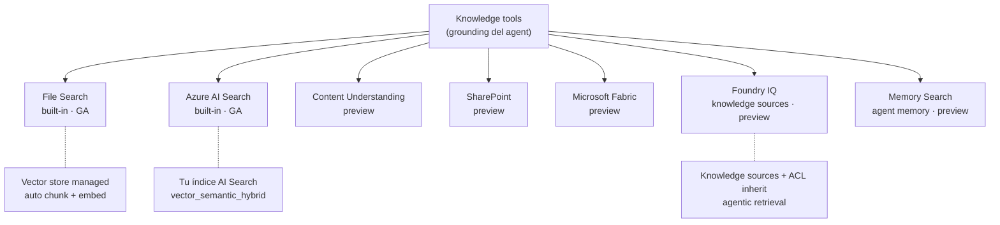
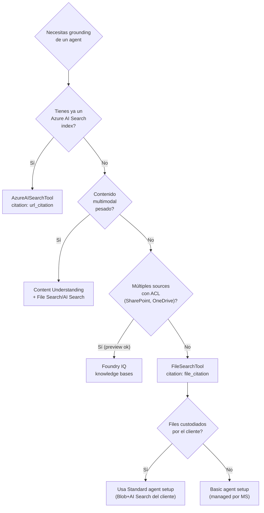

# Knowledge stores como tools del Foundry Agent Service (File Search · AI Search · CU · Foundry IQ · Memory)

> [!abstract] TL;DR
> Un **agent** del Foundry Agent Service se "documenta" conectándolo a **knowledge stores** vía herramientas. La opción **built-in y managed** es **File Search** (sube archivos → vector store auto-chunkeado y embebido). La opción **production-grade y multi-tenant** es el tool **Azure AI Search** sobre tu índice. Para multimodal pesado existe **Content Understanding**. Para una capa agentica con ACL e ingesta heterogénea aparece **Foundry IQ** (preview) y para memoria de largo plazo **Memory Search** (preview). El examen AI-103 pregunta **qué tool elegir según el escenario**, **límites exactos de File Search** y **formato de citation** que distingue cada uno.

## 🎯 Relevancia en el examen

- Frecuencia: 🔥🔥🔥 — el sub-punto del temario *"Integrate agent tools, including APIs, **knowledge stores**, search, content understanding, and custom functions"* aparece de forma directa.
- Tipos de pregunta típicos:
  - **Escenario → tool**: "Cliente quiere subir 200 PDFs internos y que el agent los cite sin desplegar AI Search → ¿qué tool?"  → File Search.
  - **Límites numéricos**: 10 000 files/store, 512 MB/file, 5 000 000 tokens/file, 1 vector store por agent, 1 por conversation, **7 días** de expiración por defecto en conversation vector stores.
  - **Defaults de chunking**: 800 / 400 / `text-embedding-3-large` (256 dims) / 20 chunks en contexto.
  - **Citation format**: `file_citation` (File Search) vs `url_citation` (Azure AI Search). Trampa clásica.
  - **Security trimming / ACL**: File Search **no** lo soporta; AI Search sí (via `filter`); Foundry IQ hereda ACL del source.
  - **Basic vs Standard agent setup**: File Search en Standard usa **tu** Azure AI Search + Blob Storage; en Basic, recursos managed por Microsoft.

## 📖 Concepto en profundidad

### Taxonomía de tools de "knowledge" en Foundry Agent Service



> [!info] Built-in vs custom
> Según el **tool catalog** oficial, File Search, Azure AI Search, Code Interpreter, Web Search, Function calling y Azure Functions son **built-in tools** (GA). MCP, OpenAPI, A2A (preview) y Toolbox (preview) son **custom tools**. SharePoint, Fabric, Browser Automation, Computer Use, Image Generation, Custom Code Interpreter son **built-in en preview**.

### File Search — el knowledge store **default**

Es la opción "five-minutes-to-RAG":

1. Subes archivos al endpoint `{project}/openai/v1/files` con `purpose="assistants"`.
2. Creas un **vector store** (`openai.vector_stores.create`) y le adjuntas los `file_ids`.
3. Foundry **auto-parsea, chunkea (800 tokens, 400 overlap), embebe (`text-embedding-3-large` truncado a 256 dims con MRL) y almacena** en una base híbrida (vector + keyword).
4. Adjuntas el `vector_store_id` al agent dentro de un `FileSearchTool`.
5. En cada query, el sistema **rewrite → parallel sub-queries → hybrid search → rerank → top-K chunks en contexto** (max 20).

#### Comportamiento por setup (importante para el examen)

| Setup | Dónde viven files | Dónde vive vector store | Código |
| --- | --- | --- | --- |
| **Basic agent setup** | Microsoft managed storage | Microsoft managed search | Idéntico |
| **Standard agent setup** | **Tu** Azure Blob Storage conectado | **Tu** Azure AI Search conectado | Idéntico |

> [!warning] Trampa: el código del SDK es idéntico, **solo cambia dónde reside la data**. Si te exigen "files in customer-owned storage", la respuesta es **Standard agent setup**, no "use Azure AI Search tool".

### Azure AI Search tool — el knowledge store **production**

Es el camino cuando ya tienes un índice indexado (a menudo construido fuera del agent, con skillsets, integrated vectorization, custom analyzers). El tool **no crea índice**; lo consume.

- Parámetros del tool: `project_connection_id`, `index_name`, `top_k` (def. 5), `query_type` (def. `vector_semantic_hybrid`; alternativas: `simple`, `vector`, `semantic`, `vector_simple_hybrid`, `vector_semantic_hybrid`), `filter` (OData, se aplica a **todas** las queries).
- Soporta **un solo índice** por tool (`The Azure AI Search tool can only target one index.`).
- Mismo tenant: AI Search y Foundry deben estar en el mismo Entra tenant.
- Citation: `url_citation` (con `url`, `title`, `start_index`, `end_index`).
- Auth: key-based o **keyless** (Entra). Si usas **Private VNet** sobre AI Search → **obligatorio keyless**.

### Content Understanding como knowledge tool

Para corpus **multimodal** (PDFs con tablas + diagramas, vídeo, audio). Reduce la dimensión extracción → estructurado antes de indexar. Cubierto en [[agents-tools-content-understanding]].

### Foundry IQ (preview) — la evolución agentica

- **Knowledge source**: connection a un origen (Blob, OneDrive, SharePoint, AI Search, web).
- **Knowledge base**: agregación de varios knowledge sources que **preserva ACL** del origen.
- **Agentic retrieval**: el modelo descompone la query, busca en paralelo y rerankea — diferente a hybrid search clásico.
- **ACL inheritance** vía Entra ID + **Purview** governance.
- Aún preview; AI-103 puede preguntarlo **conceptualmente** ("¿qué tecnología preserva los permisos del SharePoint origen cuando un agent hace RAG?" → Foundry IQ).

### Memory Search (preview)

- Auto-extrae hechos y preferencias durante runs.
- Guarda en **agent memory** persistente (entre sesiones).
- Recall automático en runs futuros (long-term memory). Ver [[agents-conversation-memory]].

## 🏗️ Cómo se hace (Python SDK · CLI · REST)

### Patrón completo File Search (SDK Python `azure-ai-projects` ≥ 2.0)

```python
from pathlib import Path
from azure.ai.projects import AIProjectClient
from azure.ai.projects.models import FileSearchTool, PromptAgentDefinition
from azure.identity import DefaultAzureCredential

PROJECT_ENDPOINT = "https://my-foundry.ai.azure.com/api/projects/my-project"
project = AIProjectClient(endpoint=PROJECT_ENDPOINT, credential=DefaultAzureCredential())
openai = project.get_openai_client()  # usa {endpoint}/openai/v1

# 1) Crear vector store vacío
vector_store = openai.vector_stores.create(name="ProductInfoStore")

# 2) Subir archivo y esperar a que termine la ingestión
asset = Path("./assets/product_info.md")
with asset.open("rb") as fh:
    vs_file = openai.vector_stores.files.upload_and_poll(
        vector_store_id=vector_store.id,
        file=fh,
    )
# vs_file.status == "completed"  cuando esté listo

# 3) Crear agent con FileSearchTool
agent = project.agents.create_version(
    agent_name="product-info-agent",
    definition=PromptAgentDefinition(
        model="gpt-5-mini",
        instructions=(
            "You are a helpful agent. Use file search to answer questions "
            "from the uploaded documents. Always cite sources."
        ),
        tools=[FileSearchTool(vector_store_ids=[vector_store.id])],
    ),
)

# 4) Conversation + response (agent_reference apunta al agent creado)
conversation = openai.conversations.create()
response = openai.responses.create(
    conversation=conversation.id,
    input="Tell me about Contoso TVs",
    extra_body={"agent_reference": {"name": agent.name, "type": "agent_reference"}},
)
print(response.output_text)
```

> [!warning] La forma **canónica actual** es `PromptAgentDefinition(tools=[FileSearchTool(vector_store_ids=[...])])` y se invoca vía `agent_reference`. Snippets antiguos que pasan `tools=[{"type": "file_search", ...}]` directamente a `openai.responses.create` corresponden a la API de Assistants/Responses standalone, **no** al patrón Foundry agent.

### Polling del vector store status

```python
vs = openai.vector_stores.retrieve(vector_store.id)
print(vs.status)            # "in_progress" | "completed" | "expired" | "failed"
print(vs.file_counts)       # in_progress / completed / failed / cancelled / total
```

| Status | Significado |
| --- | --- |
| `in_progress` | Algún file aún siendo embeddeado |
| `completed` | Todos los files listos para query |
| `failed` | Al menos un file falló — revisa `file_counts.failed` |
| `cancelled` | Operación cancelada |
| `expired` | Vector store expirado (TTL de conversation = 7 días) |

> [!tip] El run object **espera hasta 60 s** si el vector store de la **conversation** está `in_progress` al iniciar un run — pero **no** espera para el vector store del **agent**. Por eso siempre se hace `upload_and_poll` antes de servir tráfico real.

### Citations: forma de la respuesta (File Search)

```json
"annotations": [
  {
    "type": "file_citation",
    "file_id": "file-xyz",
    "filename": "product_info.md",
    "start_index": 45,
    "end_index": 48
  }
]
```

### Patrón Azure AI Search tool

```python
from azure.ai.projects.models import (
    AzureAISearchTool,
    AzureAISearchToolResource,
    AISearchIndexResource,
    AzureAISearchQueryType,
)

connection_id = project.connections.get("my-search-connection").id

agent = project.agents.create_version(
    agent_name="ai-search-agent",
    definition=PromptAgentDefinition(
        model="gpt-4.1-mini",
        instructions=(
            "You are a helpful assistant. Always cite sources as "
            "`[message_idx:search_idx†source]`."
        ),
        tools=[
            AzureAISearchTool(
                azure_ai_search=AzureAISearchToolResource(
                    indexes=[
                        AISearchIndexResource(
                            project_connection_id=connection_id,
                            index_name="products-idx",
                            query_type=AzureAISearchQueryType.SIMPLE,  # o VECTOR_SEMANTIC_HYBRID
                            # top_k=5, filter="category eq 'tv'"
                        )
                    ]
                )
            )
        ],
    ),
)
```

Citation que recibes (streaming):

```text
event.type == "response.output_item.done"
annotation.type == "url_citation"   ← clave para el examen
annotation.url, annotation.title, annotation.start_index, annotation.end_index
```

### Multi-tool en un mismo agent

Un agent puede tener **varios** knowledge tools simultáneamente; el modelo decide cuál invocar por query. Ejemplo:

```python
definition=PromptAgentDefinition(
    model="gpt-5-mini",
    instructions="Search uploaded handbooks (file search) and corporate KB (azure ai search). Cite always.",
    tools=[
        FileSearchTool(vector_store_ids=[vs.id]),
        AzureAISearchTool(azure_ai_search=AzureAISearchToolResource(indexes=[...])),
    ],
)
```

### Structured inputs — vector store por request

Sustituye el `vector_store_ids` por un placeholder y resuélvelo en runtime sin crear nueva versión del agent (multi-tenant):

```json
{
  "tools": [{ "type": "file_search", "vector_store_ids": ["{{customer_kb}}"] }],
  "structured_inputs": {
    "customer_kb": { "required": true, "schema": { "type": "string" } }
  }
}
```

En la llamada:

```json
{ "structured_inputs": { "customer_kb": "vs_premium_kb_2026" } }
```

### REST equivalente (clave para preguntas tipo curl)

```bash
# 1. Upload
curl -X POST $FOUNDRY_PROJECT_ENDPOINT/openai/v1/files \
  -H "Authorization: Bearer $AGENT_TOKEN" \
  -F purpose="assistants" -F file="@./doc.pdf"

# 2. Vector store
curl -X POST $FOUNDRY_PROJECT_ENDPOINT/openai/v1/vector_stores \
  -H "Authorization: Bearer $AGENT_TOKEN" -H "Content-Type: application/json" \
  -d '{"name":"kb","file_ids":["'$FILE_ID'"]}'

# 3. Agent
curl -X POST "$FOUNDRY_PROJECT_ENDPOINT/agents?api-version=v1" \
  -H "Authorization: Bearer $AGENT_TOKEN" -H "Content-Type: application/json" \
  -d '{
    "name":"kb-agent",
    "definition":{
      "kind":"prompt","model":"gpt-5-mini",
      "tools":[{"type":"file_search","vector_store_ids":["'$VECTOR_STORE_ID'"],"max_num_results":20}],
      "instructions":"Cite sources."
    }
  }'
```

> [!note] `max_num_results` (default 20) limita los chunks recuperados por query — útil cuando quieres reducir tokens consumidos.

## 📊 Cuándo usar qué (árbol de decisión)



### File Search vs Azure AI Search (tabla quirúrgica)

| Dimensión | **File Search** | **Azure AI Search tool** |
| --- | --- | --- |
| Tool type | `file_search` | `azure_ai_search` |
| Recurso adicional | Ninguno (Basic) / Blob+AI Search (Standard) | AI Search service obligatorio |
| Tiempo setup | 5-10 min | 15-30 min (si índice existe) |
| Chunking | **Auto** 800/400 | **Tu skillset** (custom) |
| Embedding | Fixed `text-embedding-3-large` @ 256 dims | **Tu elección** (integrated vectorization u otro) |
| Capacidad | 10 000 files/store, 512 MB/file, 5 M tokens/file | Limitado por SKU del search service |
| Vector stores | 1 por agent, 1 por conversation | N/A |
| Filtering | Per-file `attributes` (limited) | OData `filter` completo |
| Security trimming | **No** (no ACL filter dinámico) | **Sí** (filter por usuario/grupo) |
| Multi-tenant | Vía `structured_inputs` | Vía `filter`/index-per-tenant |
| Citation | `file_citation` (`file_id`, `filename`) | `url_citation` (`url`, `title`) |
| Query rewrite + rerank | Sí (automático) | Sí si `query_type=*semantic*` |
| Pricing | Tokens + storage del vector store | SKU de AI Search + tokens del modelo |
| Cuándo | Prototipos, knowledge bases curated, low-ops | Producción, multi-tenant, schemas custom |

## 🪤 Trampas del examen

1. **Defaults de chunking se preguntan literal**: 800 tokens, 400 overlap, `text-embedding-3-large` con **256 dims** (no 3072 ni 1536). Y **20 chunks max en contexto**. Memorízalos.
2. **Límites File Search**: **10 000** files por vector store (no 1 000), **512 MB** por file, **5 000 000** tokens por file. **1** vector store por agent y **1** por conversation.
3. **Conversation vector store TTL = 7 días** desde su última actividad (último run). El del **agent** **no** expira por defecto.
4. **Citation type es el chivato del tool**: `file_citation` ⇒ File Search; `url_citation` ⇒ Azure AI Search; **nunca al revés**.
5. **`purpose="assistants"`** al subir el file. Trampa: confundir con `"fine-tune"` o `"vision"`.
6. **Standard setup ≠ AI Search tool**. En Standard, File Search **internamente** usa tu AI Search + Blob, pero **sigue siendo el tool File Search**, no `azure_ai_search`. Si la pregunta dice "código File Search idéntico pero files en mi storage" → respuesta: Standard agent setup.
7. **Azure AI Search tool solo puede apuntar a UN índice** por instancia del tool. Para varios índices, varios tools o agentic retrieval (Foundry IQ).
8. **Private VNet sobre AI Search** ⇒ obligatorio **keyless (Entra)**. Key-based **no soporta** private networking. Trampa típica de seguridad.
9. **El run espera hasta 60 s** si el vector store **de la conversation** está `in_progress`, pero **no** si es el del agent. Por eso siempre haz `upload_and_poll`.
10. **`tool_choice="required"`** fuerza al modelo a invocar la herramienta. Útil cuando ves preguntas tipo "el agent contesta de su entrenamiento sin buscar — ¿cómo lo fuerzo?".
11. **Structured inputs ≠ runtime overrides arbitrarios**: solo ciertos campos (`vector_store_ids`, `container.file_ids`, MCP `server_url/headers`) admiten templating.
12. **Files compartidos**: borrar un `file` (no el `vector_store_file`) lo elimina de **TODAS** las vector stores y configuraciones `code_interpreter` de **toda la organización**. Trampa destructiva.
13. **Foundry IQ ≠ File Search ≠ AI Search**: Foundry IQ es la **capa agentica** con knowledge sources + ACL; preview. Memory Search es **memoria del agent**, no knowledge externo.
14. **Roles RBAC**: para usar File Search en Standard setup necesitas **Storage Blob Data Contributor** sobre la storage account del proyecto + **Foundry Owner** sobre el recurso Foundry (rename reciente — antes "Azure AI Owner"). Para AI Search keyless: **Search Index Data Contributor** + **Search Service Contributor**.
15. **MIME/encoding**: archivos de texto deben ser **UTF-8, UTF-16 o ASCII**. Otro encoding → ingestión falla silenciosa.

## 🧠 Mnemotecnia

- **"800-400-256-20"** → chunk size · overlap · embedding dims · max chunks en contexto.
- **"10k · 512 · 5M · 1·1·7"** → 10 000 files · 512 MB · 5 M tokens · 1 vs/agent · 1 vs/conversation · 7 días TTL.
- **Citation = brand**: *File* citation → file_id; *URL* citation → AI Search (porque el doc tiene URL).
- **"FS sin ACL, AIS con filter, IQ hereda ACL"** — tres tiers de seguridad de knowledge.
- **"Basic = Microsoft's house · Standard = your house · Tool is the same key"** — el setup decide *dónde*, no *cómo*.
- **MRL** (Matryoshka Representation Learning) es por qué `text-embedding-3-large` se trunca a 256 dims sin perder calidad significativa.

## 🔗 Conceptos relacionados

- [[agents-microsoft-foundry-agent-service]]
- [[agents-tools-search-integration]]
- [[agents-tools-content-understanding]]
- [[agents-tools-custom-functions]]
- [[agents-tool-schemas]]
- [[agents-conversation-memory]]
- [[agents-conversation-threads-tracking]]
- [[search-as-agent-tool]]
- [[search-vector-search]]
- [[plan-agent-memory-tool-knowledge-services]]
- [[genai-rag-pattern-end-to-end]]
- [[genai-rag-on-your-data-feature]]

## ❓ Autotest

**1.** Estás construyendo un agent en Foundry Agent Service. El cliente tiene 200 PDFs internos sin índice previo y exige **que los archivos vivan en su propia Azure Storage**. ¿Qué configuración usas?

a) Azure AI Search tool con un índice nuevo en tu suscripción.
b) File Search tool en **Basic** agent setup.
c) File Search tool en **Standard** agent setup.
d) Foundry IQ knowledge base sobre Blob.

<details><summary>Respuesta</summary>
**c)**. En **Standard agent setup**, File Search sigue usándose con el mismo código, pero los archivos se almacenan en **tu Blob Storage conectado** y el vector store en **tu Azure AI Search**. Basic los pondría en almacenamiento managed por Microsoft. Foundry IQ es preview y excesivo para este caso.
</details>

**2.** Un agent con File Search responde a veces sin citar y usando conocimiento del modelo. ¿Cuál es la forma **más directa** de forzar la búsqueda?

a) Subir más archivos al vector store.
b) Aumentar `top_k` a 20.
c) Pasar `tool_choice="required"` en la llamada `responses.create`.
d) Cambiar el modelo a `gpt-5`.

<details><summary>Respuesta</summary>
**c)**. `tool_choice="required"` obliga al modelo a invocar la herramienta. Las instructions deben además pedir citations explícitas. (a) y (b) no garantizan invocación, (d) no resuelve el comportamiento.
</details>

**3.** ¿Cuál es la **default expiration** de un vector store creado vía conversation helpers, y qué ocurre al expirar?

a) 30 días; el vector store se archiva y puede restaurarse.
b) 7 días desde la última actividad; los runs sobre esa conversación **fallan** hasta recrear el vector store.
c) Nunca expira por defecto.
d) 24 h; se borra y los files también.

<details><summary>Respuesta</summary>
**b)**. 7 días desde la última actividad. Cuando expira, los runs de esa conversación **fallan**; debes recrear un vector store con los mismos files y reanexarlo a la conversation. Los files originales no se borran.
</details>

**4.** Quieres saber si un agent está usando **File Search** o **Azure AI Search** inspeccionando las annotations de la respuesta. ¿Qué campo es diagnóstico?

a) `annotation.type == "file_citation"` → AI Search; `"url_citation"` → File Search.
b) `annotation.type == "file_citation"` → File Search; `"url_citation"` → Azure AI Search.
c) Ambas usan `"text_citation"`.
d) No se puede distinguir desde la annotation.

<details><summary>Respuesta</summary>
**b)**. File Search emite `file_citation` (con `file_id`, `filename`); Azure AI Search emite `url_citation` (con `url`, `title`, `start_index`, `end_index`).
</details>

**5.** Un cliente multi-tenant necesita que **cada usuario** apunte a un **vector store distinto** sin redeployar el agent. ¿Qué mecanismo es el adecuado?

a) Crear un agent por tenant.
b) Usar **structured inputs** con un placeholder en `vector_store_ids` resuelto en runtime.
c) Pasar el `vector_store_id` en el prompt del usuario.
d) Cambiar el modelo del agent en cada request.

<details><summary>Respuesta</summary>
**b)**. Las structured inputs permiten templar `vector_store_ids` (entre otros campos como `container.file_ids`, MCP `server_url/headers`) y resolverlos por request, evitando crear versiones nuevas del agent.
</details>

**6.** Tu Azure AI Search está detrás de una **private VNet**. Conectas Foundry vía tool Azure AI Search con autenticación por **API key** y obtienes errores DNS. ¿Causa raíz?

a) El índice no tiene campo `embedding`.
b) Key-based authentication **no es compatible** con private networking; debes usar **Entra managed identity (keyless)**.
c) Falta el rol `Search Service Reader`.
d) El query_type debe ser `vector_semantic_hybrid`.

<details><summary>Respuesta</summary>
**b)**. Documentado verbatim: *"Key-based authentication isn't supported with private virtual networking"*. Cambia la connection a **AAD/managed identity** y asigna **Search Index Data Contributor** + **Search Service Contributor**.
</details>

## ✅ Control de calidad (auto-rúbrica)

| Dimensión | Nota | Justificación |
| --- | --- | --- |
| Completitud | 9.5/10 | Cubre File Search (límites, defaults, lifecycle, setup, citation, RBAC), AI Search tool, CU, Foundry IQ, Memory Search, structured inputs, multi-tool, REST y CLI. |
| Exactitud técnica | 9.5/10 | Todo verificado contra Microsoft Learn (3 WebFetch a docs oficiales). Nombres de clases (`PromptAgentDefinition`, `FileSearchTool`, `AzureAISearchTool*`) y endpoints contrastados. Foundry IQ y Memory Search marcados como preview. |
| Alineación al examen | 9.5/10 | 15 trampas concretas (defaults numéricos, citation types, RBAC, private VNet, Basic vs Standard, TTL 7d, tool_choice required). Autotest tipo escenario. |
| Claridad pedagógica | 9/10 | Diagramas mermaid, tablas comparativas, mnemónicos memorizables ("800-400-256-20" / "10k·512·5M·1·1·7"), callouts Obsidian, snippets ejecutables. |

*Verificado a fecha 2026-05-23 contra Microsoft Learn (file-search, tool-catalog, ai-search en learn.microsoft.com/azure/foundry).*
