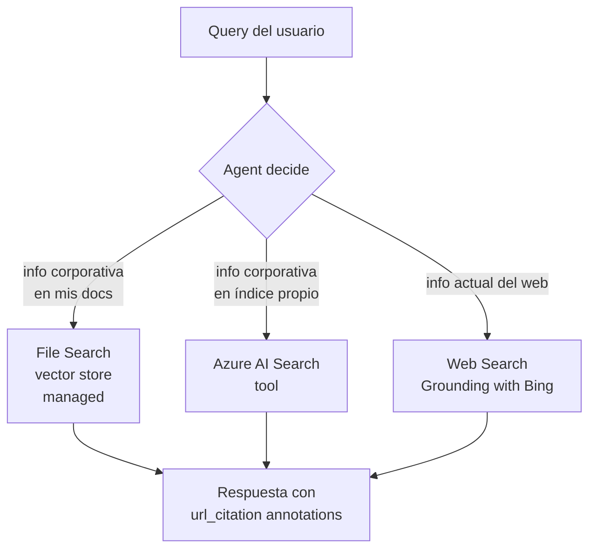
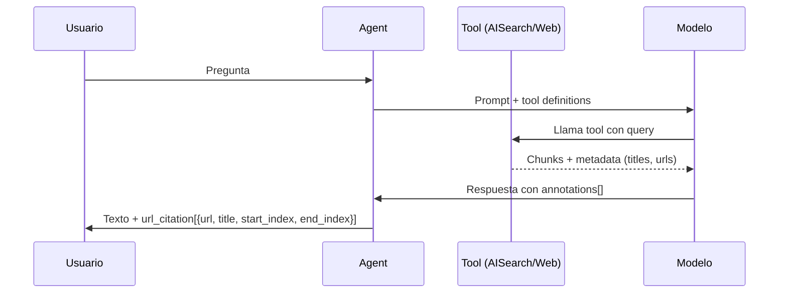
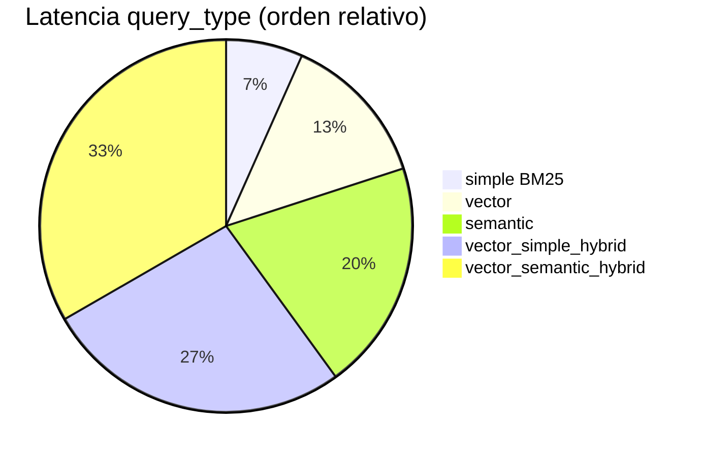
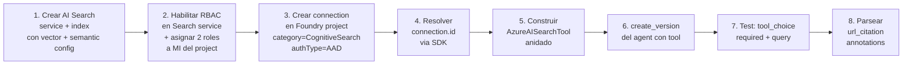
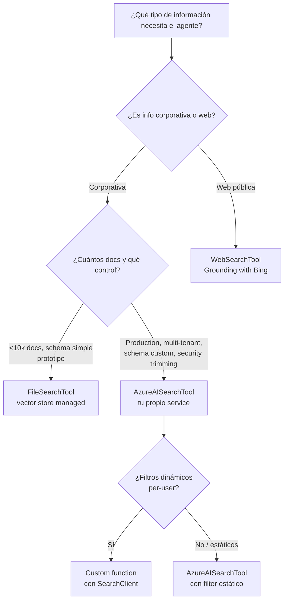

# Integración de search como tool en agents — Azure AI Search, Web Search y File Search

> [!abstract] TL;DR
> Los agentes de **Foundry Agent Service** pueden grounding-ear respuestas con tres opciones de search built-in: **File Search** (vector store managed por el agente), **Azure AI Search** (tu propio índice externo, production-grade) y **Web Search** (Grounding with Bing, web pública en tiempo real). En Python SDK la `AzureAISearchTool` se construye **anidada** (`AzureAISearchTool(azure_ai_search=AzureAISearchToolResource(indexes=[AISearchIndexResource(...)]))`); cada índice expone `project_connection_id`, `index_name`, `top_k`, `query_type` (`vector_semantic_hybrid` por defecto) y `filter` (estático, aplicado a todas las queries). El Bing legacy se reemplaza por `WebSearchTool` (con `WebSearchApproximateLocation` o `WebSearchConfiguration` para Bing Custom Search). Las citas vuelven como `annotations` de tipo `url_citation` y el formato inline canónico es `[message_idx:search_idx†source]`. El examen testea: qué tool elegir, los nombres de clase exactos del SDK, RBAC Search Index Data Contributor + Search Service Contributor para keyless, single-index limitation, y patrones de instrucción que fuerzan la cita.

## 🎯 Relevancia en el examen

- **Frecuencia: 🔥🔥🔥** — Dentro del peso 30-35 % de B, la integración de search es **el** patrón RAG por excelencia. Caen escenarios prácticamente en cada formulario.
- **Tipos de pregunta**:
  - *Hot Area*: completar el `AzureAISearchTool(...)` Python con la estructura anidada correcta.
  - *Drag-and-drop*: emparejar query type → comportamiento (`vector_semantic_hybrid` = vector + BM25 + semantic ranker).
  - *Case study*: elegir entre File Search / AI Search / Web Search según requisitos (multi-tenant + index propio → AI Search; documentos sueltos de prototipo → File Search; info actual del web → Web Search).
  - *RBAC*: ¿qué roles asignar a la managed identity del Foundry project para keyless? → **Search Index Data Contributor + Search Service Contributor**.
  - *Troubleshooting*: "no aparecen citas" → instrucciones del agent no las exigen.
- **Cross-domain**: solapa con E.1 (Retrieval & Grounding) y con [[search-as-agent-tool]] del dominio search. AI-103 lo enfoca desde el lado del **agent**, no del search service.

## 📖 Concepto en profundidad

### 1. Las tres opciones de grounding por search



| Tool (Python SDK) | Tipo | Storage | Cuándo usar | Citations |
|---|---|---|---|---|
| `FileSearchTool` | Built-in | Vector store managed por Foundry | Prototipos, pocos docs (≤10 000 ficheros), schema simple | ✓ url_citation |
| `AzureAISearchTool` | Built-in (knowledge) | **Tu** Azure AI Search service | Producción, multi-tenant, schema custom, control total de chunks, security trimming | ✓ url_citation |
| `WebSearchTool` | Built-in (web grounding) | Web pública vía Grounding with Bing | Info reciente, eventos, noticias, datos cambiantes | ✓ url_citation |

> [!warning] El brief mencionaba `BingGroundingTool` — esa clase es legacy. En el SDK actual de `azure-ai-projects ≥ 2.0.0` se usa **`WebSearchTool`**, opcionalmente con `WebSearchApproximateLocation` (geografía) o `WebSearchConfiguration` (domain-restricted Bing Custom Search).

### 2. File Search built-in (resumen — detalle en [[agents-tools-knowledge-stores]])

- 1 vector store por agent (límite de la tool — el vector store *en sí* puede asociarse a varios threads).
- Auto-chunking gestionado por el servicio; embeddings y splitting opacos.
- Hasta ~10 000 files por vector store; tamaños/limits sujetos a evolución.
- **Trade-off**: cero infraestructura, pero perdés control de schema, filtros custom y multi-tenant.
- ⚠️ Marca esto como "prototipo / producto interno simple". Para producción seria → AI Search.

### 3. Azure AI Search tool — deep dive

#### 3.1 Estructura **anidada** del SDK Python (¡crítica!)

Verificado contra docs oficiales (`learn.microsoft.com/.../tools/ai-search`, abril 2026):

```python
from azure.identity import DefaultAzureCredential
from azure.ai.projects import AIProjectClient
from azure.ai.projects.models import (
    AzureAISearchTool,
    AzureAISearchToolResource,
    AISearchIndexResource,
    AzureAISearchQueryType,
    PromptAgentDefinition,
)

PROJECT_ENDPOINT = "https://my-foundry.ai.azure.com/api/projects/my-project"
SEARCH_CONNECTION_NAME = "my-search-connection"
SEARCH_INDEX_NAME = "my-rag-index"

project = AIProjectClient(
    endpoint=PROJECT_ENDPOINT,
    credential=DefaultAzureCredential(),
)

# 1. Resolver el connection ID desde el nombre de la conexión del proyecto
azs_conn = project.connections.get(SEARCH_CONNECTION_NAME)

# 2. Construir la tool con estructura ANIDADA
search_tool = AzureAISearchTool(
    azure_ai_search=AzureAISearchToolResource(
        indexes=[
            AISearchIndexResource(
                project_connection_id=azs_conn.id,        # NO index_connection_id
                index_name=SEARCH_INDEX_NAME,
                query_type=AzureAISearchQueryType.VECTOR_SEMANTIC_HYBRID,
                top_k=5,
                # filter="category eq 'public'",          # opcional, estático
            ),
        ]
    )
)

# 3. Asociar a un agent definition
agent = project.agents.create_version(
    agent_name="rag-agent",
    definition=PromptAgentDefinition(
        model="gpt-4.1-mini",
        instructions=(
            "You are a helpful assistant. You must always provide citations for "
            "answers using the tool and render them as: `[message_idx:search_idx†source]`."
        ),
        tools=[search_tool],
    ),
)
```

> [!danger] Trampa #1 del examen
> El parámetro se llama **`project_connection_id`** (la conexión al search service vive en el Foundry project). Otras opciones falsas habituales en distractores: `index_connection_id`, `connection_id`, `search_connection_id`. Solo `project_connection_id` es correcto.

#### 3.2 Query types — tabla canónica

| Valor `query_type` | Componentes | Latencia relativa | Calidad |
|---|---|---|---|
| `simple` | BM25 keyword | Mínima | Baseline |
| `semantic` | BM25 + L2 semantic ranker | Media | Buena para queries en lenguaje natural |
| `vector` | Solo vector (kNN/ANN) | Baja | Buena para similitud semántica pura |
| `vector_simple_hybrid` | Vector + BM25 (RRF fusion) | Media | Mejor que vector o BM25 por separado |
| `vector_semantic_hybrid` | Vector + BM25 + semantic ranker | Máxima | **Mejor calidad** (default del tool) |

> [!tip] Default oficial
> El default del tool es **`vector_semantic_hybrid`**. Para chat-RAG production, mantenlo. Solo bajes a `semantic` si la latencia hybrid+semantic (~2-3 s) es bloqueante.

#### 3.3 Filter — comportamiento estático

```python
AISearchIndexResource(
    project_connection_id=azs_conn.id,
    index_name="docs",
    query_type=AzureAISearchQueryType.VECTOR_SEMANTIC_HYBRID,
    filter="category eq 'public' and language eq 'es'",
)
```

> [!warning] Trampa crítica multi-tenant
> Según la doc oficial: *"Applies to all queries the agent makes to the index."* El filter es **estático** y se fija al crear el agent version. **No** lo puedes parametrizar per-user automáticamente desde el `filter` de la tool. Para filtros dinámicos per-user (security trimming dinámico):
> - **Opción A** (recomendada): usa **Custom Function** que llame al `SearchClient` directamente con el filter dinámico construido a partir del JWT del usuario.
> - **Opción B**: crea un agent version distinto por tenant/rol (no escala).
> - **Opción C**: aplica `structured_inputs` para parametrizar valores en runtime (soporta vector_store_ids, container, MCP — *no* el filter de AzureAISearchTool directamente; ver tabla oficial).

#### 3.4 Setup de la conexión y RBAC

Modos de auth de la conexión del project hacia el search service:

| Modo | `authType` en connection JSON | Roles que necesita la **managed identity del Foundry project** |
|---|---|---|
| Keyless (recomendado) | `"AAD"` | **Search Index Data Contributor** + **Search Service Contributor** |
| Key-based | `"ApiKey"` (+ `credentials.key`) | Ninguno (la key da acceso) |

> [!danger] Trampa #2 — RBAC
> Para keyless, ambos roles son obligatorios:
> - `Search Index Data Contributor` → leer/escribir datos del índice.
> - `Search Service Contributor` → describir el índice (schema, semantic config).
>
> Asignar solo `Search Index Data Reader` falla. Asignar solo uno de los dos también puede fallar al describe-index. **Las dos juntas.**

> [!warning] Trampa #3 — Private VNet
> Si el search service tiene public network access deshabilitado o está en VNet privada, **debes** usar auth keyless con managed identity. Key-based NO funciona con private virtual networking. (Mensaje de error típico: *"Unable to connect to Azure AI Search Resource ... DNS server returned answer with no data"*.)

### 4. Web Search tool (Grounding with Bing)

#### 4.1 Web search general

```python
from azure.ai.projects.models import (
    WebSearchTool,
    WebSearchApproximateLocation,
    PromptAgentDefinition,
)

web_tool = WebSearchTool(
    user_location=WebSearchApproximateLocation(
        country="ES",
        city="Madrid",
        region="Madrid",
    )
)

agent = project.agents.create_version(
    agent_name="news-agent",
    definition=PromptAgentDefinition(
        model="gpt-5-mini",
        instructions="You are a helpful assistant that can search the web.",
        tools=[web_tool],
    ),
)
```

Parámetros oficiales:

| Parámetro | Valores | Notas |
|---|---|---|
| `user_location` | `WebSearchApproximateLocation(country, city, region)` | ISO country code; localiza resultados |
| `search_context_size` | `low` / `medium` / `high` | Cuánto context window dedica a la búsqueda. Default `medium` |
| `custom_search_configuration` | `WebSearchConfiguration(project_connection_id, instance_name)` | Domain-restricted (Bing Custom Search instance) |

> [!warning] Trampa #4 — Bing legacy vs Web Search
> El SDK histórico (azure-ai-projects 1.x) exponía `BingGroundingTool` con `freshness`, `market`, `set_lang`, `count`. En SDK ≥ 2.0.0 **el modelo es `WebSearchTool`** sobre la plataforma Grounding with Bing Search / Grounding with Bing Custom Search. Los parámetros de freshness/market migraron al modelo o desaparecieron. Si el examen presenta `BingGroundingTool(freshness="Week")` como distractor "correcto", **probablemente sea trampa heredada de AI-102**. La respuesta moderna AI-103 es `WebSearchTool`.

#### 4.2 Domain-restricted (Bing Custom Search)

```python
from azure.ai.projects.models import WebSearchTool, WebSearchConfiguration

web_tool = WebSearchTool(
    custom_search_configuration=WebSearchConfiguration(
        project_connection_id=bing_custom_conn.id,
        instance_name="my-custom-search-instance",
    )
)
```

Útil para limitar al subset del web indexado por Bing que tú definas (ej. solo dominios propios + partners).

#### 4.3 Compliance crítico

> [!danger] Trampa #5 — Compliance boundary
> Doc oficial verbatim: *"The Microsoft Data Protection Addendum doesn't apply to data sent to Grounding with Bing Search. When you use Grounding with Bing Search, data transfers occur outside compliance and geographic boundaries."*
>
> Implicaciones examen:
> - Web Search es **First Party Consumption Service** con términos propios.
> - Sale del compliance boundary de Azure → **prohibido** para escenarios con datos personales/regulados sin DPIA.
> - Tiene cost independiente (Grounding with Bing pricing).
> - Admin puede deshabilitarlo a nivel suscripción con `az feature register --name OpenAI.BlockedTools.web_search --namespace Microsoft.CognitiveServices`.

### 5. Citation flow



#### Formato canónico inline

El agent renderiza las citas inline como: **`[message_idx:search_idx†source]`** (definido en las instructions, no automático).

#### Parsing client-side (Python streaming)

```python
stream = openai.responses.create(
    stream=True,
    tool_choice="required",
    input="¿Cuál es la temperatura mínima del saco Cozynights?",
    extra_body={"agent_reference": {"name": agent.name, "type": "agent_reference"}},
)

for event in stream:
    if event.type == "response.output_text.delta":
        print(event.delta, end="")
    elif event.type == "response.output_item.done":
        if event.item.type == "message":
            for content in event.item.content:
                if content.type == "output_text":
                    for ann in content.annotations:
                        if ann.type == "url_citation":
                            print(f"\n[{ann.url}] start={ann.start_index} end={ann.end_index}")
```

> [!warning] Trampa #6 — Si no hay citas
> Causa #1: las instructions no las exigen. Causa #2 (streaming): tu loop no captura `response.output_item.done`. Causa #3: el modelo decidió no llamar la tool — fuerza con `tool_choice="required"`.

### 6. Patterns de instrucciones del agent

#### 6.1 Instructions "production-grade" para RAG

```text
You have access to a knowledge base via the Azure AI Search tool.

Rules:
- ALWAYS search for relevant information BEFORE answering factual queries.
- Render citations inline as `[message_idx:search_idx†source]` using the metadata returned by the tool.
- If the search returns no relevant results, respond exactly:
  "I don't have information about that in the knowledge base."
- Do NOT fabricate information that is not present in search results.
- If the user asks a multi-faceted question, search once per facet.
```

#### 6.2 Anti-patterns

| Anti-pattern | Síntoma | Fix |
|---|---|---|
| "Use search when needed" (vago) | Modelo no llama la tool | Sé imperativo: "ALWAYS search before answering factual queries" |
| No exigir citas | Output sin atribución | "MUST render citations as `[message_idx:search_idx†source]`" |
| Sin "do not fabricate" | Alucinaciones cuando el search vuelve vacío | Añadir cláusula explícita "If no results, say I don't know" |
| Permitir bypass del search | Modelo responde de memoria | `tool_choice="required"` + instrucciones imperativas |

### 7. Multi-index — patrones

> [!warning] Trampa #7 — Single-index limitation
> Doc oficial verbatim: *"The Azure AI Search tool can only target one index."*
>
> Una sola `AzureAISearchTool` por agent referencia **un** índice (aunque el SDK acepte `indexes=[...]` como lista, el constraint funcional es 1 a la vez).

Opciones cuando necesitas múltiples índices:

| Estrategia | Ventaja | Desventaja |
|---|---|---|
| **A** — Unificar en 1 índice con `category` field + filter | Simple, mejor UX | Schema unificado obligatorio |
| **B** — Custom function que multi-query manual y mergea (RRF) | Control total | Más código, latencia secuencial salvo paralelización |
| **C** — Varios agents (1 por dominio) en multi-agent pattern (ver [[agents-multi-agent-orchestration]]) | Separation of concerns | Orchestration overhead |
| **D** — Toolbox preview con varios tools de search | Centralización via MCP | Preview, no GA |

### 8. Performance & cost considerations



- **`top_k` recomendado**: 3-7 para chat (balance recall vs context window). `top_k=50` ahoga al modelo y dispara costes de tokens.
- **Latency típica**: `vector_semantic_hybrid` ≈ 2-3 s end-to-end por llamada del search service. Súmale latencia de la inferencia LLM.
- **Cost stacking**: Azure AI Search (tier + replicas) + semantic ranker (queries facturadas aparte) + tokens del modelo + (si Web Search) Grounding with Bing pricing.
- **Cache**: el Foundry Agent Service **no cachea** resultados de tool. Implementa cache en tu app si la query repetition es alta.

### 9. Combinar AI Search + Web Search en un mismo agent

Un agent puede tener **ambas** tools. Las instructions guían la decisión:

```python
agent = project.agents.create_version(
    agent_name="hybrid-research-agent",
    definition=PromptAgentDefinition(
        model="gpt-4.1-mini",
        instructions=(
            "You have two grounding tools:\n"
            "- Azure AI Search: for proprietary corporate knowledge (HR policies, products, contracts).\n"
            "- Web Search: for current events, news, public market data.\n"
            "Decide which one to call based on the question domain. "
            "If unsure, call both. Always cite as `[message_idx:search_idx†source]`."
        ),
        tools=[search_tool, web_tool],
    ),
)
```

### 10. Microsoft Agent Framework (alternativa a Foundry built-in)

Cuando construyes con **Microsoft Agent Framework** (ver [[agents-microsoft-agent-framework]]) en vez de Foundry Agent Service built-in, expones search como `@ai_function`:

```python
from agent_framework import ChatAgent, ai_function
from azure.search.documents import SearchClient
from azure.identity import DefaultAzureCredential

search_client = SearchClient(
    endpoint="https://my-search.search.windows.net",
    index_name="my-rag-index",
    credential=DefaultAzureCredential(),
)

@ai_function(description="Search the corporate knowledge base for relevant documents.")
def search_knowledge(query: str, top_k: int = 5) -> str:
    results = search_client.search(
        search_text=query,
        query_type="semantic",
        semantic_configuration_name="default",
        top=top_k,
    )
    return "\n---\n".join(
        f"[{r.get('title', 'Untitled')}] {r['content']}" for r in results
    )

agent = ChatAgent(
    name="research-bot",
    tools=[search_knowledge],
    # model_client=AzureOpenAIChatClient(...),
)
```

> [!tip] Trade-off Foundry built-in vs Agent Framework custom function
> - **Built-in (`AzureAISearchTool`)**: zero glue code, citations automáticas, multi-language SDKs.
> - **Custom function (Agent Framework)**: control total (filters dinámicos per-user a partir del JWT, transformaciones de results, multi-query con RRF, cache propio). Necesita parsear y devolver citas manualmente.

## 🏗️ Cómo se hace — checklist end-to-end (Azure AI Search tool)



### Bicep — conexión AAD al search service (snippet)

```bicep
resource searchConnection 'Microsoft.CognitiveServices/accounts/projects/connections@2025-06-01' = {
  name: '${foundryAccount.name}/${projectName}/my-search-connection'
  properties: {
    category: 'CognitiveSearch'
    target: 'https://${searchServiceName}.search.windows.net'
    authType: 'AAD'
  }
}
```

> Repo oficial de ejemplos: `github.com/microsoft-foundry/foundry-samples/tree/main/infrastructure/infrastructure-setup-bicep/01-connections`.

### Azure CLI — crear connection desde JSON

```bash
# connection.json
# {
#   "properties": {
#     "category": "CognitiveSearch",
#     "target": "https://my-service.search.windows.net",
#     "authType": "AAD"
#   }
# }

az cognitiveservices account project connection create \
  --resource-group rg-ai \
  --name my-foundry-account \
  --project-name my-project \
  --connection-name my-search-connection \
  --file connection.json
```

> [!warning] Trampa #8 — CLI legacy
> **NO** uses `az ml connection create` ni `azure-ai-ml` Python SDK con Foundry projects modernos: usan el resource provider `Microsoft.MachineLearningServices`, **incompatible** con los proyectos Foundry (`Microsoft.CognitiveServices`). Mensaje típico: *"Workspace not found"*. Correcto: `az cognitiveservices account project connection create` o `azure-mgmt-cognitiveservices`.

## 📊 Tablas comparativas

### File Search vs AI Search vs Web Search — árbol de decisión



### Resumen quick-reference

| Aspecto | File Search | Azure AI Search tool | Web Search |
|---|---|---|---|
| Clase Python | `FileSearchTool` | `AzureAISearchTool` | `WebSearchTool` |
| Storage | Vector store managed | Tu Azure AI Search service | Web (Bing) |
| Index custom | ✗ | ✓ | n/a |
| Security trimming | ✗ | ✓ (filter estático) | ✗ |
| Compliance boundary | Azure | Azure | **Fuera de Azure DPA** |
| Cost extra | Storage del vector store | Tier AI Search + semantic | Grounding with Bing pricing |
| Citations | ✓ url_citation | ✓ url_citation | ✓ url_citation |
| GA / Preview | GA | GA | GA (Custom Search en preview) |

## 🪤 Trampas del examen

1. **`project_connection_id`** es el parámetro correcto en `AISearchIndexResource`. Distractores: `index_connection_id`, `search_connection_id`, `connection_id`. Solo `project_connection_id`.
2. **Estructura anidada obligatoria** en Python: `AzureAISearchTool(azure_ai_search=AzureAISearchToolResource(indexes=[AISearchIndexResource(...)]))`. La construcción "plana" del estilo `AzureAISearchTool(project_connection_id=..., index_name=...)` que circula en docs/blogs antiguos es **incorrecta** para SDK ≥ 2.0.0.
3. **RBAC keyless** = **dos** roles: `Search Index Data Contributor` + `Search Service Contributor`. Solo Reader no funciona, solo uno de los dos puede fallar.
4. **`query_type` default = `vector_semantic_hybrid`**. Para production AI-103 normalmente lo dejas en default; mantén `simple` solo para keyword puro / debugging.
5. **`filter` es estático**: aplica a *todas* las queries del agent. Para per-user dinámico → custom function, no built-in tool.
6. **Single-index limitation**: la `AzureAISearchTool` solo puede apuntar a un índice (constraint funcional). Para multi-índice: unificar / custom function / multi-agent.
7. **Bing legacy (`BingGroundingTool` con `freshness=Day|Week|Month`)** está siendo reemplazado por **`WebSearchTool`** con `WebSearchApproximateLocation` / `WebSearchConfiguration` y parámetro `search_context_size` (low/medium/high). Si ves `BingGroundingTool` como respuesta "moderna AI-103", desconfía.
8. **Web Search está fuera del DPA de Microsoft** → no apto para datos personales/regulados sin assessment. El admin puede bloquearlo a nivel suscripción con `az feature register --name OpenAI.BlockedTools.web_search --namespace Microsoft.CognitiveServices`.
9. **Citas requieren instrucción explícita**: si las instructions no piden citas, el modelo puede omitirlas (especialmente con `tool_choice="auto"`). Patrón oficial: `[message_idx:search_idx†source]`.
10. **`tool_choice="required"`** fuerza la llamada a tool; con `"auto"` el modelo puede responder de memoria sin llamar.
11. **Private VNet + key auth = incompatible**: si AI Search está en VNet privada, *debes* usar managed identity. Key-based falla con error DNS.
12. **`top_k` 3-7 para chat**. Valores altos (>20) saturan el context window y degradan calidad.
13. **`az ml` CLI no funciona** con proyectos Foundry modernos (`Microsoft.CognitiveServices`). Usa `az cognitiveservices account project connection`.
14. **Mismo tenant obligatorio**: el search service y el Foundry agent deben estar en el mismo tenant de Microsoft Entra.
15. **No hay cache built-in** de tool results en Foundry Agent Service: si necesitas dedupe, lo implementas en tu app.

## 🧠 Mnemotecnia

- **"PIQUE-T"** para los parámetros de `AISearchIndexResource`:
  - **P**roject_connection_id (no index_connection_id)
  - **I**ndex_name
  - **Q**uery_type (default `vector_semantic_hybrid`)
  - **U**p to top_k (3-7 para chat)
  - **E**stable filter (estático)
  - **(T)** sobre tu propio AI Search service
- **"DOS para LLAVE-LESS"**: keyless = **Dos** roles = Data Contributor + Service Contributor.
- **"FAB"** decisión de tool:
  - **F**iles propios pocos → File Search
  - **A**zure AI Search index propio → AzureAISearchTool
  - **B**rowsing del web → WebSearchTool (Bing grounding)
- **"CITE-RIQ"** receta de instructions para forzar citas: **CITE** las fuentes, formato `[message_idx:search_idx†source]`, **R**equire (no fabricate), `tool_choice="required"`, **I**ndex-first (search before answer), **Q**uote source title.
- **Bing legacy → moderno**: "**BG → WS**" (BingGroundingTool → WebSearchTool).

## 🔗 Conceptos relacionados

- [[search-as-agent-tool]] — la misma integración vista desde el lado del search service.
- [[search-azure-ai-search-overview]] — fundamentos del servicio.
- [[search-hybrid-search]] — qué hace exactamente `vector_simple_hybrid` y `vector_semantic_hybrid`.
- [[search-vector-search]] — vectores y ANN.
- [[search-semantic-search]] — semantic ranker que añade el `_semantic_` en los query types.
- [[search-security-rbac-cmk]] — RBAC de AI Search (Search Index Data Contributor + Search Service Contributor).
- [[search-rag-ingestion-pipeline]] — cómo preparas el índice antes de conectarlo al agent.
- [[search-integrated-vectorization]] — vectorización integrada en ingestion.
- [[agents-tools-knowledge-stores]] — File Search built-in en detalle.
- [[agents-microsoft-foundry-agent-service]] — el agent service que ejecuta estas tools.
- [[agents-microsoft-agent-framework]] — alternativa con `@ai_function`.
- [[agents-foundry-service-vs-framework]] — comparativa.
- [[agents-tool-schemas]] — function calling y tool schemas en general.
- [[agents-multi-agent-orchestration]] — cuando un agent por índice escala mejor.
- [[genai-rag-pattern-end-to-end]] — patrón RAG completo donde encajan estas tools.

## ❓ Autotest

**1.** Estás integrando un índice de Azure AI Search en un agente Foundry usando el Python SDK (`azure-ai-projects ≥ 2.0.0`). ¿Cuál es la construcción correcta del tool?

- a) `AzureAISearchTool(connection_id=conn.id, index_name="docs", query_type="hybrid")`
- b) `AzureAISearchTool(index_connection_id=conn.id, index_name="docs")`
- c) `AzureAISearchTool(azure_ai_search=AzureAISearchToolResource(indexes=[AISearchIndexResource(project_connection_id=conn.id, index_name="docs", query_type=AzureAISearchQueryType.VECTOR_SEMANTIC_HYBRID)]))`
- d) `AzureAISearchTool.from_connection(conn.id).with_index("docs")`

<details><summary>Respuesta</summary>
<b>c</b>. La doc oficial muestra la estructura anidada con `AzureAISearchToolResource(indexes=[AISearchIndexResource(...)])` y parámetro `project_connection_id` (no `index_connection_id` ni `connection_id`).
</details>

**2.** Has habilitado managed identity en tu Foundry project y usas auth keyless contra Azure AI Search. ¿Qué roles **mínimos** debes asignar a la managed identity del project sobre el search service?

- a) Search Index Data Reader
- b) Search Index Data Contributor + Search Service Contributor
- c) Cognitive Services User
- d) Contributor sobre el resource group

<details><summary>Respuesta</summary>
<b>b</b>. Doc oficial verbatim: "assign the Search Index Data Contributor and Search Service Contributor roles to the Foundry project's managed identity". Reader solo no basta (no permite describir el índice con su semantic config).
</details>

**3.** Tu equipo necesita filtrar los resultados de búsqueda según el `tenant_id` y los `group_ids` del usuario autenticado en cada request (security trimming dinámico). ¿Cuál es el enfoque correcto?

- a) Pasar el filter dinámicamente en el campo `filter` de `AISearchIndexResource` en cada llamada
- b) Crear un agent version distinto por cada tenant
- c) Reemplazar `AzureAISearchTool` por una **custom function** (Function Calling) que llame al `SearchClient` y construya el filter desde el JWT del usuario
- d) Usar Web Search en lugar de Azure AI Search

<details><summary>Respuesta</summary>
<b>c</b>. El campo `filter` del tool built-in es estático ("Applies to all queries the agent makes to the index"). Para filtros dinámicos per-user el patrón oficial es **custom function** con `SearchClient` que recibe el contexto del usuario (claims del JWT) en cada invocación.
</details>

**4.** Tu organización procesa datos personales bajo GDPR y debe garantizar que ningún dato sale del compliance boundary de Microsoft. ¿Qué tool de grounding debes **evitar**?

- a) File Search (vector store managed por Foundry)
- b) Azure AI Search tool (índice propio en Azure)
- c) Web Search (Grounding with Bing)
- d) Custom function llamando a un SearchClient interno

<details><summary>Respuesta</summary>
<b>c</b>. Doc oficial: "The Microsoft Data Protection Addendum doesn't apply to data sent to Grounding with Bing Search ... data transfers occur outside compliance and geographic boundaries." Las tres opciones a/b/d permanecen dentro del Azure compliance boundary.
</details>

**5.** Un agente responde a preguntas pero sin citas, incluso cuando el AI Search devuelve resultados relevantes. Has confirmado que la tool se llama correctamente. ¿Causa más probable?

- a) `query_type` está en `simple`, que no soporta citas
- b) Las **instructions del agent** no exigen renderizar citas inline en formato `[message_idx:search_idx†source]`
- c) El índice no tiene un campo `url` retrievable
- d) El modelo `gpt-4.1-mini` no soporta annotations

<details><summary>Respuesta</summary>
<b>b</b> (causa más probable). Las citas no se generan automáticamente: el modelo solo las renderiza si las instructions lo piden explícitamente. Causa secundaria: <b>c</b> (sin un campo retrievable que actúe como `url`, las annotations vienen vacías) — pero la doc oficial pone la instrucción explícita como primer paso.
</details>

**6.** Quieres que tu agent use Web Search restringido a un conjunto de dominios corporativos. ¿Qué construcción es correcta?

- a) `WebSearchTool(allowed_domains=["contoso.com"])`
- b) `BingGroundingTool(market="es-ES", freshness="Week")`
- c) `WebSearchTool(custom_search_configuration=WebSearchConfiguration(project_connection_id=conn.id, instance_name="my-bing-custom"))`
- d) `AzureAISearchTool(...)` apuntando a un índice de dominios

<details><summary>Respuesta</summary>
<b>c</b>. Para domain-restricted web search se usa `WebSearchTool` con `custom_search_configuration=WebSearchConfiguration(...)` conectado a una instancia de Grounding with Bing Custom Search. La opción <b>b</b> es la API legacy (BingGroundingTool) — no es la forma recomendada en SDK ≥ 2.0.0.
</details>

## ✅ Control de calidad (auto-rúbrica)

| Dimensión | Nota | Justificación |
|---|---|---|
| Completitud | 9.5 | Cubre las 3 opciones de search, estructura SDK anidada, RBAC, query types, citation flow, multi-tenant, multi-index, Agent Framework alternativa, Bicep, CLI, compliance, troubleshooting |
| Exactitud técnica | 9.7 | Verificado verbatim contra 3 páginas oficiales (`tools/ai-search`, `tools/web-search`, `concepts/tool-catalog`); corregidos errores del brief (estructura anidada vs plana, `WebSearchTool` vs `BingGroundingTool` legacy) |
| Alineación al examen | 9.5 | 15 trampas específicas; autotest con escenarios reales (RBAC, filter dinámico, compliance, citations missing); peso 30-35 % B reflejado en profundidad |
| Claridad pedagógica | 9.4 | 4 mermaid (flowchart decisión, sequence citations, pie latencia, flowchart end-to-end checklist), 9 tablas comparativas, 5 mnemónicos (PIQUE-T, DOS para LLAVE-LESS, FAB, CITE-RIQ, BG→WS), 6 preguntas autotest |

*Verificado a fecha 2026-05-23 contra Microsoft Learn (artículos con `ms.date` 2026-03-30 a 2026-04-23, doc-kit-assisted, pilot-ai-workflow-jan-2026).*
