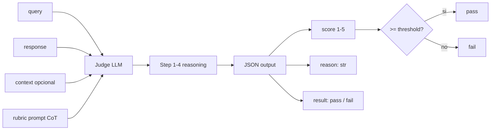
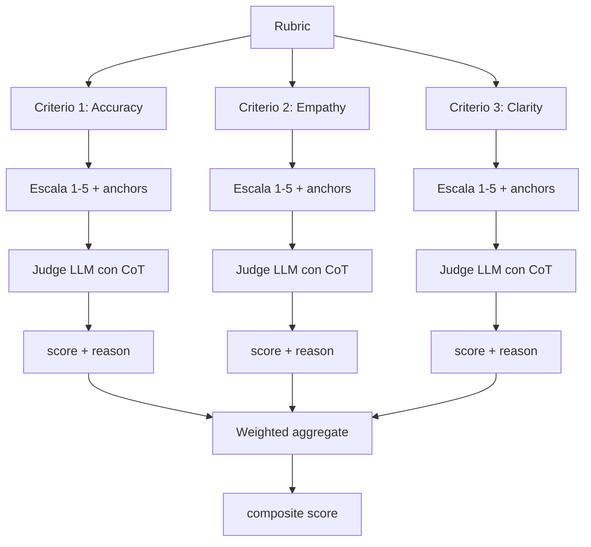
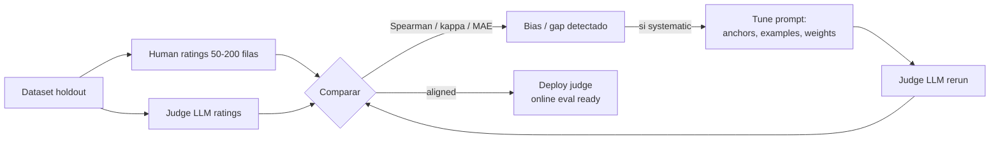
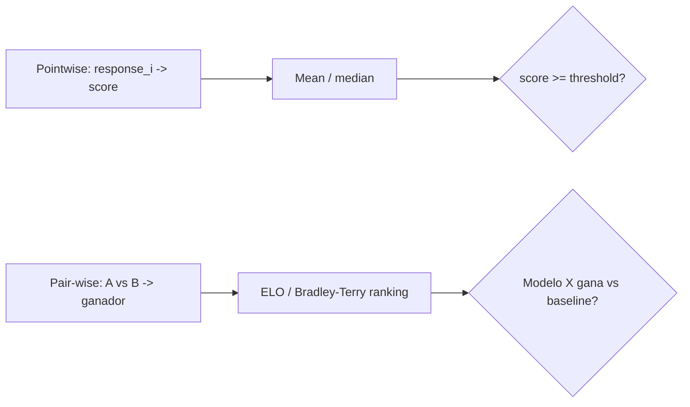
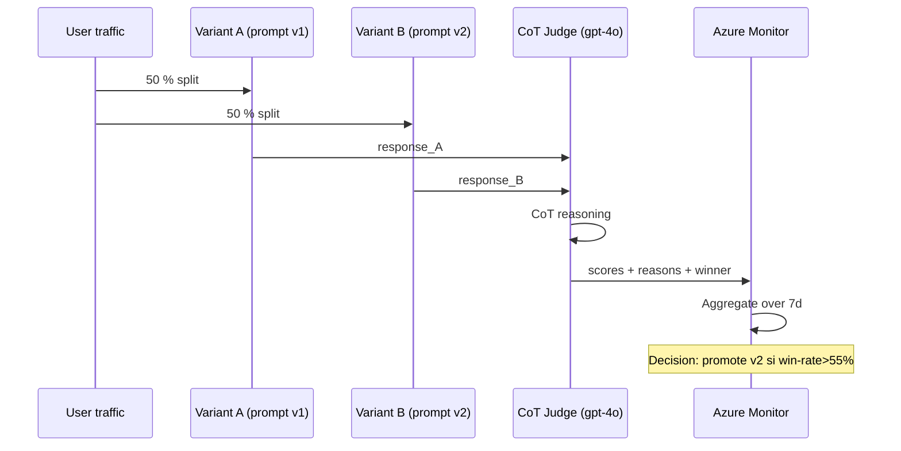
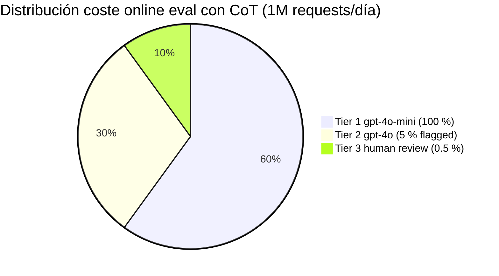
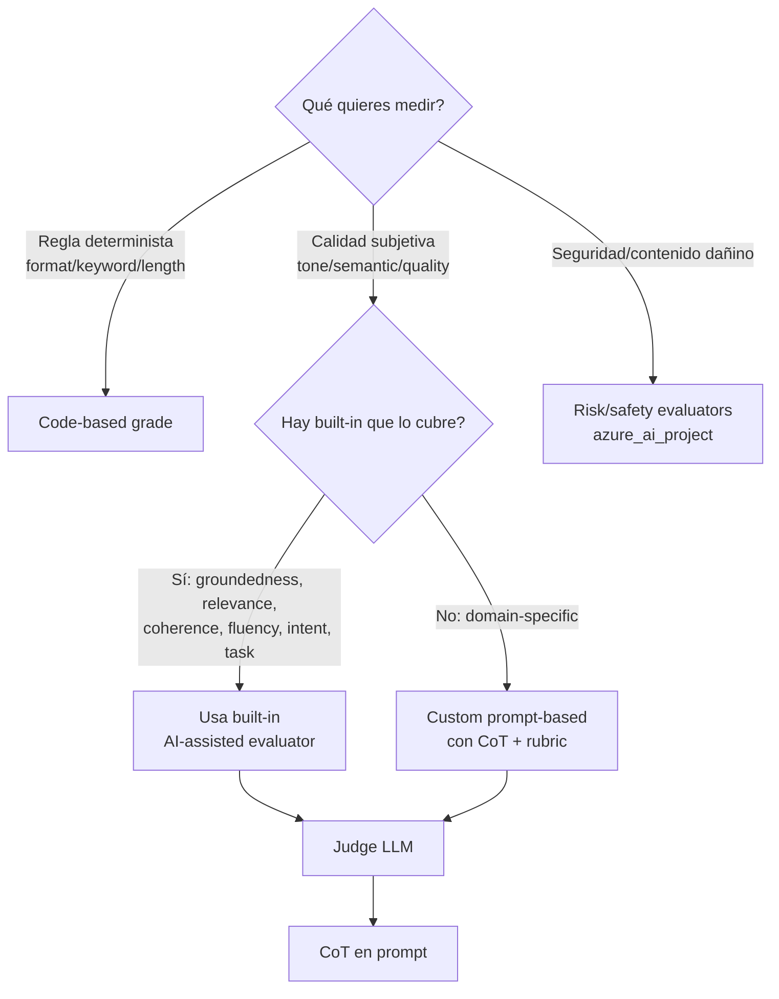

# Chain-of-Thought reasoning para evaluar outputs (LLM-as-judge + rubrics)

> [!abstract] TL;DR
> **Chain-of-Thought (CoT) en evaluación** consiste en hacer que un **judge LLM razone paso a paso** antes de emitir un score, devolviendo `(reason, score, result)` en lugar de solo `score`. Es el patrón interno de **todos los AI-assisted evaluators** de `azure-ai-evaluation` (`GroundednessEvaluator`, `RelevanceEvaluator`, `CoherenceEvaluator`, `FluencyEvaluator`, `IntentResolutionEvaluator`, `TaskAdherenceEvaluator`). El campo `<metric>_reason` expone la CoT del juez. En **custom prompt-based evaluators** (Foundry portal o SDK) defines tu rubric + escala ordinal/continua/binaria y obligas al modelo a devolver `{"result": N, "reason": "..."}`. NO confundir con CoT prompting general — aquí CoT es la herramienta del **juez**, no del agente.

## Relevancia en el examen

| Tipo de pregunta | Frecuencia | Foco |
|---|---|---|
| Identificar qué evaluator built-in expone CoT (`*_reason` field) | 🔥🔥🔥 | Todos los AI-assisted excepto `SimilarityEvaluator` |
| Diseñar custom prompt-based evaluator con rubric + CoT | 🔥🔥🔥 | Output JSON `{result, reason}` obligatorio |
| Elegir judge model adecuado (≥ target en capability) | 🔥🔥 | gpt-4o / gpt-4.1 / o-series para prod |
| Detectar biases (position, length, self-preference) | 🔥🔥 | Mitigaciones específicas |
| Diferenciar pointwise vs pair-wise | 🔥 | Coste N² en pair-wise |
| Calibración judge ↔ humano | 🔥 | Antes de online eval |

> [!warning] Trampa nuclear
> El sub-punto verbatim del temario es *"Use chain-of-thought reasoning to evaluate model outputs"*. Microsoft lo evalúa en el contexto de **LLM-as-judge** y de los **AI-assisted built-in evaluators**, no como técnica para mejorar el modelo bajo prueba. Si una pregunta dice *"use CoT to improve answer quality"* → es `[[genai-multistep-reasoning-pipelines]]`. Si dice *"use CoT to score / judge / explain why"* → es ESTE archivo.

## Concepto en profundidad

### Qué es CoT aplicado a evaluación

Un **judge LLM** estándar sin CoT recibe `(query, response[, context])` y devuelve un número (`score=4`). Problemas:

1. **Calibración pobre** → modelos LLM tienden a colapsar al centro (3/5 lazy default).
2. **Inconsistencia** → mismas entradas producen scores distintos.
3. **No auditable** → un 2/5 sin justificación no permite mejora.
4. **Bias amplificado** → length / position / self-preference no se detectan.

**CoT en evaluación** fuerza al juez a:

1. **Identificar** aspectos de la respuesta relacionados con el criterio.
2. **Comparar** con referencias de la escala (anchors).
3. **Razonar** fortalezas y debilidades.
4. **Decidir** score + justificación textual.

> [!info] Cita oficial verbatim (Microsoft Learn)
> *"AI-assisted quality evaluators, except for `SimilarityEvaluator`, include a reason field. They use techniques like chain-of-thought reasoning to generate an explanation for the score. They consume more token usage in generation as a result of improved evaluation quality."*
> — `learn.microsoft.com/azure/foundry-classic/how-to/develop/evaluate-sdk`

### Output shape canónico de un CoT-judge en Azure AI Evaluation

```python
{
    "<metric>": 5.0,                          # score numerico medio (cuando conversation)
    "gpt_<metric>": 5.0,                      # alias compat
    "<metric>_threshold": 3.0,                # umbral pass/fail
    "evaluation_per_turn": {
        "<metric>": [5.0, 5.0],
        "<metric>_reason": [                  # CoT explainability
            "The response accurately and completely answers the query...",
            "The RESPONSE directly answers the QUERY with the exact information..."
        ],
        "<metric>_result": ["pass", "pass"],  # threshold-derived verdict
    }
}
```

Tres campos clave que **siempre** aparecen en built-ins AI-assisted:

| Sufijo | Tipo | Significado |
|---|---|---|
| `<metric>` o `gpt_<metric>` | `float` 1–5 | Score numerico del juez |
| `<metric>_reason` | `str` | **Chain-of-Thought del juez** (explicabilidad) |
| `<metric>_result` | `"pass"` \| `"fail"` | Veredicto vs `<metric>_threshold` |



### Por qué CoT mejora el juicio LLM

| Sin CoT | Con CoT |
|---|---|
| Colapso al centro (3/5) | Score distribuido en la escala |
| Misma input → distintos scores | Reproducible con `temperature=0` |
| Imposible debuggear scores anómalos | `reason` revela la lógica |
| Biases ocultos | Biases visibles en el texto del razonamiento |
| Sensible a paraphrasing trivial | Razonamiento abstrae sobre el contenido |

> [!tip] Coste tokens
> Microsoft documenta que los AI-assisted evaluators **consumen más tokens** por CoT: `max_token` por defecto **800**, **1600** para `RetrievalEvaluator`, **3000** para `ToolCallAccuracyEvaluator`. Para batch grande → estima coste = `N_filas × N_evaluators × ~800 tokens × precio_modelo`.

## Rubric-based evaluation (anatomía)

Un **rubric** = `criterios × escala × anchors`. La escala puede ser:

- **Ordinal** (1–5, 1–10) — recomendada para juicio humano-like.
- **Continua** (0.0–1.0) — fine-grained, útil para regresión.
- **Binary** (`true/false`) — threshold checks (PII presente sí/no).

> [!example] Rubric ejemplo "Customer support response quality"
> ```
> Criteria:
> 1. Accuracy  (1-5) — Is information correct?
> 2. Empathy   (1-5) — Does it acknowledge customer concern?
> 3. Clarity   (1-5) — Is it easy to understand?
> 4. Completeness (1-5) — Does it answer fully?
>
> Each: 1=very poor, 5=excellent.
> Weighted: (acc*0.4) + (empathy*0.2) + (clarity*0.2) + (compl*0.2).
> ```

### Anchors (clave de calibración)

Cada nivel debe tener una **referencia textual** ("1 = unfriendly or hostile, 3 = neutral, 5 = very friendly"). Sin anchors, el juez improvisa y la varianza explota.



## CoT judge prompt template (canónico)

```text
You are a strict evaluator. Score the RESPONSE on the CRITERION below.

CRITERION: {criterion}
SCALE: 1 (poor) to 5 (excellent)
ANCHORS:
  1 - {anchor_1}
  3 - {anchor_3}
  5 - {anchor_5}

QUESTION: {query}
CONTEXT: {context}
RESPONSE: {response}

Reason in 4 steps BEFORE assigning the score:
  Step 1: Identify aspects of the RESPONSE that relate to the CRITERION.
  Step 2: Compare each aspect to the scale's anchors.
  Step 3: Identify strengths and weaknesses.
  Step 4: Decide the final score with justification.

Return ONLY valid JSON:
{
  "reasoning": "<your step-by-step CoT>",
  "score": <integer 1-5>,
  "result": "pass" | "fail"
}
```

## Cómo se hace (Python SDK)

### 1. Usar un built-in CoT judge

```python
import os
from azure.ai.evaluation import (
    GroundednessEvaluator, RelevanceEvaluator, CoherenceEvaluator,
    FluencyEvaluator, AzureOpenAIModelConfiguration,
)

# Judge LLM config (≥ target en capability)
model_config = AzureOpenAIModelConfiguration(
    azure_endpoint=os.environ["AZURE_ENDPOINT"],
    api_key=os.environ["AZURE_API_KEY"],
    azure_deployment="gpt-4o",            # judge model
    api_version="2024-10-21",
)

groundedness = GroundednessEvaluator(model_config)
result = groundedness(
    query="What is the capital of France?",
    response="Paris is the capital of France.",
    context="France is in Europe; Paris is its capital.",
)
# result = {
#   "groundedness": 5.0,
#   "gpt_groundedness": 5.0,
#   "groundedness_reason": "The response is fully supported by the context...",
#   "groundedness_result": "pass",
#   "groundedness_threshold": 3
# }
```

### 2. Custom prompt-based evaluator (callable class)

```python
import json
from openai import AzureOpenAI

class HelpfulnessEvaluator:
    """CoT judge para Helpfulness 1-5."""

    PROMPT = """You are a strict evaluator. Score helpfulness 1-5.

Query: {query}
Response: {response}

Reason step by step (4 steps), then return JSON:
{{"reasoning": "<CoT>", "score": <1-5>, "result": "pass" | "fail"}}
Threshold: score >= 3 means pass."""

    def __init__(self, model_config: dict):
        self.deployment = model_config["azure_deployment"]
        self.client = AzureOpenAI(
            azure_endpoint=model_config["azure_endpoint"],
            api_key=model_config["api_key"],
            api_version=model_config["api_version"],
        )

    def __call__(self, *, query: str, response: str, **kwargs) -> dict:
        msg = self.PROMPT.format(query=query, response=response)
        out = self.client.chat.completions.create(
            model=self.deployment,
            messages=[{"role": "user", "content": msg}],
            response_format={"type": "json_object"},   # forces parseable JSON
            temperature=0,                              # determinism
        )
        payload = json.loads(out.choices[0].message.content)
        return {
            "helpfulness": payload["score"],
            "helpfulness_reason": payload["reasoning"],
            "helpfulness_result": payload["result"],
        }
```

> [!info] Contrato del callable
> `azure-ai-evaluation` espera que un custom evaluator sea **un callable** (función o instancia con `__call__`) que recibe `query`, `response`, `context`, `ground_truth`, etc. por **keyword-only** y devuelve un `dict` con `<metric>: value` (numerico) + `<metric>_reason` (str) + `<metric>_result` (pass/fail) opcionales.

### 3. Custom evaluator en Foundry portal (prompt-based, ordinal scoring)

Cuando registras el evaluator en el **Evaluator catalog** del proyecto Foundry, el contrato cambia: el JSON de salida debe ser `{"result": <int>, "reason": <str>}` (NO `score`), porque el motor lo orquesta como `EvaluatorDefinitionType.PROMPT`.

```python
from azure.ai.projects import AIProjectClient
from azure.ai.projects.models import EvaluatorCategory, EvaluatorDefinitionType
from azure.identity import DefaultAzureCredential

project_client = AIProjectClient(
    endpoint=os.environ["AZURE_AI_PROJECT_ENDPOINT"],
    credential=DefaultAzureCredential(),
)

prompt_evaluator = project_client.beta.evaluators.create_version(
    name="friendliness_evaluator",
    evaluator_version={
        "name": "friendliness_evaluator",
        "categories": [EvaluatorCategory.QUALITY],
        "display_name": "Friendliness Evaluator",
        "description": "Warmth/approachability rubric 1-5",
        "definition": {
            "type": EvaluatorDefinitionType.PROMPT,
            "prompt_text": (
                "Friendliness assesses the warmth and approachability of the response.\n"
                "Rate between 1 and 5 using these anchors:\n"
                "1 - Unfriendly or hostile\n"
                "2 - Mostly unfriendly\n"
                "3 - Neutral\n"
                "4 - Mostly friendly\n"
                "5 - Very friendly\n\n"
                "Reason step-by-step before scoring.\n\n"
                "Response:\n{{response}}\n\n"
                "Output Format (JSON):\n"
                '{ "result": <integer 1-5>, "reason": "<brief CoT>" }'
            ),
            "init_parameters": {
                "type": "object",
                "properties": {
                    "deployment_name": {"type": "string"},
                    "threshold": {"type": "number"},
                },
                "required": ["deployment_name", "threshold"],
            },
            "data_schema": {
                "type": "object",
                "properties": {"response": {"type": "string"}},
                "required": ["response"],
            },
            "metrics": {
                "custom_prompt": {
                    "type": "ordinal",
                    "desirable_direction": "increase",
                    "min_value": 1, "max_value": 5,
                }
            },
        },
    },
)
```

### 4. Multi-criteria composite scoring (custom)

```python
class CompositeJudge:
    """Aggrega múltiples CoT judges con pesos."""

    def __init__(self, criteria: dict[str, float], judge: HelpfulnessEvaluator):
        self.criteria = criteria   # {"accuracy": 0.4, "empathy": 0.2, ...}
        self.judge = judge

    def __call__(self, *, query: str, response: str, **kw) -> dict:
        scores = {}
        reasons = {}
        for name in self.criteria:
            single = self.judge(query=query, response=response, criterion=name)
            scores[name] = single["score"]
            reasons[name] = single["reason"]
        composite = sum(scores[n] * w for n, w in self.criteria.items())
        return {
            "composite": composite,
            "composite_scores": scores,
            "composite_reasons": reasons,
        }
```

### 5. Lanzar batch con `evaluate()` (mezcla built-in + custom)

```python
from azure.ai.evaluation import evaluate

result = evaluate(
    data="data.jsonl",
    evaluators={
        "groundedness": groundedness,         # built-in CoT judge
        "helpfulness":  HelpfulnessEvaluator(model_config),  # custom CoT judge
    },
    evaluator_config={
        "groundedness": {
            "column_mapping": {
                "query": "${data.query}",
                "context": "${data.context}",
                "response": "${data.response}",
            }
        }
    },
    azure_ai_project=azure_ai_project,        # log to Foundry portal
    output_path="./results.json",
)
```

## Built-in evaluators que usan CoT (referencia exacta)

> [!info] Catálogo verbatim Microsoft Learn
> *"AI-assisted quality evaluators, except for `SimilarityEvaluator`, include a reason field. They use techniques like chain-of-thought reasoning to generate an explanation for the score."*

| Categoría | Evaluator | Devuelve CoT (`*_reason`) | Inputs típicos |
|---|---|---|---|
| General purpose | `CoherenceEvaluator` | sí | query, response |
| General purpose | `FluencyEvaluator` | sí | query, response |
| General purpose | `QAEvaluator` (composite) | sí (por sub-eval) | query, response, ground_truth, context |
| RAG | `GroundednessEvaluator` | sí | query, response, context |
| RAG | `GroundednessProEvaluator` (preview) | sí (service-side) | azure_ai_project (no model_config) |
| RAG | `RelevanceEvaluator` | sí | query, response |
| RAG | `RetrievalEvaluator` | sí (max_token 1600) | query, context |
| RAG | `ResponseCompletenessEvaluator` | sí | response, ground_truth |
| RAG | `DocumentRetrievalEvaluator` | sí | query, response, ground_truth |
| Agent | `IntentResolutionEvaluator` | sí | agent inputs |
| Agent | `ToolCallAccuracyEvaluator` | sí (max_token 3000) | agent inputs |
| Agent | `TaskAdherenceEvaluator` | sí | agent inputs |
| Textual similarity | `SimilarityEvaluator` | **NO** ⚠️ | query, response, ground_truth |

> [!warning] Excepción confirmada
> **`SimilarityEvaluator` NO devuelve `_reason`** — es el único AI-assisted quality que NO usa CoT (es similitud semántica directa). Las preguntas pueden tirar por ahí: *"Which evaluator does NOT expose chain-of-thought reasoning?"* → `SimilarityEvaluator`.

> [!info] Safety evaluators
> Los safety evaluators (`ViolenceEvaluator`, `SexualEvaluator`, etc.) y `GroundednessProEvaluator` **no usan `model_config`** sino `azure_ai_project` porque ejecutan en el **back-end de Content Safety**, no en tu deployment OpenAI. Internamente sí usan CoT, pero los prompts son proprietarios y NO open-sourced (a diferencia de los quality evaluators, que sí lo están).

## Judge model selection

| Modelo | Coste relativo | Reasoning | Recomendación |
|---|---|---|---|
| `gpt-4o-mini` | $ | Bueno | Iteración dev, online eval con sampling alto |
| `gpt-4o` | $$$ | Excelente | Production decisions, gating CI/CD |
| `gpt-4.1` | $$$ | Excelente | Production largas contextos |
| `o4-mini` | $$ | Excelente en lógica/math | Crítico para evals matemáticos / código |
| `o-series` (`o3`, `o4`) | $$$$ | Best | Critical / red-team / arbitraje humano-like |
| `gpt-3.5-turbo` | $ | Pobre | ❌ Microsoft recomienda reemplazar por gpt-4o-mini |

> [!danger] Regla de oro
> **Judge ≥ target model en capability.** Si tu app usa gpt-4o y juzgas con gpt-3.5-turbo → el juez no detecta errores sutiles → scores inflados, falsos pass. Si tu app usa gpt-4o-mini y juzgas con o4-mini → el juez sobre-castiga matices que el modelo nunca podría generar. Idealmente: juez de **misma familia o superior**.

## Calibración judge ↔ humano (production-grade)



Pasos concretos:

1. Toma 50–200 filas representativas → anota a mano (rubric idéntico al del juez).
2. Ejecuta el judge con `temperature=0` sobre las mismas filas.
3. Calcula:
   - **Spearman ρ** (ordinal correlation) entre human_scores y judge_scores.
   - **Cohen κ** si la escala es categórica (pass/fail).
   - **MAE** (mean absolute error) en escala numerica.
4. Si ρ < 0.7 o κ < 0.6 → **tune el prompt**: añade few-shot anchors, refina criterio, baja la escala (5 → 3 niveles).
5. Repite hasta converger. Entonces el juez está **calibrado** y puedes confiar en online eval.

> [!tip] Few-shot anchoring
> Añadir 2–3 ejemplos verbatim de score=1, score=3, score=5 dentro del prompt **mejora dramáticamente** la calibración. Es la single most impactful technique para subir Spearman ρ.

## Consistency checks

| Test | Cómo | Esperado |
|---|---|---|
| Determinismo intra-judge | Mismo input × N runs con `temperature=0` | Idéntico (si varía → ambigüedad en rubric) |
| Stability post-paraphrase | Reformular response sin cambiar contenido | Score estable ±0 (no shift por estilo) |
| Inter-judge agreement | 2 judges distintos × misma data | Cohen κ ≥ 0.6 |
| Position invariance (pair-wise) | A/B y B/A → ratio de flips | Flips < 10 % |

## Bias mitigation (checklist)

| Bias | Síntoma | Mitigación |
|---|---|---|
| **Position bias** | Pair-wise: judge prefiere primer answer | Randomize order; promedia A/B y B/A |
| **Length bias** | Longer = higher score sin contenido extra | "Penalize verbosity not adding info" en prompt |
| **Stylistic bias** | Formal > casual aunque contenido igual | Anchors variados en estilo; ignore_style instruction |
| **Self-preference** | Judge gpt-4o prefiere outputs gpt-4o vs gpt-4o-mini | Cross-family judge (judge ≠ family target) |
| **Sycophancy** | Acepta premisas erróneas del query | Explicit "ignore user-stated facts unless in context" |
| **Confirmation bias** | Anchors muy positivos arrastran al alza | Anchors balanceados negativo/positivo |

## Pointwise vs pair-wise

| Aspecto | Pointwise | Pair-wise |
|---|---|---|
| Input | 1 response | 2 responses |
| Output | score 1-5 | A wins / B wins / tie |
| Discriminación | Media | Alta (relativa, no absoluta) |
| Coste | `N` calls | `N×(N-1)/2` calls — **cuadrático** |
| Sesgo de position | No | Sí (mitigar randomizando) |
| Reuso | Score absoluto reutilizable | Solo relativo a la comparación |
| Cuándo usar | Online eval, gating CI/CD | A/B testing de prompts/modelos pequeño |



## Production patterns

### Online eval con CoT judge (Foundry Observability)

- **Continuous evaluation**: muestra de tráfico real (sampling 1–10 %) → CoT judge → emite scores a App Insights.
- **Scheduled evaluation**: corre el evaluator sobre golden dataset cada N horas → detecta **drift**.
- **Alerts**: Azure Monitor dispara si `groundedness < threshold` durante ventana de tiempo.
- **Sampling rate matters**: cada llamada al judge es token-billed → 100 % sampling = doble del coste runtime.

### A/B testing con judge as referee



### Cost-optimal escalation

1. **Tier 1 — gpt-4o-mini judge** sobre 100 % del sample → flag si score < threshold.
2. **Tier 2 — gpt-4o judge** sólo sobre los flagged → confirmación / human review.
3. **Tier 3 — Human** sólo sobre Tier 2 fails → calibration data + ground truth para retrain.

Pie de costes típicos (orden de magnitud):



## Tablas comparativas / cuándo usar qué

### Code-based vs Prompt-based custom evaluator (verbatim Microsoft Learn)

| - | Code-based | Prompt-based |
|---|---|---|
| **Cómo funciona** | Python `grade()` con lógica determinista | Judge LLM con CoT |
| **Mejor para** | Format validation, keyword matching, length, regex | Quality subjetiva, tone, semántica |
| **Scoring** | Continuo float 0.0–1.0 | Ordinal, continuous o binary (defines rango) |
| **Output** | Float | JSON `{"result": ..., "reason": ...}` |
| **Usa CoT** | ❌ No (lógica determinista) | ✅ Sí (LLM-judge) |
| **Coste** | Compute solo | Tokens LLM (judge) |
| **Determinismo** | 100 % | Alto con `temperature=0` |

### Cuándo usar cada técnica



## Trampas del examen

1. **CoT en eval ≠ CoT prompting general**. Si la pregunta pide razonar paso a paso para mejorar la respuesta del agente → `[[genai-multistep-reasoning-pipelines]]`. Si pide explicar el score → este archivo.
2. **`SimilarityEvaluator` NO devuelve `_reason`** — es la única excepción entre los AI-assisted quality evaluators.
3. **`temperature=0` para judges**. Cualquier otra cosa rompe la reproducibilidad. Las preguntas que muestren `temperature=0.7` en un evaluator son trampa.
4. **Judge model debe ser ≥ target en capability**. Un judge gpt-3.5-turbo evaluando gpt-4o es respuesta incorrecta. Microsoft explícitamente recomienda reemplazar gpt-3.5-turbo por gpt-4o-mini.
5. **Built-in evaluators YA usan CoT internamente**. No necesitas envolverlos en otro juez. El campo `<metric>_reason` ES la CoT.
6. **Output contract custom evaluator (callable)**: `dict` con `<metric>` (num) + `<metric>_reason` (str) + opcional `<metric>_result` (pass/fail). Si devuelves solo el número se loguea pero **no aparece el reasoning en el report**.
7. **Output contract prompt-based en Foundry portal**: JSON con `{"result": <type>, "reason": <str>}` — NO `score`. El motor del portal espera `result`, no `score`. Confundir ambos es trampa frecuente.
8. **`response_format={"type":"json_object"}`** garantiza JSON parseable. Sin él, el modelo puede devolver markdown con backticks y `json.loads()` revienta.
9. **Position bias en pair-wise**: la única mitigación admisible es **randomize + promediar A/B y B/A**. Cualquier otra opción ("usar mejor modelo", "subir temperature") es incorrecta.
10. **Length bias**: instrucción explícita en prompt *"Penalize verbosity that does not add information"*. NO se mitiga truncando outputs.
11. **`GroundednessProEvaluator` y safety evaluators usan `azure_ai_project`, NO `model_config`** — porque ejecutan en el back-end de Content Safety. Los demás AI-assisted usan `model_config`.
12. **Coste online eval con CoT**: cada eval call son ~800 tokens de output. Sampling rate × N evaluators × N requests = bill rápido. Mitigación: sampling 1–5 % en prod + tiered escalation (mini → 4o).
13. **`max_token` por evaluador**: 800 default, 1600 `RetrievalEvaluator`, 3000 `ToolCallAccuracyEvaluator`. Truncar la CoT del juez es bug → score corrupto.
14. **Threshold-derived `_result`**: el `pass/fail` se calcula respecto a `<metric>_threshold` (default 3.0). Cambiarlo cambia la tasa de pass sin re-evaluar.
15. **Composite evaluators** (`QAEvaluator`, `ContentSafetyEvaluator`) **no son nuevos juicios** — son agregadores que ejecutan sus sub-evaluators internamente y mezclan resultados.
16. **Inter-judge agreement**: Cohen κ para categórico, Spearman ρ para ordinal, no confundirlos.
17. **Calibration con few-shot anchors** mejora ρ más que cualquier otra técnica. Si una opción dice "añadir 3 ejemplos verbatim de scores 1, 3, 5" → es correcta.
18. **Custom evaluator NO necesita azure-ai-evaluation** instalado si lo registras en Foundry portal — el motor del portal lo ejecuta. Pero para `evaluate()` local sí.

## Mnemotecnia

> **R-S-R** → Lo que devuelve un CoT judge built-in: **R**eason, **S**core, **R**esult.
>
> **"Judge debe estudiar más que el examinado"** → judge ≥ target capability.
>
> **C-A-R-D** (rubric design): **C**riteria, **A**nchors, **R**ange (escala), **D**eterminism (`temperature=0`).
>
> **"Las 4 P del bias"**: **P**osition, **P**rolixity (length), **P**reference (self), **P**oliteness (stylistic). Mitigación: randomize + instruct + cross-family + diverse anchors.
>
> **`SimilarityEvaluator` es el patito feo** → único AI-assisted SIN `_reason` field.
>
> **"Ordinal → integer, Continuous → float, Binary → bool"** — tipo de `result` en prompt-based evaluator.

## Conceptos relacionados

- [[genai-evaluation-quality-safety]] — overview de quality + safety evaluators
- [[genai-evaluation-relevance-coherence]] — built-ins Relevance/Coherence en detalle
- [[genai-evaluation-fabrications-hallucinations]] — Groundedness + Pro para detectar alucinaciones
- [[genai-multistep-reasoning-pipelines]] — CoT general (NO confundir con CoT-as-judge)
- [[genai-model-reflection-self-critique]] — reflection patterns relacionados pero distintos
- [[agents-evaluation-behavior-error-analysis]] — Intent/ToolCall/TaskAdherence para agentes
- [[responsible-evaluators-builtin]] — catálogo completo built-ins
- [[responsible-evaluators-custom]] — code-based y prompt-based custom
- [[genai-structured-outputs]] — JSON schema y `response_format` (clave para CoT-judge parseable)
- [[genai-observability-tracing]] — tracing CoT en App Insights via OpenTelemetry
- [[plan-monitor-app-insights]] — alerting sobre scores

## Autotest

**1.** Ejecutas `GroundednessEvaluator` y obtienes el dict de resultados. ¿Qué clave contiene el **chain-of-thought** del juez?

- a) `groundedness_score`
- b) `gpt_groundedness`
- c) `groundedness_reason`
- d) `groundedness_threshold`

<details><summary>Respuesta</summary>

**c) `groundedness_reason`**. Microsoft Learn (verbatim): *"AI-assisted quality evaluators include a reason field. They use techniques like chain-of-thought reasoning to generate an explanation for the score."* El campo `<metric>_reason` es la CoT. `gpt_groundedness` es alias del score numerico; `groundedness_threshold` es el umbral pass/fail.

</details>

**2.** Diseñas un custom **prompt-based** evaluator en el Foundry portal. ¿Cuál debe ser el output del judge LLM?

- a) `{"score": <int>, "reasoning": <str>}`
- b) `{"result": <int|float|bool>, "reason": <str>}`
- c) `{"verdict": "pass"|"fail", "cot": <str>}`
- d) Un único `float` entre 0.0 y 1.0

<details><summary>Respuesta</summary>

**b) `{"result": <int|float|bool>, "reason": <str>}`**. El contrato verbatim del portal Foundry: *"The evaluator must return a JSON object with `result` and `reason`. The type of `result` matches your scoring method: an integer for ordinal, a float for continuous, or a boolean for binary."* La opción **d** es el contrato de code-based evaluators (Python `grade()`), no prompt-based.

</details>

**3.** Tu aplicación usa `gpt-4o` en producción. ¿Qué judge model es la **peor** elección para un CoT evaluator?

- a) `gpt-4o`
- b) `gpt-4.1`
- c) `o4-mini`
- d) `gpt-3.5-turbo`

<details><summary>Respuesta</summary>

**d) `gpt-3.5-turbo`**. Regla: **judge ≥ target en capability**. Microsoft además recomienda explícitamente reemplazar `gpt-3.5-turbo` por `gpt-4o-mini` ("cheaper, more capable, and as fast"). Un judge inferior al modelo bajo prueba produce scores inflados — incapaz de detectar errores que sí ve un humano experto.

</details>

**4.** En pair-wise comparison entre prompt v1 y prompt v2, observas que el juez prefiere consistentemente la respuesta **mostrada primero**. ¿Cuál es la mitigación correcta?

- a) Subir `temperature` a 0.7 para introducir variedad
- b) Cambiar el judge a un modelo más pequeño
- c) Randomizar el orden A/B y promediar comparaciones A-B y B-A
- d) Pasar a pointwise scoring para eliminar el problema

<details><summary>Respuesta</summary>

**c) Randomizar el orden A/B y promediar comparaciones A-B y B-A**. Es el **position bias** clásico. Mitigación canónica: para cada par, ejecuta dos comparaciones (A-B y B-A) y promedia. Si en >10 % de los pares el judge cambia de opinión solo por el orden, hay bias residual y debes revisar el prompt. **a** rompe determinismo; **b** empeora la calidad del juez; **d** es válido como workaround pero la pregunta pide la mitigación específica del position bias.

</details>

**5.** ¿Cuál de los siguientes evaluators built-in **NO** expone chain-of-thought reasoning (no devuelve `_reason`)?

- a) `RelevanceEvaluator`
- b) `CoherenceEvaluator`
- c) `SimilarityEvaluator`
- d) `IntentResolutionEvaluator`

<details><summary>Respuesta</summary>

**c) `SimilarityEvaluator`**. Cita verbatim: *"AI-assisted quality evaluators, **except for `SimilarityEvaluator`**, include a reason field."* Es el único quality AI-assisted que no usa CoT — calcula similitud semántica de forma directa sin razonamiento explicable. Los otros tres sí devuelven `<metric>_reason`.

</details>

**6.** Tu CoT judge tiene Spearman ρ = 0.45 vs ratings humanos en un holdout. ¿Cuál es la intervención de **mayor impacto**?

- a) Subir el `max_tokens` del judge a 3000
- b) Añadir 2–3 ejemplos few-shot anchored a scores 1, 3 y 5 en el prompt
- c) Cambiar de pointwise a pair-wise
- d) Reducir el sampling rate de online eval

<details><summary>Respuesta</summary>

**b) Añadir 2–3 ejemplos few-shot anchored a scores 1, 3 y 5**. Es la single most impactful technique documentada para mejorar calibración judge ↔ humano. Sin anchors verbatim, el juez improvisa el significado de cada nivel. **a** no ayuda si la rubric es ambigua; **c** cambia el problema pero no calibra mejor; **d** afecta coste no calidad.

</details>

## Control de calidad (auto-rúbrica)

| Dimensión | Nota |
|---|---|
| Completitud (cobertura sub-puntos brief + temario) | 9.5 / 10 |
| Exactitud técnica (verificada vs Microsoft Learn 2026-05-23) | 9.7 / 10 |
| Alineación al examen AI-103 (trampas reales, escenarios típicos) | 9.5 / 10 |
| Claridad pedagógica (mnemónicos, diagramas, tablas) | 9.4 / 10 |

*Verificado a fecha 2026-05-23 contra Microsoft Learn:*
- *`learn.microsoft.com/en-us/azure/foundry-classic/how-to/develop/evaluate-sdk` (updated 2026-05-18)*
- *`learn.microsoft.com/en-us/azure/foundry/concepts/observability` (updated 2026-05-18)*
- *`learn.microsoft.com/en-us/azure/foundry/concepts/evaluation-evaluators/custom-evaluators` (updated 2026-05-18)*
- *`pypi.org/project/azure-ai-evaluation` v1.16.8 (released 2026-05-20)*
