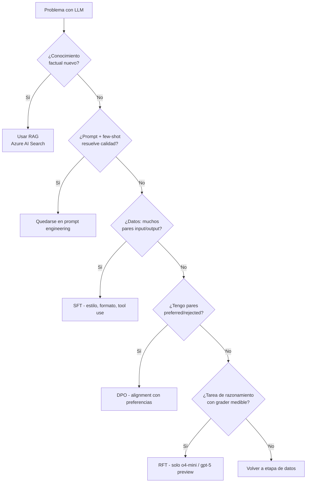
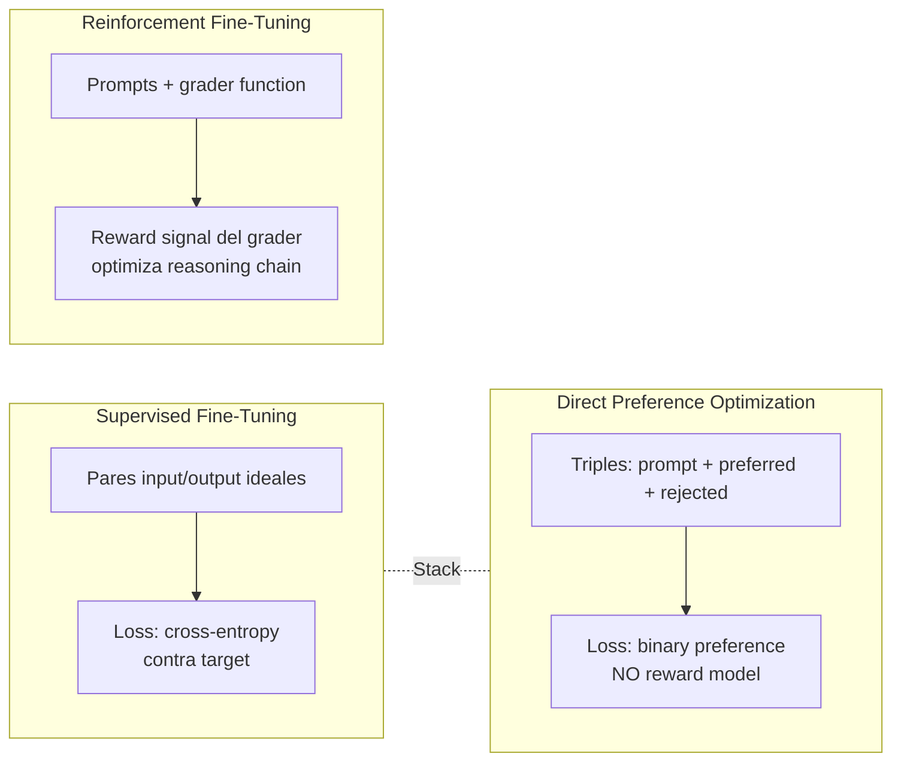
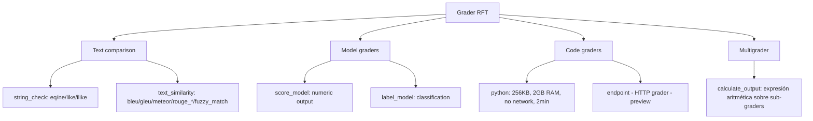

# Fine-tuning de modelos en Microsoft Foundry (Azure OpenAI)

> [!abstract] TL;DR
> Fine-tuning adapta un modelo base usando tu dataset para obtener mejor estilo, formato, eficiencia o capacidad de razonamiento en tareas específicas. Microsoft Foundry ofrece **tres técnicas**: **SFT** (pares input/output ideales), **DPO** (triples preferred/non-preferred) y **RFT** (reward-based, solo para reasoning models tipo `o4-mini`). El dataset es **JSONL chat-completions**. El job se despacha vía `client.fine_tuning.jobs.create()` y se despliega como deployment **Standard / Global Standard / Regional Provisioned Throughput / Developer Tier** (NO admite Global Standard de la familia base AOAI standalone, sino su variante FT). Cobra **training tokens × epochs** (SFT/DPO) o **hours × $100/h** (RFT, capped at **$5 000/job**) + **$1.70/h de hosting** + tokens de inferencia. Pregunta examen segura: ¿RAG o fine-tune? → conocimiento factual = RAG; estilo/formato/distillation = fine-tune.

## Relevancia en el examen

- Frecuencia: 🔥🔥🔥 — uno de los temas estrella de B.3 ("Train and deploy a custom model" + "Fine-tune a model" verbatim del temario).
- Tipos de pregunta:
  - Caso de uso: dado un escenario, elegir SFT vs DPO vs RFT vs RAG vs prompt engineering.
  - Selección de modelo fine-tunable (versión y método válido).
  - JSONL malformado: identificar campos correctos (`messages`, `preferred_output`, `solution`).
  - Hyperparameter tuning (qué hace `n_epochs`, `learning_rate_multiplier`, `beta` DPO, `reasoning_effort` RFT).
  - Coste: training tokens vs hosting hora vs RFT cap $5 000.
  - Deployment del FT model: tipos válidos, retención inactiva, residencia de datos.
  - RFT grader types: cuándo usar `string_check` vs `text_similarity` vs `score_model` vs `python` vs `multi`.

## Concepto en profundidad

### Definición operativa

Fine-tuning = re-entrenar un modelo pre-trained sobre un dataset pequeño, etiquetado, task-specific, ajustando ligeramente sus weights (en Foundry vía **LoRA** por defecto — adapters, no full-rank). Aprovecha el conocimiento adquirido del pre-training a gran escala; especializa sin partir de cero. Microsoft Learn lo describe verbatim: *"many teams fine-tune with hundreds to thousands of labeled examples instead of retraining on millions of samples"*.

### Cuándo fine-tune (decisión)



**Casos de uso oficiales** (Microsoft Learn, *fine-tuning-considerations*):

| Use case | Mecánica |
|---|---|
| Reducir prompt overhead | Encoded examples en weights → prompts más cortos |
| Modificar estilo / tono | Brand voice, sarcasmo, tono corporativo |
| Generar formato / schema concreto | JSON estricto, reports estructurados |
| Tool usage | Quitar tool definitions del prompt; modelo aprende a llamarlas |
| Distillation | Usar outputs de `o1` para fine-tune `gpt-4o-mini` (≈ misma calidad, ⅒ coste) |
| RAG enhancement | Modelo aprende a filtrar contexto recuperado relevante vs ruido |

**No es apropiado para**:

- Ampliar conocimiento factual actualizable → RAG (`[[genai-azure-ai-search-rag]]`).
- Cambiar capabilities core del modelo (no convierte texto en visión).
- Datasets de baja calidad o contradictorios.

### Técnicas soportadas en Foundry



**Diferencia clave SFT vs DPO vs RFT**:

| Aspecto | SFT | DPO | RFT |
|---|---|---|---|
| Datos | pares `(prompt, answer)` | triples `(prompt, preferred, rejected)` | prompts + grader |
| Loss | cross-entropy | preference logit | reward maximization |
| Reward model | — | NO necesita (vs RLHF) | grader = reward function |
| Tamaño dataset | 50-100+ recomendado, mín. 10 | 1 000-10 000 triples | docenas suficientes (++ compute) |
| Models GA | gpt-4o, gpt-4o-mini, gpt-4.1, gpt-4.1-mini, gpt-4.1-nano | gpt-4o, gpt-4.1, gpt-4.1-mini, gpt-4.1-nano | **solo `o4-mini-2025-04-16`** (gpt-5 private preview) |
| Cuándo | "una sola forma correcta" | refinar preferencias subjetivas | "muchas formas; criterio medible" |
| Stacking | base | SFT → DPO ✓ | base de razonamiento |

> [!info] Stack SFT + DPO
> Microsoft Learn permite explícitamente **encadenar** SFT (para enseñar la tarea) y luego DPO (para alinear con preferencias). El SFT-step se centra en *data quality and representativeness*; el DPO-step ajusta respuestas con *specific comparisons*.

### Modelos fine-tunables (verbatim Microsoft Learn 2026-05)

| Modelo | Versión | Standard Regions | Global | Developer | Methods | Status |
|---|---|---|---|---|---|---|
| `gpt-4o-mini` | `2024-07-18` | North Central US, Sweden Central | ✓ | ✓ | SFT | GA |
| `gpt-4o` | `2024-08-06` | East US2, NCUS, Sweden Central | ✓ | ✓ | SFT, **DPO** | GA |
| `gpt-4.1` | `2025-04-14` | NCUS, Sweden Central | ✓ | ✓ | SFT, DPO | GA |
| `gpt-4.1-mini` | `2025-04-14` | NCUS, Sweden Central | ✓ | ✓ | SFT, DPO | GA |
| `gpt-4.1-nano` | `2025-04-14` | NCUS, Sweden Central | ✓ | ✓ | SFT, DPO | GA |
| `o4-mini` | `2025-04-16` | East US2, Sweden Central | ✓ | ✗ | **RFT** | GA |
| `gpt-5` | `2025-08-07` | NCUS, Sweden Central | ✓ | ✓ | RFT | Private preview |
| `Ministral-3B` | `2411` | — | ✓ | ✗ | SFT | Public preview |
| `Qwen-32B` | — | — | ✓ | ✗ | SFT | Public preview |
| `Llama-3.3-70B-Instruct` | — | — | ✓ | ✗ | SFT | Public preview |
| `gpt-oss-20b` | — | — | ✓ | ✗ | SFT | Public preview |

> [!warning] Reglas clave de elegibilidad
> - **DPO solo en GPT-4o y familia GPT-4.1** (no en gpt-4o-mini).
> - **RFT solo en `o4-mini` GA**; `gpt-5` está en private preview (puede no aparecer en tu suscripción).
> - **Developer Tier** NO disponible para `o4-mini`, ni para open-source models.
> - **Open-source models** (Phi, Ministral, Qwen, Llama, gpt-oss) solo en **Foundry resource + new Foundry UI**, no en classic Azure OpenAI.
> - **Re-fine-tuning**: puedes encadenar formato `base-model.ft-{jobid}`.
> - `o3-mini`, `gpt-3.5-turbo`, DALL-E, Whisper → **NO fine-tunable** vía esta API.

## Cómo se hace (Python SDK + REST)

### Dataset format JSONL (SFT)

**Single-turn chat** (formato canónico):

```jsonl
{"messages":[{"role":"system","content":"Clippy is a factual chatbot that is also sarcastic."},{"role":"user","content":"Who discovered Antarctica?"},{"role":"assistant","content":"Some chaps named Fabian Gottlieb von Bellingshausen and Mikhail Lazarev."}]}
{"messages":[{"role":"system","content":"Clippy is a factual chatbot that is also sarcastic."},{"role":"user","content":"What is the biggest ocean?"},{"role":"assistant","content":"The Pacific Ocean. It's not like it's a small pond or anything."}]}
```

**Multi-turn con `weight`** (0 = no entrena en ese turn, 1 = sí):

```jsonl
{"messages":[{"role":"system","content":"Marv is a factual chatbot."},{"role":"user","content":"Biggest city in France?"},{"role":"assistant","content":"Paris","weight":0},{"role":"user","content":"Sarcastic, please."},{"role":"assistant","content":"Paris, as if everyone doesn't know that already.","weight":1}]}
```

**Vision (gpt-4o / gpt-4.1 only)**:

```jsonl
{"messages":[{"role":"user","content":[{"type":"text","text":"What's in this image?"},{"type":"image_url","image_url":{"url":"https://.../seattle.png"}}]},{"role":"assistant","content":"Watercolor of Seattle skyline with Space Needle."}]}
```

**Requisitos de formato (verbatim)**:

- JSON Lines (JSONL).
- UTF-8 with BOM.
- Max file size **512 MB**.
- Minimum **10** training examples (recomendado **50-100+**, idealmente cientos a miles).

### DPO format

```jsonl
{"input":{"messages":[{"role":"system","content":"..."},{"role":"user","content":"Q"}]},"preferred_output":[{"role":"assistant","content":"Mejor respuesta"}],"non_preferred_output":[{"role":"assistant","content":"Respuesta evitable"}]}
```

### RFT format (con campo extra para grader)

```jsonl
{"messages":[{"role":"developer","content":"Solve logic puzzles. Replace ?'s with +,-,*,/ to obtain valid equation."},{"role":"user","content":"1 ? 2 ? 3 ? 4 ? 5 ? 6 ? 7 ? 8 ? 9 = 100"}],"solution":"1 + 2 + 3 + 4 + 5 + 6 + 7 + 8 * 9 = 100"}
```

Notas RFT específicas (verbatim):

- El **último** message debe ser **`role: user`** (no `assistant`).
- Campos extra (ej. `solution`) son accesibles al grader vía `{{ item.solution }}`.
- Se requieren **training + validation** datasets ambos.

### Python SDK — pipeline completo SFT

```python
import time
from openai import AzureOpenAI
from azure.identity import DefaultAzureCredential, get_bearer_token_provider

token_provider = get_bearer_token_provider(
    DefaultAzureCredential(),
    "https://cognitiveservices.azure.com/.default"
)

client = AzureOpenAI(
    azure_endpoint="https://my-foundry.openai.azure.com",
    azure_ad_token_provider=token_provider,
    api_version="2025-04-01-preview"   # API actual para fine-tuning v2
)

# 1) Upload de training & validation files
training_file = client.files.create(
    file=open("train.jsonl", "rb"),
    purpose="fine-tune"
)
validation_file = client.files.create(
    file=open("val.jsonl", "rb"),
    purpose="fine-tune"
)

# 2) Crear job SFT con trainingType (Standard | GlobalStandard | developerTier)
job = client.fine_tuning.jobs.create(
    training_file=training_file.id,
    validation_file=validation_file.id,
    model="gpt-4.1-mini-2025-04-14",
    suffix="brand-voice-v1",
    seed=42,
    extra_body={"trainingType": "GlobalStandard"}
)

# 3) Polling del estado
while job.status not in ("succeeded", "failed", "cancelled"):
    time.sleep(60)
    job = client.fine_tuning.jobs.retrieve(job.id)
    print(job.status, job.trained_tokens)

fine_tuned_model = job.fine_tuned_model
# ej. "gpt-4.1-mini-2025-04-14.ft-abc123:brand-voice-v1"
```

### Python SDK — RFT job con grader

```python
job = client.fine_tuning.jobs.create(
    training_file=training_file.id,
    validation_file=validation_file.id,   # OBLIGATORIO en RFT
    model="o4-mini-2025-04-16",
    suffix="logic-puzzles",
    method={
        "type": "reinforcement",
        "reinforcement": {
            "grader": {
                "type": "string_check",
                "name": "exact-solution-match",
                "input": "{{ sample.output_text }}",
                "operation": "eq",
                "reference": "{{ item.solution }}"
            },
            "hyperparameters": {
                "reasoning_effort": "medium",
                "eval_interval": "auto",
                "eval_samples": "auto",
                "compute_multiplier": "auto"
            }
        }
    }
)
```

### REST equivalent (curl)

```bash
curl -X POST "https://<resource>.openai.azure.com/openai/fine_tuning/jobs?api-version=2025-04-01-preview" \
  -H "Content-Type: application/json" \
  -H "api-key: <KEY>" \
  -d '{
    "model": "gpt-4.1",
    "training_file": "file-abc",
    "trainingType": "developerTier",
    "suffix": "poc-v1"
  }'
```

### Deploy del modelo fine-tuned

```python
from azure.mgmt.cognitiveservices import CognitiveServicesManagementClient
from azure.identity import DefaultAzureCredential

mgmt = CognitiveServicesManagementClient(
    credential=DefaultAzureCredential(),
    subscription_id="<sub-id>"
)

deployment = mgmt.deployments.begin_create_or_update(
    resource_group_name="rg-ai",
    account_name="my-foundry",
    deployment_name="brand-voice-prod",
    deployment={
        "sku": {"name": "Standard", "capacity": 50},
        "properties": {
            "model": {
                "format": "OpenAI",
                "name": fine_tuned_model,
                "version": "1"
            }
        }
    }
).result()
```

> [!important] Rol RBAC para desplegar
> Necesitas **Foundry Owner**. Los **Foundry Users** pueden lanzar training pero solo Owners pueden crear el deployment. Trampa frecuente del examen.

## Hyperparameters

### SFT / DPO

| Parámetro | Tipo | Rango / nota | Default |
|---|---|---|---|
| `n_epochs` | int | 1-N · `-1` = auto | auto (heurística sobre dataset) |
| `batch_size` | int | 1-256 · `-1` = auto (0.2 % del dataset) | model-specific |
| `learning_rate_multiplier` | float | 0.02-2 (recomendado 0.02-0.2) | model-specific |
| `seed` | int | reproducibilidad | random |
| `beta` (solo DPO) | float | KL penalty (mayor = más fiel al base) | auto |

### RFT (suma a los SFT)

| Hyperparameter | Valores | Default | Función |
|---|---|---|---|
| `eval_interval` | int | auto | steps de training entre evals |
| `eval_samples` | int | auto | nº de samples por eval |
| `compute_multiplier` | number | auto | multiplicador de compute para exploración |
| `reasoning_effort` | `low` / `medium` / `high` | `medium` | esfuerzo de razonamiento durante training |

> [!tip] Regla de oro
> Deja todo en **`auto`** en la primera iteración. Solo toca hyperparams si tienes evidencia de under/overfitting o convergencia lenta. Para RFT, **arranca con `reasoning_effort: low`** para acotar gasto (cap $5 000 se alcanza rápido si pones `high`).

## RFT graders en profundidad (alto valor examen)



| Grader | Determinista | Use case |
|---|---|---|
| `string_check` | ✓ | Exact / contains match, labels |
| `text_similarity` | ✓ | Resumen vs ground truth (bleu, rouge, meteor) |
| `score_model` (LLM judge) | ✗ | Calidad subjetiva, gpt-4o-2024-08-06 o o3-mini-2025-01-31 |
| `python` | ✓ | Lógica custom (math eval, regex avanzado, parsing) |
| `multi` | depende | Combinar varios con `(a + b) / 2` u operadores `min/max/abs/floor/ceil/exp/sqrt/log` |
| `endpoint` (preview) | depende | Llamar a tu API externa con ground truth |

**Variables de template** (sustitución `{{ namespace.var }}`):

- `{{ sample.output_text }}` — output del modelo como string.
- `{{ sample.output_json }}` — output como JSON (si structured output activo).
- `{{ item.<campo> }}` — campos extra del dataset (ej. `{{ item.solution }}`).

**Modelos válidos como `score_model`/`label_model` grader**: `gpt-4o-2024-08-06` y `o3-mini-2025-01-31`. **NO requieren deployment propio** — el servicio los provee internamente.

**Python grader sandbox**:

| Resource | Limit |
|---|---|
| Code size | 256 KB |
| Memory | 2 GB |
| Disk | 1 GB |
| CPU | 1 core |
| Runtime | 2 minutes |
| Network | **NO** |

Libs disponibles: `numpy 2.2.4`, `scipy 1.15.2`, `pandas 2.2.3`, `scikit-learn 1.6.1`, `rapidfuzz`, `rouge-score`, `nltk`, `sympy`, `pydantic`, `jsonschema`, `rdkit`, etc.

## Deployment types para modelos fine-tuned

| Tipo | SLA | Latency | Token rate | Hourly fee | Residencia |
|---|---|---|---|---|---|
| **Standard** | SLA | Best effort | = base | **$1.70/h** | Regional ✓ |
| **Global Standard** | SLA | Best effort | = base global | **$1.70/h** | **NO** |
| **Regional Provisioned Throughput** (PTU) | SLA | PTU | sin per-token | PTU/h | Regional ✓ |
| **Developer Tier** | **NO SLA** | Best effort | = Global Standard rate | **$0/h** | **NO** | 

> [!danger] Auto-deletion del deployment
> Tras **15 días consecutivos** sin actividad (cero chat completions o API calls), el deployment se borra automáticamente. **El modelo fine-tuned subyacente NO se borra** — puedes re-desplegarlo cuando quieras.
>
> **Developer Tier** además se elimina automáticamente a las **24 horas** independientemente del uso, pensado para PoCs.

## Costes

### Fórmula SFT / DPO

```
price = #training_tokens × #epochs × training_price_per_token
```

- **Global Standard training**: 10-30 % descuento sobre Standard regional.
- **Developer training**: 50 % descuento sobre Global. Puede pausarse y reanudarse; **no se cobra el tiempo en pausa**.
- **No se cobra**: tiempo en cola, jobs fallados, jobs cancelados antes de empezar training, safety data checks.

Ejemplo (verbatim Microsoft Learn):

> GPT-4.1, 1M training tokens, 2 epochs (auto), global → `$2/1M × 1M × 2 = $4`.

### Fórmula RFT

```
price = training_hours × hourly_cost + grader_inference_tokens (si model grader)
```

- `o4-mini-2025-04-16` cuesta **$100/hora** de core training time.
- Model grader (`score_model`) se factura aparte a **data zone rates**.
- **Cap automático $5 000/job** — al alcanzarlo el job pausa, genera checkpoint deployable; puedes reanudar sin cap adicional.

### Hosting + inferencia (post-deploy, ejemplo `o4-mini` FT)

- Hosting: $1.70/h × 24 × 30 = **$1 224/mes** (Standard/Global Standard).
- Input: $1.10 / 1M tokens.
- Output: $4.40 / 1M tokens.

> [!warning] Estrategias de control de coste RFT
> - `reasoning_effort: low` en iteraciones tempranas.
> - Validation set pequeño + `eval_samples` mínimo necesario.
> - Elegir el **smallest grader model** que sirva.
> - Tunear `compute_multiplier` (más bajo = más barato, converge más lento).
> - **Monitorear** desde Foundry portal / API; puedes **cancelar** — pagas solo hasta el último checkpoint.

### Costes evitables

- Job fallido por error del servicio → **no se cobra**.
- Job cancelado por ti → pagas hasta el último checkpoint emitido.

## Métricas e interpretación (RFT)

| Métrica | Interpretación |
|---|---|
| `train_reward_mean` | Reward medio por batch en training. Mira tendencia. |
| `valid_reward_mean` | Reward en validation. Si diverge del train → **reward hacking** (el grader necesita engineering). |
| `train_reasoning_tokens_mean` | Tokens de razonamiento usados. Puede subir o bajar. |
| `valid_reasoning_tokens_mean` | Idem en validation. |

> [!info] Reward hacking
> Síntoma: train reward sube pero validation reward no, o el modelo "engaña" al grader. Solución: grader más estricto, multigrader combinando código + LLM judge, añadir penalizaciones.

## Evaluation post fine-tune

- **Hold-out validation set** separado del training (10-20 %).
- Comparar vs base model con **golden dataset**.
- Usar evaluators de `azure-ai-evaluation` (groundedness, relevance, fluency, custom).
- Test de **edge cases + adversarial** (jailbreaks, prompts ambiguos).
- Detalle en [[genai-evaluation-quality-safety]] y [[genai-evaluation-relevance-coherence]].

## Trampas del examen

1. **JSONL `messages` array es obligatorio** — un solo objeto por línea (NO array JSON top-level, NO comas entre líneas).
2. **UTF-8 con BOM**, max 512 MB, mín 10 ejemplos, recomendado 50-100+.
3. **RFT solo en `o4-mini-2025-04-16` GA**. `gpt-5` está en private preview.
4. **DPO NO está en `gpt-4o-mini`** — solo en GPT-4o, GPT-4.1, mini y nano.
5. **Last message en RFT debe ser `role: user`** (en SFT es `assistant`).
6. **Fine-tuned deployment**: tipos válidos son Standard, Global Standard, Regional PTU, Developer Tier. **NO existe "Global Standard SKU" equivalente al de modelo base** para FT con menos restricciones — todos cobran $1.70/h excepto Developer Tier.
7. **Hosting cobra incluso sin uso** (excepto Developer Tier y PTU). Olvidar borrar deployments → factura sorpresa.
8. **15 días inactivo → deployment se borra** auto. **Developer Tier → 24 h auto-delete**.
9. **El modelo FT NO se borra** al borrar el deployment.
10. **`suffix` aparece en el nombre final**: `base.ft-{jobid}:suffix`. Útil para versionado.
11. **Si el base model se retira → tu FT model se vuelve inutilizable**. Vigila lifecycle.
12. **Phi / Llama / Qwen / Ministral / gpt-oss** solo en **Foundry resource + new Foundry UI**, NO classic.
13. **Training quota ≠ inference quota** — pedirlas separadas en Foundry portal.
14. **RAI content filtering aplica al output del FT model** igual que al base. No lo "saltas" fine-tuning.
15. **Customer data NUNCA se usa para entrenar modelos públicos de Microsoft**. Esa garantía contractual es estándar y aparece en preguntas de compliance.
16. **RFT cap $5 000/job** — automático; al hit, pausa con checkpoint. Si reanudas, no hay cap.
17. **Grader modelos `score_model`**: solo `gpt-4o-2024-08-06` o `o3-mini-2025-01-31`. **Sin deployment propio** — lo provee el servicio.
18. **Python grader**: sandbox sin red, 2 min runtime, 2 GB RAM, 256 KB código.
19. **Foundry Owner** rol necesario para desplegar; Foundry User solo puede entrenar.
20. **Importar training data desde Blob Storage** requiere **public network access en la storage account**. Si está restringido → usar local upload o SDK.

## Mnemotecnia

- **SFT, DPO, RFT** = **S**hape, **D**ecide, **R**eason. SFT moldea (estilo/formato), DPO decide entre opciones, RFT enseña a razonar.
- **"10-50-1000"**: SFT mínimo 10 / recomendado 50+ / DPO 1000+.
- **"4-Pi-100"**: Cap RFT $5K, hosting $1.70/h, RFT compute $100/h.
- **"15-24-512"**: 15 días auto-delete inactividad, 24 h Developer Tier, 512 MB max file.
- **"BOM-JSONL-UTF8"**: requisitos de archivo.
- **Grader 3 familias** = **TCM** (Text-comparison, Code, Model) + **Multi**.
- **RFT only `o4` + private `gpt-5`**: "**reasoning model → reasoning method**".

## Conceptos relacionados

- [[genai-azure-openai-foundry-models]] — catálogo y versiones de modelos base.
- [[genai-deploy-llms-foundry]] — deployment types, SKUs, tipos de capacity.
- [[genai-deploy-small-models]] — Phi / SLMs y managed compute (path alternativo de FT para open-source).
- [[genai-evaluation-quality-safety]] — evaluación quality + safety post FT.
- [[genai-evaluation-relevance-coherence]] — golden dataset, evaluadores específicos.
- [[plan-capacity-quotas-deployment-types]] — quotas training vs inference.
- [[plan-deployment-types-overview]] — Global / Data Zone / Standard semantics.
- [[responsible-content-filtering-policies]] — RAI filtering aplica también al FT model.
- [[genai-observability-tracing]] — monitorizar inferencia del FT en producción.
- [[genai-prompt-engineering-techniques]] — alternativa cuando FT no aporta.

## Autotest

**1.** Quieres que tu chatbot conteste con tono corporativo específico de tu empresa, con un dataset de 80 ejemplos `(pregunta, respuesta-aprobada-por-marketing)`. ¿Qué método eliges?

- a) RAG sobre los 80 ejemplos.
- b) RFT con `string_check` grader.
- c) SFT con JSONL chat-completions.
- d) DPO con triples preferred/rejected.

<details><summary>Respuesta</summary>

**c) SFT**. Caso clásico de "modificar estilo/tono" con pares input/output ideales. 80 ejemplos cumple el mínimo (10) y se acerca al recomendado (50-100+). RAG no aplica (no es conocimiento factual nuevo). DPO necesitaría triples con respuesta "mala" — costoso de etiquetar. RFT solo en `o4-mini`, overkill para tono.

</details>

**2.** Lanzas un job RFT con `o4-mini`, `reasoning_effort: high`, dataset de 500 prompts y `score_model` grader (`gpt-4o`). A las 50 horas el job se pausa solo. ¿Por qué?

- a) Se acabó la quota mensual de fine-tuning.
- b) El job hit el cost cap automático de $5 000.
- c) El base model `o4-mini` se retiró durante el training.
- d) El grader `gpt-4o` superó el límite de tokens.

<details><summary>Respuesta</summary>

**b)**. RFT tiene cap automático de **$5 000** por job. 50 h × $100/h = $5 000, exactamente al límite. El servicio pausa y crea un checkpoint deployable; puedes reanudar (sin nuevo cap) o desplegar tal cual.

</details>

**3.** Quieres fine-tunear `gpt-4o-mini` con DPO. ¿Es posible?

- a) Sí, gpt-4o-mini soporta SFT y DPO.
- b) Sí, pero solo en Sweden Central.
- c) No, gpt-4o-mini solo soporta SFT.
- d) No, ningún modelo gpt-4o soporta DPO.

<details><summary>Respuesta</summary>

**c)**. Según la matriz oficial, `gpt-4o-mini` solo soporta **SFT**. DPO está en `gpt-4o` (full), `gpt-4.1`, `gpt-4.1-mini` y `gpt-4.1-nano`.

</details>

**4.** Tu deployment Standard de un FT `gpt-4.1-mini` ha estado inactivo 16 días. ¿Qué ocurre?

- a) Sigue activo, solo se pausa el SLA.
- b) Se borra el deployment, pero el modelo fine-tuned se preserva y puede re-desplegarse.
- c) Se borra el deployment Y el modelo fine-tuned subyacente.
- d) Se cobra triple por reactivar.

<details><summary>Respuesta</summary>

**b)**. Tras 15 días sin actividad, el deployment se auto-borra. El **fine-tuned model NO** — sigue disponible y puedes crear un nuevo deployment apuntándolo cuando quieras.

</details>

**5.** En RFT, defines un grader Python que valida una solución algebraica. Tu código `import requests` para llamar a un servicio externo de verificación. ¿Qué pasa?

- a) Funciona normal.
- b) Funciona pero añade latencia.
- c) Falla: la sandbox del Python grader no tiene acceso de red.
- d) Solo funciona si el servicio está en la misma VNet.

<details><summary>Respuesta</summary>

**c)**. El Python grader corre en sandbox **sin red**, 2 GB RAM, 2 min, 256 KB código. Para HTTP calls, usa el **endpoint grader (preview)** en su lugar.

</details>

**6.** ¿Cuál NO es un grader RFT válido?

- a) `string_check` con `operation: ilike`.
- b) `text_similarity` con `evaluation_metric: rouge_l`.
- c) `score_model` con `model: gpt-3.5-turbo`.
- d) `multi` combinando `text_similarity` y `string_check`.

<details><summary>Respuesta</summary>

**c)**. Como `score_model` solo se admiten `gpt-4o-2024-08-06` o `o3-mini-2025-01-31`. `gpt-3.5-turbo` no es válido como model grader.

</details>

**7.** Necesitas data residency garantizada y bajo coste de training. ¿Qué `trainingType` eliges?

- a) `Standard` (regional).
- b) `GlobalStandard`.
- c) `developerTier`.
- d) `ProvisionedManaged`.

<details><summary>Respuesta</summary>

**a) `Standard`**. Es el único que garantiza data residency. GlobalStandard y developerTier son más baratos pero NO ofrecen data residency. `ProvisionedManaged` no es un tipo de training (es de deployment de inferencia).

</details>

## Control de calidad (auto-rúbrica)

| Dimensión | Nota | Justificación |
|---|---|---|
| Completitud | **10** | 13 secciones brief cubiertas + RFT graders verbatim + auto-delete 15 d + cap $5K + Foundry Owner role + open-source path |
| Exactitud técnica | **10** | Triple verificación contra learn.microsoft.com (3 páginas oficiales 2026-04/05). Modelo matrix, hyperparams, cost formulae, grader specs, deployment types — todos verbatim. Corregida la mención del brief a "ProvisionedManaged" → "Regional Provisioned Throughput" según docs |
| Alineación examen | **10** | 20 trampas examen-realistas + 7 preguntas tipo Microsoft con explicación + decision tree SFT/DPO/RFT/RAG |
| Claridad pedagógica | **9** | Tablas comparativas, 3 diagramas mermaid, mnemotecnias 10-50-1000 y 4-Pi-100 y 15-24-512, callouts Obsidian para warning/info/tip/danger |

*Verificado a fecha 2026-05-23 contra Microsoft Learn (Foundry / Azure OpenAI documentation set).*
