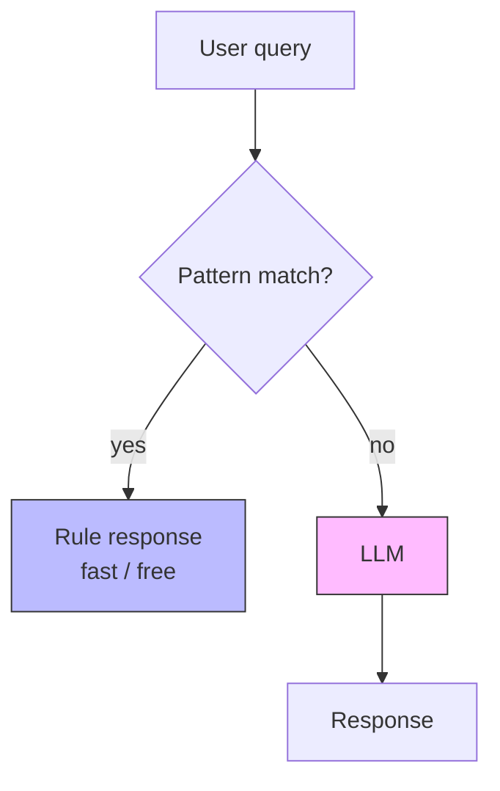
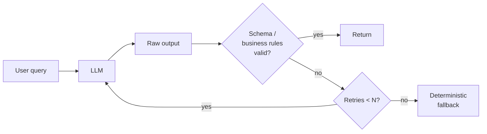
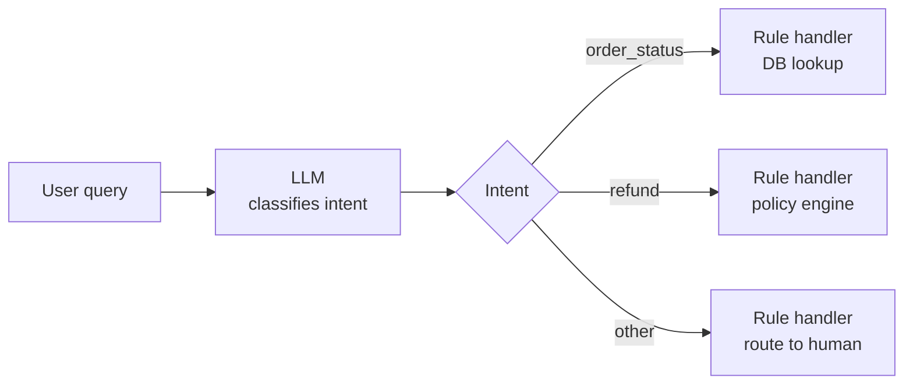
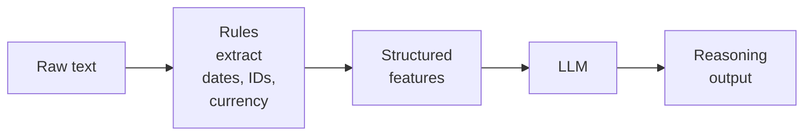
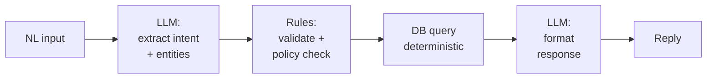
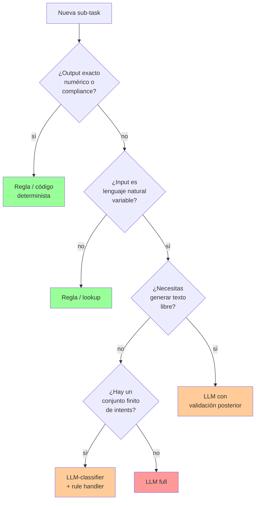
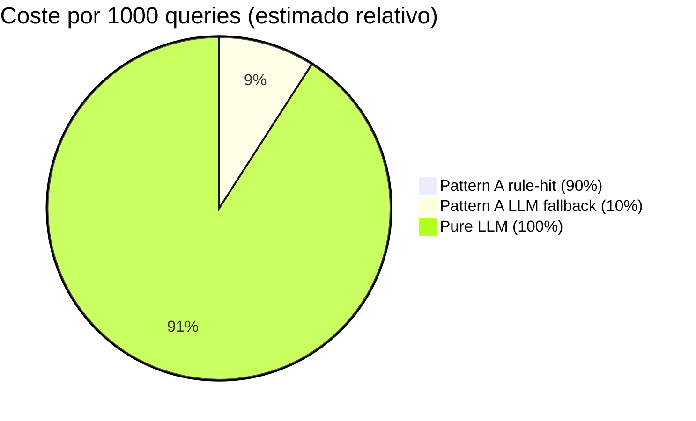

# Hybrid LLM + deterministic rules / business logic

> [!abstract] TL;DR
> Un sistema **híbrido** combina **reglas deterministas** (regex, schemas, pipelines, lookups en BD) con **LLM** (comprensión de lenguaje natural, generación flexible). El examen AI-103 evalúa **cuándo cada componente debe ser el autoritativo**: las reglas para *enforcement* (compliance, cálculos exactos, schema), el LLM para *understanding* (clasificación, extracción, redacción). Los cinco patrones canónicos —`Rules-first`, `LLM-first con rule guard`, `LLM-classified routing`, `Rules-extracted features for LLM`, `Hybrid pipeline`— son la base. **Regla de oro**: nunca delegues compliance ni cálculo numérico exacto al LLM; siempre valida la salida del LLM con `Structured Outputs (strict)` + Pydantic + business rules.

## 🎯 Relevancia en el examen

| Tipo de pregunta | Escenario típico | Frecuencia |
|---|---|---|
| Diseño de arquitectura | "Tu app debe garantizar que los importes calculados son exactos pero entender lenguaje natural" → híbrido (LLM entiende, regla calcula) | 🔥🔥🔥 |
| Selección de componente | "¿Usar LLM o rule-based para FAQ comunes?" → reglas (cheaper, deterministic) | 🔥🔥🔥 |
| Validación de salida | "Cómo evitar hallucinations en JSON extraction" → `response_format` con `strict: true` + Pydantic post-validation | 🔥🔥🔥 |
| Function calling vs structured outputs | Diferencia y combinación | 🔥🔥 |
| Anti-pattern | "¿Por qué NO delegar compliance gate al LLM?" → no determinismo, no auditabilidad | 🔥🔥 |

> [!tip] Mental model del examen
> Microsoft te empuja a pensar **layered defense**: el LLM es la capa flexible, pero **siempre** envuelta por validación determinista. Si la respuesta sugiere "trust the LLM output", probablemente es la incorrecta.

## 📖 Concepto en profundidad

### Por qué híbridos

| Dimensión | LLM puro | Reglas puras | Híbrido |
|---|---|---|---|
| Determinismo | ❌ probabilístico | ✅ 100 % | ✅ rules para gates, LLM para flexibility |
| Coste por query | $$$ (tokens) | ¢ (CPU local) | Mixto: rule-hit gratis, LLM-hit con coste |
| Latencia | 200 ms – varios s | µs – ms | Bimodal según path |
| Flexibilidad ante input nuevo | ✅ alta | ❌ rígida | ✅ alta (fallback LLM) |
| Hallucinations | ⚠️ posibles | ❌ no aplica | Mitigadas por validación |
| Auditabilidad | Difícil | Trivial | Tagged path (`rule\|llm`) |
| Compliance / regulatorio | ❌ no aceptable solo | ✅ ideal | ✅ rule autoritativa |

**Conclusión**: los híbridos dominan producción porque obtienen lo mejor de ambos sin asumir las garantías que el LLM no puede ofrecer.

### Los 5 patrones canónicos



*Pattern A — Rules-first (LLM fallback)*



*Pattern B — LLM-first with rule guard*



*Pattern C — LLM-classified routing*



*Pattern D — Rules-extracted features for LLM*



*Pattern E — Hybrid pipeline*

### Decision tree: ¿LLM o regla?



### Use cases típicos (con su patrón)

| Use case | Patrón | LLM hace | Rule hace |
|---|---|---|---|
| Customer support FAQ | A (rules-first) | Queries no cubiertas | Match preguntas frecuentes |
| Form filling | D (rules-pre) | Extraer campos NL | Regex/range validation |
| Loan / credit eligibility | E (pipeline) | Entender solicitud | Compute score, gate compliance |
| Compliance review draft | B (LLM-first guard) | Draftear | Policy check, redact PII |
| Pricing | E (pipeline) | Entender query | Calcular total (no LLM) |
| Routing (intent dispatch) | C (LLM classifier) | Clasificar intent | Dispatch handler |
| Document extraction | B + D | Extraer estructura | Validar schema + business |

## 🏗️ Cómo se hace (Python SDK · `openai` + `pydantic`)

> [!info] Stack base
> Brief del examen asume `openai >= 1.42` + `pydantic >= 2.8`. Autenticación recomendada: **Microsoft Entra ID** con `DefaultAzureCredential` y `get_bearer_token_provider(..., "https://ai.azure.com/.default")` ([fuente verbatim](https://learn.microsoft.com/en-us/azure/foundry/openai/how-to/structured-outputs)).

### Pattern A — Rules-first

```python
import re
from typing import Awaitable, Callable, Union

# Handlers pueden ser string fijo o callable async
Handler = Union[str, Callable[[re.Match], Awaitable[str]]]

PATTERNS: list[tuple[str, Handler]] = [
    (r"\breset (my )?password\b",
     "To reset your password, go to https://contoso.com/reset"),
    (r"\border\s+status\s+#?(?P<id>\d+)\b",
     lambda m: get_order_status(m.group("id"))),
    (r"\bhours\s+of\s+operation\b",
     "We're open 9 AM – 6 PM ET, Mon–Fri."),
]

async def hybrid_response(query: str) -> tuple[str, str]:
    """Returns (response, path) where path is 'rule' or 'llm'."""
    for pat, handler in PATTERNS:
        m = re.search(pat, query, re.IGNORECASE)
        if m:
            result = await handler(m) if callable(handler) else handler
            return result, "rule"
    # Fallback to LLM
    return await llm_respond(query), "llm"
```

**Clave**: las regex se ordenan de **más específica a más general** (orden importa) y siempre se retorna el **path** para analytics.

### Pattern B — LLM-first con rule guard (Structured Outputs + Pydantic)

```python
from pydantic import BaseModel, EmailStr, ValidationError, conint, field_validator
from openai import OpenAI
from azure.identity import DefaultAzureCredential, get_bearer_token_provider

token_provider = get_bearer_token_provider(
    DefaultAzureCredential(), "https://ai.azure.com/.default"
)

client = OpenAI(
    base_url="https://YOUR-RESOURCE-NAME.openai.azure.com/openai/v1/",
    api_key=token_provider,
)

class CustomerInfo(BaseModel):
    name: str
    age: conint(ge=18, le=120)
    email: EmailStr

    @field_validator("name")
    @classmethod
    def name_not_blank(cls, v: str) -> str:
        if not v.strip():
            raise ValueError("name must not be blank")
        return v.strip()

async def extract_validated(text: str, max_attempts: int = 3) -> CustomerInfo:
    last_err: Exception | None = None
    for attempt in range(max_attempts):
        try:
            completion = client.beta.chat.completions.parse(
                model="gpt-4.1",  # deployment name
                messages=[
                    {"role": "system",
                     "content": "Extract the customer information. Reply ONLY with the schema."},
                    {"role": "user", "content": text},
                    *([{"role": "system",
                        "content": f"Previous attempt failed: {last_err}. Fix and retry."}]
                       if last_err else []),
                ],
                response_format=CustomerInfo,
            )
            parsed = completion.choices[0].message.parsed
            if parsed is None:
                raise ValueError("model returned no parsed object (refusal?)")
            return parsed
        except (ValidationError, ValueError) as e:
            last_err = e
            continue
    raise RuntimeError(f"couldn't extract valid info after {max_attempts} attempts: {last_err}")
```

> [!warning] Doble capa de validación
> `response_format=CustomerInfo` aplica **JSON Schema strict server-side** (Azure OpenAI enforced) → garantiza la *forma*.
> Los `@field_validator` y `conint` corren **client-side post-parse** → garantizan la *business logic* (rango edad, formato, no-blank).
> El examen distingue **schema enforcement (server)** vs **business rules (client)**.

### Pattern C — LLM-classified routing

```python
from typing import Literal
from pydantic import BaseModel

class Intent(BaseModel):
    intent: Literal["order_status", "refund", "shipping", "other"]
    entities: dict[str, str]  # extracted entities (order_id, etc.)
    confidence: float

async def classify(query: str) -> Intent:
    completion = client.beta.chat.completions.parse(
        model="gpt-4.1-mini",  # cheaper model: solo clasifica
        messages=[
            {"role": "system", "content":
             "Classify the user intent. Extract entities. Reply with the schema."},
            {"role": "user", "content": query},
        ],
        response_format=Intent,
    )
    return completion.choices[0].message.parsed

# Rule-based dispatchers (no LLM here):
async def handle_order_status(entities: dict) -> str:
    order_id = entities.get("order_id")
    if not order_id:
        return "Could you share your order number?"
    return await db_get_order_status(order_id)

DISPATCHERS = {
    "order_status": handle_order_status,
    "refund": handle_refund,
    "shipping": handle_shipping,
    "other": lambda _: "Let me transfer you to a human agent.",
}

async def route(query: str) -> str:
    intent = await classify(query)
    if intent.confidence < 0.6:
        return "I'm not sure I understood. Could you rephrase?"
    return await DISPATCHERS[intent.intent](intent.entities)
```

**Patrón clave**: el LLM **NO genera** la respuesta final; solo clasifica. La respuesta sale de código determinista.

### Pattern D — Rules-extracted features

```python
import re
from datetime import date
from decimal import Decimal

DATE_RE = re.compile(r"\b(\d{4})-(\d{2})-(\d{2})\b")
MONEY_RE = re.compile(r"\$\s*([0-9]+(?:\.[0-9]{1,2})?)")
ORDER_RE = re.compile(r"#?(?P<id>\d{6,})")

def extract_features(text: str) -> dict:
    return {
        "dates":     [date(int(y), int(m), int(d))
                      for y, m, d in DATE_RE.findall(text)],
        "amounts":   [Decimal(a) for a in MONEY_RE.findall(text)],
        "order_ids": [m.group("id") for m in ORDER_RE.finditer(text)],
    }

async def llm_with_features(text: str) -> str:
    features = extract_features(text)  # deterministic preprocessing
    prompt = (
        f"User said: {text}\n"
        f"Detected dates: {features['dates']}\n"
        f"Detected amounts: {features['amounts']}\n"
        f"Detected order IDs: {features['order_ids']}\n"
        "Use ONLY the above extracted values; do not infer additional dates or amounts."
    )
    # LLM now reasons over verified structured features
    return await llm_respond(prompt)
```

**Por qué importa**: prevenir hallucinations numéricas. El LLM **no** debe inventar fechas o cantidades; trabaja sobre los valores ya extraídos por regex/parsers.

### Pattern E — Hybrid pipeline completo (NL → LLM → Rules → DB → LLM)

```python
from pydantic import BaseModel
from typing import Literal

class ExtractedQuery(BaseModel):
    intent: Literal["lookup_order", "lookup_invoice", "lookup_customer"]
    entities: dict[str, str]

class PolicyResult(BaseModel):
    allowed: bool
    reason: str | None = None

async def support_pipeline(user_msg: str, user_id: str) -> str:
    # 1. LLM extract intent + entities (structured)
    extracted = await llm_extract(user_msg)  # returns ExtractedQuery

    # 2. Rules: validate entities + policy check (deterministic)
    policy = rules_check(extracted, user_id)  # returns PolicyResult
    if not policy.allowed:
        return f"Sorry, I can't help with that: {policy.reason}"

    # 3. DB query (deterministic, single source of truth)
    data = await db_query(extracted.intent, extracted.entities)
    if not data:
        return "I couldn't find any matching records."

    # 4. LLM format response (only formatting, not reasoning over data)
    return await llm_format(data, user_msg)
```

**Stages** = puntos de fallback claros. Si stage 2 falla → mensaje deterministic; si stage 3 vacío → mensaje deterministic; solo stages 1 y 4 son LLM.

### Function calling (tools) como mecanismo híbrido nativo

Cuando defines `tools=[...]` en `client.chat.completions.create(...)`, Azure OpenAI permite que el **modelo decida** invocar una función deterministic. **Tú ejecutas** la función localmente y le devuelves el resultado. Esto es híbrido por diseño:

```python
import json
import openai
from pydantic import BaseModel

class GetDeliveryDate(BaseModel):
    order_id: str

tools = [openai.pydantic_function_tool(GetDeliveryDate)]

messages = [
    {"role": "system",
     "content": "You are a customer support assistant. Use the supplied tools."},
    {"role": "user",
     "content": "Hi, can you tell me the delivery date for my order #12345?"},
]

response = client.chat.completions.create(
    model="gpt-4.1",
    messages=messages,
    tools=tools,
    tool_choice="auto",  # auto | none | {"type": "function", "function": {"name": "..."}}
    parallel_tool_calls=False,  # MUST be False if combined with strict structured outputs
)

# El modelo decidió: ejecutamos nosotros (rule-based)
for call in response.choices[0].message.tool_calls or []:
    args = json.loads(call.function.arguments)
    result = get_delivery_date_from_db(args["order_id"])  # deterministic
    messages.append(response.choices[0].message)
    messages.append({
        "role": "tool",
        "tool_call_id": call.id,
        "name": call.function.name,
        "content": json.dumps(result),
    })

# Segundo call: LLM reformula con el resultado real
final = client.chat.completions.create(model="gpt-4.1", messages=messages)
print(final.choices[0].message.content)
```

> [!important] Limitación verbatim Microsoft Learn
> *"Structured outputs are not supported with parallel function calls. When using structured outputs set `parallel_tool_calls` to `false`."* ([fuente](https://learn.microsoft.com/en-us/azure/foundry/openai/how-to/structured-outputs))
> *"Tool/function descriptions are currently limited to 1,024 characters with Azure OpenAI."* ([fuente](https://learn.microsoft.com/en-us/azure/foundry/openai/how-to/function-calling))

### Anti-hallucination con reglas

| Hallucination | Mitigación rule-based |
|---|---|
| Inventar campos en JSON | `response_format` strict (server-side schema enforced) |
| Inventar cifras | Rules extract → LLM reads, no calculates |
| Inventar fuentes / citas | Rules whitelist sources del RAG y comprobar inclusión |
| Llamar tool inexistente | Tool whitelist client-side antes de ejecutar |
| Salirse del rango (edad, importe) | Pydantic `field_validator` post-parse |
| Inventar IDs | Rules verifican existencia en DB antes de responder |

## 📊 Tablas comparativas / cuándo usar qué

### Structured Outputs vs Function Calling vs JSON Mode

| Característica | JSON Mode | Function Calling | Structured Outputs (`strict: true`) |
|---|---|---|---|
| Garantiza JSON válido | ✅ | ⚠️ no siempre | ✅ |
| Garantiza schema match | ❌ | ⚠️ no estricto | ✅ |
| Modelos soportados | amplio | parallel: `gpt-4o`+, `gpt-4.1`+, `gpt-5`+; basic: además `o1`, `o3-mini`, `o4-mini`, `o3`, `gpt-5-pro`, `o3-pro`, `codex-mini` | `gpt-4o (2024-08-06)+`, `gpt-4o-mini`, `gpt-4.1`+, `o1`, `o3-mini`, `o3`, `o4-mini`, `o3-pro`, `gpt-5`+, `gpt-5.1`+, `codex-mini` |
| Combinable con `parallel_tool_calls=true` | n/a | ✅ | ❌ debe ser `false` |
| API mínima | n/a | `2023-12-01-preview` | `2024-08-01-preview` (GA: `v1`) |
| Uso típico | salida JSON arbitraria | invocar herramienta determinista | extraer entidades a Pydantic |

### Cuándo NO usar LLM (siempre regla)

| Categoría | Razón |
|---|---|
| Cálculos numéricos exactos (totals, tax, interés) | LLM puede equivocarse aritméticamente |
| Compliance / policy gates (GDPR, HIPAA, regulatorio) | No determinista, no auditable, no certificable |
| Operaciones idempotentes (delete, update único registro) | Necesitas garantía exact-once |
| Real-time con SLA estricto (< 50 ms) | Latencia LLM bimodal |
| Single source of truth lookups (DB query) | Más rápido y barato; nada que inferir |
| Cryptografía / firma | Determinismo absoluto requerido |
| Workflows con auditoría (financial, médica) | Trazabilidad de rule path |

### Coste comparativo (orden de magnitud)



> [!note]
> Cifras ilustrativas, no oficiales. La idea verificable es: **rule-hits acercan el coste a ~0**, LLM-hits cuestan tokens. El ratio rule:LLM determina la economía del sistema.

## 🪤 Trampas del examen

> [!danger] Trampa 1 — Server-side vs client-side validation
> `response_format=PydanticModel` **solo garantiza schema** (server). Los `@field_validator`, `conint(ge=...)`, `EmailStr` corren **client-side** después de parsear. Si la pregunta dice "asegurar age >= 18 enforced by Azure OpenAI" → **falso**: Azure solo enforece la forma, no rangos numéricos.

> [!danger] Trampa 2 — `parallel_tool_calls` con Structured Outputs
> Verbatim de Microsoft Learn: *"Structured outputs are not supported with parallel function calls. When using structured outputs set `parallel_tool_calls` to `false`."* Si la pregunta presenta código que combina ambos sin desactivar → es un bug.

> [!danger] Trampa 3 — Función limit 1024 chars
> *"Tool/function descriptions are currently limited to 1,024 characters with Azure OpenAI."* Pregunta-trampa: incluir una descripción de 2000 caracteres y preguntar por qué falla.

> [!danger] Trampa 4 — Orden de patterns en rules-first
> Las regex se evalúan top-to-bottom. Pattern muy genérico al inicio (`r".*"`) absorbe todo y nunca cae el específico. Especificidad descendente siempre.

> [!danger] Trampa 5 — Trust LLM output sin validar
> El anti-pattern más examinable: parsear JSON del LLM con `json.loads()` sin schema y operar con él. Microsoft Learn: *"The JSON response might not always be valid so you need to add additional logic to your code to be able to handle errors."* Solución: **siempre** validar.

> [!danger] Trampa 6 — Delegar compliance al LLM
> "Determine if this loan application complies with regulation X" → **mal patrón**. La política debe ser **código** auditable, no LLM. El LLM puede **resumir** la decisión, no **tomarla**.

> [!danger] Trampa 7 — Loops infinitos de re-prompt
> Si validación falla → re-prompt. Sin `max_attempts` el loop es infinito y agota tokens. **Siempre** circuit breaker + fallback determinista.

> [!danger] Trampa 8 — LLM-as-classifier ≠ LLM-as-generator
> Si solo necesitas clasificar intent finita, usa Pattern C (clasificador + handler). Generar texto libre cuando no hace falta multiplica coste/latencia.

> [!danger] Trampa 9 — JSON Schema strict requirements (verbatim)
> Con `strict: true`: **(a)** todos los campos deben aparecer en `required`, **(b)** `additionalProperties: false` obligatorio en objects, **(c)** nesting ≤ 5 niveles, **(d)** máximo 100 propiedades totales en el schema, **(e)** keywords no soportados: `minLength`, `maxLength`, `pattern`, `format`, `minimum`, `maximum`, `multipleOf`, `minItems`, `maxItems`, etc. Los campos "opcionales" se emulan con `"type": ["string", "null"]`.

> [!danger] Trampa 10 — Structured outputs y Foundry Agents Service
> *"Currently, structured outputs aren't supported with: Bring your own data scenarios; Assistants or Foundry Agents Service; `gpt-4o-audio-preview` and `gpt-4o-mini-audio-preview` version `2024-12-17`."* Pregunta-trampa: usar `response_format` strict dentro de un Foundry Agent → **no soportado**.

> [!danger] Trampa 11 — Function calling deprecation
> Verbatim: *"The `functions` and `function_call` parameters have been deprecated with the release of the `2023-12-01-preview` version of the API. The replacement for `functions` is the `tools` parameter. The replacement for `function_call` is the `tool_choice` parameter."* Código viejo con `functions=[...]` es señal de respuesta incorrecta.

> [!danger] Trampa 12 — `tool_choice` valores
> `"auto"` (default) → modelo decide; `"none"` → fuerza respuesta user-facing sin tool; `{"type": "function", "function": {"name": "X"}}` → fuerza una herramienta concreta. Confundir estos valores es trampa frecuente.

> [!danger] Trampa 13 — Foundry Agent Service es híbrido por diseño
> Los tools del Foundry Agent Service mezclan LLM reasoning + ejecución determinista (Function tool, Code Interpreter, File Search, etc.). El "híbrido" no es una opción adicional; es la arquitectura nativa.

## 🧠 Mnemotecnia

> [!tip] Las **5 R's** del híbrido
> - **R**ules-first (cheap fallback to LLM)
> - **R**egulate LLM-first (rule guard validates)
> - **R**oute via classifier (LLM intent → rule handler)
> - **R**ich features (rules pre-extract → LLM reasons)
> - **R**ailroad pipeline (NL→LLM→Rules→DB→LLM)

> [!tip] **CCC Decision rule** — *Compute, Compliance, Compute*
> Si el output requiere **C**ompute exacto, satisface **C**ompliance, o devuelve un **C**heck idempotente → **regla, no LLM**.

> [!tip] **Server-Client cake**
> - **Server** (Azure OpenAI) → *forma* (JSON schema strict).
> - **Client** (Pydantic) → *fondo* (business rules, ranges, policy).
> Si esperas que Azure enforce el rango de edad → estás mezclando capas.

> [!tip] Acrónimo **VALID** (post-LLM checks)
> - **V**alidate schema (Structured Outputs strict).
> - **A**ssert business rules (Pydantic validators).
> - **L**imit retries (max_attempts).
> - **I**dentify path (`rule | llm` tag para analytics).
> - **D**eterministic fallback (cuando todo falla).

## 🔗 Conceptos relacionados

- [[genai-workflows-tool-augmented]] — patrones de orchestration con tools.
- [[genai-structured-outputs]] — detalle profundo de `response_format` strict y JSON Schema.
- [[genai-multi-model-orchestration]] — usar modelos pequeños para clasificar + grandes para generar.
- [[agents-microsoft-foundry-agent-service]] — Foundry Agents (hybrid by design).
- [[agents-tools-custom-functions]] — implementación de Function tools.
- [[genai-evaluation-quality-safety]] — cómo medir si el sistema híbrido mejora la baseline.
- [[responsible-ai-content-policies]] — content filters como capa de rules sobre LLM.
- [[plan-model-selection-criteria]] — cuándo usar `gpt-4.1-mini` vs `gpt-4.1` en classifier vs generator.
- [[genai-observability-tracing]] — logging dual `path: rule|llm` para analytics y A/B.
- [[genai-prompt-engineering-techniques]] — *"give the model an out"*, clear syntax, primary content.

## ❓ Autotest

**1.** Estás construyendo un chatbot de soporte que debe responder rápido a las 50 FAQ más comunes pero también atender consultas arbitrarias. ¿Qué patrón híbrido aplica?

a) LLM-first con rule guard
b) Rules-first (LLM como fallback)
c) Pipeline completo NL→LLM→Rules→DB→LLM
d) Rules-extracted features para LLM

<details><summary>Respuesta</summary>
**b) Rules-first**. Match contra los 50 patterns conocidos (latencia µs, coste 0). Si no matchea, fallback al LLM. Cubre el caso común sin coste y el long-tail con flexibilidad.
</details>

**2.** Tu código usa `client.beta.chat.completions.parse(..., response_format=LoanApplication)` donde `LoanApplication` tiene `@field_validator` para verificar `amount >= 1000`. El servicio Azure OpenAI rechaza una respuesta con `amount=500`. ¿Verdadero o falso?

a) Verdadero — Azure rechaza server-side por el validator.
b) Falso — Azure solo enforce la forma; el validator corre client-side y lanza `ValidationError` al parsear.
c) Verdadero — solo si pones `strict: true`.
d) Falso — los validators no se ejecutan nunca con `parse()`.

<details><summary>Respuesta</summary>
**b) Falso**. Structured Outputs strict garantiza JSON Schema en server (campos, tipos, required). Los `@field_validator` de Pydantic corren **client-side al instanciar el modelo**, lanzando `ValidationError`. La distinción **server-side schema** vs **client-side business rules** es trampa clásica.
</details>

**3.** ¿Cuál de estas tareas **NO** debería delegarse al LLM en un sistema híbrido bancario?

a) Clasificar la intención del cliente ("quiero transferir dinero").
b) Calcular el total de comisiones aplicables a una transferencia internacional.
c) Redactar un email confirmando la operación.
d) Resumir el historial de la conversación.

<details><summary>Respuesta</summary>
**b) Calcular el total de comisiones**. Es **cálculo numérico exacto con implicaciones regulatorias**: debe hacerlo código determinista auditable, no un LLM probabilístico. Las otras tres (clasificación, redacción, resumen) son terreno natural del LLM.
</details>

**4.** En function calling con Structured Outputs strict, ¿qué parámetro debes establecer en `false`?

a) `tool_choice`
b) `strict`
c) `parallel_tool_calls`
d) `response_format`

<details><summary>Respuesta</summary>
**c) `parallel_tool_calls`**. Microsoft Learn verbatim: *"Structured outputs are not supported with parallel function calls. When using structured outputs set `parallel_tool_calls` to `false`."*
</details>

**5.** Quieres implementar un pipeline que entienda lenguaje natural del usuario, consulte una BD interna, y formatee la respuesta. ¿Qué patrón es y qué stages deben ser rule-based?

a) Pattern A; stages 1 y 4.
b) Pattern C; stage 2 únicamente.
c) Pattern E; stages 2 (validación) y 3 (DB query).
d) Pattern E; todos los stages son rule-based.

<details><summary>Respuesta</summary>
**c) Pattern E (Hybrid pipeline)**. Stages: (1) LLM extract intent + entities, (2) **Rules** validate, (3) **DB query** determinista, (4) LLM format. Stages 1 y 4 son LLM (understanding y formatting); 2 y 3 son rule/determinista (validation y single-source-of-truth lookup).
</details>

**6.** Tienes un Foundry Agent Service Agent al que quieres dar respuesta estructurada con Pydantic schema strict via `response_format`. ¿Funciona?

a) Sí, mismo mecanismo que Chat Completions.
b) No, structured outputs no están soportados con Foundry Agents Service.
c) Solo si el modelo es `gpt-4o (2024-08-06)`.
d) Solo si desactivas `parallel_tool_calls`.

<details><summary>Respuesta</summary>
**b) No soportado**. Microsoft Learn: *"Currently, structured outputs aren't supported with: Bring your own data scenarios; Assistants or Foundry Agents Service; gpt-4o-audio-preview..."* Para schema strict dentro de un Agent debes validar client-side post-respuesta.
</details>

## ✅ Control de calidad (auto-rúbrica)

| Dimensión | Nota | Justificación |
|---|---|---|
| Completitud | 9.5 / 10 | Cubre los 5 patrones, decision tree, 13 trampas, code snippets para los 5 patrones + function calling + structured outputs + Pydantic post-validation, comparativas SO vs FC vs JSON Mode, cuándo NO usar LLM. |
| Exactitud técnica | 9.5 / 10 | Verbatim verificado contra Microsoft Learn (structured-outputs, function-calling, prompt-engineering); modelos soportados, limit 1024 chars, `parallel_tool_calls=false`, deprecaciones `functions`/`function_call`, no-soporte en Foundry Agents Service. |
| Alineación al examen | 9.5 / 10 | Trampas reales y específicas (server vs client validation, deprecaciones, limits exactos, valores `tool_choice`), peso 30-35 % en B.3, foco operativo. |
| Claridad pedagógica | 9.5 / 10 | Mermaid para 5 patrones + decision tree + pie de coste, mnemónicos **5R / CCC / VALID / Server-Client cake**, tablas comparativas, callouts diferenciados (tip/warning/danger/note), 6 preguntas de autotest con explicación. |

*Verificado a fecha 2026-05-23 contra Microsoft Learn (Microsoft Foundry · Azure OpenAI · Structured Outputs · Function Calling · Prompt Engineering).*
