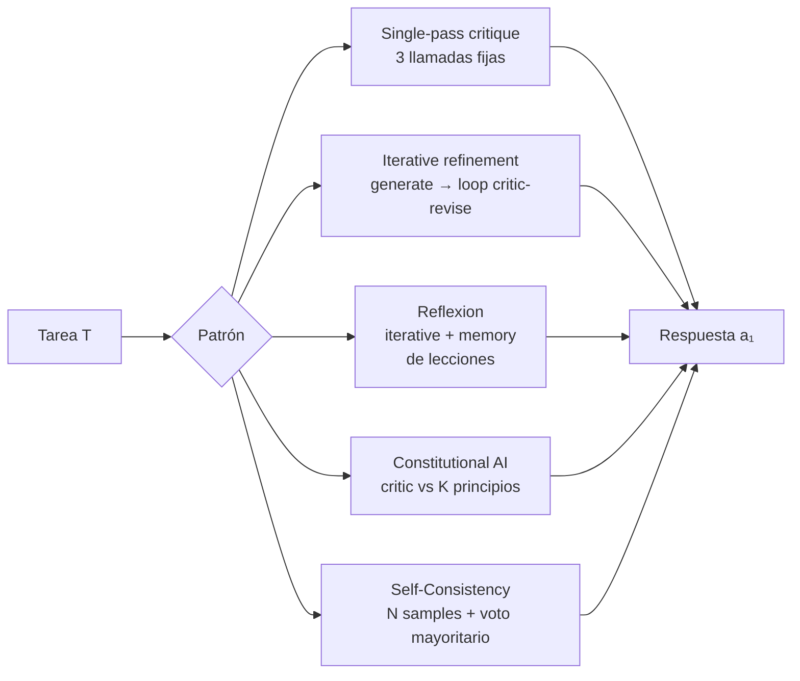
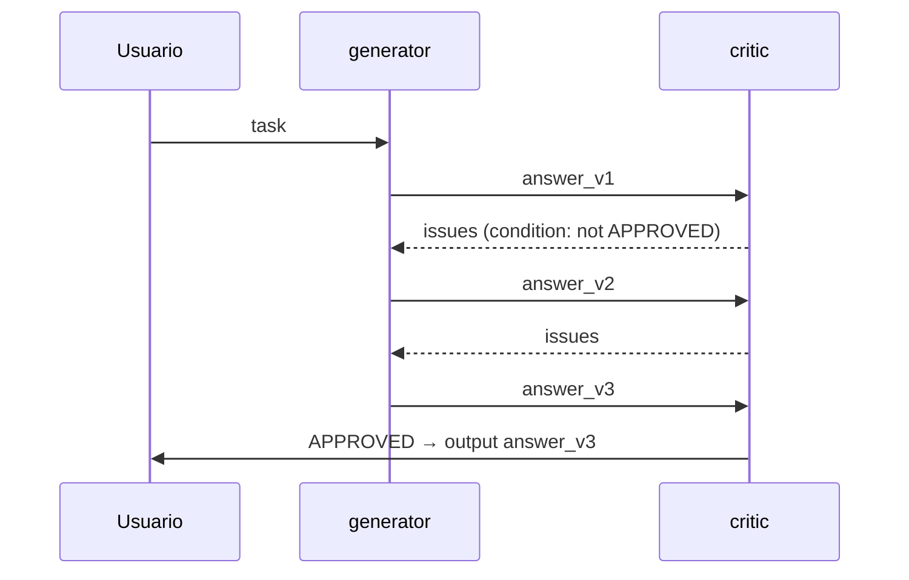
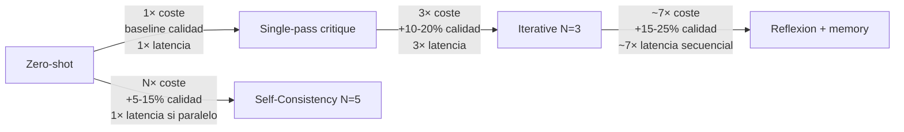
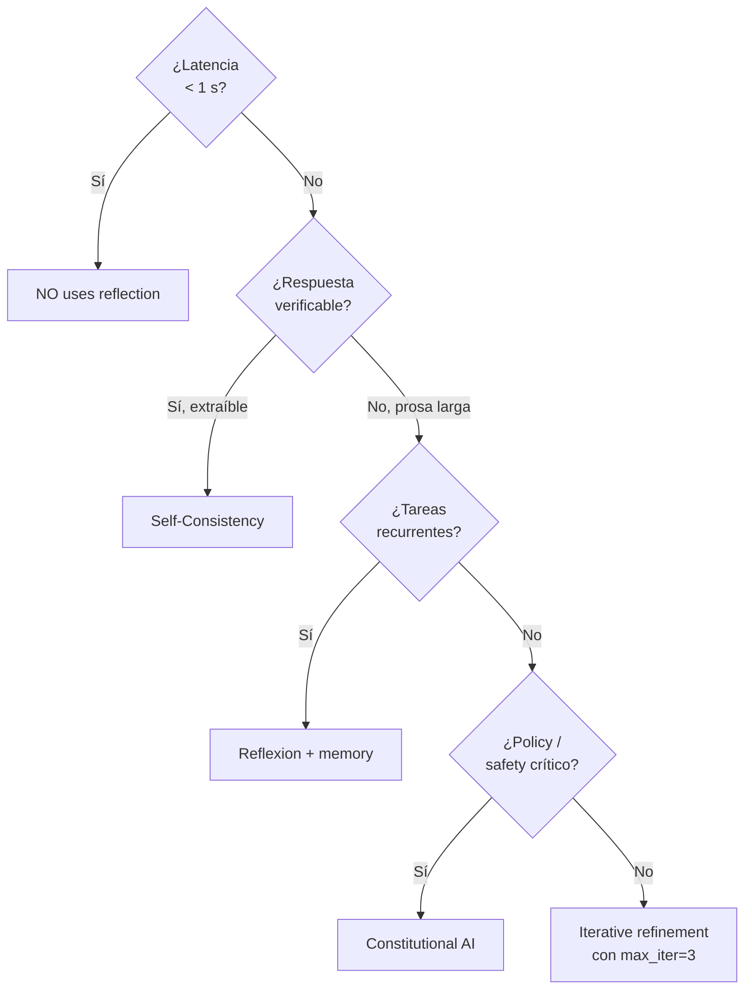

# Reflection y self-critique — el LLM se revisa a sí mismo para mejorar sin re-entrenar

> [!abstract] TL;DR
> **Reflection / self-critique** es la familia de patrones en los que un LLM **produce → critica → revisa** su propia salida en una o más pasadas, mejorando calidad a coste de N× tokens/latencia. Microsoft examina en AI-103 cuatro variantes: **single-pass critique**, **iterative refinement (refiner loop)**, **Reflexion** (refinamiento con **memoria** de errores) y **Self-Consistency** (muestreo + voto mayoritario, sin crítico explícito). En Microsoft Agent Framework se materializa con **`WorkflowBuilder`** y **`AddEdge` con condition** que cierra el bucle generator ↔ critic. **Constitutional AI** añade un set de principios que el crítico evalúa uno a uno. ⚠️ Trampa nuclear: con **reasoning models (gpt-5, o-series)** **NO** se hace CoT prompting manual, pero **sí** sigue siendo útil una pasada de crítica externa con criterios específicos.

## 🎯 Relevancia en el examen

| Vector | Frecuencia |
|---|---|
| Distinguir Reflection (genérico) vs Reflexion (con memory) | 🔥🔥🔥 |
| Saber que Self-Consistency NO usa crítico, sólo muestreo + voto | 🔥🔥🔥 |
| Implementar un workflow generator↔critic con `WorkflowBuilder` y `AddEdge(condition=...)` | 🔥🔥🔥 |
| Trade-off coste / calidad / latencia (3×, N×, K×) | 🔥🔥 |
| Cuándo NO usar reflection (latency-critical, reasoning models suficientes) | 🔥🔥 |
| Constitutional AI con K principios → K llamadas por chequeo | 🔥🔥 |
| Reflection vs CoT (ReAct, multistep-reasoning) — son patrones distintos | 🔥🔥 |
| Selección de modelo cheaper (gpt-4o-mini) para el critic pass | 🔥 |

Tipo de pregunta típica: *"Tu agente jurídico produce drafts con omisiones de cláusulas. Necesitas mejorar calidad sin re-fine-tunar y dispones de presupuesto de tokens. ¿Qué patrón aplicas?"* → **Iterative refinement / Reflection con critic-refiner loop** y stop condition explícito (`max_iter` o `"APPROVED"`).

## 📖 Concepto en profundidad

### 1) Definición precisa

Un **patrón de reflection / self-critique** es un *meta-prompting workflow* donde:

1. Un LLM (o agente) **genera** una respuesta candidata $a_0$ a la tarea $T$.
2. Un LLM (mismo o distinto, normalmente con system prompt de "reviewer") **evalúa/critica** $a_0$ contra criterios (rúbrica, principios, ground truth verificable, política).
3. El LLM **revisa** $a_0 \to a_1$ incorporando la crítica.
4. Opcionalmente se itera $a_1 \to a_2 \to \dots a_n$ hasta cumplir un criterio.

**Objetivo:** mejorar **groundedness, completeness, accuracy, safety** sin tocar pesos del modelo. **Coste:** lineal o multiplicativo en llamadas — siempre $\geq$ 2× zero-shot.

> [!info] Reflection ≠ Chain-of-Thought
> CoT/ReAct (ver [[genai-multistep-reasoning-pipelines]] y [[genai-chain-of-thought-evaluations]]) es **razonamiento intra-respuesta** (el modelo piensa antes de responder en **una** pasada). Reflection es **inter-respuesta**: hay **varias** llamadas separadas (generate / critique / revise). Pueden combinarse.

### 2) Taxonomía oficiosa de patrones (la que pregunta el examen)



#### 2.1 Single-pass critique (estructura mínima)

- **3 llamadas** fijas: `generate` → `critique` → `revise`.
- Stop "duro" tras una pasada.
- Coste ~**3×** vs zero-shot.

#### 2.2 Iterative refinement (refiner loop)

- Bucle `critique`-`revise` hasta cumplir **stop condition**:
  - critic devuelve marcador de satisfacción (`APPROVED`, `NO ISSUES`, `excellent`).
  - se alcanza `max_iter` (típico 3–5).
  - **no hay mejora** detectada (delta ≈ 0; útil para evitar bucle infinito).
- Coste hasta **(N+1)×** zero-shot.

#### 2.3 Reflexion (refinement + memory)

- Igual que iterative refinement, **más** una **memoria persistente** de lecciones aprendidas (`self.memory: list[str]`).
- En cada intento se incluyen las lessons previas en el system prompt.
- Útil cuando el agente afronta **muchas tareas similares** (multi-task) y los errores son recurrentes.
- ⚠️ **Reflexion (con memory)** ≠ **Reflection genérica** (sin memory). El examen distingue.

#### 2.4 Constitutional AI

- Set declarativo de **principios** (`PRINCIPLES = [...]`).
- El crítico evalúa la salida **contra cada principio**: K principios → **K llamadas** por chequeo.
- Si hay violaciones, se reescribe respetando todas.
- Útil para **policy compliance** (PII, sesgo, disclaimers médico/legal/financiero, citaciones).

#### 2.5 Self-Consistency

- **No** hay crítico separado.
- Se muestrean **N respuestas independientes** con `temperature > 0` (recomendado ≥0.7).
- Se aplica **voto mayoritario** sobre la respuesta extraída (o agregación si es numérica).
- **Sólo funciona** cuando la respuesta es **verificable / extraíble** (número, etiqueta, código que ejecuta).
- Coste **N×**. Latencia paralelizable.

> [!warning] Self-Consistency necesita `temperature > 0`
> Con temperatura 0, las N muestras son idénticas (determinismo aproximado). El voto colapsa a la primera. El patrón pierde sentido. **Usa `temperature ≈ 0.7–1.0`** y, si tu API lo permite, `seed` distintos por muestra para independencia real.

### 3) Reflection vs reasoning models (o-series, gpt-5)

Según `learn.microsoft.com/en-us/azure/foundry/openai/how-to/reasoning`:

- Los modelos **gpt-5 series, o3, o4-mini, o1** realizan **razonamiento interno** (`reasoning_tokens`) controlable con `reasoning_effort` (`minimal | low | medium | high`, y `xhigh` en `gpt-5.1-codex-max`).
- **NO** se les hace **CoT prompting manual** ("think step by step"): es redundante y puede degradar.
- **SÍ** sigue siendo válido un **critique externo** con criterios específicos (groundedness contra fuente, cumplimiento de schema, principios constitucionales) que el reasoning interno no garantiza.
- Patrón recomendado: **reasoning model como `generator`** + **modelo más barato (gpt-4o-mini) como `critic`**.

## 🏗️ Implementación

### 4) Single-pass critique (Python + Azure OpenAI)

```python
# pip install openai
from openai import AzureOpenAI

client = AzureOpenAI(
    azure_endpoint="https://<resource>.openai.azure.com/",
    api_key="<key>",
    api_version="2025-04-01-preview",
)

def generate_with_critique(query: str, system: str = "You are an expert.") -> str:
    # Paso 1 — generate
    gen = client.chat.completions.create(
        model="gpt-4.1",
        messages=[
            {"role": "system", "content": system},
            {"role": "user", "content": query},
        ],
    )
    initial = gen.choices[0].message.content

    # Paso 2 — critique
    critique_prompt = f"""You are a critical reviewer. Review the answer below for
accuracy, completeness, and clarity. Identify issues. If excellent, answer exactly:
'NO ISSUES'.

Question: {query}
Answer: {initial}"""

    crit = client.chat.completions.create(
        model="gpt-4o-mini",  # critic más barato
        messages=[{"role": "user", "content": critique_prompt}],
    )
    critique = crit.choices[0].message.content
    if "NO ISSUES" in critique:
        return initial

    # Paso 3 — revise
    revise_prompt = f"""Revise the answer based on the critique.

Question: {query}
Original: {initial}
Critique: {critique}

Revised answer:"""
    rev = client.chat.completions.create(
        model="gpt-4.1",
        messages=[{"role": "user", "content": revise_prompt}],
    )
    return rev.choices[0].message.content
```

### 5) Iterative refinement (refiner loop con stop condition)

```python
def refine_loop(query: str, max_iter: int = 3, threshold: str = "approved") -> tuple[str, int]:
    answer = _initial_generation(query)
    for i in range(max_iter):
        critique = _critic(query, answer)
        low = critique.lower()
        if threshold in low or "no issues" in low:
            return answer, i + 1                       # stop por criterio
        new_answer = _refine(query, answer, critique)
        if new_answer.strip() == answer.strip():
            return answer, i + 1                       # stop por no-mejora
        answer = new_answer
    return answer, max_iter                            # stop por max_iter
```

> [!tip] Stop conditions obligatorios
> Un refiner loop **sin** stop condition es un bug: itera hasta agotar cuota. **Siempre** combina al menos dos: `max_iter` y un marcador positivo (`APPROVED`, `"excellent"`, `"NO ISSUES"`). Añade un tercero — **no-improvement** — para tareas donde el critic nunca aprueba (perfeccionismo del crítico).

### 6) Reflexion con memoria persistente

```python
class ReflexionAgent:
    def __init__(self, client: AzureOpenAI, model: str = "gpt-4.1"):
        self.client = client
        self.model = model
        self.memory: list[str] = []          # lessons learned acumuladas

    def execute(self, task: str, max_retries: int = 2) -> str:
        for _ in range(max_retries + 1):
            attempt = self._attempt(task, lessons=self.memory)
            feedback = self._evaluate(task, attempt)
            if feedback["success"]:
                return attempt
            lesson = self._extract_lesson(task, attempt, feedback)
            self.memory.append(lesson)
        return attempt                       # último intento aunque no exitoso

    def _attempt(self, task: str, lessons: list[str]) -> str:
        system = "You are an expert. Past lessons learned:\n- " + "\n- ".join(lessons) \
                 if lessons else "You are an expert."
        r = self.client.chat.completions.create(
            model=self.model,
            messages=[{"role": "system", "content": system},
                      {"role": "user", "content": task}],
        )
        return r.choices[0].message.content
```

> [!info] Persistir la memoria
> En producción, `self.memory` no vive en RAM. Persiste lecciones en un **vector store** (Azure AI Search, Cosmos DB) para recuperar las relevantes por **similarity** a la nueva tarea, no todas. Esto evita inflar el contexto.

### 7) Constitutional AI

```python
PRINCIPLES = [
    "Do not include personally identifiable information (PII).",
    "Be respectful and avoid stereotypes.",
    "Cite sources for factual claims.",
    "Avoid medical, legal or financial advice without an explicit disclaimer.",
]

def constitutional_check(response: str) -> list[str]:
    violations: list[str] = []
    for p in PRINCIPLES:
        prompt = (f"Does the following response violate this principle: '{p}'?\n"
                  f"Answer 'YES' or 'NO' followed by a brief reason.\n\n"
                  f"Response: {response}")
        r = client.chat.completions.create(
            model="gpt-4o-mini",
            messages=[{"role": "user", "content": prompt}],
        )
        verdict = r.choices[0].message.content.strip()
        if verdict[:3].upper() == "YES":
            violations.append(p)
    return violations
```

### 8) Self-Consistency (voto mayoritario)

```python
import collections, re

def extract_final_answer(text: str) -> str:
    # ejemplo: extraer último número como respuesta final
    m = re.findall(r"-?\d+(?:\.\d+)?", text)
    return m[-1] if m else text.strip().splitlines()[-1]

def self_consistency(query: str, n: int = 5, model: str = "gpt-4.1") -> str:
    answers: list[str] = []
    for _ in range(n):
        r = client.chat.completions.create(
            model=model,
            messages=[{"role": "user", "content": query}],
            temperature=0.8,                   # > 0 imprescindible
        )
        answers.append(extract_final_answer(r.choices[0].message.content))
    return collections.Counter(answers).most_common(1)[0][0]
```

### 9) Microsoft Agent Framework — Reflection workflow con conditional edge

Microsoft Agent Framework Workflows ofrece **`WorkflowBuilder`** con **executors** y **edges**. Las **conditional edges** permiten cerrar el bucle `critic → generator` cuando no se aprueba la salida (feedback loop). Cita verbatim del doc oficial (`agent-framework/workflows/edges`):

> *"Conditional edges allow your workflow to make routing decisions based on the content or properties of messages flowing through the workflow. This enables dynamic branching where different execution paths are taken based on runtime conditions."*

```python
from agent_framework import WorkflowBuilder
from agent_framework.azure import AzureOpenAIChatClient

client = AzureOpenAIChatClient(deployment_name="gpt-4.1")

generator = client.create_agent(
    instructions="Solve the user's task to the best of your ability.",
    name="generator",
)
critic = client.create_agent(
    instructions=(
        "You are a strict reviewer. Reply with exactly 'APPROVED' if the answer "
        "is correct, complete and clear. Otherwise list specific issues to fix."
    ),
    name="critic",
)

workflow = (
    WorkflowBuilder(start_executor=generator)
    .add_edge(generator, critic)
    # feedback loop: si NO está APROBADO, vuelve al generator para revisión
    .add_edge(
        critic,
        generator,
        condition=lambda msg: "APPROVED" not in (msg.content or ""),
    )
    .build()
)
```

> [!warning] Nombres exactos de API (Python)
> El doc oficial usa `WorkflowBuilder(start_executor=...)`, `.add_edge(source, target, condition=...)` y `.build()`. El cliente Azure OpenAI se importa como `from agent_framework.azure import AzureOpenAIChatClient` y se instancian agentes con `client.create_agent(instructions=..., name=...)`. El método `as_agent()` existe sobre `FunctionalWorkflow` / `Workflow` para **envolver** un workflow como agente, **no** para crear agentes desde el client. ⚠️ Mezclar las dos APIs es trampa típica.



### 10) Combinar reasoning model + critic externo (pattern recomendado)

```python
# generator de alta capacidad de razonamiento
gen = client.chat.completions.create(
    model="gpt-5",
    reasoning_effort="medium",                # low | medium | high (no usar CoT manual)
    messages=[{"role": "user", "content": task}],
    max_completion_tokens=4096,
)
answer = gen.choices[0].message.content

# critic cheaper, criterios verificables (groundedness, schema, política)
crit = client.chat.completions.create(
    model="gpt-4o-mini",
    messages=[{"role": "user", "content": f"Check that answer follows policy P. Reply APPROVED or list issues.\n\n{answer}"}],
)
```

## 📊 Comparativa rápida de patrones

| Patrón | Llamadas | Memory | Necesita critic explícito | Requiere temp>0 | Verificable | Uso típico |
|---|---|---|---|---|---|---|
| Single-pass critique | 3 | No | Sí | No | Cualquier task | Mejorar drafts puntuales |
| Iterative refinement | 1 + 2·n | No | Sí | No | Cualquier task | Drafts largos, polish iterativo |
| Reflexion | 1 + 2·n + memory | **Sí** | Sí (evaluator) | No | Multi-task | Agentes con tareas recurrentes |
| Constitutional AI | 1 + K + 1 | No | Sí (K-check) | No | Policy-bound | Safety / compliance |
| Self-Consistency | N (paralelo) | No | **No** | **Sí** | **Sí (extraíble)** | Math, código, clasificación |

### Matriz coste/calidad/latencia



### Árbol de decisión rápido



## 🪤 Trampas del examen

1. **Reflection ≠ Reflexion.** *Reflection* = familia genérica de critic-refiner. *Reflexion* (Shinn et al., 2023) = iterative refinement **con memoria persistente** de lecciones. El examen distingue.
2. **Self-Consistency NO usa critic explícito.** Sólo muestreo + voto mayoritario. Si la pregunta menciona "critic / reviewer / judge", **no** es self-consistency.
3. **Self-Consistency requiere `temperature > 0`.** Con `temp=0`, las muestras colapsan a la misma respuesta y el voto es trivial. Trampa clásica.
4. **Iterative refinement sin stop condition explícito** es bug. Examen: "qué falta en este código?" → `max_iter` y/o marcador positivo del critic.
5. **Constitutional AI con K principios → K llamadas** en el check phase. Si el examen pregunta por coste de un check con 4 principios, la respuesta es **4× del modelo crítico**, no 1×.
6. **Reasoning models (gpt-5, o3, o4-mini) NO usan CoT manual** pero **sí** se benefician de **critique externa**. Combinar `reasoning_effort` interno + critic externo es el patrón premium.
7. **`reasoning_effort` valores válidos**: `minimal | low | medium | high`; `xhigh` sólo en `gpt-5.1-codex-max`; `None` soportado en gpt-5.1+ para desactivar reasoning. `o1-mini` **no** acepta `reasoning_effort`.
8. **`max_completion_tokens` (Chat Completions) / `max_output_tokens` (Responses)** con reasoning models, **no** `max_tokens`. Mezclar es error sutil.
9. **Conditional edge en Agent Framework** se crea con `.add_edge(source, target, condition=callable)` donde el callable recibe el mensaje y devuelve `bool`. Si la condition es `True`, fluye; si `False`, **no** fluye por esa edge.
10. **Output verificable (regex, ejecución de código, schema validation)** es **superior** a LLM-as-judge cuando aplica. El examen prefiere "verificable" frente a "LLM-judge" si la tarea lo permite (math, JSON, código).
11. **Critic con modelo más barato** (`gpt-4o-mini`) es práctica recomendada para optimizar coste; usar el mismo modelo en ambos roles es desperdicio (salvo que criticidad y latencia lo justifiquen).
12. **Reflexion: independencia de la memoria entre tareas** — si conservas lecciones de tarea A para tarea B no relacionada, contaminas. Recupera memoria por **similarity** (vector store), no FIFO global.
13. **Sample independence en Self-Consistency**: si tu API cachea (algunas implementaciones cachean por prompt + temperature determinístico), la independencia desaparece. Usa `seed` distintos o `temperature` alta para garantizar diversidad.
14. **Reflection ≠ Evaluation offline** ([[agents-evaluation-behavior-error-analysis]]). Reflection es **online**, en tiempo de inferencia, **mejora la salida**. Evaluation es **offline / batch** sobre un golden dataset, **mide calidad**.

## 🧠 Mnemotecnia

- **"SIRCS"** — los cinco patrones por orden de complejidad creciente: **S**ingle-pass → **I**terative → **R**eflexion → **C**onstitutional → **S**elf-Consistency.
- **"GCR"** — pasos del single-pass: **G**enerate → **C**ritique → **R**evise (3 llamadas).
- **Regla del 3×:** un single-pass critique cuesta **3×** y normalmente da **+10-20%** de calidad. Si el caso de uso no soporta 3× tokens, no uses reflection.
- **"Memoria = Reflexion, sin memoria = Reflection genérica".** Para recordarlo: la `x` de **Refle**`x`**ion** parece la cruz del archivador (memory).
- **"Self-Consistency = jurado".** N jurados independientes (`temperature > 0`) deciden por **mayoría**. Sin juez, sin crítica — sólo voto.

## 🔗 Conceptos relacionados

- [[genai-multistep-reasoning-pipelines]] — CoT / ReAct intra-respuesta; complementario a reflection.
- [[genai-chain-of-thought-evaluations]] — evaluar la cadena de pensamiento (es output del reasoning, no del critic).
- [[genai-workflows-tool-augmented]] — workflows con tools; los reflection workflows son un sub-tipo.
- [[genai-prompt-engineering-techniques]] — el critic vive de su system prompt; reglas de redacción.
- [[genai-model-parameters-tuning]] — `temperature`, `reasoning_effort`, parámetros del generator/critic.
- [[genai-evaluation-quality-safety]] — métricas (groundedness, relevance, coherence) que el critic puede instrumentar.
- [[genai-evaluation-fabrications-hallucinations]] — reflection como mitigación de alucinaciones verificables.
- [[agents-microsoft-agent-framework]] — `WorkflowBuilder`, `add_edge`, executors.
- [[agents-multi-agent-orchestration]] — generator/critic es un patrón multi-agent.
- [[agents-evaluation-behavior-error-analysis]] — evaluación offline (no confundir con reflection online).
- [[genai-observability-tracing]] — trazar las N llamadas del loop para entender coste y latencia.

## ❓ Autotest

**1.** Un agente jurídico produce drafts con omisiones de cláusulas. Quieres mejorar calidad sin re-fine-tunar, dispones de presupuesto de tokens y la salida es prosa larga no verificable por regex. ¿Qué patrón implementas?

- a) Self-Consistency con `temperature=0.8`.
- b) Constitutional AI con 1 principio.
- c) Iterative refinement (critic-refiner loop) con `max_iter=3` y marcador `APPROVED`.
- d) CoT prompting manual con `"think step by step"`.

<details><summary>Respuesta</summary>

**c)**. Prosa larga no verificable + posibilidad de gastar tokens = refiner loop. (a) requiere respuesta extraíble; (b) un principio único no resuelve completeness; (d) es razonamiento intra-respuesta, no reflection, y no aborda la omisión sistemática.
</details>

**2.** ¿Cuál es la diferencia esencial entre **Reflection** genérica y **Reflexion**?

- a) Reflexion usa `temperature > 0`; Reflection no.
- b) Reflexion mantiene **memoria de lecciones aprendidas** entre intentos/tareas; Reflection no.
- c) Reflexion sólo aplica a reasoning models.
- d) Reflection es un único pase, Reflexion siempre son 3.

<details><summary>Respuesta</summary>

**b)**. Reflexion = iterative refinement + **memory** (lessons persistidas, idealmente en vector store). Las demás son distractores.
</details>

**3.** Estás construyendo un workflow generator↔critic en Microsoft Agent Framework y quieres que cuando el critic NO devuelva `APPROVED`, el mensaje vuelva al generator. ¿Cuál es la línea correcta?

- a) `wb.add_edge(critic, generator)` (sin condition; siempre).
- b) `wb.add_edge(critic, generator, condition=lambda m: "APPROVED" not in m.content)`.
- c) `wb.connect(critic, generator, when="not APPROVED")`.
- d) `wb.add_loop(generator, critic, until="APPROVED")`.

<details><summary>Respuesta</summary>

**b)**. `WorkflowBuilder.add_edge(source, target, condition=callable)` recibe un callable que retorna `bool`. (a) crearía un loop infinito sin condición de parada; (c) y (d) no existen en la API.
</details>

**4.** ¿Cuándo NO deberías usar Self-Consistency?

- a) Problemas de aritmética con respuesta numérica.
- b) Clasificación con conjunto cerrado de etiquetas.
- c) Generación de un ensayo creativo con criterios subjetivos no extraíbles.
- d) Generación de código que debe pasar tests unitarios.

<details><summary>Respuesta</summary>

**c)**. Self-Consistency necesita una **respuesta extraíble** para votar. En un ensayo creativo no hay un "answer" comparable entre N muestras. (a), (b), (d) son los casos de uso clásicos del paper original.
</details>

**5.** Tu generator es `gpt-5` con `reasoning_effort="high"`. Quieres añadir un critic externo cheaper. ¿Qué afirmaciones son correctas? (multi-select)

- a) Es redundante porque `gpt-5` ya hace CoT interno; añadir critic no aporta.
- b) Combinar reasoning generator + critic externo con criterios verificables es **recomendado**.
- c) En `gpt-5` debes pasar `max_completion_tokens` (Chat Completions) o `max_output_tokens` (Responses), no `max_tokens`.
- d) Debes añadir `"think step by step"` al system prompt del generator.

<details><summary>Respuesta</summary>

**b) y c)**. (a) es la trampa: el reasoning interno no valida groundedness/policy/schema, por eso el critic externo aporta. (c) verbatim del doc de reasoning. (d) es **antipatrón** con reasoning models — no hagas CoT manual.
</details>

## ✅ Control de calidad (auto-rúbrica)

| Dimensión | Nota |
|---|---|
| Completitud (cubre 13 sub-puntos del brief + APIs verbatim Agent Framework + reasoning models) | **9.5/10** |
| Exactitud técnica (verificado contra `learn.microsoft.com/agent-framework/workflows/edges`, `…/openai/how-to/reasoning`, `…/foundry/concepts/safety-evaluations-transparency-note`) | **9.5/10** |
| Alineación al examen (14 trampas reales, árbol de decisión, 5 Q&A estilo examen) | **9/10** |
| Claridad pedagógica (mermaid x3, tablas comparativas, mnemónicos SIRCS / GCR / 3×) | **9/10** |

*Verificado a fecha 2026-05-23 contra Microsoft Learn (Agent Framework Workflows, Foundry reasoning models, Foundry safety evaluations transparency note).*
