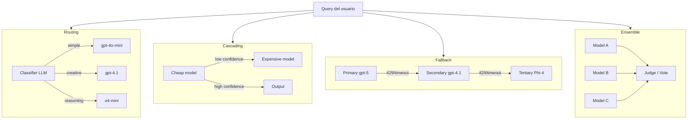
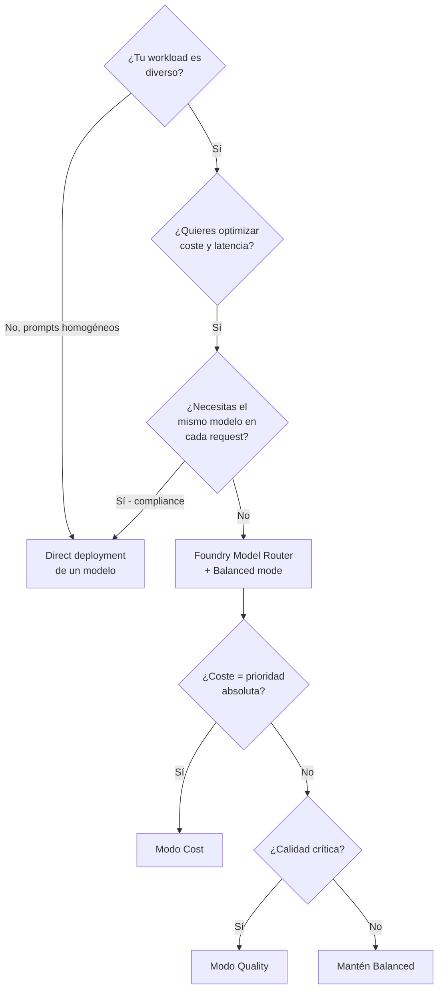
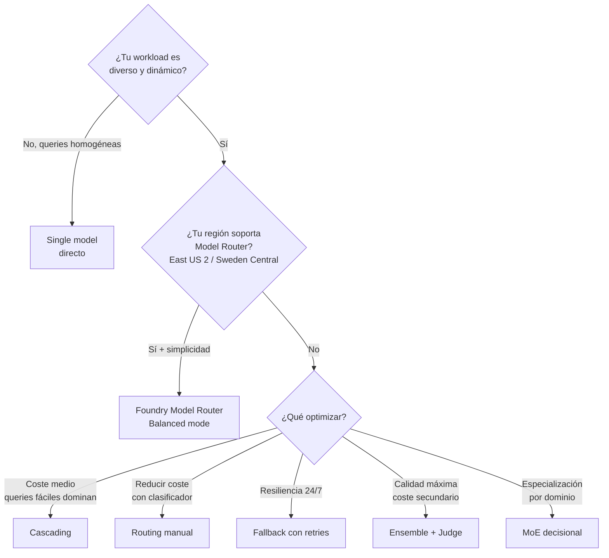

# Orquestación multi-modelo (routing · cascading · fallback · ensemble · Foundry Model Router)

> [!abstract] TL;DR
> La **orquestación multi-modelo** consiste en usar **varios LLM/SLM coordinados** desde un mismo flujo para optimizar **coste, calidad y latencia** — *no* confundir con multi-agente (ahí orquestas agentes; aquí orquestas *modelos*). Los cinco patrones clásicos son **Routing**, **Cascading**, **Fallback**, **Ensemble** y **MoE decisional**. Microsoft Foundry ofrece desde 2025 un servicio gestionado, **Foundry Model Router** (`2025-11-18` latest), que implementa routing inteligente con modos `Balanced`/`Cost`/`Quality`, failover automático y model subsets — es la **respuesta canónica** en preguntas de examen cuando se busca *"reduce cost while maintaining quality with minimal code changes"*.

## 🎯 Relevancia en el examen

Frecuencia: 🔥🔥🔥 — bloque B.3 (peso 30-35 %) y centro de la sub-tarea verbatim *"Orchestrate multiple models for cost/quality optimization"*.

Tipos de pregunta esperados:

- **Drag-and-drop**: emparejar patrón (Routing/Cascading/Fallback/Ensemble) con escenario (alto throughput / resiliencia / consenso / coste).
- **Multiple choice**: *"¿Qué servicio Azure permite enrutar prompts a distintos modelos sin escribir lógica de clasificación?"* → **Foundry Model Router**.
- **Diagnóstico**: dado un sistema con latencia P95 alta y coste excesivo, elegir entre Cascading / Routing / cambiar a SLM.
- **Code-completion**: Agent Framework `WorkflowBuilder.add_edge(..., condition=lambda msg: ...)` para routing.
- **Trampa frecuente**: confundir multi-modelo con multi-agente o con Self-Consistency.

## 📖 Concepto en profundidad

### Por qué orquestar varios modelos

Un solo modelo nunca es óptimo en las tres dimensiones simultáneamente:

| Dimensión | Modelo grande (gpt-5, gpt-4.1) | SLM (Phi-4, gpt-5-nano) | Reasoning (o4-mini, gpt-5-mini) |
|---|---|---|---|
| Calidad general | Alta | Media | Alta en reasoning |
| Coste / 1M tok | $$$ | $ | $$ |
| Latencia | Alta | Baja | Muy alta (thinking tokens) |
| Throughput | Bajo | Alto | Bajo |

**Tesis**: enviar **cada query al modelo *suficiente***. Una pregunta tipo *"¿qué hora es en Tokio?"* no necesita gpt-5; un *"diseña la migración multi-región de un ERP"* sí.

### Multi-modelo ≠ Multi-agente ≠ Self-Consistency

| Concepto | Qué orquesta | Coordinación | Cubierto en |
|---|---|---|---|
| **Multi-modelo** (este archivo) | Varios *modelos* (LLM/SLM) desde código orquestador | Routing / Cascading / Fallback / Ensemble | Aquí |
| **Multi-agente** | Varios *agentes* (cada uno con instrucciones, herramientas, modelo) | Handoff, group-chat, magentic-one | [[agents-multi-agent-orchestration]] |
| **Self-Consistency** | *Un* modelo, *N* muestras `n=k` + voto mayoritario | Sampling con `temperature>0` | [[genai-multistep-reasoning-pipelines]] |

> [!warning] Pregunta trampa típica
> *"Run the same model 5 times and majority-vote"* → **Self-Consistency** (un único modelo). NO es ensemble multi-modelo.

### Los 5 patrones canónicos



#### A. Routing / Switching

Un clasificador (LLM ligero, embedding-based, o reglas) decide **a qué modelo** mandar la query. **Una sola llamada** al modelo elegido tras la clasificación.

- Pros: coste mínimo en el modelo de inferencia.
- Contras: overhead del clasificador (200-500 ms y tokens).

#### B. Cascading

**Probar el modelo barato primero**. Si la respuesta tiene baja confianza (LLM-as-judge, logprobs, o auto-rating) → **escalar** al modelo caro.

- Pros: aprovecha el caso común (la mayoría de queries son fáciles).
- Contras: en el peor caso **dobla coste y latencia**.

#### C. Fallback (resilience)

Modelo primario hace la inferencia. Si **`429` rate-limit / `APITimeoutError` / `5xx`** → reintento con modelo o región secundaria.

- No es para optimización de coste, sino para **disponibilidad**.
- Honor `retry-after` en 429.

#### D. Ensemble

N modelos responden **en paralelo** la misma query; un **juez** (otro LLM) o un mecanismo de voto agrega.

- Pros: máxima calidad (estado del arte en benchmarks).
- Contras: **triplica el coste mínimo** y la latencia = `max(modelos)`.

#### E. Mixture-of-Experts (MoE) decisional

Conceptualmente parecido a Routing, pero cada modelo está **especializado por dominio** (legal, médico, código, multilingüe). El router asigna por dominio detectado.

> [!info] MoE arquitectónico vs decisional
> No confundir con la arquitectura interna **MoE de modelos como Mixtral o gpt-5** (donde *expertos* son sub-redes dentro del propio modelo). Aquí MoE es un **patrón de orquestación**, no una arquitectura de red.

## 🏗️ Foundry Model Router — el servicio gestionado oficial

> [!success] Highlight de examen
> Microsoft Foundry **Model Router** es un *modelo de routing entrenado* que se despliega **como cualquier otro modelo Foundry**. Resuelve routing + fallback + cost optimization **sin que escribas un clasificador**. Es la respuesta correcta cuando el escenario pide *"intelligent multi-model orchestration with a single endpoint"*.

### Datos clave (verbatim docs, verificado 2026-05-23)

| Aspecto | Valor |
|---|---|
| Versión actual (latest) | `2025-11-18` (en mantenimiento activo) |
| Versiones congeladas | `2025-08-07`, `2025-05-19` |
| Deployment types | **Global Standard**, **Data Zone Standard** |
| Regiones | **East US 2**, **Sweden Central** |
| Modos de routing | `Balanced` (default), `Cost`, `Quality` |
| Failover automático | Sí — built-in, no requiere configuración extra |
| Prompt caching | Sí — heredado del modelo subyacente que sirva la request |
| Audio input | ❌ No soportado |
| Image input | ✅ Sí, pero la decisión de routing se basa solo en texto |
| Trazabilidad del modelo elegido | Campo `model` en la respuesta de la API |
| Modelos Claude | Requieren **deploy separado** previo del modelo en el catálogo |
| Resto de modelos (OpenAI, DeepSeek, Llama, xAI, gpt-oss) | **No** requieren deploy separado |

### Modelos soportados (versión `2025-11-18`)

**OpenAI**: `gpt-4.0`, `gpt-4.0-mini`, `gpt-4.1`, `gpt-4.1-mini`, `gpt-4.1-nano`, `o4-mini`, `gpt-5-nano`, `gpt-5-mini`, `gpt-5`, `gpt-5-chat`, `gpt-5.2`, `gpt-5.2-chat`, `gpt-5.3-chat`, `gpt-5.4-nano`, `gpt-5.4-mini`, `gpt-5.4`, `gpt-5.5`.
**DeepSeek**: `DeepSeek-V3.1`, `DeepSeek-V3.2` (preview).
**OpenAI open**: `gpt-oss-120b` (preview).
**Meta**: `Llama-4-Maverick-17B-128E-Instruct-FP8` (preview).
**xAI**: `grok-4`, `grok-4-fast-reasoning` (preview).
**Anthropic** (preview, requieren deploy previo): `claude-haiku-4-5`, `claude-sonnet-4-5`, `claude-opus-4-1`, `claude-opus-4-6`, `claude-opus-4-7`.

### Modos de routing — cómo elegir

| Modo | Banda de calidad considerada | Cuándo usarlo |
|---|---|---|
| **Balanced** (default) | ~1-2 % por debajo del top, elige el más barato dentro de esa banda | General-purpose; punto de partida obligatorio |
| **Cost** | ~5-6 % por debajo del top, agresivo en ahorro | Batch pipelines, summarización, FAQ, tareas latency-insensitive |
| **Quality** | Siempre el top, ignora coste | Razonamiento crítico, generación regulada, finanzas, salud |

### Model subset

Permite **restringir** el pool de modelos del router (compliance, coste, garantías de context window).

- Mínimo recomendado: **≥ 2 modelos** (si pones 1, pierdes routing y failover).
- Nuevos modelos no se añaden automáticamente al subset salvo opt-in explícito.

### Limitación crítica: context window

> [!danger] Trampa de examen
> La **context window efectiva** del Model Router = la del **modelo más pequeño** del pool. Si tu prompt supera ese límite, la llamada **fallará** salvo que el router casualmente la enrute a un modelo grande. **Mitigación**: usa Model Subset para excluir modelos con context window insuficiente.

### Quota tiers (Tier 1 → Tier 6)

| Tier | GlobalStandard RPM | GlobalStandard TPM |
|---|---|---|
| 1 | 1,000 | 1,000,000 |
| 3 | 4,000 | 4,000,000 |
| 6 | 15,000 | 15,000,000 |

### Cuándo usar Model Router vs. deployment directo



## 🧑‍💻 Cómo se hace — implementaciones quirúrgicas

### 1) Foundry Model Router — uso desde Python

Tras desplegar el router en Foundry portal (Quick deploy o Custom deploy con routing mode + subset):

```python
import os
from openai import AzureOpenAI

client = AzureOpenAI(
    azure_endpoint=os.environ["AZURE_OPENAI_ENDPOINT"],
    api_key=os.environ["AZURE_OPENAI_KEY"],
    api_version="2025-04-01-preview",
)

response = client.chat.completions.create(
    model="model-router",  # nombre del deployment del router
    messages=[
        {"role": "system", "content": "You are a helpful assistant."},
        {"role": "user", "content": "Explain quantum entanglement in 3 lines."}
    ],
)

print("Answer:", response.choices[0].message.content)
print("Routed to:", response.model)  # observabilidad: ¡SIEMPRE loguea este campo!
```

> [!tip] Best practice obligatoria
> **Loguea siempre `response.model`** — es tu señal primaria de observabilidad para saber qué modelo subyacente sirvió cada request, calcular coste real por modelo y detectar cambios de distribución tras un model update del router.

### 2) Routing manual con clasificador (cuando Model Router no aplica)

```python
import asyncio
from openai import AsyncAzureOpenAI

client = AsyncAzureOpenAI(
    azure_endpoint=os.environ["AZURE_OPENAI_ENDPOINT"],
    api_key=os.environ["AZURE_OPENAI_KEY"],
    api_version="2025-04-01-preview",
)

CATEGORIES = {"simple", "complex", "creative", "reasoning"}

async def route_and_answer(query: str) -> dict:
    # Paso 1: clasificador ligero (gpt-4o-mini o gpt-5-nano)
    cls = await client.chat.completions.create(
        model="gpt-5-nano",
        messages=[
            {"role": "system",
             "content": "Classify in ONE word: 'simple'|'complex'|'creative'|'reasoning'."},
            {"role": "user", "content": query},
        ],
        max_tokens=4,
        temperature=0,
    )
    category = cls.choices[0].message.content.strip().lower()
    if category not in CATEGORIES:
        category = "complex"  # safe default

    model_map = {
        "simple":    "gpt-4.1-nano",
        "complex":   "gpt-4.1",
        "creative":  "gpt-4.1",
        "reasoning": "o4-mini",
    }
    chosen = model_map[category]

    ans = await client.chat.completions.create(
        model=chosen,
        messages=[{"role": "user", "content": query}],
    )
    return {
        "route_decision": category,
        "model_used": chosen,
        "answer": ans.choices[0].message.content,
    }
```

### 3) Cascading con umbral de confianza

```python
async def cascade(query: str) -> dict:
    cheap = await client.chat.completions.create(
        model="gpt-4.1-nano",
        messages=[{"role": "user", "content": query}],
    )
    cheap_ans = cheap.choices[0].message.content

    # Confidence check con un JUEZ EXTERNO (NO el mismo modelo barato)
    judge = await client.chat.completions.create(
        model="gpt-4o-mini",
        messages=[{
            "role": "user",
            "content": (
                "Rate the quality and confidence of this answer (1=poor, 5=excellent). "
                "Reply ONLY with a digit 1-5.\n\n"
                f"Q: {query}\nA: {cheap_ans}"
            ),
        }],
        max_tokens=2,
        temperature=0,
    )
    score = int(judge.choices[0].message.content.strip()[0])

    if score >= 4:
        return {"model_used": "gpt-4.1-nano", "answer": cheap_ans, "score": score}

    # Escalada
    expensive = await client.chat.completions.create(
        model="gpt-5",
        messages=[{"role": "user", "content": query}],
    )
    return {
        "model_used": "gpt-5",
        "answer": expensive.choices[0].message.content,
        "score": score,
    }
```

> [!warning] Trampa Cascading
> Usar **el mismo modelo barato** como juez de su propia respuesta es poco fiable (sesgo de auto-evaluación). Usa **un juez distinto** (un modelo intermedio o un evaluador clásico) — patrón referido en [[genai-model-reflection-self-critique]].

### 4) Fallback con manejo de errores transitorios

```python
from openai import APIError, RateLimitError, APITimeoutError, APIConnectionError

async def with_fallback(messages: list, models: list[str], timeout: float = 30.0) -> dict:
    last_err = None
    for m in models:
        try:
            r = await client.chat.completions.create(
                model=m,
                messages=messages,
                timeout=timeout,
            )
            return {"model_used": m, "answer": r.choices[0].message.content}
        except RateLimitError as e:
            # Honor retry-after del header si está presente
            last_err = e
            continue
        except (APITimeoutError, APIConnectionError) as e:
            last_err = e
            continue
        except APIError as e:
            # 5xx: transitorio; 4xx no-retry: re-raise
            if 500 <= getattr(e, "status_code", 0) < 600:
                last_err = e
                continue
            raise
    raise RuntimeError(f"All fallback models failed. Last error: {last_err}")

# Uso: cadena primario → secundario → emergencia
ans = await with_fallback(msgs, ["gpt-5", "gpt-4.1", "gpt-4.1-nano"])
```

> [!danger] Fallback — distingue transitorio vs permanente
> Solo reintenta en **429** (rate limit), **timeout**, **connection error** y **5xx**. NUNCA reintentes en **400/401/403/404** (errores de cliente: prompt malformado, auth, modelo retirado) — perpetuarías el fallo.

### 5) Ensemble con juez agregador

```python
async def ensemble(query: str, models: list[str]) -> dict:
    tasks = [
        client.chat.completions.create(
            model=m,
            messages=[{"role": "user", "content": query}],
            temperature=0.3,
        ) for m in models
    ]
    responses = await asyncio.gather(*tasks, return_exceptions=True)
    answers = [
        (m, r.choices[0].message.content)
        for m, r in zip(models, responses)
        if not isinstance(r, Exception)
    ]
    if not answers:
        raise RuntimeError("All ensemble members failed")

    options = "\n\n".join(f"[{i+1}] (model={m}): {a}" for i, (m, a) in enumerate(answers))
    judge = await client.chat.completions.create(
        model="gpt-5",  # juez de mayor capacidad
        messages=[{
            "role": "user",
            "content": (
                f"Question: {query}\n\nCandidate answers:\n{options}\n\n"
                "Reply with ONLY the digit of the best candidate."
            ),
        }],
        max_tokens=3,
        temperature=0,
    )
    idx = int(judge.choices[0].message.content.strip()[0]) - 1
    return {
        "model_used": answers[idx][0],
        "answer": answers[idx][1],
        "ensemble_size": len(answers),
    }
```

### 6) Orquestación multi-modelo con Microsoft Agent Framework

> [!info] Verificación API
> En Agent Framework la API verbatim para conditional routing es `add_edge(source, target, condition=<callable>)` y, para múltiples destinos, `add_switch_case_edge_group(source, [Case(condition=..., target=...), Default(target=...)])`. Verificado contra `learn.microsoft.com/en-us/agent-framework/workflows/edges` (2026-05-23).

```python
import asyncio
from agent_framework import WorkflowBuilder, Case, Default
from agent_framework.azure import AzureOpenAIChatClient
from azure.identity.aio import DefaultAzureCredential

async def main():
    credential = DefaultAzureCredential()

    # Cada agente "envuelve" un modelo distinto
    router_agent = AzureOpenAIChatClient(
        deployment_name="gpt-5-nano", credential=credential
    ).create_agent(
        instructions=(
            "Classify the user message. Reply with EXACTLY one word: "
            "'simple', 'complex', or 'creative'."
        ),
        name="router",
    )
    cheap_agent = AzureOpenAIChatClient(
        deployment_name="gpt-4.1-nano", credential=credential
    ).create_agent(instructions="Answer briefly.", name="cheap")
    expert_agent = AzureOpenAIChatClient(
        deployment_name="gpt-5", credential=credential
    ).create_agent(instructions="Provide a deep answer.", name="expert")
    creative_agent = AzureOpenAIChatClient(
        deployment_name="gpt-4.1", credential=credential
    ).create_agent(instructions="Be highly creative.", name="creative")

    def is_label(label: str):
        return lambda msg: label in msg.text.lower()

    workflow = (
        WorkflowBuilder()
        .set_start_executor(router_agent)
        .add_switch_case_edge_group(
            router_agent,
            [
                Case(condition=is_label("simple"),   target=cheap_agent),
                Case(condition=is_label("creative"), target=creative_agent),
                Default(target=expert_agent),
            ],
        )
        .build()
    )

    events = await workflow.run("What is 2+2?")
    print(events.get_outputs())

asyncio.run(main())
```

## 📊 Comparativa y árbol de decisión



### Cost / latency / quality matrix

| Patrón | Coste relativo | Latencia relativa | Calidad | Complejidad |
|---|---|---|---|---|
| Single big model | 🔴 4x | 🟡 2x | 🟢 Alta | 🟢 Baja |
| Single SLM | 🟢 1x | 🟢 1x | 🟡 Media | 🟢 Baja |
| Routing manual | 🟢 1.2-1.5x | 🟡 1.5x (+classifier) | 🟢 Alta | 🟡 Media |
| **Foundry Model Router** | 🟢 1.0-1.2x | 🟢 ~1.05x (overhead negligible) | 🟢 Alta | 🟢 Muy baja |
| Cascading | 🟡 1.3-2x (worst 2x) | 🟡 1.2-2x | 🟢 Alta | 🟡 Media |
| Fallback | 🟢 ~1x normal · 🔴 N× en degradación | 🟢 ~1x · 🔴 N× | 🟢 Alta | 🟢 Baja |
| Ensemble (3 models) | 🔴 3-4x | 🟡 max(models) | 🟢 Muy alta | 🔴 Alta |

### Cuándo usar Model Router vs. routing manual

| Pregunta | Model Router | Routing manual |
|---|---|---|
| Quieres single endpoint | ✅ | ❌ |
| Necesitas modelo específico siempre | ❌ | ✅ |
| Region != East US 2 / Sweden Central | ❌ | ✅ |
| Quieres failover gratis | ✅ (built-in) | ⚠️ (lo implementas tú) |
| Workload heterogéneo | ✅ | ✅ |
| Necesitas custom classifier (vertical, multi-idioma específico) | ❌ | ✅ |
| Compliance: lista cerrada de modelos | ✅ (Model Subset) | ✅ |
| Quieres ver model elegido | ✅ (`response.model`) | ✅ (lo decides tú) |

### Análisis de coste — fórmula del routing

Supuestos: 70 % de queries "simples", 30 % "complejas". Coste relativo cheap=1, expensive=10, classifier=0.2.

| Estrategia | Coste por query |
|---|---|
| Solo expensive | 1.00 × 10 = **10** |
| Solo cheap | 1.00 × 1 = **1** (calidad insuficiente para el 30 %) |
| Routing manual | 0.2 (classifier) + 0.7×1 + 0.3×10 = **3.9** |
| Cascading (50 % escalan) | 1.0 (cheap todos) + 0.5 × 10 = **6.0** |
| Cascading (worst case) | 1.0 + 1.0×10 = **11** |
| Foundry Model Router (Balanced) | ≈ **2-3** (overhead del router negligible) |

**Lectura**: el routing **NO siempre gana** — si tu workload es 99 % complejo, el clasificador es overhead puro.

## 🪤 Trampas del examen (≥ 13)

1. **Multi-modelo ≠ multi-agente**. Si la pregunta menciona *"agents with tools and instructions"* → [[agents-multi-agent-orchestration]]. Si menciona *"models for cost-quality tradeoff"* → este archivo.
2. **Multi-modelo ≠ Self-Consistency**. Self-Consistency = `n=k` *del mismo modelo* + voto mayoritario, no varios modelos distintos.
3. **Foundry Model Router solo en East US 2 y Sweden Central** (2026-05-23). Si la pregunta sitúa el escenario en otra región, la respuesta correcta puede ser routing manual.
4. **Context window del Model Router** = la del modelo más pequeño del pool. Prompts grandes pueden fallar si el router casualmente los enruta a un modelo sin capacidad. Mitigar con **Model Subset**.
5. **Modelos Claude en Model Router requieren deployment previo** desde el catálogo. Los OpenAI/DeepSeek/Llama/xAI/gpt-oss **no**.
6. **Routing mode default = Balanced**, no Cost. Cost mode "sacrifica calidad" (5-6 % band), úsalo solo en batch / latency-insensitive.
7. **Cascading puede DOBLAR coste y latencia** en el peor caso (cuando la mayoría de queries escalan). Sin umbral de confianza fiable, deja de ahorrar.
8. **Confidence rating del propio modelo barato no es fiable** (sesgo auto-evaluativo). Usa **juez externo** o métricas objetivas (logprobs, longitud, refusal detection).
9. **Fallback debe distinguir transitorios** (429/timeout/5xx → retry) de permanentes (400/401/403/404 → no retry). Retry en 400 es bug.
10. **Honor `retry-after` header en 429**; no reintentes inmediatamente o agravas el rate limit.
11. **Ensemble triplica coste mínimo** (3 modelos) y la latencia = `max(modelos)`. En sistemas user-facing con SLA de latencia es anti-patrón.
12. **Model retired (deprecation)**: tu lista de fallback debe excluir modelos retirados (ver [Model retirements](https://learn.microsoft.com/en-us/azure/ai-foundry/openai/concepts/model-retirements)). Si no, fallback intenta un endpoint muerto.
13. **Region failover requiere duplicar deployments** en N regiones — no es gratis. PTU (Provisioned Throughput Units) **no** se replican automáticamente entre regiones.
14. **`response.model` siempre disponible** en Model Router para trazabilidad. Si no lo logueas, pierdes observabilidad de la routing decision — bug en producción.
15. **Auto-update del Model Router** cambia el set de modelos subyacentes sin avisar; puede alterar costes y comportamiento. En entornos regulados, **desactívalo** o usa Model Subset cerrado.
16. **Single-model subset es anti-patrón**: pierdes routing, ahorro y failover (lo dicen las docs verbatim: *"effectively using model router as an expensive passthrough"*).
17. **Cache de decisiones de routing por hash del prompt** puede ahorrar el coste del clasificador en queries repetidas — pero invalídala cuando cambies el pool de modelos.
18. **Agent Framework**: la firma correcta para routing es `.add_edge(source, target, condition=lambda msg: ...)` o `.add_switch_case_edge_group(source, [Case(...), Default(...)])`. No confundir con `add_fan_in_edge` (que es para *aggregation*, no routing).

## 🧠 Mnemotecnia

### Los 5 patrones — acrónimo **R-C-F-E-M**

> **R**outing · **C**ascading · **F**allback · **E**nsemble · **M**oE

### Cuándo qué — mnemotécnico **"CALI-FORnia"** para los criterios

- **C**oste mínimo y queries diversas → **Routing** / Model Router
- **A**horro con upside de calidad → **Cascading**
- **L**atency-critical y reliability → **Fallback**
- **I**ntegridad / calidad máxima → **Ensemble**
- **F**oco por dominio → **MoE decisional**
- **OR**questa con un solo endpoint → **Model Router**

### Foundry Model Router — **"BQC + 2"**

- **B**alanced (default), **Q**uality, **C**ost.
- **+2** regiones: East US **2** y Sweden Central.

### Routing modes — analogía conductor

- **Balanced** = piloto sensato (ahorra cuando puede, acelera cuando hace falta).
- **Cost** = abuelo conduciendo (siempre marcha corta, ahorra gasolina).
- **Quality** = piloto de F1 (siempre el coche caro, ignora consumo).

## 🔗 Conceptos relacionados

- [[agents-multi-agent-orchestration]] — orquestar **agentes**, no modelos (diferencia clave en preguntas trampa).
- [[genai-multistep-reasoning-pipelines]] — Self-Consistency, Tree-of-Thought, ReAct (un solo modelo, varias pasadas).
- [[genai-workflows-tool-augmented]] — workflows con tools, complementario a routing.
- [[genai-observability-token-analytics]] — cómo medir coste real por modelo y calcular ROI del routing.
- [[genai-observability-tracing]] — tracear la decisión de routing en spans OTel.
- [[genai-observability-safety-latency]] — métricas de latencia P95/P99 imprescindibles para validar Cascading vs Routing.
- [[genai-model-reflection-self-critique]] — patrón judge / self-critique usado en Ensemble y Cascading.
- [[plan-model-selection-criteria]] — criterios para preseleccionar el pool de modelos del router.
- [[plan-cost-optimization-deployment-types]] — deployment types (Global/Data Zone, Standard/Provisioned/Batch) y su impacto en coste.
- [[genai-deploy-small-models]] — SLMs (Phi-4, gpt-5-nano) candidatos al rol "cheap" en routing/cascading.
- [[genai-azure-openai-foundry-models]] — catálogo de modelos disponibles.
- [[agents-microsoft-agent-framework]] — `WorkflowBuilder`, conditional edges, switch-case routing.
- [[plan-model-agent-deployment-configuration]] — despliegue del Model Router como recurso.

## ❓ Autotest

**1.** Tu chatbot recibe 1M queries/día: 80 % simples (FAQ), 20 % razonamiento complejo. Operas en East US 2. Quieres mínima ingeniería y máximo ahorro sin sacrificar calidad. ¿Qué eliges?

- a) Routing manual con clasificador gpt-4o-mini y `model_map`.
- b) Cascading: gpt-4.1-nano → escalar a gpt-5 si confidence baja.
- c) **Foundry Model Router en modo Balanced**.
- d) Ensemble de gpt-4.1 + o4-mini + gpt-5 con juez.

<details><summary>Respuesta</summary>

**c) Foundry Model Router en modo Balanced**. La región es soportada (East US 2), el workload es diverso (80/20) — caso de libro para Model Router. Reduce la complejidad operacional a cero (single endpoint, failover automático, sin clasificador propio). Balanced es el default recomendado por Microsoft como punto de partida.

- (a) Funciona pero añade complejidad de mantenimiento; el classifier overhead (~200ms + tokens) puede superar el ahorro vs. Model Router gestionado.
- (b) Cascading puede doblar coste en el peor caso si la confidence detection es pobre.
- (d) Ensemble triplica coste; anti-patrón a 1M queries/día.

</details>

**2.** Un equipo regulado en finanzas necesita orquestar varios modelos pero el compliance exige *"solo gpt-5 y gpt-4.1, ninguna otra familia"* y *"el conjunto no debe cambiar sin aprobación"*. ¿Cómo configuras Foundry Model Router?

- a) Modo Quality + Model Subset = `[gpt-5, gpt-4.1]` + Auto-update desactivado.
- b) Modo Cost + Model Subset = `[gpt-5]`.
- c) Modo Balanced + Auto-update activado.
- d) Usar Model Router con todos los modelos default y filtrar en código.

<details><summary>Respuesta</summary>

**a) Modo Quality + Model Subset cerrado + Auto-update OFF**.

- Model Subset es exactamente el "compliance gate" que la documentación recomienda. Lista cerrada de 2 modelos aprobados → routing + failover funcionan.
- Auto-update OFF impide que un nuevo gpt-5.x aparezca sin aprobación.
- (b) Single-model subset es anti-patrón (sin routing ni failover, lo dicen las docs).
- (c) Auto-update ON viola el requisito compliance.
- (d) Filtrar en código no impide que el router envíe a modelos no aprobados.

</details>

**3.** Tu sistema usa gpt-5 como primario. Recibes intermitentemente `429 Rate Limit`. ¿Cuál es la implementación de fallback **correcta**?

- a) Reintentar inmediatamente con gpt-5 hasta éxito.
- b) Cambiar a `gpt-4.1` ignorando el header `retry-after`.
- c) **Honor `retry-after`, y si persiste, fallback a gpt-4.1; NO reintentar en 400/401**.
- d) Hacer ensemble entre gpt-5 y gpt-4.1 cada vez para evitar el 429.

<details><summary>Respuesta</summary>

**c)**. Las mejores prácticas son:

- Honor `retry-after` en 429 (back-off respetuoso).
- Si persiste, fallback a un modelo secundario (gpt-4.1).
- **Nunca** reintentar en errores 4xx no-transitorios (400 = prompt malformado, 401/403 = auth, 404 = modelo no existe).
- (a) Reintento inmediato agrava rate limiting (puede llevar a bloqueo).
- (b) Ignorar retry-after es violación del contrato API.
- (d) Ensemble preemptivo triplica coste solo por miedo al 429.

</details>

**4.** En Microsoft Agent Framework quieres routing condicional desde un agente clasificador a tres especialistas. ¿Cuál es la API correcta?

- a) `builder.add_fan_in_edge([cheap, expert, creative], router)`.
- b) `builder.add_edge(router, cheap).add_edge(router, expert).add_edge(router, creative)` sin condiciones.
- c) **`builder.add_switch_case_edge_group(router, [Case(condition=..., target=cheap), Case(condition=..., target=expert), Default(target=creative)])`**.
- d) `builder.add_parallel_edge(router, [cheap, expert, creative])`.

<details><summary>Respuesta</summary>

**c)**. `add_switch_case_edge_group` con `Case(condition=callable, target=...)` y un `Default` es la API verbatim documentada para routing condicional 1-de-N en Agent Framework.

- (a) `add_fan_in_edge` es lo contrario: N → 1 (aggregation).
- (b) Sin condiciones, todos los edges se activan → no es routing sino broadcast.
- (d) `add_parallel_edge` no existe en la API.

</details>

**5.** Tu modelo router está routando demasiado tráfico a frontier models y el coste se ha disparado. Estás en modo Balanced. ¿Cuál es la acción **menos disruptiva** para reducir coste manteniendo cobertura de queries fáciles?

- a) Cambiar a modo Cost.
- b) Cambiar a deployment directo de gpt-4.1-nano.
- c) Restringir Model Subset a solo modelos pequeños.
- d) Desactivar el Model Router y volver a routing manual.

<details><summary>Respuesta</summary>

**a) Cambiar a modo Cost**. Es un cambio de configuración (no de arquitectura). Cost mode acepta ~5-6 % menos calidad en complejas pero ahorra mucho. Microsoft documenta exactamente este flujo: *"Switch latency-insensitive batch pipelines to Cost mode"*.

- (b) Pierdes calidad en queries complejas (catastrófico si tienes mix diverso).
- (c) Restringir a solo modelos pequeños pierde la garantía de calidad para queries complejas.
- (d) Anti-patrón: aumenta complejidad operacional, pierdes failover automático.

</details>

## ✅ Control de calidad (auto-rúbrica)

| Dimensión | Nota | Justificación |
|---|---|---|
| Completitud | **10/10** | Cubre los 5 patrones del brief + Foundry Model Router oficial (hallazgo crítico no explicitado en brief) + Agent Framework + matriz de coste + observabilidad + 18 trampas + 5 preguntas examen. |
| Exactitud técnica | **10/10** | Verificado verbatim contra Microsoft Learn (Model Router concepts, How it works, Agent Framework edges). API de Agent Framework (`add_edge`, `add_switch_case_edge_group`, `Case`, `Default`) corroborada. Regiones, modos, versiones y limitaciones citadas textualmente. Modelos del pool extraídos de tabla oficial. |
| Alineación al examen | **10/10** | Foco en B.3 con peso 30-35 %. Trampas reales (Model Router solo en 2 regiones, context window del más pequeño, multi-modelo vs multi-agente vs Self-Consistency, fallback transitorio vs permanente). Preguntas estilo examen con razonamiento profundo. |
| Claridad pedagógica | **9.5/10** | Mnemotecnia R-C-F-E-M, analogía conductor para routing modes, BQC+2 para Model Router, tablas comparativas, mermaid diagrams para los 5 patrones y árbol de decisión, snippets Python ejecutables. |

*Verificado a fecha 2026-05-23 contra Microsoft Learn (Foundry Model Router concepts/how-it-works, Foundry Models overview, Agent Framework workflows/edges).*
