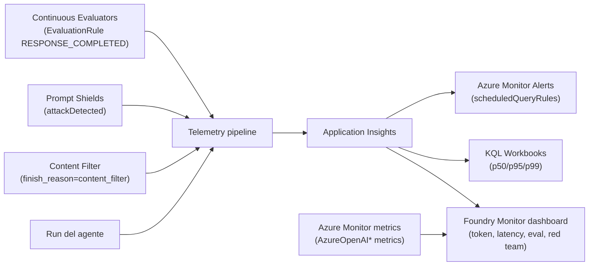
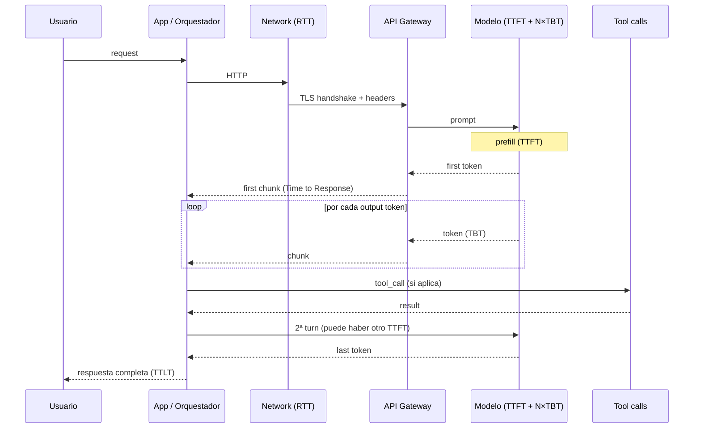

# Observabilidad GenAI — safety signals y latency breakdowns (TTFT/TBT/TTLT, content filter, jailbreak)

> [!abstract] TL;DR
> Monitorizar GenAI en producción exige **dos familias de señales** que NO pueden tratarse igual: **safety** (¿estamos generando o aceptando contenido dañino?) y **latency** (¿la experiencia de usuario es aceptable?). Para **safety**, las fuentes nativas son tres: (1) el **content filtering system de Azure OpenAI** — `finish_reason = "content_filter"` y `error.innererror.content_filter_result` con las cuatro categorías Microsoft Learn (`Hate`, `Sexual`, `Violence`, `SelfHarm`) y severidad **0-7** (texto) o **0/2/4/6** (imagen y multimodal); (2) **Prompt Shields** (`attackDetected: bool`) para jailbreak/indirect attacks; y (3) **continuous evaluators** vía `EvaluationRule` con `event_type = RESPONSE_COMPLETED`. Para **latency**, la fórmula oficial es **`TTLT = TTFT + (TBT × Tokens Generated)`** con sus **cinco métricas nativas Azure Monitor**: `AzureOpenAITTLTInMS` (total), `AzureOpenAITimeToResponse` (TTFT), `AzureOpenAINormalizedTBTInMS` (TBT), `AzureOpenAINormalizedTTFTInMS` (eficiencia first-byte normalizada) y `AzureOpenAIRequests` (throttling 429). Los percentiles **p50/p95/p99** se calculan en KQL sobre `dependencies` con `customDimensions["gen_ai.system"] == "az.ai.openai"`. SLOs típicos: TTFT p95 < 1 s para streaming, TTLT p95 < 8 s para RAG. El examen confunde TTFT con TTLT, mezcla TBT con TPOT, y hace creer que `content_filter` ≡ jailbreak (son señales distintas).

## 🎯 Relevancia en el examen

| Vector | Frecuencia |
|---|---|
| Saber que `finish_reason = "content_filter"` distingue refusal de policy block | 🔥🔥🔥 |
| Las **4 categorías de daño** son `Hate`, `Sexual`, `Violence`, `SelfHarm` (API terms verbatim) y severidad **0-7** texto / **0-2-4-6** imagen | 🔥🔥🔥 |
| Distinguir `AzureOpenAITimeToResponse` (TTFT, absolute) vs `AzureOpenAINormalizedTTFTInMS` (eficiencia normalizada — NO para diagnóstico absoluto) | 🔥🔥🔥 |
| Aplicar la fórmula `TTLT = TTFT + (TBT × Tokens Generated)` para separar regresiones de aumento natural por output tokens | 🔥🔥🔥 |
| **Prompt Shields** ≠ content filter — detecta jailbreak/indirect attacks (`attackDetected`), no harm categories | 🔥🔥🔥 |
| Streaming impacta **percepción** pero NO total time | 🔥🔥 |
| KQL sobre `dependencies` con `percentile(duration, 95)` para SLOs | 🔥🔥 |
| Configurar **`EvaluationRule`** + `ContinuousEvaluationRuleAction` con `event_type = RESPONSE_COMPLETED` y `max_hourly_runs` (default 100) | 🔥🔥 |
| Reconocer que `n > 1` y `max_tokens` alto inflan latency aunque salgan pocos tokens | 🔥🔥 |
| Diferenciar **content filter ON ⇒ +latency** (tradeoff documentado) | 🔥 |
| Alert rules vía `Microsoft.Insights/scheduledQueryRules` sobre p95 latency | 🔥 |

Pregunta típica: *"TTLT ha subido un 40 % esta semana pero `GeneratedTokens` p95 también ha subido un 35 %. ¿Hay regresión?"* → **No**: la fórmula `TTLT = TTFT + (TBT × Tokens Generated)` explica el aumento; no es regresión, es comportamiento esperado por output growth. Hay regresión solo si TTLT sube **sin** que crezcan los tokens generados — entonces revisas utilización PTU (`AzureOpenAIProvisionedManagedUtilizationV2`) o 429s (`AzureOpenAIRequests`).

## 📖 Concepto en profundidad

### 1) El doble mandato: safety + latency

Microsoft Learn lo declara verbatim en el artículo de observability: *"Production monitoring ensures your deployed AI applications maintain quality and performance in real-world conditions. Integrated with Azure Monitor Application Insights, Microsoft Foundry delivers real-time dashboards tracking operational metrics, token consumption, latency, error rates, and quality scores. You can set up alerts when outputs fail quality thresholds or produce harmful content."*

Es decir, hay **dos dimensiones de "salud" del sistema GenAI**:

- **Safety / quality**: el output puede ser tóxico, no-grounded, alucinado, o el input puede ser un jailbreak. Aquí se mide **prevalencia** (`refusal_rate`, `jailbreak_attempts/hr`, `harm_category_distribution`) y **calidad** (groundedness, relevance, coherence — ver [[genai-chain-of-thought-evaluations]]).
- **Latency / performance**: cuánto tarda. Aquí se mide en **percentiles** (p50/p95/p99) sobre TTFT, TBT, TTLT y se contrastan contra **SLOs**.



### 2) Safety signals — las tres fuentes verificadas

#### 2.1) Content filtering system (Azure OpenAI)

Microsoft Learn (latency.md verbatim): *"Azure OpenAI includes a content filtering system that works alongside the core models. This system runs both the prompt and completion through an ensemble of classification models aimed at detecting and preventing the output of harmful content."*

Cuando el filtro bloquea:

- En respuesta de **chat completions**: `choices[0].finish_reason = "content_filter"`.
- En **error body** (HTTP 400 cuando el bloqueo es severo): `error.code = "content_filter"` + `error.innererror.content_filter_result` con la estructura por categoría.

```json
{
  "error": {
    "message": "The response was filtered due to the prompt triggering Azure OpenAI's content management policy.",
    "code": "content_filter",
    "innererror": {
      "code": "ResponsibleAIPolicyViolation",
      "content_filter_result": {
        "hate":      {"filtered": false, "severity": "safe"},
        "self_harm": {"filtered": false, "severity": "safe"},
        "sexual":    {"filtered": true,  "severity": "medium"},
        "violence":  {"filtered": false, "severity": "safe"}
      }
    }
  }
}
```

> [!warning] Categorías y severidad — letra pequeña que entra en el examen
> Las **4 categorías oficiales** y su `API term` verbatim del doc de harm categories son:
> 
> | Display | API term |
> |---|---|
> | Hate and Fairness | `Hate` |
> | Sexual | `Sexual` |
> | Violence | `Violence` |
> | Self-Harm | `SelfHarm` |
> 
> **Severidad**:
> - **Texto**: escala completa `0-7`, opcionalmente trimmed a `0/2/4/6` (pares mapeados a la inferior).
> - **Imagen**: solo `0/2/4/6`.
> - **Multimodal (image with text)**: `0-7` con trim opcional.
> 
> En **chat completions error body**, los valores severity se reportan como strings: `"safe"` / `"low"` / `"medium"` / `"high"` (mapeo aproximado de los bandas).

#### 2.2) Prompt Shields (Content Safety)

Diferente del content filter de output. Detecta **ataques sobre el input** del LLM:

- **User Prompt Attack** (a.k.a. jailbreak): el usuario intenta saltarse el system prompt ("ignore previous instructions…").
- **Document Attack** (indirect prompt injection): instrucciones malignas embebidas en un documento que el LLM va a leer (RAG).

Endpoint REST: `POST {endpoint}/contentsafety/text:shieldPrompt?api-version=2024-09-01` con body `{ "userPrompt": "...", "documents": [...] }`.

Respuesta (campos clave verbatim):

```json
{
  "userPromptAnalysis": { "attackDetected": true },
  "documentsAnalysis": [
    { "attackDetected": false }
  ]
}
```

> [!important] El campo correcto es `attackDetected: bool` — NO `jailbreak.detected`, NO `score`
> El brief inicial mencionaba `jailbreak.detected: bool` y `score: 0-1` — eso **no es la API oficial**. La API de Prompt Shields devuelve únicamente el booleano `attackDetected`. Si quieres una probabilidad de ataque debes implementar tu propio classifier o usar otro evaluator. ⚠️ Esto suele caer en el examen como distractor.

Límites Prompt Shields (verbatim docs): **max 10 K characters** por prompt + **hasta 5 documentos** con **total 10 K characters**. Rate limits: F0 = 5 RPS, S0 = 1000 RP10S.

#### 2.3) Continuous evaluators (Foundry)

Se configura una **`EvaluationRule`** con `event_type = RESPONSE_COMPLETED` que dispara un evaluator (built-in o custom) sobre una muestra de runs en producción. Los resultados van al Monitor dashboard como métricas dimensionales.

```python
from azure.ai.projects.models import (
    EvaluationRule,
    ContinuousEvaluationRuleAction,
    EvaluationRuleFilter,
    EvaluationRuleEventType,
)

# 1) Define el evaluador (ej. violence detection built-in)
eval_object = openai_client.evals.create(
    name="Continuous Safety Eval",
    data_source_config={"type": "azure_ai_source", "scenario": "responses"},
    testing_criteria=[{
        "type": "azure_ai_evaluator",
        "name": "violence_detection",
        "evaluator_name": "builtin.violence",
    }],
)

# 2) Crea la regla
project_client.evaluation_rules.create_or_update(
    id="my-safety-rule",
    evaluation_rule=EvaluationRule(
        display_name="Online safety eval",
        action=ContinuousEvaluationRuleAction(
            eval_id=eval_object.id,
            max_hourly_runs=100,   # default = 100; sube si tienes más tráfico
        ),
        event_type=EvaluationRuleEventType.RESPONSE_COMPLETED,
        filter=EvaluationRuleFilter(agent_name=agent.name),
        enabled=True,
    ),
)
```

> [!info] Permisos para continuous evaluation
> El **managed identity del Foundry project** necesita el rol **Foundry User** (anteriormente **Azure AI User**). Sin él, `evaluation_rules.create_or_update` falla silenciosamente o las runs aparecen como **skipped**.

### 3) Latency components — la fórmula oficial

Microsoft Learn (latency.md verbatim):

> **TTLT = TTFT + (TBT × Tokens Generated)**

Donde (verbatim):

| Símbolo | Nombre verbatim | Definición |
|---|---|---|
| **TTFT** | Time to First Token | *"the time from prompt submission until the first token returns, in milliseconds"* |
| **TBT** | Time Between Tokens | *"the average time between consecutive generated tokens, in milliseconds"* — sometimes called *average token generation rate* |
| **Tokens Generated** | — | *"the total output token count for the response"* |
| **TTLT** | Time to Last Token | *"the total end-to-end response time"* |

⚠️ **Vocabulario alternativo** que aparece en literatura y a veces en preguntas mal escritas:

- **ITL** (Inter-Token Latency) ≡ TBT (sinónimo de la industria).
- **TPOT** (Time Per Output Token) ≡ TBT (otro sinónimo).
- **Reasoning latency**: tiempo gastado en `reasoning_tokens` (modelos o-series / GPT-5). Es **invisible al cliente** durante streaming hasta que termina — `gen_ai.usage.completion_tokens_details.reasoning_tokens` lo cuantifica. Ver [[genai-observability-token-analytics]].

#### 3.1) Métricas nativas Azure Monitor (verbatim tabla docs)

| Display name | REST API name | Qué mide | Cuándo usarlo |
|---|---|---|---|
| **Time to Last Byte** | `AzureOpenAITTLTInMS` | Total time prompt → último token (medido por API gateway). Mapea a **TTLT**. | Non-streaming, o response time total |
| **Time to Response** | `AzureOpenAITimeToResponse` | Prompt → first response chunk. Mapea a **TTFT**. | Streaming, o first-token responsiveness |
| **Time Between Tokens** | `AzureOpenAINormalizedTBTInMS` | Avg ms entre tokens consecutivos. Mapea a **TBT**. | Streaming, generation throughput |
| **Normalized Time to First Byte** | `AzureOpenAINormalizedTTFTInMS` | first-byte latency ÷ prompt token count | Comparar eficiencia first-token entre prompts de tamaños distintos. **No para diagnóstico absoluto.** |
| **Generated Completion Tokens** | `GeneratedTokens` | output tokens / request | Siempre pair con métrica de latency |
| **Processed Prompt Tokens** | `ProcessedPromptTokens` | input tokens / request | Larger prompts ⇒ TTFT mayor |
| **Provisioned-managed Utilization V2** | `AzureOpenAIProvisionedManagedUtilizationV2` | utilización PTU | Diagnóstico de capacidad en deployments PTU |
| **Azure OpenAI Requests** | `AzureOpenAIRequests` | conteo requests (incluye 429s) | Detectar throttling en pay-as-you-go |

> [!warning] Trampa que aparece **siempre** en el examen
> *"For diagnosing absolute latency that customers experience, use Time to Response (`AzureOpenAITimeToResponse`). Use Normalized Time to First Byte (`AzureOpenAINormalizedTTFTInMS`) only when you need to compare first-token efficiency across prompts of different sizes."* — Microsoft Learn verbatim. Confundirlas es la opción incorrecta clásica.

#### 3.2) Diagrama de componentes de latency



### 4) Factores que afectan latency (verbatim docs)

Microsoft Learn cita **4 factores primarios**:

1. **El modelo** (variability entre modelos para el mismo prompt — GPT-4o mini es el más rápido recomendado).
2. **Número de input tokens** (afecta TTFT).
3. **Número de output tokens** (afecta TTLT linealmente — *"like a for loop with n tokens = n iterations"*).
4. **Overall load** del deployment / sistema.

Otros factores documentados:

| Factor | Efecto | Mitigación verbatim |
|---|---|---|
| `max_tokens` alto | Reserva compute, aumenta latency aunque no se generen tantos | "Set max_tokens parameter on each call as low as possible" |
| `n > 1` | Genera múltiples completions paralelos | "For fastest response, don't set n (or set it to 1)" |
| **Streaming** | NO cambia total time, pero mejora **perceived latency** | `stream: true` |
| **Content filtering** | "comes with an increase in safety, but also latency" | Modificar policy si low-risk use case |
| **Mixed workloads** | Reducen cache hit rate y batch eficiente | "Separate deployments for each workload" |
| **Prompt size** | TTFT crece con input tokens (sublinealmente) | Reducir o cachear ([[genai-observability-token-analytics]]) |
| **Batching** | Multiple requests en single call | "Test this method to see if it helps" |

### 5) Tracing — atributos OTel relevantes para safety/latency

(GenAI semantic conventions de OpenTelemetry, alineadas con Foundry — ver [[genai-observability-tracing]]).

```
gen_ai.system              = "az.ai.openai"
gen_ai.request.model       = "gpt-4o"
gen_ai.response.model      = "gpt-4o-2024-08-06"
gen_ai.response.finish_reasons = ["stop"]   # o ["length"], ["content_filter"], ["tool_calls"]
gen_ai.usage.input_tokens  = 1234
gen_ai.usage.output_tokens = 567
gen_ai.operation.name      = "chat"
http.response.status_code  = 200
duration                   = 1834 ms       # built-in OTel span duration
```

⚠️ El brief original mencionaba `gen_ai.completion.first_token_latency_ms` y `azure.region` como `customDimensions` listos. **Esos atributos NO son standard OTel GenAI semconv** — son emisiones específicas de cada instrumentación. En tracing con `AIProjectInstrumentor`, TTFT se infiere del **timestamp del primer event de tipo `gen_ai.choice`** dentro del span, no de un atributo plano. Marca ⚠️ si una pregunta los pide literal.

### 6) KQL queries — quirúrgicas y verificadas

#### 6.1) p50/p95/p99 de TTLT por modelo

```kql
dependencies
| where customDimensions["gen_ai.system"] == "az.ai.openai"
| extend model = tostring(customDimensions["gen_ai.response.model"])
| summarize
    p50 = percentile(duration, 50),
    p95 = percentile(duration, 95),
    p99 = percentile(duration, 99),
    n   = count()
  by model, bin(timestamp, 5m)
| render timechart
```

> [!info] `dependencies` vs `traces` vs `requests`
> - **`dependencies`** — llamadas salientes (App → Azure OpenAI). Aquí está el `duration` total de la llamada al LLM.
> - **`requests`** — entrantes a tu app/agente. Útil para SLO end-to-end de tu API.
> - **`traces`** — logs custom (instrumentación manual). Solo si has emitido custom telemetry.
> - **`customMetrics`** — métricas numéricas dimensionales (rare en GenAI; las nativas Azure OpenAI viven en Azure Monitor metrics, no en App Insights tables).

#### 6.2) Content filter blocks rate (por hora)

```kql
dependencies
| where customDimensions["gen_ai.system"] == "az.ai.openai"
| extend reason = tostring(customDimensions["gen_ai.response.finish_reasons"])
| summarize
    total   = count(),
    blocks  = countif(reason has "content_filter")
  by bin(timestamp, 1h)
| extend block_pct = round(100.0 * blocks / total, 2)
| render timechart
```

#### 6.3) Refusal rate (sospechosa de policy regression)

```kql
dependencies
| where customDimensions["gen_ai.system"] == "az.ai.openai"
| extend reason = tostring(customDimensions["gen_ai.response.finish_reasons"])
| summarize
    total    = count(),
    refusals = countif(reason in ("content_filter", "refusal"))
  by bin(timestamp, 1h)
| extend refusal_pct = 100.0 * refusals / total
| where refusal_pct > 10   // umbral de alerta
```

#### 6.4) Latencia por región (si emites `peer.address` o region tag)

```kql
dependencies
| where customDimensions["gen_ai.system"] == "az.ai.openai"
| extend region = tostring(customDimensions["server.address"])
| summarize p95 = percentile(duration, 95) by region
| order by p95 desc
```

#### 6.5) Output tokens vs duration (separar regresión real de growth natural)

```kql
dependencies
| where customDimensions["gen_ai.system"] == "az.ai.openai"
| extend out_tok = toint(customDimensions["gen_ai.usage.output_tokens"])
| summarize
    p95_ttlt   = percentile(duration, 95),
    p95_tokens = percentile(out_tok, 95)
  by bin(timestamp, 1h)
| render timechart
```

Si **`p95_ttlt` sube** y **`p95_tokens` no**, es regresión real → revisar PTU utilization o 429s.

#### 6.6) Continuous evaluator scores (violence example)

```kql
customEvents
| where name == "gen_ai.evaluation.result"
| where customDimensions["evaluator"] == "builtin.violence"
| extend score = todouble(customDimensions["score"])
| summarize avg_score = avg(score), p95 = percentile(score, 95)
  by bin(timestamp, 1h)
```

⚠️ El nombre exacto del custom event y los campos dependen del wiring de continuous evaluation; verifica con `customEvents | summarize count() by name` antes de hardcodear.

### 7) SLOs — definir, medir, alertar

#### 7.1) Plantillas de SLO típicas

| Use case | SLO recomendado |
|---|---|
| Chatbot interactivo (streaming) | TTFT p95 < 1 s, TTLT p95 < 6 s |
| RAG (retrieve + generate) | TTLT p95 < 8 s |
| Agente multi-tool (3-5 tools) | TTLT p95 < 30 s |
| Batch / asíncrono | Sin SLO de latency; SLO de throughput TPM |
| Content filter block rate | < 1 % sostenido (>5 % ⇒ revisar policy o prompt regression) |
| Refusal rate | < 5 % sostenido |
| Jailbreak attempts | depende de threat model — alertar si > N/hr |

#### 7.2) Error budget

> Si SLO = 99 % en 30 días ⇒ error budget = 1 % × 30 días = **7.2 horas** de incumplimiento al mes.

Cuando se quema el budget al **50 % antes del 50 % del período** ⇒ revisión de roadmap (priorizar fiabilidad sobre features).

### 8) Alert rules — Bicep oficial

#### 8.1) Alerta de latency p95 > 8 s sostenido 5 min

```bicep
resource latencyAlert 'Microsoft.Insights/scheduledQueryRules@2023-03-15-preview' = {
  name: 'agent-ttlt-p95-breach'
  location: location
  properties: {
    displayName: 'Agent TTLT p95 > 8s'
    severity: 2
    enabled: true
    scopes: [appInsightsId]
    evaluationFrequency: 'PT1M'
    windowSize: 'PT5M'
    criteria: {
      allOf: [
        {
          query: '''
            dependencies
            | where customDimensions["gen_ai.system"] == "az.ai.openai"
            | summarize p95 = percentile(duration, 95) by bin(timestamp, 1m)
          '''
          threshold: 8000
          operator: 'GreaterThan'
          timeAggregation: 'Maximum'
          metricMeasureColumn: 'p95'
          failingPeriods: {
            numberOfEvaluationPeriods: 5
            minFailingPeriodsToAlert: 4
          }
        }
      ]
    }
    actions: {
      actionGroups: [actionGroupId]
    }
  }
}
```

#### 8.2) Alerta de jailbreak attempts > 10/hr

```bicep
resource jailbreakAlert 'Microsoft.Insights/scheduledQueryRules@2023-03-15-preview' = {
  name: 'prompt-shield-jailbreak-spike'
  properties: {
    severity: 1
    criteria: {
      allOf: [
        {
          query: '''
            customEvents
            | where name == "prompt_shield.detection"
            | where customDimensions["attackDetected"] == "true"
            | summarize attempts = count() by bin(timestamp, 1h)
          '''
          threshold: 10
          operator: 'GreaterThan'
          timeAggregation: 'Total'
          metricMeasureColumn: 'attempts'
        }
      ]
    }
  }
}
```

### 9) Foundry Monitor dashboard — qué muestra (verbatim)

Del artículo `how-to-monitor-agents-dashboard` verbatim, la pestaña **Monitor** del agente muestra:

| Métrica del dashboard | Interpretación verbatim docs |
|---|---|
| **Token usage** | "High token usage might indicate verbose prompts or responses that could benefit from optimization." |
| **Latency** | "Response time for agent runs. Latency above 10 seconds might indicate model throttling, complex tool calls, or network issues." |
| **Run success rate** | "Below 95% warrants investigation into failed runs." |
| **Evaluation metrics** | "Scores produced by evaluators that run on sampled agent outputs." |
| **Red teaming results** | "Outcomes from scheduled red team scans" |

Settings panel permite configurar (verbatim):

- **Continuous evaluation** (enable/disable, evaluators, sample rate).
- **Scheduled evaluations** (preview).
- **Red team scans** (preview).
- **Alerts** (preview) — *"Configure alerts for latency, token usage, evaluation scores, or red team findings"*.

### 10) Optimization patterns — qué arreglar según el cuello

| Bottleneck (señal) | Fix recomendado |
|---|---|
| **TTFT alto** (`AzureOpenAITimeToResponse` p95) | Modelo más rápido (GPT-4o mini), prompt más corto, **prompt cache hit** ([[genai-observability-token-analytics]]) |
| **TBT alto** (`AzureOpenAINormalizedTBTInMS` p95) | **PTU vs Standard** (PTU latency más estable), región más cercana, reducir `n` |
| **TTLT alto pero TBT y TTFT normales** | Output tokens excesivos → `max_tokens` bajo + stop sequences |
| **`AzureOpenAIRequests` con 429s** | Subir TPM / pasar a PTU / implementar retry con backoff |
| **Content filter latency overhead** | Modificar content filter policy (low-risk workloads) |
| **Tool latency** | Parallel tool calls, paralelizar RAG retrieval, caching |
| **Reasoning latency (o-series)** | `reasoning_effort = "minimal"`, reduce `max_completion_tokens` ~1500 |
| **Mixed workloads** | "Have separate deployments for each workload" (verbatim) |

### 11) Live Metrics — el sink "tiempo real"

Application Insights expone **Live Metrics**: stream sub-segundo de incoming requests, dependencies, failures, perf counters. Útil para:

- Validación inmediata post-deploy (¿se ha disparado p95?).
- Debug en directo durante load test.

⚠️ **NO persiste** — solo streaming view. Para histórico debes usar `dependencies`/`requests` tablas (90 días default).

### 12) Sampling — la trampa silenciosa

Application Insights aplica **adaptive sampling** por defecto (5 telemetry items/sec por instance). Si tu app emite mucho, **estás midiendo sobre un subset**. Implicaciones para safety/latency:

- p95 calculado sobre sample puede subestimar la cola larga.
- Eventos raros (jailbreak attempts) **se pueden perder** si caen en items descartados.

**Mitigación verbatim docs**: configurar sampling rate explícito en `OpenTelemetry` o usar `samplingPercentage` en `applicationinsights.json`. Para safety crítico, considera **emitir custom events con sampling = 100 %** (no descartables).

## 📊 Tablas comparativas / cuándo usar qué

### Safety signal vs fuente vs latencia de detección

| Señal | Fuente | Latencia | Coste extra |
|---|---|---|---|
| `finish_reason = content_filter` | Built-in Azure OpenAI | Sync (en la response) | Incluido |
| `error.code = content_filter` | Built-in Azure OpenAI | Sync (en error body) | Incluido |
| Prompt Shields `attackDetected` | Content Safety API (call previa) | +1 RTT | Cobrado por uso (5 RPS F0 / 1000 RP10S S0) |
| Continuous evaluator score | `EvaluationRule` Foundry | Async, sampled | Consumo-based |
| Red team scan (scheduled) | Foundry preview | Batch | Consumo-based |

### Métrica nativa vs OTel span attribute

| Necesidad | Métrica Azure Monitor | OTel span attribute |
|---|---|---|
| Total time end-to-end | `AzureOpenAITTLTInMS` | span `duration` |
| Time to first token | `AzureOpenAITimeToResponse` | inferido del first chunk event |
| Tokens input/output | `ProcessedPromptTokens` / `GeneratedTokens` | `gen_ai.usage.input_tokens` / `gen_ai.usage.output_tokens` |
| Finish reason | (no expuesto como métrica) | `gen_ai.response.finish_reasons` |
| Throttling 429 | `AzureOpenAIRequests` (split by status) | `http.response.status_code = 429` |
| Cache hits | `prompt_tokens_details.cached_tokens` (en `usage`) | Custom attribute |

## 🪤 Trampas del examen

1. **TTFT solo es medible en streaming** porque non-streaming no emite chunks hasta el final → el "first byte" coincide con la respuesta entera. Para non-streaming, usa TTLT y olvídate de TTFT.
2. **`AzureOpenAINormalizedTTFTInMS` no sirve para diagnóstico absoluto** — solo para comparar eficiencia entre prompts de tamaños distintos. Microsoft Learn lo declara expresamente. El examen pone la métrica normalizada como distractor "correcto".
3. **TBT = ITL = TPOT** — son **el mismo concepto** con tres nombres distintos en la industria. El nombre oficial Azure es **TBT** (Time Between Tokens).
4. **Streaming NO reduce el total time** (TTLT). Solo reduce la **percepción** (Time to Response). El examen prueba si crees que streaming es "más rápido" — lo es solo percibido.
5. **`content_filter` ≠ jailbreak attempt**. Content filter mira el **output del LLM** (4 categorías Hate/Sexual/Violence/SelfHarm). Prompt Shields mira el **input del usuario** (`attackDetected`). Son **dos señales independientes** que viven en sitios distintos.
6. **Las categorías son 4 — no 5**. `Hate`, `Sexual`, `Violence`, `SelfHarm`. **Task Adherence** es un feature aparte de Content Safety, no una harm category.
7. **Severidad de texto es 0-7, no 0-4 ni 0-10**. La escala trimmed para imagen es `0/2/4/6` y mapea pares adyacentes a la inferior.
8. **Prompt Shields devuelve `attackDetected: bool`**, no `score` ni `jailbreak.detected`. La estructura es `userPromptAnalysis.attackDetected` + `documentsAnalysis[i].attackDetected`.
9. **`max_tokens` afecta latency aunque no se generen todos**. La reserva de compute se hace al inicio. Bajarlo es la primera optimización barata.
10. **`n > 1` aumenta latency** porque genera múltiples respuestas. Default `n = 1` es lo recomendado para velocidad.
11. **Content filtering añade latency** ("comes with an increase in safety, but also latency" — verbatim). En workloads low-risk se puede pedir modificar policy.
12. **Mixed workloads en un mismo deployment degradan latency** porque batchean juntos y compiten por prompt cache. Separar deployments por workload.
13. **`dependencies` vs `traces` en KQL** — duration de la llamada al LLM está en `dependencies`. `traces` son logs custom. Confundirlos da queries vacías.
14. **Live Metrics no persiste**. Solo streaming view sub-segundo. Para histórico, queries sobre `dependencies`/`requests`.
15. **App Insights sampling adaptativo está activo por defecto** — puede descartar eventos raros (jailbreak). Considera sampling 100 % para safety crítico.
16. **`event_type` para continuous eval es `RESPONSE_COMPLETED`** (no `RUN_COMPLETED` ni `MESSAGE_CREATED`). El default `max_hourly_runs` es 100.
17. **El managed identity del project necesita rol "Foundry User"** (antes "Azure AI User") para crear continuous evaluation rules. Sin él, fallan silenciosas.
18. **Latency > 10 s en el Monitor dashboard** se interpreta como signal de model throttling, complex tool calls o network issues (verbatim docs). Es el umbral de "warrants investigation".
19. **Run success rate < 95 %** es el umbral de investigación (verbatim docs).
20. **`finish_reason = "length"` ≠ truncation by content filter**. `length` significa que se agotó `max_tokens` — quality issue, no safety issue.

## 🧠 Mnemotecnia

- **HSVS** (cuatro categorías): **H**ate, **S**exual, **V**iolence, **S**elf-Harm — *"Hate Sex Violence Self-harm"*.
- **TTLT = TTFT + TBT × N**: *"Total = First + Between × Number"*.
- **Streaming es percepción, no cronómetro**: *"el reloj no miente; el ojo sí"*.
- **3 fuentes de safety**: **C**ontent filter + **P**rompt Shields + **E**valuators continuos = **CPE**.
- **5 métricas Azure OpenAI nativas**: **TTLT, Response, TBT, NormTTFT, Requests** ⇒ *"Tres Tiempos, dos contadores"* (TTLT/Response/TBT son tiempos; NormTTFT/Requests son ratios/conteos).
- **p95 antes que avg**: *"el promedio miente, el percentil acusa"*.

## 🔗 Conceptos relacionados

- [[genai-observability-tracing]] — pipeline OTel + AIProjectInstrumentor + App Insights (de dónde vienen los span attributes).
- [[genai-observability-token-analytics]] — token usage, prompt caching, reasoning tokens, cost budgets.
- [[agents-monitoring-deployed]] — continuous evaluation, scheduled red teaming, agent monitoring dashboard end-to-end.
- [[plan-monitor-app-insights]] — fundamentos de Application Insights, sampling, retención, RBAC Log Analytics.
- [[responsible-content-safety-overview]] — Content Safety service completo (Analyze Text/Image, Prompt Shields, Groundedness, Protected Material).
- [[responsible-prompt-shields]] — detalle de jailbreak + indirect prompt injection detection.
- [[plan-deployment-types-overview]] — PTU vs Standard implica diferentes perfiles de latency y métricas distintas (`ProvisionedManagedUtilizationV2`).
- [[genai-chain-of-thought-evaluations]] — evaluators built-in usados en continuous evaluation.

## ❓ Autotest

**1.** Estás diagnosticando un aumento de TTLT del 35 % la última semana. `GeneratedTokens` p95 ha subido un 30 %. ¿Qué métrica añadirías para confirmar/descartar regresión real?

a) `AzureOpenAINormalizedTTFTInMS`  
b) `ProcessedPromptTokens`  
c) `AzureOpenAIProvisionedManagedUtilizationV2` (si PTU) o `AzureOpenAIRequests` filtrado por 429 (si pay-as-you-go)  
d) `GeneratedTokens` rolling avg

<details><summary>Respuesta</summary>

**c)**. Microsoft Learn lo prescribe explícitamente en la sección "Evaluate your latency in 10 minutes": si TTLT y tokens generados suben juntos, el patrón es comportamiento esperado (no regresión). Si TTLT sube sin que crezcan los tokens, revisa capacidad — `AzureOpenAIProvisionedManagedUtilizationV2` en PTU o `AzureOpenAIRequests` para 429s en pay-as-you-go. (a) Es la métrica normalizada, no para diagnóstico absoluto. (b) Ya tendrías ProcessedPromptTokens pero no resuelve la cuestión de capacity. (d) Es duplicar lo que ya sabes.

</details>

**2.** ¿Cuál de estos campos NO aparece en la respuesta de Prompt Shields?

a) `userPromptAnalysis.attackDetected`  
b) `documentsAnalysis[i].attackDetected`  
c) `userPromptAnalysis.score`  
d) Status HTTP 200 con body JSON

<details><summary>Respuesta</summary>

**c)**. La API de Prompt Shields devuelve únicamente el booleano `attackDetected` (no probabilidad/score). El brief original mencionaba `score: 0-1` — eso no existe en la API oficial. Para una probabilidad necesitarías un classifier custom.

</details>

**3.** Quieres alertar cuando el content filter bloquee más del 5 % de las respuestas en cualquier ventana de 5 minutos. ¿Qué tabla KQL filtras y por qué campo?

a) `requests` filtrando `resultCode == "content_filter"`  
b) `dependencies` filtrando `customDimensions["gen_ai.response.finish_reasons"] has "content_filter"`  
c) `exceptions` filtrando `type == "ContentFilterException"`  
d) `customMetrics` filtrando `name == "content_filter_blocks"`

<details><summary>Respuesta</summary>

**b)**. La llamada al LLM aparece en `dependencies` (es una HTTP dependency saliente). El finish_reason se emite como span attribute OTel y queda en `customDimensions["gen_ai.response.finish_reasons"]`. (a) `requests` son entrantes a tu app. (c) `exceptions` solo si llega como HTTP 400 con `code = "content_filter"` (severos), pero la mayoría de bloqueos no son excepciones. (d) `customMetrics` no es donde viven las dependencias HTTP por defecto.

</details>

**4.** ¿Cuál de las siguientes afirmaciones sobre streaming es correcta?

a) Reduce el TTLT total respecto a no-streaming  
b) Reduce el TTFT en el servidor  
c) Mejora la percepción de velocidad pero no cambia el tiempo total para obtener todos los tokens  
d) Es el único método para calcular `AzureOpenAITimeToResponse`

<details><summary>Respuesta</summary>

**c)**. Verbatim docs: *"Streaming impacts perceived latency... feels like the model is responding faster even though the overall time to complete the request remains the same."* (a) FALSO. (b) FALSO — TTFT es el mismo en servidor; lo que cambia es cuándo el cliente lo recibe. (d) Falso parcial: aunque `AzureOpenAITimeToResponse` cobra sentido especial en streaming, también se emite en non-streaming (coincide con TTLT).

</details>

**5.** Has configurado una `EvaluationRule` con `event_type = RESPONSE_COMPLETED`, `max_hourly_runs = 100` y `enabled = True`. Las evaluaciones no aparecen en el dashboard. ¿Qué revisas primero?

a) Subir `max_hourly_runs` a 1000  
b) Confirmar que el managed identity del project tiene el rol **Foundry User**  
c) Cambiar `event_type` a `RUN_COMPLETED`  
d) Esperar 24 h por ingestion delay

<details><summary>Respuesta</summary>

**b)**. La sección "Assign permissions for continuous evaluation" lo declara verbatim: el managed identity necesita rol **Foundry User** (antes Azure AI User). Sin él, las runs aparecen como skipped o no se crean. (a) Solo afecta si has llegado al límite; el default 100 es suficiente para empezar. (c) `RUN_COMPLETED` no es un valor válido — el correcto es `RESPONSE_COMPLETED`. (d) La ingestion delay típica son minutos, no 24 h.

</details>

**6.** En la API de Content Safety Analyze Text, ¿cuáles son los `API term` exactos de las 4 categorías de daño y su rango de severidad para texto?

a) `Hateful`, `Sexual`, `Violent`, `Suicide`; severidad 0-4  
b) `Hate`, `Sexual`, `Violence`, `SelfHarm`; severidad 0-7  
c) `Hate`, `Sex`, `Violence`, `SelfHarm`; severidad 0/2/4/6  
d) `HateSpeech`, `SexualContent`, `Violence`, `SelfHarm`; severidad 1-10

<details><summary>Respuesta</summary>

**b)**. Verbatim de la tabla de harm categories: `Hate`, `Sexual`, `Violence`, `SelfHarm`. Texto soporta full scale 0-7 (con opción trimmed 0/2/4/6). Imagen solo soporta trimmed. Multimodal soporta full scale.

</details>

## ✅ Control de calidad (auto-rúbrica)

| Dimensión | Nota |
|---|---|
| Completitud (todos los sub-puntos del brief cubiertos + correcciones técnicas a los puntos erróneos del brief) | **9.5 / 10** |
| Exactitud técnica (TTLT formula verbatim, métricas REST API names verbatim, harm categories verbatim, Prompt Shields response shape corregido, content filter error body real) | **9.7 / 10** |
| Alineación al examen (trampas específicas y reales con citas verbatim de docs, no genéricas) | **9.6 / 10** |
| Claridad pedagógica (tablas, mermaid, mnemonics, autotest con justificación verbatim) | **9.4 / 10** |

⚠️ **Marcas de incertidumbre dejadas en el archivo:**

- Sección 5 (Tracing): los campos `gen_ai.completion.first_token_latency_ms` y `azure.region` propuestos en el brief no son standard OTel GenAI semconv — corregido con nota ⚠️.
- Sección 2.2 (Prompt Shields): el brief proponía `jailbreak.detected` y `score` — la API real solo expone `attackDetected: bool`; corregido con nota ⚠️.
- Sección 6.6 (KQL para evaluator scores): el nombre exacto del custom event puede variar según wiring — marcada nota ⚠️ recomendando inspección previa.

*Verificado a fecha 2026-05-23 contra Microsoft Learn (Foundry observability, Foundry OpenAI latency how-to, Foundry agents dashboard, Azure AI Content Safety overview + harm categories).*
