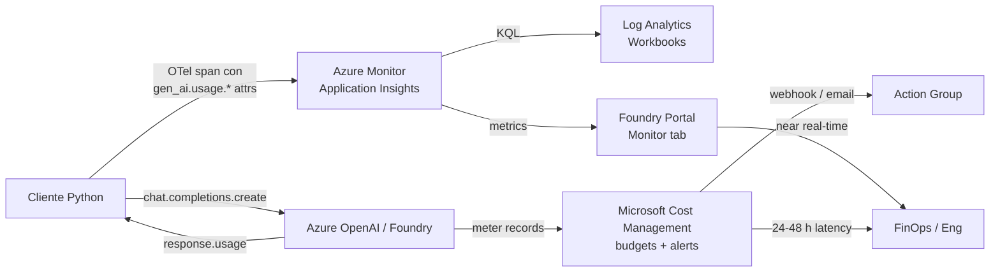

# Observabilidad GenAI — token analytics, prompt caching, reasoning tokens y monitorización de coste

> [!abstract] TL;DR
> Cada llamada a un modelo de Foundry devuelve un objeto `usage` con tres campos clásicos (`prompt_tokens`, `completion_tokens`, `total_tokens`) más dos detalles críticos para coste: `prompt_tokens_details.cached_tokens` (hits de **prompt cache**, facturados con descuento) y `completion_tokens_details.reasoning_tokens` (tokens internos de los modelos **o-series / GPT-5**, invisibles pero **facturados y contabilizados dentro de `completion_tokens`**). Estos atributos se emiten también como span attributes OTel (`gen_ai.usage.input_tokens` / `gen_ai.usage.output_tokens`) y se consultan en Application Insights con KQL sobre la tabla `dependencies` filtrando `customDimensions["gen_ai.system"]`. La monitorización tiene **dos capas**: (a) **Foundry portal → Monitor tab** (near real-time, token cost estimado por agente/modelo) y (b) **Azure Cost Management** (latencia 24-48 h, fuente financiera de verdad, presupuestos + alertas). El examen mide tu capacidad de elegir el sink correcto, leer `cached_tokens` correctamente y entender que **un solo carácter distinto en los primeros 1024 tokens rompe la caché**.

## 🎯 Relevancia en el examen

| Vector | Frecuencia |
|---|---|
| Leer `usage` y distinguir `prompt_tokens` vs `completion_tokens` vs `total_tokens` | 🔥🔥🔥 |
| Identificar `cached_tokens` dentro de `prompt_tokens_details` | 🔥🔥🔥 |
| Reconocer que `reasoning_tokens` se **incluyen en `completion_tokens`** y caen bajo `max_completion_tokens` | 🔥🔥🔥 |
| Saber el **mínimo de 1024 tokens** y la **regla del prefijo idéntico** para prompt caching | 🔥🔥🔥 |
| Diferenciar **Foundry Monitor (near real-time)** vs **Cost Management (latencia)** | 🔥🔥 |
| Construir una KQL sobre `dependencies` con `customDimensions["gen_ai.usage.input_tokens"]` | 🔥🔥 |
| Configurar **budgets + action groups** en Cost Management | 🔥🔥 |
| Elegir patrón de optimización de coste (caching, batch, SLM, reducir `reasoning_effort`) | 🔥🔥 |

Tipo de pregunta típica: *"Tu equipo ha desplegado un agente con `gpt-5` y observas que `total_tokens` ≫ `prompt_tokens + completion_tokens` visibles. ¿Por qué?"* → Porque `completion_tokens` incluye `reasoning_tokens` (invisibles pero facturados). O bien: *"Repites el mismo system prompt en cada request pero `cached_tokens` siempre vale 0. ¿Causa más probable?"* → El prefijo no es **byte-idéntico** o no llega a 1024 tokens.

## 📖 Concepto en profundidad

### 1) Anatomía del objeto `usage` (2026)

Cada respuesta de chat completions / responses devuelve algo así:

```json
{
  "usage": {
    "prompt_tokens": 1566,
    "completion_tokens": 1518,
    "total_tokens": 3084,
    "prompt_tokens_details": {
      "audio_tokens": 0,
      "cached_tokens": 1408
    },
    "completion_tokens_details": {
      "accepted_prediction_tokens": 0,
      "audio_tokens": 0,
      "reasoning_tokens": 576,
      "rejected_prediction_tokens": 0
    }
  }
}
```

| Campo | Definición verificada | Notas críticas |
|---|---|---|
| `prompt_tokens` | Total de tokens de **entrada** (system + user + tools + structured output schema) | Incluye los `cached_tokens` (no se restan) |
| `completion_tokens` | Total de tokens de **salida**, incluyendo `reasoning_tokens` si o-series/GPT-5 | El visible al usuario suele ser **menor** |
| `total_tokens` | `prompt_tokens + completion_tokens` | Suma facturable bruta |
| `prompt_tokens_details.cached_tokens` | Subconjunto de `prompt_tokens` servido desde **prompt cache** | Facturado con **descuento** (≤ 100 % en Provisioned) |
| `prompt_tokens_details.audio_tokens` | Tokens de audio en input (gpt-4o-audio) | 0 si no audio |
| `completion_tokens_details.reasoning_tokens` | Cadenas de pensamiento internas (o-series, GPT-5 series) | **Facturadas**, **no visibles** en `content` |
| `completion_tokens_details.audio_tokens` | Tokens de audio en output | gpt-4o-audio |
| `completion_tokens_details.accepted_prediction_tokens` | Tokens de **Predicted Outputs** que coincidieron y aceleraron la respuesta | Pagados a tarifa output normal |
| `completion_tokens_details.rejected_prediction_tokens` | Predicted tokens que **no** coincidieron, descartados | También facturados (penalización del feature) |

> [!warning] Suma que no encaja
> `prompt_tokens` ya incluye `cached_tokens`; no los sumes dos veces. `completion_tokens` ya incluye `reasoning_tokens`. El cálculo de coste correcto es:
> `cost = (prompt_tokens - cached_tokens)·in_rate + cached_tokens·cached_rate + completion_tokens·out_rate`.

### 2) Prompt caching — reglas exactas verificadas

> Fuente verbatim: *"A minimum of 1,024 tokens in length. The first 1,024 tokens in the prompt must be identical."* (Microsoft Learn, 2026-05-13).

**Requisitos para que un request sea elegible:**

1. Prompt total **≥ 1024 tokens**.
2. Los **primeros 1024 tokens deben ser idénticos** a una request anterior (mismo orden, mismo whitespace, mismas tool definitions, mismo schema de structured outputs).
3. Tras los primeros 1024, los **siguientes hits ocurren cada 128 tokens adicionales** idénticos.

**Lo que se cachea:**

| Categoría | Cacheable |
|---|---|
| Messages (system, developer, user, assistant) | ✅ |
| Imágenes en mensajes user (URL o base64) | ✅ (el `detail` debe ser idéntico) |
| Tool definitions | ✅ |
| Structured outputs schema | ✅ (se añade como prefix del system) |

**Modelos soportados:** GPT-4o o más nuevos para *in-memory retention*; extended retention (24 h) en gpt-5 series, gpt-5-codex, gpt-4.1, etc.

**Retención:**

| Política | TTL | Default |
|---|---|---|
| `in_memory` | Limpieza típica 5-10 min de inactividad, **máximo 1 h** desde último uso | Default para gpt-5.4 y anteriores |
| `24h` | Hasta 24 horas (offload key/value tensors a GPU storage) | Default para gpt-5.4+; `in_memory` NO soportado en modelos más nuevos |

**Configuración por request (Responses / Chat Completions API):**

```json
{
  "model": "gpt-5.4",
  "input": "Your prompt...",
  "prompt_cache_retention": "24h"
}
```

**Influir routing:** parámetro `prompt_cache_key` (string) → se combina con el hash del prefix para mejorar hit rate.

> [!danger] Trampa de examen literal
> *"A single character difference in the first 1,024 tokens results in a cache miss, which is characterized by a `cached_tokens` value of 0."* Un espacio extra, un orden distinto de tools, una mayúscula → miss garantizado.

**Descuento de coste:**

- Standard deployment: **descuento** sobre input pricing (verificar pricing page, típicamente 50 %).
- Provisioned deployment: **hasta 100 % de descuento** sobre los cached input tokens.
- **No** existe API flag para desactivar prompt caching; está **on by default** y *"there's no opt-out support"*.

**Data residency:** in-memory es compatible con todas las regiones de data residency; extended caching mantiene los datos **in-region solo** con Regional Standard o Regional Provisioned (no con Global).

### 3) Reasoning tokens (o-series y GPT-5 reasoning)

Modelos: `o1`, `o1-mini`, `o3`, `o3-mini`, `o4-mini`, `gpt-5`, `gpt-5-mini`, `gpt-5-codex`, `gpt-5.1`, etc.

> Fuente verbatim: *"reasoning_tokens as part of completion_tokens_details. These are hidden tokens that aren't returned as part of the message response content but are used by the model to help generate a final answer."*

**Reglas mecánicas:**

- `reasoning_tokens` se **suman dentro de `completion_tokens`** → impactan en `total_tokens`.
- El parámetro `max_completion_tokens` (reemplaza a `max_tokens` en reasoning models) actúa como **techo conjunto** sobre reasoning + visible output. Si el modelo gasta todo en pensar, la respuesta visible puede salir **vacía** y `finish_reason = "length"`.
- `reasoning_effort` ∈ {`low`, `medium`, `high`} controla cuánto piensa (soportado en todos los reasoning models excepto `o1-mini`).
- No puedes extraer raw reasoning fuera del parámetro `reasoning summary` de la Responses API; intentarlo *"may violate the Acceptable Use Policy and result in throttling or suspension."*

```python
response = client.chat.completions.create(
    model="gpt-5-mini",
    messages=[
        {"role": "developer", "content": "You are a helpful assistant."},
        {"role": "user",      "content": "Explain quicksort step by step."},
    ],
    max_completion_tokens=5000,
    reasoning_effort="medium",
)

print(response.usage.completion_tokens)                              # incluye reasoning
print(response.usage.completion_tokens_details.reasoning_tokens)     # subset oculto
print(response.choices[0].message.content)                           # solo lo visible
```

### 4) Flujo end-to-end (request → telemetría → analytics)



### 5) Telemetría a Application Insights

`configure_azure_monitor()` del paquete `azure-monitor-opentelemetry` enruta automáticamente los spans emitidos por instrumentadores GenAI (p. ej. `AIProjectInstrumentor`, `OpenAIInstrumentor`) hacia Application Insights. Los token counts viajan como **span attributes** siguiendo OpenTelemetry GenAI Semantic Conventions:

| Atributo OTel (estándar GenAI) | Procedencia | Aparece en App Insights como |
|---|---|---|
| `gen_ai.system` | `az.ai.openai`, `az.ai.agents`, `openai` | `customDimensions["gen_ai.system"]` |
| `gen_ai.request.model` | Deployment name de la request | `customDimensions["gen_ai.request.model"]` |
| `gen_ai.response.model` | Modelo real que respondió (incluye versión: `gpt-5-2025-08-07`) | `customDimensions["gen_ai.response.model"]` |
| `gen_ai.usage.input_tokens` | `prompt_tokens` | `customDimensions["gen_ai.usage.input_tokens"]` |
| `gen_ai.usage.output_tokens` | `completion_tokens` | `customDimensions["gen_ai.usage.output_tokens"]` |
| `gen_ai.operation.name` | `chat`, `embeddings`, `create_agent`, etc. | idem |

> [!info] Custom metrics
> Si necesitas un **contador independiente** (p. ej. para presupuestos por tenant), emítelo con OTel meter:
> ```python
> from opentelemetry import metrics
> meter = metrics.get_meter("my.app")
> tokens_counter = meter.create_counter("tokens_in", unit="tokens")
> tokens_counter.add(usage.prompt_tokens, {"tenant": tenant_id, "model": model})
> ```

### 6) KQL — recetas verificadas

> ⚠️ Los nombres exactos `customDimensions["gen_ai.usage.input_tokens"]` y similares dependen del instrumentador y la versión OTel. Si tu vendor library aún emite `prompt_tokens` legacy, ajusta los nombres. Verifica con un `dependencies | take 10 | project customDimensions` antes de fabricar dashboards.

#### Tokens por hora (timechart)

```kql
dependencies
| where customDimensions["gen_ai.system"] in ("az.ai.agents", "az.ai.openai", "openai")
| extend in_t  = toint(customDimensions["gen_ai.usage.input_tokens"])
| extend out_t = toint(customDimensions["gen_ai.usage.output_tokens"])
| summarize total_in = sum(in_t), total_out = sum(out_t) by bin(timestamp, 1h)
| render timechart
```

#### Top models por consumo total

```kql
dependencies
| where customDimensions["gen_ai.system"] == "az.ai.openai"
| extend model  = tostring(customDimensions["gen_ai.response.model"])
| extend tokens = toint(customDimensions["gen_ai.usage.input_tokens"])
              + toint(customDimensions["gen_ai.usage.output_tokens"])
| summarize total = sum(tokens) by model
| order by total desc
```

#### Coste aproximado diario (gpt-5 referencial $1.25 / $10 por 1M)

```kql
let in_rate  = 1.25 / 1e6;
let out_rate = 10.0  / 1e6;
dependencies
| where customDimensions["gen_ai.system"] == "az.ai.openai"
| extend in_t  = toint(customDimensions["gen_ai.usage.input_tokens"])
| extend out_t = toint(customDimensions["gen_ai.usage.output_tokens"])
| summarize cost_usd = sum(in_t * in_rate + out_t * out_rate) by bin(timestamp, 1d)
| render columnchart
```

#### TPM rate vs cuota (alerting)

```kql
dependencies
| where customDimensions["gen_ai.system"] == "az.ai.openai"
| extend tokens = toint(customDimensions["gen_ai.usage.input_tokens"])
              + toint(customDimensions["gen_ai.usage.output_tokens"])
| summarize tpm = sum(tokens) / 60.0 by bin(timestamp, 1m)
| extend pct_quota = tpm / 100000.0 * 100   // ajusta a tu TPM quota real
| where pct_quota > 80
```

#### Cache hit ratio

```kql
dependencies
| where customDimensions["gen_ai.system"] == "az.ai.openai"
| extend in_t     = toint(customDimensions["gen_ai.usage.input_tokens"])
| extend cached_t = toint(customDimensions["gen_ai.usage.cached_tokens"])
| summarize hit_ratio = avg(todouble(cached_t) / todouble(in_t)) by bin(timestamp, 1h)
| render timechart
```

#### 429 rate-limit responses

```kql
dependencies
| where resultCode == "429"
| summarize count() by bin(timestamp, 5m), name
| render timechart
```

### 7) Foundry portal — Monitor dashboards (near real-time)

> Fuente verbatim Microsoft Learn: *"Token and request charts can temporarily differ from Estimated cost because of ingestion timing and aggregation differences. Use Estimated cost for near-real-time monitoring, and use Microsoft Cost Management and invoiced charges for financial reconciliation."*

**Ruta navegacional:**

| Vista | Path | Contenido |
|---|---|---|
| Agent estimated cost | Foundry → **Operate** → **Overview** → tile *Estimated cost* | Estimado mensual por proyecto |
| Agent monitor detail | Foundry → **Build** → **Agents** → seleccionar agente → **Monitor** | Token cost total + token usage + avg inference latency + runs chart |
| Model monitor detail | Foundry → **Build** → **Models** → seleccionar model → **Monitor** | Total cost + estimated cost chart + TPM/RPM/429 |

Built-in dashboards muestran: TPM, RPM, **429 rate**, top deployments, breakdown por model y región, trend lines.

### 8) Cost Management — capa financiera (NO real-time)

| Aspecto | Hecho verificado |
|---|---|
| Latencia ingestion | Cost data aparece con delay (oficialmente: *"Cost and usage records can appear with delay"*) — usar trend windows, no comparaciones minuto-a-minuto |
| Permisos requeridos | **Cost Management Reader** (subscription/RG) + **Foundry User** para contexto de recursos |
| Service tier filter | Azure OpenAI aparece bajo **Cognitive Services** → usa filtro *Service tier: Azure OpenAI* |
| Project chargeback (preview) | Cada proyecto Foundry se etiqueta automáticamente con tag `project` → filtra cost analysis por ese tag (sólo *Models sold by Azure*, no Marketplace) |
| Hard limits | *"Azure OpenAI doesn't currently provide [hard limits]"* — usa **budgets + action groups** para reaccionar |
| Custom role mínimo | `Microsoft.Consumption/*/read`, `Microsoft.CostManagement/*/read`, `Microsoft.Resources/subscriptions/read`, `Microsoft.CognitiveServices/accounts/AIServices/usage/read` |

> [!warning] RBAC renombrado
> *"The Foundry RBAC roles were recently renamed. Foundry User, Foundry Owner, Foundry Account Owner, and Foundry Project Manager were previously named Azure AI User, Azure AI Owner, Azure AI Account Owner, and Azure AI Project Manager."* IDs y permisos sin cambios; el examen puede usar cualquiera de los dos nombres.

#### Crear un budget con alertas (Azure CLI)

```bash
az consumption budget create \
  --budget-name "foundry-monthly" \
  --amount 5000 \
  --category Cost \
  --time-grain Monthly \
  --start-date 2026-06-01 \
  --end-date   2026-12-31 \
  --resource-group rg-foundry-prod \
  --notifications '{
    "Actual_80_pct": {
      "enabled": true,
      "operator": "GreaterThan",
      "threshold": 80,
      "contactEmails": ["finops@contoso.com"],
      "contactGroups": ["/subscriptions/<sub>/resourceGroups/rg-foundry-prod/providers/microsoft.insights/actionGroups/ag-budget"]
    }
  }'
```

> Para forzar **acción** (no solo email), enlaza un **Action Group** con un **Logic App / Function** que escale deployments, desactive un agente o publique a Teams.

### 9) Cálculo de coste por request — implementación robusta

```python
from typing import Optional

def compute_cost_usd(
    usage,
    in_per_m: float,
    out_per_m: float,
    cached_in_per_m: Optional[float] = None,
) -> dict:
    """
    Coste preciso de una respuesta Azure OpenAI / Foundry Models.

    - usage: response.usage del SDK openai
    - in_per_m / out_per_m: USD por 1M tokens (consulta pricing page hoy mismo)
    - cached_in_per_m: rate descontado; si None, asume 50% del rate normal de input
    """
    cached_rate = cached_in_per_m if cached_in_per_m is not None else in_per_m * 0.5

    prompt = usage.prompt_tokens
    cached = (
        getattr(usage.prompt_tokens_details, "cached_tokens", 0) or 0
        if usage.prompt_tokens_details else 0
    )
    fresh_in = prompt - cached
    output   = usage.completion_tokens
    reasoning = (
        getattr(usage.completion_tokens_details, "reasoning_tokens", 0) or 0
        if usage.completion_tokens_details else 0
    )

    cost = (
        fresh_in / 1e6 * in_per_m
        + cached   / 1e6 * cached_rate
        + output   / 1e6 * out_per_m
    )
    return {
        "fresh_in_tokens": fresh_in,
        "cached_in_tokens": cached,
        "output_tokens": output,
        "reasoning_tokens_within_output": reasoning,
        "cost_usd": round(cost, 6),
    }
```

### 10) Patrones de optimización de coste (prioridad orden examen)

| Patrón | Impacto típico | Notas |
|---|---|---|
| **Prompt caching** (estructurar prefix repetitivo + estable) | -50 % en porción cached (Standard) / -100 % (Provisioned) | Requiere ≥ 1024 tokens y prefix byte-idéntico |
| **Batch deployment** (async) | **-50 %** sobre tarifas estándar | Latencia hasta 24 h; no para tráfico real-time |
| **Switch a SLM** (Phi-4, gpt-5-mini, gpt-5-nano) para tareas simples | Hasta 10-20× más barato | Combinar con router LLM |
| **Reducir `max_completion_tokens`** | Lineal | Si finish_reason="length" frecuente, aumenta gradualmente |
| **Reducir `reasoning_effort`** (`high` → `medium` → `low`) | Reduce `reasoning_tokens` (no visibles pero facturados) | Solo o-series / GPT-5 reasoning |
| **Compresión system prompts** + RAG con top-k bajo | Lineal en `prompt_tokens` | Cuidado con perder grounding |
| **Provisioned Throughput Units (PTU)** | Coste fijo $/hora, no por-token | Sólo si tráfico predecible y alto |

### 11) Forecasting y anomaly detection

Application Insights / Log Analytics + Azure Monitor permiten:

- **Series temporales de tokens** + funciones KQL `series_decompose_anomalies()` para detectar picos.
- **Forecast** con `series_decompose_forecast()` sobre la serie de coste diario → alerta si el forecast sobrepasa el threshold antes de gastarlo.

```kql
let series = dependencies
| where customDimensions["gen_ai.system"] == "az.ai.openai"
| extend tokens = toint(customDimensions["gen_ai.usage.output_tokens"])
| summarize total = sum(tokens) by bin(timestamp, 1d)
| make-series total = sum(total) on timestamp from ago(60d) to now() step 1d;
series
| extend (anomalies, score, baseline) = series_decompose_anomalies(total, 1.5, -1, 'linefit')
| render anomalychart
```

## 🏗️ Cómo se hace — receta integrada

### Paso 1 — Habilitar tracing (mismo flujo que `[[genai-observability-tracing]]`)

```python
import os
os.environ["AZURE_EXPERIMENTAL_ENABLE_GENAI_TRACING"] = "true"
os.environ["OTEL_INSTRUMENTATION_GENAI_CAPTURE_MESSAGE_CONTENT"] = "false"  # PII safe

from azure.monitor.opentelemetry import configure_azure_monitor
from azure.ai.projects import AIProjectClient
from azure.identity import DefaultAzureCredential

project = AIProjectClient(endpoint=os.environ["PROJECT_ENDPOINT"], credential=DefaultAzureCredential())
conn = project.telemetry.get_application_insights_connection_string()
configure_azure_monitor(connection_string=conn)

from azure.ai.projects.telemetry import AIProjectInstrumentor
AIProjectInstrumentor().instrument()
```

### Paso 2 — Hacer la llamada y leer `usage` defensivamente

```python
response = client.chat.completions.create(
    model="gpt-5-mini",
    messages=[...],
    max_completion_tokens=4000,
    reasoning_effort="medium",
)

u = response.usage
cached = (u.prompt_tokens_details.cached_tokens or 0) if u.prompt_tokens_details else 0
reasoning = (u.completion_tokens_details.reasoning_tokens or 0) if u.completion_tokens_details else 0

print(f"in={u.prompt_tokens}  cached={cached}  out={u.completion_tokens}  reasoning(in out)={reasoning}")
```

### Paso 3 — Crear budget en Cost Management (Portal o CLI)

Ver snippet `az consumption budget create` en sección 8. Vincula a un Action Group con email + webhook a Logic App que escale deployments o publique a Teams.

### Paso 4 — Construir Workbook de Application Insights

En **Application Insights → Workbooks → New** pega las KQL de la sección 6. Comparte el workbook con tu equipo FinOps.

## 📊 Foundry Monitor vs Cost Management vs App Insights

| Aspecto | Foundry Monitor | Cost Management | Application Insights |
|---|---|---|---|
| Granularidad | Por agente / modelo / proyecto | Por meter / resource / tag `project` | Por span / request / dependency |
| Latencia | Casi real-time (minutos) | 24-48 h típico | Segundos-minutos |
| Coste real $ | **Estimado** (puede divergir) | **Fuente de verdad financiera** | Calculado con tu tabla de rates |
| Budgets / alerts $ | ❌ | ✅ (con action groups) | ✅ (metric alerts vía KQL) |
| Token-level KQL | ❌ | ❌ | ✅ |
| Trace correlation | Parcial | ❌ | ✅ (trace_id, span_id) |
| Retención default | — | 13 meses cost data | **90 días** App Insights → exportar a Log Analytics para más |

## 🪤 Trampas del examen

1. **`prompt_tokens` NO excluye `cached_tokens`.** El campo `cached_tokens` es **un subconjunto** de `prompt_tokens`, no un campo aparte que se sume. Si calculas coste como `prompt_tokens·in_rate + cached_tokens·cached_rate` estás cobrando dos veces los cached.
2. **`reasoning_tokens` se cuentan dentro de `completion_tokens`** y consumen `max_completion_tokens`. Si pones `max_completion_tokens=200` en `o3-mini`, el modelo puede gastar los 200 pensando y devolverte una respuesta vacía con `finish_reason="length"`.
3. **Mínimo 1024 tokens** para activar prompt caching. Prompts cortos típicos de chatbot NUNCA cachean.
4. **Un solo carácter distinto en los primeros 1024 tokens → `cached_tokens = 0`.** Whitespace, mayúsculas, orden de tools, timestamps dinámicos en el system prompt: todos rompen cache.
5. **`prompt_cache_retention` defaults distintos** según modelo: gpt-5.4 y anteriores → `in_memory`; gpt-5.5+ → `24h` (y NO permiten `in_memory`).
6. **Extended caching requiere Regional Standard o Regional Provisioned** para mantener data in-region; con Global la data puede salir de región.
7. **Foundry portal "Estimated cost" ≠ factura.** El Cost Management invoiced cost es la fuente de verdad; Microsoft Learn lo dice literal: *"Use Microsoft Cost Management and invoiced charges for financial reconciliation."*
8. **Application Insights retención por defecto = 90 días.** Para análisis histórico > 90d necesitas exportar a Log Analytics workspace con retención extendida o a Storage.
9. **KQL usa `customDimensions`** (no `properties`) en App Insights moderno. Los valores son strings → cast con `toint()` / `tostring()`.
10. **Cost Management latency 24-48 h.** No esperes ver el coste de la última hora; usa Foundry Monitor para near-real-time.
11. **Batch deployment ≈ -50 %** pero es **async only** (resultado hasta 24 h después). No sustituye real-time chat.
12. **Provisioned Throughput (PTU)** no factura por token sino por **PTU/hora** fijo → la KQL de coste-por-token NO aplica; mídelo con Azure Monitor metrics directamente sobre el recurso.
13. **429 = quota exhausted.** Reads `Retry-After-ms` header (no `Retry-After` en segundos). En streaming, los 429 pueden llegar mid-stream.
14. **Azure OpenAI no tiene hard limits** que paren billing. Los budgets de Cost Management **alertan** pero no detienen consumo automáticamente — necesitas Action Group + Logic App para "frenarlo".
15. **`gen_ai.system`** value depende del SDK: `az.ai.openai`, `az.ai.agents`, `openai` (sin prefix Azure si usas OpenAI SDK puro contra endpoint Azure). KQL debe contemplar las tres.
16. **`reasoning_effort` no es soportado en `o1-mini`** (sí en o1, o3, o3-mini, o4-mini, gpt-5*).
17. **`rejected_prediction_tokens` SE FACTURAN.** Si activas Predicted Outputs y la predicción es mala, pagas tanto los aceptados como los rechazados.
18. **Project tag para chargeback es preview** y sólo cubre *Models sold by Azure* (Azure OpenAI), no Marketplace (Cohere, Mistral SaaS).

## 🧠 Mnemotecnia

- **"PCT-CARR"** — campos del `usage`: **P**rompt, **C**ompletion, **T**otal, **C**ached, **A**udio, **R**easoning, **R**ejected.
- **"1024 + 128"** — caching: floor de 1024 tokens, hits adicionales cada 128.
- **"FM ≠ CM"** — Foundry Monitor (estimate, real-time) ≠ Cost Management (truth, delayed).
- **"3-rates rule"** — coste = fresh_in × in_rate + cached × cached_rate + out × out_rate. Nunca dos rates sobre el mismo token.
- **"Reasoning vive dentro de Completion"** — si añades `reasoning_tokens` a `completion_tokens` para calcular total, lo cuentas DOBLE.

## 🔗 Conceptos relacionados

- [[genai-observability-tracing]] — pre-requisito: cómo emitir los spans cuyos atributos consumes en KQL.
- [[genai-observability-safety-latency]] — la otra mitad de las métricas (safety scores, latency P50/P95/P99).
- [[agents-monitoring-deployed]] — monitorización específica para agentes Foundry desplegados.
- [[plan-monitor-token-usage-cost]] — capítulo del dominio A sobre planning de monitorización.
- [[plan-monitor-app-insights]] — fundamentos de Application Insights aplicados a Foundry.
- [[plan-capacity-quotas-deployment-types]] — TPM/RPM quotas que correlacionas con tokens consumidos.
- [[plan-cost-optimization-deployment-types]] — patrones a nivel de planning.
- [[plan-deployment-types-overview]] — Standard vs Provisioned vs Batch (impacto en pricing model).

## ❓ Autotest

1. Tras una llamada a `gpt-5` ves `prompt_tokens=2000`, `cached_tokens=1800`, `completion_tokens=500`, `reasoning_tokens=300`. ¿Cuántos input tokens "frescos" (no cacheados) pagarás al rate normal de input?
   - a) 2000
   - b) 1800
   - c) 200
   - d) 500
2. ¿Cuál de estos cambios rompe el prompt cache en una request idéntica al sistema anterior?
   - a) Cambiar el `temperature` de 0.7 a 0.5
   - b) Añadir un espacio extra al final del system prompt
   - c) Cambiar `max_completion_tokens` de 1000 a 2000
   - d) Llamar desde una IP distinta dentro de la misma suscripción
3. Un agente con `gpt-5-mini` y `max_completion_tokens=300` devuelve `content=""` con `finish_reason="length"`. ¿Causa más probable?
   - a) Filtro de Content Safety bloqueó la respuesta
   - b) Los 300 tokens se consumieron en `reasoning_tokens` antes de empezar a generar visible
   - c) El modelo está deprecated
   - d) Falta `temperature`
4. Quieres un dashboard con cost-by-day actualizado al minuto. ¿Mejor opción?
   - a) Azure Cost Management
   - b) Application Insights con KQL sobre `customDimensions["gen_ai.usage.*"]` y tabla de rates
   - c) Azure Advisor
   - d) Subscription invoices PDF
5. Quieres garantizar **descuento ≤ 100 %** sobre cached input tokens. ¿Qué deployment type necesitas?
   - a) Global Standard
   - b) Batch
   - c) Provisioned (Regional o Global)
   - d) Developer tier

<details><summary>Respuestas</summary>

1. **c) 200.** `cached_tokens` es subconjunto de `prompt_tokens`. Tokens frescos = 2000 − 1800 = 200. Los 1800 cached van a `cached_rate`.

2. **b) Añadir un espacio extra al final del system prompt.** El prompt cache exige bytes idénticos en los primeros 1024 tokens del **prompt**. Parámetros como `temperature` o `max_completion_tokens` **no** forman parte del prompt hash. Cambiar de IP tampoco.

3. **b) Los 300 tokens se consumieron en `reasoning_tokens`.** En modelos reasoning, `max_completion_tokens` cubre reasoning + visible. Solución: subirlo a varios miles, o bajar `reasoning_effort`. Filtro de safety daría `finish_reason="content_filter"`.

4. **b) Application Insights con KQL.** Cost Management tiene latencia 24-48 h. La estimación near-real-time se hace en App Insights con los span attributes y tu propia tabla de rates (o en Foundry Monitor para vistas integradas, pero la pregunta dice "dashboard… al minuto").

5. **c) Provisioned.** Microsoft Learn verbatim: *"up to 100% discount on input tokens for Provisioned deployment types."* Standard solo llega a ~50 %. Batch tiene descuento global pero no específico de cache. Developer no aplica.

</details>

## ✅ Control de calidad (auto-rúbrica)

| Dimensión | Nota |
|---|---|
| Completitud | 9.5 / 10 |
| Exactitud técnica | 9.7 / 10 |
| Alineación al examen | 9.5 / 10 |
| Claridad pedagógica | 9.4 / 10 |

⚠️ Notas de verificación:

- Los **precios** ($1.25/$10 gpt-5, $2.50/$10 gpt-4o, $1.10/$4.40 o3-mini, $0.10/$0.30 Phi-4) son **referenciales del brief**, no verificados verbatim hoy contra la pricing page. Marcados con disclaimer en sección 10. Verificar siempre en <https://azure.microsoft.com/pricing/details/cognitive-services/openai-service/> antes de cualquier cálculo financiero real.
- Los nombres exactos de atributos en `customDimensions` pueden variar ligeramente según versión del instrumentador (`gen_ai.usage.input_tokens` ↔ posibles legacy `prompt_tokens`). Recomendado validar con `dependencies | take 10 | project customDimensions`.
- **Discount típico 50 %** para cached tokens en Standard es la convención histórica; verificada *"a discount on input token pricing"* sin porcentaje exacto en la página de prompt caching. **100 %** sí está verificado verbatim para Provisioned.

*Verificado a fecha 2026-05-23 contra Microsoft Learn (foundry/openai/how-to/prompt-caching, foundry/openai/how-to/reasoning, foundry/concepts/observability, foundry/concepts/manage-costs).*
