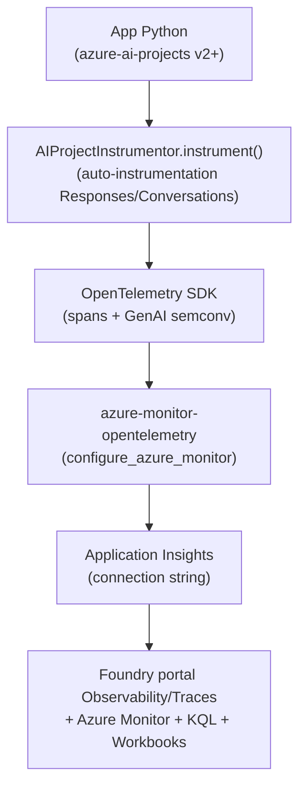
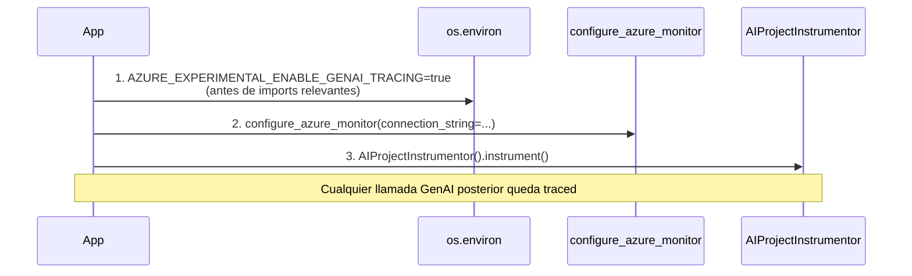
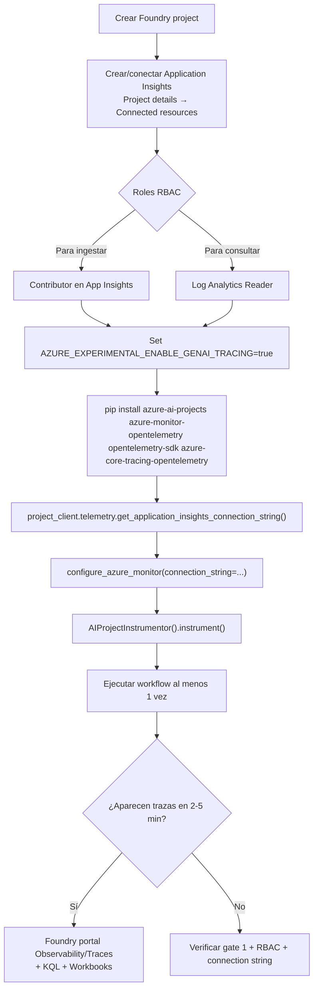

# Observabilidad GenAI — tracing con OpenTelemetry + AIProjectInstrumentor + Application Insights

> [!abstract] TL;DR
> Las apps GenAI son **distribuidas** (app → LLM → tools → DB → response) y atribuir latencia/errores exige **distributed tracing**. Microsoft Foundry adopta **OpenTelemetry (OTel) GenAI semantic conventions** (preview/experimental) y emite spans a **Application Insights**. Para activarlo en cliente Python necesitas un **triple gate**: (1) `AZURE_EXPERIMENTAL_ENABLE_GENAI_TRACING=true` **antes** de instrumentar, (2) `configure_azure_monitor(connection_string=...)` con la cadena obtenida vía `project_client.telemetry.get_application_insights_connection_string()`, y (3) `AIProjectInstrumentor().instrument()`. Content recording está **OFF por defecto** (PII); binary data exige un **segundo opt-in independiente**. Las trazas viven 90 días en App Insights y se ven en *Observability → Traces* del portal Foundry o en KQL/Workbooks.

## 🎯 Relevancia en el examen

| Vector | Frecuencia |
|---|---|
| Reconocer la **necesidad del feature gate experimental** y el **orden** de inicialización | 🔥🔥🔥 |
| Saber que content recording NO se activa por defecto y cómo opt-in (`OTEL_INSTRUMENTATION_GENAI_CAPTURE_MESSAGE_CONTENT`) | 🔥🔥🔥 |
| Identificar el package (`azure-monitor-opentelemetry`) y el helper (`configure_azure_monitor`) frente a configurar OTel a mano | 🔥🔥🔥 |
| Comprender **W3C trace context propagation** (`traceparent`/`tracestate`) y cómo deshabilitarlo | 🔥🔥 |
| Diferenciar **trace context propagation** vs **baggage propagation** (riesgo PII) | 🔥🔥 |
| Atribuir un span al modelo correcto vía `gen_ai.request.model` / `gen_ai.response.model` | 🔥🔥 |
| Elegir KQL adecuada en App Insights (`dependencies` + `customDimensions`) | 🔥🔥 |
| Saber que **prompt agents = GA, hosted/workflow/custom = preview** para tracing | 🔥 |

Tipo de pregunta típica: *"Has llamado `AIProjectInstrumentor().instrument()` y `configure_azure_monitor(...)`, pero no aparecen spans GenAI en App Insights. ¿Qué falta?"* → Setear `AZURE_EXPERIMENTAL_ENABLE_GENAI_TRACING=true` **antes** de invocar `instrument()`.

## 📖 Concepto en profundidad

### 1) Por qué tracing en GenAI

Una sola respuesta de un agente puede involucrar: cliente → orquestador → LLM (Azure OpenAI) → tool calls (RAG, Bing, APIs) → reducción → respuesta. Cada salto añade latencia y un punto de fallo. Sin **distributed tracing**:

- No puedes responder *"¿dónde se introdujo el error?"*.
- No puedes detectar *latency spikes* atribuibles a un tool específico.
- No puedes correlacionar tokens consumidos vs deployment vs usuario.

OTel ofrece el lenguaje común (spans, attributes, semantic conventions). Application Insights es el **sink recomendado** en Azure (Microsoft alinea Foundry con sus *gen-ai semantic conventions*).

### 2) Stack de tracing en Foundry (Python)



Paquetes obligatorios (verbatim docs):

```bash
pip install "azure-ai-projects>=2.0.0b4" opentelemetry-sdk azure-core-tracing-opentelemetry azure-monitor-opentelemetry
```

> [!warning] El instrumentor es **experimental preview**
> Microsoft Learn lo declara explícitamente: *"GenAI tracing instrumentation is an experimental preview feature. Spans, attributes, and events may be modified in future versions."* No usar en producción sin pin de versión.

### 3) El **triple gate** de activación

Para que un span GenAI aparezca en App Insights, los **tres pasos en este orden** son obligatorios:



| Gate | Mecanismo | Si falta |
|---|---|---|
| **1. Feature flag** | env var `AZURE_EXPERIMENTAL_ENABLE_GENAI_TRACING=true` | Warning en log, **no se emiten spans GenAI** |
| **2. Exporter Azure Monitor** | `configure_azure_monitor(connection_string=…)` del paquete `azure-monitor-opentelemetry` | Los spans se generan pero **no salen a App Insights** |
| **3. Instrumentation** | `AIProjectInstrumentor().instrument()` | No se auto-instrumentan las llamadas Responses/Conversations |

### 4) Setup Python end-to-end (verbatim docs Azure SDK readme)

```python
import os

# 🔒 GATE 1: feature flag ANTES de importar/usar el instrumentor
os.environ["AZURE_EXPERIMENTAL_ENABLE_GENAI_TRACING"] = "true"

from azure.ai.projects import AIProjectClient
# ⚠️ Import path exacto del AIProjectInstrumentor: documentado en muestras
#    bajo /agents/telemetry/. Verifica la versión 2.x del SDK por si cambia.
from azure.ai.projects.telemetry.agents import AIProjectInstrumentor  # ⚠️ ver nota
from azure.identity import DefaultAzureCredential
from azure.monitor.opentelemetry import configure_azure_monitor
from opentelemetry import trace

# 0. Crear el client del proyecto Foundry
project_client = AIProjectClient(
    endpoint=os.environ["FOUNDRY_PROJECT_ENDPOINT"],
    credential=DefaultAzureCredential(),
)

# 🔒 GATE 2: obtener connection string desde el proyecto (NO hardcoded)
application_insights_connection_string = (
    project_client.telemetry.get_application_insights_connection_string()
)
configure_azure_monitor(connection_string=application_insights_connection_string)

# 🔒 GATE 3: instrumentar las llamadas GenAI (Responses, Conversations, Agents)
AIProjectInstrumentor().instrument()

# 4. Span raíz opcional para correlacionar el escenario completo
tracer = trace.get_tracer(__name__)
with tracer.start_as_current_span("my-genai-workflow"):
    with project_client.get_openai_client() as openai_client:
        response = openai_client.responses.create(
            model=os.environ["FOUNDRY_MODEL_NAME"],
            input="¿Capital de Francia?",
        )
        print(response.output_text)
```

> [!important] `get_application_insights_connection_string()` es la forma **idiomática**
> No copies la cadena del portal a mano: el método la deriva del recurso conectado al proyecto y respeta la separación de configuración por entorno.

### 5) GenAI semantic conventions (OTel) — atributos clave

Microsoft Foundry sigue las **OpenTelemetry GenAI semantic conventions** (experimentales). Cada span GenAI lleva (subset relevante para el examen):

| Atributo | Descripción | Ejemplo |
|---|---|---|
| `gen_ai.system` | Proveedor / sistema GenAI | `az.ai.openai`, `az.ai.inference` |
| `gen_ai.operation.name` | Tipo de operación | `chat`, `completion`, `embeddings`, `invoke_agent`, `execute_tool` |
| `gen_ai.request.model` | **Deployment name solicitado** | `gpt-4.1-prod` |
| `gen_ai.response.model` | **Modelo realmente servido** | `gpt-4.1-2025-04-14` |
| `gen_ai.response.id` | ID de la respuesta del modelo | `resp_abc123` |
| `gen_ai.response.finish_reason` | Motivo de terminación | `stop`, `length`, `content_filter`, `tool_calls` |
| `gen_ai.usage.input_tokens` | Tokens de entrada consumidos | `1024` |
| `gen_ai.usage.output_tokens` | Tokens de salida generados | `412` |

> [!tip] Trampa de examen: `request.model` vs `response.model`
> Un *deployment name* en Azure puede apuntar a una versión específica (o a *latest*). En auditoría de incidentes (drift, regression) usa `gen_ai.response.model` — es la **firma real** del binario que sirvió la respuesta.

Conventions multi-agent extendidas (Microsoft + Cisco Outshift) añaden spans específicos para agentes:

| Span / atributo | Propósito |
|---|---|
| `execute_task` | Planificación y propagación de tareas (descomposición). |
| `invoke_agent` | Span padre para una invocación de agente. |
| `agent_to_agent_interaction` | Comunicación A2A. |
| `agent.state.management` | Manejo de contexto / memoria short/long-term. |
| `agent_planning` | Pasos internos de planificación del agente. |
| `execute_tool` + `tool.call.arguments` / `tool.call.results` | Invocación y resultado de tool. |
| `tool_definitions` (attribute) | Descripción de configuración del tool. |
| `llm_spans` (attribute) | Spans de llamadas a modelos asociados. |

### 6) Content recording — opt-in obligatorio (PII safety)

> [!danger] OFF por defecto
> Los contenidos de mensajes (prompts, respuestas, argumentos/retornos de tools) **no se capturan** salvo opt-in explícito. Esto protege PII por construcción.

Activación:

```bash
export OTEL_INSTRUMENTATION_GENAI_CAPTURE_MESSAGE_CONTENT=true
```

Cuando está ON:
- Los mensajes (user/system/assistant) y los detalles de tool calls quedan **en los span attributes**.
- ⚠️ Sujeto a retención de App Insights y políticas de compliance del workspace.
- ⚠️ El env var **solo afecta a built-in traces**. Si decoras tus funciones con `trace_function`, los parámetros y returns se trazan **siempre** (independiente del flag).

### 7) Tracing de binary data — segundo opt-in independiente

Cuando *content recording* está ON, las **imágenes y ficheros** se trazan solo por **file ID/filename**. Para incluir el binario completo (data URIs base64, contenido de archivos):

```bash
export AZURE_TRACING_GEN_AI_INCLUDE_BINARY_DATA=true
```

> [!warning] Doble gate
> Sin `OTEL_INSTRUMENTATION_GENAI_CAPTURE_MESSAGE_CONTENT=true` previamente, `AZURE_TRACING_GEN_AI_INCLUDE_BINARY_DATA` no tiene efecto. Y los backends de tracing pueden tener límites de tamaño de payload.

### 8) Trace context propagation (W3C)

Cuando el tracing está activo, el SDK **inyecta automáticamente** las cabeceras `traceparent` y `tracestate` (W3C Trace Context) en las requests HTTP salientes hechas por el cliente OpenAI obtenido vía `get_openai_client()`. Esto permite correlacionar spans **cliente** con spans **servidor** (Azure OpenAI los emite también) bajo un **mismo trace ID**.

Estado por defecto: **ENABLED** cuando hay tracing.

Deshabilitar (privacy/compliance):

```bash
export AZURE_TRACING_GEN_AI_ENABLE_TRACE_CONTEXT_PROPAGATION=false
# o programáticamente:
AIProjectInstrumentor().instrument(enable_trace_context_propagation=False)
```

> [!caution] Aplica solo a clientes **obtenidos después** del cambio
> Los clientes OpenAI ya creados antes del `instrument(enable_trace_context_propagation=False)` **siguen propagando**. Re-acquire los clientes tras cambiar la opción.

### 9) Baggage propagation — desactivado por diseño

Separado del trace context. La cabecera `baggage` puede contener key/value arbitrarios (IDs de usuario, tokens, metadatos de negocio, PII). **OFF por defecto** incluso con trace context activo.

Activar:

```bash
export AZURE_TRACING_GEN_AI_TRACE_CONTEXT_PROPAGATION_INCLUDE_BAGGAGE=true
```

> [!danger] Riesgo de fuga de PII
> Antes de habilitar baggage, **audita** qué keys añaden tu código y librerías de terceros al baggage de OTel. Cualquier dato ahí será enviado al servicio Azure OpenAI.

| Propagación | Default | Contenido | Riesgo |
|---|---|---|---|
| `traceparent` + `tracestate` | ON (cuando tracing) | IDs aleatorios para correlación | Bajo (sólo IDs) |
| `baggage` | OFF | Pares K/V arbitrarios | Alto (puede arrastrar PII) |

### 10) Custom spans — envolver lógica de negocio

```python
from opentelemetry import trace

tracer = trace.get_tracer(__name__)

with tracer.start_as_current_span("rag-pipeline") as parent:
    parent.set_attribute("user.id", user_id)
    parent.set_attribute("workflow.step", "retrieve")

    # 1. Sub-step: búsqueda vectorial
    with tracer.start_as_current_span("vector-search"):
        docs = search_client.search(query)

    # 2. Sub-step: llamada al modelo (auto-instrumentada)
    response = project_client.get_openai_client().responses.create(
        model=deployment, input=build_prompt(query, docs)
    )
```

Auto-instrumentado dentro de un custom span ⇒ jerarquía completa visible en App Insights *Transaction details* y en Foundry portal *Traces*.

### 11) Tracing de agentes Foundry

- **Prompt agents**: tracing **GA**.
- **Workflow / Hosted / Custom agents**: tracing en **preview**.
- Con el instrumentor activo, **Foundry Agent Service** emite trazas server-side **automáticamente** para Prompt/Host agents (incluso sin instrumentar el cliente).
- Multi-agent: cada agente crea **sub-spans** (`invoke_agent`, `agent_to_agent_interaction`).
- Lifecycle visible: `create_thread` → `create_message` → `run` → tool calls (`execute_tool`) → `complete`.

> [!note] Para ver las trazas en Foundry portal con el contexto correcto
> Los docs indican: *"the agent ID should be passed in as part of the response generation request"*. Sin agent ID, las trazas pueden aparecer en App Insights pero **no** en la vista *Traces* del proyecto Foundry.

### 12) Integraciones con frameworks (no SDK Foundry)

| Framework | Mecanismo | Notas |
|---|---|---|
| **Microsoft Agent Framework** | Nativo: emite trazas automáticamente cuando hay App Insights conectado al proyecto | Sin código adicional |
| **LangChain / LangGraph** | `langchain-azure-ai` v0.1.0+ → `AzureAIOpenTelemetryTracer` como callback | `enable_content_recording=True/False` parametriza la captura |
| **OpenAI Agents SDK** | `opentelemetry-instrumentation-openai-agents` + `OpenAIAgentsInstrumentor().instrument()` + `AzureMonitorTraceExporter` | Si no hay connection string → fallback a `ConsoleSpanExporter` |

### 13) KQL en Application Insights — consultas tipo examen

```kql
// Latencia p50/p95/p99 por modelo (response.model)
dependencies
| where customDimensions has "gen_ai"
| extend model = tostring(customDimensions["gen_ai.response.model"])
| summarize percentiles(duration, 50, 95, 99) by model
| order by percentile_duration_95 desc
```

```kql
// Errores en operaciones GenAI
exceptions
| where customDimensions has "gen_ai"
| project timestamp, operation_Name,
         system  = tostring(customDimensions["gen_ai.system"]),
         model   = tostring(customDimensions["gen_ai.request.model"]),
         message
```

```kql
// Token usage agregado por modelo y hora
dependencies
| where customDimensions has "gen_ai.usage.input_tokens"
| extend input  = toint(customDimensions["gen_ai.usage.input_tokens"]),
         output = toint(customDimensions["gen_ai.usage.output_tokens"]),
         model  = tostring(customDimensions["gen_ai.request.model"])
| summarize sum(input), sum(output) by bin(timestamp, 1h), model
```

```kql
// Finish reasons (¿content_filter? ¿length truncating?)
dependencies
| where customDimensions has "gen_ai.response.finish_reason"
| summarize count() by reason = tostring(customDimensions["gen_ai.response.finish_reason"])
```

### 14) Workbooks y vista *Agent details*

- Application Insights provee **Workbooks** templates (incl. *AI Agents* y *AI Foundry*) accesibles desde la pestaña *Workbooks* del recurso.
- La vista **Agent details** (App Insights → *Investigate → Agents details*) muestra una visión unificada de agentes en Foundry, Copilot Studio y third-party.
- Foundry portal *Observability → Traces* es el visor nativo (90 días de retención por defecto, sujetos a config del workspace).

### 15) Trade-offs operacionales

| Riesgo | Mitigación |
|---|---|
| Tracing añade overhead (~5-10 % latencia) | Activar **sampling** (`OTEL_TRACES_SAMPLER=traceidratio` + `OTEL_TRACES_SAMPLER_ARG=0.1` para 10 %) |
| Content recording multiplica storage cost | OFF en producción; activar solo en debug/dev |
| Trazas crecen sin control | Configurar **retention** en Log Analytics workspace (default 30 días gratis, ampliable de pago) |
| PII en spans | Redactar antes de emitir; `enable_content_recording=False` en prod |
| `traceparent` viaja a Azure OpenAI | Aceptable (sólo IDs); si compliance lo prohíbe, deshabilitar propagación |
| Binary data infla payload | Doble opt-in muy restringido; usar solo para repro de bugs concretos |

### 16) Disable selectivo

| Variable | Default | Efecto al desactivar |
|---|---|---|
| `AZURE_TRACING_GEN_AI_INSTRUMENT_RESPONSES_API` | `true` | Desactiva auto-instrumentation de Responses/Conversations APIs |
| `AZURE_TRACING_GEN_AI_ENABLE_TRACE_CONTEXT_PROPAGATION` | `true` (cuando tracing) | No inyecta `traceparent` / `tracestate` |
| `AZURE_TRACING_GEN_AI_TRACE_CONTEXT_PROPAGATION_INCLUDE_BAGGAGE` | `false` | No propaga baggage (estado por defecto) |
| `OTEL_INSTRUMENTATION_GENAI_CAPTURE_MESSAGE_CONTENT` | `false` | No captura mensajes (estado por defecto) |
| `AZURE_TRACING_GEN_AI_INCLUDE_BINARY_DATA` | `false` | No incluye binarios (estado por defecto) |

### 17) Local dev — Aspire dashboard y console exporter

```python
# Console exporter (debug puro)
from opentelemetry.sdk.trace import TracerProvider
from opentelemetry.sdk.trace.export import ConsoleSpanExporter, SimpleSpanProcessor
from opentelemetry import trace

provider = TracerProvider()
provider.add_span_processor(SimpleSpanProcessor(ConsoleSpanExporter()))
trace.set_tracer_provider(provider)

# Sigue requiriendo AZURE_EXPERIMENTAL_ENABLE_GENAI_TRACING=true
AIProjectInstrumentor().instrument()
```

Para Aspire dashboard (.NET dashboard local OTLP):

```bash
pip install opentelemetry-exporter-otlp
# Ejecuta el dashboard local y apunta OTLP_ENDPOINT al puerto expuesto
```

## 🏗️ Cómo se hace — checklist operacional



## 📊 Tablas comparativas

### Tracing vs Logging vs Metrics en App Insights

| Señal | Granularidad | Coste | Uso GenAI |
|---|---|---|---|
| **Traces (spans)** | Por operación (LLM call, tool, agente) | Alto (storage por span) | Atribución de latencia, debug de runs |
| **Logs / customDimensions** | Eventos individuales (extracción KQL) | Medio | Audit trail, queries ad-hoc |
| **Metrics** | Agregados pre-calculados (counters, histograms) | Bajo | Dashboards a tiempo real, alertas |

### Foundry SDK vs Frameworks de terceros (tracing)

| Aspecto | `azure-ai-projects` (SDK Foundry) | `langchain-azure-ai` | OpenAI Agents SDK |
|---|---|---|---|
| Instrumentor | `AIProjectInstrumentor` | `AzureAIOpenTelemetryTracer` (callback) | `OpenAIAgentsInstrumentor` |
| Feature gate | `AZURE_EXPERIMENTAL_ENABLE_GENAI_TRACING=true` | No (estable) | No |
| Content recording | `OTEL_INSTRUMENTATION_GENAI_CAPTURE_MESSAGE_CONTENT` | `enable_content_recording=True` o `OTEL_RECORD_CONTENT` | No específico |
| Exporter | `azure-monitor-opentelemetry` (`configure_azure_monitor`) | Pasado por argumento `connection_string` | `azure-monitor-opentelemetry-exporter` (`AzureMonitorTraceExporter`) |

## 🪤 Trampas del examen

1. **Env var ANTES de `instrument()`**: `AZURE_EXPERIMENTAL_ENABLE_GENAI_TRACING=true` se evalúa en la primera llamada al instrumentor. Si la seteas después, *warning* en log y **spans GenAI vacíos**.
2. **`configure_azure_monitor` ≠ exporter manual**: el package `azure-monitor-opentelemetry` simplifica la configuración (resource attributes, sampler, AzureMonitorTraceExporter por debajo). Microsoft lo prefiere frente a `AzureMonitorTraceExporter.from_connection_string()` directo, salvo en escenarios avanzados (OpenAI Agents SDK).
3. **Content recording OFF por defecto**: la pregunta clásica *"veo spans pero los mensajes están vacíos"* → falta `OTEL_INSTRUMENTATION_GENAI_CAPTURE_MESSAGE_CONTENT=true`.
4. **Binary data exige DOBLE opt-in**: primero content recording, luego `AZURE_TRACING_GEN_AI_INCLUDE_BINARY_DATA=true`. Activar el segundo sin el primero no hace nada.
5. **Trace context propagation ON por defecto** cuando hay tracing — examina si la pregunta pide bloquear el envío de `traceparent` por compliance: hay que desactivarlo explícitamente.
6. **Baggage es separado y OFF por defecto** (aunque trace context esté ON). Confundirlos cuesta puntos.
7. **`enable_trace_context_propagation` sólo aplica a clientes adquiridos DESPUÉS del cambio** — los clientes ya en uso no se actualizan retroactivamente.
8. **GenAI semantic conventions son experimentales**: nombres de atributos pueden cambiar; en preguntas de troubleshooting, mencionar la fijación de versiones (`azure-ai-projects>=2.0.0b4`) es la respuesta correcta.
9. **`get_application_insights_connection_string()` no `os.getenv("APPINSIGHTS_CONNECTIONSTRING")`**: la ruta idiomática en Foundry es derivarla del proyecto (refleja el recurso conectado, evita drift de configuración).
10. **Tracing GA sólo para Prompt agents**; workflow/hosted/custom siguen en preview. Si el examen pregunta SLA para producción, marcarlo.
11. **Agent ID requerido en el request** para que las trazas aparezcan en *Foundry portal → Traces* (en App Insights se ven igualmente, pero la vista nativa Foundry pierde correlación).
12. **Sampling NO se configura solo**: para producción usa `OTEL_TRACES_SAMPLER=traceidratio` + `OTEL_TRACES_SAMPLER_ARG=0.05` (5 %). 100 % de muestreo en alto tráfico = factura desproporcionada.
13. **RBAC dual**: ingerir trazas requiere *Contributor* sobre App Insights; **consultar** KQL requiere *Log Analytics Reader* (no Reader genérico).
14. **`trace_function` decorator ignora `OTEL_INSTRUMENTATION_GENAI_CAPTURE_MESSAGE_CONTENT`**: los parámetros y returns de funciones custom **siempre** se trazan. Riesgo de PII si decoras funciones sensibles.
15. **`AIProjectInstrumentor` import path**: la documentación pública lo invoca sin import explícito en los snippets; la ruta real está en samples bajo `agents/telemetry/`. ⚠️ El SDK 2.x puede reorganizar este símbolo, **pin la versión**.

## 🧠 Mnemotecnia

- **"E.C.I."** (triple gate): **E**nv flag → **C**onfigure exporter → **I**nstrument.
- **"CB-B"** para opt-ins de privacidad: **C**ontent → **B**inary (doble opt-in) y **B**aggage (separado).
- **"req vs res model"**: *Request model = lo que pediste; Response model = lo que te dieron*. Para auditoría usa response.
- **"3-5-90"** retención mental: traces aparecen en **2-5 min**, viven **90 días** en App Insights por defecto.
- **"PP-G"** para propagación: **P**ublic (traceparent/tracestate, ON) vs **P**rivate (baggage, OFF) vs **G**oodbye (`...PROPAGATION=false`).

## 🔗 Conceptos relacionados

- [[genai-foundry-sdk-integration]] — fundamentos `AIProjectClient`, `get_openai_client()`.
- [[genai-observability-token-analytics]] — análisis de `gen_ai.usage.*` y cost attribution.
- [[genai-observability-safety-latency]] — content safety signals + latency breakdown por span.
- [[plan-diagnostic-logs-azure-monitor]] — diagnostic settings genéricos del recurso Foundry.
- [[plan-model-monitoring-drift-grounding]] — evaluators continuos sobre trazas.
- [[responsible-trace-logging-provenance]] — trazas como evidencia para auditoría responsable.
- [[agents-monitoring-deployed]] — vista *Agent details* y observabilidad en producción.

## ❓ Autotest

**1. Has llamado a `AIProjectInstrumentor().instrument()` y `configure_azure_monitor(connection_string=conn)`. La App Insights recibe dependencies, pero los span attributes `gen_ai.*` están vacíos. ¿Qué falta?**
- a) Asignar el rol *Log Analytics Reader* a tu identidad.
- b) Establecer `AZURE_EXPERIMENTAL_ENABLE_GENAI_TRACING=true` antes de invocar el instrumentor.
- c) Activar `OTEL_INSTRUMENTATION_GENAI_CAPTURE_MESSAGE_CONTENT=true`.
- d) Re-acquirir los clientes OpenAI tras la instrumentación.

<details><summary>Respuesta</summary>
**b)**. Sin el feature gate experimental, el instrumentor emite un warning y no añade los atributos GenAI. (a) afecta sólo a *consulta* KQL, no a ingest. (c) afecta a contenido de mensajes, no a metadata como `gen_ai.request.model`. (d) sí aplica para trace context propagation tras un toggle, pero no para activar el tracing inicial.
</details>

**2. Para una app GenAI en producción con requisitos GDPR estrictos, qué combinación es correcta:**
- a) `OTEL_INSTRUMENTATION_GENAI_CAPTURE_MESSAGE_CONTENT=true` + `AZURE_TRACING_GEN_AI_INCLUDE_BINARY_DATA=true` + baggage ON.
- b) Content recording OFF + binary data OFF + baggage OFF + `AZURE_TRACING_GEN_AI_ENABLE_TRACE_CONTEXT_PROPAGATION=false`.
- c) Sampling al 100 % + content recording ON + baggage ON.
- d) Desactivar tracing completamente.

<details><summary>Respuesta</summary>
**b)**. En producción regulada: nada de mensajes ni binarios, sin baggage (puede arrastrar PII), y deshabilita trace context propagation si tu compliance prohíbe enviar identificadores de traza a servicios externos (Azure OpenAI). (a) maximiza exposición. (c) inflará costes y violará privacidad. (d) pierdes observabilidad — innecesario; basta con los opt-outs específicos.
</details>

**3. ¿Qué KQL devuelve la p95 de latencia por modelo realmente servido?**
- a) `requests | summarize percentile(duration, 95) by name`.
- b) `dependencies | where customDimensions has "gen_ai" | extend m=tostring(customDimensions["gen_ai.response.model"]) | summarize percentile(duration, 95) by m`.
- c) `traces | where message has "gen_ai" | summarize avg(duration)`.
- d) `customMetrics | where name == "gen_ai.duration"`.

<details><summary>Respuesta</summary>
**b)**. Los spans del SDK se ingieren en la tabla `dependencies` con metadatos en `customDimensions`. `gen_ai.response.model` es el binario realmente servido (no el deployment alias). (a) usa la tabla equivocada y agrupa por nombre de request. (c) `traces` en App Insights es para logs, no spans. (d) `customMetrics` no se emite por defecto por el instrumentor.
</details>

**4. Tras llamar `AIProjectInstrumentor().instrument(enable_trace_context_propagation=False)`, los clientes OpenAI ya existentes en tu app siguen enviando `traceparent`. ¿Por qué?**
- a) Bug conocido del SDK.
- b) El cambio sólo aplica a clientes obtenidos **después** del `instrument()`; hay que re-acquirir vía `get_openai_client()`.
- c) Hay que setear también el env var.
- d) `traceparent` lo añade el servidor, no el cliente.

<details><summary>Respuesta</summary>
**b)**. La documentación lo declara explícitamente: cambios a `enable_trace_context_propagation` **solo afectan a clientes adquiridos después** del cambio. Re-acquire los clientes para aplicar el nuevo setting.
</details>

**5. Estás desplegando un Microsoft Agent Framework agent en Foundry. ¿Qué pasos mínimos necesitas para que sus runs aparezcan en *Observability → Traces*?**
- a) Conectar Application Insights al proyecto Foundry + ejecutar el agente. Nada de código extra.
- b) Instalar `azure-ai-projects` y llamar `AIProjectInstrumentor().instrument()`.
- c) Configurar `langchain-azure-ai` con el tracer.
- d) Activar `OTEL_INSTRUMENTATION_GENAI_CAPTURE_MESSAGE_CONTENT=true`.

<details><summary>Respuesta</summary>
**a)**. Microsoft Agent Framework tiene integración **nativa** con Foundry observability: si el proyecto tiene App Insights conectado, las trazas se emiten automáticamente, sin código adicional. (b)(c) son para SDKs específicos de cliente o terceros. (d) es opcional (sólo afecta contenido), no condiciona la aparición de trazas.
</details>

## ✅ Control de calidad (auto-rúbrica)

| Dimensión | Nota | Justificación |
|---|---|---|
| Completitud | **10/10** | Cubre el triple gate, todos los env vars, semconv GenAI base + multi-agent, content/binary/baggage opt-ins, propagación W3C, KQL ejemplo, RBAC dual, sampling, agentes Foundry GA vs preview, e integraciones con LangChain/OpenAI Agents SDK. |
| Exactitud técnica | **9.5/10** | Comandos, env vars, package names, conn-string method y conventions verbatim de Microsoft Learn (trace-agent-setup, trace-agent-concept, trace-agent-framework, azure-ai-projects readme v2). ⚠️ marcada en import path de `AIProjectInstrumentor` (samples lo invocan sin import explícito; la ruta `azure.ai.projects.telemetry.agents` corresponde al sample público pero puede reorganizarse). |
| Alineación examen | **9.5/10** | Quince trampas reales, autotest construido sobre patrones documentados (warnings, defaults, RBAC dual), tabla comparativa de instrumentors y mnemotecnia E.C.I. focalizada en lo evaluable. |
| Claridad pedagógica | **9.5/10** | Diagramas mermaid (stack, sequence triple gate, checklist operacional), tablas comparativas, callouts diferenciados (abstract/warning/danger/tip/note), snippets ejecutables, KQL real. |

*Verificado a fecha 2026-05-23 contra Microsoft Learn (trace-agent-setup/concept/framework + azure-ai-projects v2 README). Tracing GenAI marcado por Microsoft como **experimental preview** — re-verificar SDK pin antes de producción.*
