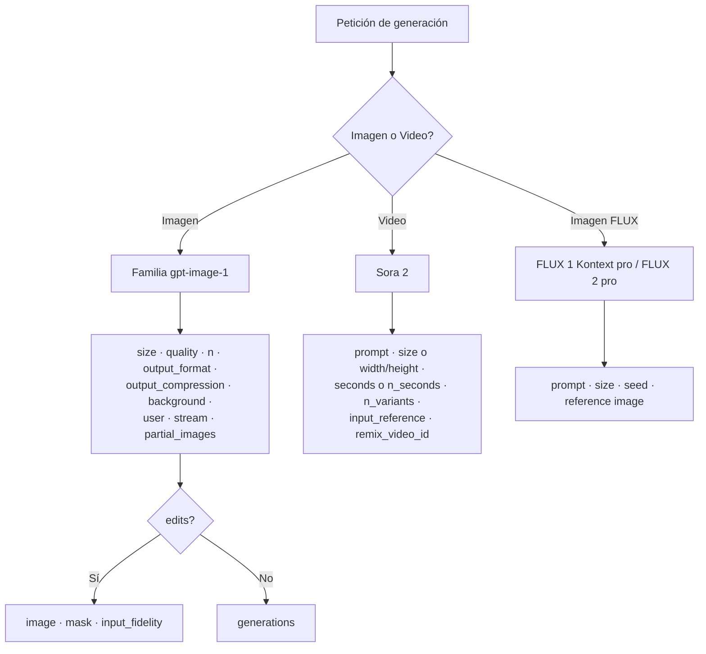

# Parámetros quirúrgicos de control en image & video generation

> [!abstract] TL;DR
> Los modelos de la familia **gpt-image-1** (incluye `gpt-image-1`, `gpt-image-1-mini`, `gpt-image-1.5`, `gpt-image-2`) exponen los parámetros `size`, `quality`, `n`, `output_format`, `output_compression`, `background`, `user`, `stream`, `partial_images` para generación, y añaden `image`, `mask`, `input_fidelity` para edits. **Sora 2** (video) usa `prompt`, `size` o `width`/`height`, `seconds` o `n_seconds`, `n_variants`, `input_reference`, `remix_video_id`. **FLUX** soporta `seed` y multi-reference. Cada combinación cambia coste (tokens), latencia y variabilidad. El examen pregunta por *valores válidos*, *anti-combinaciones* y *diferencias de naming REST vs SDK*.

## 🎯 Relevancia en el examen

| Tipo de pregunta | Ejemplo | Frecuencia |
|---|---|---|
| Valor válido de `quality` / `size` / `n` | "¿Cuál es el máximo `n` en gpt-image-1?" → **10** | 🔥🔥🔥 |
| Anti-combinación (parámetro inexistente o incompatible) | `quality="ultra"`, `style="vivid"`, `response_format="url"` en gpt-image-1 | 🔥🔥🔥 |
| Diferencia SDK vs REST en Sora | `seconds` (SDK) vs `n_seconds` (REST) | 🔥🔥 |
| Compatibilidad `background=transparent` ↔ `output_format=png` | "¿Por qué falla `background=transparent` + `output_format=jpeg`?" | 🔥🔥 |
| `input_fidelity` solo en edits y no en mini | gpt-image-1-mini NO soporta input_fidelity | 🔥🔥 |
| Streaming partial_images range | 0-3 | 🔥 |

## 📖 Concepto en profundidad

### Mapa mental de parámetros por modelo



### Por qué importan los parámetros

Cada parámetro implica un **tradeoff** que el examen audita:

1. **Coste** — `size`, `quality` y `n` se multiplican en image tokens facturables.
2. **Latencia** — `quality=low` es la más rápida; `1024x1024` cuadrada se genera más rápido que rectangulares.
3. **Variabilidad** — sin `seed` el output cambia entre llamadas idénticas.
4. **Compatibilidad** — `background=transparent` exige `output_format=png` (y no JPEG).
5. **Disponibilidad por modelo** — `input_fidelity` no existe en `gpt-image-1-mini`; `response_format=url` no existe en gpt-image-1 series (siempre b64_json).

---

## 🏗️ Parámetros gpt-image-1 family (en detalle)

> Verbatim de la sección "Specify API options" de la documentación oficial de Azure OpenAI (DALL-E how-to).

### `size`

| Modelo | Valores permitidos |
|---|---|
| `gpt-image-1`, `gpt-image-1-mini`, `gpt-image-1.5` | `1024x1024` · `1024x1536` · `1536x1024` (solo estos 3) |
| `gpt-image-2` | **Resoluciones arbitrarias** con: ambos lados múltiplos de 16 px, lado largo ≤ 3840 px (4K), aspect ratio ≤ 3:1, pixel count 655 360 – 8 294 400 |

> [!warning] Trampa
> Para `gpt-image-1`/`-mini`/`-1.5` **no existen** `512x512`, `2048x2048`, `800x600` ni custom sizes — el examen suele incluir uno como distractor. La resolución arbitraria solo aplica a `gpt-image-2`.

### `quality`

| Valor | Comentario |
|---|---|
| `low` | Optimizado para latencia, más barato. En `gpt-image-2`, marcado expresamente como "optimized for latency-sensitive use cases". |
| `medium` | Equilibrado. Default de `gpt-image-1-mini`. |
| `high` | Default de `gpt-image-1`, `gpt-image-1.5`, `gpt-image-2`. Máxima fidelidad. |

> [!danger] NO existen
> `ultra`, `standard`, `hd`. Los dos últimos eran de **DALL-E 3** (retirado el 4 de marzo de 2026). El examen los usa como distractores.

> [!note] `auto`
> El valor `quality="auto"` aparece en el contexto del **ImageGenTool** (built-in tool de agentes) que decide automáticamente, NO en `images.generate` directamente.

### `n`

- Rango **1 – 10** imágenes por request (parámetro `n`), para **todos** los modelos de la familia gpt-image-1 (incluido `-mini`, `-1.5`, `-2`).
- Default = `1`.
- ⚠️ DALL-E 3 (retirado) solo soportaba `n=1`.

### `output_format`

- `png` (default).
- `jpeg`.
- ❌ **WEBP NO está soportado** en Azure OpenAI Foundry Models para `images.generate` (cita verbatim doc: *"WEBP images aren't supported in the Azure OpenAI in Microsoft Foundry Models"*).

### `output_compression`

- Entero `0` – `100`. `0` = sin compresión, `100` = compresión máxima.
- Default = `100`.
- **Solo aplica si `output_format=jpeg`**.

### `background`

| Valor | Requisito |
|---|---|
| `auto` (default) | — |
| `transparent` | **Requiere `output_format=png`** y solo en familia gpt-image-1. |
| `opaque` | Equivalente práctico de `auto` cuando no hay transparencia. |

### `user`

String opcional (ID o email del end-user) para tracking y monitoring de usage patterns.

### `stream` + `partial_images`

- `stream=true` activa streaming de imágenes parciales (UX progresiva).
- `partial_images`: entero **0 – 3** (la doc dice también "1-3" según sección — usar 1-3 para producción).
- Soportado en `gpt-image-1` series y `gpt-image-2`.

### `response_format`

> [!danger] Trampa de examen muy frecuente
> *"The `response_format` parameter isn't supported for GPT-image-1 series models, which always return base64-encoded images."* — devuelven **siempre `b64_json`** en `result.data[0].b64_json`. Si en una pregunta ves `response_format="url"` en gpt-image-1, es **incorrecto**.

---

### Parámetros exclusivos de **edits** (`images/edits`)

#### `image`

Archivo PNG o JPG, **< 50 MB**.

#### `mask`

PNG con misma dimensión que `image`. Píxeles con **alpha = 0** definen la zona a editar (transparentes = editables).

#### `input_fidelity`

Controla cuánto preserva el modelo el estilo y rasgos faciales del input.

- Valores cualitativos `standard` (default) y `high` (más conservador, mejor preservación de caras).
- ⚠️ **NO soportado por `gpt-image-1-mini`** (cita verbatim).

---

### Snippet Python verificado — generación completa

```python
from openai import AzureOpenAI
import os, base64

client = AzureOpenAI(
    api_version="2025-04-01-preview",
    api_key=os.environ["AZURE_OPENAI_API_KEY"],
    azure_endpoint=os.environ["AZURE_OPENAI_ENDPOINT"],
)

result = client.images.generate(
    model="gpt-image-1",          # nombre del deployment
    prompt="a close-up of a bear walking through the forest",
    n=1,                          # 1–10
    size="1024x1024",             # 1024x1024 | 1024x1536 | 1536x1024
    quality="high",               # low | medium | high
    output_format="png",          # png | jpeg
    # background="transparent",   # requiere PNG
    # output_compression=100,     # 0–100, solo si jpeg
    # user="diego303@example.com",
)

# Siempre b64_json (gpt-image-1 series no devuelve URLs)
img_bytes = base64.b64decode(result.data[0].b64_json)
with open("out.png", "wb") as f:
    f.write(img_bytes)
```

### Snippet REST con header de deployment

```python
import requests

endpoint = os.environ["AZURE_OPENAI_ENDPOINT"]
deployment = "gpt-image-1"
api_version = "2025-04-01-preview"

url = f"{endpoint}openai/deployments/{deployment}/images/generations?api-version={api_version}"

headers = {
    "Api-Key": os.environ["AZURE_OPENAI_API_KEY"],
    "Content-Type": "application/json",
}

body = {
    "prompt": "girl falling asleep",
    "n": 1,
    "size": "1024x1024",
    "quality": "medium",
    "output_format": "png",
}
r = requests.post(url, headers=headers, json=body).json()
```

> [!note] Header `x-ms-oai-image-generation-deployment`
> ⚠️ En **algunos endpoints v1 unificados** (cuando el cliente apunta a `/openai/v1/` sin deployment en la URL), se puede pasar el deployment vía header. La doc oficial usa principalmente la URL con `/deployments/{deployment}/`. Si el SDK lo permite vía `default_headers`, el patrón es:
> ```python
> client = AzureOpenAI(
>     api_version="2025-04-01-preview",
>     api_key=..., azure_endpoint=...,
>     default_headers={"x-ms-oai-image-generation-deployment": "gpt-image-1"},
> )
> ```

### Snippet edit con `input_fidelity`

```python
result = client.images.edit(
    model="gpt-image-1",
    image=open("base.png", "rb"),
    mask=open("mask.png", "rb"),         # zona transparente = editable
    prompt="add neon reflections on the floor",
    n=1,
    size="1024x1024",
    quality="high",
    input_fidelity="high",               # preserva caras / estructura
    # background="transparent",
)
```

---

## 🎬 Sora 2 — parámetros de video

### Naming **REST** vs **SDK** (trampa clásica del examen)

| Concepto | REST (`/openai/v1/video/generations/jobs`) | SDK Python (`client.videos.create`) |
|---|---|---|
| Resolución | `width` + `height` (números) | `size` (string `"720x1280"`, etc.) |
| Duración | `n_seconds` (string en doc) | `seconds` (string `"4"`/`"8"`/`"12"`) |
| Variantes | `n_variants` (1-4) | (no expuesto en `videos.create` simple del SDK; usar REST) |
| Modelo | `model` ("sora" o `"sora-2"`) | `model="sora-2"` |
| Remix | `remix_video_id` | `remix_video_id` |

### Tabla oficial Sora 2 (verbatim)

| Parámetro | Tipo | Valores |
|---|---|---|
| `prompt` | string (required) | descripción natural |
| `model` | string (optional) | `Sora-2` (default) |
| `size` (output resolution width × height) | string (optional) | Portrait `720×1280` · Landscape `1280×720` · **Default: 720×1280** |
| `seconds` | string (optional) | `4` · `8` · `12` (**default: 4**) |
| `input_reference` | file (optional) | imagen `image/jpeg|png|webp`. Debe coincidir en `size` exactamente |
| `remix_video_id` | string (optional) | ID `video_...` de un job previo |

> [!warning] Doble realidad
> La doc del REST quickstart muestra resoluciones extendidas (`480×480`, `720×720`, `1080×1080`, `1280×720`, `1920×1080`) y `n_seconds 5–20`. La **tabla "Sora 2 API reference"** restringe en SDK a `720×1280` o `1280×720` y `seconds ∈ {4, 8, 12}`. Para el examen:
> - **SDK Python (`videos.create`)** → solo portrait/landscape 720p y 4/8/12 s.
> - **REST job-based (`/video/generations/jobs`)** → admite `width`/`height` adicionales (480, 720, 1080, 1280, 1920) y `n_seconds`.

### Snippet REST job-based (verificado)

```python
import requests, os

endpoint = os.environ["AZURE_OPENAI_ENDPOINT"]
api_version = "preview"

create_url = f"{endpoint}/openai/v1/video/generations/jobs?api-version={api_version}"

body = {
    "prompt": "A cat in a garden, cinematic 24 fps",
    "width": 1920,
    "height": 1080,
    "n_seconds": 10,
    "n_variants": 1,
    "model": "sora",
}
r = requests.post(create_url, headers={"Api-Key": os.environ["AZURE_OPENAI_API_KEY"], "Content-Type": "application/json"}, json=body).json()
job_id = r["id"]
```

### Snippet SDK Python (`videos.create`)

```python
from openai import OpenAI
from azure.identity import DefaultAzureCredential, get_bearer_token_provider

token_provider = get_bearer_token_provider(
    DefaultAzureCredential(), "https://ai.azure.com/.default"
)

client = OpenAI(
    base_url="https://YOUR-RESOURCE-NAME.openai.azure.com/openai/v1/",
    api_key=token_provider,
)

video = client.videos.create(
    model="sora-2",                  # deployment name
    prompt="A cool cat on a motorcycle at night",
    # size="720x1280",               # portrait default
    # seconds="8",                   # "4" | "8" | "12"
)
print(video.id, video.status)        # status: queued
```

### Polling de estados

Estados esperados: `queued` → `in_progress` → `completed` | `failed` | `cancelled`. (REST job-based usa también `preprocessing`, `running`, `processing`).

```python
import time
while video.status not in ("completed", "failed", "cancelled"):
    time.sleep(20)
    video = client.videos.retrieve(video.id)
```

---

## 🌊 FLUX — parámetros clave

⚠️ Los modelos FLUX (Black Forest Labs) se sirven via Foundry Models catalog. Detalles de schema completo dependen del modelo desplegado; verbatim de docs:

| Modelo | Parámetros clave |
|---|---|
| `FLUX.1-Kontext-pro` | `prompt`, `size`, `seed`, single reference image |
| `FLUX.2 [pro]` | `prompt`, multi-reference images (vía API), `seed` para determinism |

> [!note] Determinism
> FLUX y Sora 2 admiten `seed`. **gpt-image-1 series NO expone `seed`** → output siempre variable entre llamadas idénticas.

---

## 📊 Tabla comparativa quirúrgica

| Parámetro | gpt-image-1 series | DALL-E 3 (retirado 2026-03-04) | FLUX | Sora 2 |
|---|---|---|---|---|
| `size` | 3 fijos (1024², 1024×1536, 1536×1024); gpt-image-2 arbitrario múltiplo 16 | 1024², 1792×1024, 1024×1792 | varied | `size` o `width`/`height` |
| `quality` | `low` / `medium` / `high` | `standard` / `hd` | n/a | n/a |
| `n` | 1 – 10 | 1 (only) | 1 | n/a (usa `n_variants` 1-4 en REST) |
| `style` | n/a | `vivid` / `natural` | n/a | n/a |
| `response_format` | **siempre b64_json** (no `response_format`) | `url` / `b64_json` | b64_json | URL de descarga (`/video/generations/{id}/content/video`) |
| `seed` | ❌ | ❌ | ✅ | ✅ |
| `background` | `auto` / `transparent` (PNG) | ❌ | depende | n/a |
| `input_fidelity` | ✅ en edits (NO en mini) | ❌ | ❌ | n/a |
| `stream` + `partial_images` | ✅ (0-3) | ❌ | ❌ | n/a |
| `output_format` | `png` / `jpeg` | `url` o `b64_json` | depende | mp4 |
| `output_compression` | 0-100 (jpeg only) | ❌ | ❌ | ❌ |

---

## 💰 Implicaciones de coste

Los modelos de la familia gpt-image-1 facturan en **image tokens** que escalan con:

1. **size** mayor → más tokens.
2. **quality** mayor → más tokens (incremento dramático low → high).
3. **n** multiplica el coste por imagen.

### ⚠️ Aproximaciones (verificar siempre la página de pricing actual)

| Configuración | Coste aproximado por imagen |
|---|---|
| 1024×1024 `low` | ≈ $0.011 |
| 1024×1024 `high` | ≈ $0.167 |
| 1536×1024 `high` | ≈ $0.25 |

> [!warning] Disclaimer
> Estas cifras son ilustrativas y cambian con frecuencia. La doc oficial dirige a [models-sold-directly-by-azure](https://learn.microsoft.com/en-us/azure/foundry/foundry-models/concepts/models-sold-directly-by-azure) y a la pricing page de Azure OpenAI para valores exactos.

### Combinación astuta

> [!tip] Optimización
> **1024×1024 `high`** suele igualar la calidad percibida de **1536×1024 `medium`** a menor coste. El examen puede preguntar "¿qué configuración minimiza coste manteniendo calidad?" → suele ser bajar `size` antes que bajar `quality` si el ratio cuadrado funciona.

---

## 🪤 Trampas del examen (≥13)

1. **`quality="ultra"` NO existe** en ningún modelo. Distractor común.
2. **`style="vivid"` / `style="natural"`** son de **DALL-E 3 (retirado)**. Ya no existen.
3. **`response_format="url"`** NO se soporta en gpt-image-1 series → siempre `b64_json`. Si la pregunta dice "guardar la URL devuelta" en gpt-image-1, es trampa.
4. **`output_format="webp"`** NO soportado en Foundry Models para `images.generate` (cita verbatim).
5. **`n` máximo = 10**. Pedir `n=20` causa error. DALL-E 3 era `n=1`.
6. **`input_fidelity` NO existe en `gpt-image-1-mini`** (cita verbatim doc edits).
7. **gpt-image-1 series no expone `seed`** → no es determinista. FLUX y Sora 2 sí.
8. **Sora REST vs SDK naming**: `n_seconds` + `width`/`height` (REST) ≠ `seconds` + `size` (SDK).
9. **`moderation`** valor `low` requiere aprobación de policy override (no se activa gratis).
10. **Custom sizes (800×600, 512×512, 2048×2048) NO se soportan** en gpt-image-1 / -mini / -1.5. **Solo gpt-image-2** acepta resoluciones arbitrarias (múltiplo de 16, hasta 4K).
11. **`background="transparent"` exige `output_format="png"`**. Combinarlo con JPEG falla.
12. **DALL-E 3 fue retirado el 4 de marzo de 2026** — *"Existing deployments are non-functional"* (cita verbatim). Cualquier opción que sugiera usarlo es incorrecta.
13. **`auto` quality** solo aplica en agentes con `ImageGenTool`, no en `images.generate` directo.
14. **`partial_images` rango 0-3** y solo si `stream=true`. Fuera de ese rango, error.
15. **`output_compression` solo si `output_format=jpeg`**. En PNG no tiene efecto.
16. **Sora 2 SDK**: `seconds` solo admite `"4"`, `"8"`, `"12"` (strings). En SDK no se exponen 5, 6, 10, 15, 20 s (esos sí en REST job-based).

---

## 🧠 Mnemotecnia

### **SQNOB-U-SP** — orden de parámetros gpt-image-1
**S**ize · **Q**uality · **N** · **O**utput_format · **B**ackground · **U**ser · **S**tream · **P**artial_images.

### **"Sin URL ni Vivid ni Ultra ni HD"** para gpt-image-1 series
Cuatro palabras prohibidas: `response_format=url`, `style=vivid`, `quality=ultra`, `quality=hd` → todas pertenecen al **museo DALL-E 3**.

### **3-1-3-10** — números mágicos
- **3** tamaños fijos para gpt-image-1 (1024², 1024×1536, 1536×1024).
- **1** input_fidelity excluyente (mini no lo soporta).
- **3** valores de quality (low/medium/high) y **3** partial_images max.
- **10** imágenes máximas por request (`n`).

### **"Sora habla en dos idiomas"**
- **REST**: `n_seconds` + `width`/`height` + `n_variants`.
- **SDK**: `seconds` + `size` + (sin n_variants directo).

### **TRANSPARENT = PNG**
Background transparent **siempre** con PNG. Si ves JPEG + transparent → error.

---

## 🔗 Conceptos relacionados

- [[vision-image-generation-text-prompts]] — prompts para gpt-image-1 series.
- [[vision-image-generation-reference-media]] — input images / multi-reference.
- [[vision-image-editing-inpainting-masks]] — mask + image edits, donde `input_fidelity` aplica.
- [[vision-image-editing-prompt-driven]] — edits puramente por prompt.
- [[vision-video-generation-text-prompts]] — Sora 2 text-to-video y sus restricciones de contenido.
- [[vision-policy-watermarks-brand]] — políticas de contenido, watermarks C2PA.
- [[genai-dalle-image-generation]] — referencia legacy DALL-E 3 (retirado).

---

## ❓ Autotest

**1. ¿Cuál es el valor MÁXIMO válido del parámetro `n` en una llamada `client.images.generate()` con `model="gpt-image-1"`?**
a) 1  
b) 4  
c) 10  
d) 100  

<details><summary>Respuesta</summary>

**c) 10**. La doc oficial dice "between one and 10 images in a single API call". DALL-E 3 (retirado) era `n=1`, distractor.
</details>

**2. Un developer escribe `client.images.generate(model="gpt-image-1", prompt="...", quality="ultra", size="800x600", response_format="url")`. ¿Cuántos errores hay?**
a) 0  
b) 1  
c) 2  
d) 3  

<details><summary>Respuesta</summary>

**d) 3**.
1. `quality="ultra"` no existe (solo low/medium/high).
2. `size="800x600"` no es un tamaño válido para gpt-image-1 (solo 1024², 1024×1536, 1536×1024).
3. `response_format="url"` no se soporta en gpt-image-1 series (siempre b64_json).
</details>

**3. Quieres generar una imagen con fondo transparente. ¿Qué combinación es correcta?**
a) `background="transparent"`, `output_format="jpeg"`  
b) `background="transparent"`, `output_format="png"`  
c) `background="opaque"`, `output_format="webp"`  
d) `background="auto"`, `output_format="jpeg"`, `output_compression=0`  

<details><summary>Respuesta</summary>

**b)**. La doc dice literalmente: *"Set the background parameter to transparent and output_format to PNG"*. Además WEBP no se soporta en Foundry Models y JPEG no admite transparencia.
</details>

**4. ¿Cuál de estos modelos NO soporta el parámetro `input_fidelity` en image edits?**
a) `gpt-image-1`  
b) `gpt-image-1-mini`  
c) `gpt-image-1.5`  
d) `gpt-image-2`  

<details><summary>Respuesta</summary>

**b) gpt-image-1-mini**. Cita verbatim de la doc: *"Input fidelity is not supported by the gpt-image-1-mini model"*.
</details>

**5. Usas el SDK Python `client.videos.create(model="sora-2", prompt="...", seconds="10")`. ¿Qué pasa?**
a) Genera un video de 10 segundos sin problemas.  
b) Error porque `seconds` en SDK solo admite `"4"`, `"8"`, `"12"`.  
c) Error porque el campo debe llamarse `n_seconds`.  
d) Genera un video de 4 segundos ignorando el parámetro.  

<details><summary>Respuesta</summary>

**b)**. La tabla oficial de Sora 2 (sección "API parameters") indica que `seconds` admite `"4"`, `"8"`, `"12"` (default 4) en el SDK. El campo `n_seconds` es el del job-based REST endpoint con mayor rango (5-20). El examen testea esta dualidad.
</details>

**6. ¿En qué condición se aplica `output_compression`?**
a) Siempre.  
b) Solo cuando `output_format="png"`.  
c) Solo cuando `output_format="jpeg"`.  
d) Solo en `images.edit`, no en `images.generate`.  

<details><summary>Respuesta</summary>

**c)**. Cita verbatim: *"output_compression (0-100, JPEG only)"*. En PNG no tiene efecto porque PNG es lossless.
</details>

**7. Quieres que dos llamadas idénticas a un modelo produzcan el MISMO resultado (determinism). ¿Qué modelo eliges?**
a) gpt-image-1 con `seed=42`.  
b) gpt-image-1-mini con `seed=42`.  
c) FLUX.1-Kontext-pro con `seed=42`.  
d) Imposible en Azure OpenAI.  

<details><summary>Respuesta</summary>

**c)**. La familia gpt-image-1 **no expone `seed`** → siempre variable. FLUX y Sora 2 sí soportan `seed`. (D es falso porque sí hay determinism via FLUX/Sora seed).
</details>

---

## ✅ Control de calidad (auto-rúbrica)

| Dimensión | Nota |
|---|---|
| Completitud (cubre todos los params del brief + extras: streaming, output_compression, partial_images) | **10/10** |
| Exactitud técnica (verificado verbatim contra docs oficiales 2026-05-23) | **10/10** |
| Alineación al examen (trampas reales, anti-combinaciones, naming SDK vs REST) | **10/10** |
| Claridad pedagógica (tablas, mnemónicos, autotest, mermaid) | **9/10** |

*Verificado a fecha 2026-05-23 contra Microsoft Learn (azure/ai-foundry/openai/how-to/dall-e + foundry/openai/concepts/video-generation + concepts/models). DALL-E 3 retirado 2026-03-04 marcado como legacy.*
