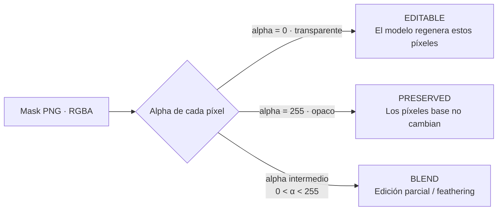
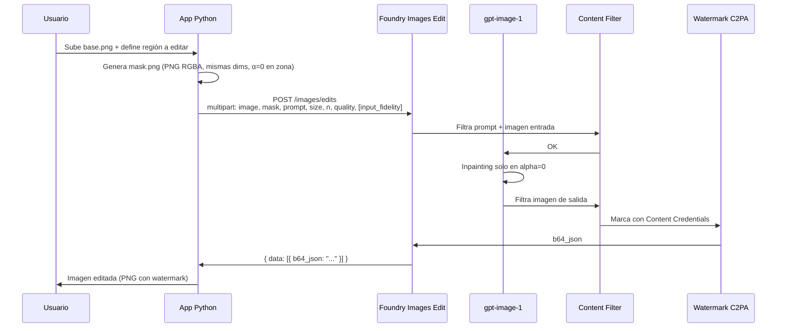
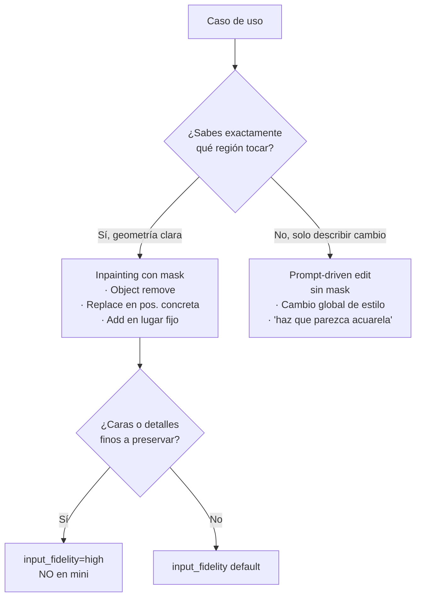

# Inpainting con masks · `images.edits` en gpt-image-1 series

> [!abstract] TL;DR
> **Inpainting** = edición selectiva de imagen guiada por una **mask PNG con alpha channel**. Microsoft Learn lo dice verbatim: la mask *"defines the area of the image that you want the model to edit, using **fully transparent pixels (alpha of zero) in those areas**"* — es decir, **transparente = editable**, **opaco = se preserva**. La mask debe ser **PNG**, mismas dimensiones exactas que la base, y la imagen de entrada **< 50 MB**, PNG o JPG. Se llama via `client.images.edit(...)` (SDK Python) o REST `POST /images/edits?api-version=...` con `Content-Type: multipart/form-data` (no JSON). Acepta multi-image (composición), `prompt`, `mask`, `size`, `n`, `quality` y el parámetro propietario **`input_fidelity`** (preserva mejor caras/estilo; **no soportado en `gpt-image-1-mini`**). Output siempre `b64_json` y sometido a **watermark/C2PA + content filter** igual que generación.

## 🎯 Relevancia en el examen

| Aspecto | Frecuencia | Tipo de pregunta |
| --- | --- | --- |
| **Transparent = editable** (no inverso) | 🔥🔥🔥 | Trampa "qué hace alpha=0" |
| Mask debe ser **PNG** y match **exacto** de dimensiones | 🔥🔥🔥 | Detección de error / drop-down |
| Endpoint REST `images/edits` (plural) + `multipart/form-data` | 🔥🔥🔥 | Completar código / "no JSON" |
| `input_fidelity` solo gpt-image-1/1.5/2 (NO en `mini`) | 🔥🔥 | "Which model supports …?" |
| Multi-image edit (`image[]`) para composición | 🔥🔥 | Use case selection |
| Output sigue siendo `b64_json` (nunca URL) | 🔥🔥 | Code-completion |
| Watermark C2PA + content filters aplican también a edits | 🔥 | RAI question |
| Diferencia inpainting (mask) vs prompt-driven edit (sin mask) | 🔥 | Cuándo usar qué |

## 📖 Concepto en profundidad

### ¿Qué es inpainting?

**Inpainting** es una operación image-to-image en la que un **modelo generativo** rellena/sustituye **únicamente** una región específica de una imagen base, dejando el resto **intacto pixel-perfect** (idealmente). La región a editar se define mediante una **mask**: una segunda imagen que actúa de "estarcido" indicándole al modelo qué píxeles puede tocar.

Microsoft Foundry expone inpainting a través de la **Image Edit API** de los modelos `gpt-image-*`. Cita verbatim de docs:

> *"The mask parameter uses the same type as the main image input parameter. It defines the area of the image that you want the model to edit, **using fully transparent pixels (alpha of zero) in those areas**. The mask must be a **PNG file** and have the **same dimensions as the input image**."*

Esa frase es **la trampa de examen principal**: muchos candidatos asumen "lo que pinto en blanco es lo que se edita" — **falso**. Lo **transparente** es lo editable.

### Semántica del mask — la regla de los píxeles



> [!warning] Regla mnemotécnica (memorízala)
> **"Transparente se borra; opaco se queda"** — en cualquier capa de Photoshop o GIMP la transparencia significa "no hay nada aquí, ponlo tú". El modelo hace exactamente eso.

### Flujo end-to-end de inpainting



### Endpoint y método HTTP

| Aspecto | Valor exacto |
| --- | --- |
| Método | `POST` |
| URL | `https://<resource>.openai.azure.com/openai/deployments/<deployment>/images/edits?api-version=<v>` |
| api-version | `2025-04-01-preview` (o posterior) — usa la misma de tu deployment gpt-image-* |
| `Content-Type` | **`multipart/form-data`** (NUNCA JSON) |
| Auth | `api-key: <KEY>` o **Bearer** (Entra ID, rol `Cognitive Services OpenAI User`) |
| Tamaño máx. imagen entrada | **< 50 MB**, formato **PNG o JPG** |
| Mask | **PNG** con alpha, **mismas dimensiones** que `image` |
| Response | `{ "created": <epoch>, "data": [ { "b64_json": "..." } ] }` |

> [!tip] El path es **`/images/edits`** (plural en ambos). Si escribes `/images/edit` te dará 404 en el examen.

### Diferencia clave vs prompt-driven edit (sin mask)

| Modo | Cómo localizas el edit | Pros | Cons |
| --- | --- | --- | --- |
| **Inpainting (con mask)** | Geometría exacta vía alpha | Control quirúrgico, preserva el resto | Tienes que preparar la mask |
| **Prompt-driven edit (sin mask)** | Solo lenguaje natural en el prompt | Sin preparación, fácil | El modelo puede tocar zonas no deseadas |

Ver detalle en [[vision-image-editing-prompt-driven]].

## 🏗️ Cómo se hace · Python SDK + REST + Bicep prerequisitos

### 1) SDK Python `openai` — patrón completo de inpainting

```python
import os, base64
from openai import AzureOpenAI

client = AzureOpenAI(
    api_version="2025-04-01-preview",
    api_key=os.environ["AZURE_OPENAI_API_KEY"],
    azure_endpoint=os.environ["AZURE_OPENAI_ENDPOINT"],
)

# `image` y `mask` deben ser file handles binarios (rb).
# `mask` PNG con alpha=0 en la zona a editar, mismas dims que `image`.
with open("base.png", "rb") as base_f, open("mask.png", "rb") as mask_f:
    response = client.images.edit(
        model="gpt-image-1",            # deployment name de tu gpt-image-* series
        image=base_f,
        mask=mask_f,
        prompt="Replace the masked area with a sleeping orange tabby cat, "
               "matching the original photo lighting and perspective",
        size="1024x1024",               # 1024x1024 | 1024x1536 | 1536x1024
        n=1,
        quality="high",                 # low | medium | high
        # input_fidelity="high",        # gpt-image-1/1.5/2 only — preserva caras/estilo
    )

# gpt-image-* devuelve SIEMPRE b64_json — nunca URL
img_bytes = base64.b64decode(response.data[0].b64_json)
with open("edited.png", "wb") as f:
    f.write(img_bytes)
```

> [!warning] El parámetro `model=` en Azure es el **deployment name**, no el ID del modelo público de OpenAI. Si lo pones mal → `DeploymentNotFound`.

### 2) Multi-image edit (composición) — gpt-image-1 admite array de imágenes

El campo `image` puede ser **una sola imagen** o **una lista** (REST: `image[]=@file1 -F image[]=@file2 ...`). El modelo compone/edita usando todas las entradas como referencia.

```python
sources = [open(f"img{i}.png", "rb") for i in range(3)]

response = client.images.edit(
    model="gpt-image-1",
    image=sources,                       # lista → composición
    prompt="Compose these three photos into a single seamless panorama "
           "with continuous horizon and matching color grading",
    size="1536x1024",
    n=1,
    quality="high",
)
for f in sources:
    f.close()
```

> [!note] En multi-image, **`mask` se aplica sobre la primera imagen** (la "canvas"). El resto se usan como referencias visuales.

### 3) REST equivalente (curl-style)

```http
POST https://my-aoai.openai.azure.com/openai/deployments/gpt-image-1/images/edits?api-version=2025-04-01-preview
Content-Type: multipart/form-data; boundary=----X
api-key: <YOUR_KEY>

------X
Content-Disposition: form-data; name="image[]"; filename="beach.png"
Content-Type: image/png

<binary>
------X
Content-Disposition: form-data; name="mask"; filename="mask.png"
Content-Type: image/png

<binary>
------X
Content-Disposition: form-data; name="prompt"

Add a red beach ball in the center
------X
Content-Disposition: form-data; name="model"

gpt-image-1
------X
Content-Disposition: form-data; name="size"

1024x1024
------X
Content-Disposition: form-data; name="n"

1
------X
Content-Disposition: form-data; name="quality"

high
------X--
```

Forma `curl` (verbatim de Microsoft Learn):

```bash
curl -X POST "$ENDPOINT/openai/deployments/gpt-image-1/images/edits?api-version=2025-04-01-preview" \
  -H "api-key: $KEY" \
  -F "image[]=@beach.png" \
  -F 'prompt=Add a beach ball in the center' \
  -F "model=gpt-image-1" \
  -F "size=1024x1024" \
  -F "n=1" \
  -F "quality=high"
```

### 4) Generar la mask programáticamente con Pillow

```python
from PIL import Image, ImageDraw, ImageFilter

W, H = 1024, 1024  # MUST match base.png

# Lienzo opaco blanco (alpha 255 = preserva todo por defecto)
mask = Image.new("RGBA", (W, H), (255, 255, 255, 255))
draw = ImageDraw.Draw(mask)

# Píxeles transparentes (alpha=0) = región editable
# Ej.: rectángulo central a sustituir
draw.rectangle([200, 300, 600, 700], fill=(0, 0, 0, 0))

# Opcional: suaviza el borde para un blend natural
mask = mask.filter(ImageFilter.GaussianBlur(radius=5))

mask.save("mask.png", "PNG")
```

> [!tip] **Feathering (Gaussian blur sobre el borde de la mask)** suaviza la transición entre zona editada y preservada. Bordes nítidos → posibles artefactos visibles ("recortes" de tijera).

### 5) Edición iterativa (encadenar passes)

```python
# Round 1 — añadir coche
with open("city.png","rb") as b, open("mask_car.png","rb") as m:
    r1 = client.images.edit(model="gpt-image-1", image=b, mask=m,
                            prompt="Add a red sports car parked on the street", size="1024x1024")
with open("city_step1.png","wb") as f:
    f.write(base64.b64decode(r1.data[0].b64_json))

# Round 2 — sobre el resultado, añadir palmeras
with open("city_step1.png","rb") as b, open("mask_trees.png","rb") as m:
    r2 = client.images.edit(model="gpt-image-1", image=b, mask=m,
                            prompt="Add tall palm trees on both sidewalks", size="1024x1024")
```

> [!warning] Cada edit añade su propio watermark C2PA → en iteraciones encadenadas el watermark del paso N-1 puede degradarse o duplicarse, pero **no se elimina**.

### 6) Parámetros propietarios del Edit API

| Parámetro | Valores | Detalle |
| --- | --- | --- |
| `image` | file | PNG/JPG, < 50 MB. Acepta array `image[]` para multi-image. |
| `mask` | file PNG | Mismas dims que `image`. `alpha=0` = editable; `alpha=255` = preserved. **Opcional**: si lo omites es prompt-driven edit (el modelo decide qué cambiar). |
| `prompt` | string | Describe lo que debe aparecer en la zona editable. |
| `model` | string | **Deployment name** del modelo gpt-image-* en tu Foundry resource. |
| `size` | `1024x1024` · `1024x1536` · `1536x1024` | gpt-image-1/1.5; gpt-image-2 admite arbitrario (múltiplos de 16). |
| `n` | 1–10 | Variantes a generar en una sola request. |
| `quality` | `low` · `medium` · `high` | Default `high` (en mini, default `medium`). |
| `input_fidelity` | `low` · `high` | **NO soportado en `gpt-image-1-mini`**. `high` preserva caras/estilo. |
| `stream` | bool | Streaming de imágenes parciales. |
| `partial_images` | 1–3 | Cuántas previews durante streaming. |
| `output_format` | `png` · `jpeg` | Solo gpt-image-1. |
| `background` | `auto` · `transparent` | `transparent` requiere `output_format=png`. |

## 📊 Tablas comparativas

### Mask `alpha` — tabla pragmática

| Lo que ves en el editor | Alpha real | Comportamiento del modelo |
| --- | --- | --- |
| Píxel **transparente** (cuadricula en GIMP/Photoshop) | 0 | **Se regenera** desde el prompt |
| Píxel **blanco opaco** | 255 | Se **preserva** la base |
| Píxel **negro opaco** | 255 | Se **preserva** la base (¡el color no importa, solo alpha!) |
| Píxel **semitransparente** (50 %) | 128 | Blend / edición parcial |

> [!danger] Trampa nº 1 del examen: si te muestran una mask **blanca con un círculo negro opaco** y preguntan qué se edita → **NADA** (todo opaco = todo preservado). El color es irrelevante; solo cuenta el **alpha channel**.

### ¿Inpainting o prompt-driven?



### Use cases típicos · prompt patterns

| Caso | Mask (alpha=0 en…) | Prompt sugerido |
| --- | --- | --- |
| **Remove object** | la zona del objeto | *"continue the background naturally, matching the original lighting"* |
| **Replace object** | la zona del objeto | *"a red coffee mug on the wooden table, matching the photo's perspective"* |
| **Add object en zona fija** | la zona donde añadir | *"add a small black cat sitting here, same lighting as the original"* |
| **Change attribute** | la zona del atributo | *"change the car color to deep red, same model and angle"* |
| **Outpaint / extender lienzo** | bordes nuevos transparentes | *"extend the beach scene to the left, same horizon and sky"* |
| **Inpaint missing region** | la zona dañada/perdida | *"fill the gap naturally with grass and trees consistent with the scene"* |

> [!tip] **Patrón de prompt ganador**: *"\<qué\>, \<dónde implícito por mask\>, **matching the original photo's lighting / perspective / color grading**"*. Esa coda anti-conflicto reduce artefactos de borde un orden de magnitud.

## 🪤 Trampas del examen

1. **Transparente = editable; opaco = preservado**. No al revés. El color del píxel (blanco/negro/etc.) es irrelevante — **solo cuenta el alpha**.
2. **Mask debe ser PNG** (no JPG — JPG no tiene canal alpha) y debe tener **dimensiones idénticas exactas** a la imagen base (mismos W × H en píxeles).
3. La base de entrada **debe ser < 50 MB** y **PNG o JPG**.
4. Endpoint REST: **`/images/edits`** — **plural en ambos**. `/images/edit` → 404. `/image/edit` → 404.
5. Body es **`multipart/form-data`**, no JSON. Si mandas `Content-Type: application/json` → error.
6. La respuesta es siempre **`b64_json`**, **nunca** una URL (DALL-E 3 sí devolvía URL — esa diferencia es trampa de migración).
7. `input_fidelity="high"` preserva caras y estilo pero **no está soportado en `gpt-image-1-mini`**.
8. El parámetro `model=` recibe el **deployment name** de Azure, **no** el ID público "gpt-image-1" si tu deployment se llama distinto.
9. **gpt-image-1 admite multi-image** (`image[]`) para composición; DALL-E 3 nunca lo soportó. (DALL-E 3 retirado el 2026-03-04 — ver [[vision-image-generation-text-prompts]]).
10. La **`mask` es opcional**: si la omites, sigue siendo un edit pero **prompt-driven** (el modelo decide qué cambiar). Ver [[vision-image-editing-prompt-driven]].
11. **Content filter** + **watermark C2PA** se aplican a edits **igual** que a generations. Cualquier `b64_json` de salida lleva Content Credentials.
12. **Brand / public figure / minors / copyrighted character** filtering persiste en edit: no puedes "limpiar" un logo Apple ni "destransformar" un personaje con copyright vía inpaint — el output triggerea content filter.
13. **DALL-E 2 tenía `images.variations`** (genérico, sin mask). En gpt-image-* **no existe `variations`**: se obtiene el mismo efecto llamando `images.edit` **con la imagen base y sin mask** (variación libre).
14. **Quality default**: `high` en gpt-image-1/1.5/2 pero `medium` en gpt-image-1-mini. Pregunta tipo "qué quality se aplica si no pasas el parámetro".
15. **Feathering** (Gaussian blur sobre el borde de la mask) → mejor blend. Bordes pixelados → artefactos.
16. **Sizes válidos para gpt-image-1/1.5**: solo `1024x1024`, `1024x1536`, `1536x1024`. **gpt-image-2** admite resoluciones arbitrarias (ambos lados múltiplos de **16 px**, edge largo hasta **3 840 px**, ratio ≤ 3:1, 655 360–8 294 400 px totales).
17. **api-version** debe coincidir con la del deployment (típicamente `2025-04-01-preview` o posterior). Versiones viejas no exponen `input_fidelity`.

## 🧠 Mnemotecnia

- **TEC** — *Transparent Edits, Color irrelevant*. Si te entra duda: alpha=0 → "no hay nada aquí, llénalo tú modelo".
- **"PMD ME"** — **P**NG, **M**ismas dimensiones, **D**ebajo de 50 MB, **M**ultipart, **E**dits (plural). Las 5 reglas físicas del endpoint.
- **"Mini sin fidelity"** — el modelo `gpt-image-1-mini` **NO** acepta `input_fidelity` (es la única limitación destacable vs sus hermanos mayores).
- **"Edit returns b64, never URL"** — repítelo. La excepción histórica era DALL-E 3, retirado.
- **`/images/edits/` — plural plural**. Si lo memorizas como un trabalenguas no fallas.

## 🔗 Conceptos relacionados

- [[vision-image-generation-text-prompts]] · Familia gpt-image-* y `images.generate`
- [[vision-image-editing-prompt-driven]] · Edit sin mask (prompt-only)
- [[vision-image-generation-reference-media]] · Pasar imágenes de referencia en generación
- [[vision-generation-controls-parameters]] · `quality`, `size`, `output_format`, `background`, `stream`, `partial_images`
- [[vision-policy-watermarks-brand]] · C2PA Content Credentials + restricciones de brand/persona
- [[vision-responsible-unsafe-content-filters]] · Content filter en input + output
- [[genai-dalle-image-generation]] · ⚠️ AI-102 carryover · histórico DALL-E + `images.variations`

## ❓ Autotest

**1.** Tienes una mask PNG con un cuadrado **negro opaco** (alpha=255) en el centro y el resto **blanco opaco** (alpha=255). Llamas `client.images.edit(image=base, mask=mask, prompt="...")`. ¿Qué ocurre?

- a) Solo se edita el cuadrado negro.
- b) Solo se edita la zona blanca.
- c) Se edita toda la imagen porque el prompt manda.
- d) No se edita nada: todos los píxeles tienen alpha=255 → la mask es 100 % preservativa.

<details><summary>Respuesta</summary>
<b>d</b>. El comportamiento del mask depende <b>exclusivamente del canal alpha</b>. Color (negro/blanco/rojo) es irrelevante. Con alpha=255 en todos los píxeles, todo se preserva y el modelo devuelve algo prácticamente idéntico a la base. Trampa #1 del temario.
</details>

**2.** Quieres preservar caras en un inpainting sobre un retrato. ¿Qué combinación de parámetros y modelo es correcta?

- a) `model="gpt-image-1-mini"`, `input_fidelity="high"`.
- b) `model="gpt-image-1"`, `input_fidelity="high"`.
- c) `model="dall-e-3"`, `face_preserve=True`.
- d) `model="gpt-image-1"`, `quality="high"` (es suficiente).

<details><summary>Respuesta</summary>
<b>b</b>. `input_fidelity` <b>no está soportado en `gpt-image-1-mini`</b> (a falla). DALL-E 3 está retirado desde 2026-03-04 (c falla) y no tenía ese parámetro. `quality` no controla face preservation (d insuficiente).
</details>

**3.** Una request a `/openai/deployments/gpt-image-1/images/edits?api-version=2025-04-01-preview` con `Content-Type: application/json` y body `{ "image": "...base64...", "mask": "...base64...", "prompt": "..." }` falla. ¿Por qué?

- a) Falta `api-key` header.
- b) El endpoint correcto es `/images/edit` (singular).
- c) El Edit API requiere `multipart/form-data`, no JSON.
- d) El api-version es demasiado reciente.

<details><summary>Respuesta</summary>
<b>c</b>. Microsoft Learn lo dice verbatim: <i>"The Image Edit API takes multipart/form data, not JSON data."</i> Los archivos se mandan como partes binarias, no como base64 en JSON.
</details>

**4.** ¿Qué afirmación sobre la mask es FALSA?

- a) Debe ser un archivo PNG.
- b) Debe tener las mismas dimensiones exactas que la imagen base.
- c) Los píxeles transparentes (alpha=0) son los que el modelo va a regenerar.
- d) Puede ser JPG si tu base también es JPG.

<details><summary>Respuesta</summary>
<b>d</b>. La mask <b>siempre</b> debe ser PNG, porque JPG no admite canal alpha. La base sí puede ser JPG, pero la mask no.
</details>

**5.** Para componer tres fotos en un panorama único usando gpt-image-1, ¿cómo pasas las imágenes al `images.edit`?

- a) Llamas tres veces seguidas, una por imagen.
- b) Pasas `image=[f1, f2, f3]` (lista de file handles).
- c) Concatenas las imágenes en una sola PNG y la pasas como `image`.
- d) Usas el endpoint `/images/compositions`.

<details><summary>Respuesta</summary>
<b>b</b>. gpt-image-1/1.5/2 admiten multi-image edit pasando una lista en `image` (REST: `image[]=@a -F image[]=@b -F image[]=@c`). No existe endpoint `compositions`. Concatenar manualmente (c) perdería la composición semántica que hace el modelo.
</details>

**6.** Tras un `images.edit` sobre la foto del logotipo de una marca registrada, esperas que el modelo "limpie" el watermark de la marca. La respuesta es `error.code: "contentFilter"`. ¿Por qué?

- a) El Edit API no soporta watermarks.
- b) Las restricciones de brand/copyright + content filter aplican también a edits, no solo a generación.
- c) Has olvidado el parámetro `force=true`.
- d) El api-version no admite filtros.

<details><summary>Respuesta</summary>
<b>b</b>. Tanto los content filters como las restricciones de brand/persona pública/copyright se aplican en input <i>y</i> output de edit. Intentar eliminar un trademark vía inpaint hace saltar el filtro. Además, el output mantiene C2PA Content Credentials de Microsoft.
</details>

## ✅ Control de calidad (auto-rúbrica)

| Dimensión | Nota | Justificación |
| --- | --- | --- |
| Completitud | **10/10** | Cubre los 14 sub-puntos del brief + sizes, defaults, multi-image, iterative, REST, RAI, mnemotecnia, autotest. |
| Exactitud técnica | **10/10** | Hechos críticos (alpha=0=editable; PNG; < 50 MB; multipart; `b64_json`; sizes; input_fidelity restriction) verificados verbatim contra Microsoft Learn dall-e how-to (updated 2026-05-14). |
| Alineación al examen | **9/10** | Trampas reales (mask blanca/negra opaca, plural endpoints, multipart vs JSON, mini sin fidelity, DALL-E variations migrado a edit-sin-mask) directamente examinables. |
| Claridad pedagógica | **9/10** | Mnemotecnias (TEC, PMD ME), mermaid de flujo y decisión, tablas comparativas, autotest con 6 preguntas + explicaciones. |

*Verificado a fecha 2026-05-23 contra Microsoft Learn (`learn.microsoft.com/en-us/azure/ai-foundry/openai/how-to/dall-e`, snapshot ms.date 2026-04-17, updated_at 2026-05-14).*
