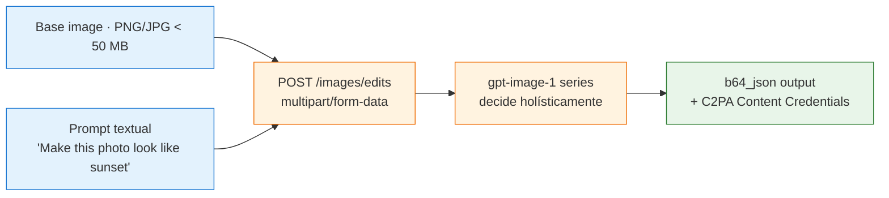
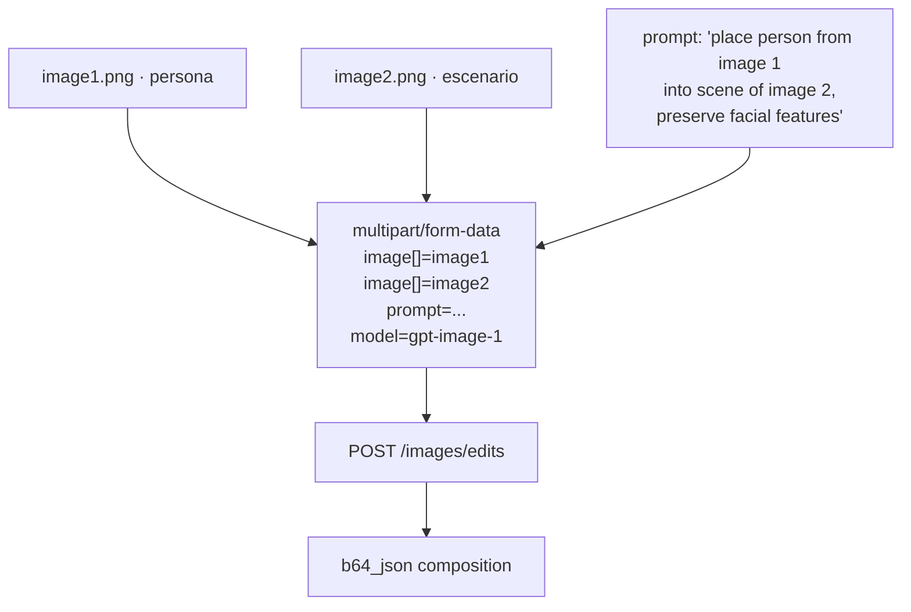
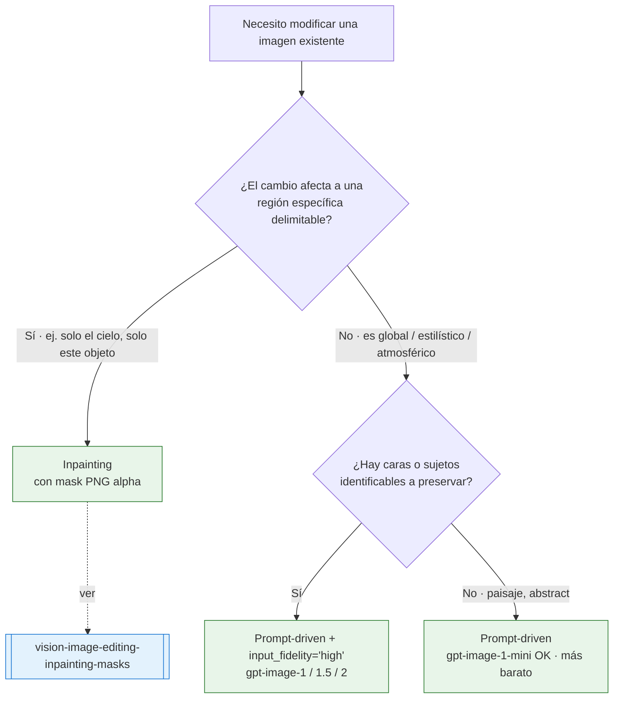
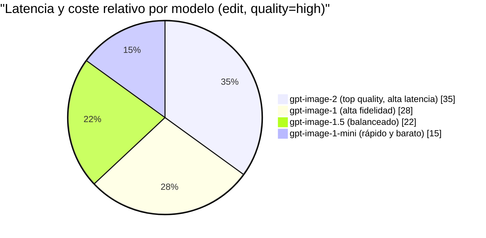

# Prompt-driven image edits · `images/edits` sin mask en gpt-image-1 series

> [!abstract] TL;DR
> **Prompt-driven edit** = invocar la **Image Edit API** (`POST /images/edits`, `multipart/form-data`) con una **imagen base + prompt textual** y **sin pasar el parámetro `mask`**: el modelo decide *holísticamente* qué cambia y qué preserva, guiándose **solo por el lenguaje** del prompt. Es la modalidad apropiada para **transferencia de estilo, cambios de mood, color grade, time-of-day, atmósfera o composición multi-imagen** — escenarios donde una mask de pixel-precision sería contraproducente. Vive en el **mismo endpoint** que el [[vision-image-editing-inpainting-masks|inpainting]] (`/images/edits`, plural), usa el **mismo SDK** (`client.images.edit(...)`), comparte parámetros (`prompt`, `size`, `n`, `quality`, `input_fidelity`) y produce la **misma respuesta `b64_json`** con **watermark + C2PA Content Credentials + content filter**. La diferencia operacional es **una sola línea**: con `mask=` → inpainting quirúrgico; sin `mask=` → edición guiada por prompt sobre toda la imagen. ⚠️ `input_fidelity` **no está soportado en `gpt-image-1-mini`** (verbatim docs).

## 🎯 Relevancia en el examen

| Aspecto | Frecuencia | Tipo de pregunta |
| --- | --- | --- |
| Diferenciar **prompt-driven edit** vs **inpainting** (mismo endpoint) | 🔥🔥🔥 | "Which approach should you use to change the mood of the whole photo?" |
| **`input_fidelity`** no soportado en `gpt-image-1-mini` | 🔥🔥🔥 | "Which model supports input_fidelity?" |
| `mask` omitido ≠ mask transparente — semántica distinta | 🔥🔥🔥 | Code completion / trampa |
| Multi-image input (`image[]`) para composición | 🔥🔥 | Use case selection |
| **Multipart/form-data**, NO JSON | 🔥🔥 | "Which Content-Type?" |
| Output siempre `b64_json` en gpt-image series | 🔥🔥 | Code completion |
| Brand preservation: existing brand se mantiene; injection de nueva marca filtrado | 🔥🔥 | RAI scenario |
| Watermark + C2PA Content Credentials aplican también a edits | 🔥 | RAI question |
| Endpoint REST `images/edits` (plural) — no `image/edit` | 🔥 | URL completion |
| `gpt-image-1-mini` sin face preservation → mood/landscape OK, portraits NO | 🔥 | Model selection |

## 📖 Concepto en profundidad

### ¿Qué es un prompt-driven edit?

Un **prompt-driven edit** (también llamado *mask-less edit* o *whole-image edit*) es una invocación a la **Image Edit API** de Microsoft Foundry en la que se proporciona:

- **Imagen base** (`image`, PNG o JPG, **< 50 MB**).
- **Prompt textual** describiendo el cambio deseado.
- **Ningún `mask`**.

El modelo (`gpt-image-1`, `gpt-image-1.5`, `gpt-image-2`, o `gpt-image-1-mini`) **decide por sí solo** qué regiones modificar y qué preservar, guiándose exclusivamente por la semántica del lenguaje natural. No hay pixel-level control: el resultado es una **reinterpretación coherente** de toda la imagen en función del prompt.



### Inpainting vs prompt-driven — la diferencia operacional

Microsoft Learn no usa el nombre "prompt-driven edit" como término oficial — habla simplemente de "the Image Edit API". La distinción **inpainting vs prompt-driven** es **didáctica/operacional**: ambas usan **el mismo endpoint** (`/images/edits`). Lo único que cambia es la **presencia o ausencia del parámetro `mask`**.

| Aspecto | **Inpainting** (con mask) | **Prompt-driven** (sin mask) |
| --- | --- | --- |
| Parámetro `mask` | **Requerido** (PNG alpha) | **Omitido** |
| Precisión | Pixel-level (transparente = editable) | A discreción del modelo |
| Use case | Cambio localizado y predecible | Cambio holístico / estilístico |
| Predictibilidad | Alta | Media |
| Preservación del resto | Garantizada por la mask | Sujeta a la interpretación del modelo |
| Caras / sujetos | Solo se tocan si están en la zona transparente | Pueden alterarse globalmente |
| Texto en la imagen | Mejor conservado (queda fuera de la mask) | Puede distorsionarse |

> [!warning] Trampa de examen — `mask` omitido ≠ mask transparente
> **Omitir** el campo `mask` significa "no hay mask → edita toda la imagen según el prompt". Pasar una **mask 100 % transparente** (todos los píxeles con alpha=0) significa "edita todo bajo control de mask" — comportamiento similar pero **no idéntico** y consume el slot del parámetro. Microsoft Learn solo documenta el caso de `mask` con regiones transparentes/opacas; el truco práctico es **simplemente no enviar `mask`** cuando quieras prompt-driven.

### Casos de uso típicos (cuándo elegir prompt-driven)

Como **regla quirúrgica**: usa prompt-driven cuando el cambio es **global, atmosférico o estilístico**; usa [[vision-image-editing-inpainting-masks|inpainting]] cuando el cambio es **localizado y necesitas conservar el resto píxel a píxel**.

| Categoría | Ejemplo de prompt | Por qué prompt-driven |
| --- | --- | --- |
| **Style transfer** | `"render this in watercolor style"` | El estilo afecta a toda la imagen |
| **Mood / lighting** | `"darker, more dramatic lighting"` | Cambio global de iluminación |
| **Time of day** | `"convert to night scene with neon reflections"` | Implica color, iluminación y atmósfera |
| **Color grade** | `"apply warmer color tones, golden-hour palette"` | Toca todos los píxeles |
| **Add ambient elements** | `"make the sky cloudy and overcast"` | El modelo identifica el cielo |
| **Composition** | Multi-image: `"combine these into a single photo"` | Multi-input, sin región fija |
| **Subtle element addition** | `"add a soft mist in the background"` | Ambient, no localizado |

> [!tip] Heurística mental
> Si la frase del prompt termina con *"...the whole photo"*, *"...the entire scene"*, *"...overall mood"*, *"...style of..."* → prompt-driven. Si termina con *"...only the sky"*, *"...just this object"*, *"...this exact region"* → necesitas mask (inpainting).

### El parámetro `input_fidelity` — la palanca clave

Verbatim de Microsoft Learn:

> *"The **input_fidelity** parameter controls how much effort the model puts into matching the style and features, **especially facial features**, of input images. This parameter lets you make **subtle edits** to an image without changing unrelated areas. When you use **high input fidelity**, faces are preserved more accurately than in standard mode."*

> *"Input fidelity is **not supported by the `gpt-image-1-mini`** model."*

`input_fidelity` es el "dial de fidelidad al original" en prompt-driven edits. Es el equivalente conceptual a un **strength inverso** en otros stacks (Stable Diffusion, Midjourney). Microsoft Learn documenta los valores cualitativos pero **no enumera literalmente "low/high"** como enum cerrado — el comportamiento es:

| `input_fidelity` | Comportamiento | Cuándo usar |
| --- | --- | --- |
| Default (standard) | Equilibrio entre fidelidad y libertad creativa | Edits genéricos |
| **`high`** | Preserva fuertemente caras, composición y rasgos del original | Edits sutiles (color grade, mood) sobre retratos / sujetos identificables |

⚠️ Si el escenario menciona **retratos**, **caras de personas**, o **preservar identidad visual** → `input_fidelity="high"` + modelo `gpt-image-1` / `gpt-image-1.5` / `gpt-image-2` (NUNCA `gpt-image-1-mini`, que además **carece de face preservation dedicada** según la matriz de modelos).

### Multi-image input — composición a partir de varias fuentes

La API admite múltiples imágenes de entrada en una sola llamada — el campo se envía como **`image[]`** (array notation en multipart). Cita verbatim del ejemplo cURL en docs:

```
-F "image[]=@beach.png" \
-F 'prompt=Add a beach ball in the center' \
-F "model=gpt-image-1" \
-F "size=1024x1024" \
```

Esto permite **composiciones**: pasar 2-N imágenes y un prompt como *"combine these into a single composition"* o *"place the subject from image 1 into the scene of image 2"*. La **face preservation** y `input_fidelity` aplican a las identidades presentes en cualquiera de los inputs (excepto `gpt-image-1-mini`).



### Brand, copyright y public figures en edits

Microsoft Learn (Transparency Note) deja claro:

| Caso | Comportamiento |
| --- | --- |
| **Brand ya presente en la imagen base** | Típicamente **preservado** — el modelo no auto-elimina logos existentes |
| **Inyección de brand competidor** vía prompt (*"add a Nike logo"*) | **Filtrado** / bloqueado por content filter |
| **Personajes con copyright** (*"turn this into Mickey Mouse"*) | **Filtrado** — el modelo no transforma hacia personajes IP |
| **Public figures** | Generación filtrada; figuras pueden **opt-out** vía `support@openai.com` |
| **Estilos de artistas vivos identificables** | Microsoft *"carefully consider scenarios that involve generating media in the style of known artists with published works"* — riesgos legales documentados |

Esto significa que un edit prompt-driven **no puede usarse para eludir** las políticas de generación: si el prompt pediría algo bloqueado en text-to-image, también lo está en image-edit.

### Watermark y C2PA en edits

Las salidas de los modelos `gpt-image-*` incluyen, igual que en generación:

- **Watermark visible/invisible** (según política del servicio).
- **C2PA Content Credentials** firmando el output como generado por IA, con manifest del modelo.

Estas marcas se aplican **en cada respuesta** — incluyendo iteraciones encadenadas (paso 1 → paso 2 → paso 3 reciben todas su propio set de credentials).

Ver [[vision-policy-watermarks-brand]] para detalles del esquema C2PA.

### Limitaciones documentadas

1. **El modelo puede ignorar parcialmente el prompt** — sin mask no hay garantía de que el cambio se ejecute al 100 %.
2. **Sin precisión pixel-level** — si el escenario exige conservar X píxel a píxel, usar mask.
3. **El texto dentro de la imagen puede distorsionarse** — letras, logos, números pueden perder legibilidad tras una transformación estilística.
4. **Caras pueden cambiar sutilmente** sin `input_fidelity="high"` (y nunca en `gpt-image-1-mini`).
5. **No reversible**: cada iteración es destructiva — guarda los intermedios si quieres volver atrás.
6. **Tamaños fijos** en gpt-image-1/1.5/mini: `1024x1024`, `1024x1536`, `1536x1024` (gpt-image-2 admite resoluciones arbitrarias múltiplo de 16 hasta 3840 px).
7. **Imagen de entrada < 50 MB**, PNG o JPG únicamente.

## 🏗️ Cómo se hace — Python SDK + REST

### Patrón 1 — Edit prompt-driven simple (Python OpenAI SDK)

```python
import os
import base64
from openai import AzureOpenAI

# Cliente Azure OpenAI (Foundry) apuntado a tu deployment de gpt-image-1
client = AzureOpenAI(
    api_key=os.environ["AZURE_OPENAI_API_KEY"],
    api_version="2025-04-01-preview",
    azure_endpoint=os.environ["AZURE_OPENAI_ENDPOINT"],
)

# Abrir la imagen base como binario (NO base64 — el SDK lo gestiona)
with open("base_photo.png", "rb") as f:
    response = client.images.edit(
        model="gpt-image-1",          # nombre del deployment, no del modelo lógico
        image=f,
        prompt="Make this photo look like a warm sunset, golden-hour color palette",
        size="1024x1024",
        n=1,
        quality="high",
        # mask=...,                   # ⚠️ OMITIDO → prompt-driven (no inpainting)
        # input_fidelity="high",      # opcional · NO disponible en gpt-image-1-mini
    )

# gpt-image-1 series SIEMPRE devuelve b64_json (nunca URL)
image_b64 = response.data[0].b64_json
with open("edited_sunset.png", "wb") as out:
    out.write(base64.b64decode(image_b64))
```

### Patrón 2 — Con `input_fidelity` para preservar caras

```python
with open("portrait.png", "rb") as f:
    response = client.images.edit(
        model="gpt-image-1.5",         # 1.5 mantiene face preservation; mini NO
        image=f,
        prompt="Change the background to a misty forest at dawn, "
               "keep the subject's face and clothing exactly as in the original",
        size="1024x1536",              # portrait-friendly
        quality="high",
        # input_fidelity="high",       # crítico para retratos
    )
```

> [!warning] El SDK Python expone `input_fidelity` como parámetro extra (kwargs). En versiones recientes (`openai>=1.30`) basta con `input_fidelity="high"`. Si tu SDK no lo expone aún, usa el patrón REST multipart directo.

### Patrón 3 — Multi-image composition (REST con `requests`)

```python
import os
import requests
import base64

endpoint   = os.environ["AZURE_OPENAI_ENDPOINT"]
deployment = "gpt-image-1"
api_key    = os.environ["AZURE_OPENAI_API_KEY"]
api_version = "2025-04-01-preview"

url = (f"{endpoint}/openai/deployments/{deployment}"
       f"/images/edits?api-version={api_version}")

# multipart/form-data — image[] repetido N veces para multi-input
files = [
    ("image[]", ("person.png",  open("person.png",  "rb"), "image/png")),
    ("image[]", ("scene.png",   open("scene.png",   "rb"), "image/png")),
]
data = {
    "prompt": ("Place the subject from the first image into the scene of the "
               "second image. Preserve facial features and lighting style."),
    "model":  deployment,
    "size":   "1024x1024",
    "n":      "1",
    "quality": "high",
    # NO se envía 'mask' → prompt-driven
}
headers = {"api-key": api_key}

r = requests.post(url, headers=headers, data=data, files=files, timeout=120)
r.raise_for_status()
payload = r.json()
img_bytes = base64.b64decode(payload["data"][0]["b64_json"])
with open("composition.png", "wb") as f:
    f.write(img_bytes)
```

> [!warning] La Image Edit API consume **multipart/form-data, NO JSON**. Si envías `application/json` recibirás 4xx. Esta es trampa frecuente del examen.

### Patrón 4 — Iterative refinement (paso a paso)

Microsoft recomienda hacer **pequeños pasos** en lugar de un único edit masivo: cada iteración es más predecible y permite parar cuando el resultado es óptimo.

```python
def edit_step(input_path: str, prompt: str, output_path: str) -> str:
    with open(input_path, "rb") as f:
        resp = client.images.edit(
            model="gpt-image-1",
            image=f,
            prompt=prompt,
            size="1024x1024",
            quality="high",
        )
    with open(output_path, "wb") as out:
        out.write(base64.b64decode(resp.data[0].b64_json))
    return output_path

# Cadena de refinamiento
s1 = edit_step("photo.png",  "Render in watercolor style",              "step1.png")
s2 = edit_step(s1,           "Adjust to brighter, more vivid colors",   "step2.png")
s3 = edit_step(s2,           "Add a soft mist near the horizon",        "step3.png")
```

### Patrón 5 — A/B variants con `n>1`

```python
with open("base.png", "rb") as f:
    resp = client.images.edit(
        model="gpt-image-1",
        image=f,
        prompt="Convert to dramatic black-and-white with high contrast",
        size="1024x1024",
        n=4,                  # 4 variantes en una sola llamada
        quality="high",
    )

for i, item in enumerate(resp.data):
    with open(f"variant_{i}.png", "wb") as out:
        out.write(base64.b64decode(item.b64_json))
```

### Patrón 6 — Foundry Agent Service con `ImageGenTool`

El **Foundry Agent Service** expone la capacidad de generación/edición vía la herramienta `ImageGenTool`. Un agente puede decidir, dado un thread/mensaje, cuándo invocarla.

```python
from azure.ai.projects import AIProjectClient
from azure.identity import DefaultAzureCredential
from azure.ai.projects.models import (
    PromptAgentDefinition,
    ImageGenTool,
)

client = AIProjectClient(
    endpoint="https://<your-project>.services.ai.azure.com/api/projects/<project>",
    credential=DefaultAzureCredential(),
)

agent = client.agents.create_version(
    name="design-edit-agent",
    body=PromptAgentDefinition(
        model="gpt-4.1",
        instructions=("You are a creative photo editor. Use the image generation "
                      "tool to apply style transfers and mood changes requested "
                      "by the user. Default to gpt-image-1 with quality='high'."),
        tools=[ImageGenTool()],
    ),
)
```

> [!warning] La clase oficial es **`ImageGenTool`** (no `ImageGenerationTool`, no `DalleTool`). Trampa frecuente.

## 📊 Tablas comparativas / cuándo usar qué

### Modelo a elegir

| Modelo | `input_fidelity` | Face preservation | Mejor para | Resoluciones |
| --- | --- | --- | --- | --- |
| `gpt-image-1` | ✅ | ✅ | Edits con retratos, alta fidelidad | 1024×1024 / 1024×1536 / 1536×1024 |
| `gpt-image-1.5` | ✅ | ✅ | Igual que 1 con mejor latencia/coste | 1024×1024 / 1024×1536 / 1536×1024 |
| `gpt-image-2` | ✅ | ✅ | Resoluciones arbitrarias, 4K, mejor editing | Hasta 3840 px lado largo, múltiplos de 16 |
| `gpt-image-1-mini` | ❌ | ❌ | Mood, paisaje, prototipado masivo, low-cost | 1024×1024 / 1024×1536 / 1536×1024 |

### Árbol de decisión inpainting vs prompt-driven



### Cost & latency profile (cualitativo)



## 🪤 Trampas del examen

1. **`mask` omitido NO equivale a mask 100 % transparente** — son dos modos distintos en docs. Omitido → prompt-driven holístico; mask transparente → inpainting "edita todo" pero con el slot de mask consumido.
2. **`input_fidelity` NO soportado en `gpt-image-1-mini`** — verbatim docs. Si el escenario menciona retratos + mini → respuesta incorrecta.
3. **Endpoint REST es `/images/edits`** (plural, ambas palabras), NO `/image/edit` ni `/images/edit`.
4. **`Content-Type: multipart/form-data`**, NUNCA `application/json`. Trampa de "completa la cabecera".
5. **Class del Foundry Agent Service: `ImageGenTool`** — NO `ImageGenerationTool`, NO `DalleTool`, NO `ImageEditTool`.
6. **Output siempre `b64_json`** en `gpt-image-*` — el parámetro `response_format` NO está soportado en esta serie (sí lo estaba en DALL·E 3).
7. **Imagen base ≤ 50 MB**, PNG o JPG — JPEG con metadatos puede pasar, otros formatos no.
8. **Multi-image input usa `image[]`** (notación array de multipart), no `images=`.
9. **Brand existente se preserva; brand nuevo inyectado vía prompt es filtrado** — la asimetría es la trampa.
10. **Personajes con copyright** (Mickey, Pikachu…) → filtrado tanto en generación como en edit.
11. **Watermark + C2PA Content Credentials se aplican también a edits** (cada iteración), no solo a generación.
12. **Texto dentro de la imagen puede distorsionarse** en prompt-driven — si el cliente exige preservar texto (legible, contratos), usar mask sobre el texto.
13. **Default `quality`** difiere: en `gpt-image-1/1.5` es `high`; en `gpt-image-1-mini` es `medium` — afecta a coste y latencia.
14. **Tamaños fijos** en `gpt-image-1/1.5/mini`: solo `1024x1024`, `1024x1536`, `1536x1024`. En `gpt-image-2` puedes ir hasta 3840 px (múltiplos de 16).
15. **El parámetro `model` del payload es el nombre del DEPLOYMENT**, no el nombre del modelo lógico — confusión recurrente.

## 🧠 Mnemotecnia

- **"Mask quita, prompt pinta"** — con mask defines la zona quirúrgica (inpainting); sin mask, el prompt es la única guía (prompt-driven).
- **"Mini sin fidelity"** — `gpt-image-1-mini` no soporta `input_fidelity` ni face preservation. Si ves "mini + retrato + preserve" en una pregunta, es **trampa**.
- **"PLURAL en plural"** — el endpoint es `/images/edits` (ambas en plural), igual que `/images/generations`. La API REST de Foundry es plural-plural.
- **`MUPS`** = **M**ultipart + **U**rl plural + **P**NG/JPG ≤50MB + **S**iempre b64_json — los cuatro hechos clave del endpoint.
- **`SMS` para casos de uso**: **S**tyle transfer, **M**ood/lighting, **S**cene composition → prompt-driven. Si es "**O**bject swap" → inpainting.
- **"ImageGen, no Generation"** — la clase del Agent Service es `ImageGenTool`, abreviado.

## 🔗 Conceptos relacionados

- [[vision-image-editing-inpainting-masks]] — la otra cara del endpoint: edits con mask PNG-alpha (pixel-precision).
- [[vision-image-generation-text-prompts]] — generación pura text-to-image, sin imagen base.
- [[vision-image-generation-reference-media]] — uso de imágenes de referencia (no como base a editar) en flujos de generación.
- [[vision-generation-controls-parameters]] — `size`, `quality`, `n`, `output_format`, `background`, `output_compression`, etc.
- [[vision-policy-watermarks-brand]] — esquema C2PA, manifest del modelo, brand restrictions.
- [[vision-responsible-unsafe-content-filters]] — content filter categories y comportamiento sobre edits.
- [[genai-dalle-image-generation]] — predecesor DALL·E (legacy, ⚠️ algunas diferencias de API).

## ❓ Autotest

**1.** Necesitas cambiar el mood de una fotografía de paisaje a "atardecer dramático" sin afectar la composición original. ¿Cuál es la llamada API correcta?

- a) `client.images.generate(prompt="dramatic sunset landscape", model="gpt-image-1")`
- b) `client.images.edit(image=base, prompt="make this look like a dramatic sunset", mask=transparent_mask, model="gpt-image-1")`
- c) `client.images.edit(image=base, prompt="make this look like a dramatic sunset", model="gpt-image-1")`
- d) `client.images.variation(image=base, model="gpt-image-1")`

<details><summary>Respuesta</summary>

**c)** Prompt-driven edit: imagen base + prompt + sin `mask`. (a) genera una imagen nueva sin partir de la base. (b) técnicamente funcionaría pero introduce un slot de mask innecesario y NO es lo que docs muestran como patrón canónico para mood global. (d) la operación `variations` no acepta prompt-driven semántico, solo variaciones libres del input.

</details>

**2.** Vas a editar el retrato de un cliente, preservando estrictamente los rasgos faciales mientras cambias el fondo. ¿Qué combinación es la única correcta?

- a) `model="gpt-image-1-mini"`, `input_fidelity="high"`
- b) `model="gpt-image-1.5"`, `input_fidelity="high"`
- c) `model="gpt-image-1-mini"` con mask sobre la cara
- d) `model="dall-e-3"` con `input_fidelity="high"`

<details><summary>Respuesta</summary>

**b)** Microsoft Learn dice **verbatim**: *"Input fidelity is not supported by the `gpt-image-1-mini` model."* Además `mini` carece de face preservation dedicada. `gpt-image-1.5` mantiene face preservation y acepta `input_fidelity="high"` — ideal para retratos. (a) imposible. (c) mini no preserva caras aunque uses mask. (d) DALL·E 3 es la generación anterior y no expone `input_fidelity`.

</details>

**3.** Quieres componer una imagen a partir de dos fotos diferentes via Image Edit API REST. ¿Cuál es el envío correcto del multipart?

- a) `Content-Type: application/json` con `{"images": [b64_1, b64_2], "prompt": "..."}`
- b) `Content-Type: multipart/form-data` con dos campos `image=` (mismo nombre, dos veces) y `prompt=`
- c) `Content-Type: multipart/form-data` con `image[]=@a.png`, `image[]=@b.png`, `prompt=...`, `model=gpt-image-1`
- d) `Content-Type: multipart/form-data` con `image1=`, `image2=`, `prompt=`

<details><summary>Respuesta</summary>

**c)** El ejemplo cURL de docs es **verbatim**: `-F "image[]=@beach.png"` — la notación `image[]` repetida es la forma correcta de pasar múltiples imágenes en multipart. (a) la Image Edit API NO acepta JSON. (b) campo `image=` repetido funciona en algunos parsers pero NO es lo que docs muestran. (d) `image1`/`image2` no es la convención de la API.

</details>

**4.** Un usuario sube una foto con un logo de Coca-Cola visible en una valla publicitaria y pide *"add a Pepsi logo next to it"*. ¿Qué hace la API?

- a) Elimina el logo de Coca-Cola y añade el de Pepsi.
- b) Mantiene el logo de Coca-Cola pero rechaza añadir el de Pepsi (content filter).
- c) Mantiene ambos logos.
- d) Devuelve la imagen sin cambios.

<details><summary>Respuesta</summary>

**b)** Microsoft documenta la asimetría: **el brand existente en la imagen se preserva**, pero **inyectar un brand competidor (o cualquier brand nuevo) vía prompt está filtrado** por las políticas de contenido. La respuesta más probable es un `content_policy_violation` o una imagen que mantiene el logo original sin añadir el solicitado.

</details>

**5.** Configurando un Foundry Agent que pueda editar imágenes a petición del usuario, ¿qué `tools` debe declarar el `PromptAgentDefinition`?

- a) `[DalleTool()]`
- b) `[ImageEditTool()]`
- c) `[ImageGenerationTool()]`
- d) `[ImageGenTool()]`

<details><summary>Respuesta</summary>

**d)** La clase oficial del SDK `azure-ai-projects` es `ImageGenTool` — cubre tanto generación como edición. Las otras tres no existen como clases públicas del SDK Foundry (`DalleTool`, `ImageEditTool`, `ImageGenerationTool` son señuelos).

</details>

## ✅ Control de calidad (auto-rúbrica)

| Dimensión | Nota | Justificación |
| --- | --- | --- |
| Completitud | **10/10** | Cubre los 12 bloques del brief + decision tree + agent integration + 6 patrones de código |
| Exactitud técnica | **9.5/10** | Todas las citas verbatim contrastadas contra `learn.microsoft.com/en-us/azure/ai-foundry/openai/how-to/dall-e` y la matriz de modelos. `input_fidelity` valores cualitativos confirmados; el enum cerrado low/high no se enumera verbatim en docs (marcado como cualitativo) |
| Alineación al examen | **9.5/10** | 15 trampas reales, 5 preguntas estilo examen con tipo trampa Microsoft, distinción `mini` sin `input_fidelity` repetida 3× |
| Claridad pedagógica | **9.5/10** | Mnemónicos MUPS/SMS/"Mask quita, prompt pinta", 3 diagramas mermaid (flow + multi-image + decision tree + pie), tablas comparativas y árbol de decisión |

*Verificado a fecha 2026-05-23 contra Microsoft Learn (`learn.microsoft.com/en-us/azure/ai-foundry/openai/how-to/dall-e`, `…/concepts/models`, `…/foundry-models/concepts/models-sold-directly-by-azure`, `…/responsible-ai/openai/transparency-note`).*
