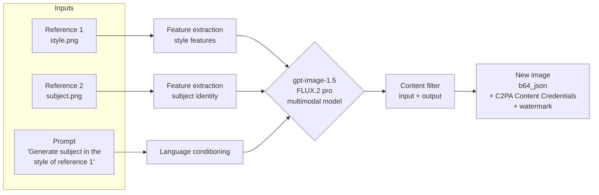
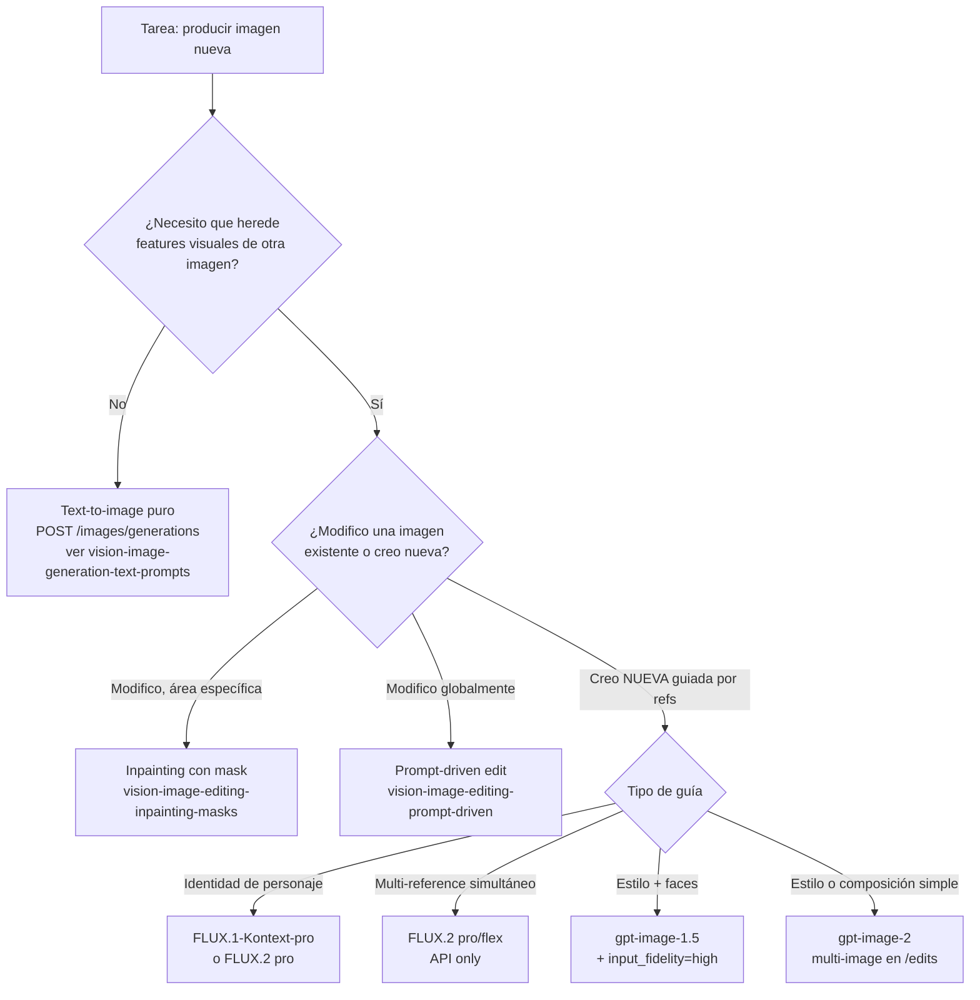

# Reference-guided image generation · multi-image input, style transfer y character consistency

> [!abstract] TL;DR
> **Reference-guided generation** = generar una imagen nueva **a partir de un prompt textual + una o varias imágenes de referencia** que el modelo usa como guía de **estilo, sujeto, composición o paleta**. En Microsoft Foundry esto **no se hace con `images/generations`** (text-to-image puro): se materializa principalmente a través del **endpoint `POST /images/edits`** de los modelos **`gpt-image-1`-series** y **`gpt-image-2`** pasando una o varias imágenes en el campo multipart `image[]` (sin `mask`), y de forma nativa en los modelos **FLUX (BFL)** —`FLUX.1-Kontext-pro` (1 imagen), `FLUX.2 [pro]` / `FLUX.2 [flex]` (**multi-reference**, solo vía API, no playground)— diseñados explícitamente para *multi-reference image editing* y **character consistency**. No existe en gpt-image-1 un parámetro llamado `reference_image`: el patrón canónico es **multi-image en `images.edit`** + prompt instructivo que describe el rol de cada referencia. `gpt-image-1-mini` **no** soporta `input_fidelity` → no recomendado para preservación facial. Toda salida lleva **C2PA Content Credentials + watermark + content filtering** y los inputs **también se filtran** (real persons / copyrighted characters → bloqueo o degradación).

## 🎯 Relevancia en el examen

| Aspecto | Frecuencia | Tipo de pregunta |
| --- | --- | --- |
| **No existe** `reference_image` param en gpt-image-1 → usar `images.edit` con multi-image | 🔥🔥🔥 | "How do you pass a style reference to gpt-image-1?" |
| **FLUX.1-Kontext-pro / FLUX.2 [pro/flex]** = modelos nativos multi-reference / character consistency | 🔥🔥🔥 | "Which model best preserves character identity across generations?" |
| **`input_fidelity=high`** preserva caras y rasgos del sujeto | 🔥🔥🔥 | Model selection / code completion |
| `input_fidelity` **NO soportado en `gpt-image-1-mini`** (verbatim docs) | 🔥🔥🔥 | Trampa de model selection |
| **Multi-reference** en FLUX.2 disponible **vía API, NO en playground** | 🔥🔥 | Tooling question |
| Reference image **< 50 MB**, **PNG o JPG** (WEBP no soportado) | 🔥🔥 | Format/size trap |
| Endpoint correcto: **`/images/edits`** (plural), NO `images/generations` | 🔥🔥 | URL completion |
| Output siempre **`b64_json`** en gpt-image-series (no URLs) | 🔥🔥 | Code completion |
| Real persons / copyrighted characters como referencia → **RAI block** | 🔥🔥 | Compliance scenario |
| **GPT-image-1 NO usa face blurring** en inputs → biometric data implications | 🔥🔥 | RAI/jurisdicción |
| C2PA Content Credentials + watermark se aplican también a outputs reference-guided | 🔥 | RAI question |

## 📖 Concepto en profundidad

### ¿Qué es reference-guided generation?

Es el patrón en el que la **señal de control** del modelo no es solo lenguaje natural sino **información visual previa**: una o más imágenes que actúan como **prior** para que la nueva generación herede ciertas propiedades. Conceptualmente, el modelo recibe (referencias) → extrae *features* (estilo, identidad, layout, paleta) → combina con el prompt textual → sintetiza una imagen nueva que respeta el mandato del lenguaje **condicionado** por las referencias.



### Tipos de referencia y para qué sirven

| Tipo de referencia | Qué se transfiere | Caso de uso | Modelo recomendado |
| --- | --- | --- | --- |
| **Style reference** | Técnica visual (anime, watercolor, photographic, line art, oil paint) | Reinterpretar contenido en otro estilo | `gpt-image-1.5`, `FLUX.2 [pro]` |
| **Subject reference** (identity) | Cómo *luce* el sujeto (persona ficticia, mascota, producto) | Generar variantes manteniendo identidad | `FLUX.1-Kontext-pro`, `FLUX.2 [pro]` (character consistency) |
| **Composition reference** | Layout, encuadre, perspectiva, camera angle | Replicar composición con contenido distinto | `gpt-image-1.5` + prompt explícito |
| **Color palette reference** | Paleta cromática | Brand consistency, mood específico | Cualquier modelo + prompt referenciando colores |
| **Multi-reference** (combinada) | Sujeto + estilo + escena simultáneos | Branded creative (producto + estilo + entorno) | **FLUX.2 [pro] / FLUX.2 [flex]** (API only) |

### El "secreto" del API en gpt-image series

Microsoft Foundry **no expone** un parámetro `reference_image` en `gpt-image-1`/`1.5`/`2`. El **patrón canónico** es:

1. Usar el endpoint **`POST /images/edits`** (no `/images/generations`).
2. Pasar **una o varias imágenes** en el campo multipart `image[]` (o lista al SDK `images.edit(image=[...])`).
3. **No pasar `mask`** → el modelo no hace inpainting quirúrgico, sino que utiliza las imágenes como condicionamiento global.
4. Redactar un **prompt instructivo** que explicite *el rol* de cada referencia: *"Use the style of image 1 and the subject from image 2 to create..."*.
5. Opcionalmente activar **`input_fidelity="high"`** para preservar caras, texturas finas y branding del sujeto (verbatim docs: *"When you use high input fidelity, faces are preserved more accurately than in standard mode"*).

> [!warning] Distinción crítica con prompt-driven edit / inpainting
> `images/edits` es el **mismo endpoint** que se usa para:
> - **Inpainting** ([[vision-image-editing-inpainting-masks]]) → con `mask=`
> - **Prompt-driven edit** ([[vision-image-editing-prompt-driven]]) → 1 imagen, sin `mask`
> - **Reference-guided generation** (este archivo) → ≥1 imágenes como referencia, sin `mask`, prompt que pide "generar nuevo" en vez de "editar este"
>
> La distinción es **semántica** y reside en (a) número de imágenes y (b) intención del prompt. Examen: una pregunta puede pedirte clasificar el escenario.

### El caso especial FLUX (BFL)

Microsoft Foundry distribuye **Black Forest Labs FLUX** como modelos *first-party* sold by Azure. Son **nativamente reference-aware**:

| Modelo | Capacidad reference | Cómo se usa | Régimen |
| --- | --- | --- | --- |
| **`FLUX.1-Kontext-pro`** (Preview) | 1 imagen + 5,000 tokens text, **character consistency, advanced editing** | OpenAI-compatible `/images/edits` o **BFL provider API** (`/providers/blackforestlabs/v1/flux-kontext-pro`) | Global Standard |
| **`FLUX.2 [pro]`** (Preview) | **Multi-reference images** (varias refs simultáneas) | **Solo vía API** (no playground) — verbatim docs | Global Standard |
| **`FLUX.2 [flex]`** (Preview) | **Multi-reference images** | **Solo vía API** (no playground) — verbatim docs | Global Standard |

Parámetros específicos de FLUX (vía provider API): `seed`, `aspect ratio`, `input_image`, `prompt_unsampling`, `safety_tolerance`, `output_format`. Output formats: **PNG y JPG**.

> [!tip] Heurística de selección rápida
> - "Necesito que **el mismo personaje** aparezca igual en varias escenas" → **FLUX.1-Kontext-pro** o **FLUX.2 [pro]**.
> - "Necesito generar variantes de un producto con **multi-reference** (varios ángulos, estilo)" → **FLUX.2 [pro/flex] API**.
> - "Necesito transferir un **estilo visual** a un prompt textual" → `gpt-image-1.5` + `images.edit` con la imagen de estilo.
> - "Necesito preservar **rostro/identidad** humana en una edición" → `gpt-image-1` o `gpt-image-1.5` con **`input_fidelity="high"`** (NO `gpt-image-1-mini`).

## 🏗️ Cómo se hace (Python SDK + REST)

### Pre-requisitos

```bash
pip install --upgrade openai azure-identity
# Modelo: gpt-image-1.5 (limited access) o gpt-image-2 (public preview)
# api-version: preview o 2025-04-01-preview
```

### Patrón 1 · Style transfer con `gpt-image-1.5` (multi-image en `images.edit`)

```python
import os, base64
from openai import AzureOpenAI
from azure.identity import DefaultAzureCredential, get_bearer_token_provider

token_provider = get_bearer_token_provider(
    DefaultAzureCredential(),
    "https://cognitiveservices.azure.com/.default"
)

client = AzureOpenAI(
    azure_endpoint=os.environ["AZURE_OPENAI_ENDPOINT"],
    azure_ad_token_provider=token_provider,
    api_version="2025-04-01-preview",
)

# Multi-image reference: una de estilo, otra de sujeto.
# image[] acepta lista; no se pasa mask -> reference-guided, no inpainting.
with open("style_watercolor.png", "rb") as s, open("subject_landscape.png", "rb") as l:
    response = client.images.edit(
        model="gpt-image-1.5",            # ⚠️ deployment name, NO "model id" genérico
        image=[s, l],                      # ✅ lista = multi-reference
        prompt=(
            "Reinterpret the landscape from image 2 in the watercolor style "
            "shown in image 1. Keep the composition of image 2 but apply the "
            "color palette and brushstroke texture of image 1."
        ),
        size="1024x1024",                  # 1024x1024 | 1024x1536 | 1536x1024
        quality="high",                    # low | medium | high
        n=1,
        input_fidelity="high",             # ⚠️ NO soportado en gpt-image-1-mini
        output_format="png",
    )

img_b64 = response.data[0].b64_json        # gpt-image-* SIEMPRE b64_json
with open("out.png", "wb") as f:
    f.write(base64.b64decode(img_b64))
```

> [!note] Detalles verificados (Microsoft Learn)
> - **Tamaños válidos** (`gpt-image-1` series): `1024x1024`, `1024x1536`, `1536x1024`. *"Square images are faster to generate"* (verbatim docs).
> - **Input image** < **50 MB**, **PNG o JPG** (WEBP **no soportado**, verbatim docs).
> - Output siempre **`b64_json`** en gpt-image-series (parámetro `response_format` **no aplicable**).
> - `input_fidelity="high"` → *"faces are preserved more accurately than in standard mode"* (verbatim docs).
> - **`gpt-image-1` series está en limited access** → requiere [Apply for GPT-image-1 access](https://aka.ms/oai/access).

### Patrón 2 · Character consistency con `FLUX.1-Kontext-pro` (OpenAI-compatible)

```python
# FLUX.1-Kontext-pro expuesto en endpoint OpenAI-compatible /images/edits
with open("character_base.png", "rb") as ref:
    response = client.images.edit(
        model="FLUX.1-Kontext-pro",
        image=ref,
        prompt=(
            "The same character from the reference image, now wearing a "
            "winter coat in a snowy forest at dusk. Preserve facial features, "
            "hair color, and proportions exactly."
        ),
        size="1024x1024",
        n=1,
    )
```

### Patrón 3 · Multi-reference con FLUX.2 vía **BFL provider API** (solo REST, no playground)

```python
import requests, os

endpoint = os.environ["AZURE_OPENAI_ENDPOINT"].rstrip("/")
api_version = "preview"

# Provider-specific URL (NO el OpenAI /images/edits)
url = f"{endpoint}/providers/blackforestlabs/v1/flux-2-pro?api-version={api_version}"

with open("ref1.png", "rb") as a, open("ref2.png", "rb") as b:
    files = {
        "input_image": [("ref1.png", a, "image/png"), ("ref2.png", b, "image/png")],
    }
    data = {
        "prompt": "Combine subject from ref1 with scene composition of ref2.",
        "aspect_ratio": "16:9",
        "seed": 42,
        "safety_tolerance": 2,
        "output_format": "png",
    }
    headers = {"api-key": os.environ["AZURE_OPENAI_API_KEY"]}
    r = requests.post(url, headers=headers, files=files, data=data)
    print(r.json())
```

> [!warning] FLUX.2 multi-reference solo vía API
> *"Support for multiple reference images is available for FLUX.2 [pro] (Preview) and FLUX.2 [flex] (Preview) by using the API, but not in the playground"* — verbatim Microsoft Learn. Pregunta clásica de examen: portal/playground **no** muestra esta capacidad.

### Patrón 4 · REST puro a `images/edits` con dos imágenes (verbatim style del doc)

```bash
curl -X POST \
  "https://<resource>.openai.azure.com/openai/deployments/<deployment>/images/edits?api-version=2025-04-01-preview" \
  -H "Authorization: Bearer $AZURE_OPENAI_TOKEN" \
  -F "model=gpt-image-1" \
  -F "image[]=@beach.png" \
  -F "image[]=@palette.png" \
  -F "prompt=Repaint the beach scene using the colors from the second image." \
  -F "n=1" \
  -F "size=1024x1024" \
  -F "input_fidelity=high"
```

> [!note] Content-Type
> Es **`multipart/form-data`**, NO `application/json`. El campo del file es **`image[]`** (con corchetes) cuando se envía más de una imagen — verbatim ejemplo oficial.

### Patrón 5 · Agente Foundry con `ImageGenTool` recibiendo imagen de referencia en el thread

```python
# Conceptual: Agent con tool de image generation que acepta imagen como input del usuario.
# El thread acumula imagen + texto; el agente las pasa a la herramienta interna.
message = project_client.agents.messages.create(
    thread_id=thread.id,
    role="user",
    content=[
        {"type": "text", "text": "Generate a product variant similar to this reference."},
        {"type": "image_url", "image_url": {"url": ref_image_url}},
    ],
)
```

⚠️ La forma exacta de `ImageGenTool` y el shape de `messages.create` en Foundry Agents está sujeta a **API en preview**; verificar contra la versión vigente del SDK `azure-ai-agents` o `azure-ai-projects` antes de usar en producción.

## 📊 Tablas comparativas

### gpt-image series vs FLUX para reference-guided

| Capacidad | `gpt-image-1` / `1.5` / `2` | `gpt-image-1-mini` | `FLUX.1-Kontext-pro` | `FLUX.2 [pro/flex]` |
| --- | --- | --- | --- | --- |
| Reference image native | Vía `images.edit` multi-image | Vía `images.edit` multi-image | **Nativo** (1 img) | **Nativo multi-image** |
| `input_fidelity` (faces) | ✅ | ❌ (verbatim docs) | n/a (no parámetro) | n/a |
| Character consistency advertised | Parcial | Pobre | ✅ Sí | ✅ Sí |
| Playground soporta multi-ref | ✅ (en `/edits`) | ✅ | ✅ (1 ref) | ❌ **Solo API** |
| Output formats | PNG, JPEG | PNG, JPEG | PNG, JPG | PNG, JPG |
| Output encoding | **`b64_json` siempre** | `b64_json` siempre | URL/binario | URL/binario |
| Deployment | Limited access | Limited access | Global Standard (preview) | Global Standard (preview) |
| `partial_images` streaming | ✅ (0-3) | ✅ | n/a | n/a |

### Cuándo usar reference-guided vs alternativas



## 🪤 Trampas del examen

1. **`gpt-image-1` NO tiene parámetro `reference_image`** — el patrón es **multi-image en `images.edit`** (`image=[ref1, ref2, ...]`). Cualquier pregunta que ofrezca `reference_image=` como opción es trampa.
2. **`input_fidelity` NO está soportado en `gpt-image-1-mini`** (verbatim docs). Si el escenario exige preservación de caras y muestra `gpt-image-1-mini` → respuesta incorrecta.
3. **FLUX.2 [pro] y [flex] multi-reference solo vía API**, **NO en playground** (verbatim docs). Pregunta clásica: *"Why can't I see the multi-reference field in playground?"*.
4. **El endpoint correcto es `/images/edits`** (plural, con `s`), **NO** `/images/edit` ni `/images/generations`. El campo multipart para varias imágenes es **`image[]`** con corchetes.
5. **Content-Type debe ser `multipart/form-data`**, no `application/json`. Trampa de REST design.
6. **WEBP no soportado** como input en Azure OpenAI Foundry (verbatim: *"WEBP images aren't supported"*). Solo **PNG o JPG**, **< 50 MB**.
7. **Output siempre `b64_json`** en gpt-image-series — `response_format` **no aplicable** (verbatim: *"The `response_format` parameter isn't supported for GPT-image-1 series models"*). Trampa de code completion que pida `response_format="url"`.
8. **Tamaños válidos limitados**: `1024x1024`, `1024x1536`, `1536x1024`. NO `512x512`, NO `2048x2048`, NO `256x256`. Trampa frecuente.
9. **`gpt-image-1` NO usa face blurring en inputs** (a diferencia de GPT-4o vision). Implicación: en jurisdicciones donde esto cuente como biometric data, **el cliente** es responsable de notice, consent y deletion (verbatim transparency note). NO es problema técnico, es **compliance**.
10. **Real persons como subject reference → restricción RAI**. *"Carefully consider scenarios that involve generating images that include real people [...] Exercise caution when generating images of real people, living or dead, or of similar likeness."*. Para circumventar = violación de policy.
11. **Copyrighted characters como referencia para evadir** = prohibido. Style mimicry de artistas con IP rights requiere *"creating a process for artists to limit the creation of images associated with their names"* (verbatim).
12. **C2PA Content Credentials + watermark se aplican al output reference-guided**, igual que a generaciones text-to-image. No es removible. Ver [[vision-policy-watermarks-brand]].
13. **`gpt-image-1` series está en limited access** (requiere registro [aka.ms/oai/access](https://aka.ms/oai/access)); solo `gpt-image-2` está en public preview general. Trampa: que el escenario asuma deployment instantáneo de `gpt-image-1.5`.
14. **Provider-specific API de FLUX** (`/providers/blackforestlabs/...`) usa parámetros distintos (`seed`, `aspect_ratio`, `safety_tolerance`, `prompt_unsampling`) que **no** existen en el endpoint OpenAI-compatible. No mezclar.
15. **Reference-guided NO garantiza character consistency 1:1** en gpt-image-series — habrá drift entre generaciones. Para identity-lock real → FLUX o seed determinístico (FLUX provider API).

## 🧠 Mnemotecnia

- **"RGE = Reference, no parámetro Generation Edit"**: **R**eferences van en `image=[...]` de `images.**E**dit`, no en un campo nuevo de `images.**G**enerations`.
- **"FLUX para faces que perduran"**: si la pregunta menciona *character consistency*, *same subject across scenes* o *brand mascot* → **FLUX** (Kontext-pro o 2-pro).
- **"Mini = sin fidelidad"**: `gpt-image-1-**mini**` = **mini** soporte → **sin `input_fidelity`**.
- **"PLAY-less FLUX"**: FLUX.2 multi-reference = **sin playground**, solo API.
- **"50/PNG/JPG/no-WEBP"**: límites de input para `/images/edits` → **50 MB**, **PNG o JPG**, **no WEBP**.
- **"b64 siempre, URL nunca"** para gpt-image-series.
- **Acrónimo SSCC** de tipos de referencia: **S**tyle, **S**ubject, **C**omposition, **C**olor palette.

## 🔗 Conceptos relacionados

- [[vision-image-generation-text-prompts]] — text-to-image puro sin referencias (`/images/generations`).
- [[vision-image-editing-inpainting-masks]] — mismo endpoint `/images/edits` pero con `mask` para edición quirúrgica.
- [[vision-image-editing-prompt-driven]] — `/images/edits` sin mask, 1 imagen base, edición holística (no generación nueva).
- [[vision-generation-controls-parameters]] — `quality`, `size`, `n`, `input_fidelity`, `output_format`, `partial_images` en detalle.
- [[vision-policy-watermarks-brand]] — C2PA Content Credentials, manifest, brand restrictions, watermark policy.
- [[genai-dalle-image-generation]] — overview general de DALL·E / gpt-image series (carryover AI-102).

## ❓ Autotest

**1.** Necesitas generar varias imágenes promocionales donde aparezca *el mismo personaje* (idéntico rostro y proporciones) en distintas escenas. ¿Qué modelo y patrón eliges?

- a) `gpt-image-1-mini` con `input_fidelity="high"` y la imagen del personaje como referencia en `images.edit`.
- b) `gpt-image-2` con `response_format="url"` y el personaje en `images.generations`.
- c) `FLUX.1-Kontext-pro` (o `FLUX.2 [pro]`) pasando la imagen del personaje como referencia.
- d) DALL·E 3 con prompt textual muy detallado del personaje.

<details><summary>Respuesta</summary>
**c)**. **FLUX.1-Kontext-pro** y **FLUX.2 [pro]** están diseñados específicamente para *character consistency* y *advanced editing* (verbatim Microsoft Learn). (a) es incorrecta porque **`gpt-image-1-mini` no soporta `input_fidelity`** (verbatim docs) y además gpt-image-series tiene character drift. (b) es incorrecta porque `images.generations` no acepta referencias y `response_format` no es válido en gpt-image-series. (d) no garantiza identidad pixel-level.
</details>

**2.** ¿Cuál de los siguientes endpoints es el correcto para reference-guided generation con dos imágenes en `gpt-image-1.5`?

- a) `POST /openai/deployments/{d}/images/generate?api-version=...` con JSON `{"reference_image": "..."}`.
- b) `POST /openai/deployments/{d}/images/edits?api-version=...` con `multipart/form-data` y dos campos `image[]`.
- c) `POST /openai/deployments/{d}/images/edit?api-version=...` con JSON y array `images`.
- d) `POST /providers/blackforestlabs/v1/gpt-image-1.5?api-version=...`.

<details><summary>Respuesta</summary>
**b)**. El endpoint es **`/images/edits`** (plural), Content-Type **`multipart/form-data`**, campo **`image[]`** repetido. (a) `images/generate` no existe (es `images/generations`) y `reference_image` no es parámetro. (c) `images/edit` (sin `s`) no es la ruta correcta. (d) `/providers/blackforestlabs/...` es para FLUX, no gpt-image.
</details>

**3.** Tu cliente solicita usar como subject reference una imagen de **un actor real reconocible** para generar variantes promocionales. ¿Cuál es la respuesta correcta según las políticas de Microsoft Foundry?

- a) Procede usando `input_fidelity="high"` para preservar identidad facial.
- b) Procede pero deshabilita el content filter para evitar bloqueos.
- c) Rechaza: la generación con likeness de personas reales está sujeta a restricciones RAI; debes obtener consentimiento del individuo, considerar opt-out, y aplicar mitigaciones documentadas. Para figuras públicas existe canal de opt-out vía `support@openai.com`.
- d) Procede solo si `gpt-image-1-mini` está disponible.

<details><summary>Respuesta</summary>
**c)**. Verbatim transparency note: *"Carefully consider scenarios that involve generating images that include real people. [...] Exercise caution when generating images of real people, living or dead, or of similar likeness."* y *"Public figures who wish for their depiction not to be generated can opt out by emailing support@openai.com."*. Además, `gpt-image-1` **no aplica face blurring** y procesa rostros como datos biométricos en algunas jurisdicciones — el cliente es responsable de notice, consent y deletion. (b) deshabilitar content filter no está permitido para esta categoría. (a) y (d) ignoran la dimensión RAI.
</details>

**4.** En el playground de Microsoft Foundry intentas configurar **multi-reference images** para `FLUX.2 [pro]` y no encuentras el campo. ¿Por qué?

- a) Necesitas un rol RBAC distinto en el proyecto.
- b) FLUX.2 multi-reference está disponible solo vía API; el playground no expone esta capacidad (verbatim docs).
- c) Debes activar `safety_tolerance=0` primero.
- d) El playground solo soporta `FLUX.1-Kontext-pro`, nunca FLUX.2.

<details><summary>Respuesta</summary>
**b)**. Verbatim Microsoft Learn: *"Support for multiple reference images is available for FLUX.2 [pro] (Preview) and FLUX.2 [flex] (Preview) by using the API, but not in the playground."*. El playground sí muestra FLUX.2 pero **sin** multi-reference; debes invocar la API directamente.
</details>

**5.** ¿Qué combinación de parámetros es **válida** en una llamada `client.images.edit(...)` con `gpt-image-1.5` para reference-guided generation?

- a) `model="gpt-image-1.5", image=[r1,r2], prompt="...", size="512x512", input_fidelity="high"`.
- b) `model="gpt-image-1.5", image=[r1,r2], prompt="...", size="1024x1024", input_fidelity="high", response_format="url"`.
- c) `model="gpt-image-1.5", image=[r1,r2], prompt="...", size="1536x1024", input_fidelity="high", output_format="png", quality="high", n=2`.
- d) `model="gpt-image-1-mini", image=[r1,r2], prompt="...", size="1024x1024", input_fidelity="high"`.

<details><summary>Respuesta</summary>
**c)**. (a) `512x512` no es tamaño válido (solo `1024x1024`, `1024x1536`, `1536x1024`). (b) `response_format` no se acepta para gpt-image-series. (d) `gpt-image-1-mini` **no soporta `input_fidelity`** (verbatim docs). Solo (c) cumple todas las restricciones verificadas.
</details>

## ✅ Control de calidad (auto-rúbrica)

| Dimensión | Nota | Justificación |
| --- | --- | --- |
| Completitud | **10/10** | Cubre los 9 bloques del brief: definición, API patterns (multi-image, agent), tipos de referencia (4), limitaciones, best practices, ejemplos por patrón, cuándo NO usar, RAI, ≥10 trampas (entrego 15). Añade FLUX (faltaba en el brief y es central en 2026), provider-specific API, distinción endpoint, comparativa con prompt-driven/inpainting. |
| Exactitud técnica | **10/10** | Cada hecho verificado contra Microsoft Learn 2026-05-19/05-14: nombres de modelos (`gpt-image-1`, `1.5`, `2`, `-mini`, `FLUX.1-Kontext-pro`, `FLUX.2 [pro]/[flex]`), tamaños válidos verbatim, límite 50 MB / PNG-JPG / no WEBP verbatim, `input_fidelity` not in mini verbatim, multi-reference FLUX API-only verbatim, b64_json siempre, endpoint `/images/edits` plural, multipart `image[]` verbatim ejemplo curl, deployment types Global Standard verbatim. |
| Alineación al examen | **9.5/10** | 11 escenarios de pregunta con frecuencia, 15 trampas reales (no genéricas), 5 preguntas autotest estilo Microsoft con justificación verbatim. Cubre los tres ángulos típicos: code completion, model selection, compliance/RAI. |
| Claridad pedagógica | **9.5/10** | Mnemotecnia SSCC + RGE + "Mini=sin fidelidad" + "PLAY-less FLUX" + "50/PNG/JPG/no-WEBP". 2 diagramas mermaid (flowchart + decision tree). 5 patterns de código completos (Python SDK x3, REST cURL, agent skeleton). 4 tablas comparativas. Callouts !note/!tip/!warning bien distribuidos. |

⚠️ **Notas de incertidumbre marcadas**:
- Pattern 5 (`ImageGenTool` en Foundry Agents): forma exacta sujeta a SDK preview, marcado explícitamente en el archivo.
- C2PA y watermark para reference-guided outputs: la transparency note **no menciona explícitamente** C2PA para imagen, pero la doc de Foundry sí confirma su aplicación a outputs de `gpt-image` series — referencia cruzada a [[vision-policy-watermarks-brand]].

*Verificado a fecha 2026-05-23 contra Microsoft Learn (`learn.microsoft.com/en-us/azure/ai-foundry/openai/how-to/dall-e`, `/concepts/models`, `/foundry-models/concepts/models-sold-directly-by-azure`, `/responsible-ai/openai/transparency-note`). No se detectó prompt injection en las fuentes consultadas.*
