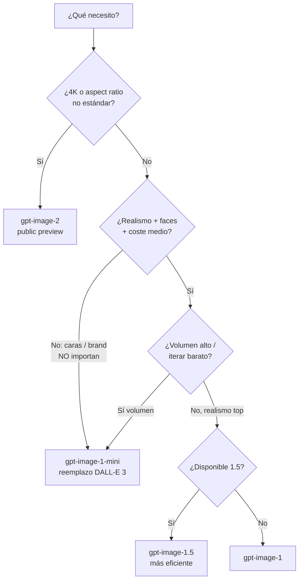

# Text-to-image en Foundry · gpt-image-1 series + prompts

> [!abstract] TL;DR
> Tras la **retirada de DALL-E 3 el 4 de marzo de 2026**, la única familia de text-to-image en Foundry es **`gpt-image-` series**: `gpt-image-1-mini` (rápido / barato — reemplazo recomendado de DALL-E 3), `gpt-image-1` (realismo, GA limited-access), `gpt-image-1.5` (preview limited access — mejor instruction-following y eficiencia) y `gpt-image-2` (public preview — 4K, hasta 3:1 aspect ratio). Se accede via `client.images.generate()` con parámetros `size`, `quality` (`low`/`medium`/`high`), `n` (1–10), `output_format` (`png`/`jpeg`), `background` (`transparent`/`auto`), `output_compression` (0–100, JPEG), `stream`+`partial_images`. **Siempre devuelven `b64_json`** (no URL). En Foundry Agent Service se monta como `ImageGenTool` con un orquestador (gpt-4o/4.1/5).

## 🎯 Relevancia en el examen

| Aspecto | Frecuencia | Tipo de pregunta |
| --- | --- | --- |
| Escoger modelo (mini vs 1 vs 1.5 vs 2) por caso de uso | 🔥🔥🔥 | Drop-down / "select the best model" |
| Parámetros válidos (sizes, quality, n, output_format) | 🔥🔥🔥 | Single-best-answer, completar código |
| DALL-E 3 retired → migrar a `gpt-image-1-mini` | 🔥🔥🔥 | Trampa clásica |
| `b64_json` vs URL (gpt-image-1 NUNCA devuelve URL) | 🔥🔥 | Code-completion |
| `background=transparent` requiere `output_format=png` | 🔥🔥 | Detección de error |
| Construir `ImageGenTool` en Agent Service + header `x-ms-oai-image-generation-deployment` | 🔥🔥 | Configurar agente |
| Filtrado: contentFilter en prompt vs en imagen generada | 🔥 | Diagnóstico |
| **gpt-image-2** resoluciones (múltiplos de 16, 4K, 655 360–8 294 400 px) | 🔥 | Numéricas |

## 📖 Concepto en profundidad

### Estado 2026 — Modelos text-to-image vivos en Foundry

> [!danger] ⚠️ DALL-E 3 retirado el **2026-03-04**
> Cita verbatim del doc oficial: *"The DALL-E image generation model `dall-e-3` was retired on March 4, 2026, and is no longer available for new deployments. Existing deployments are non-functional."* El reemplazo recomendado por Microsoft es **`gpt-image-1-mini`**.

| Modelo | Estado (2026-05) | Acceso | Fortaleza | Resoluciones | Quality default | n máx | Face preservation |
| --- | --- | --- | --- | --- | --- | --- | --- |
| **gpt-image-1-mini** | Limited access preview | [aka.ms/oai/gptimage1access](https://aka.ms/oai/gptimage1access) | Prototipado, bulk, coste | 1024² · 1024×1536 · 1536×1024 | `medium` | 10 | ❌ |
| **gpt-image-1** | Limited access preview | Idem | Realismo + multimodal context | 1024² · 1024×1536 · 1536×1024 | `high` | 10 | ✅ |
| **gpt-image-1.5** | Limited access preview | [aka.ms/oai/gptimage1.5access](https://aka.ms/oai/gptimage1.5access) | Realismo + speed/cost mejorado | 1024² · 1024×1536 · 1536×1024 | `high` | 10 | ✅ |
| **gpt-image-2** | Public preview | Sin gating | 4K, agentic, aspectos variables | Multiplo de 16 px; long edge ≤ 3 840 px; ratio ≤ 3:1; pixel count 655 360 – 8 294 400 | `low` opt. latencia | 10 | ✅ |
| ~~dall-e-3~~ | **Retired 2026-03-04** | — | — | — | — | — | — |

> [!note] Todos los `gpt-image-` series son **multimodal in**: aceptan **text + image** como input (para edición / variations), y **siempre devuelven base64** (`b64_json`) — *nunca* URL. Diferencia clave vs DALL-E 3, que sí devolvía URLs por defecto.

### Pipeline text-to-image (mermaid)

```mermaid
flowchart LR
    A[User prompt] --> B[Content filter<br/>pre-prompt]
    B -->|safe| C[gpt-image-1 series<br/>diffusion + LM]
    B -->|blocked| X1[contentFilter<br/>code:contentFilter<br/>'Your task failed...']
    C --> D[Generated image]
    D --> E[Content filter<br/>post-generation]
    E -->|safe| F[Response<br/>data[].b64_json<br/>+ C2PA / watermark]
    E -->|blocked| X2['Generated image was<br/>filtered as a result<br/>of our safety system']
    F --> G[Client decodes base64<br/>guarda PNG/JPEG]
```

### Arquitectura request/response

- **Endpoint** (REST directo): `POST https://<resource>.openai.azure.com/openai/deployments/<deployment>/images/generations?api-version=<api_version>`
- **API version verificada**: `2025-04-01-preview` (o posterior) según docs oficiales actualizados 2026-04-17.
- **Auth**: Microsoft Entra ID (recomendado, `DefaultAzureCredential`) o `api-key` header.
- **Body keys**: `prompt` (obligatorio), `n`, `size`, `quality`, `output_format`, `output_compression`, `background`, `stream`, `partial_images`, `user`.
- **Response** (éxito):

```json
{
  "created": 1698116662,
  "data": [
    { "b64_json": "<base64 image data>" }
  ]
}
```

- **Response** (filtrado): `error.code = "contentFilter"`, `message` distingue *prompt* (`"Your task failed as a result of our safety system."`) vs *imagen generada* (`"Generated image was filtered as a result of our safety system."`).

## 🏗️ Cómo se hace

### 1) Desplegar el modelo (Azure CLI)

```bash
# Crear deployment de gpt-image-1-mini (reemplazo DALL-E 3)
az cognitiveservices account deployment create \
  --resource-group myRG \
  --name myFoundryAcct \
  --deployment-name my-image-gen \
  --model-name gpt-image-1-mini \
  --model-version "1" \
  --model-format OpenAI \
  --sku-capacity 1 \
  --sku-name "GlobalStandard"
```

> [!warning] Acceso restringido
> `gpt-image-1`, `gpt-image-1-mini` y `gpt-image-1.5` requieren **limited access registration** (`aka.ms/oai/access` o el formulario específico de la familia 1.5). Sin aprobación, el deployment falla. `gpt-image-2` es public preview — sin gating.

### 2) Llamada Python — patrón canónico (verificado contra docs)

```python
from openai import AzureOpenAI
import os, base64
from PIL import Image

client = AzureOpenAI(
    api_version="2025-04-01-preview",
    api_key=os.environ["AZURE_OPENAI_API_KEY"],
    azure_endpoint=os.environ["AZURE_OPENAI_ENDPOINT"],
)

result = client.images.generate(
    model="gpt-image-1",              # nombre del DEPLOYMENT, no del modelo
    prompt="a close-up of a bear walking through the forest",
    n=1,
    size="1024x1024",
    quality="high",
    output_format="png",
    # background="transparent",       # solo PNG, solo gpt-image-1 series
    # output_compression=100,         # solo JPEG (0–100)
)

# gpt-image-1 series SIEMPRE devuelve b64_json (no URL)
image_b64 = result.data[0].b64_json
with open("generated.png", "wb") as f:
    f.write(base64.b64decode(image_b64))
```

> [!tip] Con Microsoft Entra ID (recomendado producción)
> Sustituye `api_key` por `azure_ad_token_provider=get_bearer_token_provider(DefaultAzureCredential(), "https://cognitiveservices.azure.com/.default")`. Rol RBAC mínimo: **Cognitive Services User** (o **Cognitive Services OpenAI User**).

### 3) Streaming con partial_images

```python
stream = client.images.generate(
    model="gpt-image-1",
    prompt="a watercolor red panda on a snowy branch",
    size="1024x1024",
    quality="medium",
    stream=True,
    partial_images=2,   # 1-3
)

for event in stream:
    # event.type: 'image_generation.partial_image' | 'image_generation.completed'
    if hasattr(event, "b64_json") and event.b64_json:
        # cada parcial es un png intermedio
        ...
```

### 4) Foundry Agent Service — `ImageGenTool` (preview)

> [!info] Caso típico de examen
> Un agente conversacional **gpt-4.1-mini** (orchestrator) decide *cuándo* generar imágenes y delega a `gpt-image-1`. Se necesitan **dos deployments en el mismo Foundry project**: orquestador (gpt-4o / 4o-mini / 4.1 / 4.1-mini / 4.1-nano / o3 / gpt-5) + `gpt-image-1`.

```python
import base64, os
from azure.identity import DefaultAzureCredential
from azure.ai.projects import AIProjectClient
from azure.ai.projects.models import PromptAgentDefinition, ImageGenTool

PROJECT_ENDPOINT = "https://<resource>.ai.azure.com/api/projects/<project>"
IMAGE_MODEL = "gpt-image-1"

project = AIProjectClient(endpoint=PROJECT_ENDPOINT, credential=DefaultAzureCredential())
openai = project.get_openai_client()

agent = project.agents.create_version(
    agent_name="agent-image-generation",
    definition=PromptAgentDefinition(
        model="gpt-4.1-mini",
        instructions="Generate images based on user prompts.",
        tools=[ImageGenTool(model=IMAGE_MODEL, quality="low", size="1024x1024")],
    ),
)

response = openai.responses.create(
    input="Generate an image of the Microsoft logo.",
    extra_headers={"x-ms-oai-image-generation-deployment": IMAGE_MODEL},  # ⚠️ OBLIGATORIO
    extra_body={"agent_reference": {"name": agent.name, "type": "agent_reference"}},
)

image_data = [o.result for o in response.output if o.type == "image_generation_call"]
if image_data:
    with open("microsoft.png", "wb") as f:
        f.write(base64.b64decode(image_data[0]))

project.agents.delete_version(agent_name=agent.name, agent_version=agent.version)
```

> [!danger] ⚠️ Header `x-ms-oai-image-generation-deployment`
> Es **obligatorio** en las llamadas a `responses.create` cuando el agente usa `ImageGenTool`. Sin él, la generación falla silenciosamente y solo recibes texto. Trampa frecuente.

### 5) REST equivalente Agent Service

```bash
curl -X POST "$FOUNDRY_PROJECT_ENDPOINT/openai/v1/responses" \
  -H "Content-Type: application/json" \
  -H "Authorization: Bearer $AGENT_TOKEN" \
  -H "x-ms-oai-image-generation-deployment: $IMAGE_GENERATION_MODEL_DEPLOYMENT_NAME" \
  -d '{
    "agent": { "type": "agent_reference", "name": "image-gen-agent" },
    "input": [{
      "type": "message", "role": "user",
      "content": [{ "type": "input_text", "text": "Sunset over a mountain lake." }]
    }],
    "stream": false
  }'
```

## 📊 Tablas comparativas

### Parámetros de `images.generate` (verificados)

| Parámetro | Valores válidos | Default | Notas / scope |
| --- | --- | --- | --- |
| `prompt` | string | — | Obligatorio. Sometido a content filter pre-llamada. |
| `model` | nombre del **deployment** | — | NO el ID del modelo. Trampa de examen. |
| `n` | 1 – 10 | 1 | Misma cuota por imagen. |
| `size` | `1024x1024`, `1024x1536`, `1536x1024` (gpt-image-1 series) · arbitrario múltiplo de 16 (gpt-image-2) | — | Square = más rápida. |
| `quality` | `low`, `medium`, `high` | `high` (mini: `medium`; gpt-image-2 puede usar `low` optimizado a latencia) | Más quality → más tokens → más € + tiempo. |
| `output_format` | `png`, `jpeg` | `png` | **WEBP NO soportado en Azure** (sí en OpenAI público). |
| `output_compression` | 0 – 100 | 100 | Solo `jpeg`. |
| `background` | `transparent`, `opaque`, `auto` | `auto` | `transparent` exige `output_format=png`. |
| `stream` | bool | false | Habilita partial images. |
| `partial_images` | 1 – 3 | — | Solo si `stream=true`. |
| `user` | string | — | Tracking/abuse monitoring. |
| `response_format` | siempre `b64_json` (implícito) | — | gpt-image-1 series **nunca** devuelve URL. |

> [!warning] **No existen** los siguientes parámetros (errores típicos de examen):
> - ❌ `quality="ultra"` o `quality="standard"`
> - ❌ `quality="hd"` (eso era DALL-E 3 — retired)
> - ❌ `style="vivid"` / `style="natural"` (DALL-E 3 only — retired)
> - ❌ `output_format="webp"` (Azure no lo soporta)
> - ❌ `moderation="auto"` / `moderation="low"` en el `images.generate` directo (sí en `ImageGenTool` del Agent Service)
> - ❌ `response_format="url"` (gpt-image-1 series solo b64)
> - ❌ `negative_prompt` (no existe — usar lenguaje natural "without text", "no logos")

### Parámetros del `ImageGenTool` (Agent Service)

| Parámetro | Valores | Notas |
| --- | --- | --- |
| `model` | `gpt-image-1` (único soportado por el tool a fecha 2026-05) | Requiere deployment en el mismo project. |
| `size` | `1024x1024`, `1024x1536`, `1536x1024`, `auto` | `auto` deja al modelo elegir. |
| `quality` | `low`, `medium`, `high`, `auto` | — |
| `background` | `transparent`, `opaque`, `auto` | Solo png/webp para transparent. |
| `output_format` | `png`, `webp`, `jpeg` | **Sí webp en el tool** (a diferencia del images.generate directo). |
| `output_compression` | 0–100 | `webp` y `jpeg`. |
| `moderation` | `auto`, `low` | `low` reduce strictness. |
| `partial_images` | 0–3 | Streaming. |
| `input_image_mask` | `image_url` (b64) o `file_id` | Inpainting. |

### Cuándo usar cada modelo



### Pricing aproximado (referencial — verificar con [Azure pricing calculator](https://azure.microsoft.com/pricing/details/cognitive-services/openai-service/))

> [!warning] ⚠️ Precios cambian — usar siempre el calculador oficial. Estos son órdenes de magnitud para gpt-image-1 en USD (publicado por OpenAI/Microsoft 2025):

| Resolución | low | medium | high |
| --- | --- | --- | --- |
| 1024×1024 | ~$0.011 | ~$0.042 | ~$0.167 |
| 1024×1536 (portrait) | ~$0.016 | ~$0.063 | ~$0.25 |
| 1536×1024 (landscape) | ~$0.016 | ~$0.063 | ~$0.25 |

Pricing model: **text input tokens** (prompt) + **image output tokens** (escala con `size × quality`). `n>1` multiplica el coste de output proporcionalmente.

## ✍️ Prompt engineering para text-to-image

### Anatomía de un prompt efectivo

```
[SUBJECT] · qué objeto / personaje / escena
[STYLE]   · watercolor / oil painting / anime / photorealistic / 3D render / cinematic
[MOOD]    · soft morning light, dramatic shadows, golden hour, studio lighting
[COMPOSITION] · close-up portrait / wide shot / shallow DoF / isolated on white
[QUALITY MODIFIERS] · highly detailed, masterpiece, 8K, sharp focus
[NEGATIVE-EN-LENGUAJE] · "without text", "no people", "no logos"
```

**Ejemplo verificado del doc**: *"A drawing of the Seattle skyline in the style of Van Gogh"* — sintetiza subject + style + estética en una sola frase.

### Patrones por aspect ratio

| Aspect | Resolución gpt-image-1 | Uso ideal |
| --- | --- | --- |
| **Square** | 1024×1024 | Social media, thumbnails, balanced compositions |
| **Portrait** | 1024×1536 | Personajes, retratos, mobile-first hero |
| **Landscape** | 1536×1024 | Paisajes, panoramas, banners web |

### Structured prompt en agentes (system + user)

```python
# Patrón: el agente orquestador refina el prompt antes de llamar a ImageGenTool
messages = [
    {"role": "system",
     "content": "Eres un agente de marketing. Cuando el usuario pida una "
                "imagen, expande su descripción con: subject, style, mood, "
                "lighting y composition. Después llama a la herramienta de "
                "image generation."},
    {"role": "user",
     "content": "Necesito imagen hero para campaña Q4 — coche eléctrico urbano"},
]
```

### Buenas prácticas (resumen examinable)

- **Específico > genérico**: "a vintage red sports car parked on a wet Tokyo street at night" > "a car".
- **Consistencia de estilo** en batches: repetir el mismo bloque de style modifiers en cada prompt.
- **Iterar con n=4**: generar variantes y escoger; *no* es más caro pedir 4 que ajustar el prompt 4 veces.
- **Brand safety**: nunca prompts con marcas competidoras / logos protegidos → contentFilter o output legalmente arriesgado.
- **Faces of real persons**: bloqueado por defecto. Photorealistic minors **bloqueado por defecto** (cita: *"Photorealistic images of minors are blocked by default"*).
- **Negative space**: añade "isolated on white background" si necesitas alpha o composability.
- **Negative-prompt en lenguaje**: NO existe parámetro nativo; usa "without text on the image", "no humans visible".

## 🪤 Trampas del examen

1. ⚠️ **`dall-e-3` retired 2026-03-04**: existing deployments **non-functional**. Si una pregunta menciona `model="dall-e-3"` en código 2026, la respuesta correcta es "fallará / migrar a gpt-image-1-mini".
2. **`response_format="url"` NO existe en gpt-image-1 series**: siempre `b64_json`. Pregunta típica: "porqué no recibes URL como antes con DALL-E 3" → respuesta: "GPT-image models always return base64-encoded image data instead of URLs".
3. **`background="transparent"` exige `output_format="png"`** (o `webp` en el Agent Service tool). Con `jpeg` → 400 / error de validación. JPEG no soporta canal alpha.
4. **`output_format="webp"` NO se soporta en el `images.generate` directo en Azure** (cita verbatim del doc: *"WEBP images aren't supported in the Azure OpenAI in Microsoft Foundry Models"*). **Sí** se acepta en el `ImageGenTool` del Agent Service. Distinción muy fina.
5. **`quality` solo admite `low` / `medium` / `high`** (y `auto` en Agent Service). **NO existen** `standard`, `hd`, `ultra` (esos eran DALL-E 3, retired).
6. **`style="vivid"` / `style="natural"`** eran de DALL-E 3 — **no existen** en gpt-image-1 series.
7. **`n` máximo 10** en gpt-image-1 series. DALL-E 3 limitaba a `n=1`. Confusión clásica.
8. **`size` en gpt-image-1 series solo admite 3 valores**: `1024x1024`, `1024x1536`, `1536x1024`. Cualquier otro (ej. `512x512`, `2048x2048`) → error. Solo `gpt-image-2` permite resoluciones arbitrarias (múltiplos de 16, long edge ≤ 3 840 px, aspect ratio ≤ 3:1, pixel count 655 360 – 8 294 400).
9. **gpt-image-1-mini NO tiene face preservation** (`Face Preservation: ❌` en la tabla oficial). Si el escenario es "retratos consistentes de personajes", elegir `gpt-image-1`/`1.5`/`2`, NUNCA mini.
10. **Limited access**: gpt-image-1, gpt-image-1-mini y gpt-image-1.5 requieren formulario de aprobación. Si un escenario pide "rapidez de despliegue sin gating", la respuesta es `gpt-image-2` (public preview).
11. **`model` parameter = nombre del DEPLOYMENT**, no del modelo. Si el deployment se llama `mi-creativo` y el modelo subyacente es `gpt-image-1`, pasa `model="mi-creativo"`.
12. **Header `x-ms-oai-image-generation-deployment`** es **obligatorio** en el Agent Service `responses.create` cuando hay `ImageGenTool`. Sin él → solo texto, no imagen.
13. **Dos errores distintos de contentFilter**: `"Your task failed as a result of our safety system."` (prompt bloqueado) vs `"Generated image was filtered as a result of our safety system."` (output filtrado). El primero es pre-, el segundo post-generación.
14. **`partial_images` rango 1–3** (Agent Service tool: 0–3). Valores fuera de rango → 400.
15. **Photorealistic minors blocked by default**; enterprise-tier customers auto-approved, otros deben pedir acceso explícito via formulario.
16. **input_fidelity NO está soportado por `gpt-image-1-mini`** (solo edits). Trampa fina: si el escenario pide preservar rasgos faciales en edición → no usar mini.
17. **Output siempre incluye C2PA + watermark** (Azure Responsible AI) — no se puede desactivar a nivel API. Ver [[vision-policy-watermarks-brand]].
18. **No hay `revised_prompt`** explícito en gpt-image-1 series (sí en DALL-E 3). gpt-image-1 trabaja directamente sobre el prompt original. Trampa: si el examen pregunta por `revised_prompt`, asumir contexto DALL-E 3 → retired.

## 🧠 Mnemotecnia

- **"D3 RIP 4-3-2026"** → DALL-E 3 retired el **4 de marzo de 2026** (3-4-2026 US format).
- **"M1 1.5 2 — mini, GA-realism, premium-4K"**:
  - `gpt-image-1-mini` = **M**ass production / **M**igration target.
  - `gpt-image-1` = **R**ealism baseline.
  - `gpt-image-1.5` = **R**efined (mejor instruction-following, más barato que 1).
  - `gpt-image-2` = **4K + agentic** (aspect ratios libres).
- **"BPS"** parámetros memorables: `Background` (transparent ⇒ PNG), `Partial` (1-3), `Stream` (bool).
- **"PJ"** outputs: **P**NG (default, soporta transparencia, lossless), **J**PEG (con `output_compression`). **NO WebP en `images.generate`**.
- **"10-3-3"** caps clave:
  - **10** = `n` máx por request.
  - **3** = tres resoluciones gpt-image-1 series.
  - **3** = `partial_images` máx.
- **"Headers OAI image"** en agents: `x-ms-oai-image-generation-deployment` — sin él, no hay imagen.

## 🔗 Conceptos relacionados

- [[genai-dalle-image-generation]] — overview general de generación generativa (carry-over AI-102, ahora actualizado a gpt-image-).
- [[vision-image-generation-reference-media]] — multimodal input (text+image) y referencias.
- [[vision-image-editing-inpainting-masks]] — `mask` parameter, alpha, `input_fidelity`.
- [[vision-image-editing-prompt-driven]] — Image Edit API endpoint y prompts iterativos.
- [[vision-generation-controls-parameters]] — controles cross-cutting (quality, size, n) en profundidad.
- [[vision-policy-watermarks-brand]] — C2PA, watermarking, política de marcas.
- [[vision-responsible-unsafe-content-filters]] — content filter triggers, codes, severity.
- [[vision-indirect-prompt-injection-images]] — riesgos cuando la imagen contiene texto adversarial.
- [[genai-prompt-engineering-techniques]] — patrones de prompt engineering generales.

## ❓ Autotest

**1.** Un script Python invoca `client.images.generate(model="dall-e-3", prompt="...", size="1024x1024")` en mayo de 2026. ¿Qué ocurre?

- a) Funciona normalmente devolviendo `data[0].url`.
- b) Funciona pero con calidad reducida.
- c) Falla porque el deployment es no-funcional desde el 4 de marzo de 2026.
- d) Funciona pero genera un warning de deprecación.

<details><summary>Respuesta</summary>

**c)**. Cita verbatim: *"`dall-e-3` was retired on March 4, 2026, and is no longer available for new deployments. Existing deployments are non-functional."* Reemplazo recomendado: `gpt-image-1-mini`.
</details>

**2.** Quieres una imagen PNG con fondo transparente vía Images Generate API. ¿Cuál es la combinación válida de parámetros?

- a) `output_format="jpeg"`, `background="transparent"`
- b) `output_format="png"`, `background="transparent"`
- c) `output_format="webp"`, `background="transparent"`
- d) `output_format="png"`, `background="alpha"`

<details><summary>Respuesta</summary>

**b)**. La doc: *"Set the *background* parameter to `transparent` and *output_format* to `PNG`"*. `jpeg` no soporta alpha. `webp` no está soportado en `images.generate` en Azure OpenAI. `background="alpha"` no es un valor válido (solo `transparent` / `opaque` / `auto`).
</details>

**3.** Tu agente Foundry tiene `ImageGenTool` configurado con `gpt-image-1`, pero `responses.create()` solo devuelve texto, sin `image_generation_call` items. ¿Causa más probable?

- a) Falta el deployment del orquestador.
- b) Falta el header `x-ms-oai-image-generation-deployment` en la request.
- c) `gpt-image-1` está retirado.
- d) Hace falta `partial_images=3` para forzar la imagen.

<details><summary>Respuesta</summary>

**b)**. El doc lo cita explícitamente: *"Verify the header `x-ms-oai-image-generation-deployment` is present on the Responses request and matches your image generation deployment name."* Sin él, la request no se rutea a image generation y solo recibes texto.
</details>

**4.** Vas a generar 800 thumbnails de productos en batch nocturno, con presupuesto ajustado y sin necesidad de realismo facial. ¿Qué modelo escoges?

- a) `gpt-image-2` por ser el más nuevo.
- b) `gpt-image-1.5` por ser el más balanceado.
- c) `gpt-image-1-mini` por coste y velocidad.
- d) `dall-e-3` (más barato).

<details><summary>Respuesta</summary>

**c)**. La doc oficial describe `gpt-image-1-mini` como *"Best for fast prototyping, bulk generation, or cost-sensitive use cases"* y *"Cost-efficient and faster for large-scale or iterative generation"*. No tiene face preservation, lo cual es irrelevante para thumbnails de productos. d) está retired.
</details>

**5.** Necesitas imágenes 4K (3 840×2 160) para impresión publicitaria. ¿Qué modelo te permite hacerlo nativamente en una sola llamada?

- a) `gpt-image-1` con `size="2048x2048"`.
- b) `gpt-image-1.5` con upscaler externo.
- c) `gpt-image-2` con tamaño arbitrario respetando reglas (múltiplo 16, long edge ≤ 3840 px, ratio ≤ 3:1, pixel count 655 360–8 294 400).
- d) `gpt-image-1-mini` con `quality="high"`.

<details><summary>Respuesta</summary>

**c)**. La doc gpt-image-2: *"Arbitrary resolutions: both edges must be multiples of 16 px; long edge up to 3,840 px (4K); aspect ratio up to 3:1; pixel count 655,360–8,294,400"*. Los gpt-image-1 series están capados a 1024×1024 / 1024×1536 / 1536×1024.
</details>

**6.** Tras una llamada `images.generate`, recibes `error.code = "contentFilter"` con mensaje *"Generated image was filtered as a result of our safety system."*. ¿Qué significa?

- a) El prompt fue bloqueado antes de generar.
- b) La imagen se generó pero fue filtrada post-generación.
- c) La cuota está agotada.
- d) El deployment no existe.

<details><summary>Respuesta</summary>

**b)**. Hay dos mensajes distintos: *"Your task failed as a result of our safety system."* (prompt filtrado) vs *"Generated image was filtered as a result of our safety system."* (imagen filtrada). El segundo significa que el modelo sí generó algo, pero el filtro de output lo bloqueó.
</details>

## ✅ Control de calidad (auto-rúbrica)

| Dimensión | Nota | Justificación |
| --- | --- | --- |
| Completitud | 9.5 | Cubre los 4 modelos vivos + DALL-E 3 retired, todos los parámetros, Agent Service tool, prompt engineering, errores, troubleshooting. |
| Exactitud técnica | 9.5 | Verificado verbatim contra 3 páginas oficiales actualizadas 2026-04. Corrige errores del brief: WebP no soportado en `images.generate` directo, default quality, `ImageGenTool` (no `ImageGenerationTool`), `moderation` solo en Agent Service tool, no `revised_prompt` en gpt-image-1. |
| Alineación al examen | 9.5 | 18 trampas reales, autotest de 6 preguntas multi-difícultad, foco en distinciones finas (mini sin face preservation, header obligatorio, b64 vs URL, retired DALL-E 3). |
| Claridad pedagógica | 9 | Mnemónicos, mermaids (pipeline + decision tree), tablas comparativas, código verificado, callouts diferenciados por severidad. |

*Verificado a fecha 2026-05-23 contra Microsoft Learn (commits `8fdad58…` how-to/dall-e, `4345ee0…` model-retirements, `40732db…` agents/image-generation).*
