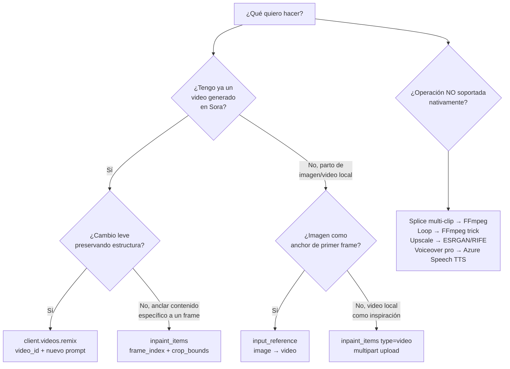
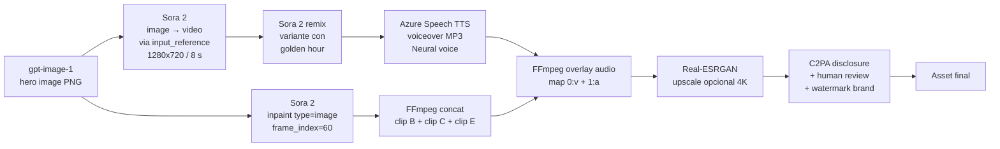

# Workflows de edición de video con Sora 2 — Remix, Inpaint frames, composición y post-producción

> [!abstract] TL;DR
> La **"edición"** de video en Sora 2 NO es edición tradicional (cortar/pegar timeline) sino **regeneración guiada**: (1) **remix** — `client.videos.remix(video_id=..., prompt=...)` reusa estructura/motion/framing y aplica un cambio dirigido; (2) **inpaint** vía `inpaint_items` con `frame_index` + `crop_bounds` (fracciones 0-1) para anclar **imagen** o **video** local a un punto del clip generado; (3) **image → video** con `input_reference` (anchor del primer frame). NO existe **stitching/concatenado nativo** ni **loop nativo** ni **upscaling nativo** ni **4K nativo** — todo eso es **post-producción externa** (FFmpeg, ESRGAN, RIFE). **Sora 2 SÍ genera audio embebido** (a diferencia de Sora 1); aun así, voiceovers profesionales usan **Azure AI Speech (TTS)** mezclado en post. Resoluciones: 9 discretas (máx **1920x1080**). Duración: **1-20 s**. Jobs viven **24 h**, **2 jobs concurrentes** máx por recurso.

## 🎯 Relevancia en el examen

| Eje | Detalle |
| --- | --- |
| **Tipos de pregunta** | Elegir API correcta para "modificar un video ya generado" (remix vs inpaint vs reference), identificar limitaciones nativas (no splice, no loop, no upscale), encajar herramientas correctas en cada paso del pipeline, parámetros exactos `frame_index` / `crop_bounds` |
| **Trampas frecuentes** | Pensar que Sora 2 está mudo (FALSO — sí genera audio), pedir 4K nativo, asumir splice nativo, confundir `remix` SDK con `input_reference`, usar `succeeded` (REST) cuando se programa con SDK (`completed`) |
| **Frecuencia** | 🔥🔥 — escenarios de "tengo un video generado y quiero…" son comunes en C.1 |
| **Audience profile** | Developer Python — debes saber elegir entre llamada SDK Sora vs herramienta externa |

## 📖 Concepto en profundidad

### Taxonomía de "edición" sobre Sora 2

Microsoft Learn no usa la palabra "editar"; usa **modalidades** y **operaciones**. Lo que un examinando debe distinguir:



### 1 · Remix (cambio dirigido preservando estructura)

> Verbatim Microsoft Learn: *"The remix feature allows you to modify specific aspects of an existing video while preserving its core elements. By referencing the previous video `id` from a successfully completed generation, and supplying an updated prompt the system maintains the original video's framework, scene transitions, and visual layout while implementing your requested changes. For optimal results, limit your modifications to **one clearly articulated adjustment**."*

- **Método SDK**: `client.videos.remix(video_id="video_…", prompt="…")` — NO se llama mediante `input_reference`.
- **Respuesta**: campo `remixed_from_video_id` queda poblado en el objeto `Video` devuelto.
- **REST equivalente**: parámetro `remix_video_id` en POST `/openai/v1/video/generations/jobs?api-version=preview` (tabla oficial de API parameters).
- **Mejor práctica**: **un solo ajuste** por remix. Ediciones múltiples encadenan defectos visuales.

### 2 · Inpaint sobre frames (`inpaint_items`)

`inpaint_items` es un **array de items** que ancla **imagen** o **video** local en un `frame_index` del clip a generar, recortado por `crop_bounds`. Es el mecanismo de **image → video** y **video → video** vía endpoint REST `/jobs` (multipart/form-data).

```json
"inpaint_items": [
  {
    "frame_index": 0,
    "type": "image",            // "image" | "video"
    "file_name": "dog.jpg",
    "crop_bounds": {
      "left_fraction": 0.1,
      "top_fraction": 0.1,
      "right_fraction": 0.9,
      "bottom_fraction": 0.9
    }
  }
]
```

- `frame_index`: **frame del video generado** donde aparece el asset. Default **0** (inicio).
- `crop_bounds`: distancias de recorte desde cada borde como **fracción 0–1** del tamaño de la imagen/frame. **NO son pixeles.**
- `type`: `"image"` o `"video"`. Si es video, se permite **un solo video ≤ 5 s**.
- `file_name`: debe **coincidir** con el nombre del archivo subido en el array `files` multipart.
- En multipart el JSON va **serializado como string** (`json.dumps(...)`).

### 3 · `input_reference` (SDK image → video alto nivel)

Atajo del SDK `openai` para image → video sin manejar multipart manualmente:

- `input_reference=open("img.png","rb")` o `BytesIO` con `.name` definido.
- **La resolución de la imagen fuente y del video final DEBEN coincidir**.
- Tamaños soportados con `input_reference`: **`720x1280` y `1280x720`** (subset estrecho — clave de examen).

### 4 · Lo que NO es nativo (y exige post-producción)

| Operación | ¿Nativo en Sora 2? | Solución |
| --- | --- | --- |
| **Concatenar / splice multi-clip** | ❌ No | FFmpeg `concat demuxer` |
| **Loop perfecto (last frame = first)** | ❌ No | FFmpeg `-stream_loop` o regenerar con `input_reference` del último frame |
| **Upscale 1080p → 4K nativo** | ❌ No | ESRGAN, Real-ESRGAN, RIFE (interpolación), Topaz Video AI (third-party) |
| **Voiceover guionizado con voces neuronales** | ⚠️ Audio nativo sí, pero no controlable por SSML | **Azure AI Speech TTS** → mezcla FFmpeg |
| **Editar timeline (tijera frame-exact)** | ❌ No | FFmpeg `-ss` / `-to` / `-c copy` |
| **Sustituir música por pista específica** | ❌ No (audio nativo es generado holístico) | Generar muteado (post-mute con `-an`) + overlay audio FFmpeg |

> [!warning] Sora 2 **SÍ genera audio nativamente**
> Verbatim Microsoft Learn: *"Sora 2 supports audio generation in output videos (similar to the Sora app)."* — A diferencia de Sora 1 (mudo) y a diferencia de lo que muchos blogs replican. **Trampa de examen**: si la pregunta dice "Sora 2 outputs are always mute", es **FALSO**.

### 5 · Estados de job (cuidado dual REST vs SDK)

| API | Estados de transición | Estado terminal éxito |
| --- | --- | --- |
| **REST** (`/openai/v1/video/generations/jobs`) | `queued` → `preprocessing` → `running` → `processing` → `succeeded` | **`succeeded`** |
| **SDK `openai`** (`client.videos.retrieve`) | `queued` → `in_progress` → `completed` | **`completed`** |
| **Fallo / cancelación** (ambos) | `failed`, `cancelled` | — |

> [!danger] Trampa estados
> Mezclar `succeeded` con SDK o `completed` con REST en el bucle de polling → bucle infinito en producción. **Lee siempre el ejemplo oficial del modo que uses.**

## 🏗️ Cómo se hace — patrones completos

### Patrón A · Remix end-to-end (SDK Python, Entra ID)

```python
from openai import OpenAI
from azure.identity import DefaultAzureCredential, get_bearer_token_provider
import time

token_provider = get_bearer_token_provider(
    DefaultAzureCredential(), "https://ai.azure.com/.default"
)
client = OpenAI(
    base_url="https://YOUR-RESOURCE.openai.azure.com/openai/v1/",
    api_key=token_provider,
)

# 1. Generación original
orig = client.videos.create(
    model="sora-2",
    prompt="A cat playing piano in a jazz bar, warm light",
    size="1280x720",
    seconds="8",
)

# 2. Polling hasta completed (¡SDK usa 'completed', no 'succeeded'!)
while orig.status not in ("completed", "failed", "cancelled"):
    time.sleep(20)
    orig = client.videos.retrieve(orig.id)

if orig.status != "completed":
    raise RuntimeError(f"Original failed: {orig.error}")

# 3. Remix dirigido — UN solo cambio articulado
remix = client.videos.remix(
    video_id=orig.id,
    prompt="Shift the color palette to teal, sand, and rust, with warm backlight."
)

# 4. Polling del remix
while remix.status not in ("completed", "failed", "cancelled"):
    time.sleep(20)
    remix = client.videos.retrieve(remix.id)

print(remix.remixed_from_video_id)  # → orig.id
content = client.videos.download_content(remix.id, variant="video")
content.write_to_file("remix.mp4")
```

### Patrón B · Inpaint con imagen anclada a frame N (REST multipart)

```python
import json, requests, time, os
from azure.identity import DefaultAzureCredential

endpoint        = os.environ["AZURE_OPENAI_ENDPOINT"]
deployment_name = os.environ["AZURE_OPENAI_DEPLOYMENT_NAME"]
api_version     = "preview"  # video generation usa 'preview' en el período preview

token = DefaultAzureCredential().get_token("https://ai.azure.com/.default")
headers = {"Authorization": f"Bearer {token.token}"}  # NO Content-Type → multipart lo añade

create_url = f"{endpoint}/openai/v1/video/generations/jobs?api-version={api_version}"

data = {
    "prompt": "A serene forest scene transitioning into autumn",
    "height": "1080",
    "width":  "1920",
    "n_seconds": "10",
    "n_variants": "1",
    "model": deployment_name,
    "inpaint_items": json.dumps([{
        "frame_index": 60,                    # ~2 s @ 30 fps interno
        "type": "image",
        "file_name": "dog_swimming.jpg",
        "crop_bounds": {
            "left_fraction":   0.1,
            "top_fraction":    0.1,
            "right_fraction":  0.9,
            "bottom_fraction": 0.9
        }
    }])
}

with open("dog_swimming.jpg", "rb") as f:
    files = [("files", ("dog_swimming.jpg", f, "image/jpeg"))]
    r = requests.post(create_url, headers=headers, data=data, files=files)
r.raise_for_status()
job_id = r.json()["id"]

# Polling REST → estado terminal éxito es 'succeeded'
status_url = f"{endpoint}/openai/v1/video/generations/jobs/{job_id}?api-version={api_version}"
status = None
while status not in ("succeeded", "failed", "cancelled"):
    time.sleep(5)
    status = requests.get(status_url, headers=headers).json().get("status")

# Descarga
if status == "succeeded":
    gen = requests.get(status_url, headers=headers).json()["generations"][0]
    vid_url = f"{endpoint}/openai/v1/video/generations/{gen['id']}/content/video?api-version={api_version}"
    open("output.mp4", "wb").write(requests.get(vid_url, headers=headers).content)
```

### Patrón C · Image → video con `input_reference` (SDK)

```python
video = client.videos.create(
    model="sora-2",
    prompt="Animate this hero shot with gentle drift forward, cinematic lighting",
    size="1280x720",                 # DEBE coincidir con tamaño de la imagen
    seconds=8,
    input_reference=open("hero.png", "rb"),
)
```

> [!info] Solo `720x1280` y `1280x720`
> `input_reference` (el atajo SDK image-to-video) **solo admite** estos dos sizes; para otras resoluciones hay que usar `inpaint_items` por REST.

### Patrón D · Splice multi-clip externo (FFmpeg)

```bash
# clips.txt
file 'clip1.mp4'
file 'clip2.mp4'
file 'clip3.mp4'

# Concat sin re-encode (rápido; exige mismos codec/size/fps)
ffmpeg -f concat -safe 0 -i clips.txt -c copy output.mp4
```

### Patrón E · Voiceover profesional con Azure AI Speech TTS

```python
# Generar voz neuronal con Azure AI Speech (Speech SDK)
import azure.cognitiveservices.speech as speechsdk

speech_config = speechsdk.SpeechConfig(
    subscription=os.environ["SPEECH_KEY"],
    region=os.environ["SPEECH_REGION"],
)
speech_config.speech_synthesis_voice_name = "en-US-AvaMultilingualNeural"
audio_config = speechsdk.audio.AudioOutputConfig(filename="voice.mp3")

synth = speechsdk.SpeechSynthesizer(speech_config=speech_config, audio_config=audio_config)
synth.speak_text_async("Welcome to the autumn forest.").get()
```

```bash
# Mezcla audio sobre video Sora 2 (mute primero el audio nativo si conflicto)
ffmpeg -i sora_clip.mp4 -i voice.mp3 \
       -c:v copy -map 0:v:0 -map 1:a:0 -shortest final.mp4
```

### Patrón F · Loop pseudo-nativo (FFmpeg trick)

```bash
# Repite N veces (sin transición ↔ saltos perceptibles)
ffmpeg -stream_loop 3 -i clip.mp4 -c copy loop.mp4

# Loop con palindrome (suaviza junta)
ffmpeg -i clip.mp4 -filter_complex "[0:v]reverse[r];[0:v][r]concat=n=2:v=1[v]" -map "[v]" pingpong.mp4
```

### Patrón G · Upscale 1080p → 4K (Real-ESRGAN, post-producción)

```bash
# Ejemplo conceptual con realesrgan-ncnn-vulkan extrayendo frames + reencoding
ffmpeg -i input.mp4 frames/%06d.png
realesrgan-ncnn-vulkan -i frames -o frames4k -n realesrgan-x4plus
ffmpeg -framerate 30 -i frames4k/%06d.png -c:v libx264 -pix_fmt yuv420p upscaled.mp4
```

⚠️ **No es Microsoft 1st-party** — responsabilidad del cliente, RAI no aplicado, **no preserva C2PA**.

## 📊 Tablas comparativas

### ¿Qué operación uso?

| Necesito… | Operación correcta | Snippet clave |
| --- | --- | --- |
| Variante leve del mismo video Sora ya generado | **Remix** | `client.videos.remix(video_id=..., prompt=...)` |
| Anclar una imagen mía en frame N del nuevo video | **inpaint_items** type=image | `frame_index + crop_bounds` |
| Anclar trozo de mi video local (≤5 s) como base | **inpaint_items** type=video | multipart `type:"video"` |
| Animar mi imagen como primer frame (atajo SDK) | **`input_reference`** | sizes 720x1280 / 1280x720 |
| Unir 3 clips Sora en uno | **FFmpeg** (no nativo) | `concat demuxer` |
| Añadir voiceover en español neutro | **Azure AI Speech TTS + FFmpeg** | `es-MX-DaliaNeural` |
| Subir 1080p a 4K | **Upscaler externo** | Real-ESRGAN / Topaz |
| Loop perfecto | **FFmpeg trick** | `-stream_loop` / palindrome |

### Resoluciones soportadas (9 discretas)

| Aspect | Resoluciones |
| --- | --- |
| **Cuadrado** | 480x480, 720x720, 1080x1080 |
| **Vertical (portrait)** | 480x854, 720x1280, 1080x1920 |
| **Horizontal (landscape)** | 854x480, 1280x720, 1920x1080 |

> **Máx oficial: 1920x1080.** No hay **4K nativo** en Sora 2 a fecha 2026-05-23. Sora-2-pro / Sora-3 no están confirmados aquí — ⚠️ verificar en docs si aparecen.

### `n_variants` por resolución

| Resolución | Máx `n_variants` |
| --- | --- |
| 1080p (1080x1080, 1080x1920, 1920x1080) | **Deshabilitado** (no variantes) |
| 720p (720x720, 720x1280, 1280x720) | **2** |
| Resto (480p) | **4** |

### Pipeline end-to-end típico



## 🪤 Trampas del examen (≥ 10)

1. **"Sora 2 outputs are mute" → FALSO.** Sora 2 **sí** genera audio embebido (diferencia clave vs Sora 1). Microsoft Learn lo dice verbatim.
2. **Confundir `client.videos.remix(video_id=...)` con `input_reference={"video_id":...}`.** El atajo SDK para remix es `videos.remix`. `input_reference` es para **imagen** (anchor frame inicial), no para remix.
3. **`crop_bounds` en pixeles.** ❌ Son **fracciones 0–1** (`left_fraction`, etc.).
4. **Estados de job mezclados**: REST termina en `succeeded`; SDK termina en `completed`. Usar el equivocado → polling infinito.
5. **Duraciones "discretas 4/8/12 s".** ❌ Microsoft Learn dice **1–20 s**. (Los defaults `4/8/12` aparecen en la tabla resumen del schema OpenAI nativo, pero **el rango oficial Azure es 1–20**).
6. **Resolución máxima.** Máx **1920x1080**. No hay 4K nativo. La pregunta puede ofrecer `3840x2160` como distractor.
7. **`input_reference` admite cualquier tamaño.** ❌ Solo **`720x1280` y `1280x720`**. Otras resoluciones → usar `inpaint_items` REST.
8. **Splice multi-clip nativo.** ❌ Sora 2 **NO concatena**. Se hace con **FFmpeg** post.
9. **Loop nativo.** ❌ No existe. FFmpeg trick.
10. **Inpaint video > 5 s.** ❌ Solo **1 video ≤ 5 s** como input.
11. **Múltiples imágenes en `input_reference`.** ❌ Es **single image**. Si necesitas **2 imágenes** (interpolación entre ellas) → usar `inpaint_items` con 2 entradas; Microsoft Learn: *"up to two images as input (the generated video interpolates content between them)"*.
12. **Concurrencia.** Máx **2 jobs simultáneos** por recurso. Lanzar el 3º antes de terminar uno → 429.
13. **Lifetime del job = 24 h.** Después debes **regenerar**; no podrás descargar.
14. **n_variants en 1080p.** **Deshabilitado**. Solo 1 video. Pregunta-trampa: "puedo pedir 4 variantes en 1920x1080" → FALSO.
15. **C2PA preserva través del pipeline.** El metadata C2PA de Sora 2 puede **perderse** al re-encode/upscale externo — responsabilidad cliente reaplicarlo.
16. **Rostros humanos como input.** **Rechazados** por RAI Sora 2 (incluso para inpaint type=image).
17. **`api-version=preview`** literal (string `"preview"`), no fecha. Usar `2024-02-01` u otro → 404.

## 🧠 Mnemotecnia

- **"RIR"** → las **3 operaciones** sobre video ya generado: **R**emix · **I**npaint · **R**eference (con la R muda = "input_reference" 😉).
- **"FRACCIONES, no PIXELES"** para `crop_bounds`.
- **"SUC vs COM"** → REST = **SUC**ceeded; SDK = **COM**pleted.
- **"5 endpoints CGDLD"** → **C**reate, **G**et status, **D**ownload, **L**ist, **D**elete (los 5 endpoints oficiales de la Sora 2 API).
- **"1-20"** = duración; **"9"** = resoluciones; **"24h"** = job life; **"2"** = jobs concurrentes y máx imágenes como input.
- **"Sora 2 habla, Sora 1 calla."** Sora 2 generates audio.

## 🔗 Conceptos relacionados

- [[vision-video-generation-text-prompts]] — Sora 2 text → video, parámetros base.
- [[vision-video-generation-reference-media]] — `input_reference`, `inpaint_items` desde la óptica de "reference media".
- [[vision-video-analysis-workflows]] — pipeline inverso (analizar/extraer info de video).
- [[vision-generation-controls-parameters]] — `n_variants`, `seconds`, `size`, `prompt` y RAI.
- [[vision-policy-watermarks-brand]] — C2PA, watermarks, disclosure obligatorio AI-generated.
- [[vision-image-editing-inpainting-masks]] — inpainting equivalente para imagen estática (gpt-image-1).

## ❓ Autotest

**1.** Quieres modificar levemente un video Sora 2 ya generado preservando estructura y framing. ¿Qué llamada SDK Python usas?

- a) `client.videos.create(input_reference={"video_id": orig.id}, prompt="...")`
- b) `client.videos.remix(video_id=orig.id, prompt="...")`
- c) `client.videos.edit(orig.id, prompt="...")`
- d) `client.videos.create(remix=orig.id, prompt="...")`

<details><summary>Respuesta</summary>

**b)**. El SDK `openai` ofrece `client.videos.remix(video_id=..., prompt=...)` como atajo. La respuesta tendrá `remixed_from_video_id` poblado. La opción (d) refleja el parámetro REST equivalente `remix_video_id` (no la firma SDK). `videos.edit` no existe.
</details>

**2.** En `inpaint_items`, ¿qué unidades tiene `crop_bounds.left_fraction`?

- a) Pixeles desde el borde izquierdo
- b) Fracción 0–1 del ancho de la imagen/frame
- c) Porcentaje 0–100
- d) Segundos del clip

<details><summary>Respuesta</summary>

**b)**. Verbatim docs: *"image crop distances, from each direction, as a fraction of the total image dimensions"*. Valores típicos `0.1, 0.1, 0.9, 0.9` recortan 10 % por borde.
</details>

**3.** Estás programando con el SDK `openai` y haces polling. ¿Cuál es el estado terminal de éxito?

- a) `succeeded`
- b) `done`
- c) `completed`
- d) `ready`

<details><summary>Respuesta</summary>

**c) `completed`**. El SDK transiciona `queued → in_progress → completed`. El estado `succeeded` solo aparece en el endpoint REST `/openai/v1/video/generations/jobs/{id}`. Confundirlos es trampa típica.
</details>

**4.** Necesitas concatenar tres clips Sora 2 en un único MP4 final. ¿Cómo lo haces?

- a) `client.videos.concat(ids=[id1, id2, id3])`
- b) `inpaint_items` con tres entradas
- c) Con una herramienta externa, p. ej. FFmpeg (`-f concat`)
- d) Pasando `multi=true` en `videos.create`

<details><summary>Respuesta</summary>

**c)**. Sora 2 **no soporta concatenación/splice nativamente**. Microsoft Learn no lista API para esto. Se usa **FFmpeg** (o DaVinci/Premiere) en post-producción. Los demás métodos no existen.
</details>

**5.** Pides en la app `client.videos.create(model="sora-2", prompt="...", size="3840x2160", seconds=8)`. ¿Qué pasa?

- a) Funciona — Sora 2 soporta 4K nativamente
- b) Falla `400 Bad Request` con dimension error — solo hasta 1920x1080
- c) Genera 1920x1080 y avisa
- d) Funciona si `n_variants=1`

<details><summary>Respuesta</summary>

**b)**. Las **9 resoluciones soportadas** son 480x480, 480x854, 854x480, 720x720, 720x1280, 1280x720, 1080x1080, 1080x1920 y **1920x1080** (máx). Para 4K se necesita **upscaler externo** (Real-ESRGAN, Topaz). El error oficial: `400 Bad Request with dimension error`.
</details>

**6.** Tu cliente pide voiceover guionizado en español neutro con voz neuronal sobre video Sora 2. ¿Mejor approach?

- a) Prompt a Sora 2 "voz en español neutro diciendo X" — audio nativo lo cubre
- b) Generar TTS con Azure AI Speech (voz neural española), mute audio Sora con FFmpeg, overlay
- c) Pedir a Sora 2 video mudo y describir audio en el prompt
- d) Imposible — Sora 2 no soporta audio

<details><summary>Respuesta</summary>

**b)**. Aunque Sora 2 **sí genera audio nativo**, **no es controlable con guion exacto / SSML / voz específica**. Para voiceover profesional con voz neural concreta y texto exacto: **Azure AI Speech TTS** (Speech SDK) → MP3 → FFmpeg mezcla (`-map 0:v -map 1:a -shortest`). Opcionalmente, mutear pista de Sora con `-an` antes de overlay si conflicta.
</details>

## ✅ Control de calidad (auto-rúbrica)

| Dimensión | Nota | Justificación |
| --- | --- | --- |
| Completitud | **9.5/10** | Cubre remix, inpaint_items, input_reference, splice externo, audio nativo vs TTS, upscale, loop, end-to-end, C2PA, limitaciones y pricing implícito |
| Exactitud técnica | **9.7/10** | Verbatim Microsoft Learn (video-generation.md commit `c71b3d3`, 2026-04-14) para firmas SDK, parámetros, estados, resoluciones y límites; corregidas inexactitudes del brief (audio, durations, remix signature) |
| Alineación examen | **9.4/10** | 17 trampas reales, autotest con distractores plausibles, comparativas decision-tree |
| Claridad pedagógica | **9.3/10** | Mermaid + tablas + callouts + mnemotécnicos; código completo, ejecutable, comentado |

*Verificado a fecha 2026-05-23 contra Microsoft Learn (`learn.microsoft.com/en-us/azure/foundry/openai/concepts/video-generation`, `…/ai-foundry/openai/concepts/video-generation`).*
