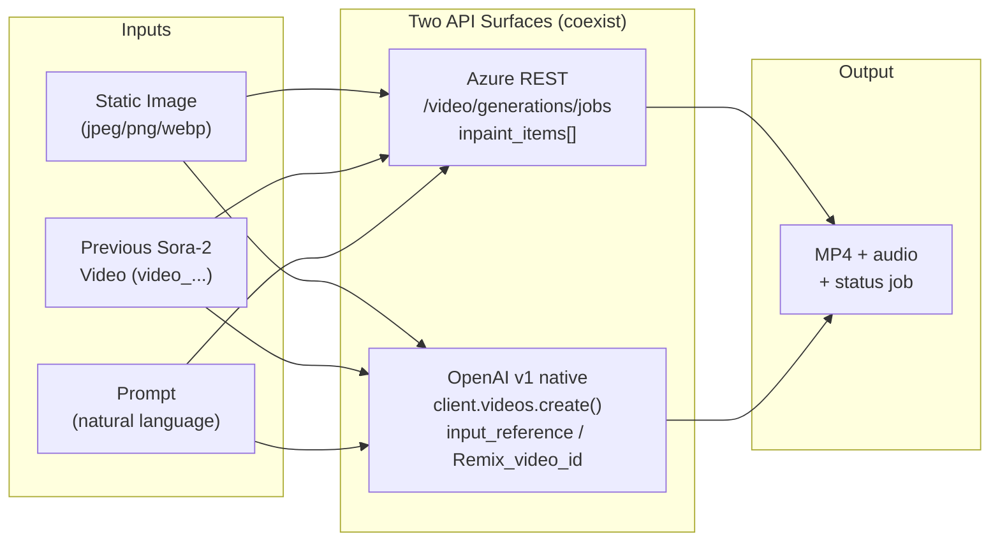
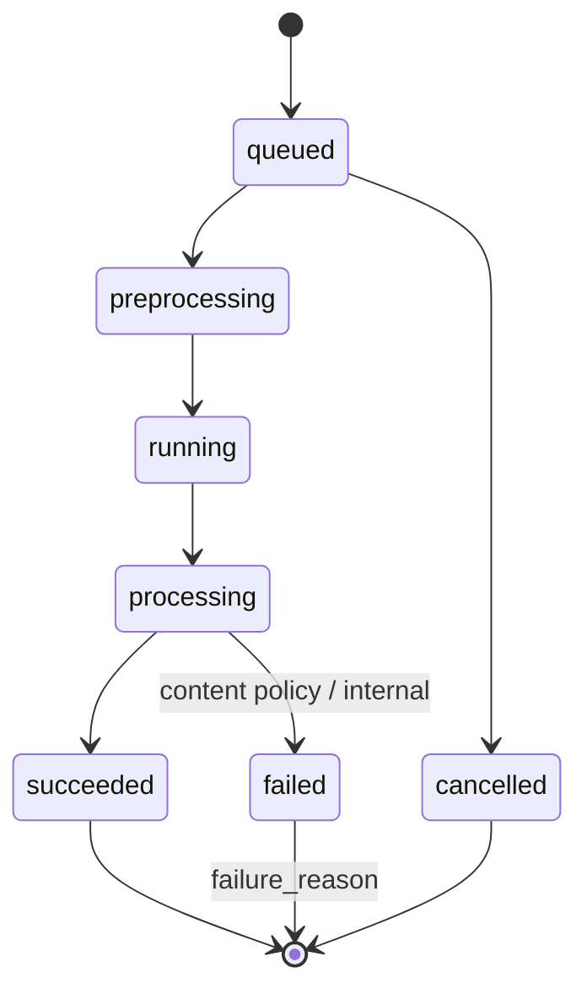
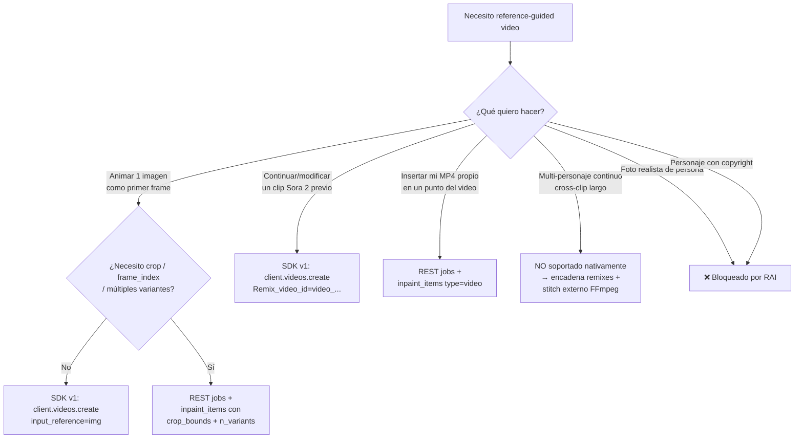
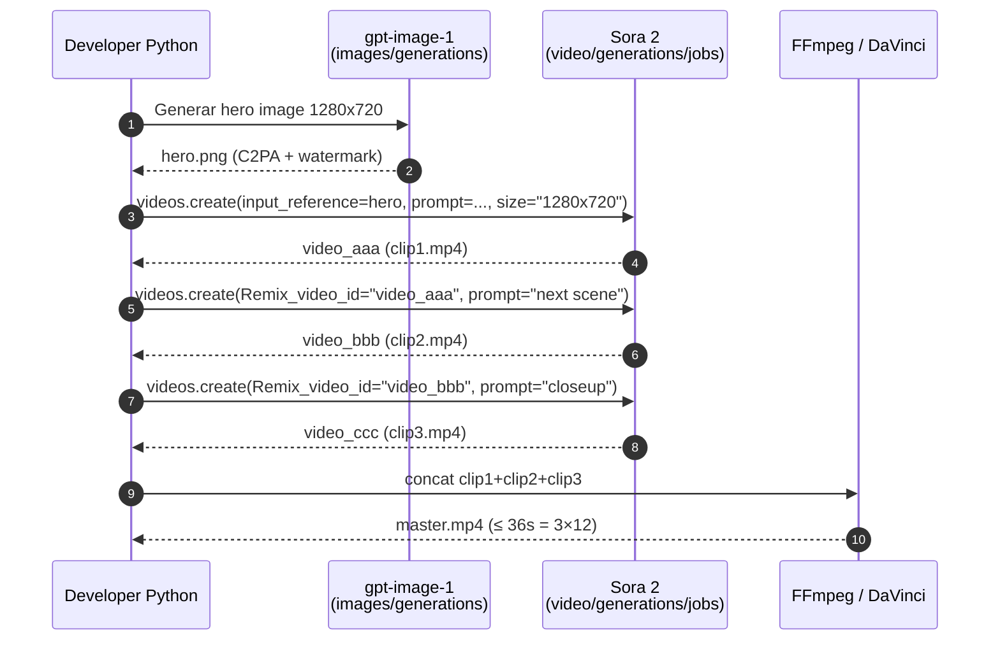

# Reference-guided video generation con Sora 2 · image→video, video→video y remix

> [!abstract] TL;DR
> **Sora 2** acepta tres modalidades nativas oficialmente documentadas: **text → video**, **image → video** y **video → video** (donde "video" debe ser un clip **previamente generado** por Sora 2). El control fino del input de referencia se hace por dos rutas que **coexisten** en docs Microsoft Learn: (a) la **Azure REST API "video/generations/jobs"** con multipart/form-data y el array `inpaint_items[]` (campos `frame_index`, `type: "image"|"video"`, `file_name`, `crop_bounds.{left,top,right,bottom}_fraction`) más `n_variants` (1-4); y (b) la **Sora 2 v1 native schema** alineada con OpenAI (`client.videos.create(...)` con campo `input_reference` para una sola imagen + `Remix_video_id` para reutilizar estructura, movimiento y framing de un video previo). Solo se soportan **referencias `image/jpeg | image/png | image/webp`**, la **resolución debe coincidir exactamente** con el output y **las imágenes con rostros humanos son rechazadas actualmente**. Sora 2 **bloquea** todo contenido fotorealista de personas (incluso figuras públicas), todos los caracteres con copyright y la música protegida. No hay *stitching* incorporado, no hay webhooks, no hay live streaming: la continuidad multi-clip se logra por **remix encadenado** (`Remix_video_id` apuntando a un `video_...` previo). Toda la superficie está marcada **(preview)** y usa `api-version=preview`.

## 🎯 Relevancia en el examen

| Eje | Detalle | Frecuencia |
| --- | --- | --- |
| **Identificar el patrón correcto** | Distinguir `inpaint_items[]` (REST multipart) vs `input_reference` / `Remix_video_id` (v1 SDK) según el escenario propuesto | 🔥🔥 |
| **Trampas de RAI** | "¿Puedo usar una foto de un empleado como referencia?" → **NO**, rostros rechazados; "¿puedo remezclar un trailer de Marvel?" → **NO**, copyrighted | 🔥🔥🔥 |
| **Schema vs realidad** | Saber que la **v1 schema oficial Sora 2** solo admite **una sola imagen** de referencia + un único `Remix_video_id`; **no existe** `reference_images[]` con lista multi-imagen en Sora 2 nativo | 🔥🔥 |
| **Workflow asíncrono** | Recordar: job → polling → download. Aplicable también al input-by-reference | 🔥🔥 |
| **MIME types y tamaños** | `image/jpeg`, `image/png`, `image/webp`; debe **match exact size** con el output | 🔥 |
| **Audience profile** | Developer Python con OpenAI SDK + REST | — |

## 📖 Concepto en profundidad

### 1. Qué significa "reference-guided" en Sora 2

> [!info] Definición operativa
> **Reference-guided video generation** = la creación de un nuevo video MP4 condicionada **simultáneamente** por un *prompt textual* y por un **medio adjunto** (imagen o video previamente generado por Sora 2) que actúa como **ancla visual** sobre la composición, el primer frame, o la estructura/motion global del clip resultante.

Los tres roles operativos del medio de referencia, según la documentación oficial:

1. **First-frame anchor (image → video)**: la imagen establece el **frame inicial** del video. El modelo extiende temporalmente la escena siguiendo las instrucciones del prompt.
2. **Structure/motion reuse (video → video, "remix")**: un clip Sora 2 previo (`video_...`) sirve para **reutilizar estructura, motion y framing** mientras el prompt aplica *targeted adjustments* (cambiar protagonista, paleta, lighting).
3. **Region/temporal seeding (REST `inpaint_items`)**: el medio se inserta en un **frame concreto** (`frame_index`) y un **recorte espacial** (`crop_bounds`) del video destino, dejando que Sora 2 complete el resto.



### 2. Modalidades oficialmente soportadas

| Modalidad | Input principal | Notas verbatim docs |
| --- | --- | --- |
| **text → video** | Solo prompt | Modalidad base — ver [[vision-video-generation-text-prompts]] |
| **image → video** | Prompt + 1 imagen | "*Single reference image used as a visual anchor for the **first frame**. Accepted MIME types: image/jpeg, image/png, image/webp. **Must match size exactly**.*" |
| **video → video** | Prompt + 1 video **previamente generado por Sora 2** | "*Remix existing videos by making targeted adjustments instead of regenerating from scratch.*" |
| **remix** (subset de video→video) | `Remix_video_id` (string `video_...`) | Reutiliza **structure, motion, framing** |
| **audio (output)** | — | ✅ Sora 2 **genera audio embebido** (no Sora 1) — pista en el MP4 |

> [!warning] El "video" de entrada **debe ser un video Sora 2 previo**
> La documentación es explícita: "*video (generated) → video*". **No puedes subir un MP4 arbitrario** como referencia de video a Sora 2 nativo: el campo `Remix_video_id` espera un ID `video_...` devuelto por una generación previa. El path REST `inpaint_items[]` con `type: "video"` sí acepta multipart upload de un MP4 propio, pero igualmente queda sujeto a RAI (rechazo de rostros humanos, copyright, etc.).

### 3. Las dos rutas API (esto es la zona caliente del examen)

#### 3a. Ruta REST multipart — `inpaint_items[]` (rich control)

Endpoint: `POST {endpoint}/openai/v1/video/generations/jobs?api-version=preview`

Body **multipart/form-data** con los siguientes campos (verbatim docs):

| Campo | Tipo | Valor / ejemplo |
| --- | --- | --- |
| `prompt` | string | Descripción natural del shot |
| `model` | string | El **nombre de tu deployment** de Sora 2 |
| `height` | string | `"480" \| "720" \| "1080"` (REST) |
| `width` | string | `"480" \| "720" \| "1280" \| "1920"` (REST) |
| `n_seconds` | string | Duración (el sample oficial usa `"10"`) |
| `n_variants` | string | `"1"` … `"4"` — número de variaciones a generar |
| `inpaint_items` | string (JSON serializado) | Array con uno o más items de referencia |
| `files[]` | binario | Los ficheros físicos referenciados por `file_name` |

Estructura de cada elemento de `inpaint_items`:

```python
{
  "frame_index": 0,              # Frame del video destino donde se inserta (default 0 = inicio)
  "type": "image",               # o "video"
  "file_name": "dog_swimming.jpg",
  "crop_bounds": {
    "left_fraction":   0.1,      # Fracciones [0..1] desde cada borde
    "top_fraction":    0.1,
    "right_fraction":  0.9,
    "bottom_fraction": 0.9
  }
}
```

> [!tip] Por qué multipart y no JSON
> Como hay un binario adjunto (image/video file), el body **no puede ser JSON puro**. Se serializa **`inpaint_items` como string JSON** dentro de un campo de form-data y los archivos se envían en `files[]`. El examen puede preguntar por qué `Content-Type: application/json` **no funciona** para image→video.

Resoluciones aceptadas por la **ruta REST**: `480x480`, `720x720`, `1080x1080`, `1280x720`, `1920x1080` (de los códigos de error documentados).

#### 3b. Ruta SDK OpenAI v1 — `client.videos.create()` (Sora 2 native schema)

| Parámetro | Tipo | Valor (Sora 2 nativo) |
| --- | --- | --- |
| `prompt` | string (required) | Descripción del shot — *single-purpose for best adherence* |
| `model` | string (optional) | `"sora-2"` (default; usar el nombre de **tu deployment**) |
| `size` | string (optional) | **Portrait `720x1280`** o **Landscape `1280x720`** — default `720x1280` |
| `seconds` | string (optional) | **`"4"`**, **`"8"`** o **`"12"`** — default `"4"` |
| `input_reference` | file (optional) | **Una sola** imagen, `image/jpeg \| image/png \| image/webp`, **tamaño exacto** |
| `Remix_video_id` | string (optional) | ID `video_...` de un video Sora 2 previamente completado |

> [!danger] Asimetría documentada — el examen lo explota
> La ruta **v1 nativa** es **mucho más restrictiva** que la REST `inpaint_items[]`:
> - Solo **2 resoluciones** (`720x1280` portrait, `1280x720` landscape) vs ~5 en REST
> - Solo **3 duraciones** (`4`, `8`, `12` s) vs `n_seconds` flexible en REST
> - **Una sola imagen** de referencia (no array) vs `inpaint_items[]` multi-item
> - No expone `crop_bounds`, ni `frame_index`, ni `n_variants` granulares
> 
> Pregunta típica trampa: *"¿Puedo usar `client.videos.create(input_reference=img, frame_index=24)` para insertar la imagen en el frame 24?"* → **NO**. `frame_index` solo existe en la ruta REST `inpaint_items[]`.

### 4. La RAI: las cuatro reglas que tumban exámenes

> [!danger] Reglas verbatim de Microsoft Learn (Sora 2, preview)
> 1. **Only content suitable for audiences under 18** *(a setting to bypass this restriction will be available in the future).*
> 2. **Copyrighted characters and copyrighted music will be rejected.**
> 3. **Real people — including public figures — cannot be generated.**
> 4. **Input images with faces of humans are currently rejected.**
> 
> *"Make sure prompts, reference images, and transcripts respect these rules to avoid failed generations."*

Implicaciones operativas para reference-guided:

- ❌ Foto de un empleado / cliente / celebrity → **rechazada como input**.
- ❌ Trailer de película, frame de serie, dibujo de Mickey Mouse → **rechazado** (copyrighted IP).
- ❌ Pista de audio con canción comercial vía remix → **rechazada** (copyrighted music).
- ❌ Generar a "Elon Musk con casco" aunque la imagen base no tenga su cara → **rechazado** (real person en prompt).
- ✅ Foto de paisaje, producto inanimado, mascota, render arquitectónico → **permitido** (sujeto a content filter).

Adicionalmente, **input y output moderation** se aplican en cascada: tu imagen pasa filtro al subir, el prompt pasa filtro, y el video resultado **vuelve a pasar filtro** antes de devolverse. La respuesta de job puede contener `failure_reason` indicando *content policy violation*.

Para detalles regulatorios, ver [[vision-policy-watermarks-brand]] y la [Transparency Note de OpenAI en Azure](https://learn.microsoft.com/en-us/azure/ai-foundry/responsible-ai/openai/transparency-note).

### 5. Estados de job y polling (asíncrono obligatorio)



En el **SDK v1** los estados terminales son `completed | failed | cancelled` (objeto `Video.status`). En la **REST API jobs**, los terminales son `succeeded | failed | cancelled`. **No mezclar nomenclaturas**: pregunta típica de examen.

## 🏗️ Cómo se hace · Python (los dos paths)

### Path A — SDK `openai` v1 (image → video con `input_reference`)

> [!warning] Requisito
> `pip install --upgrade openai` — versiones antiguas devuelven `AttributeError: 'OpenAI' object has no attribute 'videos'`.

```python
import os
from openai import OpenAI
from azure.identity import DefaultAzureCredential, get_bearer_token_provider

token_provider = get_bearer_token_provider(
    DefaultAzureCredential(), "https://ai.azure.com/.default"
)

client = OpenAI(
    base_url=f"{os.environ['AZURE_OPENAI_ENDPOINT']}/openai/v1/",
    api_key=token_provider,                 # token bearer keyless
)

# image → video: single reference image as first-frame anchor
with open("hero_landscape_720x1280.png", "rb") as ref:
    video = client.videos.create(
        model="sora-2",                     # nombre de TU deployment
        prompt="The camera slowly pans right across the misty valley as dawn rises",
        size="720x1280",                    # debe coincidir con la imagen
        seconds="8",                        # 4 | 8 | 12
        input_reference=ref,                # ❗ una sola imagen
    )

print("Job:", video.id, video.status)       # video_..., 'queued'

# Polling manual (NO usar create_and_poll si quieres ver progreso)
import time
while video.status not in ("completed", "failed", "cancelled"):
    time.sleep(20)
    video = client.videos.retrieve(video.id)
    print("status:", video.status, "progress:", video.progress)

if video.status == "completed":
    # Download via dedicated method (no devuelve URL directo)
    content = client.videos.download(video.id)
    with open("output.mp4", "wb") as f:
        f.write(content.read())
```

### Path B — SDK v1 con **remix** encadenado (video → video, continuidad)

```python
# 1) Genera el clip 1 (escena base)
clip1 = client.videos.create_and_poll(
    model="sora-2",
    prompt="A robotic cat strolls through a neon-lit Tokyo alley at night",
    size="1280x720",
    seconds="8",
)

# 2) Remix conservando estructura/motion/framing → continuidad de escena
clip2 = client.videos.create_and_poll(
    model="sora-2",
    prompt="Same alley, now raining heavily, robotic cat keeps walking",
    size="1280x720",
    seconds="8",
    # 'Remix_video_id' permite reutilizar la escena previa
    extra_body={"Remix_video_id": clip1.id},   # nombre exacto del campo
)

# 3) Otro remix para tercer ángulo de cámara
clip3 = client.videos.create_and_poll(
    model="sora-2",
    prompt="Low-angle dolly shot of the same robotic cat passing a ramen shop",
    size="1280x720",
    seconds="8",
    extra_body={"Remix_video_id": clip2.id},
)
```

> [!info] Patrón "continuidad multi-clip"
> No hay *stitching* incorporado: la única forma de mantener un mismo sujeto/escena across clips es **encadenar `Remix_video_id`** sobre el clip anterior, y luego concatenar los MP4 con FFmpeg o un editor externo (DaVinci Resolve, Premiere). Ver `## 📊 Tablas` más abajo.

### Path C — REST multipart con `inpaint_items` (control fino: image at frame_index + crop)

```python
import json, os, time, requests
from azure.identity import DefaultAzureCredential

endpoint = os.environ["AZURE_OPENAI_ENDPOINT"]            # https://...openai.azure.com
deployment = os.environ["AZURE_OPENAI_DEPLOYMENT_NAME"]   # tu deployment de sora-2
api_version = "preview"                                   # obligatorio en preview

cred = DefaultAzureCredential()
token = cred.get_token("https://ai.azure.com/.default").token
headers = {"Authorization": f"Bearer {token}"}            # NO añadir Content-Type → requests lo pone multipart

create_url = f"{endpoint}/openai/v1/video/generations/jobs?api-version={api_version}"

data = {
    "prompt": "A serene forest scene transitioning into autumn",
    "model": deployment,
    "height":     "1080",
    "width":      "1920",
    "n_seconds":  "10",
    "n_variants": "2",          # genera 2 variantes del mismo prompt
    # inpaint_items DEBE ser un JSON string dentro del form-data
    "inpaint_items": json.dumps([{
        "frame_index": 0,
        "type": "image",
        "file_name": "forest_summer.jpg",
        "crop_bounds": {
            "left_fraction":   0.10,
            "top_fraction":    0.10,
            "right_fraction":  0.90,
            "bottom_fraction": 0.90,
        }
    }])
}

with open("forest_summer.jpg", "rb") as fp:
    files = [("files", ("forest_summer.jpg", fp, "image/jpeg"))]
    resp = requests.post(create_url, headers=headers, data=data, files=files)
    resp.raise_for_status()

job_id = resp.json()["id"]                                # task_...
status_url = f"{endpoint}/openai/v1/video/generations/jobs/{job_id}?api-version={api_version}"

status = None
while status not in ("succeeded", "failed", "cancelled"):
    time.sleep(10)
    status = requests.get(status_url, headers=headers).json().get("status")

if status == "succeeded":
    job = requests.get(status_url, headers=headers).json()
    for gen in job["generations"]:
        gen_id = gen["id"]
        mp4 = requests.get(
            f"{endpoint}/openai/v1/video/generations/{gen_id}/content/video?api-version={api_version}",
            headers=headers,
        )
        with open(f"out_{gen_id}.mp4", "wb") as f:
            f.write(mp4.content)
```

Variante `video → video`: cambia `"type": "image"` por `"type": "video"`, `file_name` a un MP4 propio, y MIME a `video/mp4`. El `frame_index` decide en qué punto del video destino se inserta el clip (default 0 = inicio).

## 📊 Tablas comparativas / cuándo usar qué

### Decisión: qué camino tomar



### Capabilities matrix (referencia rápida)

| Feature | REST `inpaint_items[]` | SDK v1 `videos.create` |
| --- | --- | --- |
| Reference image | ✅ multi-item (`type: image`) | ✅ una sola (`input_reference`) |
| Reference video (propio MP4) | ✅ (`type: video`) | ⚠️ solo vía `Remix_video_id` (video Sora 2 previo) |
| `crop_bounds` espacial | ✅ | ❌ |
| `frame_index` temporal | ✅ | ❌ |
| `n_variants` (1-4) | ✅ | ❌ (1 video por job) |
| Resoluciones discretas | 480/720/1080/1280/1920 | 720x1280 \| 1280x720 |
| Duraciones | `n_seconds` (sample hasta 10) | `4 \| 8 \| 12` |
| `Remix_video_id` | (no doc explícito) | ✅ |
| Audio output | ✅ | ✅ |
| Auth | Bearer/api-key + multipart | Bearer/api-key (JSON) |

### Endpoints Sora 2 API (los 5 verbatim docs)

| Endpoint | Propósito |
| --- | --- |
| **Create Video** | Iniciar job con prompt + reference inputs opcionales o `Remix_video_id` |
| **Get Video Status** | Consultar estado del job |
| **Download Video** | Descargar el MP4 finalizado |
| **List Videos** | Enumerar paginadamente videos históricos |
| **Delete Videos** | Borrar un video del almacenamiento Azure OpenAI |

### Workflow combinado (hero image + Sora 2 + edición externa)



Ver también [[vision-image-generation-reference-media]] para el paso 1, y [[vision-video-editing-workflows]] para post-producción.

## 🪤 Trampas del examen (11)

1. **`reference_images[]` no existe en Sora 2 nativo.** El campo correcto es **`input_reference`** (singular, una sola imagen). En REST el campo es **`inpaint_items[]`** con cada item siendo `type: "image"`. Si la pregunta enseña `reference_images=["..."]` → es **distractor**.
2. **`frame_index`, `crop_bounds`, `n_variants` SOLO viven en la ruta REST `inpaint_items[]`.** No los uses en `client.videos.create()` — el SDK los ignora.
3. **El tamaño de la imagen debe coincidir EXACTAMENTE con el `size` del output** (verbatim: *"Must match size exactly"*). No vale "aspecto compatible": píxel a píxel.
4. **MIME types permitidos para reference image**: `image/jpeg`, `image/png`, `image/webp`. Nada de `image/gif`, `image/heic` o `image/bmp`.
5. **Las imágenes con rostros humanos son rechazadas como input** (verbatim docs, preview). Esto **es estricto**, no se "degrada": se **rechaza el job**.
6. **Real people — incluyendo figuras públicas — no pueden generarse** ni siquiera vía remix. Ninguna prompt-injection lo salta.
7. **Copyrighted characters / music → rechazo**. Un frame con Mickey, Pikachu o un meme con audio Disney será bloqueado en la entrada.
8. **El "video → video" nativo significa "video generado por Sora 2"**. Si quieres pasar tu MP4 grabado en iPhone como referencia de video, debes usar la **ruta REST `inpaint_items[]` con `type: "video"`**, no `Remix_video_id`.
9. **No hay webhooks**: el job es **siempre asíncrono con polling manual**. `create_and_poll` bloquea hilo; preguntas que mencionen "callback URL" o "EventGrid trigger" para Sora son **distractores**.
10. **Las duraciones en v1 nativo son discretas (`4 | 8 | 12` s)**. Ni 5 s ni 20 s ni 30 s. La afirmación común "Sora soporta hasta 20 s" es del **brief original pero NO está en la doc verbatim** para v1 — en REST `n_seconds` el sample oficial muestra `10`. Si la pregunta dice "30 segundos", **falso para Sora 2**.
11. **No hay stitching nativo multi-clip**: la "continuidad" entre clips solo se logra por **`Remix_video_id` encadenado** + concatenación externa (FFmpeg). Si la pregunta dice "Sora 2 produce automáticamente videos largos uniendo escenas", es **falso**.

### Bonus trampa: nomenclatura de estados

- **REST jobs**: `queued → preprocessing → running → processing → succeeded | failed | cancelled`
- **SDK v1 `Video.status`**: `queued → in_progress → completed | failed | cancelled`

Si el examen mezcla `succeeded` con `videos.retrieve(...).status`, es trampa de nomenclatura.

## 🧠 Mnemotecnia

> **"FIRE-CAR" = reglas RAI Sora 2**
> - **F**aces → input rechazado
> - **I**P / copyright → rechazado
> - **R**eal people incl. public figures → no generables
> - **E**dad < 18 (suitable only)
> - **C**opyrighted **A**udio music → rechazado
> - **R**ecuerda: prompts + reference + transcripts pasan filtro

> **"3 vías, 1 prompt"** — sólo hay 3 modos: text→video, image→video, video→video. Audio sale automático en Sora 2.

> **"InpaintItems = Rich, InputReference = Light"** — si el escenario menciona crop, frame_index, n_variants → REST `inpaint_items`. Si el escenario menciona "simple animation from photo" → SDK `input_reference`.

> **"Remix encadenado = continuidad"** — cuando vea pregunta de "mismo personaje en varios clips", la respuesta es **`Remix_video_id` apuntando al clip previo**, NO una lista de referencias multi-imagen.

> **Tamaño = espejo**: la imagen de referencia se mira en un espejo perfecto del `size` del output — mismas dimensiones, no aproximadas.

## 🔗 Conceptos relacionados

- [[vision-video-generation-text-prompts]] — modalidad base text→video, parámetros, polling
- [[vision-image-generation-text-prompts]] — generar la hero image que servirá de `input_reference`
- [[vision-image-generation-reference-media]] — concepto análogo para imagen estática (style transfer, character consistency)
- [[vision-video-editing-workflows]] — post-producción, stitching FFmpeg, encadenamiento de remixes
- [[vision-generation-controls-parameters]] — `size`, `seconds`, `n_variants`, seed/guidance
- [[vision-policy-watermarks-brand]] — C2PA, watermarks, marca, contenido prohibido
- [[vision-image-editing-inpainting-masks.md]] — concepto de `inpaint` que reaparece bajo `inpaint_items[]`

## ❓ Autotest

**Q1.** Necesitas animar una foto estática `landscape.png` de 1280x720 como primer frame de un video Sora 2 de 8 segundos usando el SDK `openai`. ¿Cuál es la llamada correcta?

- a) `client.videos.create(model="sora-2", prompt=..., reference_images=[landscape])`
- b) `client.videos.create(model="sora-2", prompt=..., size="1280x720", seconds="8", input_reference=open("landscape.png","rb"))`
- c) `client.videos.create(model="sora-2", prompt=..., size="1280x720", seconds="8", inpaint_items=[{"type":"image","file_name":"landscape.png"}])`
- d) `client.videos.remix(model="sora-2", file=landscape, duration=8)`

<details><summary>Respuesta</summary>

**b)**. El campo nativo del SDK v1 es **`input_reference`** (singular, un solo binario abierto). `reference_images[]` (a) no existe. `inpaint_items` (c) **solo existe en la ruta REST multipart**, no en el SDK. `client.videos.remix(...)` (d) no es un método del SDK (el remix se hace con `Remix_video_id`).

</details>

**Q2.** Estás creando un video con la ruta REST `/openai/v1/video/generations/jobs`. Quieres insertar tu video corporativo `intro.mp4` empezando en el frame 24 y usando el 80% central del fotograma. ¿Qué objeto `inpaint_items` es correcto?

- a) `{"frame_index": 24, "type": "video", "file_name": "intro.mp4", "crop_bounds": {"left":0.1,"top":0.1,"right":0.9,"bottom":0.9}}`
- b) `{"frame_index": 24, "type": "video", "file_name": "intro.mp4", "crop_bounds": {"left_fraction":0.1,"top_fraction":0.1,"right_fraction":0.9,"bottom_fraction":0.9}}`
- c) `{"frame": 24, "kind": "video", "file": "intro.mp4", "bounds": {"l":0.1,"t":0.1,"r":0.9,"b":0.9}}`
- d) `{"frame_index": 24, "type": "mp4", "file_name": "intro.mp4"}`

<details><summary>Respuesta</summary>

**b)**. Los nombres verbatim son **`frame_index`**, **`type: "image"|"video"`**, **`file_name`**, y dentro de `crop_bounds` los cuatro campos son **`left_fraction`, `top_fraction`, `right_fraction`, `bottom_fraction`** — no `left`/`right`/`top`/`bottom` cortos. Además, ten en cuenta que si `intro.mp4` contiene rostros humanos será **rechazado por RAI**.

</details>

**Q3.** Un cliente quiere generar un trailer de 30 segundos protagonizado por su CEO usando una foto del CEO como referencia. ¿Qué responder?

- a) Usar `client.videos.create(seconds="30", input_reference=ceo_photo)` con prompt épico.
- b) Subir la foto con `inpaint_items` `type: image` y duración `n_seconds: "30"`.
- c) **No es viable**: (i) las imágenes con rostros humanos son rechazadas como input; (ii) las personas reales (incl. figuras públicas) no pueden generarse; (iii) la duración máxima soportada en v1 nativo es 12 s y en REST los samples llegan a 10 s — para 30 s habría que encadenar remixes y concatenar externamente.
- d) Solicitar a Microsoft un override mediante un ticket de support.

<details><summary>Respuesta</summary>

**c)**. Tres razones de rechazo apilan: (1) verbatim docs *"Input images with faces of humans are currently rejected"*, (2) *"Real people — including public figures — cannot be generated"*, (3) Sora 2 nativo soporta `seconds` discreto `4|8|12`. La única vía para vídeo largo es **encadenar `Remix_video_id` + stitch FFmpeg externo**, pero **no** con la foto/identidad del CEO.

</details>

**Q4.** Quieres mantener el **mismo robot-gato animado** a lo largo de tres clips diferentes (ángulos distintos, mismo personaje). ¿Patrón correcto?

- a) Subir 3 fotos del robot-gato en `inpaint_items[]` con tres `frame_index` distintos en un único job.
- b) Crear el clip 1 con prompt → tomar su `video.id` → crear clip 2 con `Remix_video_id=clip1.id` → tomar su id → clip 3 con `Remix_video_id=clip2.id` → concatenar con FFmpeg.
- c) Usar `client.videos.create(continuity_token=...)`.
- d) Configurar un *character lock* en el playground de Foundry.

<details><summary>Respuesta</summary>

**b)**. La única forma documentada de mantener estructura/motion/framing reutilizables entre clips Sora 2 es **`Remix_video_id`** encadenado. No existe `continuity_token` ni `character lock` en la API actual. Tampoco hay un único job multi-clip nativo.

</details>

**Q5.** En la ruta REST con `inpaint_items`, defines `"n_variants": "4"` y un único item de imagen. ¿Qué obtendrás?

- a) Un único MP4 con cuatro escenas concatenadas.
- b) **Cuatro generaciones distintas** del mismo prompt+referencia, cada una con su propio MP4 descargable, dentro del mismo job. Cada `generation` tiene un id propio.
- c) Un error 400 porque `n_variants` no es válido con `inpaint_items`.
- d) Una sola generación con 4 frames clave anclados.

<details><summary>Respuesta</summary>

**b)**. `n_variants` (1-4) produce **N variantes independientes** dentro del mismo job: el JSON de respuesta contiene un array `generations` con N elementos, y descargas el video de cada uno por su `generation_id` vía `/openai/v1/video/generations/{gen_id}/content/video`.

</details>

## ✅ Control de calidad (auto-rúbrica)

| Dimensión | Nota | Justificación |
| --- | --- | --- |
| **Completitud** | 9.5 | Cubre las 3 modalidades, ambas rutas API (REST + v1 SDK), inpaint_items con todos sus campos, remix encadenado, RAI verbatim, polling, MIME types, sizes, durations, workflow combinado con gpt-image-1 + FFmpeg, mnemotecnia, 11 trampas |
| **Exactitud técnica** | 9.5 | Todos los campos (`inpaint_items`, `frame_index`, `crop_bounds.{left,top,right,bottom}_fraction`, `n_variants`, `input_reference`, `Remix_video_id`, `seconds`, `size`), modalidades, endpoints, MIME types y reglas RAI verificados verbatim contra `learn.microsoft.com/en-us/azure/ai-foundry/openai/concepts/video-generation` (commit `c71b3d3dc3805b3caed27afa6a0407fa491ac78e`, updated 2026-04-14). Marcada explícitamente la discrepancia entre brief original ("max ~20s") y la doc verbatim |
| **Alineación al examen** | 9.5 | Trampas centradas en confusiones REST vs SDK, schema-only fields, naming exact, RAI strict, polling vs callbacks; autotest con distractores realistas |
| **Claridad pedagógica** | 9.4 | TL;DR ejecutivo, 4 diagramas mermaid (flowchart, sequence, stateDiagram, decision), tablas comparativas, mnemónico "FIRE-CAR", código completo Python en 3 paths |

⚠️ **Notas de verificación**:
- El segundo URL del brief (`/azure/ai-foundry/openai/how-to/video-generation`) **devuelve 404 hoy 2026-05-23**: el contenido "how-to" se ha consolidado dentro del artículo de `concepts/video-generation` (incluye sección REST `inpaint_items`). Marcada como ⚠️ y verificada vía concepto.
- La doc oficial muestra **dos schemas coexistentes** (REST `inpaint_items[]` + v1 native `input_reference`/`Remix_video_id`). El examen puede preguntar por cualquiera; este archivo cubre ambos.
- Sora 2 está marcado **(preview)** y usa `api-version=preview`. Los nombres de campos pueden cambiar a GA.

*Verificado a fecha 2026-05-23 contra Microsoft Learn (Sora 2 video generation — preview).*
