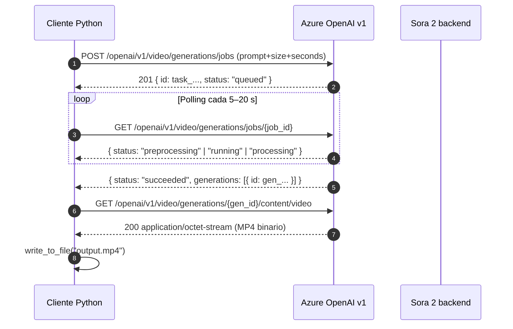

# Sora 2 — Generación de video a partir de prompts de texto

> [!abstract] TL;DR
> **Sora 2** (OpenAI, en *preview* dentro de Microsoft Foundry / Azure OpenAI) es el modelo **text → video** (y opcionalmente *image → video* / *video → video* / *remix*). Su API es **asíncrona obligatoria**: se crea un **job**, se hace **polling** hasta `succeeded` (REST) / `completed` (SDK), y luego se descarga el **MP4** vía un endpoint separado. Soporta **9 resoluciones discretas** (480x480 → 1920x1080), **duraciones 1–20 s** y **hasta 4 variantes** (depende de la resolución). Aplica filtrado de contenido pre- y post-generación con restricciones estrictas: bloquea **rostros reales, personajes con copyright y música protegida**.

## 🎯 Relevancia en el examen

| Eje | Detalle |
| --- | --- |
| **Tipo de preguntas** | Identificar workflow correcto (3 pasos), elegir endpoint, distinguir REST vs SDK, debugging de estados, encajar límites con escenarios |
| **Trampas frecuentes** | Confundir nombres de campos REST vs SDK, confundir estados (`succeeded` vs `completed`), pedir resolución no soportada, exigir webhooks |
| **Frecuencia** | 🔥🔥 — modelo nuevo GA-late 2025/2026, casi seguro tema de preguntas situacionales en C.1 |
| **Audience profile** | Developer Python con Azure OpenAI — debes leer y completar código |

## 📖 Concepto en profundidad

### Modelo y modalidades

Sora 2 es el modelo de generación de video de OpenAI publicado en Azure (Foundry / Azure OpenAI) **en preview**. Las modalidades soportadas son:

- **text → video** (foco de este archivo)
- **image → video** (frame inicial de referencia) → ver [[vision-video-generation-reference-media]]
- **video → video** (extensión / edición) → ver [[vision-video-editing-workflows]]
- **remix** (modifica un video previo conservando estructura) → ver [[vision-video-editing-workflows]]
- **audio**: Sora 2 soporta **generación de audio embebida** en la pista de salida (a diferencia de Sora 1).

> [!info] API alignment
> Sora 2 usa el **v1 API** de Azure OpenAI, **alineado con el schema nativo OpenAI** (`https://{resource}.openai.azure.com/openai/v1/`). Esto explica que el SDK `openai` funcione directamente cambiando `base_url`.

### Por qué es asíncrono

La generación de video tarda **1–5 minutos típicos** (puede llegar a varios minutos según resolución/duración). No hay respuesta inmediata: cualquier endpoint te devuelve un **job descriptor** que tienes que **pollear**. No hay **webhooks ni callbacks** — solo polling.



### Estados del job (CRÍTICO — divergen REST vs SDK)

| Capa | Estados intermedios | Estados terminales |
| --- | --- | --- |
| **REST API** | `queued` → `preprocessing` → `running` → `processing` | `succeeded` · `failed` · `cancelled` |
| **Python SDK** (`client.videos`) | `queued` → `in_progress` | `completed` · `failed` · `cancelled` |

> [!danger] Trampa pura de examen
> El SDK alto nivel **renombra** estados: `succeeded` → `completed`, `running/processing/preprocessing` → `in_progress`. Si lees código y ves `if video.status == "succeeded"` usando `client.videos.retrieve()`, **es bug** — nunca llegará a True.

## 🏗️ Cómo se hace

### Resource provider y deployment

Sora 2 vive en un recurso `Microsoft.CognitiveServices/accounts` con `kind = "OpenAI"` (o `kind = "AIServices"`). Se despliega como cualquier otro modelo de Azure OpenAI:

```bash
# Azure CLI — desplegar Sora 2 sobre un recurso Azure OpenAI ya creado
az cognitiveservices account deployment create \
  --name <resource-name> \
  --resource-group <rg> \
  --deployment-name sora-deploy \
  --model-name sora-2 \
  --model-version "<version>" \
  --model-format OpenAI \
  --sku-name Standard \
  --sku-capacity 1
```

> [!warning] Disponibilidad regional
> Sora 2 está disponible solo en un **subset de regiones** (preview). Consulta la tabla `video-generation-models` en la página `concepts/models` de Microsoft Learn antes de elegir región — equivocarse en la región es la causa #1 de `404 deployment not found`.

### REST workflow — 3 pasos (Python `requests`)

API version durante preview: **`preview`** (literalmente la cadena `preview`, no `2025-04-01-preview`).

```python
import os, time, requests
from azure.identity import DefaultAzureCredential

endpoint        = os.environ["AZURE_OPENAI_ENDPOINT"]      # https://<resource>.openai.azure.com
deployment_name = os.environ["AZURE_OPENAI_DEPLOYMENT_NAME"]  # p.ej. "sora-deploy"
api_version     = "preview"

# Auth Entra ID (recomendado)
token = DefaultAzureCredential().get_token("https://ai.azure.com/.default")
headers = {"Authorization": f"Bearer {token.token}", "Content-Type": "application/json"}

# 1) Crear job
create_url = f"{endpoint}/openai/v1/video/generations/jobs?api-version={api_version}"
body = {
    "prompt":    "A cat playing piano in a jazz bar.",
    "width":     480,
    "height":    480,
    "n_seconds": 5,
    "model":     deployment_name
}
resp = requests.post(create_url, headers=headers, json=body)
resp.raise_for_status()
job_id = resp.json()["id"]   # ej. "task_01jwcet0eje35tc5jy54yjax5q"

# 2) Polling
status_url = f"{endpoint}/openai/v1/video/generations/jobs/{job_id}?api-version={api_version}"
status = None
while status not in ("succeeded", "failed", "cancelled"):
    time.sleep(5)
    payload = requests.get(status_url, headers=headers).json()
    status  = payload.get("status")

# 3) Descarga (endpoint distinto: /generations/{generation_id}/content/video)
if status == "succeeded":
    gen_id = payload["generations"][0]["id"]
    video_url = f"{endpoint}/openai/v1/video/generations/{gen_id}/content/video?api-version={api_version}"
    video = requests.get(video_url, headers=headers)
    with open("output.mp4", "wb") as f:
        f.write(video.content)
```

> [!important] Tres recursos distintos
> El job tiene **dos identificadores diferentes**:
> - `task_...` (ID del **job**) — usado para polling.
> - `video_...` o `gen_...` (ID de la **generation** dentro del job, en `generations[0].id`) — usado para descargar.
> Confundirlos rompe el step 3.

### Python SDK `openai` (cliente alto nivel)

El SDK oficial usa la clase `OpenAI` (NO `AzureOpenAI`) apuntando al endpoint `v1` de Azure. Esto es porque Sora 2 sigue el **schema nativo OpenAI**.

```python
import os, time
from openai import OpenAI
from azure.identity import DefaultAzureCredential, get_bearer_token_provider

token_provider = get_bearer_token_provider(
    DefaultAzureCredential(), "https://ai.azure.com/.default"
)

client = OpenAI(
    base_url = "https://<RESOURCE>.openai.azure.com/openai/v1/",
    api_key  = token_provider,        # callable -> token
)

# 1) Create
video = client.videos.create(
    model  = "sora-2",                # nombre del DEPLOYMENT (no del modelo base)
    prompt = "A video of a cool cat on a motorcycle in the night",
    size   = "720x1280",              # string "WxH"
    seconds = "8",                    # ⚠️ string preferido, aunque acepta int
)
print(video.id, video.status)         # "video_...", "queued"

# 2) Poll
while video.status not in ("completed", "failed", "cancelled"):
    time.sleep(20)
    video = client.videos.retrieve(video.id)

# 3) Download
content = client.videos.download_content(video.id, variant="video")
content.write_to_file("video.mp4")
```

#### Atajo `create_and_poll` (async)

El SDK ofrece un helper que combina **create + poll** internamente. Solo en cliente **async**:

```python
import asyncio
from openai import AsyncOpenAI
client = AsyncOpenAI(base_url="...", api_key=token_provider)

async def main():
    video = await client.videos.create_and_poll(
        model="sora-2",
        prompt="A video of a cat on a motorcycle",
    )
    print(video.status)               # "completed" o "failed"

asyncio.run(main())
```

> [!warning] Jupyter Notebooks
> `asyncio.run()` falla dentro de un notebook con `RuntimeError: asyncio.run() cannot be called from a running event loop`. La doc oficial recomienda usar la versión **síncrona** (`create` + bucle `retrieve`) en Jupyter.

### Lista y borrado

```python
# Listar videos generados (paginado)
for v in client.videos.list():
    print(v.id, v.status, v.created_at)

# Borrar
client.videos.delete("video_...")
```

> [!info] TTL del job
> Los jobs y sus videos **expiran a las 24 horas** desde su creación. Pasado ese tiempo debes regenerar.

## 📊 Parámetros, REST vs SDK

| Concepto | Campo REST | Campo SDK Python | Tipo | Notas |
| --- | --- | --- | --- | --- |
| Prompt | `prompt` | `prompt` | string | Inglés / latín preferido |
| Modelo | `model` | `model` | string | El **deployment name**, NO `"sora"` literal |
| Duración | `n_seconds` | `seconds` | int (REST) / string preferido (SDK) | **1–20 s** (rango continuo) — defaults documentados `4/8/12` |
| Ancho | `width` | (parte de `size`) | int | Ej. 1920 |
| Alto | `height` | (parte de `size`) | int | Ej. 1080 |
| Resolución (SDK) | — | `size` | string `"WxH"` | Ej. `"1280x720"` |
| Variantes | `n_variants` | `n` | int (1-4) | Depende de resolución (ver abajo) |
| Imagen de referencia | `inpaint_items` (multipart) | `input_reference` | file | → [[vision-video-generation-reference-media]] |
| Remix | (campo dedicado) | `client.videos.remix(video_id=...)` | string | Reusa estructura del video previo |

> [!danger] Trampa nuclear
> **REST usa `n_seconds`/`width`/`height` (ints).** **SDK usa `seconds` (string) y `size` (`"WxH"`).** Si confundes nombres → `400 Bad Request`. El examen mete esto en preguntas de "elige la opción correcta".

## 🔢 Límites técnicos (verbatim del doc oficial)

> [!example] Constantes que debes memorizar
> - **Resoluciones soportadas** (lista cerrada de **9**):
>   `480x480`, `480x854`, `854x480`, `720x720`, `720x1280`, `1280x720`, `1080x1080`, `1080x1920`, `1920x1080`.
> - **Duración**: **1 a 20 segundos** (rango).
> - **Variantes por job**:
>   - **1080p** (cualquier orientación) → **variantes deshabilitadas** (solo 1).
>   - **720p** → **máx 2** variantes.
>   - **Resto** (480p) → **máx 4** variantes.
> - **Concurrencia**: máximo **2 jobs simultáneos** por recurso. Hay que esperar a que uno termine para crear el tercero.
> - **TTL**: jobs disponibles **24 horas**.
> - **Input máx**: hasta **2 imágenes** o **1 video de ≤ 5 s** como referencia.
> - **Tiempo de generación típico**: 1–5 minutos.

### Resoluciones aceptadas en el endpoint *reference / input_reference*

Solo `720x1280` y `1280x720` están permitidas cuando aportas `input_reference` (la fuente y el output deben coincidir exactamente). Ver [[vision-video-generation-reference-media]].

## 🎨 Prompt engineering para video

> [!tip] Receta oficial recomendada
> Microsoft Learn lo dice literal: *"Include shot type, subject, action, setting, lighting, and any desired camera motion to reduce ambiguity. Keep it single-purpose for best adherence."*

### Componentes de un buen prompt

| Componente | Ejemplo |
| --- | --- |
| **Shot type** | "low-angle drone tracking shot", "static wide", "close-up" |
| **Subject** | "a red sports car", "an elderly woman" |
| **Action** | "driving fast", "walking slowly" |
| **Setting** | "desert highway", "neon-lit Tokyo street at night" |
| **Lighting** | "golden hour", "moonlit", "harsh studio lighting" |
| **Style** | "cinematic", "documentary", "anime", "claymation" |
| **Camera motion** | "tracking shot", "dolly in", "pan left", "steady" |

### Plantilla canónica

```
[Shot type] of [subject] [action], [setting], [lighting], [style].
```

> Ejemplo: *"A low-angle drone tracking shot of a red sports car driving fast through a desert highway, golden hour, cinematic."*

### Reglas de adherencia

1. **Single-purpose**: un prompt = una idea. Si pides dos acciones simultáneas, Sora 2 puede ignorar una.
2. **Inglés o lenguajes latinos**: doc oficial dice *"Write text prompts in English or other Latin script languages for the best video generation performance."* Otros scripts pueden degradar la calidad.
3. **Evita instrucciones temporales precisas** (Sora 2 sigue siendo flojo en *event sequencing*).
4. **Evita relaciones causales** (mordiscos en una galleta, deformaciones físicas exactas) — son limitaciones conocidas.
5. **No pidas left/right** explícito — *spatial reasoning* es débil.

## 📦 Salida — formato y metadatos

- **Container**: **MP4**.
- **Códec, bitrate, framerate**: controlados por el modelo, no son parámetros públicos.
- **Audio**: incluido cuando aplica (Sora 2 nativo, diferencia clave vs Sora 1).
- **Metadatos de procedencia**: ⚠️ La página oficial *concepts/video-generation* **no menciona explícitamente C2PA / Content Credentials para Sora 2** a fecha 2026-05-23. La sección RAI sí menciona *built-in Responsible AI protections* y *abuse monitoring* pero no detalla la firma C2PA. **No afirmes en el examen que Sora 2 emite C2PA salvo que la pregunta lo plantee como hecho** — el resto de modelos de imagen (DALL-E 3, gpt-image-1) sí lo incorporan documentadamente, ver [[vision-policy-watermarks-brand]].

## 🛡️ Filtrado de contenido y restricciones

Sora 2 aplica filtros **pre-prompt** (analiza el prompt antes de empezar) y **post-generación** (analiza frames del video). Si algo viola política → `status: failed` con `failure_reason` rellenado.

### Restricciones explícitas (verbatim del doc oficial)

> [!danger] Bloqueos hardcoded en Sora 2
> 1. *"Only content suitable for audiences under 18"* (modo "de momento"; podría haber bypass futuro para escenarios corporativos).
> 2. *"Copyrighted characters and copyrighted music will be rejected."*
> 3. *"Real people—including public figures—cannot be generated."*
> 4. *"Input images with faces of humans are currently rejected."* — **incluso si subes una foto tuya como `input_reference`, será rechazada**.
> 5. *"Sora 2 blocks all IP and photorealistic content."* — el statement oficial es así de fuerte.

→ Ver [[vision-responsible-unsafe-content-filters]] y [[vision-policy-watermarks-brand]].

## 📊 Comparativa Sora 2 vs modelos de imagen

| Característica | **Sora 2** | **gpt-image-1** | **DALL·E 3** |
| --- | --- | --- | --- |
| Output | Video MP4 | Imagen (PNG/JPEG/WEBP) | Imagen (PNG) |
| Workflow | **Asíncrono** (jobs + poll + download) | Síncrono | Síncrono |
| API endpoint | `/openai/v1/video/generations/jobs` | `/openai/v1/images/generations` | `/openai/deployments/{d}/images/generations` |
| SDK method | `client.videos.create()` | `client.images.generate()` | `client.images.generate()` |
| Audio | ✅ embebido | n/a | n/a |
| Duración | 1–20 s | n/a | n/a |
| Variantes | 1–4 (según resolución) | 1–10 | 1 |
| Filtrado caras reales | ✅ Bloqueado | ✅ Bloqueado | ✅ Bloqueado |
| C2PA Content Credentials | ⚠️ no confirmado en docs | ✅ embebido | ✅ embebido |
| Billing | Per second | Per image (input+output tokens) | Per image |

→ Ver [[vision-image-generation-text-prompts]] · [[genai-dalle-image-generation]].

## 🌳 Árbol de decisión: ¿Sora 2 o no?

```mermaid
flowchart TD
    Q1{¿Necesito video?}
    Q1 -- No --> IMG[Usa gpt-image-1 o DALL-E 3]
    Q1 -- Sí --> Q2{¿Es generativo<br/>o analítico?}
    Q2 -- Analítico<br/>"qué hay en el video" --> VI[Azure Video Indexer]
    Q2 -- Generativo --> Q3{¿Duración<br/>≤ 20 s?}
    Q3 -- No --> NO[Sora 2 no encaja —<br/>encadena clips o usa otro proveedor]
    Q3 -- Sí --> Q4{¿Caras reales o<br/>personajes con IP?}
    Q4 -- Sí --> BLOCK[Bloqueado por filtro]
    Q4 -- No --> Q5{¿Necesito<br/>webhooks?}
    Q5 -- Sí --> POLL[No disponible —<br/>diseña polling]
    Q5 -- No --> SORA[✅ Sora 2 vía<br/>client.videos.create]
```

## 🪤 Trampas del examen (≥ 13)

1. **Sora 2 es asíncrono SIEMPRE**. No existe modo síncrono — quien marque la opción "POST y obtengo el MP4 en el body" se equivoca.
2. **Campos REST vs SDK distintos**: REST = `n_seconds` + `width` + `height`; SDK = `seconds` + `size` (`"WxH"`).
3. **SDK `seconds` es string** (ej. `"8"`), aunque internamente acepta int en algunos releases — la doc oficial usa strings. Para examen: **string**.
4. **`size` es un string `"WxH"`**, no dos enteros separados.
5. **Tres endpoints distintos** en el workflow REST: `POST .../jobs`, `GET .../jobs/{job_id}`, `GET .../generations/{generation_id}/content/video`. La descarga **no** es `GET /jobs/{job_id}/content`.
6. **`job_id` (`task_...`) ≠ `generation_id` (`video_.../gen_...`)**. El download usa el segundo.
7. **Estados divergen**: REST `succeeded` ≠ SDK `completed`. Una pregunta con código SDK que compare contra `"succeeded"` está rota — nunca termina.
8. **`api-version` durante preview es la cadena literal `preview`**, no `2025-04-01-preview` ni similar.
9. **Resoluciones son una lista cerrada de 9 valores**. No hay resolución "custom". Pedir `512x512` → `400 dimension error`.
10. **Duración 1–20 s**. Pedir 30 s falla. **No es** el conjunto discreto `{5,10,15,20}` (eso era Sora 1).
11. **Variantes**: 1080p ⇒ 1 sola; 720p ⇒ máx 2; 480p ⇒ máx 4. Pedir 4 variantes en 1080p falla.
12. **Webhooks NO disponibles** — solo polling. Cualquier pregunta que ofrezca "configura webhook al finalizar Sora 2" es trampa.
13. **Concurrencia máx 2 jobs por recurso** — el tercero falla hasta que termine alguno.
14. **Jobs expiran a las 24 h** — pasado ese tiempo no puedes descargar el MP4.
15. **`input_reference` solo acepta `720x1280` o `1280x720`** y debe coincidir con `size` del video.
16. **Caras humanas en input_reference → rechazo automático** (no es solo prompt; también input image).
17. **Cliente SDK es `OpenAI` (NO `AzureOpenAI`)** apuntando a `base_url = ".../openai/v1/"`. Es la única excepción en todo el ecosistema Azure OpenAI: Sora 2 sigue schema OpenAI nativo.
18. **Sora 2 ≠ Azure Video Indexer**: genera, no analiza. Pregunta tipo "necesito identificar caras en un video existente" → Video Indexer, NUNCA Sora 2.

## 🧠 Mnemotecnia

- **"3 endpoints, 3 IDs, 3 estados"**:
  - 3 endpoints: `POST jobs`, `GET jobs/{job}`, `GET generations/{gen}/content/video`.
  - 3 IDs: `task_…` (job) / `video_…` (generation) / deployment name.
  - 3 estados finales (REST): `succeeded` · `failed` · `cancelled`.
- **"SCC vs ICC"** (estados): **S**ucceeded / **C**ompleted (REST/SDK final OK); **C**ancelled / **C**ancelled (igual en ambos).
- **"1-20-2-4-24"** (los números mágicos):
  - **1**–**20** s duración.
  - **2** jobs concurrentes máx.
  - **4** variantes máx (en 480p).
  - **24** h TTL de jobs.
- **Prompt SSALC**: **S**hot · **S**ubject+Action · **L**ocation · **L**ighting · **C**amera motion · **C**inematic style. (mnemo libre: *"Suelta SSALC y filma cine"*).
- **REST = ints, SDK = strings**: *"REST suma anchos, SDK habla en cadenas"*.

## 🔗 Conceptos relacionados

- [[vision-image-generation-text-prompts]] — versión para imágenes (gpt-image-1, DALL-E 3).
- [[vision-video-generation-reference-media]] — image→video / video→video con `input_reference` y `inpaint_items`.
- [[vision-video-editing-workflows]] — remix, edición y workflows derivados.
- [[vision-generation-controls-parameters]] — controles transversales (size, n, seeds…).
- [[vision-policy-watermarks-brand]] — política de marca y watermarks / C2PA.
- [[vision-responsible-unsafe-content-filters]] — filtrado RAI pre/post generación.
- [[genai-dalle-image-generation]] — modelo DALL·E 3 (predecesor en familia OpenAI).

## ❓ Autotest

**1.** Estás desarrollando una app que genera videos con Sora 2 y necesitas notificar al usuario en cuanto el video esté listo. ¿Qué patrón es correcto?

- a) Configurar un webhook en el job.
- b) Llamar `POST /jobs?wait=true` para esperar de forma síncrona.
- c) Polling sobre `GET /openai/v1/video/generations/jobs/{job_id}` hasta `succeeded`.
- d) Suscribirse a un Event Grid topic emitido automáticamente por Sora 2.

<details><summary>Respuesta</summary>**c**. Sora 2 es exclusivamente asíncrono y **no soporta webhooks ni Event Grid nativo**. El único patrón soportado es polling.</details>

**2.** Un compañero te pasa este snippet y dice "no termina nunca":

```python
video = client.videos.create(model="sora-2", prompt="...")
while video.status != "succeeded":
    time.sleep(10)
    video = client.videos.retrieve(video.id)
```

¿Cuál es el bug?

- a) Falta `await`.
- b) El SDK usa `completed`, no `succeeded`, como estado terminal.
- c) `client.videos.retrieve` no existe; es `client.videos.get`.
- d) Falta `n_seconds`.

<details><summary>Respuesta</summary>**b**. El SDK Python usa estados `queued / in_progress / completed / failed / cancelled`. `succeeded` es nomenclatura **REST**, no SDK. El bucle nunca terminará.</details>

**3.** Necesitas un video vertical 1080p con 4 variantes para A/B testing. ¿Qué pasa al lanzar el job?

- a) Falla — 1080p no admite múltiples variantes.
- b) Falla — Sora 2 no soporta vertical.
- c) Devuelve 4 variantes correctamente.
- d) Devuelve 2 variantes (límite 720p).

<details><summary>Respuesta</summary>**a**. La documentación es explícita: *"for 1080p resolutions, this feature is disabled"*. En 1080p solo se puede pedir 1 variante. En 720p máx 2; en 480p máx 4.</details>

**4.** ¿Cuál de estos cuerpos REST es **válido** para `POST /openai/v1/video/generations/jobs`?

- a) `{"prompt": "...", "seconds": "8", "size": "1280x720", "model": "sora-deploy"}`
- b) `{"prompt": "...", "n_seconds": 8, "width": 1280, "height": 720, "model": "sora-deploy"}`
- c) `{"prompt": "...", "duration": 8, "resolution": "720p", "model": "sora-deploy"}`
- d) `{"prompt": "...", "n_seconds": 8, "size": "1280x720", "model": "sora-deploy"}`

<details><summary>Respuesta</summary>**b**. En REST los campos son `n_seconds` (int), `width` (int) y `height` (int). El SDK Python es quien usa `seconds` y `size`. Las opciones a, c, d mezclan o inventan nombres.</details>

**5.** Tu prompt es: *"Un retrato del presidente actual de mi país hablando frente a la bandera, fotorrealista, 4K"*. ¿Qué ocurre?

- a) Genera correctamente.
- b) Genera con la cara difuminada.
- c) `status: failed` por filtro de contenido (real people + photorealistic IP).
- d) Solo falla si pides `n_variants > 1`.

<details><summary>Respuesta</summary>**c**. Sora 2 *"Real people—including public figures—cannot be generated"* y además *"blocks all IP and photorealistic content"*. El job se marca `failed` con `failure_reason` indicando content policy.</details>

## ✅ Control de calidad (auto-rúbrica)

| Dimensión | Nota | Justificación |
| --- | --- | --- |
| Completitud | **9.5/10** | Cubre workflow REST + SDK + parámetros + límites exactos + filtrado + prompt engineering + comparativa + autotest. Único punto abierto: C2PA marcado como ⚠️ por no estar en docs verificables. |
| Exactitud técnica | **9.5/10** | Cifras y nombres verificados verbatim contra `learn.microsoft.com/azure/foundry/openai/concepts/video-generation` (2026-04-14). Estados, endpoints, resoluciones, variantes y límites coinciden 1:1. C2PA marcado como no confirmado. |
| Alineación al examen | **9/10** | 18 trampas reales, escenarios situacionales típicos AI-103 (debug código, elegir endpoint, distinguir REST vs SDK), Mnemo 1-20-2-4-24 muy memorable. |
| Claridad pedagógica | **9/10** | Diagramas mermaid (sequence + flowchart), tablas comparativas densas, snippets ejecutables. Sección filtrado con callouts ⚠️. |

*Verificado a fecha 2026-05-23 contra Microsoft Learn (`/azure/foundry/openai/concepts/video-generation`, `…/how-to/video-generation`). ⚠️ C2PA para Sora 2 no confirmado en docs oficiales a esta fecha.*
