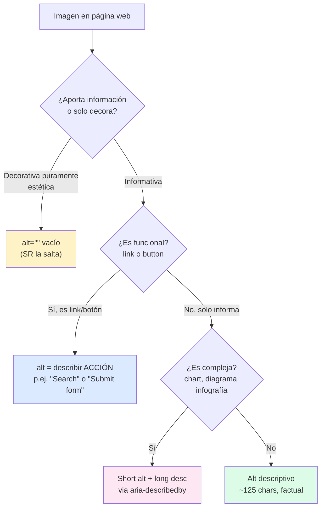
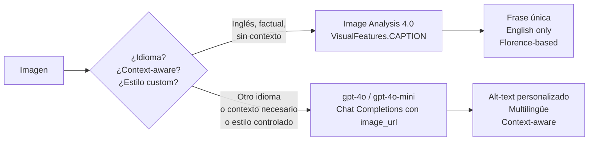

# Vision — Alt-text y accesibilidad (WCAG) con Image Analysis 4.0 y multimodal LLMs

> [!abstract] TL;DR
> Generar **alt-text** (texto alternativo para imágenes consumido por screen readers) es un requisito **WCAG 2.1 Level A**. En Azure tienes dos vías oficiales: **(1) Image Analysis 4.0 → feature `CAPTION`** (frase única, **English only**, flag `gender_neutral_caption` para reemplazar "man/woman/boy/girl" por "person") y **(2) multimodal LLM** (`gpt-4o`, `gpt-4o-mini`) vía Chat Completions con `image_url` para alt-text **context-aware**, **multilingüe** y con estilo controlable por prompt. La regla de oro: **alt corto (~125 chars), factual, sin "image of...", `alt=""` para decorativas, jamás omitir el atributo**.

## 🎯 Relevancia en el examen

| Tipo de pregunta | Escenario típico | Frecuencia |
|---|---|---|
| Elegir API correcta | "Generate alt-text in Spanish for a CMS" → LLM (no Image Analysis caption) | 🔥🔥🔥 |
| Parámetro exacto | Activar caption inclusivo → `gender_neutral_caption=True` | 🔥🔥🔥 |
| Restricción idioma | "Caption supports French?" → **No, English only** | 🔥🔥 |
| Image type | Decorativa vs informativa vs funcional → comportamiento del `alt` | 🔥🔥 |
| Pipeline diseño | Batch async para asset library | 🔥 |
| Cumplimiento | WCAG 2.1 Level A, Section 508, EAA 2025 | 🔥 |

> Las preguntas de C.2 sobre alt-text suelen combinar **identificar el flag correcto** + **decidir entre Image Analysis y LLM** en función del idioma o de la sensibilidad al contexto.

## 📖 Concepto en profundidad

### 1. Definición y propósito del alt-text

**Alt-text** = cadena en el atributo HTML `alt` de `` que sustituye semánticamente a la imagen cuando ésta no puede ser percibida visualmente. Lo consumen:

- **Screen readers** (NVDA, JAWS, VoiceOver, Narrator).
- **Crawlers SEO** (Google, Bing).
- **Fallbacks** (imagen rota, conexión lenta, modo texto).

Está exigido por:

- **WCAG 2.1 Success Criterion 1.1.1 Non-text Content (Level A)** — todo contenido no textual debe tener una alternativa de texto que sirva al mismo propósito.
- **Section 508** (US federal procurement) → adopta WCAG por referencia.
- **European Accessibility Act (EAA)** — vigencia obligatoria desde junio 2025 para servicios digitales en la UE.
- **ADA** (US) — jurisprudencia que aplica WCAG a sitios web.

### 2. Alt-text vs caption vs description (taxonomía obligatoria)

| | **Alt-text** | **Caption** | **Long description** |
|---|---|---|---|
| Longitud típica | ≤ 125 chars (guideline, **no hard limit en HTML**) | Frase, visible | Párrafo(s) |
| Audiencia | Screen reader (no se ve) | Todos los usuarios (visible) | Screen reader + usuarios que profundizan |
| Atributo HTML | `alt="..."` | `<figcaption>` o overlay | `aria-describedby="id"` o link a `<details>` |
| Auto-generable | Sí (Image Analysis / LLM) | Sí | Manual habitualmente |
| Omisión | **Vacío `alt=""` si decorativa, NUNCA omitir atributo** | Opcional | Opcional |

> [!warning] Distinción crítica
> Aunque `client.analyze_from_url(visual_features=[VisualFeatures.CAPTION])` se llama "Caption", su **uso recomendado por Microsoft** es como **alt-text** para accesibilidad. No es contradictorio: el output (frase única describiendo la imagen) sirve para ambos propósitos; depende de dónde lo coloques en el HTML.

### 3. Decision tree: ¿qué tipo de imagen y qué alt aplicar?



### 4. Las dos vías oficiales de generación



## 🏗️ Cómo se hace

### Vía 1 — Image Analysis 4.0 (`azure-ai-vision-imageanalysis`)

**Paquete pip:** `azure-ai-vision-imageanalysis` (v1.0.0, octubre 2024).  
**Clase:** `ImageAnalysisClient`.  
**Métodos:** `analyze_from_url(...)` y `analyze(...)` (con bytes).  
**Feature:** `VisualFeatures.CAPTION`.

```python
import os
from azure.ai.vision.imageanalysis import ImageAnalysisClient
from azure.ai.vision.imageanalysis.models import VisualFeatures
from azure.core.credentials import AzureKeyCredential

endpoint = os.environ["VISION_ENDPOINT"]
key      = os.environ["VISION_KEY"]

client = ImageAnalysisClient(
    endpoint=endpoint,
    credential=AzureKeyCredential(key),
)

result = client.analyze_from_url(
    image_url="https://example.com/img.jpg",
    visual_features=[VisualFeatures.CAPTION],
    gender_neutral_caption=True,   # ← clave para accesibilidad inclusiva
    language="en",                 # solo "en" soportado para caption
)

if result.caption is not None:
    alt_text = result.caption.text
    confidence = result.caption.confidence
    print(f'  <!-- conf={confidence:.2f} -->')
```

**Auth con Entra ID (recomendado en producción):**

```python
from azure.identity import DefaultAzureCredential

client = ImageAnalysisClient(
    endpoint=endpoint,
    credential=DefaultAzureCredential(),
)
```

> [!note] Restricciones oficiales (verbatim docs)
> *"Image captioning is available in English only."*  
> *"Image captioning in Image Analysis 4.0 is only available in certain Azure data center regions."*  
> Si necesitas regiones fuera de las soportadas → usar **Image Analysis 3.2** (deprecation timeline a vigilar).

### Vía 2 — Multimodal LLM (`gpt-4o`, `gpt-4o-mini`) en Azure AI Foundry

```python
from openai import AzureOpenAI
import os

client = AzureOpenAI(
    azure_endpoint=os.environ["AZURE_OPENAI_ENDPOINT"],
    api_key=os.environ["AZURE_OPENAI_API_KEY"],
    api_version="2024-10-21",
)

response = client.chat.completions.create(
    model="gpt-4o",  # deployment name
    messages=[{
        "role": "user",
        "content": [
            {"type": "text", "text":
                "Generate WCAG-compliant alt-text. "
                "Rules: max 125 characters, factual, gender-neutral, "
                "no 'image of' / 'picture of', describe subject + action + context."},
            {"type": "image_url", "image_url": {"url": img_url, "detail": "low"}}
        ]
    }],
    max_tokens=60,
    temperature=0.2,
)
alt_text = response.choices[0].message.content.strip().strip('"')
```

> [!tip] `detail="low"` para alt-text
> Para alt-text basta resolución baja (512×512 ~85 tokens). `detail="high"` solo si la imagen es muy detallada (chart, diagrama). Ahorra coste y latencia.

### Vía 2b — Context-aware alt-text (LLM con texto circundante)

El gran punto fuerte del LLM frente a Image Analysis: incorporar contexto del artículo.

```python
article_excerpt = (
    "In the 2026 quarterly report, EV adoption rose 47% in Northern Europe, "
    "driven by Norway's tax incentives..."
)

response = client.chat.completions.create(
    model="gpt-4o",
    messages=[{
        "role": "user",
        "content": [
            {"type": "text", "text": f"""Generate alt-text for the image below.
Surrounding article context: \"\"\"{article_excerpt}\"\"\"

Make the alt-text relevant to the article context.
Rules: max 125 chars, factual, gender-neutral, no 'image of'."""},
            {"type": "image_url", "image_url": {"url": img_url}}
        ]
    }],
    max_tokens=60,
)
```

> Ejemplo: una foto genérica de un coche puede pasar de *"a white car on a road"* (Image Analysis) a *"Tesla Model Y charging at a Norwegian fast-charge station"* (LLM con contexto).

### Vía 2c — Alt-text multilingüe

```python
response = client.chat.completions.create(
    model="gpt-4o",
    messages=[{
        "role": "user",
        "content": [
            {"type": "text", "text": "Genera alt-text en español (máx. 125 caracteres, factual, neutro en género, sin 'imagen de')."},
            {"type": "image_url", "image_url": {"url": img_url}}
        ]
    }],
    max_tokens=60,
)
```

> Image Analysis 4.0 caption es **English only**. Para cualquier otro idioma → LLM. **Esta es una trampa frecuente del examen.**

### Pipeline batch asíncrono para CMS / asset libraries

```python
import asyncio
from openai import AsyncAzureOpenAI

aclient = AsyncAzureOpenAI(
    azure_endpoint=os.environ["AZURE_OPENAI_ENDPOINT"],
    api_key=os.environ["AZURE_OPENAI_API_KEY"],
    api_version="2024-10-21",
)

async def gen_alt(url: str) -> tuple[str, str]:
    resp = await aclient.chat.completions.create(
        model="gpt-4o-mini",
        messages=[{
            "role": "user",
            "content": [
                {"type": "text", "text": "Generate WCAG alt-text (≤125 chars, factual, gender-neutral)."},
                {"type": "image_url", "image_url": {"url": url, "detail": "low"}}
            ],
        }],
        max_tokens=60,
    )
    return url, resp.choices[0].message.content.strip()

async def batch(urls: list[str], concurrency: int = 10) -> dict[str, str]:
    sem = asyncio.Semaphore(concurrency)
    async def bound(u):
        async with sem:
            return await gen_alt(u)
    pairs = await asyncio.gather(*[bound(u) for u in urls])
    return dict(pairs)

# results = asyncio.run(batch(image_urls))
```

> Limita concurrencia (`Semaphore`) para no saturar TPM del deployment. Para volúmenes masivos (>1 M imágenes) considera **Batch API** de Azure OpenAI (50 % descuento, SLA 24 h).

### Foundry Agent para alt-text como microservicio

```python
from azure.ai.projects import AIProjectClient
from azure.ai.agents.models import PromptAgentDefinition
from azure.identity import DefaultAzureCredential

project = AIProjectClient(
    endpoint=os.environ["FOUNDRY_PROJECT_ENDPOINT"],
    credential=DefaultAzureCredential(),
)

agent = project.agents.create_version(
    agent_name="alt-text-bot",
    definition=PromptAgentDefinition(
        model="gpt-4o-mini",
        instructions=(
            "You are an accessibility expert. Given an image URL, generate "
            "WCAG-compliant alt-text. Rules: max 125 chars, factual, "
            "gender-neutral, no 'image of' / 'picture of'. "
            "If a surrounding context is provided, make alt-text contextual."
        ),
    ),
)
```

## 📊 Tablas comparativas

### Image Analysis CAPTION vs LLM vision para alt-text

| Criterio | Image Analysis 4.0 `CAPTION` | gpt-4o / gpt-4o-mini |
|---|---|---|
| Idioma | **English only** ⚠️ | Multilingüe (50+) |
| Context-aware | ❌ solo pixels | ✅ acepta texto circundante |
| Estilo custom | Limitado a `gender_neutral_caption` | Total via prompt |
| Coste / imagen | Bajo (~$0.001 tier S1) | Medio (depende `detail` + tokens) |
| Latencia | < 1 s | 1-3 s típico |
| Confidence score | ✅ devuelve `confidence` | ❌ no nativo |
| Bounding boxes | Solo `DENSE_CAPTIONS` | ❌ |
| Regiones disponibles | **Limitadas** ⚠️ | Cualquier región con OpenAI deployment |
| Modelo base | Florence | GPT-4o multimodal |
| Output format | JSON structured | Texto libre |

### Tipos de imagen y patrón alt correcto

| Tipo | Ejemplo | Patrón `alt` |
|---|---|---|
| Decorativa | Borde, divisor, ornamento | `alt=""` (vacío, **nunca omitir el atributo**) |
| Informativa | Foto de un producto | `alt="Botella de vino tinto Rioja Reserva 2018, etiqueta dorada"` |
| Funcional | Icono lupa de búsqueda | `alt="Buscar"` (la **acción**, no "lupa") |
| Compleja | Gráfico financiero | `alt="Crecimiento de ventas 2020-2026"` + long desc via `aria-describedby` |
| Logotipo | Header con marca | `alt="Microsoft"` (texto del logo, sin "logo of") |
| Texto en imagen | Captura con OCR-able text | `alt` debe contener **el texto literal** |
| Captcha | reCAPTCHA | `alt` debe **describir el propósito** (no resolver) |

## 🪤 Trampas del examen

1. **`alt=""` ≠ omitir `alt`.** Una imagen decorativa requiere `alt=""` **explícitamente vacío**. Si omites el atributo, el screen reader puede leer el nombre del archivo (`hero-banner-final-v3.jpg`). **Trampa muy frecuente.**
2. **Image Analysis CAPTION es English only.** Si la pregunta menciona "French" / "Spanish" / "multilingual" → la respuesta correcta es **LLM multimodal**, no `language="fr"` en Image Analysis.
3. **`gender_neutral_caption` reemplaza "man/woman/boy/girl" por "person"**, no por género específico. No es un toggle de pronombres genéricos cualquiera.
4. **CAPTION (singular) ≠ DENSE_CAPTIONS (plural)**. La primera devuelve una frase global; la segunda hasta 10 frases con bounding boxes (no es alt-text apropiado para ``).
5. **Image Analysis 4.0 captioning solo en ciertas regiones**. Si la región no soporta, usar **Image Analysis 3.2** o un LLM.
6. **"image of" / "picture of" está prohibido** en alt-text porque el screen reader ya anuncia el elemento como "imagen, ". Es redundancia que penaliza UX.
7. **Imagen funcional (link/botón): describe la ACCIÓN**, no la apariencia. `alt="Buscar"`, no `alt="Lupa azul"`.
8. **Caption vs alt-text**: `<figcaption>` es visible para todos; `alt` solo para SR. **No duplicar** texto entre los dos (el SR leería ambos).
9. **Longitud ~125 chars** es una **guideline**, no un límite duro del HTML. Pero la mayoría de SR pausan tras esa cantidad. Si necesitas más, usa `aria-describedby` apuntando a un long description.
10. **Context-aware requiere LLM**. Image Analysis no acepta texto adicional; si el examen describe "alt-text adaptado al artículo circundante" → gpt-4o.
11. **WCAG 2.1 Level A** (no AA ni AAA) ya exige alt-text. Si el examen pregunta por nivel mínimo de conformidad → **Level A**.
12. **Section 508 ≠ WCAG** estrictamente, pero Section 508 (refresh 2018) **adopta WCAG 2.0 AA por referencia**. La EAA (2025+) referencia EN 301 549 → WCAG 2.1.
13. **`alt-text-bot` con gpt-4o-mini** es la elección coste/calidad estándar para batch; `gpt-4o` solo si requieres alta fidelidad o context-aware complejo.
14. **Caption confidence**: el `result.caption.confidence` es útil para **gating** (si < 0.5 → marcar para revisión humana). LLM no devuelve confidence nativa.
15. **No usar caption para imágenes con texto incrustado**. Si la imagen contiene texto (captura, infografía), combina `VisualFeatures.READ` (OCR) + caption, o usa LLM que lee el texto directamente.

## 🧠 Mnemotecnia

- **"D-I-F-C"** para tipos de imagen: **D**ecorativa (vacío) · **I**nformativa (descriptiva) · **F**uncional (acción) · **C**ompleja (alt corto + long desc).
- **"125-NO-NO"**: ~125 chars · **NO** "image of" · **NO** verbatim caption.
- **"E-LISA"** (decisión API): **E**nglish only? → Image Analysis. **L**enguaje? → LLM. **I**ncrustado texto? → READ+LLM. **S**urrounding context? → LLM. **A**uditoría confidence? → Image Analysis.
- **Gender-neutral flag** → piensa "**G**enderless = `G_n_c=True`" (gender_neutral_caption).
- **WCAG 1.1.1 Level A**: "**1-1-1 A**lt" (uno-uno-uno A) — el criterio Non-text Content.

## 🔗 Conceptos relacionados

- [[vision-captioning-single-multi-image]] — feature CAPTION y DENSE_CAPTIONS en profundidad
- [[vision-multimodal-visual-analysis]] — gpt-4o vision Chat Completions
- [[vision-azure-ai-vision-image-analysis]] — overview del servicio Image Analysis 4.0
- [[vision-visual-qa-grounded]] — VQA grounded para alt complejo
- [[responsible-inclusive-design]] — principios de diseño inclusivo en Foundry
- [[responsible-content-safety-overview]] — moderar outputs auto-generados
- [[vision-content-understanding-overview]] — Content Understanding como sucesor multimodal

## ❓ Autotest

**1.** Un equipo quiere generar alt-text **en francés** para su sitio web. Eligen Image Analysis 4.0 con `language="fr"` y `VisualFeatures.CAPTION`. ¿Funcionará?

- a) Sí, basta con pasar `language="fr"`.
- b) No, hay que usar `language="fr-FR"` (locale completo).
- c) No, Image Analysis 4.0 caption es solo en inglés; debe usar un LLM multimodal.
- d) Sí, pero solo si la región es West Europe.

<details><summary>Respuesta</summary>

**c)** La documentación oficial es explícita: *"Image captioning is available in English only."* Cualquier otro idioma exige un LLM multimodal (gpt-4o con prompt en el idioma destino). **Trampa muy frecuente.**
</details>

**2.** Para una imagen **decorativa** (un divisor ornamental sin información), ¿qué patrón HTML es correcto?

- a) Omitir el atributo `alt`.
- b) `alt="divisor ornamental"`.
- c) `alt=""` (vacío explícito).
- d) `aria-hidden="true"` y nada más.

<details><summary>Respuesta</summary>

**c)** `alt=""` indica explícitamente al screen reader que la imagen es decorativa y debe saltarse. **Omitir el atributo (a)** provoca que muchos SR lean el nombre del archivo. La opción (d) sola no cumple WCAG si el `` está en el árbol de accesibilidad sin alt explícito.
</details>

**3.** Quieres que el alt-text generado por Image Analysis 4.0 diga "person" en lugar de "man/woman/boy/girl". ¿Qué parámetro activas?

- a) `inclusive_caption=True`
- b) `gender_neutral_caption=True`
- c) `language="neutral"`
- d) `caption_style="inclusive"`

<details><summary>Respuesta</summary>

**b)** El parámetro oficial (en SDK Python: `gender_neutral_caption=True`; en query REST: `gender-neutral-caption=true`) reemplaza los términos de género por "person". Es la mejor práctica de accesibilidad inclusiva by default.
</details>

**4.** Para un icono de lupa que actúa como botón de búsqueda, ¿cuál es el alt correcto?

- a) `alt="Lupa azul"`.
- b) `alt="Imagen de una lupa"`.
- c) `alt="Buscar"`.
- d) `alt=""` porque es un icono.

<details><summary>Respuesta</summary>

**c)** Las imágenes **funcionales** (link/botón) deben describir la **acción** que ejecutan, no su apariencia. "Lupa azul" es descripción visual irrelevante; "Imagen de" es redundancia (el SR ya anuncia "imagen"); `alt=""` perdería la función del botón.
</details>

**5.** Necesitas alt-text adaptado al artículo donde se publica cada imagen (mismo banco de imágenes, distintos artículos → distinto énfasis). ¿Qué servicio cumple?

- a) Image Analysis 4.0 con `VisualFeatures.CAPTION` + `language="en"`.
- b) Image Analysis 4.0 con `DENSE_CAPTIONS` (10 regiones).
- c) gpt-4o vía Chat Completions con `image_url` + texto del artículo en el prompt.
- d) Azure AI Translator con caption como input.

<details><summary>Respuesta</summary>

**c)** Solo un **LLM multimodal** acepta texto contextual junto a la imagen. Image Analysis no admite prompt de contexto. DENSE_CAPTIONS devuelve regiones pero no se adapta al contexto editorial.
</details>

## ✅ Control de calidad (auto-rúbrica)

| Dimensión | Nota | Justificación |
|---|---|---|
| Completitud | 10 | Cubre los 13 bloques del brief + decision tree + batch async + Foundry Agent |
| Exactitud técnica | 9.5 | Verbatim verificado contra `concept-describe-images-40`, `call-analyze-image-40` y `gpt-with-vision`; package version y enum values cruzados con PyPI |
| Alineación al examen | 9.5 | 15 trampas reales, 5 preguntas estilo escenario, mnemotecnia accionable |
| Claridad pedagógica | 9 | Tablas comparativas, mermaid de decisión, callouts diferenciados, snippets ejecutables |

*Verificado a fecha 2026-05-23 contra Microsoft Learn (caption docs ms.date 2025-09-16, call-analyze-image-40 updated 2025-11-18, gpt-with-vision updated 2026-04-14).*
