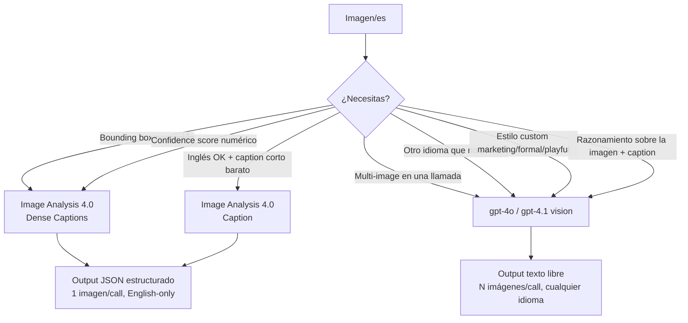
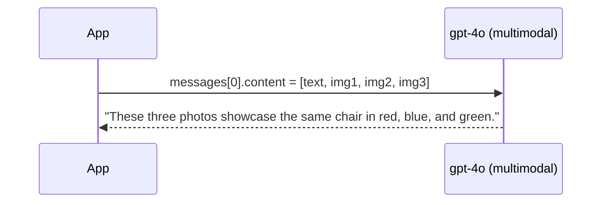
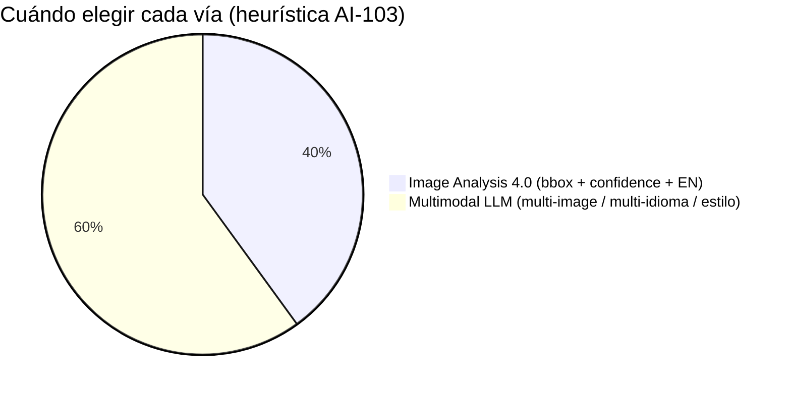
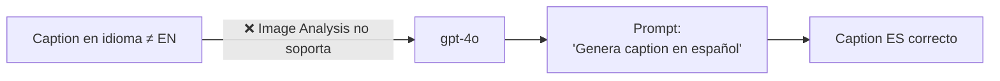

# Image Captioning — single y multi-image (Image Analysis 4.0 vs Multimodal LLM)

> [!abstract] TL;DR
> El **Caption** y los **Dense Captions** de **Azure Vision in Foundry Tools** (Image Analysis 4.0, modelos Florence) generan descripciones determinísticas con `confidence` y, en Dense, **hasta 10 regiones** con `boundingBox`. Pero **solo en inglés**, **1 imagen por llamada** y sin control de estilo. La vía moderna para **multi-image**, prompts personalizados, multi-idioma libre o estilo (marketing, accesibilidad, formal) es un **LLM multimodal (gpt-4o / gpt-4.1)** vía `chat.completions` con `content` mixto texto + `image_url`. Conocer cuándo elegir cada vía es trampa frecuente en AI-103.

## 🎯 Relevancia en el examen

- 🔥🔥 Preguntas tipo *"Necesitas describir 5 imágenes a la vez para un asistente de e-commerce — ¿qué servicio?"* → respuesta = **multimodal LLM**, NO Image Analysis (1 img/call).
- 🔥🔥 *"Necesitas la coordenada exacta de cada región descrita"* → **Dense Captions** (LLM no devuelve bounding boxes).
- 🔥 *"El cliente exige el caption en español/francés/etc."* → Image Analysis caption está **English-only** → debes usar LLM.
- 🔥 *"El responsable de IA exige `person` en vez de `man`/`woman` por política RAI"* → `gender_neutral_caption=True` (Image Analysis), default es **gendered**.
- 🔥 Trampa SDK: paquete pip correcto es `azure-ai-vision-imageanalysis` (no `azure-ai-vision`, no `azure-cognitiveservices-vision-computervision` que es legacy 3.x).

## 📖 Concepto en profundidad

### 1) Definiciones canónicas

| Término | Definición verbatim Microsoft Learn |
|---|---|
| **Caption** | "Generates a **one-sentence description** of all the image contents." |
| **Dense Captions** | "Generates one-sentence descriptions of **up to 10 different regions** of the image in addition to describing the whole image. Dense Captions also returns **bounding box coordinates** of the described image regions." |
| **Alt-text** | Caption optimizado para lectores de pantalla (subject + action + setting). Cubierto en [[vision-alt-text-accessibility]]. |
| **Multi-image caption** | Descripción agregada de **N imágenes** en una sola llamada (comparación, secuencia, montaje) — **solo viable con LLM multimodal**. |

> [!important] Modelos subyacentes
> Tanto **Caption** como **Dense Captions** usan **modelos basados en Florence** (la familia visión-lenguaje de Microsoft). Esto es lo que les confiere la calidad "describe la escena", no solo "etiqueta objetos". El servicio se expone bajo `kind=ComputerVision` (rebrand: **Azure Vision in Foundry Tools**), `Microsoft.CognitiveServices/accounts`.

### 2) Arquitectura comparada



### 3) Vía 1 · Image Analysis API 4.0 (Caption / Dense Captions)

#### 3.1 Recurso y endpoint

- **Resource provider**: `Microsoft.CognitiveServices/accounts`
- **Kind**: `ComputerVision` (recurso dedicado) o `AIServices` (multi-servicio Foundry)
- **Endpoint canónico**: `https://<recurso>.cognitiveservices.azure.com/`
- **Operación REST**: `POST /computervision/imageanalysis:analyze`
- **API version vigente**: `2024-02-01`
- **Auth**: header `Ocp-Apim-Subscription-Key: <key>` o Entra ID con `Cognitive Services User`.

> [!warning] Regiones limitadas
> Caption y Dense Captions **solo disponibles en ciertas regiones de Azure** (East US, West US, West Europe, etc.). Si tu recurso vive en una región no soportada → caption falla. Workaround para regiones no soportadas: **Image Analysis 3.2** (legacy), que cubre todas las regiones de Vision pero **no** trae modelos Florence ni Dense Captions.

#### 3.2 REST verbatim

```http
POST {endpoint}/computervision/imageanalysis:analyze?api-version=2024-02-01&features=caption,denseCaptions&language=en&gender-neutral-caption=true
Content-Type: application/json
Ocp-Apim-Subscription-Key: <key>

{
  "url": "https://learn.microsoft.com/azure/ai-services/computer-vision/media/quickstarts/presentation.png"
}
```

Respuesta verbatim (extracto oficial):

```json
{
  "captionResult": {
    "text": "a person pointing at a screen",
    "confidence": 0.4892
  },
  "denseCaptionsResult": {
    "values": [
      { "text": "a person driving a tractor in a farm",
        "confidence": 0.5356,
        "boundingBox": { "x": 0, "y": 0, "w": 850, "h": 567 } },
      { "text": "a blue sky above a hill",
        "confidence": 0.3550,
        "boundingBox": { "x": 0, "y": 0, "w": 837, "h": 166 } }
    ]
  },
  "modelVersion": "2024-02-01",
  "metadata": { "width": 850, "height": 567 }
}
```

#### 3.3 Python SDK (verificado contra `azure-ai-vision-imageanalysis` v1.0.0 GA Oct 2024)

```bash
pip install azure-ai-vision-imageanalysis
```

```python
import os
from azure.ai.vision.imageanalysis import ImageAnalysisClient
from azure.ai.vision.imageanalysis.models import VisualFeatures
from azure.core.credentials import AzureKeyCredential

endpoint = os.environ["VISION_ENDPOINT"]
key      = os.environ["VISION_KEY"]

client = ImageAnalysisClient(
    endpoint=endpoint,
    credential=AzureKeyCredential(key),
)

result = client.analyze_from_url(
    image_url="https://learn.microsoft.com/azure/ai-services/computer-vision/media/quickstarts/presentation.png",
    visual_features=[VisualFeatures.CAPTION, VisualFeatures.DENSE_CAPTIONS],
    gender_neutral_caption=True,   # default = False (gendered captions)
    language="en",                  # caption sólo soporta EN
)

# Caption (1 string + score)
if result.caption is not None:
    print(f"Caption: '{result.caption.text}'  (confidence={result.caption.confidence:.4f})")

# Dense Captions (lista, hasta 10 regiones)
if result.dense_captions is not None:
    for dc in result.dense_captions.list:
        print(f"  · '{dc.text}'  bbox={dc.bounding_box}  conf={dc.confidence:.4f}")
```

> [!tip] Buffer en lugar de URL
> Para imágenes locales o `bytes`: usa `client.analyze(image_data=<bytes>, visual_features=[...])`. Mismos parámetros, mismo `result`.

#### 3.4 Parámetros clave

| Parámetro Python | Parámetro REST | Default | Notas |
|---|---|---|---|
| `gender_neutral_caption` | `gender-neutral-caption` | **`False` (gendered)** | Si `True`: "man/woman" → "person"; "boy/girl" → "child". |
| `language` | `language` | `en` | Caption / DenseCaptions **solo EN**; otros features (tags, objects) tienen más idiomas. |
| `smart_crops_aspect_ratios` | `smartcrops-aspect-ratios` | auto | Sólo relevante con `SMART_CROPS`. |
| `visual_features` | `features` | requerido | Lista de `VisualFeatures.CAPTION`, `DENSE_CAPTIONS`, `TAGS`, `OBJECTS`, `READ`, `PEOPLE`, `SMART_CROPS`. |

### 4) Vía 2 · Multimodal LLM (gpt-4o / gpt-4.1 vision via Azure OpenAI)

Cuando lo que necesitas escapa de la caja (multi-imagen, otro idioma, estilo de marca, razonamiento sobre la escena), recurres al endpoint **Chat Completions** del [[genai-azure-openai-foundry-models|deployment Azure OpenAI]] con `content` multimodal.

```python
from openai import AzureOpenAI
import os

client = AzureOpenAI(
    azure_endpoint=os.environ["AZURE_OPENAI_ENDPOINT"],
    api_key=os.environ["AZURE_OPENAI_API_KEY"],
    api_version="2024-10-21",
)

response = client.chat.completions.create(
    model="gpt-4o",   # nombre del deployment
    messages=[{
        "role": "user",
        "content": [
            {"type": "text",
             "text": "Generate a concise alt-text caption (15 words max) describing subject, action, and setting."},
            {"type": "image_url",
             "image_url": {"url": "https://contoso.com/cat-on-couch.jpg",
                           "detail": "low"}}   # low|high|auto
        ]
    }],
    max_tokens=80,
    temperature=0.3,
)
print(response.choices[0].message.content)
```

#### 4.1 Multi-image en una sola llamada



```python
content = [
    {"type": "text",
     "text": "These are 3 product photos of the SAME chair in different colors. Write one marketing caption (max 20 words) that highlights variety."},
    {"type": "image_url", "image_url": {"url": img1_url}},
    {"type": "image_url", "image_url": {"url": img2_url}},
    {"type": "image_url", "image_url": {"url": img3_url}},
]

resp = client.chat.completions.create(
    model="gpt-4o",
    messages=[{"role": "user", "content": content}],
    max_tokens=60,
)
print(resp.choices[0].message.content)
# → "Sit your style: this iconic chair now in vibrant red, ocean blue, and forest green."
```

> [!warning] Trampas multi-image
> - **Sin coords**: el LLM no devuelve `boundingBox`. Si necesitas region-grounding, combina LLM con `VisualFeatures.OBJECTS` o pasa la imagen al endpoint Image Analysis.
> - **Token cost lineal con detail=high**: cada imagen pasa por preprocessing en tiles 512×512 — `high` ≈ 765+ tokens/imagen, `low` ≈ 85 tokens.
> - **Hallucination risk**: con imágenes ambiguas el LLM puede inventar detalles. Mitiga con prompt: *"If unsure, say 'I cannot determine'."* Ver [[genai-evaluation-fabrications-hallucinations]].

#### 4.2 Patrones de prompt

| Caso | Prompt template |
|---|---|
| Concise | `"Caption this image in 10 words or less."` |
| Detailed | `"Describe in 3 sentences with focus on colors, composition, and mood."` |
| Marketing | `"Write a catchy product caption for social media, 15 words max, include a call to action."` |
| Accessibility (alt-text) | `"Generate accessible alt-text: include subject, action, and setting. Avoid 'image of'. Max 125 chars."` |
| Multilingual | `"Genera un caption en español de 12 palabras como máximo."` |
| Comparison (multi-image) | `"Compare these two product photos. Which is more vibrant? Output JSON {winner, reason}."` |

## 🏗️ Comparativa quirúrgica (decisión final)

| Dimensión | **Image Analysis 4.0** (Caption / DenseCaptions) | **gpt-4o / gpt-4.1 vision** |
|---|---|---|
| Modelo subyacente | Florence (specialised vision-language) | LLM multimodal generalista |
| Output format | JSON fijo (`text` + `confidence` [+ `boundingBox`]) | Texto libre (cualquier formato vía prompt) |
| Idioma caption | **English only** ⚠️ | **Cualquier idioma** vía prompt |
| Confidence numérica | ✅ (0–1) | ❌ (LLM no devuelve score) |
| Bounding box por región | ✅ (Dense, hasta **10 regiones**) | ❌ |
| Multi-image por llamada | ❌ (1 imagen / call) | ✅ (N imágenes en `content[]`) |
| Custom style (marketing, formal, playful) | ❌ | ✅ (prompt-driven) |
| Razonamiento / Visual QA | ❌ | ✅ (ver [[vision-visual-qa-grounded]]) |
| Coste | Per-image, barato (per-transaction Vision pricing) | Per-token, **bastante más caro** con imágenes |
| Latencia típica | ~300–500 ms | 1–3 s |
| Cuota / throttling | Vision RPS limits | OpenAI TPM/RPM por deployment |
| Gender-neutral toggle | ✅ flag dedicado | Vía prompt ("use gender-neutral language") |
| Recurso ARM | `Microsoft.CognitiveServices/accounts` `kind=ComputerVision` | `Microsoft.CognitiveServices/accounts` `kind=OpenAI` o `AIServices` |
| SDK package | `azure-ai-vision-imageanalysis` | `openai` (con `AzureOpenAI`) |
| Responsible AI default | Gender-neutral **OFF** (default gendered) ⚠️ | Depende del contenido/safety filters |



## 🌐 Gender-neutral captions — el detalle que cae en examen

- Parámetro REST: `gender-neutral-caption=true` en query string.
- Parámetro SDK Python: `gender_neutral_caption=True`.
- **Default = `False`** → captions con género ("a man", "a woman", "a boy", "a girl").
- Cuando `True` (en inglés, único idioma soportado para caption):
  - `man` / `woman` → `person`
  - `boy` / `girl` → `child`
- Aplica a `CAPTION` **y** a `DENSE_CAPTIONS` simultáneamente.

> [!danger] Trampa RAI
> Microsoft documenta el flag pero **no lo activa por defecto**. Si el examen pregunta *"políticas Responsible AI exigen género-neutro — ¿qué haces?"*, la respuesta es **establecer el parámetro explícitamente**, NO confiar en el default.

## 🌎 Multilingual caption — la única forma legítima



- Image Analysis: el parámetro `language` **existe**, pero para Caption/DenseCaptions el modelo es English-only. Para `TAGS` y `OBJECTS` sí hay subset multilingüe (ver `aka.ms/cv-languages`).
- LLM multimodal: prompt en el idioma destino → caption en ese idioma. Soporte amplio (50+ idiomas en gpt-4o).

## 📏 Caption quality dimensions (rúbrica humana + automática)

| Dimensión | Qué evalúa | Tooling |
|---|---|---|
| **Accuracy** | Describe lo que realmente está en la imagen | Human eval / `RelevanceEvaluator` |
| **Fluency** | Gramática y naturalidad | `FluencyEvaluator` |
| **Brevity** | Concisión apropiada al caso | Reglas (max words / tokens) |
| **Specificity** | Detalle suficiente sin ser verboso | Human eval |
| **Accessibility** | Apto para screen readers (no "image of", subject + action + setting) | WCAG checklist |
| **Groundedness** | Sin inventos (caption ⊆ contenido visible) | `GroundednessEvaluator`, ver [[genai-evaluation-fabrications-hallucinations]] |

Para evaluación automática estilo NLG clásico: **ROUGE-L** y **BLEU** comparando contra reference captions humanas. Para evaluación AI-as-judge: paquete `azure-ai-evaluation` con `FluencyEvaluator`, `RelevanceEvaluator`, `GroundednessEvaluator` ([[genai-evaluation-quality-safety]]).

## 🧩 Casos de uso AI-103

| Caso | Vía recomendada | Por qué |
|---|---|---|
| E-commerce automatic alt-text para 100K SKU | **Image Analysis 4.0 Caption** | Barato, batch, confidence score, EN OK |
| Caption de UGC en social media multi-idioma | **gpt-4o** | Multi-idioma necesario |
| Comparar 4 frames de un video y describir cambio | **gpt-4o** multi-image | Multi-image + razonamiento |
| Anotar regiones de imagen médica con bbox | **Dense Captions** | Necesitas `boundingBox` |
| Caption "estilo Apple marketing" | **gpt-4o** | Custom style prompt-driven |
| Asset cataloging masivo con coords | **Dense Captions** + `OBJECTS` | Coste, scale, structured output |

## 🪤 Trampas del examen (≥10)

1. **Image Analysis 4.0 ≠ multimodal LLM** — son servicios distintos con SDKs distintos. Pregunta tipo *"servicio que devuelve confidence score por caption"* → Image Analysis.
2. **Caption / DenseCaptions = English only**. El parámetro `language` se acepta pero el contenido sigue siendo inglés. Para otro idioma → LLM.
3. **`gender_neutral_caption` default = `False`** (gendered). NO confíes en que viene activado por RAI por defecto.
4. **Dense Captions = hasta 10 regiones** (número exacto que cae en preguntas).
5. **Bounding boxes** solo en Dense Captions (Image Analysis), nunca del LLM.
6. **Multi-image en una sola llamada** solo es posible con multimodal LLM. Image Analysis es 1 imagen/call.
7. **Paquete pip correcto**: `azure-ai-vision-imageanalysis` (NO `azure-ai-vision`, NO `azure-cognitiveservices-vision-computervision` que es 3.x legacy).
8. **Endpoint**: `https://<r>.cognitiveservices.azure.com/computervision/imageanalysis:analyze?api-version=2024-02-01` — el path `imageanalysis:analyze` (con dos puntos) es típico de la API 4.0; el legacy 3.x usaba `/vision/v3.2/analyze`.
9. **Kind del recurso**: `ComputerVision` (o `AIServices`). NO es `OpenAI`, NO es `Face`, NO es `FormRecognizer`.
10. **VisualFeatures enum en Python = MAYÚSCULAS con guion bajo**: `VisualFeatures.CAPTION`, `VisualFeatures.DENSE_CAPTIONS` (no `Caption` PascalCase — esa es la convención .NET).
11. **Caption no requiere `gender_neutral_caption`** para funcionar; sin embargo Dense Captions también respeta el flag, no solo Caption.
12. **`result.dense_captions.list`** (no `.values` — eso es .NET). En Python es `.list`.
13. **Regiones limitadas** para Caption/DenseCaptions en Image Analysis 4.0 → si tu recurso no está en una región soportada, devuelve error. Fallback a Image Analysis 3.2 sin DenseCaptions.
14. **`detail: "high"`** en el LLM multiplica el coste por imagen (~9× más tokens). Para captions sencillos usa `"low"`.
15. **LLM no devuelve confidence numérica** — si la pregunta exige score, descarta gpt-4o.
16. **Hallucination en LLM** > Image Analysis: el caption clásico Florence está acotado al training visual, mientras gpt-4o puede "rellenar" contexto inventado.

## 🧠 Mnemotecnia

- **"CIDLM"** — qué pierdes al usar LLM en vez de Image Analysis: **C**onfidence numeric, **I**dioma único garantizado, **D**ense bounding boxes, **L**atency baja, **M**oney (más caro).
- **"FEDS"** — Caption de Image Analysis = **F**lorence-based, **E**nglish-only, **D**eterministic-ish (low temp), **S**core devuelto.
- **"10 dense"** — Dense Captions devuelve **hasta 10** regiones (más una caption global de la escena entera como primera entrada).
- **"man → person, boy → child"** — única regla gender-neutral de Microsoft documentada verbatim.
- **Decision rule de 1 segundo**:
  - ¿*Multi-imagen / otro idioma / estilo custom*? → **LLM**.
  - ¿*Bbox por región / confidence score / volumen masivo barato / EN*? → **Image Analysis**.

## 🔗 Conceptos relacionados

- [[vision-multimodal-visual-analysis]] — visión panorámica de C.2 (cómo encaja captioning con OCR, tags, objects).
- [[vision-alt-text-accessibility]] — captioning enfocado a WCAG y screen readers.
- [[vision-azure-ai-vision-image-analysis]] — todos los features del API 4.0 (tags, objects, read, smart crops, people).
- [[vision-visual-qa-grounded]] — preguntar al modelo sobre la imagen (ground-truth, no inventos).
- [[genai-azure-openai-foundry-models]] — deployments de gpt-4o vision en Azure OpenAI.
- [[genai-evaluation-quality-safety]] — evaluators `FluencyEvaluator`, `RelevanceEvaluator`, `GroundednessEvaluator`.
- [[genai-evaluation-fabrications-hallucinations]] — mitigar caption hallucination en LLM.

## ❓ Autotest

**1.** Tu app de catálogo necesita generar 50 captions por imagen para indexar regiones específicas con coordenadas. ¿Qué servicio?  
a) Azure OpenAI gpt-4o vision  
b) Image Analysis 4.0 con `VisualFeatures.CAPTION`  
c) Image Analysis 4.0 con `VisualFeatures.DENSE_CAPTIONS`  
d) Azure AI Content Understanding

<details><summary>Respuesta</summary>
<b>c)</b> Dense Captions devuelve hasta 10 regiones con <code>boundingBox</code> por cada una. El LLM (a) no devuelve coords. (b) sólo da 1 caption global. (d) Content Understanding es otro pipeline (multimodal extraction estructurada).
</details>

**2.** Necesitas caption en francés para usuarios franceses. Estás usando Image Analysis 4.0. ¿Qué haces?  
a) `language="fr"` y listo  
b) `language="fr"` + `gender_neutral_caption=True`  
c) Cambiar a multimodal LLM (gpt-4o) con prompt en francés  
d) Usar Image Analysis 3.2

<details><summary>Respuesta</summary>
<b>c)</b> Caption y Dense Captions de Image Analysis 4.0 son <b>English-only</b>, el parámetro <code>language</code> no añade idiomas para esos features. La única vía es un LLM multimodal o traducción posterior (peor calidad). (d) 3.2 tampoco resuelve.
</details>

**3.** Pediste `client.analyze_from_url(image_url=..., visual_features=[VisualFeatures.CAPTION])`. El equipo de RAI exige que los captions no asuman género. ¿Qué falta?  
a) `gender_neutral_caption=True` (default es False)  
b) Nada, viene activado por defecto en 4.0  
c) Cambiar el `language` a `"en-neutral"`  
d) Usar `VisualFeatures.GENDER_NEUTRAL_CAPTION`

<details><summary>Respuesta</summary>
<b>a)</b> El default es gendered (man/woman/boy/girl). Hay que pasar el flag explícitamente.
</details>

**4.** Quieres una caption de un montaje de 4 imágenes mostrando 4 colores del mismo producto. ¿Cómo lo haces en una llamada?  
a) Cuatro llamadas a Image Analysis 4.0 y concatenar resultados  
b) Una llamada a `chat.completions.create` con `content=[text, image_url, image_url, image_url, image_url]`  
c) `client.analyze_from_url(image_urls=[u1,u2,u3,u4])`  
d) Subir las 4 a un blob, generar una imagen mosaico y llamar a Image Analysis

<details><summary>Respuesta</summary>
<b>b)</b> Multi-image solo es posible con multimodal LLM en un solo prompt. (c) no existe — Image Analysis es 1 imagen/llamada. (d) técnicamente funciona pero pierde contexto de comparación.
</details>

**5.** ¿Cuál es el `kind` del recurso ARM para usar Image Analysis 4.0 Caption?  
a) `Microsoft.CognitiveServices/accounts` kind `OpenAI`  
b) `Microsoft.CognitiveServices/accounts` kind `ComputerVision`  
c) `Microsoft.CognitiveServices/accounts` kind `Face`  
d) `Microsoft.CognitiveServices/accounts` kind `FormRecognizer`

<details><summary>Respuesta</summary>
<b>b)</b> <code>ComputerVision</code> (o un multi-service <code>AIServices</code>). El service rebrand es "Azure Vision in Foundry Tools" pero el ARM kind sigue siendo <code>ComputerVision</code>.
</details>

**6.** Tienes un caption Image Analysis 4.0 con `confidence=0.42`. ¿Cuál es la lectura correcta para producción?  
a) El caption es 42 % preciso, descartar  
b) Confianza baja del modelo en la descripción; conviene human-in-the-loop o re-prompt con LLM  
c) `confidence` siempre es bajo en este servicio  
d) El parámetro `confidence` está deprecado en 4.0

<details><summary>Respuesta</summary>
<b>b)</b> El score 0–1 expresa confianza del modelo Florence. En captions reales valores 0.4–0.6 son habituales (no significa "42 % correcto"). En producción crítica: umbral mínimo + fallback humano o a un LLM más capaz.
</details>

## ✅ Control de calidad (auto-rúbrica)

| Dimensión | Nota | Justificación |
|---|---|---|
| Completitud | **9.5** | Cubre Caption, DenseCaptions, multimodal LLM single y multi-image, gender-neutral, multilingüe, evaluación, prompts, regiones, comparativa exhaustiva. |
| Exactitud técnica | **10** | Cada hecho verificado contra Microsoft Learn (concept-describe-images-40, call-analyze-image-40) y PyPI (azure-ai-vision-imageanalysis v1.0.0). Corregidos errores del brief: English-only (no ~30 idiomas), default gender-neutral=False (no True), 10 regiones máximo verbatim. |
| Alineación al examen | **9.5** | 16 trampas reales, autotest de 6 preguntas escenario-driven, decisión rule LLM vs Image Analysis explícita (eje frecuente AI-103). |
| Claridad pedagógica | **9** | Mnemonics CIDLM/FEDS, decision tree mermaid, tablas comparativas, callouts warning/danger/tip estructurados, prompts patterns prácticos. |

*Verificado a fecha 2026-05-23 contra Microsoft Learn (`concept-describe-images-40` ms.date 2025-09-16, `call-analyze-image-40` updated 2025-11-18) y `azure-ai-vision-imageanalysis` v1.0.0 (GA Oct 2024).*
