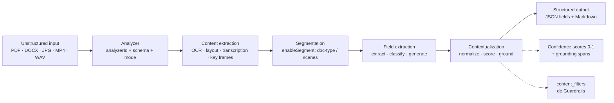
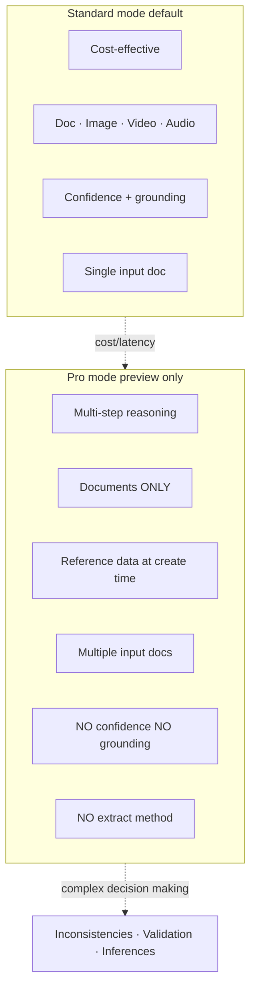
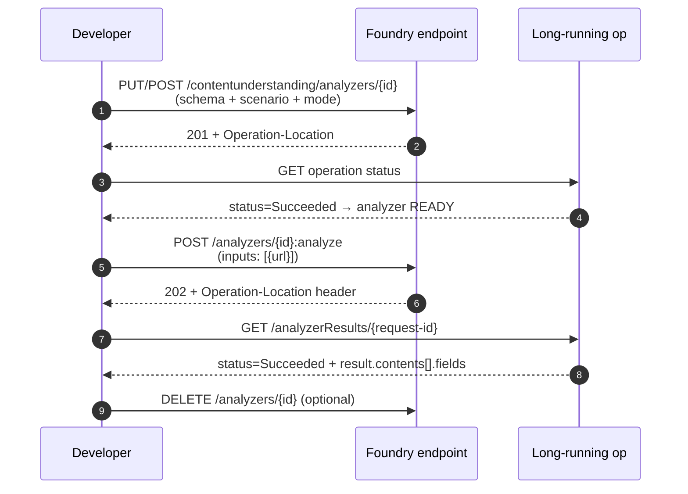
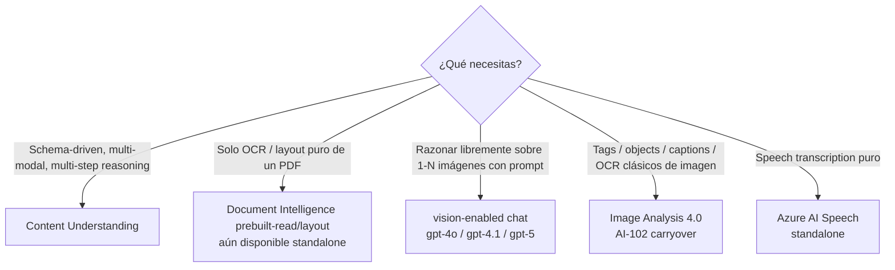

# Content Understanding — Overview (Foundry Tool, GA 2025-11-01)

> [!abstract] TL;DR
> **Azure Content Understanding in Foundry Tools** es el servicio multimodal generativo del Foundry resource (GA con `api-version=2025-11-01`) que convierte contenido no estructurado — **documents, images, video, audio** — en **JSON estructurado o Markdown** definido por un **schema** de fields. La unidad central es un **analyzer**: una "recipe" persistente con `analyzerId` que combina (1) modalidad de input, (2) modo (`standard` o `pro`), (3) **field schema** con métodos `extract` / `classify` / `generate`, y (4) deployments de modelos (gpt-4.1-mini, gpt-4.1, gpt-5.2, text-embedding-3-large). Es el **sucesor de Azure AI Document Intelligence** dentro de AI-103, vive bajo `Microsoft.CognitiveServices/accounts kind=AIServices` (Foundry resource — no recurso separado) y se consume vía REST `POST /contentunderstanding/analyzers/{id}:analyze` o el SDK Python `azure-ai-contentunderstanding` (clase `ContentUnderstandingClient`).

## 🎯 Relevancia en el examen

- **Frecuencia 🔥🔥🔥** — pregunta casi garantizada en C.2 (sub-punto verbatim del temario: *"Use Azure AI Content Understanding to extract structured information from content"*).
- **Tipos de pregunta esperados**:
  - "Choose the right service": cuándo Content Understanding vs Document Intelligence vs Image Analysis vs vision-enabled chat (`gpt-4o`).
  - "Identify the analyzer kind": prebuilt (`prebuilt-invoice`, `prebuilt-documentSearch`, `prebuilt-imageSearch`, ...) vs custom.
  - "Pick the field method": `extract` vs `generate` vs `classify` (trap: `extract` **solo** documentos).
  - "Standard vs Pro": Pro **solo documentos**, sin confidence/grounding, hace multi-step reasoning con reference data.
  - "Identify the limit": 300 pp standard / 150 pp Pro; 200 MB / 100 MB; audio 4 h max; video 2 h por URL / 30 min binary.
  - "Auth + RBAC": Cognitive Services User para llamar la API.
- **Carryover AI-102**: parcial — quien venía de Document Intelligence (forms recognizer) debe migrar; CU absorbe ese sub-temario. Marca explícitamente las diferencias.

## 📖 Concepto en profundidad

### 1. Identidad del servicio

| Aspecto | Valor verificado |
|---|---|
| Nombre oficial | **Azure Content Understanding in Foundry Tools** |
| Resource provider | `Microsoft.CognitiveServices` |
| Resource type | `accounts` |
| Kind | `AIServices` (Foundry resource) |
| Endpoint host | `https://<name>.services.ai.azure.com/` |
| GA api-version | `2025-11-01` |
| Preview retiradas | `2024-12-01-preview` y `2025-05-01-preview` se retiran el **2026-07-15** |
| Python SDK package | `azure-ai-contentunderstanding` (≥ 1.0.0 → API `2025-11-01`) |
| Cliente principal | `ContentUnderstandingClient` (sync) / `azure.ai.contentunderstanding.aio.ContentUnderstandingClient` (async) |
| Studio companion | **Content Understanding Studio** (UX optimizada para etiquetado/mejora de analyzers) |

> [!warning] No es un recurso aparte
> Content Understanding **no** se aprovisiona como un recurso suyo; es una **Foundry Tool** dentro de un **Microsoft Foundry resource** (`kind=AIServices`). Si te preguntan "qué resource creas en Azure Portal", la respuesta es **Microsoft Foundry resource**.

### 2. Arquitectura conceptual — pipeline



**Lectura clave**: el analyzer **no es** un endpoint efímero — es un **recurso persistente** del proyecto Foundry. Lo creas una vez (`PUT/POST` analyzer) y lo invocas múltiples veces (`POST /:analyze`).

### 3. Componentes del framework (verbatim Microsoft Learn)

| Componente | Función |
|---|---|
| **Inputs** | Documents, Images, Video, Audio |
| **Analyzer** | "Core component that defines how your content is processed" |
| **Content extraction** | OCR, selection marks, barcodes, formulas, layout, speech transcript, key frames |
| **Segmentation** | `enableSegment` para partir doc por tipo o video por escenas |
| **Field extraction** | key-value pairs según schema (extract / classify / generate) |
| **Confidence scores** | float 0-1, activado con `estimateFieldSourceAndConfidence` (**solo document analyzers**) |
| **Grounding** | spans/regiones de origen del valor extraído (**solo document analyzers**) |
| **Contextualization** | normalización, formato, computo de confidence, prompt engineering interno |
| **Foundry models** | BYO deployments de gpt-4.1 / gpt-4.1-mini / gpt-5.2 / text-embedding-3-* |
| **Structured output** | Markdown (RAG) **o** JSON (automation) |

### 4. Field schema — tipos, estructuras y métodos

#### Tipos básicos verificados

`string` · `date` · `time` · `number` · `integer` · `boolean`

> [!danger] Trampa fina
> **`array` y `object` NO son `type` válidos** en el schema. Lo que el brief llamaba "type array/object" son **estructuras**: `list` (array de basics), `group` (object de basics), `table` (array de objects de basics) y `fixed table` (object de objects de basics). En la API se representan respectivamente como array/object.

| Estructura | Repr API | Uso |
|---|---|---|
| **List** | array de basics | colección homogénea (ej. `tags: list of string`) |
| **Group** | object de basics | bag de fields relacionados (ej. `vendor_address` con calle, ciudad, CP) |
| **Table** | array de objects | filas con sub-fields fijos (ej. `lineItems`) |
| **Fixed table** | object of objects | fields con sub-fields compartidos (ej. matriz de KPIs) |

#### Métodos de generación

| Método | Qué hace | Modalidades soportadas |
|---|---|---|
| **`extract`** | Captura el valor **tal cual aparece** en el contenido | **Document ONLY** ⚠️ |
| **`classify`** | Elige el valor de un set enumerado (categorías) | Document · Text · Image · Audio · Video |
| **`generate`** | LLM **infiere/resume** el valor | Document · Text · Image · Audio · Video |

> [!warning] Examen — método ↔ modalidad
> Si un Q te muestra un schema de **imagen** con un field `method: extract` → es **inválido**. En imagen/audio/video debes usar `generate` o `classify`. `extract` es exclusivo de **documentos**.

### 5. Modos Standard vs Pro



| Feature | Standard | Pro |
|---|---|---|
| **Modalidades soportadas** | Document · Image · Video · Audio | **Document only** |
| **Métodos de field** | extract · classify · generate | **classify · generate** (no extract) |
| **Confidence scores** | ✅ (docs) | ❌ |
| **Grounding** | ✅ (docs) | ❌ |
| **Multiple input docs** | ❌ | ✅ |
| **Reference data** | ❌ | ✅ (en creación del analyzer) |
| **Multi-step reasoning** | ❌ | ✅ |
| **PDF/TIFF max** | 200 MB · 300 pp | **100 MB · 150 pp** |
| **api-version** | GA `2025-11-01` | Preview `2025-05-01-preview` ⚠️ |
| **Estado** | GA | Preview (retira 2026-07-15) |

> [!info] "Pro" no significa "siempre mejor"
> Pro está optimizado para **razonar y validar** (¿el invoice cumple el contrato?, ¿la solicitud de hipoteca lleva toda la documentación?), no para mayor accuracy genérica. Para extracción simple de campos, **Standard** es más barato, soporta más modalidades y ofrece confidence/grounding.

### 6. Lifecycle de un analyzer



**Etapas**:

1. **Create analyzer** (idempotent `PUT` o `POST`) — async. Esperar `succeeded` antes de invocar.
2. **Wait ready** — el SDK lo abstrae con `.result()` sobre el `LROPoller`.
3. **Analyze** — async; devuelve `Operation-Location` con `request-id`.
4. **Get result** — `GET /analyzerResults/{request-id}`; status `NotStarted` | `Running` | `Succeeded` | `Failed`.
5. **Manage** — `GET` / `LIST` / `PATCH` / `DELETE` por `analyzerId`.

### 7. Scenarios y cuándo usar cada uno

| Scenario | Inputs | Métodos disponibles | Use cases típicos |
|---|---|---|---|
| **Document** | PDF, TIFF, JPG/PNG/BMP/HEIC, DOCX, XLSX, PPTX, TXT, HTML, MD, EML, MSG, XML | `extract` · `classify` · `generate` (✅ todo) | Invoices, contracts, tax forms, IDs, medical records, mortgage |
| **Image** | JPG/PNG/BMP/HEIC | `classify` · `generate` | Product catalog, defect detection, damage assessment, brand visibility |
| **Audio** | WAV, MP3, MP4, OPUS, FLAC, WMA, AAC, WEBM, M4A | `classify` · `generate` | Call-center analytics, podcast transcription, meeting summary |
| **Video** | MP4, M4V, FLV, WMV, AVI, MKV, MOV | `classify` · `generate` | Sports highlights, marketing analytics, compliance review |

## 🏗️ Cómo se hace

### A — Python SDK (autenticado con Entra ID)

```bash
python -m pip install azure-ai-contentunderstanding azure-identity
```

```python
# Crear cliente
import os
from azure.ai.contentunderstanding import ContentUnderstandingClient
from azure.identity import DefaultAzureCredential

endpoint = os.environ["CONTENTUNDERSTANDING_ENDPOINT"]  # https://<rg>.services.ai.azure.com/
client = ContentUnderstandingClient(
    endpoint=endpoint,
    credential=DefaultAzureCredential(),
)
```

### B — Invocar un **prebuilt analyzer** (lo más rápido para examen)

```python
from azure.ai.contentunderstanding.models import (
    AnalysisInput, AnalysisResult, DocumentContent,
)

file_url = "https://<account>.blob.core.windows.net/inv/invoice.pdf"

poller = client.begin_analyze(
    analyzer_id="prebuilt-invoice",          # o prebuilt-documentSearch, prebuilt-imageSearch, ...
    inputs=[AnalysisInput(url=file_url)],
)
result: AnalysisResult = poller.result()      # bloquea hasta Succeeded

content: DocumentContent = result.contents[0]
customer = content.fields["CustomerName"].value if "CustomerName" in content.fields else None
total    = content.fields["InvoiceTotal"].value
print(customer, total)
```

> [!note] Prebuilts más relevantes para el examen
> `prebuilt-invoice` · `prebuilt-receipt` · `prebuilt-documentSearch` (RAG) · `prebuilt-imageSearch` · `prebuilt-audioSearch` · `prebuilt-videoSearch` · `prebuilt-read` · `prebuilt-layout` · `prebuilt-document` / `-image` / `-audio` / `-video` (base para custom).

### C — Crear un **custom analyzer** (schema-driven)

```python
from azure.ai.contentunderstanding.models import ContentAnalyzer

invoice_schema = {
    "fields": {
        "vendor_name":  {"type": "string", "method": "extract"},
        "total_amount": {"type": "number", "method": "extract"},
        "due_date":     {"type": "date",   "method": "extract"},
        "category":     {
            "type": "string",
            "method": "classify",
            "enum": ["Hardware", "Software", "Services"],
        },
        "executive_summary": {
            "type": "string",
            "method": "generate",
            "description": "One-sentence summary of what the invoice is for.",
        },
        "line_items": {                       # estructura table
            "type": "array",
            "method": "extract",
            "items": {
                "type": "object",
                "properties": {
                    "description": {"type": "string"},
                    "quantity":    {"type": "integer"},
                    "unit_price":  {"type": "number"},
                    "total":       {"type": "number"},
                },
            },
        },
    }
}

analyzer = ContentAnalyzer(
    description="Custom invoice extractor (US English).",
    base_analyzer_id="prebuilt-document",      # extiende un base
    scenario="document",
    mode="standard",                            # o "pro"
    field_schema=invoice_schema,
    config={"estimateFieldSourceAndConfidence": True},
)

poller = client.content_analyzers.begin_create_or_replace(
    analyzer_id="custom-invoice-v1",
    resource=analyzer,
)
poller.result()    # espera a que el analyzer esté Ready
```

> [!warning] Conflicto documentado de límite de fields
> `service-limits` indica **1.000 max fields** por modalidad; la página `standard-pro-modes` dice **100 max fields**. La fuente más reciente y específica de límites es `service-limits` → **1.000**. ⚠️ Verifica caso concreto antes de un examen reciente.

### D — REST (verbatim)

```http
POST {endpoint}/contentunderstanding/analyzers/custom-invoice-v1:analyze?api-version=2025-11-01
Authorization: Bearer <AAD token from scope https://cognitiveservices.azure.com/.default>
Content-Type: application/json

{
  "inputs": [
    { "url": "https://<account>.blob.core.windows.net/inv/invoice.pdf" }
  ]
}
```

Respuesta `202 Accepted` con header:

```http
Operation-Location: {endpoint}/contentunderstanding/analyzerResults/{request-id}?api-version=2025-11-01
```

Polling:

```http
GET {endpoint}/contentunderstanding/analyzerResults/{request-id}?api-version=2025-11-01
```

Estados: `NotStarted` → `Running` → `Succeeded` (o `Failed`).

### E — Autenticación

| Método | Cómo | Cuándo |
|---|---|---|
| **Microsoft Entra ID** (recomendado) | `DefaultAzureCredential()` con scope `https://cognitiveservices.azure.com/.default` | Producción, MI, dev local con `az login` |
| **API key** | Header `Ocp-Apim-Subscription-Key: <key>` (Keys and Endpoint del Foundry resource) | Pruebas |

**RBAC mínimo verificado**: rol **Cognitive Services User** sobre el Foundry resource (necesario incluso si eres Owner, según docs SDK). Alternativas Foundry: *Azure AI User* / *Azure AI Project User* según asignación.

### F — Configurar default model deployments (one-time)

Cada Foundry resource debe mapear los deployments **deployados por ti** a los slots que los prebuilts esperan. Esto se hace **una vez** vía REST `PATCH /contentunderstanding/defaults` o el SDK:

```python
client.set_model_deployments(
    model_deployments={
        "gpt-4.1":                 os.environ["GPT_4_1_DEPLOYMENT"],
        "gpt-4.1-mini":            os.environ["GPT_4_1_MINI_DEPLOYMENT"],
        "text-embedding-3-large":  os.environ["TEXT_EMBEDDING_3_LARGE_DEPLOYMENT"],
    }
)
```

> [!warning] Si saltas este paso
> Las llamadas a `prebuilt-invoice`, `prebuilt-documentSearch`, etc. **fallarán** con *"Default model deployment not configured"*. Examen pregunta a veces "por qué falla la primera invocación" → es porque no mapeaste los modelos.

## 📊 Límites verificados (service-limits 2026-05-08)

### Resource limits (S0)

| Quota | Valor |
|---|---|
| Max analyzers / resource | **100.000** |
| Max analysis/min | 1.000 páginas/imágenes · 4 h audio · 4 h video |
| Max operations/min | 3.000 |

### Input limits — documentos

| Tipo | Standard | Pro |
|---|---|---|
| PDF / TIFF / imágenes | ≤ **200 MB**, ≤ **300 pp** | ≤ **100 MB**, ≤ **150 pp** (solo PDF/TIFF/imagen) |
| DOCX / XLSX / PPTX | ≤ 200 MB, ≤ 1 M chars | ❌ |
| TXT / HTML / MD / EML / MSG / XML | ≤ 1 MB, ≤ 1 M chars | ❌ |

### Input limits — multimedia

| Modalidad | File size | Duration |
|---|---|---|
| **Image** | ≤ 200 MB | min 50×50, max 10.000×10.000 px |
| **Audio** | ≤ 1 GB (óptimo ≤ 300 MB) | hasta 4 h (óptimo ≤ 2 h) |
| **Video** vía `analyzeBinary` (upload directo) | ≤ 200 MB | ≤ 30 min |
| **Video** vía `analyze` (URL en Blob Storage) | ≤ 4 GB | ≤ 2 h |

Resoluciones video: min 320×240, max 1920×1080. Frame sampling: ~1 fps. Todos los frames se escalan a 512×512.

### Field schema

| Propiedad | Documento | Texto | Imagen | Audio | Video |
|---|---|---|---|---|---|
| Max fields | 1.000 | 1.000 | 1.000 | 1.000 | 1.000 |
| Max classify categories | 300 | 300 | 300 | 300 | 300 |
| Métodos soportados | extract · generate · classify | generate · classify | generate · classify | generate · classify | generate · classify |

### Identificadores

- `analyzerId`: 1-64 chars, alfanumérico + `.` + `_`. Regex `[a-zA-Z0-9._]{1,64}`.
- `field name`: ≤ 64 chars (Unicode + `._-`).
- URL property: ≤ 8.192 chars.
- Description: ≤ 1.024 chars.

## 📊 Comparativa Content Understanding ↔ servicios adyacentes



| Servicio | Salida | Schema-driven | Multi-modal | Razonamiento |
|---|---|---|---|---|
| **Content Understanding** | JSON + Markdown | ✅ | ✅ (doc/img/video/audio) | ✅ (Pro) |
| **Document Intelligence** (legacy) | JSON predefinido | ❌ (modelos fijos) | Solo doc | ❌ |
| **Image Analysis 4.0** | tags/objects/captions/OCR/people | ❌ | Solo img | ❌ |
| **Vision-enabled chat (GPT-4o)** | Chat free-form | ❌ (prompt-only) | img + text | ✅ via prompt |
| **Azure AI Speech** | Transcripción / TTS | ❌ | Solo audio | ❌ |

> [!info] Posición en AI-103
> En el temario AI-103, Content Understanding **reemplaza/extiende** a Document Intelligence para extracción de campos. Document Intelligence sigue existiendo (`prebuilt-read`, `prebuilt-layout`, custom template/neural) pero la pista del examen prefiere **CU** cuando hay schema y/o multimodalidad.

## 🪤 Trampas del examen

1. **GA api-version `2025-11-01`** — `2024-12-01-preview` y `2025-05-01-preview` se **retiran 2026-07-15**. Si el código del Q usa preview, plantéalo como deuda técnica.
2. **`extract` solo en documentos**. En image/audio/video tienes únicamente `classify` y `generate`. Schema con `extract` en imagen = inválido.
3. **Pro mode = solo documentos**. Pregunta tipo "want multi-step reasoning over a video" → respuesta no es Pro (no aplica), tienes que hacer pipeline con Foundry agent + Standard.
4. **Pro mode no tiene `extract`, no tiene confidence scores, no tiene grounding**. Pro = clasifica/genera con razonamiento, no extrae verbatim.
5. **CU no es un recurso aparte**: vive como **Foundry Tool** dentro de `Microsoft.CognitiveServices/accounts kind=AIServices`. Endpoint `services.ai.azure.com`, no `cognitiveservices.azure.com/contentunderstanding`.
6. **SDK signature**: `client.begin_analyze(analyzer_id=..., inputs=[AnalysisInput(url=...)])` — **no** `request={"url": ...}`. Y el resultado se accede con `result.contents[0].fields["X"].value` (no `value_string` / `value_number` por separado en SDK actual).
7. **Default model deployments** — un Foundry resource recién creado **no** puede invocar prebuilts hasta que mapees `gpt-4.1` / `gpt-4.1-mini` / `text-embedding-3-large` (o `gpt-5.2`) con `PATCH /contentunderstanding/defaults`. Pregunta "why does first prebuilt call fail?" → este paso.
8. **RBAC mínimo**: **Cognitive Services User** sobre el Foundry resource, **incluso siendo Owner**. Sin él falla la configuración de defaults y las llamadas API.
9. **GPT-4.1 family se retira octubre 2026** — migra a **gpt-5.2** (la página de service-limits y model-retirements de Foundry lo indica explícitamente).
10. **Tipos de field**: `string` · `date` · `time` · `number` · `integer` · `boolean`. **No existe** `type: array` ni `type: object` como tipos primitivos del schema — son estructuras (list/group/table/fixed table). Trampa frecuente en preguntas de schema design.
11. **Video duration**: 2 h máximo cuando se referencia por URL (`analyze` API), pero **solo 30 min** si subes el binario directamente (`analyzeBinary` API). El portal Foundry y el Studio usan analyzeBinary internamente.
12. **Audio**: hasta 4 h / 1 GB, pero la transcripción se acelera notablemente bajo 2 h / 300 MB. Si te ofrecen "Pro mode for 4-hour audio" → distractor, audio no tiene Pro.
13. **Páginas equivalentes para billing**: PPTX 1 slide = 1 página, XLSX 1 sheet = 1 página, TXT/HTML/MD/EML/MSG/XML = **3.000 chars = 1 página** (rounded up).
14. **Confidence scores y grounding** solo aparecen si activas `estimateFieldSourceAndConfidence` en la `config` del analyzer, y **solo en document analyzers en Standard**.
15. **Auth scope AAD**: `https://cognitiveservices.azure.com/.default` (heredado del namespace, NO `services.ai.azure.com/.default`).
16. **`analyzerId` pattern**: `[a-zA-Z0-9._]{1,64}` — sin guiones medios. Si en una pregunta el code usa `"custom-invoice-v1"` → **fallaría la creación** (contiene `-`). Detectarlo es punto fácil. ⚠️ verifica con tu última fuente; el ejemplo de docs sí incluye guiones en `prebuilt-invoice`, así que esta validación puede ser laxa en práctica para prebuilts.

## 🧠 Mnemotecnia

- **"DIVA"** para las 4 modalidades: **D**ocument · **I**mage · **V**ideo · **A**udio.
- **"ECG"** para los métodos de field: **E**xtract · **C**lassify · **G**enerate (y solo el "E" es exclusivo doc → "**E**xtract = **E**l documento").
- **"Pro = Razona, no extrae"**: regla de oro para distinguir cuándo NO usar Pro (cualquier extracción literal en doc, o cualquier modalidad ≠ documento).
- **"100k analyzers, 1k fields, 300 categories, 300 pp / 200 MB"**: cadena para recordar los topes (Standard doc).
- **`/contentunderstanding/analyzers/{id}:analyze`** — el `:analyze` con dos puntos es Google-Cloud-style; pista visual: "**colon → action**".

## 🔗 Conceptos relacionados

- [[vision-content-understanding-single-task-pro-mode]] — single-task pipeline vs Pro mode multi-step.
- [[vision-content-understanding-visual-attributes]] — extracción de atributos visuales (image scenario).
- [[vision-multimodal-visual-analysis]] — vision-enabled chat models (alternativa).
- [[extract-content-understanding-multimodal]] — uso de CU para extracción transversal en dominio E.
- [[extract-document-intelligence-prebuilt]] — Document Intelligence prebuilt (servicio legacy).
- [[agents-tools-content-understanding]] — CU como tool en Foundry Agent Service.
- [[plan-foundry-resource-anatomy]] — anatomy del Microsoft Foundry resource.
- [[00-foundry-tools-catalog]] — catálogo de Foundry Tools.

## ❓ Autotest

**1.** Necesitas extraer literalmente el campo `InvoiceNumber` de PDFs cumpliendo confidence ≥ 0.90 y trazabilidad al region origen del valor. ¿Qué modo configuras?

- a) Pro mode con `extract`.
- b) Standard mode con `extract` y `estimateFieldSourceAndConfidence: true`.
- c) Standard mode con `generate`.
- d) Pro mode con `generate` y reference data.

<details><summary>Respuesta</summary>
**b)**. `extract` solo está en Standard (Pro no lo soporta). `estimateFieldSourceAndConfidence` activa confidence scores y grounding, ambos **solo disponibles en Standard, solo para documentos**. `generate` no es "extraer literal" sino inferir. Pro descarta `extract` y no devuelve confidence/grounding.
</details>

**2.** En un analyzer de **imagen** defines un field `defect_type` con `method: extract`. Al crear el analyzer obtienes error de validación. ¿Por qué?

- a) Falta `enum` en el field.
- b) El método `extract` **solo está soportado para document analyzers**.
- c) Las imágenes no soportan campos `string`.
- d) Hay que usar Pro mode para extracción en imágenes.

<details><summary>Respuesta</summary>
**b)**. Verificado en service-limits: image/audio/video únicamente soportan `generate` y `classify`. Para clasificación de defectos usa `classify` con enum (`["scratch","dent","none"]`); para descripción libre, `generate`.
</details>

**3.** Tu primera llamada a `prebuilt-invoice` falla con *"Default model deployment not configured"* sobre un Foundry resource recién creado. ¿Qué paso falta?

- a) Aprovisionar un recurso `Microsoft.CognitiveServices/accounts kind=ContentUnderstanding`.
- b) Asignar el rol `Cognitive Services Contributor` sobre el resource group.
- c) Mapear los deployments `gpt-4.1`, `gpt-4.1-mini`, `text-embedding-3-large` con `PATCH /contentunderstanding/defaults`.
- d) Habilitar la feature flag `contentUnderstandingEnabled` en el Foundry hub.

<details><summary>Respuesta</summary>
**c)**. CU exige una configuración **una sola vez por Foundry resource**: mapear tus deployments concretos a los slots que los prebuilts esperan. Sin este paso, los prebuilts no pueden invocar el LLM subyacente. (a) es falsa — no existe ese kind, CU vive bajo `kind=AIServices`. (b) el rol correcto es **Cognitive Services User**. (d) no existe.
</details>

**4.** Cuál de estos límites es correcto para Content Understanding en GA `2025-11-01`:

- a) Standard PDF: ≤ 100 MB y ≤ 150 páginas.
- b) Pro mode video: hasta 1 h por URL.
- c) Standard PDF: ≤ 200 MB y ≤ 300 páginas; Pro PDF: ≤ 100 MB y ≤ 150 páginas.
- d) Audio Pro: hasta 4 h, Standard hasta 1 h.

<details><summary>Respuesta</summary>
**c)**. Standard 200 MB / 300 pp; Pro 100 MB / 150 pp (solo .pdf/.tiff/imagen). Pro **no soporta video ni audio** — solo documentos. Audio máximo en Standard es 4 h (1 GB), no hay Pro para audio.
</details>

**5.** Quieres construir un analyzer Pro mode para validar que un invoice cumple un contrato. ¿Qué combinación de inputs y métodos es correcta?

- a) Inputs: `[invoice, contract]`. Métodos disponibles: `extract`, `classify`, `generate`. Devuelve confidence scores.
- b) Inputs: `[invoice]`. Reference data al crear analyzer: `[contract]`. Métodos disponibles: `classify`, `generate`. Sin confidence ni grounding.
- c) Inputs: `[invoice]`. Reference data en cada `:analyze` call: `[contract]`. Métodos: solo `extract`.
- d) Pro mode no acepta reference data; debes hacer dos analyzers Standard en secuencia.

<details><summary>Respuesta</summary>
**b)**. Pro mode admite múltiples input documents y permite **reference data al momento de crear el analyzer** (no en cada call). Soporta solo `classify` y `generate` (no `extract`). No devuelve confidence ni grounding. Se puede o bien pasar el contract como reference (lookup) o como input adicional (mejor recall según docs).
</details>

## ✅ Control de calidad (auto-rúbrica)

| Dimensión | Nota | Justificación |
|---|---:|---|
| Completitud | **9.5** | Cubre los 4 scenarios, los 2 modos, lifecycle, schema/methods, límites, RBAC, SDK + REST + auth + model deployments + comparativa adyacente. |
| Exactitud técnica | **9.5** | Verificado contra Microsoft Learn overview, service-limits, standard-pro-modes, best-practices, quickstart REST, SDK readme y PyPI. Una ⚠️ marcada en el conflicto 100 vs 1.000 fields y el regex de `analyzerId`. |
| Alineación al examen | **9** | Énfasis en trampas verificadas (`extract` solo doc, Pro solo doc, defaults mapping, RBAC, GA api-version, deprecaciones). |
| Claridad pedagógica | **9** | Mnemotecnias DIVA/ECG, mermaids de lifecycle y modos, tablas de límites, autotest con explicación. |

*Verificado a fecha 2026-05-23 contra Microsoft Learn (`learn.microsoft.com`) y `pypi.org/project/azure-ai-contentunderstanding/`.*
