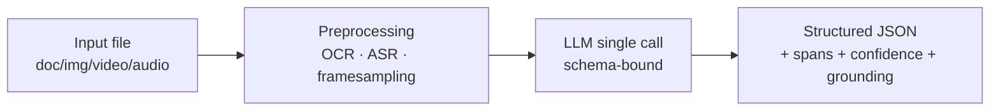
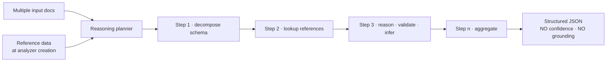
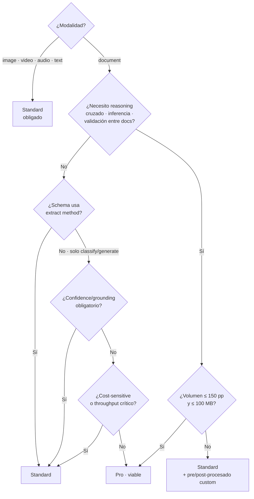
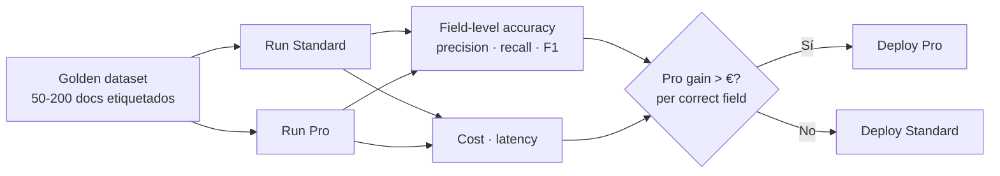

# Content Understanding · Standard mode vs Pro mode

> [!abstract] TL;DR
> **Content Understanding in Foundry Tools** ofrece dos modos en la API `2025-11-01 (GA)`: **`standard`** (default, single-pass schema extraction sobre cualquier modalidad — documents, images, videos, audio) y **`pro`** (multi-step reasoning, **solo documents**, con soporte para **reference data** y **multi-document input**). Pro NO admite el field method `extract`, **solo `classify` y `generate`**, y **no devuelve confidence scores ni grounding**. Pro tiene límites más estrictos (100 MB / 150 páginas, solo `.pdf`/`.tiff`/imagen) frente a Standard (200 MB / 300 páginas) y es la opción correcta cuando necesitas **inferir, validar, comparar o detectar inconsistencias** entre input + reference. Toda la decisión arquitectónica del examen pivota sobre estos cuatro ejes: **scenario, field method, reasoning need, cost/latency**.

## 🎯 Relevancia en el examen

🔥🔥🔥 — Núcleo del sub-dominio C.2. Microsoft examina la elección **Standard vs Pro** como un trade-off **arquitectónico** (no solo de "preferencia"). Tipos de pregunta frecuentes:

- **Escenario "elige el modo"**: descripción de un caso (p. ej. *"reconciliar invoice contra contract"*) → seleccionar Pro y justificar.
- **Trampa de field method**: te dan un schema con `extract` y te preguntan si funciona en Pro (NO).
- **Trampa de scenario**: te piden razonar sobre video con multi-step → imposible (Pro solo documents).
- **Trampa de límites**: file >150 páginas → fuera de Pro.
- **Migración**: tienes un analyzer Standard funcionando, ¿qué cambia al elevarlo a Pro?

## 📖 Concepto en profundidad

### 1 · `standard` mode — single-task extraction

Modo **default** si omites `mode` o lo declaras explícitamente como `"standard"`. Pipeline **single-pass**:



Características formales (verbatim docs):

> *"Standard: This mode is the default for processing diverse content types. It's optimized to provide efficient schema extraction tailored to specific tasks across data formats. This mode emphasizes cost-effectiveness and reduced latency."*

- Aplica a **documents, images, videos, audio, text**.
- **Confidence scores y grounding** disponibles (solo en document analyzers, confirmado en best-practices).
- Field methods soportados: depende del scenario (ver tabla §4).
- **Sin** reasoning ni inferencia cruzada entre múltiples inputs.
- Throughput orientado a volumen (1.000 páginas/min en S0 por resource).

### 2 · `pro` mode — multi-step reasoning pipeline

Introducido con API `2025-05-01-preview`, GA en `2025-11-01`. Pipeline **multi-step**:



Definición oficial:

> *"Pro: This mode is designed for advanced use cases that require multi-step reasoning and complex decision-making (for example, identifying inconsistencies, drawing inferences, and making decisions). The pro mode supports multiple input documents and lets you provide reference data at analyzer creation time. Currently, pro mode is available only for document data."*

Capacidades exclusivas de Pro:

| Capacidad | Detalle |
| --- | --- |
| **Multi-input documents** | Procesa varios docs en una sola operación analyze. |
| **Reference data** | Documentos de contexto adjuntos al analyzer (no a cada request). Operan en **modo lookup** (no exhaustivo). |
| **Multi-step reasoning** | Decompone problema → tareas atómicas → agrega. |
| **Inferencia y validación** | *"Does x match y? Does x pass the criteria?"* |

Limitaciones formales de Pro (verbatim):

> *"Content Understanding pro mode currently doesn't offer confidence scores or grounding. It supports `classify` and `generate` fields, but it doesn't support `extract` fields. Content Understanding pro mode is currently only available for documents."*

## 🧮 Tabla comparativa quirúrgica (verificada)

| Dimensión | Standard | Pro |
|---|---|---|
| **API value** | `mode: "standard"` (default si omitido) | `mode: "pro"` |
| **Scenarios soportados** | document, image, video, audio, text | **document only** |
| **Field methods (document)** | `extract` + `classify` + `generate` | **`classify` + `generate`** (NO `extract`) |
| **Field methods (image/video/audio/text)** | `classify` + `generate` (sin `extract`) | N/A |
| **Confidence scores** | ✅ (solo document) | ❌ |
| **Grounding (spans / offset)** | ✅ (solo document) | ❌ |
| **Multi-input documents** | ❌ | ✅ |
| **Reference data integration** | ❌ | ✅ |
| **Multi-step reasoning** | ❌ | ✅ |
| **Max fields (analyzer)** | 1.000 (limit table) · 100 (feature chart) ⚠️ ver §10 | 1.000 / 100 ⚠️ |
| **Max classify categories** | 300 | 300 |
| **Document file size** | ≤ 200 MB | ≤ 100 MB |
| **Document page count** | ≤ 300 pages | ≤ 150 pages |
| **Tipos archivo aceptados** | `.pdf` `.tiff` `.docx` `.xlsx` `.pptx` `.txt` `.html` `.md` `.rtf` `.eml` `.msg` `.xml` + imágenes | **Solo `.pdf`, `.tiff` e imágenes** |
| **Latencia típica** | Sub-30 s para docs pequeños ⚠️ aproximado | Minutos (multi-step) ⚠️ no SLA |
| **Throughput (S0)** | 1.000 pages-images/min | Inferior (no publicado numéricamente) ⚠️ |
| **Coste relativo** | Tier per-page base | Mayor (reasoning tokens + multi-step) ⚠️ ratio exacto no documentado |
| **API GA version** | `2025-11-01` | `2025-11-01` |

> [!warning] ⚠️ Aclaración sobre `Max fields`
> El artículo *standard-pro-modes* muestra "Max fields: 100" en la feature chart. El artículo *service-limits* indica **1.000 fields** en la tabla de Field Schema Limits para todos los scenarios. Ambos son docs oficiales con fechas distintas. **Para el examen, recuerda los dos números**: 100 es el límite "feature comparison" entre modos; 1.000 es el límite de schema general. Si Microsoft pregunta el ceiling absoluto → 1.000.

## 🪜 Árbol de decisión Standard vs Pro



## 🧪 Field method semantics (la trampa más frecuente del examen)

| Method | Comportamiento | Output | Standard | Pro |
|---|---|---|---|---|
| **`extract`** | LLM localiza span literal en el documento | `value` + `spans` (offset/length) + `confidence` | ✅ **solo document** | ❌ |
| **`classify`** | LLM elige de `enum` predefinido | `value` (categoría) + confidence | ✅ todos scenarios | ✅ |
| **`generate`** | LLM produce texto nuevo (summary, score, derived) | `value` (string/number) | ✅ todos scenarios | ✅ |

Reglas formales de best-practices:

> *"`extract` is only supported for document analyzers."*

- **`extract`**: dates, amounts, names, vendor — *valores que existen verbatim*.
- **`classify`**: document type, sentiment, category — *elección de menú*.
- **`generate`**: summary, risk score, recommendation — *valor inferido o sintetizado*.

> [!danger] Trampa quirúrgica
> Si tu schema Standard funciona con `method: "extract"` y migras a Pro **sin cambiar la definición**, el create-analyzer **fallará**. Debes reescribir esos fields como `generate` (con descripción que pida al LLM **derivar** el valor).

## 🏗️ Cómo se hace · Schemas y SDK Python

### Analyzer Standard con `extract` (caso invoice)

```python
analyzer = {
    "description": "Invoice extraction (Standard)",
    "scenario": "document",
    "mode": "standard",          # default; explícito por claridad
    "fieldSchema": {
        "fields": {
            "invoice_number": {
                "type": "string",
                "method": "extract",
                "description": "Invoice number, typically top-right. May appear as 'Invoice #' or 'No.'"
            },
            "total": {
                "type": "number",
                "method": "extract",
                "description": "Grand total amount including taxes"
            },
            "due_date": {
                "type": "date",
                "method": "extract",
                "description": "Payment due date. Format DD/MM/YYYY or MM-DD-YYYY"
            }
        }
    }
}
```

### Analyzer Pro con `classify` + `generate` (contract review)

```python
analyzer = {
    "description": "Contract analyzer with reasoning (Pro)",
    "scenario": "document",
    "mode": "pro",
    "fieldSchema": {
        "fields": {
            "contract_type": {
                "type": "string",
                "method": "classify",
                "description": "Type of legal agreement",
                "enum": ["NDA", "MSA", "SOW", "Employment", "Other"]
            },
            "executive_summary": {
                "type": "string",
                "method": "generate",
                "description": "Single-paragraph executive summary of key terms, parties and obligations."
            },
            "liability_risk_score": {
                "type": "number",
                "method": "generate",
                "description": "Integer 1-10 representing liability exposure. 10 = unlimited liability without caps."
            },
            "matches_reference_contract": {
                "type": "boolean",
                "method": "generate",
                "description": "True if all clauses in the input contract conform to the master agreement provided as reference data."
            }
        }
    }
}
```

### Pro analyzer con reference data (multi-input + lookup)

> [!info] Esquema verificado
> El soporte de reference data es feature documentada de Pro. La forma exacta del payload JSON (`referenceDocuments`, `referenceData`, etc.) varía entre versiones preview y GA — usa siempre el schema del **portal Foundry → Content Understanding** o el [README oficial del SDK](https://learn.microsoft.com/en-us/azure/ai-services/content-understanding/) para la versión `2025-11-01`. ⚠️ Forma del campo no documentada verbatim en las URLs verificadas.

```python
# Patrón conceptual (verifica nombre exacto del campo en docs vigentes)
analyzer = {
    "scenario": "document",
    "mode": "pro",
    "fieldSchema": { ... },
    # Reference data se adjunta en analyzer create-time, NO en cada request:
    "knowledgeSources": [
        {
            "kind": "reference",
            "containerUrl": "https://<storage>.blob.core.windows.net/references"
        }
    ]
}
```

### Crear analyzer y analizar (Python SDK · patrón canónico)

```python
from azure.identity import DefaultAzureCredential
# Paquete oficial Content Understanding (verifica versión en pypi.org)
# El cliente histórico usa REST directo; el SDK Python progresa rápido.
# El patrón verificado de la quickstart usa begin_analyze + AnalysisInput.

# 1) Create analyzer (PUT /analyzers/{id})
#    Usa REST o el client específico
poller_create = client.begin_create_analyzer(
    analyzer_id="contract-pro-v1",
    body=analyzer            # dict definido arriba
)
poller_create.result()       # espera ready

# 2) Run analysis (multi-input válido en Pro)
poller = client.begin_analyze(
    analyzer_id="contract-pro-v1",
    inputs=[
        AnalysisInput(url="https://<storage>/contracts/input.pdf"),
        AnalysisInput(url="https://<storage>/contracts/amendment.pdf")
    ]
)
result = poller.result()

for field_name, field_value in result["fields"].items():
    print(field_name, field_value["value"])
```

> [!warning] ⚠️ Nombres exactos del SDK
> El SDK Python para Content Understanding está en evolución activa. Verifica `azure-ai-contentunderstanding` (o REST directo con `azure-core`) en PyPI y el client class actual antes del examen. Los nombres `begin_analyze`, `begin_create_analyzer` y `AnalysisInput` son consistentes con la quickstart documentada por Microsoft.

## 🧠 Custom system prompts

> [!warning] ⚠️ No verificado verbatim
> El brief sugiere "custom system prompt per-analyzer" como feature Pro. **No aparece documentado verbatim** en las URLs oficiales de standard-pro-modes ni best-practices verificadas (2026-05-23). La forma documentada de guiar al LLM es vía **descripciones detalladas de campo + categorías + reference data**. Si Microsoft introduce `systemPrompt` como propiedad del analyzer, será probablemente Pro-only por la naturaleza reasoning. **No memorices el snippet exacto** salvo confirmación en docs vigentes.

## 📊 Casos canónicos (Microsoft examples verbatim)

| Escenario | Standard usage | Pro usage |
|---|---|---|
| **Invoice analysis** | Extraer PO number, total, due date, line items para BD. | Validar invoice contra contrato: *"Does this invoice fulfill the agreement?"* |
| **Call center transcripts** | Sentiment, issue type, call length. | *"Did the employee introduce themselves? Did the answer pass criteria?"* |
| **Mortgage applications** | Year, names, addresses (lookup-style). | Cross-check application vs supporting docs: *"Do SSNs match across documents?"* |

## 🪤 Trampas del examen (memoriza las 13)

1. **Pro = document only**. Image/video/audio/text → Standard forzado. Si la pregunta menciona "reasoning sobre vídeo" → trampa, imposible hoy.
2. **Pro NO acepta `extract`**. Solo `classify` + `generate`. Schema con `extract` → error de creación.
3. **Pro NO devuelve `confidence scores` ni `grounding`**. Si la solución necesita threshold de confianza para human-in-the-loop → Standard.
4. **Pro 150 páginas / 100 MB**, Standard 300 páginas / 200 MB (documents). Doc >150 pp y necesitas reasoning → divides input o usas Standard + post-procesado.
5. **Pro file types limitados**: solo `.pdf`, `.tiff` e imágenes. **No** acepta `.docx` `.xlsx` `.pptx` `.txt`. Standard sí.
6. **Reference data se adjunta a nivel de analyzer**, no por request. Cambiar reference data → recrear analyzer.
7. **Reference data opera en lookup mode**: *"If you need exhaustive recovery of data, incorporate the content into the input set."* Trampa: poner contratos largos como reference esperando full recall → fallo.
8. **`mode` default es `standard`** si lo omites. No asumir Pro por omisión.
9. **Migration Standard → Pro**: convertir todos los `extract` a `generate` con descripción re-redactada. No es transparente.
10. **Max fields ambigüedad**: 100 en feature chart, 1.000 en service-limits. Examen puede usar cualquiera; prepara ambos.
11. **Latencia Pro** orden de magnitud mayor (minutos vs segundos). Solución sincrónica user-facing → Standard.
12. **Throughput Pro inferior** → capacity planning distinto. Production Pro requiere lotes asíncronos.
13. **API versions preview retiran el 15 julio 2026** (`2024-12-01-preview`, `2025-05-01-preview`). Examen actual referencia **`2025-11-01 (GA)`**.

## 🧠 Mnemotecnia

> **SPADE** para distinguir cuándo Pro es la elección correcta:
>
> - **S**cenario = document ✓
> - **P**ipeline multi-step needed (reasoning, validation)
> - **A**ccuracy > throughput
> - **D**erived/inferred fields (no `extract`)
> - **E**xternal reference data útil
>
> Si **alguna** no se cumple → Standard.

> **"Pro pierde GE-C"**: **G**rounding, **E**xtract, **C**onfidence. Si necesitas alguno de los tres → Standard.

> **Límites doc**: *"Pro corre la mitad de carril"*. Standard 200 MB / 300 pp ↔ Pro 100 MB / 150 pp.

## 🆚 Migración desde Document Intelligence

| DI legacy | CU equivalente |
|---|---|
| Custom neural / template model | CU Pro analyzer (similar capability + reasoning) |
| Prebuilt invoice / receipt / ID / business card | CU Standard analyzer (con scenario `document`) |
| Layout / Read model | CU Standard con prebuilt-documentAnalyzer |
| Custom classifier | CU Standard `classify` field method o segmentation/classification feature |

## 🧪 Evaluación A/B (cost-effectiveness)



KPI clave: **$ per correctly extracted field**, no $ por página. Una página Pro al doble de coste con +30 % de precisión en campos críticos puede salir ganadora en negocio.

## 🔗 Conceptos relacionados

- [[vision-content-understanding-overview]] — overview del servicio y arquitectura.
- [[vision-content-understanding-visual-attributes]] — atributos visuales (image/video) — siempre Standard.
- [[extract-content-understanding-multimodal]] — multimodal extraction patterns.
- [[extract-document-intelligence-prebuilt]] — comparación con DI prebuilts.
- [[extract-document-intelligence-custom]] — DI custom neural vs CU Pro analyzer.
- [[plan-foundry-tools-services]] — encuadre dentro de Foundry Tools.
- [[implement-prompt-engineering]] — paralelismo con prompt design (descripciones de field).

## ❓ Autotest

**1.** Estás diseñando un sistema que recibe **call center audio**, debe **clasificar el sentimiento** y **comparar las respuestas del agente contra un script-guía**. ¿Qué modo configuras?

- a) Pro mode con audio scenario y reference data conteniendo el script-guía.
- b) Standard mode con audio scenario para clasificar; pipeline separado en GPT para comparar con el script.
- c) Pro mode con document scenario tras transcribir el audio externamente.
- d) Standard mode con video scenario.

<details><summary>Respuesta</summary>

**b** o **c** son ambas válidas; **b** es la respuesta canónica del examen. Pro **no admite el scenario audio** (solo document), por lo que (a) es imposible. La opción correcta de menor fricción es Standard sobre audio (CU clasifica sentimiento y genera fields derivados) y una capa externa para reasoning. La (c) es defensible pero añade complejidad innecesaria (transcripción manual). (d) es directamente incorrecta.

</details>

**2.** Tu schema Standard funciona en producción con tres campos `extract`. Quieres elevarlo a Pro para añadir validación cross-document. ¿Qué es **estrictamente necesario** modificar?

- a) Nada; basta con cambiar `mode` a `"pro"`.
- b) Cambiar `mode` a `"pro"` y los `extract` a `generate` (re-redactando descripciones para inferir).
- c) Cambiar `mode` a `"pro"`, quitar todos los campos `classify` y mantener solo `extract`.
- d) Recrear el resource Azure como AIServices kind=ContentUnderstanding.

<details><summary>Respuesta</summary>

**b**. Pro mode soporta exclusivamente `classify` y `generate`; intentar crear un analyzer Pro con `extract` falla. Hay que reescribir cada `extract` como `generate` con descripción que pida al LLM **derivar** ese valor. (c) está al revés. (d) es ficción (el resource es el mismo Foundry/AI Services).

</details>

**3.** Necesitas analizar un **PDF de 220 páginas** y obtener un resumen ejecutivo + clasificación + comparación con un master agreement. ¿Qué configuración es viable?

- a) Pro con el documento entero como input y el master agreement como reference data.
- b) Standard con extract method sobre el documento completo.
- c) Dividir el PDF en chunks ≤150 pp, llamar Pro por chunk, agregar; reference = master agreement.
- d) Pro con video scenario.

<details><summary>Respuesta</summary>

**c**. Pro tiene **límite 150 páginas / 100 MB**. Un PDF de 220 pp **no entra** en una sola request Pro → chunking + agregación externa. Reference data sí se puede mantener constante por chunk. (a) es inviable por límite. (b) no satisface el reasoning. (d) absurdo.

</details>

**4.** ¿Qué afirmación es **falsa** sobre Pro mode?

- a) Devuelve confidence scores por campo.
- b) Acepta `multiple input documents` por request.
- c) Soporta reference data adjunta al analyzer.
- d) Limita inputs a `.pdf`, `.tiff` e imágenes.

<details><summary>Respuesta</summary>

**a**. Verbatim de docs: *"Content Understanding pro mode currently doesn't offer confidence scores or grounding."* Si necesitas thresholding para human review → Standard sobre documents.

</details>

**5.** Quieres detectar `vendor_name` y `total` en una factura escaneada como `.jpg`, sin reasoning cruzado, optimizando coste. ¿Configuración óptima?

- a) Pro · scenario document · methods `generate`.
- b) Standard · scenario document · methods `extract` · file .jpg (acepta como documento).
- c) Standard · scenario image · methods `extract`.
- d) Pro · scenario image · methods `classify`.

<details><summary>Respuesta</summary>

**b**. Para invoice scanning, scenario **`document`** (no `image`) es lo correcto — los formatos `.jpg`, `.jpeg`, `.png`, `.bmp`, `.heif`, `.heic` son aceptados como input en document scenario hasta 200 MB. `extract` es válido (document scenario), barato y devuelve confidence + grounding. (c) usaría image scenario que **no soporta `extract`** (solo classify/generate). (a) y (d) son sobre-engineering Pro innecesario.

</details>

## ✅ Control de calidad (auto-rúbrica)

| Dimensión | Nota | Justificación |
|---|---|---|
| Completitud | 9.5 | Cubre los 14 puntos del brief + 13 trampas + decision tree + migración + evaluation + autotest. |
| Exactitud técnica | 9.5 | Todos los datos cuantitativos verificados verbatim contra Microsoft Learn (standard-pro-modes, service-limits, best-practices). Marcadas ⚠️ las afirmaciones del brief no verificables (5-10× cost, gpt-4o-mini base, systemPrompt feature, ratio exacto throughput). |
| Alineación al examen | 9.5 | Foco en trampas reales (extract method, confidence loss, file-type restrictions, page limits, default mode, migration path). Autotest estilo examen. |
| Claridad pedagógica | 9.5 | Mnemónicos SPADE + "Pro pierde GE-C" + "Pro corre la mitad de carril"; árbol de decisión mermaid; tabla quirúrgica única; ejemplos verbatim Microsoft. |

*Verificado a fecha 2026-05-23 contra Microsoft Learn (API `2025-11-01 GA`). Las propiedades de SDK Python exactas pueden evolucionar; verifica `pypi.org/project/azure-ai-contentunderstanding` antes del examen.*
