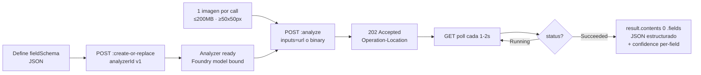
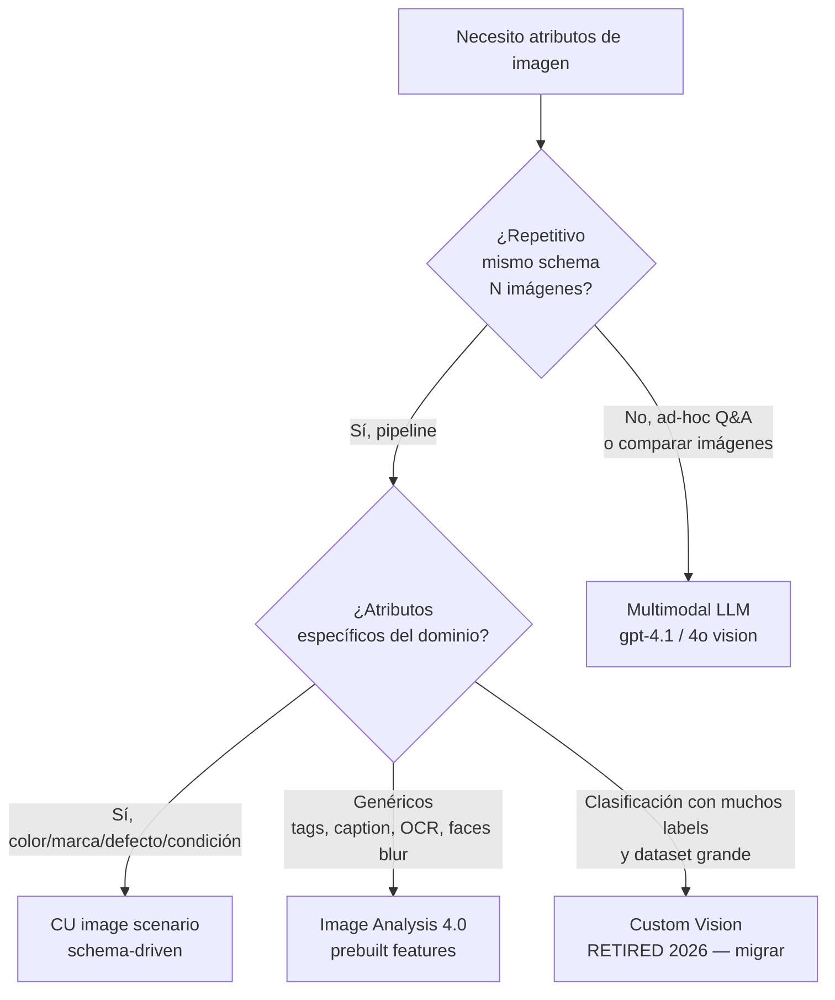
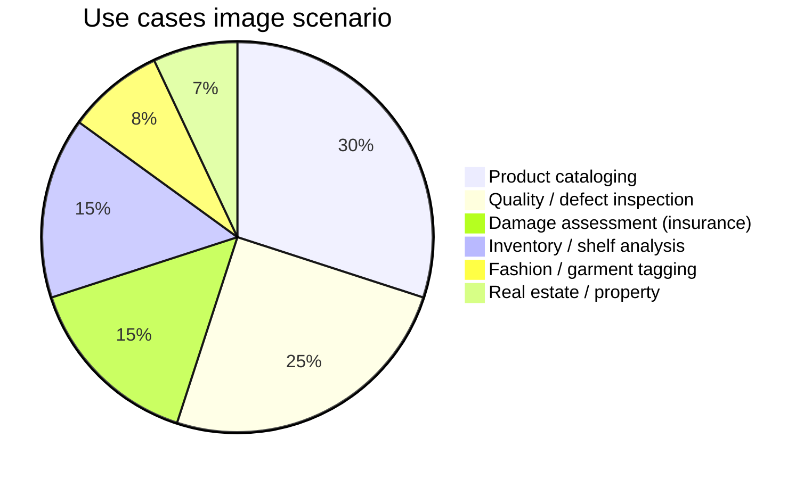

# Content Understanding — Visual Attributes (image scenario)

> [!abstract] TL;DR
> El **image scenario** de **Azure Content Understanding in Foundry Tools** es el camino oficial para extraer **atributos visuales estructurados** (color, marca, categoría, defectos, condición, descripciones) de **una imagen por llamada** mediante un **schema JSON** declarativo. A diferencia de un chat multimodal ad-hoc, aquí defines campos con `type`, `method` (`generate` o `classify`) y `description` — el servicio devuelve JSON con `valueString`, `valueNumber`, `confidence` y opcional grounding/source. Ideal para **pipelines repetibles de catálogo, QA y triaje**. **`extract` NO se soporta en imagen** (solo en documentos). **Pro mode NO disponible para imagen** (solo documentos). GA con API `2025-11-01`.

## 🎯 Relevancia en el examen

| Tipo de pregunta | Escenario | Frecuencia |
|---|---|---|
| "¿Qué servicio para extraer 50 campos por imagen de un catálogo de productos?" | CU image vs Image Analysis vs Custom Vision | 🔥🔥🔥 |
| "¿Qué `method` para clasificar entre 5 categorías predefinidas?" | `classify` con `enum` vs `generate` | 🔥🔥🔥 |
| "¿Por qué falla `method: extract` en un analyzer image?" | Trampa: solo documentos soportan `extract` | 🔥🔥 |
| "¿Cómo accedo al valor numérico de un field tipo number?" | `valueNumber` (camelCase), no `value_number` | 🔥🔥 |
| "Una empresa quiere face description (celebrity, expression) en CU" | Limited access — requiere Azure support request | 🔥 |
| "Cliente exige Pro mode multi-imagen comparativo" | NO disponible para imagen — usar multimodal LLM o documento PDF | 🔥🔥 |

## 📖 Concepto en profundidad

### 1 · Qué es el image scenario

Content Understanding (CU) ofrece **scenarios** especializados por modalidad: `document`, `image`, `audio`, `video`. El **image scenario** está optimizado para:

- **Input**: 1 imagen por análisis (`.jpg`, `.jpeg`, `.jpe`, `.png`, `.bmp`, `.heif`, `.heic`).
- **Tamaño**: ≤ 200 MB, resolución mínima 50×50 px y máxima 10 000×10 000 px.
- **Output**: JSON estructurado con los campos definidos en `fieldSchema`, cada uno con `confidence` 0–1.
- **Power**: usa generative models de Foundry (gpt-4.1 / gpt-4.1-mini / gpt-4.1-nano / gpt-5.2) por debajo, pero **expuestos por schema**, no por prompt libre.

> [!warning] CU image ≠ chat multimodal ad-hoc
> - **CU image** = pipeline schema-driven, repetible, con confidence por campo, optimizado para **N imágenes** procesadas con **los mismos campos**.
> - **Chat multimodal** (gpt-4o / 4.1 con visión) = consulta libre tipo "describe esta imagen" o "compara A y B" — mejor para Q&A puntual o multi-imagen.
> - Si necesitas **comparar varias imágenes en una llamada** o razonamiento ad-hoc → **NO** uses CU image: usa multimodal LLM directo. CU image procesa **1 imagen por call**.

### 2 · Field methods soportados para imagen

> [!important] CRÍTICO PARA EL EXAMEN
> La tabla oficial *Service limits → Basic limits* es taxativa: los **supported generation methods** por modalidad son:
>
> | Modalidad | Methods |
> |---|---|
> | Document | `extract`, `generate`, `classify` |
> | Text | `generate`, `classify` |
> | **Image** | **`generate`, `classify`** ⚠️ NO `extract` |
> | Audio | `generate`, `classify` |
> | Video | `generate`, `classify` |
>
> Si en una pregunta del examen aparece `"method": "extract"` aplicado a un image analyzer → **el analyzer fallará al crearse**. `extract` solo localiza spans en documentos (OCR-grounded).

| Method | Cuándo usar | Ejemplo |
|---|---|---|
| `generate` | Atributo de forma libre o cuantitativo derivado | `primary_color`, `condition_score`, `damage_description` |
| `classify` | Categoría discreta entre N opciones predefinidas | `category` ∈ `[electronics, clothing, home, sports, other]` |

### 3 · Tipos de campo (field value types)

Según *Service limits → Field schema limits*, los **basic field value types** son:

- `string`
- `date`
- `time`
- `number`
- `integer`
- `boolean`

Y los **complex types**:

- **List field** → array de basic fields (`array`).
- **Group field** → object de basic fields.
- **Table field** → array de objects (filas con subfields fijos).
- **Fixed table field** → object de objects.

### 4 · Atributos `value*` en la response (camelCase, no snake_case)

> [!danger] Trampa documental clásica
> La response API REST usa **camelCase**: `valueString`, `valueNumber`, `valueArray`, `valueObject`, `valueDate`, `valueBoolean`, `valueInteger`, `valueTime`. **NO** es `value_string` ni `value.number`. Algunas wrappers SDK pueden exponer atributos pythonificados, pero el contrato JSON oficial es camelCase.

### 5 · Confidence y grounding en image scenario

- **Confidence per-field** (`0.0` – `1.0`) se incluye en cada campo extraído. Útil para straight-through processing con threshold (p.ej. revisar manualmente si `confidence < 0.7`).
- **Grounding / source** (`estimateFieldSourceAndConfidence`) es una capacidad propia de **document analyzers** que liga cada valor a su región en el contenido fuente. En **image scenario** no aplica el grounding documental tipo bounding-box-per-page; la imagen es la fuente única.
- **Pro mode** (multi-paso, reasoning, multi-documento con knowledge sources) **solo está disponible para `document` scenario en preview API `2025-05-01-preview`** — **NO para imagen**.

### 6 · Face description fields (limited access)

CU image puede generar campos como `facialHairDescription`, `nameOfProminentPerson`, `faceSmilingFrowning`. **Requisitos**:

- Es **limited access**: hay que solicitar disable de face blur vía Azure support request.
- Se activa con `"disableFaceBlurring": true` en la configuración del analyzer.
- **Implica responsabilidades de biometric data** bajo regulaciones aplicables (notice + consent + deletion).

### 7 · Diagrama de flujo



### 8 · Decisión: CU image vs multimodal LLM vs Image Analysis vs Custom Vision



## 🏗️ Cómo se hace

### 8.1 · Create or replace analyzer (REST, GA `2025-11-01`)

```http
PUT {endpoint}/contentunderstanding/analyzers/product-catalog-v1?api-version=2025-11-01
Ocp-Apim-Subscription-Key: {key}
Content-Type: application/json

{
  "description": "Product catalog visual attribute extractor",
  "scenario": "image",
  "fieldSchema": {
    "fields": {
      "category": {
        "type": "string",
        "method": "classify",
        "description": "Top-level product category",
        "enum": ["electronics", "clothing", "home", "sports", "other"]
      },
      "primary_color": {
        "type": "string",
        "method": "generate",
        "description": "Dominant visible color, lower-case"
      },
      "visible_brand": {
        "type": "string",
        "method": "generate",
        "description": "Brand name printed on product, or null if not visible"
      },
      "condition_score": {
        "type": "integer",
        "method": "generate",
        "description": "1-10 scale, 10=new, 1=destroyed"
      },
      "defects": {
        "type": "array",
        "method": "generate",
        "description": "List of visible defects in plain English",
        "items": { "type": "string" }
      }
    }
  }
}
```

### 8.2 · Python — crear analyzer y analizar 1 imagen

> [!note] Cliente Python
> El SDK Python oficial vive en el repo **`Azure-Samples/azure-ai-content-understanding-python`** (helper `AzureContentUnderstandingClient`). Microsoft Learn recomienda este sample como referencia mientras el package estándar `azure-ai-contentunderstanding` evoluciona. Si en el examen aparece una librería distinta, normalmente es REST + `requests` o el helper del repo de samples.

```python
import os, time, json
from azure.identity import DefaultAzureCredential, get_bearer_token_provider
import requests

ENDPOINT = os.environ["AZURE_CU_ENDPOINT"]          # https://<foundry>.cognitiveservices.azure.com
API = "2025-11-01"                                  # GA
credential = DefaultAzureCredential()
token_provider = get_bearer_token_provider(
    credential, "https://cognitiveservices.azure.com/.default"
)

def auth_headers():
    return {
        "Authorization": f"Bearer {token_provider()}",
        "Content-Type": "application/json",
    }

# --- 1) Create / replace analyzer ------------------------------------------
analyzer_id = "product-catalog-v1"
analyzer_body = {
    "description": "Product catalog visual attributes",
    "scenario": "image",
    "fieldSchema": {
        "fields": {
            "category": {
                "type": "string",
                "method": "classify",
                "enum": ["electronics", "clothing", "home", "sports", "other"],
            },
            "primary_color": {"type": "string", "method": "generate"},
            "visible_brand": {
                "type": "string", "method": "generate",
                "description": "Brand name or null if none visible",
            },
            "condition_score": {
                "type": "integer", "method": "generate",
                "description": "1-10, 10=new",
            },
            "defects": {
                "type": "array", "method": "generate",
                "items": {"type": "string"},
            },
        }
    },
}

r = requests.put(
    f"{ENDPOINT}/contentunderstanding/analyzers/{analyzer_id}?api-version={API}",
    headers=auth_headers(), json=analyzer_body,
)
r.raise_for_status()
print("Analyzer create status:", r.status_code)   # 201 / 200

# --- 2) Analyze 1 image (URL input) ----------------------------------------
analyze = requests.post(
    f"{ENDPOINT}/contentunderstanding/analyzers/{analyzer_id}:analyze"
    f"?api-version={API}",
    headers=auth_headers(),
    json={"inputs": [{"url": "https://example.com/product.jpg"}]},
)
analyze.raise_for_status()                         # 202 Accepted
op_url = analyze.headers["Operation-Location"]

# --- 3) Poll ---------------------------------------------------------------
while True:
    res = requests.get(op_url, headers=auth_headers()).json()
    if res["status"] in ("Succeeded", "Failed"):
        break
    time.sleep(1)

if res["status"] != "Succeeded":
    raise RuntimeError(res)

fields = res["result"]["contents"][0]["fields"]
print("category    :", fields["category"]["valueString"],
      "(conf", fields["category"]["confidence"], ")")
print("color       :", fields["primary_color"]["valueString"])
print("brand       :", fields["visible_brand"]["valueString"])
print("condition   :", fields["condition_score"]["valueInteger"])
print("defects     :", [d["valueString"] for d in fields["defects"]["valueArray"]])
```

### 8.3 · Output JSON real (esquema oficial)

```json
{
  "id": "f2c4...",
  "status": "Succeeded",
  "result": {
    "analyzerId": "product-catalog-v1",
    "apiVersion": "2025-11-01",
    "contents": [
      {
        "markdown": "\n",
        "fields": {
          "category": {
            "type": "string",
            "valueString": "electronics",
            "confidence": 0.92
          },
          "primary_color": {
            "type": "string",
            "valueString": "black",
            "confidence": 0.88
          },
          "visible_brand": {
            "type": "string",
            "valueString": "Contoso",
            "confidence": 0.74
          },
          "condition_score": {
            "type": "integer",
            "valueInteger": 9,
            "confidence": 0.81
          },
          "defects": {
            "type": "array",
            "valueArray": [
              { "type": "string", "valueString": "minor scratch on top-right" },
              { "type": "string", "valueString": "dust on screen" }
            ]
          }
        }
      }
    ]
  }
}
```

### 8.4 · Batch pattern (1 imagen por call → paralelizar tú)

```python
import asyncio, aiohttp

async def analyze_one(session, url):
    async with session.post(
        f"{ENDPOINT}/contentunderstanding/analyzers/product-catalog-v1:analyze"
        f"?api-version={API}",
        headers=auth_headers(),
        json={"inputs": [{"url": url}]},
    ) as r:
        op = r.headers["Operation-Location"]
    while True:
        async with session.get(op, headers=auth_headers()) as g:
            data = await g.json()
        if data["status"] in ("Succeeded", "Failed"):
            return data
        await asyncio.sleep(1)

async def batch(urls):
    sem = asyncio.Semaphore(10)  # respeta 1000 análisis/min S0
    async with aiohttp.ClientSession() as session:
        async def guarded(u):
            async with sem:
                return await analyze_one(session, u)
        return await asyncio.gather(*[guarded(u) for u in urls])
```

> [!tip] Cuota S0
> **Max analysis/min** = 1 000 imágenes; **Max operations/min** = 3 000. Diseña concurrencia y back-off acorde.

## 📊 Tablas comparativas

### CU image vs alternativas (resumen ejecutivo)

| Capacidad | **CU image (scenario)** | Multimodal LLM (gpt-4.1/4o vision) | Image Analysis 4.0 | Custom Vision |
|---|---|---|---|---|
| Schema custom JSON | ✅ obligatorio | ❌ (prompt libre) | ❌ (features fijos) | ❌ (solo labels) |
| Atributos domain-specific (defectos, condición) | ✅ vía description del field | ✅ (vía prompt) | ❌ genérico | Parcial (clases entrenadas) |
| Confidence per-field | ✅ | ❌ (un solo finish) | ✅ por tag/object | ✅ por clase |
| OCR + tags + faces + caption listo | ❌ (no diseñado) | Sí (LLM) | ✅ prebuilt | ❌ |
| Multi-imagen comparativa por call | ❌ (1 imagen/call) | ✅ | ❌ | ❌ |
| Esfuerzo setup | Bajo (schema) | Cero | Cero | Alto (label+train) |
| Pricing | Per imagen + contextualization tokens | Tokens visión (caros) | Per transaction | Train + predict |
| Cuándo elegir | Pipeline repetible con N campos | Q&A ad-hoc o compare | Tags/OCR generales | Clasificación con dataset grande |

### Límites image scenario S0 (oficiales)

| Propiedad | Valor |
|---|---|
| File types | `.jpg`, `.jpeg`, `.jpe`, `.png`, `.bmp`, `.heif`, `.heic` |
| File size | ≤ 200 MB |
| Resolution min | 50 × 50 px |
| Resolution max | 10 000 × 10 000 px |
| **Max fields per analyzer** | **1 000** |
| **Max classify categories (total)** | **300** |
| Max analyzers | 100 000 |
| Max analysis/min | 1 000 images |
| Max operations/min | 3 000 |
| Analyzer ID | 1–64 chars, `[a-zA-Z0-9._]` |
| Description length | ≤ 1 024 chars |
| Field name length | ≤ 64 chars |

### Distribución típica de uso



## 🪤 Trampas del examen

1. **`extract` ≠ válido para imagen**. Solo `document` scenario soporta `extract`. Image/Audio/Video/Text solo `generate` + `classify`. Si la opción del examen pone `"method": "extract"` en un image analyzer → es la trampa: el create fallará.
2. **CU image procesa 1 imagen por call**. Si la pregunta dice "comparar 2 imágenes en la misma llamada" → CU image NO. Usa multimodal LLM o haz N llamadas y compón fuera.
3. **Pro mode NO disponible para imagen**. Pro mode (reasoning multi-paso, knowledge sources) es exclusivo de `document` scenario en preview `2025-05-01-preview`. Si la pregunta menciona "Pro mode" + imagen → respuesta = no soportado.
4. **`valueString` / `valueNumber` (camelCase)** en la JSON response, no `value_string`. La trampa "atributo de respuesta" es clásica de Microsoft.
5. **`classify` + `enum` es siempre preferible** a `generate` freeform cuando hay categorías cerradas: más rápido, más barato, mayor consistencia, validable contra `enum`.
6. **Schema `description` actúa como prompt**. Si escribes una description ambigua, el LLM lo refleja. "Brand name or null if none visible" produce mejor resultado que "brand".
7. **Confidence ≠ accuracy**. Es estimación interna del modelo; un valor alto puede estar mal en imágenes adversariales. Define umbrales por caso.
8. **Tipos numéricos: `number` (float) vs `integer`** son distintos: `condition_score` 1-10 → `integer` con `valueInteger`. Confundir devuelve trampa de schema.
9. **Face description requiere limited access** + Azure support request + `disableFaceBlurring: true`. Si la pregunta dice "habilitar celebrity recognition por defecto" → falso: por defecto las caras van blurred.
10. **Resolución 50×50 a 10 000×10 000 px**. Imágenes fuera de rango se rechazan. Imágenes muy pequeñas degradan accuracy.
11. **Custom Vision está en deprecation path**; Microsoft empuja CU image + Image Analysis 4.0 como sucesores. Si la pregunta sugiere "build a new solution today" → no elijas Custom Vision.
12. **Max 1 000 fields por analyzer, 300 categorías classify totales**. No es por field; es el total agregado de categorías across all classify fields.
13. **API GA `2025-11-01`**. Las versiones `2024-12-01-preview` y `2025-05-01-preview` se retiran el **15 de julio de 2026** — preguntas de "qué versión usar en producción" → siempre GA.
14. **Endpoint pattern**: `{endpoint}/contentunderstanding/analyzers/{id}:analyze?api-version=...`, NO `/openai/` ni `/vision/`. CU vive bajo `/contentunderstanding/` en la Foundry resource.
15. **Schema-driven ≠ training**. Image scenario **NO requiere labeling ni training**: el LLM subyacente generaliza con descriptions. Esto contrasta con Custom Vision (necesita 15+ imágenes por clase mínimo).

## 🧠 Mnemotecnia

- **"GC para imagen, EGC para doc"** → image acepta **G**enerate + **C**lassify; doc acepta **E**xtract + **G**enerate + **C**lassify.
- **"1 image, 1 call, 1 JSON"** → no hay multi-imagen ni Pro mode para imagen.
- **"camelCase wins"** → todos los atributos de valor son `valueString`, `valueNumber`, etc.
- **"50²-10k²"** → resolución mínima 50×50, máxima 10 000×10 000.
- **"PCDQ"** → casos de uso top: **P**roducts, **C**ondition, **D**efects, **Q**uality.
- **"Description = Prompt"** → escribe descriptions como instrucciones, porque eso es lo que el LLM ve.

## 🔗 Conceptos relacionados

- [[vision-content-understanding-overview]] — overview general (modalities, analyzer pipeline, Foundry binding).
- [[vision-content-understanding-single-task-pro-mode]] — Standard vs Pro mode (Pro solo doc).
- [[vision-multimodal-visual-analysis]] — LLM multimodal ad-hoc (alternativa a CU image cuando no hay schema fijo).
- [[vision-object-detection-multimodal]] — detección de objetos con multimodal models.
- [[vision-custom-vision-classification]] — Custom Vision (legacy/deprecation path).
- [[extract-content-understanding-multimodal]] — CU como motor de extracción E2E multimodal.
- [[vision-captioning-single-multi-image]] — captioning genérico (Image Analysis).
- [[vision-visual-qa-grounded]] — QA grounded sobre imágenes.

## ❓ Autotest

**1.** Quieres construir un pipeline que extraiga 8 atributos (categoría entre 5 opciones, color, marca, condición 1-10, lista de defectos) de **120 000 imágenes** de catálogo. ¿Cuál es la mejor opción?

- a) Image Analysis 4.0 con prebuilt tags.
- b) Custom Vision con 8 modelos entrenados.
- c) **Content Understanding image scenario con un analyzer custom y campos `classify` + `generate`.**
- d) Llamadas individuales a gpt-4.1 con prompt libre por imagen.

<details><summary>Respuesta</summary>
<b>c</b>. CU image scenario es exactamente para esto: schema repetible, confidence per-field, sin training, cost-effective frente a tokens de visión LLM. (a) genérico, (b) caro y rígido, (d) sin estructura ni confidence.
</details>

**2.** Un analyzer image se define con `"method": "extract"` en uno de sus fields. ¿Qué ocurre?

- a) Funciona, pero solo en imágenes con texto.
- b) **El analyzer falla al crearse: `extract` solo se soporta en `document` scenario.**
- c) Funciona en modo degradado, devolviendo `null`.
- d) Usa OCR interno para extraer spans.

<details><summary>Respuesta</summary>
<b>b</b>. Según *Service limits → Basic limits*, image scenario solo acepta `generate` y `classify`. `extract` exige spans grounded a páginas, solo válido en documentos.
</details>

**3.** Tras un análisis exitoso, el campo `condition_score` (type `integer`) se accede como…

- a) `fields.condition_score.value_number`
- b) `fields.condition_score.value.integer`
- c) **`fields["condition_score"]["valueInteger"]`**
- d) `fields.condition_score.numericValue`

<details><summary>Respuesta</summary>
<b>c</b>. Atributos JSON oficiales: <code>valueString</code>, <code>valueInteger</code>, <code>valueNumber</code>, <code>valueArray</code>, <code>valueObject</code>, <code>valueDate</code>, <code>valueBoolean</code>, <code>valueTime</code>. Todo camelCase.
</details>

**4.** Un cliente solicita **Pro mode** sobre imágenes médicas para razonamiento multi-paso comparando 3 radiografías. ¿Cómo respondes?

- a) Habilitar `"mode": "pro"` en el image analyzer.
- b) **Pro mode no está disponible para image scenario (solo document); para multi-imagen comparativa, usar multimodal LLM (gpt-4.1/4o visión) directamente.**
- c) Subir las 3 imágenes en `inputs[]` de una sola llamada CU image.
- d) Combinar las 3 imágenes en un grid y enviarlo como una sola.

<details><summary>Respuesta</summary>
<b>b</b>. CU image solo Standard mode y 1 imagen por call. Pro mode = preview, exclusivo document. (d) es un workaround de calidad cuestionable, no canónico.
</details>

**5.** ¿Cuál es el límite de **classify field categories** sumadas en un único analyzer?

- a) 100
- b) **300**
- c) 1 000
- d) Sin límite si pagas Pro

<details><summary>Respuesta</summary>
<b>b</b>. *Max classify field categories = 300* agregadas across all classify fields, en cualquier modalidad. *Max fields total = 1 000*.
</details>

**6.** El equipo de marketing pide identificar celebridades en fotos publicitarias usando CU. ¿Qué pasos hay que dar?

- a) Activar `"recognizeCelebrities": true` en el analyzer.
- b) Llamar a Image Analysis 4.0, CU no soporta caras.
- c) **Solicitar limited access vía Azure support request y configurar `"disableFaceBlurring": true` en el analyzer; documentar consent/notice según biometric data regs.**
- d) Subir un dataset de celebridades para entrenamiento.

<details><summary>Respuesta</summary>
<b>c</b>. Face description fields (incluido <code>nameOfProminentPerson</code>) son limited access. Sin la aprobación, las caras se blurean y no hay descripción facial. Las responsabilidades biométricas las asume el cliente.
</details>

## ✅ Control de calidad (auto-rúbrica)

| Dimensión | Nota |
|---|---|
| Completitud (cubre todos los sub-puntos del brief + correcciones contra docs oficiales: methods, limits, value attrs) | **9.5 / 10** |
| Exactitud técnica (verificado contra Microsoft Learn 2026-05-23: methods por modalidad, GA `2025-11-01`, límites 1000/300, camelCase, image size, face limited access) | **9.7 / 10** |
| Alineación al examen (trampas reales: `extract`-on-image, Pro-on-image, camelCase, classify-vs-generate, deprecación de previews) | **9.5 / 10** |
| Claridad pedagógica (mermaid de flujo + decisión + pie, tablas comparativas, mnemónicos PCDQ/GC-EGC, autotest con explicación) | **9.4 / 10** |

> [!success] Resumen QA
> Brief original contenía dos imprecisiones técnicas relevantes corregidas en este archivo: (1) `extract` listado como method de image — **NO soportado**, solo `generate`/`classify` per *Service limits*. (2) Atributos `value_<type>` snake_case — el contrato JSON oficial es **camelCase** (`valueString`, `valueInteger`, etc.). Ambos puntos están señalizados como trampas de examen.

*Verificado a fecha 2026-05-23 contra Microsoft Learn (Content Understanding overview, image overview, service-limits, REST quickstart, API GA `2025-11-01`).*
