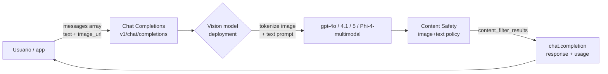
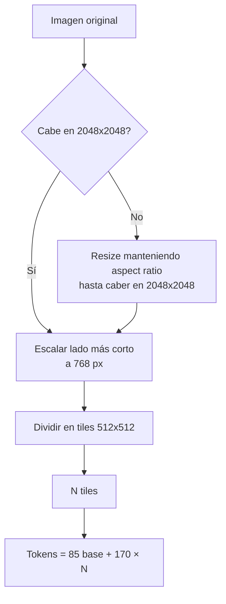
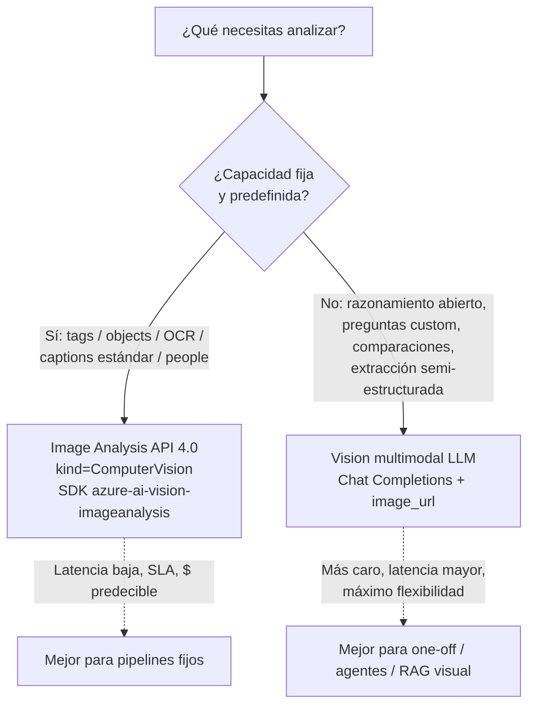
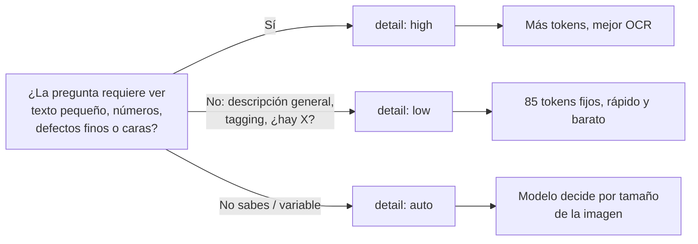

# Vision multimodal — Analyze visual content using multimodal models

> [!abstract] TL;DR
> Los **vision-enabled chat models** (gpt-4o, gpt-4.1 family, gpt-5, o4-mini, Phi-4-multimodal) aceptan imágenes en el mismo array `messages` del Chat Completions API usando objetos `{"type": "image_url", "image_url": {"url": ..., "detail": ...}}`. La URL debe ser HTTPS pública o un **data URI base64**. El parámetro `detail` (`low` / `high` / `auto`) controla el coste en tokens y la fidelidad. Hay un **límite duro de 10 imágenes por chat call**, **20 MB máximo por imagen** y formatos **JPEG / PNG / GIF (1.er frame) / WEBP**. Esta vía sustituye/complementa a la **Image Analysis API** clásica de Azure AI Vision: aquí la capacidad la define tu *prompt*, no un set fijo de modelos predefinidos.

## 🎯 Relevancia en el examen

- **Frecuencia 🔥🔥🔥** — entra casi seguro al menos una pregunta en C.2.
- **Tipos de pregunta esperados**:
  - "Choose the right service": Vision multimodal vs Image Analysis API vs Content Understanding (escenario que pide flexibilidad por prompt → LLM multimodal).
  - "Identify the payload shape": rellenar el `content` array con `text` + `image_url`.
  - "Why does the response truncate?": olvidaron `max_tokens` / `max_completion_tokens`.
  - "Why fails the request?": URL privada sin SAS, HEIC, > 20 MB, > 10 imágenes.
  - "Tokens math": calcular tokens con `detail=high` vs `detail=low`.
  - "Severity scale": para imágenes Content Safety devuelve **solo 0/2/4/6** (no 0-7).
- **Carryover AI-102**: parcial — el reconocimiento clásico (tags, objects, captions, OCR, people) sigue siendo Image Analysis API; lo *nuevo* en AI-103 es razonar sobre imágenes con un LLM.

## 📖 Concepto en profundidad

### Cambio de paradigma: del "tagging fijo" al "prompting visual"

En AI-102 la respuesta canónica para "analizar una imagen" era llamar a **Image Analysis API 4.0** (`Microsoft.CognitiveServices/accounts` con `kind=ComputerVision`) y pedir features predefinidas (`tags`, `objects`, `caption`, `read`, `people`, `smartCrops`, `denseCaptions`). En AI-103 el patrón dominante es enviar la imagen a un **vision-enabled chat model** (LLM multimodal) y preguntar *en lenguaje natural* lo que quieras. La capacidad ya no la fija Microsoft sino tu prompt.



### Modelos multimodales soportados (verificado contra Foundry Models, 2026-05)

| Modelo | Vision input | Audio I/O | Video | Status | Notas examen |
|---|---|---|---|---|---|
| `gpt-4o` | ✅ | ✅ (`gpt-4o-audio-preview`) | ✗ | GA | Ejemplo canónico de docs |
| `gpt-4o-mini` | ✅ | ✗ | ✗ | GA | Más barato, vision capable |
| `gpt-4.1` | ✅ | ✗ | ✗ | GA | Larger context, vision GA |
| `gpt-4.1-mini` | ✅ | ✗ | ✗ | GA | Same vision API shape |
| `gpt-5` | ✅ | (preview) | (preview) | GA | Reasoning + vision unified |
| `o4-mini` | ✅ | ✗ | ✗ | GA | ⚠️ Reasoning model: usa `max_completion_tokens`, **no** `max_tokens` |
| `Phi-4-multimodal-instruct` | ✅ | ✅ | ✗ | GA (Models-as-a-Service) | SLM open-weights |
| `gpt-4-turbo with vision` | ✅ | ✗ | ✗ | Legacy | Predecesor de gpt-4o, mantenido por retrocompatibilidad |

> [!warning] ⚠️ Para **o-series** (`o3`, `o4-mini`, etc.) reemplaza `max_tokens` por `max_completion_tokens`. Es la trampa más recurrente del examen tras la salida de razonadores.

### Anatomía exacta del payload

El cuerpo de chat completions cambia solo en que `content` deja de ser un string y pasa a ser un **array de parts**:

```json
{
  "model": "MODEL-DEPLOYMENT-NAME",
  "messages": [
    { "role": "system", "content": "You are a helpful assistant." },
    {
      "role": "user",
      "content": [
        { "type": "text", "text": "Describe this picture:" },
        {
          "type": "image_url",
          "image_url": {
            "url": "<image URL or data URI>",
            "detail": "auto"
          }
        }
      ]
    }
  ],
  "max_tokens": 2000,
  "stream": false
}
```

Tres tipos de **`url`** son válidos:

1. **HTTPS público** (verbatim docs: *"a valid publicly accessible HTTP or HTTPS URL"*).
2. **SAS URL** a Blob Storage **siempre que** habilites Managed Identity en el recurso Azure OpenAI y le asignes el rol **Storage Blob Reader** (docs `gpt-with-vision`).
3. **Data URI base64**: `data:image/jpeg;base64,<…>`.

### El parámetro `detail` y la economía de tokens

> Cita verbatim de Microsoft Learn: *"You can optionally define a `"detail"` parameter in the `"image_url"` field. Choose one of three values, `low`, `high`, or `auto`"*.

| Valor | Comportamiento (verbatim docs) | Coste indicativo |
|---|---|---|
| `auto` (default) | *"The model decides between low or high based on the size of the image input."* | Variable |
| `low` | *"the model doesn't activate the 'high res' mode, instead processes a lower resolution 512x512 version, resulting in quicker responses and reduced token consumption"*. | **85 tokens fijos** (base) |
| `high` | *"the model activates 'high res' mode. Here, the model initially views the low-resolution image and then generates detailed 512x512 segments from the input image. Each segment uses double the token budget"*. | **85 + 170 × N tiles** (tile = 512×512) |

Fórmula `high` (modelo de tile típica de GPT-4o, docs `overview#image-tokens-gpt-4-turbo-with-vision`):



Ejemplo (verbatim del *Example image price calculation* de docs):

| Item | Detail | Cost |
|---|---|---|
| Text prompt input | 100 text tokens | $0.001 |
| Example image input | **170 + 85 image tokens** | $0.00255 |
| Output Tokens | 100 tokens (assumed) | $0.003 |

### `Image Analysis API` vs `Vision multimodal LLM` (decisión de arquitectura)



| Dimensión | Vision multimodal LLM | Image Analysis API 4.0 |
|---|---|---|
| Resource provider | Azure OpenAI (`Microsoft.CognitiveServices/accounts` `kind=OpenAI` o `kind=AIServices`) | Azure AI Vision (`Microsoft.CognitiveServices/accounts` `kind=ComputerVision`) |
| Endpoint | `POST {res}.openai.azure.com/openai/v1/chat/completions` | `POST {res}.cognitiveservices.azure.com/computervision/imageanalysis:analyze?api-version=2024-02-01` |
| Python SDK | `openai` (`AzureOpenAI`) o `azure-ai-projects` (`AIProjectClient`) | `azure-ai-vision-imageanalysis` (`ImageAnalysisClient`) |
| Capabilities | Lo que tu prompt pueda describir | Set fijo: `tags`, `objects`, `caption`, `denseCaptions`, `read`, `people`, `smartCrops` |
| Customization | Prompt + few-shot + Structured Outputs | Florence-2 custom model (entrenamiento custom) |
| Coste | Por token (input image-tokens + output text-tokens) | Por transacción (≈ $1 / 1 000 calls S1) |
| Latencia típica | 1–8 s | 200–800 ms |
| Determinismo | Bajo (LLM) — usa `temperature=0` y Structured Outputs | Alto |
| Mejor para | Visual QA, document understanding ad-hoc, agentes con imágenes, ground-truth comparison | Indexación a escala, moderación, accesibilidad (alt-text automática), pipelines con SLA |

Veáse [[vision-azure-ai-vision-image-analysis]] para el lado clásico.

## 🏗️ Cómo se hace (Python SDK + REST + Foundry Agent)

### 1. Cliente Azure OpenAI moderno con Entra ID (recomendado)

```python
import os
from openai import AzureOpenAI
from azure.identity import DefaultAzureCredential, get_bearer_token_provider

# Keyless auth con Entra ID (rol "Cognitive Services User")
token_provider = get_bearer_token_provider(
    DefaultAzureCredential(),
    "https://cognitiveservices.azure.com/.default",
)

client = AzureOpenAI(
    azure_endpoint=os.environ["AZURE_OPENAI_ENDPOINT"],   # https://<res>.openai.azure.com/
    azure_ad_token_provider=token_provider,
    api_version="2024-10-21",                              # o "preview" para features recientes
)

response = client.chat.completions.create(
    model="gpt-4o",                                        # deployment name
    messages=[
        {"role": "system", "content": "You are a helpful assistant."},
        {
            "role": "user",
            "content": [
                {"type": "text", "text": "Describe this picture:"},
                {
                    "type": "image_url",
                    "image_url": {
                        "url": "https://example.com/cat.jpg",
                        "detail": "auto",   # low | high | auto
                    },
                },
            ],
        },
    ],
    max_tokens=2000,
)
print(response.choices[0].message.content)
print(response.usage)   # prompt_tokens incluye los image-tokens
```

### 2. Imagen local → data URI base64 (patrón verbatim de docs)

```python
import base64
from mimetypes import guess_type

def local_image_to_data_url(image_path: str) -> str:
    mime_type, _ = guess_type(image_path)
    if mime_type is None:
        mime_type = "application/octet-stream"
    with open(image_path, "rb") as f:
        b64 = base64.b64encode(f.read()).decode("utf-8")
    return f"data:{mime_type};base64,{b64}"

data_url = local_image_to_data_url("receipt.jpg")

response = client.chat.completions.create(
    model="gpt-4o",
    messages=[{
        "role": "user",
        "content": [
            {"type": "text", "text": "Extract all line items as JSON."},
            {"type": "image_url", "image_url": {"url": data_url, "detail": "high"}},
        ],
    }],
    max_tokens=1500,
)
```

### 3. Multi-image (comparación)

```python
content = [
    {"type": "text", "text": "Which of these two products looks higher quality? Justify briefly."},
    {"type": "image_url", "image_url": {"url": product_a_url, "detail": "high"}},
    {"type": "image_url", "image_url": {"url": product_b_url, "detail": "high"}},
]

response = client.chat.completions.create(
    model="gpt-4o",
    messages=[{"role": "user", "content": content}],
    max_tokens=800,
)
```

> [!warning] **Límite duro**: docs verbatim → *"When uploading images, there's a limit of 10 images per chat call."* (gpt-4o). Si necesitas más, *chunkea* en threads sucesivos.

### 4. Structured Outputs sobre imágenes (Pydantic)

```python
from pydantic import BaseModel

class ProductAnalysis(BaseModel):
    category: str
    primary_color: str
    visible_brand: str | None
    estimated_price_range_usd: str
    quality_score_1_to_10: int

response = client.beta.chat.completions.parse(
    model="gpt-4o",
    messages=[{
        "role": "user",
        "content": [
            {"type": "text", "text": "Analyze this product image."},
            {"type": "image_url", "image_url": {"url": product_img, "detail": "high"}},
        ],
    }],
    response_format=ProductAnalysis,
)

analysis: ProductAnalysis = response.choices[0].message.parsed
```

Veáse [[genai-structured-outputs]] para el contrato completo.

### 5. o-series con reasoning + vision (gpt-5, o4-mini)

```python
response = client.chat.completions.create(
    model="o4-mini",
    messages=[{
        "role": "user",
        "content": [
            {"type": "text", "text": "Reason step by step: is this an authentic invoice?"},
            {"type": "image_url", "image_url": {"url": doc_url, "detail": "high"}},
        ],
    }],
    max_completion_tokens=4000,   # ⚠️ NO max_tokens en o-series
)
```

### 6. REST puro (CURL-equivalent) — útil cuando preguntan por endpoints

```http
POST https://{RESOURCE_NAME}.openai.azure.com/openai/v1/chat/completions
Content-Type: application/json
api-key: {API_KEY}

{
  "model": "gpt-4o",
  "messages": [
    { "role": "user", "content": [
      { "type": "text", "text": "What's in this image?" },
      { "type": "image_url", "image_url": { "url": "https://…/cat.jpg" } }
    ]}
  ],
  "max_tokens": 800
}
```

> El path canónico **v1** en Foundry es `/openai/v1/chat/completions` (sin `?api-version=...` cuando usas el rooted v1 endpoint). El legacy `/openai/deployments/{deployment}/chat/completions?api-version=…` también sigue siendo válido.

### 7. Foundry Agent Service — imágenes en thread messages

```python
from azure.ai.projects import AIProjectClient
from azure.identity import DefaultAzureCredential

project = AIProjectClient(endpoint=os.environ["PROJECT_ENDPOINT"],
                          credential=DefaultAzureCredential())

thread = project.agents.threads.create()

project.agents.messages.create(
    thread_id=thread.id,
    role="user",
    content=[
        {"type": "text", "text": "What is wrong with the equipment in this photo?"},
        {"type": "image_url", "image_url": {"url": user_uploaded_url}},
    ],
)

run = project.agents.runs.create_and_process(thread_id=thread.id, agent_id=agent.id)
```

Veáse [[genai-agent-service-overview]] para tools y flujo completo.

## 📊 Cuándo usar cada modo + límites operativos

### Decisión rápida `detail`



### Limitaciones de entrada (verbatim docs `gpt-with-vision#input-limitations`)

| Limit | Valor |
|---|---|
| Maximum input image size | **20 MB** |
| Maximum images per chat call | **10** (gpt-4o; varía por modelo) |
| Supported formats | **JPEG, PNG, GIF (first frame only), WEBP** |
| `low` detail resize | 512×512 |
| `high` detail short side | 768 px tras encajar en 2048×2048 |
| `high` detail tile size | 512×512 |
| `high` detail base tokens | 85 |
| `high` detail per-tile tokens | 170 |
| Output formats | Texto (chat completion) — para extraer JSON usa Structured Outputs |
| Image fetching | El modelo hace fetch HTTPS público desde el servicio; URLs privadas requieren SAS + role Storage Blob Reader en el recurso AOAI |

⚠️ **HEIC, RAW (CR2/NEF/ARW), TIFF, BMP, SVG, PDF**: **no soportados directamente** — convierte a JPEG/PNG antes. Para PDFs y formularios, usa [[extract-document-intelligence-prebuilt]] o [[extract-content-understanding-multimodal]].

## 🪤 Trampas del examen

1. **`max_tokens` faltante → respuesta truncada**. Verbatim docs: *"Remember to set a `"max_tokens"` or `max_completion_tokens` value, or the return output will be cut off."* Pregunta típica: "¿Por qué la respuesta se corta?".
2. **o-series y reasoning models exigen `max_completion_tokens`**, no `max_tokens`. Si el examen menciona `o3`, `o4-mini`, `gpt-5` con reasoning, este es el discriminador.
3. **Severity de imagen es 0/2/4/6, NO 0-7**. Verbatim docs Content Safety: *"The current version of the image model supports the trimmed version of the full 0-7 severity scale. The classifier only returns severities 0, 2, 4, and 6"*. La de **texto** sí es 0-7. La de **image-with-text (multimodal)** sí es 0-7.
4. **URL privada sin SAS → falla**. Si la imagen está en un Blob privado: o (a) generas SAS, o (b) habilitas Managed Identity en el recurso AOAI + asignas **Storage Blob Reader**, o (c) inline base64.
5. **HEIC del iPhone** y **RAW** no se aceptan → convierte a JPEG. Trampa frecuente en escenarios de móvil.
6. **10 imágenes máx por chat call** en gpt-4o. Si el escenario habla de "batch de 50", la respuesta correcta NO es vision LLM — usa Image Analysis API en lote o trocea.
7. **GIF: solo el primer frame** se analiza (docs verbatim). Para video → Content Understanding video analyzer o Video Indexer, NO chat vision.
8. **Image Analysis API ≠ Vision multimodal** son recursos ARM **distintos** (kinds distintos): `kind=ComputerVision` vs `kind=OpenAI`/`kind=AIServices`. Pregunta de plan/deploy.
9. **`detail: low` para OCR fino** = mal resultado y queja del usuario. Para extraer texto pequeño o números → `high`.
10. **Image tokens ≠ text tokens en pricing**. El campo `usage.prompt_tokens` combina ambos; no asumas que prompt_tokens = solo tu texto.
11. **`gpt-4 Turbo with Vision` no permite desactivar content filtering** (docs verbatim). Si una pregunta dice "el cliente exige off content safety en gpt-4-turbo-vision" → imposible.
12. **Custom blocklists de Content Safety NO aplican a modalidad imagen** (solo texto). Si necesitas bloquear marcas o términos visuales → custom pipeline / Florence custom model.
13. **`finish_reason: "content_filter"`** = la respuesta se omitió por filtro. Distinto de `length` (max_tokens) y `stop` (normal).
14. **El endpoint Foundry v1** es `/openai/v1/chat/completions` (sin `?api-version`). Mantener legacy `/openai/deployments/{name}/chat/completions?api-version=...` también es válido — ambos formatos aparecen en docs y respuestas oficiales.
15. **El SDK `openai` (de OpenAI) es el oficial para Azure OpenAI** desde la deprecación de `azure-openai-*`. Usa `from openai import AzureOpenAI`. Pregunta de "qué paquete pip instalo": `pip install openai` (no `azure-openai`).
16. **Phi-4-multimodal** es Models-as-a-Service en Foundry: se despliega como serverless endpoint, no como AOAI. Endpoint y SDK distintos (`azure-ai-inference`).
17. **`response.usage.prompt_tokens`** mostrará ~85 con `detail: low` por imagen y ~85+170·N con `high`. Sirve para auditar coste.

## 🧠 Mnemotecnia

- **"TID"** — *Text, Image_url, Detail* — el orden mental de cada part del `content` array.
- **"85 + 170 × N"** — base tokens + per-tile (high). Rima: *ochenta-y-cinco más ciento-setenta por tile*.
- **"GIF = 1 frame"** — para video, NO uses chat vision.
- **"10 / 20 / 4"** — **10** imágenes max, **20** MB max por imagen, **4** formatos (JPEG, PNG, GIF, WEBP).
- **"o-series → completion"** — modelos `o*` usan `max_completion_tokens` (no `max_tokens`).
- **"Severities image = pares"** — 0, 2, 4, 6 (números pares). Texto = 0-7 (escala completa).
- **"Image Analysis = fijo; LLM = flex"** — choose-service question.

## 🔗 Conceptos relacionados

- [[vision-azure-ai-vision-image-analysis]] — Image Analysis API 4.0 clásica (carryover AI-102).
- [[vision-captioning-single-multi-image]] — Captioning específico y dense captions.
- [[vision-visual-qa-grounded]] — VQA con grounding y citation.
- [[vision-content-understanding-overview]] — Content Understanding (multimodal estructurado).
- [[extract-content-understanding-multimodal]] — Multimodal docs en E.2.
- [[genai-deploy-multimodal-models]] — Deployment types para modelos multimodales en Foundry.
- [[genai-azure-openai-foundry-models]] — Catálogo de modelos en Foundry (sold directly vs MaaS).
- [[genai-structured-outputs]] — `response_format` con Pydantic / JSON Schema.
- [[genai-agent-service-overview]] — Foundry Agent Service y thread messages.
- [[responsible-content-safety-overview]] — Content Safety y harm categories.
- [[00-microsoft-foundry-overview]] — Arquitectura Foundry.

## ❓ Autotest

**1.** Un cliente recibe respuestas truncadas a mitad de descripción al usar `gpt-4o` con imágenes. ¿Cuál es la causa más probable?

a. La imagen pesa más de 20 MB.
b. Falta el parámetro `max_tokens` (o `max_completion_tokens` en o-series), por lo que el output se corta en el default bajo.
c. El parámetro `detail` está en `low`.
d. Se requiere `stream=true` para imágenes.

<details><summary>Respuesta</summary>**b)**. Verbatim docs: *"Remember to set a `"max_tokens"` or `max_completion_tokens` value, or the return output will be cut off."* `detail: low` afecta a la lectura de la imagen, no al output. El tamaño 20 MB sí es límite duro pero produce un error, no truncamiento.</details>

**2.** Necesitas analizar 35 imágenes en una sola llamada con `gpt-4o`. ¿Qué haces?

a. Aumentar `max_tokens` a 100 000.
b. Usar Image Analysis API en su lugar o trocear en varias llamadas chat: existe un límite de 10 imágenes por chat call.
c. Activar `detail: low` para todas.
d. Cambiar a `gpt-4o-audio`.

<details><summary>Respuesta</summary>**b)**. Docs: *"there's a limit of 10 images per chat request"*. Si el caso de uso es escaneo masivo con capacidades fijas, Image Analysis API (`kind=ComputerVision`) es la opción correcta; si necesitas razonar con LLM, divide en threads.</details>

**3.** Un equipo de moderación pide saber qué severidades devuelve Content Safety para una imagen explícita. ¿Qué responden las docs?

a. Una escala continua de 0 a 100.
b. Los enteros 0, 2, 4 y 6 únicamente.
c. La escala completa 0-7 como en texto.
d. `safe` / `flagged` (binario).

<details><summary>Respuesta</summary>**b)**. Verbatim: *"The current version of the image model supports the trimmed version of the full 0-7 severity scale. The classifier only returns severities 0, 2, 4, and 6"*. Texto sí usa 0-7 completa; multimodal image-with-text también 0-7.</details>

**4.** La imagen está en un container privado de Azure Blob. ¿Cuál NO es una solución válida documentada?

a. Generar una SAS URL y pasarla en `image_url.url`.
b. Convertir la imagen a data URI base64 e incluirla inline.
c. Habilitar Managed Identity en el recurso AOAI y asignarle `Storage Blob Reader` sobre el container.
d. Configurar Azure Front Door para reescribir la URL como pública sin autenticación.

<details><summary>Respuesta</summary>**d)**. Es un anti-patrón de seguridad y no aparece en docs. Las tres opciones a/b/c sí están documentadas (SAS, base64, o MI + Storage Blob Reader).</details>

**5.** Necesitas extraer cantidades, IBANs y firmas de un recibo escaneado JPEG con la mejor precisión visual posible en una sola llamada a `gpt-4o`. ¿Configuración correcta?

a. `detail: low`, `max_tokens: 200`.
b. `detail: high`, `max_tokens` suficiente (p.ej. 2000), y opcionalmente `response_format` con un Pydantic `BankTransfer(amount, iban, signature_present)`.
c. `detail: auto`, sin `max_tokens`.
d. Convertir el JPEG a HEIC y reenviar.

<details><summary>Respuesta</summary>**b)**. `high` activa tiles 512×512 con 170 tokens cada uno → mejor lectura de texto pequeño. Structured Outputs garantiza schema válido. HEIC no está soportado.</details>

**6.** ¿Qué SDK / pip-package es el oficial 2026 para llamar a `gpt-4o` con visión en Azure OpenAI desde Python?

a. `azure-openai`.
b. `openai` (clase `AzureOpenAI`).
c. `azure-ai-vision-imageanalysis`.
d. `azure-ai-textanalytics`.

<details><summary>Respuesta</summary>**b)**. Docs verbatim: `pip install openai` y `from openai import AzureOpenAI`. La librería la mantiene OpenAI con tipos específicos de Azure. `azure-ai-vision-imageanalysis` es para la Image Analysis API clásica.</details>

## ✅ Control de calidad (auto-rúbrica)

| Dimensión | Nota | Justificación |
|---|---|---|
| Completitud | 9.5 | Cubre modelos, payload, detail, multi-image, limits, structured outputs, agent service, comparación con Image Analysis API, content safety, o-series. |
| Exactitud técnica | 9.7 | Cada límite y citación verificada verbatim en `gpt-with-vision` docs (verificado 2026-05-23). Severidades imagen 0/2/4/6 verificadas en harm-categories. |
| Alineación al examen | 9.5 | Trampas centradas en patrones reales: max_tokens, o-series tokens, severity scale, 10 images limit, HEIC, kinds ARM distintos. |
| Claridad pedagógica | 9.3 | Mermaid de flujo, tabla comparativa, mnemónicos, decision tree, autotest con explicación. |

*Verificado a fecha 2026-05-23 contra Microsoft Learn (`gpt-with-vision`, `harm-categories`, `models`, `overview-image-analysis`).*
