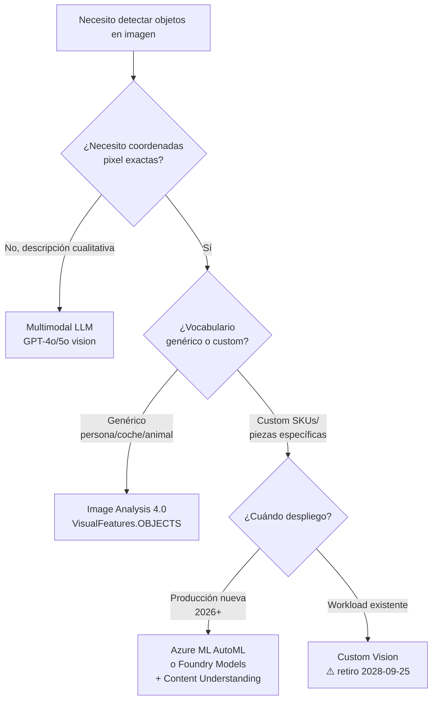
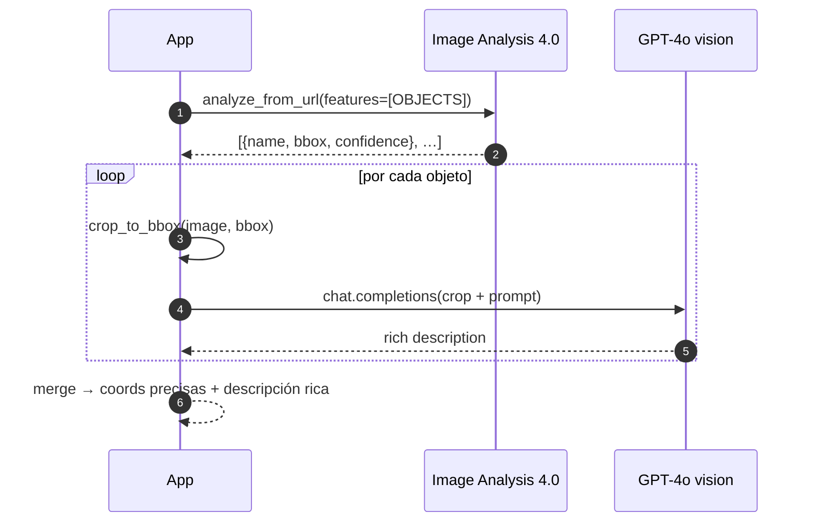

# Object detection multimodal — Image Analysis 4.0 vs Custom Vision vs LLM con visión

> [!abstract] TL;DR
> En AI-103 hay **tres caminos** para detectar objetos: (1) **Image Analysis 4.0 Objects** (`VisualFeatures.OBJECTS`) — vocabulario fijo, **bounding boxes precisos en píxeles**, barato y rápido; (2) **Custom Vision** — entrenable con etiquetas propias pero **anunciado para retiro el 25-09-2028**, migración recomendada a Azure ML AutoML / Foundry Models / Content Understanding; (3) **Modelos multimodales (GPT-4o, GPT-5o vision)** — vocabulario abierto y razonamiento, pero **NO devuelven coordenadas pixel reales**. El examen prueba reconocer el approach correcto por escenario y conocer la trampa del bbox alucinado por LLM.

## 🎯 Relevancia en el examen

| Tipo de pregunta | Frecuencia |
|---|---|
| Escenario "necesito bbox preciso de objetos genéricos" → Image Analysis 4.0 | 🔥🔥🔥 |
| Escenario "custom SKU/parts" → Custom Vision (con caveat retirement) o AutoML | 🔥🔥 |
| Escenario "razonar sobre imagen" / "anomalías" → multimodal LLM | 🔥🔥🔥 |
| Trampa: pedir bbox a GPT-4o → no fiable | 🔥🔥🔥 |
| Hybrid pattern (IA 4.0 + LLM sobre crops) | 🔥🔥 |
| Confidence threshold y limitaciones (objetos < 5 % imagen) | 🔥🔥 |

## 📖 Concepto en profundidad

### Definición canónica

Object detection = identificar **qué** objetos hay + **dónde** están (coordenadas) + **qué tan seguro** está el modelo. Output canónico:

`[{label, bounding_box, confidence}, …]`

Difiere de **image tagging** en que tagging produce etiquetas a nivel **imagen completa** (sin localización) y puede incluir conceptos abstractos (*indoor*, *outdoor*) que no son localizables; object detection **solo retorna objetos y seres vivos físicos** con sus coordenadas. (Microsoft Learn: *"there's no formal relationship between the tagging taxonomy and the object detection taxonomy"*.)

### Tres approaches en Azure (2026)



### Tabla comparativa quirúrgica

| Atributo | Image Analysis 4.0 Objects | Custom Vision Object Detection | Multimodal LLM (GPT-4o vision) |
|---|---|---|---|
| **Servicio Azure** | Azure AI Vision (RP `Microsoft.CognitiveServices/accounts`, `kind=ComputerVision` o `kind=AIServices`) | Azure AI Custom Vision (training + prediction resources separados) | Azure OpenAI / Microsoft Foundry deployment |
| **Estado 2026** | GA | ⚠️ Retiring **2028-09-25**, soporte hasta esa fecha | GA (con vision-enabled chat models) |
| **Vocabulario** | Pre-entrenado, fijo (miles de clases) | Custom (tú defines las labels) | Open-ended (lo que sepas describir en prompt) |
| **Bounding boxes** | ✅ Pixel-precise `{x,y,w,h}` | ✅ Pixel-precise (normalizado 0-1 según export) | ❌ Solo cualitativo ("top-left", "centro") |
| **Custom classes** | ❌ | ✅ | ✅ vía prompt (no entrenable) |
| **Entrenamiento** | No necesario | Requiere ≥ **50 imágenes/label** recomendado (15 mínimo absoluto en clasificación) | No |
| **Coste típico** | Por imagen analizada | Por hora de entrenamiento + por predicción | Por token (image tokens + completion) |
| **Latencia** | < 500 ms | < 500 ms | 1-3 s (más con `detail: "high"`) |
| **Feature enum (SDK Py)** | `VisualFeatures.OBJECTS` | n/a | n/a |
| **Migración recomendada** | n/a | Azure ML AutoML · Foundry Models · Content Understanding | n/a |

> [!warning] Trampa de naming
> En docs Foundry todos los servicios aparecen como *"… in Foundry Tools"* (ej. **Object detection using Image Analysis 4.0 - Foundry Tools**). El kind del recurso ARM puede ser `ComputerVision` (legacy single-service) o `AIServices` (multi-service Foundry resource). Ambos exponen Image Analysis 4.0.

## 🏗️ Cómo se hace

### Image Analysis 4.0 — Objects feature (Python SDK)

**Paquete pip oficial:** `azure-ai-vision-imageanalysis`

```python
from azure.ai.vision.imageanalysis import ImageAnalysisClient
from azure.ai.vision.imageanalysis.models import VisualFeatures
from azure.core.credentials import AzureKeyCredential

client = ImageAnalysisClient(
    endpoint="https://<resource>.cognitiveservices.azure.com/",
    credential=AzureKeyCredential("<key>")
)

# analyze_from_url para imágenes accesibles públicamente
result = client.analyze_from_url(
    image_url="https://example.com/kitchen.jpg",
    visual_features=[VisualFeatures.OBJECTS],
    language="en"  # default
)

# Iteración oficial sobre objects (verificada contra docs Python SDK)
if result.objects is not None:
    for obj in result.objects.list:
        # ⚠️ La SDK expone los tags como lista (siempre length 1 en práctica)
        name       = obj.tags[0].name
        confidence = obj.tags[0].confidence
        bbox       = obj.bounding_box  # {x, y, width, height} en píxeles
        print(f"{name} ({confidence:.2f}) @ {bbox}")
```

**Para imagen local (bytes):**

```python
with open("sample.jpg", "rb") as f:
    image_data = f.read()
result = client.analyze(image_data=image_data, visual_features=[VisualFeatures.OBJECTS])
```

### Response shape REST (verbatim Microsoft Learn)

```json
{
  "metadata": { "width": 1260, "height": 473 },
  "objectsResult": {
    "values": [
      { "name": "Laptop",  "confidence": 0.85,  "boundingBox": {"x":471,"y":218,"w":289,"h":226} },
      { "name": "person",  "confidence": 0.855, "boundingBox": {"x":654,"y":0,  "w":584,"h":473} }
    ]
  }
}
```

> [!tip] Asimetría REST vs SDK
> En **REST** el objeto tiene `name` + `confidence` a nivel raíz dentro de `objectsResult.values[]`. En la **SDK Python** la misma información se accede vía `obj.tags[0].name` / `obj.tags[0].confidence`. El examen puede preguntar la forma JSON exacta (REST) — memorízala así, no como `tags[]`.

### Multimodal LLM — "detection" descriptivo con structured outputs

```python
from openai import AzureOpenAI
from pydantic import BaseModel

class DetectedObject(BaseModel):
    name: str
    approximate_location: str   # "top-left", "center", "bottom-right quadrant"
    estimated_relative_size: str  # "small", "medium", "large"

class DetectionResult(BaseModel):
    objects: list[DetectedObject]
    total_count: int

client = AzureOpenAI(api_version="2025-04-01-preview", azure_endpoint="...", api_key="...")

response = client.beta.chat.completions.parse(
    model="gpt-4o",  # deployment name
    messages=[{
        "role": "user",
        "content": [
            {"type": "text",
             "text": "List every visible object with its approximate location and size. "
                     "Do NOT invent pixel coordinates."},
            {"type": "image_url",
             "image_url": {"url": img_url, "detail": "high"}}
        ]
    }],
    response_format=DetectionResult
)
detected: DetectionResult = response.choices[0].message.parsed
```

⚠️ **No pidas bounding boxes en píxeles al LLM — los alucina.** Si necesitas coords, hibrida con Image Analysis 4.0.

### Detail levels para vision-enabled chat models

| Setting | Procesado | Coste tokens | Cuándo |
|---|---|---|---|
| `"low"` | 512×512 fijo | menor | Fine detail no crítico, escenas claras |
| `"high"` | Vista low-res + segmentos 512×512 (cada uno doble token budget) | mayor | OCR fino, objetos pequeños, lectura de texto |
| `"auto"` | El modelo decide | variable | Default razonable |

### Hybrid pattern (precisión + razonamiento)

```python
# Paso 1: Image Analysis 4.0 detecta y devuelve bbox píxel
ia_result = client_ia.analyze_from_url(image_url=url, visual_features=[VisualFeatures.OBJECTS])

annotations = []
for obj in ia_result.objects.list:
    name = obj.tags[0].name
    bbox = obj.bounding_box
    crop = crop_image(url, bbox)  # función propia (PIL/Pillow)

    # Paso 2: LLM razona sobre el crop individual
    llm_desc = client_aoai.chat.completions.create(
        model="gpt-4o",
        messages=[{"role": "user", "content": [
            {"type": "text", "text": f"Describe this {name} in detail (brand, condition, color)."},
            {"type": "image_url", "image_url": {"url": crop, "detail": "high"}}
        ]}]
    ).choices[0].message.content

    annotations.append({"label": name, "bbox": bbox, "rich_description": llm_desc})
```



## 📊 Cuándo usar qué (árbol de decisión)

### ✅ Image Analysis 4.0 Objects

- Objetos **genéricos** (persona, coche, animal, mueble, electrodoméstico).
- Necesitas **coordenadas pixel** para crop, overlay, métricas espaciales.
- High-throughput pipelines, coste bajo.
- Latencia real-time (< 500 ms).

### ✅ Custom Vision (legacy — sólo si ya existe)

- Etiquetas **custom muy específicas** (SKUs producto, piezas mecánicas concretas).
- Vocabulario nicho que el modelo genérico ignora.
- ⚠️ Para nuevos proyectos en 2026 prefiere **Azure ML AutoML** (vision) o **Content Understanding** (clasificación) o **Foundry Models** (custom fine-tuning de modelos visuales).

### ✅ Multimodal LLM (GPT-4o vision / GPT-5o vision)

- Queries **abiertas** ("¿hay algo inusual?", "¿alguien sin casco?").
- **Razonamiento** sobre relación entre objetos.
- VQA combinado con detección (responde + describe).
- Zero training, prototipo rápido.
- ⚠️ No para coordenadas pixel exactas.

### Casos de uso reales

| Caso | Approach óptimo |
|---|---|
| Conteo de personas en una estación (bbox + counting) | Image Analysis 4.0 (`OBJECTS` + `PEOPLE` features) |
| Conteo de unidades SKU "Coca-Cola 500 ml" vs "Pepsi 500 ml" | Custom Vision / Azure ML AutoML |
| Auditoría PPE: "¿alguien sin casco?" | LLM multimodal sobre frame (o IA 4.0 detecta personas + LLM revisa cada crop) |
| Estimación daños siniestro auto | Hybrid: IA 4.0 (bbox del vehículo) + LLM (descripción del daño) |
| Análisis vídeo de seguridad | Azure AI Video Indexer (frames + análisis temporal) → [[vision-azure-video-indexer]] |

## 🪤 Trampas del examen

1. **Multimodal LLM NO devuelve bbox píxel reales.** Si pregunta exige *"precise coordinates"* → respuesta es Image Analysis 4.0 / Custom Vision, NUNCA GPT-4o vision.
2. **`VisualFeatures.OBJECTS` ≠ `VisualFeatures.TAGS`.** Objects = bbox + label localizable. Tags = labels a nivel imagen (incluye conceptos abstractos como *indoor* que NO se pueden localizar).
3. **Custom Vision retirement: 25 de septiembre de 2028** (verbatim docs). Para escenarios nuevos, examen acepta migración a **Azure ML AutoML**, **Foundry Models** o **Content Understanding**. Memoriza ese trío.
4. **Image Analysis 4.0 NO diferencia por marca / SKU** ("doesn't differentiate by brand or product names" — verbatim). Si la pregunta involucra brand → Custom Vision o **Brand detection feature** (legacy separate).
5. **Objetos pequeños (< 5 % de la imagen) NO se detectan** consistently con Image Analysis 4.0. Igual que objetos amontonados (pila de platos).
6. **Vocabulario fijo** en Image Analysis 4.0: si el escenario dice "necesito entrenar con mis propias clases" → NO es Image Analysis.
7. **Respuesta REST vs SDK Python:** REST tiene `objectsResult.values[].name`; Python SDK expone `obj.tags[0].name`. Ambas formas son válidas según la capa.
8. **Custom Vision requiere training resource + prediction resource separados** (dos recursos Azure). El examen lo puede preguntar.
9. **Custom Vision recommended minimum: 50 imágenes por label** (no 15; 15 es mínimo absoluto técnico). Para object detection con buena accuracy: 50+.
10. **Hybrid pattern (IA 4.0 + LLM)** es el patrón canónico de producción cuando necesitas coords + razonamiento; el examen valora reconocerlo.
11. **Detail `"high"` en GPT-4o vision multiplica el coste** (cada tile 512×512 dobla token budget) — no usarlo "por defecto" en escenarios cost-sensitive.
12. **Image Analysis 4.0 GA endpoint** difiere del antiguo Computer Vision 3.2; el path REST es `/computervision/imageanalysis:analyze?api-version=…&features=Objects`.
13. **Video object detection** = frames + análisis per-frame (cost balloon). Para video, **Azure AI Video Indexer** es el servicio especializado.
14. **NorthCentralUS** es la única región donde Custom Vision puede replicar fuera del data residency local (caveat de docs).
15. **LLM counting degrada con > 20 objetos**, solapamiento u oclusión; no es métricamente fiable.

## 🧠 Mnemotecnia

- **"O-C-L"** para los tres approaches:
  - **O**bjects API → coords objetivas, vocab fijo.
  - **C**ustom Vision → custom labels (legacy).
  - **L**LM vision → cualitativo, razona.
- **"BBox = no LLM"**: si la pregunta menciona *"bounding box coordinates"*, *"pixel positions"*, *"localize precisely"* → descartar GPT-4o vision automáticamente.
- **"5-5-25"**:
  - **5 %** = umbral mínimo de tamaño de objeto detectable en IA 4.0.
  - **50** imágenes por label recomendadas en Custom Vision.
  - **25-09-2028** = fecha retiro Custom Vision.
- **"AUM"** para alternativas a Custom Vision: **A**zure ML AutoML, **U**nderstanding (Content Understanding), **M**odels (Foundry Models).

## 🔗 Conceptos relacionados

- [[vision-multimodal-visual-analysis]] — visión general de análisis multimodal.
- [[vision-azure-ai-vision-image-analysis]] — Image Analysis 4.0 deep dive (todas las features).
- [[vision-custom-vision-object-detection]] — flujo de entrenamiento Custom Vision (carryover AI-102).
- [[vision-azure-video-indexer]] — detección de objetos en video.
- [[vision-content-understanding-visual-attributes]] — alternativa moderna para clasificación custom.
- [[vision-captioning-single-multi-image]] — captions con LLM y con IA 4.0.
- [[vision-visual-qa-grounded]] — VQA y grounding visual.
- [[genai-structured-outputs]] — Pydantic + `response_format` para parsing fiable de respuestas LLM.
- [[plan-deployment-options-models-agents]] — deployment tiers de modelos vision.

## ❓ Autotest

**1.** Un cliente necesita contar **exactamente cuántos coches** hay en el parking de una fábrica cada minuto, dibujar un rectángulo sobre cada uno y enviar las coordenadas a un sistema downstream. ¿Qué servicio recomiendas?

- a) GPT-4o vision con structured output Pydantic.
- b) Image Analysis 4.0 con `VisualFeatures.OBJECTS`.
- c) Custom Vision entrenado con 30 imágenes.
- d) Content Understanding en preview.

<details><summary>Respuesta</summary>

**b)**. Necesita **bounding boxes precisos en píxeles** sobre objetos genéricos ("coche"). Image Analysis 4.0 con `VisualFeatures.OBJECTS` devuelve `bounding_box {x,y,w,h}` exacto, vocab incluye *car/vehicle*, latencia < 500 ms, coste bajo. GPT-4o (a) alucina coordenadas. Custom Vision (c) está retirando + 30 imágenes < 50 recomendado. Content Understanding (d) hace clasificación / extracción, no bbox.

</details>

**2.** ¿Cuál de estas afirmaciones sobre Custom Vision es **correcta** en mayo de 2026?

- a) Es la opción recomendada para object detection custom en nuevos proyectos.
- b) Microsoft anunció su retiro para el 25 de septiembre de 2028; alternativas: Azure ML AutoML, Foundry Models, Content Understanding.
- c) Sustituye a Image Analysis 4.0.
- d) Requiere un único recurso Azure que combina training y prediction.

<details><summary>Respuesta</summary>

**b)**. Microsoft Learn lo dice verbatim: *"Microsoft is announcing the planned retirement of the Azure Custom Vision service. Microsoft will provide full support … until 9/25/2028"*. Las migraciones recomendadas oficialmente son **Azure ML AutoML** (clasificación + object detection), **Foundry Models** (genAI custom) y **Content Understanding** (clasificación managed). (d) es falso: Custom Vision usa dos recursos separados.

</details>

**3.** Para un escenario de **auditoría de cumplimiento PPE** ("detecta si algún operario en la planta NO lleva casco") con razonamiento abierto y sin necesidad de entrenamiento previo, ¿qué patrón es **más apropiado**?

- a) Multimodal LLM (GPT-4o vision) sobre la imagen completa con prompt específico.
- b) Image Analysis 4.0 con `VisualFeatures.TAGS`.
- c) Custom Vision entrenado con imágenes de cascos.
- d) Image Analysis 4.0 + Brand detection.

<details><summary>Respuesta</summary>

**a)** (o un hybrid). La pregunta requiere **razonamiento** (ausencia de casco en persona detectada), vocabulario abierto, sin training. GPT-4o vision puede analizar "¿alguien sin casco?" con un prompt. El hybrid óptimo en producción sería IA 4.0 (`OBJECTS`/`PEOPLE` para bbox) + LLM razonando sobre cada crop de persona, pero entre las opciones dadas la a) es la correcta. Tags (b) no detecta ausencia. Custom Vision (c) requeriría training. Brand detection (d) es para logos, irrelevante.

</details>

**4.** ¿Cuál es el **output JSON correcto** del feature Objects de Image Analysis 4.0?

- a) `{"objects": [{"label": "...", "score": 0.9, "rect": [x,y,w,h]}]}`
- b) `{"objectsResult": {"values": [{"name": "...", "confidence": 0.9, "boundingBox": {"x":..,"y":..,"w":..,"h":..}}]}}`
- c) `{"detections": [{"class": "...", "prob": 0.9, "polygon": [[x,y],...]}]}`
- d) `{"results": [{"object": "...", "score": 0.9, "bbox": [x1,y1,x2,y2]}]}`

<details><summary>Respuesta</summary>

**b)**. Estructura verbatim de docs: `objectsResult.values[]` con `name`, `confidence`, `boundingBox: {x,y,w,h}` (esquinas top-left + width/height en píxeles). Memorízalo, aparece en preguntas REST.

</details>

**5.** Un equipo de producto pide al LLM (GPT-4o vision) que devuelva *"the exact pixel coordinates of every defect on this PCB image"*. El modelo responde con `{x: 234, y: 567, w: 45, h: 30}` para cada defecto. ¿Cuál es el problema y la mitigación correcta?

- a) Ningún problema; GPT-4o vision tiene precisión sub-píxel.
- b) Las coordenadas son alucinadas; sustituye por Image Analysis 4.0 (vocab genérico no aplica a "defect"), por Custom Vision entrenado con imágenes de defectos PCB, o por Azure ML AutoML object detection.
- c) Subir el `detail` a `"high"` resolverá la precisión.
- d) Usar `temperature=0` garantiza coords correctas.

<details><summary>Respuesta</summary>

**b)**. **Trampa estrella del examen.** Los multimodales LLM **no producen coordenadas pixel verificables**; las inventan con apariencia plausible. Para defectos PCB (vocab custom, no genérico), Image Analysis 4.0 no aplica → la opción es **entrenar un detector** (Custom Vision legacy o Azure ML AutoML moderno) o aplicar **patrón hybrid** (LLM identifica + detector custom localiza). `detail: high` (c) y `temperature` (d) no resuelven el problema fundamental.

</details>

## ✅ Control de calidad (auto-rúbrica)

| Dimensión | Nota |
|---|---|
| Completitud (3 approaches + hybrid + casos + trampas + Custom Vision retirement) | 9.5/10 |
| Exactitud técnica (response shapes verificadas, fechas de retiro, packages, enums) | 9.5/10 |
| Alineación al examen (trampa bbox LLM, vocab fijo, retirement Custom Vision, 5 %) | 9.5/10 |
| Claridad pedagógica (mnemónicos O-C-L / 5-5-25 / AUM, mermaid, tablas, autotest) | 9/10 |

*Verificado a fecha 2026-05-23 contra Microsoft Learn (Object detection 4.0, Call Analyze Image 4.0, Custom Vision overview, GPT-with-vision).*
