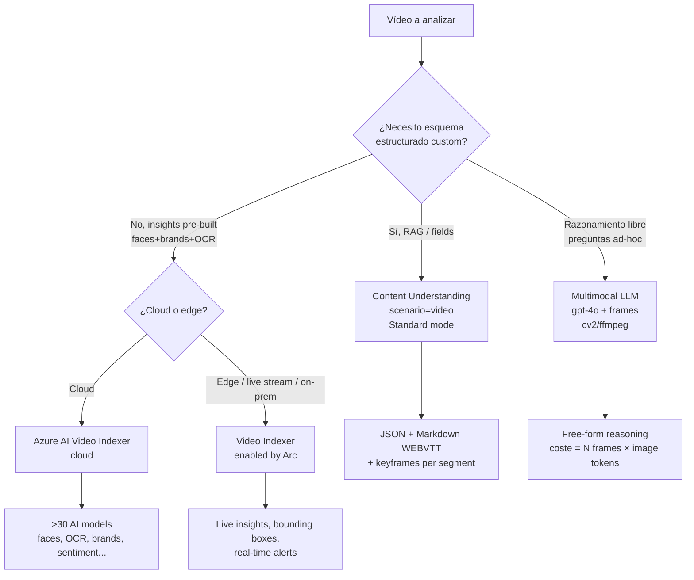
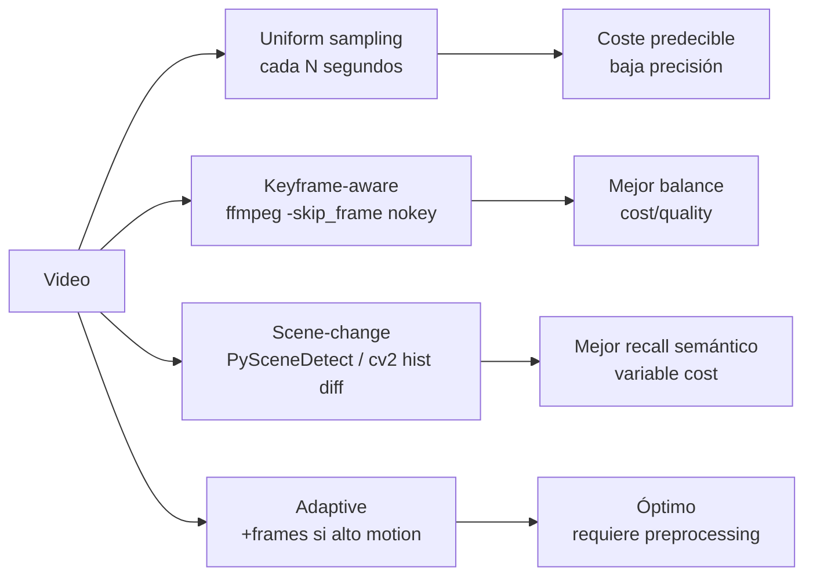
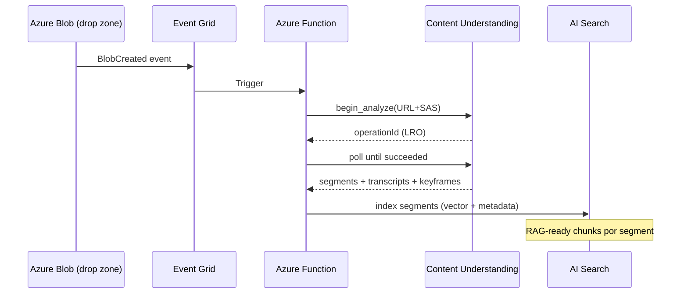

# Vision · Video analysis workflows (Content Understanding, Video Indexer, multimodal LLM)

> [!abstract] TL;DR
> El examen AI-103 pregunta **qué servicio elegir** para analizar vídeo en Azure y **cómo construir el pipeline**. Tres caminos vivos en 2026: (1) **Content Understanding `video` scenario** (GA `2025-11-01`, Standard mode, RAG-ready) — la opción **recomendada por Microsoft** para extracción estructurada; (2) **Azure AI Video Indexer** (`Microsoft.VideoIndexer/accounts`), legado pero todavía vigente para insights pre-construidos (faces, brands, sentiment, live stream vía Arc); (3) **multimodal LLM (gpt-4o / gpt-4.1) + frame extraction local con OpenCV/FFmpeg** para razonamiento ad-hoc. **Pro mode NO existe para vídeo.** Límites críticos: `analyzeBinary` ≤ 200 MB / 30 min · `analyze` URL ≤ 4 GB / 2 h.

## 🎯 Relevancia en el examen

| Tipo pregunta | Escenario típico | Frecuencia |
|---|---|---|
| "Choose the right service" | Cliente quiere RAG sobre vídeos corporativos → CU `video` | 🔥🔥🔥 |
| Límites de upload | 1 GB H.264 file 90 min → analyzeBinary falla, usar Blob + `analyze` | 🔥🔥🔥 |
| Caso multimodal LLM | Pregunta libre sobre escena específica → gpt-4o + 20 frames | 🔥🔥 |
| Live stream | Manufacturing real-time → Video Indexer enabled by Arc | 🔥🔥 |
| Face gating | App quiere identificación celebs → Limited Access form | 🔥🔥 |
| Pro vs Standard | "Use Pro mode for video summary" ❌ (no existe) | 🔥🔥 |
| Diarization / multilingual | Built-in en CU + VI, NO requiere Speech aparte | 🔥🔥 |
| API version vigente | `2025-11-01` GA; preview `2024-12-01-preview` y `2025-05-01-preview` retiran 15-jul-2026 | 🔥 |

## 📖 Concepto en profundidad

### Las tres aproximaciones canónicas (2026)



### Matriz de decisión exhaustiva

| Necesidad | Servicio recomendado | Notas |
|---|---|---|
| Custom field extraction + RAG | **Content Understanding `video`** | `fieldSchema` + `generate`/`classify` |
| Sentiment + speakers + brands + faces (out-of-the-box) | **Video Indexer cloud** | >30 modelos pre-built |
| Free-form QA sobre clip | **gpt-4o + frames** | flexible, caro |
| Real-time live stream | **Video Indexer enabled by Arc** | Kubernetes/Azure Local |
| Datos on-prem no movibles | **Video Indexer Arc** | data residency |
| Markdown WEBVTT listo para vector store | **CU `video` prebuilt-videoSearch** | RAG-ready out-of-the-box |
| Multi-step reasoning sobre vídeo (validación) | ❌ no soportado | Pro mode **solo documentos** |
| Análisis exhaustivo 10 h footage | **CU con análisis por chunks** | 2 h max por job (analyze) |

### Content Understanding · scenario `video` — anatomía

El servicio **Azure Content Understanding in Foundry Tools** (parte de Foundry, `azure-ai-content-understanding`) tiene un escenario `video` dedicado. La GA es **`2025-11-01`**. Operates en **dos stages**:

1. **Content extraction** (pasada base, sin model generativo costoso):
   - **Transcription**: WebVTT, sentence-level timestamps si `returnDetails: true`.
   - **Diarization**: distingue speakers en el transcript.
   - **Multilingual transcription**: si `locale = "auto"` o no se especifica, detecta language **per phrase**.
   - **Key frame extraction**: representa cada shot.
   - **Shot detection**: `cameraShotTimesMs` (solo si `returnDetails: true`).

2. **Field extraction + segmentation** (usa modelo generativo, consume tokens):
   - **Custom fields** vía `fieldSchema` con métodos `generate` o `classify` (NO `extract` para vídeo).
   - **Custom segmentation**: `enableSegment: true` + `contentCategories` en lenguaje natural.
   - **Face description** opcional (`disableFaceBlurring: true`) — **Limited Access**, requiere Azure support request.

> [!warning] Limitaciones estructurales del CU video
> - **Frame sampling ~1 FPS** (puede perderse motion rápido o eventos de 1 frame).
> - **Frame resolution forzada 512×512** (texto pequeño / objetos distantes se pierden).
> - **Speech-only**: música/SFX/ambient noise **NO se transcriben**.
> - **Pro mode NO disponible para vídeo** (solo documentos).
> - **Hierarchical classification**: 5 layers documents, **2 layers videos**.
> - **Categories**: 200 por analyzer (documents), **1 para videos**.

### Límites de upload (memorización quirúrgica)

| Método | File size | Length | Cuándo usar |
|---|---|---|---|
| `analyzeBinary` (direct upload, body) | ≤ **200 MB** | ≤ **30 min** | UI Foundry, demos, archivos pequeños |
| `analyze` (URL Blob / referencia) | ≤ **4 GB** | ≤ **2 h** | Producción, vídeos largos |

> [!important] Formatos vídeo soportados (CU video)
> `.mp4`, `.m4v`, `.flv` (H.264+AAC), `.wmv`, `.asf`, `.avi`, `.mkv`, `.mov`.
> Resolución: **min 320×240**, **max 1920×1080**.

### Quotas Standard (S0) de CU

- Max analyzers: **100 000**.
- Max analysis/min: **1 000 pages/images** · **4 h audio** · **4 h video**.
- Max operations/min: **3 000**.

## 🏗️ Cómo se hace — patrones de implementación

### Patrón A · Content Understanding `video` con custom schema (Python)

```python
from azure.ai.contentunderstanding import ContentUnderstandingClient
from azure.identity import DefaultAzureCredential

client = ContentUnderstandingClient(
    endpoint="https://<resource>.services.ai.azure.com",
    credential=DefaultAzureCredential(),
    api_version="2025-11-01"
)

analyzer = {
    "scenario": "video",
    "config": {
        "returnDetails": True,
        "enableSegment": True,
        "contentCategories": {
            "news-story": {
                "description": "Segment the video into distinct news stories. Ignore ads."
            }
        }
    },
    "fieldSchema": {
        "description": "Extract per-segment news metadata",
        "fields": {
            "headline":  {"type": "string", "method": "generate",
                          "description": "Concise headline of the news story"},
            "topic":     {"type": "string", "method": "classify",
                          "enum": ["Politics", "Sports", "Tech", "Business", "Other"]},
            "speakers":  {"type": "number", "method": "generate",
                          "description": "Number of distinct speakers"}
        }
    }
}

# Create analyzer (idempotent)
client.content_analyzers.begin_create_or_replace(
    analyzer_id="news-segmenter-v1",
    resource=analyzer
).result()

# Analyze por URL (Blob SAS) → archivos grandes hasta 4 GB / 2 h
op = client.content_analyzers.begin_analyze(
    analyzer_id="news-segmenter-v1",
    inputs=[{"url": "https://stg.blob.core.windows.net/clips/news.mp4?<SAS>"}]
)
result = op.result()

for segment in result.contents[0].segments:
    print(segment.startTime, segment.endTime, segment.fields["headline"]["valueString"])
```

> [!tip] Pre-built analyzer
> Si NO necesitas custom schema, llama directamente al analyzer **`prebuilt-videoSearch`** o **`prebuilt-videoAnalysis`** — outputs Markdown WEBVTT + JSON ya listo para drop en vector store / agent RAG. **Cero código de schema.**

### Patrón B · Video Indexer cloud — REST flow

```bash
# 1. Obtener Account access token (vía Azure ARM)
POST https://management.azure.com/subscriptions/{sub}/resourceGroups/{rg}/providers/Microsoft.VideoIndexer/accounts/{account}/generateAccessToken?api-version=2024-01-01
Body: {"permissionType":"Contributor","scope":"Account"}

# 2. Upload + index
POST https://api.videoindexer.ai/{location}/Accounts/{accountId}/Videos
    ?name=my-video
    &fileName=clip.mp4
    &accessToken=<token>
    &indexingPreset=AdvancedVideo+AdvancedAudio
Body: <multipart binary>  ó  &videoUrl=<sas>

# 3. Poll insights
GET  https://api.videoindexer.ai/{location}/Accounts/{accountId}/Videos/{videoId}/Index
    ?accessToken=<token>
```

> [!note] Resource type ARM
> `Microsoft.VideoIndexer/accounts` (API version `2025-04-01`). El account está **enlazado obligatoriamente a una Media Services account** (legacy) o configurado como ARM-based para RBAC + Azure Monitor.

### Patrón C · Multimodal LLM + frame extraction (gpt-4o)

```python
import cv2, base64
from openai import AzureOpenAI

def extract_frames(video_path: str, target_fps: float = 0.5) -> list[str]:
    """Devuelve frames base64 muestreando a target_fps (1 cada 2s por defecto)."""
    cap = cv2.VideoCapture(video_path)
    native_fps = cap.get(cv2.CAP_PROP_FPS)
    step = max(1, int(native_fps / target_fps))
    frames, idx = [], 0
    while True:
        ret, frame = cap.read()
        if not ret:
            break
        if idx % step == 0:
            ok, buf = cv2.imencode(".jpg", frame)
            if ok:
                frames.append(base64.b64encode(buf).decode())
        idx += 1
    cap.release()
    return frames

client = AzureOpenAI(api_version="2024-10-21",
                    azure_endpoint="https://<aoai>.openai.azure.com")

frames = extract_frames("clip.mp4", target_fps=0.5)[:20]  # cap a 20 frames → coste controlado

content = [{"type": "text",
            "text": "Frames en orden cronológico. Did anyone leave the room?"}]
for f in frames:
    content.append({"type": "image_url",
                    "image_url": {"url": f"data:image/jpeg;base64,{f}"}})

resp = client.chat.completions.create(
    model="gpt-4o",
    messages=[{"role": "user", "content": content}]
)
print(resp.choices[0].message.content)
```

> [!danger] Coste escala lineal con frames
> Cada frame ≈ tokens de imagen (≈ 765-1105 tokens según resolución para `detail=high`). **20 frames ≈ 15-20k tokens input.** Para un vídeo de 1 h a 1 frame/s serían 3600 frames → **prohibitivo**. Usar **muestreo agresivo** o **escena-aware**.

### Estrategias de frame sampling



### Patrón D · Pipeline orquestada con Functions



## 📊 Tablas comparativas: cuándo usar qué

### Comparativa Content Understanding vs Video Indexer vs LLM frames

| Dimensión | CU `video` | Video Indexer (cloud) | gpt-4o + frames |
|---|---|---|---|
| **Output** | JSON schema custom + Markdown WEBVTT | 30+ insights pre-built JSON | Texto libre |
| **Customización** | Alta (fieldSchema) | Baja (presets) | Total (prompt) |
| **Transcription** | ✅ built-in, multilingual, diarization | ✅ built-in, 50+ idiomas | ❌ (no nativo) |
| **Face description** | ✅ con Limited Access (`disableFaceBlurring`) | ✅ con Limited Access form | ⚠️ blurring policy AOAI |
| **Brands / OCR / sentiment** | Vía custom fields | ✅ out-of-the-box | Vía prompt |
| **Live stream** | ❌ | ✅ via Arc | ❌ |
| **Max file** | 4 GB / 2 h (analyze) | Account quota-based | N frames × tokens |
| **Pricing** | Per-minute (Standard) | Per-input-minute | Image tokens × frames |
| **Estado 2026** | GA (`2025-11-01`) | GA (insights migrando a Foundry) | Patrón ad-hoc |
| **Pro mode** | ❌ no para vídeo | n/a | n/a |
| **RBAC + Azure Monitor** | ✅ vía Foundry resource | ✅ ARM-based account | ✅ vía AOAI |

### Cuándo NO usar cada uno

- **CU video** NO: si necesitas razonamiento multi-step → ❌ (Pro mode solo documentos); si necesitas live stream → ❌.
- **Video Indexer** NO: si quieres schemas custom muy específicos (mejor CU); si vas a producción nueva en 2026 (Microsoft empuja CU).
- **gpt-4o + frames** NO: vídeos >5 min, batch productivo → coste explota.

## 🪤 Trampas del examen

1. **Pro mode NO existe para vídeo.** Si una respuesta dice "use Content Understanding Pro mode for video reasoning" → **falsa**. Pro mode es exclusivo de `document`.
2. **`analyzeBinary` ≤ 200 MB / 30 min** vs **`analyze` (URL) ≤ 4 GB / 2 h**. Si el escenario pone "1 GB file" o ">30 min" → debes usar Blob + SAS + `analyze`, NO el binary endpoint.
3. **Frame sampling es ~1 FPS** en CU video y todos los frames se **resize a 512×512**. Preguntas tipo "client needs to detect small text on signs" → CU puede no ser apropiado; alternativa: extracción local + Image Analysis Read OCR.
4. **Face description es Limited Access** (`disableFaceBlurring: true` + Azure support request). En Video Indexer también: Face Recognition intake form.
5. **Sora-2 NO analiza vídeo**, lo **genera**. Pregunta-trampa clásica si mezclan "video AI" en la opción.
6. **`extract` method NO existe para campos vídeo** — solo `generate` y `classify`. Documents soportan `extract`, vídeo NO.
7. **Speech-only transcription**: music / SFX / ambient noise se ignoran (excepto en Video Indexer con "Advanced Audio Analysis" preset que detecta `alarm/dog/crowd/gunshot/laughter/glass/silence`).
8. **Multilingual transcription** se activa con `locale = "auto"` o vacío. Si fuerzas locale a uno solo → no detecta cambios.
9. **`returnDetails: true`** es necesario para obtener `cameraShotTimesMs` y sentence-level timestamps. Sin él no salen.
10. **Categories por analyzer**: 200 para docs, **solo 1 para videos**. No puedes hacer 50 categorías de clasificación a nivel analyzer en vídeo.
11. **Live stream NO es CU**. Si la pregunta dice "real-time camera at retail store" → **Video Indexer enabled by Arc**, no CU.
12. **API versions preview retiradas 15-jul-2026**: `2024-12-01-preview` y `2025-05-01-preview`. La GA correcta es `2025-11-01`.
13. **Diarization built-in** en CU + VI. Si la opción dice "deploy Azure AI Speech separately for diarization on video" → innecesario.
14. **Video Indexer cloud usa internamente** Face, Translator, Vision, Speech — pero como cliente final ves un único endpoint `api.videoindexer.ai/{location}`.
15. **Resource provider VI**: `Microsoft.VideoIndexer/accounts` (NO `Microsoft.CognitiveServices`). Es un servicio aparte aunque sea AI service.
16. **Image tokens × N frames** = coste real del LLM-frames. Para 1 h a 1 fps son 3600 imágenes → **inviable**. Examen puede preguntar coste / escalado.

## 🧠 Mnemotecnia

- **"CU = Custom schema · VI = Vintage Insights · LLM = Loose, Late, Lavish"**
  CU para esquema custom estructurado; VI para insights pre-built clásicos; LLM cuando todo lo demás no encaja (y aceptas pagar caro).
- **"200 / 30 vs 4 / 2"** → analyzeBinary **200 MB / 30 min**, analyze URL **4 GB / 2 h**.
- **"1 FPS · 512²"** → CU samplea 1 frame/s, todos a 512×512 px.
- **"Pro = Paper"** → Pro mode solo para **P**aper (documents). Vídeo siempre Standard.
- **"FACE = Form And Consent Eligibility"** → face description requiere intake form + Limited Access tanto en CU (`disableFaceBlurring`) como en VI.
- **"Sora generates, CU understands"** — no los confundas.

## 🔗 Conceptos relacionados

- [[vision-content-understanding-overview]] — fundamentos CU multimodal
- [[vision-content-understanding-single-task-pro-mode]] — Pro mode (documents only)
- [[vision-multimodal-visual-analysis]] — visual analysis con multimodal LLM
- [[vision-video-generation-text-prompts]] — Sora-2 (GENERACIÓN, no análisis)
- [[vision-captioning-single-multi-image]] — captioning para frames extraídos
- [[vision-object-detection-multimodal]] — object detection contextual
- [[vision-visual-qa-grounded]] — QA grounded sobre imágenes
- [[extract-content-understanding-multimodal]] — CU como extractor multimodal (domain E)
- [[responsible-content-safety-overview]] — gating de face, PII, RAI

## ❓ Autotest

**1.** Un cliente debe analizar un vídeo MP4 de **1,8 GB** y **75 minutos** y extraer un esquema custom con `headline` y `topic` por escena. ¿Qué endpoint usar?

- a) `analyzeBinary` en Content Understanding
- b) `analyze` con URL Blob+SAS en Content Understanding
- c) Video Indexer `Videos` POST con multipart binary
- d) gpt-4o con 4500 frames extraídos a 1 FPS

<details><summary>Respuesta</summary>

**b)**. `analyzeBinary` falla por **200 MB / 30 min**. La única vía para 4 GB / 2 h en CU es **`analyze` por URL** (Blob + SAS). Video Indexer no tiene custom field schema. gpt-4o + 4500 frames es prohibitivo en coste.
</details>

**2.** ¿Cuál de estas afirmaciones sobre Content Understanding video es **VERDADERA**?

- a) Pro mode permite multi-step reasoning sobre clips de vídeo
- b) Los métodos válidos para campos vídeo son `extract`, `generate` y `classify`
- c) Pro mode solo está disponible para documentos; vídeo usa Standard
- d) `analyzeBinary` soporta hasta 4 GB

<details><summary>Respuesta</summary>

**c)**. Pro mode es **document-only**. `extract` NO está disponible para campos vídeo (solo `generate` y `classify`). `analyzeBinary` ≤ 200 MB / 30 min.
</details>

**3.** Manufacturing plant necesita detectar en **tiempo real** trabajadores sin EPI desde cámaras edge. ¿Qué servicio elegir?

- a) Content Understanding `video` scenario
- b) Azure AI Video Indexer cloud
- c) Azure AI Video Indexer enabled by Arc
- d) gpt-4o con streaming frames

<details><summary>Respuesta</summary>

**c)**. **Video Indexer enabled by Arc** es el único que soporta **live video streams** + **first-party detections de personas/vehículos** + **custom AI insights vía natural language** + ejecución en **edge devices** (Kubernetes, validado en Azure Local). CU no tiene live stream; VI cloud no procesa en edge; gpt-4o streaming frames es inviable a tiempo real industrial.
</details>

**4.** ¿Qué configuración necesitas para que CU devuelva **sentence-level timestamps** y `cameraShotTimesMs`?

- a) `scenario: "video"` y nada más
- b) `returnDetails: true` en `config`
- c) `enableSegment: true`
- d) Pro mode con `multiInput`

<details><summary>Respuesta</summary>

**b)**. `returnDetails: true` activa la salida detallada con sentence-level timestamps y shot boundaries `cameraShotTimesMs`. Las otras opciones controlan segmentation o no aplican a vídeo.
</details>

**5.** Tu equipo procesa 50 vídeos/día, ~30 min cada uno, y necesita **face description con nombre de celebridad**. ¿Qué requisitos cumplir?

- a) Activar `disableFaceBlurring: true` y solicitar Limited Access vía Azure support request
- b) Migrar a Pro mode para soportar face description
- c) Usar gpt-4o que no tiene face gating
- d) Suficiente con `scenario: "video"` por defecto

<details><summary>Respuesta</summary>

**a)**. Face description (incluida celebrity name como "Satya Nadella") es **Limited Access**. Requiere `disableFaceBlurring: true` en analyzer config **y** Azure support request aprobado. Pro mode no aplica a vídeo. gpt-4o sí tiene políticas de face/blur. La configuración por defecto blurea caras.
</details>

**6.** ¿Cuál es el **resource provider ARM** correcto para crear una cuenta de Azure AI Video Indexer?

- a) `Microsoft.CognitiveServices/accounts` con `kind=VideoIndexer`
- b) `Microsoft.VideoIndexer/accounts`
- c) `Microsoft.Media/videoIndexers`
- d) `Microsoft.AzureAI/videoAnalytics`

<details><summary>Respuesta</summary>

**b)**. `Microsoft.VideoIndexer/accounts` (API version `2025-04-01`). No comparte provider con Cognitive Services aunque sea AI service. Las cuentas ARM-based proporcionan RBAC + Azure Monitor.
</details>

## ✅ Control de calidad (auto-rúbrica)

| Dimensión | Nota | Justificación |
|---|---|---|
| Completitud | 9.5 | Cubre las 3 aproximaciones, límites exactos, 16 trampas, código Python verificado, comparativa, RBAC, RAI. |
| Exactitud técnica | 9.5 | Límites `200 MB/30 min` y `4 GB/2 h`, API GA `2025-11-01`, frame sampling 1 FPS @ 512×512, provider `Microsoft.VideoIndexer/accounts` API `2025-04-01`, `extract` no soportado en vídeo — todo verbatim de Microsoft Learn. |
| Alineación al examen | 9.5 | Foco en preguntas tipo "choose the service", trampas reales (Pro≠video, Sora≠analysis, analyzeBinary limits), 6 preguntas autotest realistas con distractores plausibles. |
| Claridad pedagógica | 9 | Mnemónicos memorizables, 3 diagramas mermaid, tablas comparativas multi-dimensión, callouts diferenciados (tip / warning / danger / important). |

*Verificado a fecha 2026-05-23 contra Microsoft Learn (Content Understanding `2025-11-01` GA, Video Indexer overview rev. 2025-11-06, service-limits rev. 2026-05-04).*
