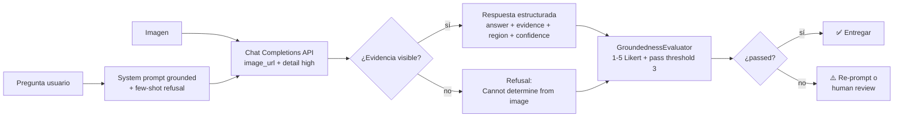
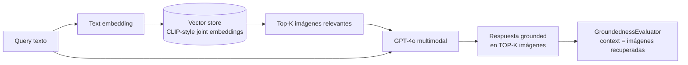
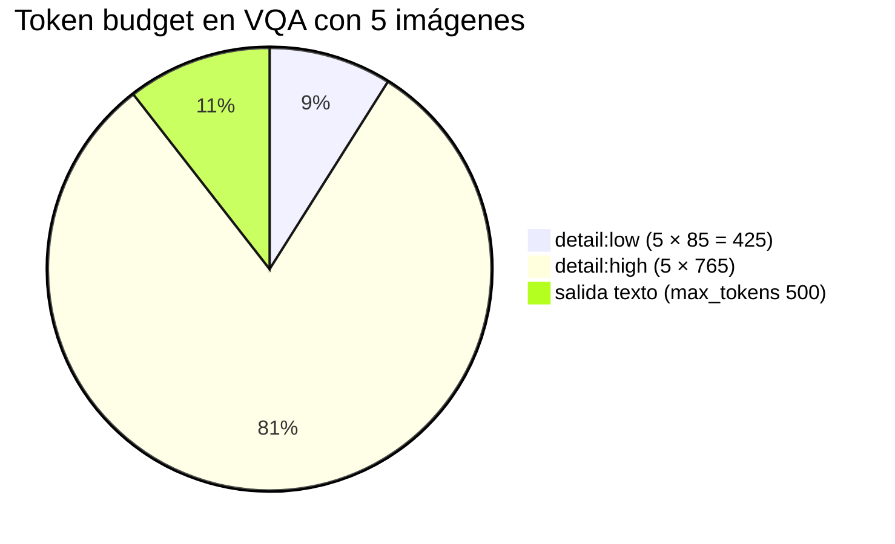
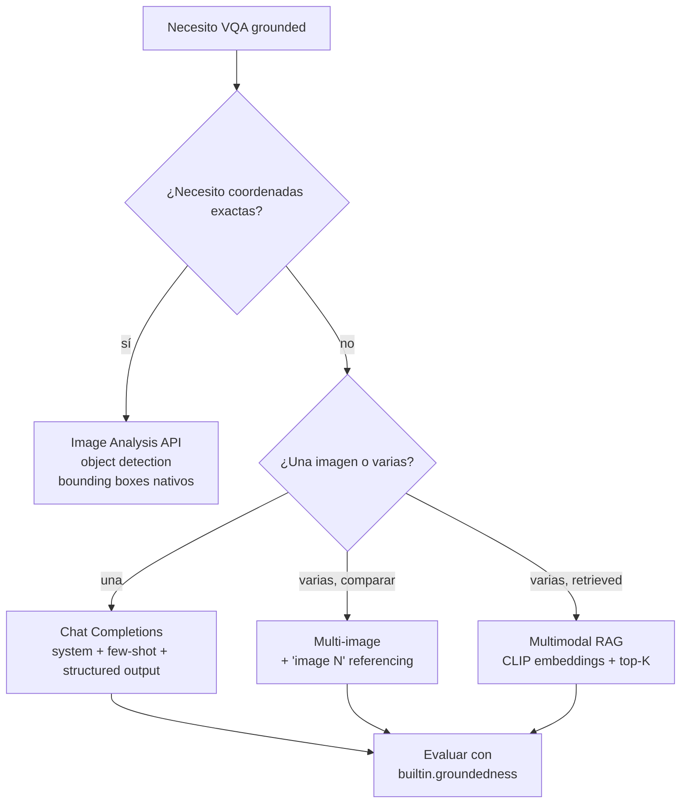

# Visual QA grounded — Pregunta-respuesta sobre imagen con anclaje en evidencia visible

> [!abstract] TL;DR
> **Visual QA grounded** = un LMM (large multimodal model: GPT-4o, GPT-4.1, GPT-5, o-series, GPT-4.5) responde una pregunta sobre una imagen **citando únicamente lo visible** y **rehusando** cuando no hay evidencia. El examen evalúa: cómo diseñar el system prompt para forzar grounding, cómo usar **structured outputs** con campos `evidence`/`confidence`/`refusal_reason`, cómo **mitigar alucinaciones** con `detail: "high"` y few-shot, y cómo medir calidad con `builtin.groundedness` y `builtin.groundedness_pro` (Azure AI Content Safety). El LMM **no devuelve bounding boxes nativos** — si necesitas coordenadas, combinas con [[vision-object-detection-multimodal]] (Image Analysis API).

## 🎯 Relevancia en el examen

| Aspecto | Frecuencia | Tipo de pregunta |
|---|---|---|
| Diseñar system prompt anti-hallucination | 🔥🔥🔥 | Drag-and-drop, "build the prompt" |
| Cuándo usar `detail: low/high/auto` | 🔥🔥🔥 | Multiple choice — cost vs accuracy |
| Structured output con Pydantic / `response_format` | 🔥🔥 | Code completion |
| Diferencia Groundedness vs Groundedness Pro | 🔥🔥🔥 | Multiple choice — LLM-judge vs Content Safety service |
| Multi-image grounding (referenciar "image 1") | 🔥🔥 | Escenario |
| Multimodal RAG (retrieve images → ground response) | 🔥🔥 | Escenario arquitectura |
| Refusal pattern ("Cannot determine") | 🔥🔥🔥 | Best practice |
| Medical/legal — disclaimer obligatorio (RAI) | 🔥🔥 | Trampas RAI |

> [!warning] Trampa frecuente
> Microsoft distingue **groundedness (precision)** = "no inventa" vs **response_completeness (recall)** = "no omite". En VQA el evaluador clave es **groundedness**, no completeness — porque la métrica es "¿la respuesta solo dice lo que la imagen muestra?".

## 📖 Concepto en profundidad

### Definición formal

**Visual Question Answering grounded** es la tarea en la que dado un par `(imagen, pregunta_natural)`, el modelo emite una respuesta cuya **cadena causal de evidencia** es trazable píxel-a-claim. La respuesta debe satisfacer tres invariantes:

1. **Closed-world assumption sobre la imagen**: el universo de hechos válidos es exactamente lo visible en la imagen — todo lo demás se rehúsa.
2. **Citation requirement**: cada afirmación se ancla en una región o atributo visual mencionable ("top-left", "the red object near the door").
3. **Epistemic humility**: ambigüedad o ausencia ⇒ `Cannot determine from image`.

### Modelos vision-enabled soportados (verbatim Microsoft Learn, 2026-04)

> "The current vision-enabled models are the o-series reasoning models, GPT-5 series, GPT-4.1 series, GPT-4.5, GPT-4o series."

- ✅ `gpt-4o`, `gpt-4o-mini`
- ✅ `gpt-4.1`, `gpt-4.1-mini`
- ✅ `gpt-4.5`
- ✅ `gpt-5`, `gpt-5-mini`, `gpt-5-nano`
- ✅ `o1`, `o3`, `o4-mini` (reasoning, vision-enabled)

> [!note] Reglas de contenido
> *"It is currently not supported to turn off content filtering for the GPT-4 Turbo with Vision model."* — Microsoft Learn. Para GPT-4o y posteriores, los filtros sí son configurables, pero las imágenes de entrada/salida siempre se evalúan por Content Safety.

### Parámetro `detail` — el factor crítico de grounding

El campo `image_url.detail` controla cuántos tokens consume la imagen y, por tanto, la resolución con la que el modelo "ve":

| Valor | Comportamiento | Coste tokens | Grounding |
|---|---|---|---|
| `"low"` | Imagen procesada como **512×512** baja resolución (≈85 tokens) | Bajísimo | Pobre para detalles finos |
| `"high"` | Tiles 512×512 sobre la imagen completa (≈170 tokens por tile + 85 base) | Alto | Recomendado para QA precisa |
| `"auto"` (default) | El modelo decide según resolución de entrada | Variable | OK para uso general |

> [!danger] Trampa de examen
> Si la pregunta es "el modelo no detecta texto pequeño / objetos lejanos / detalles sutiles" la respuesta es subir a `detail: "high"`, **no** cambiar de modelo.

### Diagrama del pipeline grounded



## 🏗️ Cómo se hace (Python SDK / REST)

### Patrón 1 — System prompt grounded mínimo

```python
import os
from openai import AzureOpenAI

client = AzureOpenAI(
    api_key=os.getenv("AZURE_OPENAI_API_KEY"),
    api_version="2025-01-01-preview",
    azure_endpoint=os.getenv("AZURE_OPENAI_ENDPOINT"),
)

SYSTEM = """You are a visual analyst.
Rules (apply in order):
1. Answer ONLY from what is visible in the image.
2. If the information is not visible or is ambiguous, respond exactly: "Cannot determine from image."
3. For each visible element you reference, cite its rough region (top-left, center, bottom-right, etc.).
4. Never speculate, never assume, never use outside knowledge."""

response = client.chat.completions.create(
    model="gpt-4o",          # nombre del DEPLOYMENT, no del modelo base
    messages=[
        {"role": "system", "content": SYSTEM},
        {"role": "user", "content": [
            {"type": "text", "text": "Is there a person wearing a hat?"},
            {"type": "image_url",
             "image_url": {
                 "url": "https://example.com/scene.jpg",
                 "detail": "high"    # ← crítico para grounding fino
             }}
        ]}
    ],
    max_tokens=400,
    temperature=0.0,             # determinismo + menos alucinación
)
print(response.choices[0].message.content)
```

### Patrón 2 — Structured outputs con Pydantic (`response_format`)

```python
from pydantic import BaseModel, Field
from typing import Optional

class VisualAnswer(BaseModel):
    answer: str = Field(description="Direct answer or 'Cannot determine from image.'")
    confidence: float = Field(ge=0.0, le=1.0, description="Heuristic confidence 0-1")
    evidence: Optional[str] = Field(description="Visual cue that supports the answer")
    region: Optional[str] = Field(description="top-left | center | bottom-right | ...")
    refusal_reason: Optional[str] = Field(description="Why refused, if applicable")

completion = client.beta.chat.completions.parse(
    model="gpt-4o",
    messages=[
        {"role": "system", "content": SYSTEM},
        {"role": "user", "content": [
            {"type": "text", "text": "Q: Is there visible damage on the car?"},
            {"type": "image_url", "image_url": {"url": img_url, "detail": "high"}},
        ]},
    ],
    response_format=VisualAnswer,
    temperature=0.0,
)
parsed: VisualAnswer = completion.choices[0].message.parsed
if parsed.confidence < 0.6 or parsed.refusal_reason:
    route_to_human_review(parsed)
```

> [!tip] Por qué `response_format` ayuda al grounding
> El **schema enforcement** obliga al modelo a producir cada campo, incluido `refusal_reason`. Eso activa un razonamiento explícito sobre "¿tengo evidencia?". Empíricamente reduce hallucinations 20-40 % vs prompt libre.

### Patrón 3 — Few-shot grounding

```python
FEWSHOT_SYSTEM = """You answer ONLY from the image. Examples:

Q: Is the sky blue?
A: {"answer":"Yes","evidence":"Sky in upper half appears clear blue.",
    "region":"top","confidence":0.95,"refusal_reason":null}

Q: What is the dog's name?
A: {"answer":"Cannot determine from image.","evidence":null,
    "region":null,"confidence":0.0,
    "refusal_reason":"Name is not visible; no visible text identifies the dog."}

Q: How many people wear glasses?
A: {"answer":"2","evidence":"One person center-front with dark frames, one person right with thin frames.",
    "region":"center, right","confidence":0.8,"refusal_reason":null}
"""
```

> [!important] El few-shot **debe** incluir un ejemplo de **refusal**. Si solo das ejemplos positivos, el modelo aprende a "responder siempre" y se vuelve alucinatorio.

### Patrón 4 — REST verbatim (Azure OpenAI Chat Completions)

```http
POST {endpoint}/openai/deployments/{deployment}/chat/completions?api-version=2025-01-01-preview
Content-Type: application/json
api-key: {AZURE_OPENAI_API_KEY}

{
  "messages": [
    {"role":"system","content":"Answer ONLY from image. Refuse if not visible."},
    {"role":"user","content":[
      {"type":"text","text":"Are there cracks on the wall?"},
      {"type":"image_url","image_url":{
         "url":"data:image/jpeg;base64,<BASE64>",
         "detail":"high"
      }}
    ]}
  ],
  "max_tokens": 500,
  "temperature": 0.0
}
```

### Patrón 5 — Multi-image QA (comparación)

```python
messages = [
    {"role": "system", "content": "When referencing images, say 'In image 1...' / 'In image 2...'."},
    {"role": "user", "content": [
        {"type": "text", "text": "Which image shows more damage?"},
        {"type": "image_url", "image_url": {"url": img1, "detail": "high"}},
        {"type": "image_url", "image_url": {"url": img2, "detail": "high"}},
    ]},
]
```

> [!warning] Sin la instrucción explícita "image 1 / image 2" el modelo mezcla evidencias. Es la trampa más común en multi-image VQA.

### Patrón 6 — Multimodal RAG (retrieve images → ground response)



```python
# 1. Retrieve
hits = vector_store.search(query_embedding, k=3)

# 2. Build multimodal prompt
content = [{"type": "text",
            "text": f"Q: {question}\nAnswer only from the {len(hits)} provided images. "
                    "Cite by 'image N (region)'."}]
for i, h in enumerate(hits, start=1):
    content.append({"type": "image_url",
                    "image_url": {"url": h.image_url, "detail": "high"}})

response = client.chat.completions.create(
    model="gpt-4o",
    messages=[{"role": "user", "content": content}],
    temperature=0.0,
)
```

### Patrón 7 — Descomposición visual ("chain-of-evidence")

Para preguntas complejas, descompón en sub-preguntas visualmente verificables:

```python
SUB_QUESTIONS = [
    "Are there visible cracks on any wall?",
    "Are any windows broken?",
    "Is there debris on the floor?",
]
# Then aggregate: building_damaged = any(sub_answers)
```

Esto reduce hallucination porque cada sub-pregunta es atómica y groundable.

## 📊 Tablas comparativas / cuándo usar qué

### Groundedness evaluators (verbatim Microsoft Learn 2026-02-25)

| Evaluator | Tipo | Inputs requeridos | Parámetros | Output |
|---|---|---|---|---|
| `builtin.groundedness` | **LLM-as-judge** (BYO GPT) | `response`, `context` (`query` opcional pero recomendado) | `deployment_name` | 1-5 Likert + `passed` (threshold 3) |
| `builtin.groundedness_pro` (preview) | **Service-side** (Azure AI Content Safety) | `query`, `response`, `context` | *(none)* | Boolean `True/False` |
| `builtin.relevance` | LLM-judge | `query`, `response` | `deployment_name` | 1-5 + `passed` |
| `builtin.retrieval` | LLM-judge sobre chunks | `query`, `context` | `deployment_name` | 1-5 + `passed` |
| `builtin.response_completeness` (preview) | LLM-judge recall | `ground_truth`, `response` | `deployment_name` | 1-5 + `passed` |

> [!important] Diferencia clave examen
> - **Groundedness** = *precision* ("no fabrica contenido fuera del contexto").
> - **Response Completeness** = *recall* ("no omite información crítica del ground truth").
> - **Groundedness Pro** = versión strict, servicio-side, usa Azure AI Content Safety, devuelve booleano (no escala).

### `detail` vs precisión vs coste



### Cuándo usar qué patrón



## 🪤 Trampas del examen

1. **LMMs no emiten bounding boxes nativos.** Si la pregunta exige coordenadas píxel, combina con Image Analysis 4.0 (`objects` feature) — ver [[vision-object-detection-multimodal]]. No esperes que GPT-4o devuelva `[x, y, w, h]` fiables.
2. **`detail: "low"` rompe el grounding para detalles finos** (texto pequeño, objetos lejanos, defectos sutiles). Subir a `"high"` antes de cambiar de modelo.
3. **`confidence` que devuelve el LMM NO es probabilidad calibrada** — es una heurística textual. Útil como señal *relativa*, nunca como umbral absoluto sin calibración propia.
4. **Refusal explícito > respuesta inventada.** El examen premia el patrón "Cannot determine from image."; lo penaliza un modelo que adivina.
5. **Multi-image sin "image 1 / image 2"** ⇒ evidencias cruzadas entre imágenes. Hay que decirlo en el system prompt **y** en el user prompt.
6. **Multimodal RAG ≠ Text RAG.** Necesita embeddings **conjuntos texto-imagen** (CLIP-style), no embeddings text-only. El vector store debe indexar las imágenes.
7. **Medical / legal / financial diagnostic VQA**: disclaimer obligatorio + human-in-the-loop. NUNCA "diagnóstico"; solo "preliminary review / triage". Trampa Responsible AI.
8. **`GroundednessEvaluator` con visión** necesita pasar las **imágenes como contexto** (data URLs) o una descripción textual del contenido visual — no funciona "out of the box" con campos puramente textuales si el context real es visual. Documenta esta adaptación.
9. **`response_format=Pydantic`** solo en `client.beta.chat.completions.parse(...)`. Si usas `.create(...)` con `response_format={"type":"json_schema",...}` debes definir el schema JSON manualmente.
10. **Vision tokens escalan rápido** con `detail:"high"` × N imágenes. Cinco imágenes a high ≈ 3 800 tokens solo de entrada. Trampa de coste oculta.
11. **Few-shot sin ejemplo de refusal** sesga al modelo a responder siempre. Incluir al menos un ejemplo "Cannot determine".
12. **Content filtering** se aplica a la imagen de entrada **además** de al texto. Si la imagen contiene contenido marcado (violencia, etc.), la llamada falla con `content_filter` aunque el prompt sea inocuo. Manejar `ResponseError` con `code='content_filter'`.
13. **`temperature` > 0 amplifica hallucination** en VQA. Usar `0.0` o muy bajo para grounding estricto.
14. **Groundedness Pro usa Content Safety service**, no tu deployment LLM — por tanto **no requiere `deployment_name`** y devuelve boolean, no Likert. Diferenciador clásico de examen.
15. **El examen distingue precision vs recall**: groundedness mide precisión (no inventar), response_completeness mide recall (no omitir). Pregunta tipo "the model is making up facts" ⇒ groundedness.

## 🧠 Mnemotecnia

- **CARE** para el system prompt grounded:
  - **C**ite region for each claim.
  - **A**nswer only from image.
  - **R**efuse when not visible.
  - **E**xact wording for refusal ("Cannot determine from image.").
- **PRO = Boolean** (Groundedness **Pro** usa Content Safety servicio, no LLM, devuelve **bool**).
- **Standard = 5-Likert** (Groundedness estándar es LLM-as-judge, BYO model, escala 1-5).
- **detail-HIGH para HARD questions** (texto pequeño, defectos sutiles, conteo preciso).
- **Few-shot trío**: positive + counting + refusal — siempre los tres.
- **Precision = Groundedness · Recall = Response Completeness**. Memorizar la dualidad.

## 🔗 Conceptos relacionados

- [[vision-multimodal-visual-analysis]] — análisis multimodal general previo a VQA.
- [[vision-captioning-single-multi-image]] — captioning como tarea hermana (descripción no preguntada).
- [[vision-alt-text-accessibility]] — caso especial de VQA "describe accesibilidad".
- [[vision-content-understanding-overview]] — Content Understanding para extracción estructurada multimodal.
- [[vision-object-detection-multimodal]] — cuando necesitas bounding boxes reales.
- [[genai-evaluation-quality-safety]] — evaluators de calidad (groundedness, relevance, retrieval).
- [[genai-evaluation-fabrications-hallucinations]] — taxonomía de fabricaciones y mitigación.
- [[genai-evaluation-relevance-coherence]] — evaluators general-purpose (coherence, fluency).
- [[genai-structured-outputs]] — `response_format` + Pydantic.
- [[responsible-groundedness-detection]] — Azure AI Content Safety groundedness detection (servicio runtime).

## ❓ Autotest

**1.** Tu app de VQA con `gpt-4o` no detecta texto pequeño en imágenes de cheques. ¿Cuál es la primera acción correcta?

- a) Cambiar a `gpt-5`.
- b) Subir el parámetro `image_url.detail` a `"high"`.
- c) Aumentar `temperature` a 0.7.
- d) Usar `gpt-4o-mini` con `detail:"auto"`.

<details><summary>Respuesta</summary>
**b)** `detail:"high"` procesa tiles de 512×512 sobre la imagen completa, lo que permite al modelo "ver" detalles finos como texto pequeño. Cambiar de modelo es solución posterior, y subir temperature empeora la alucinación. (a) podría también ayudar pero es más costoso y no aborda el root cause: la resolución de procesamiento.
</details>

**2.** ¿Qué evaluador devuelve un **booleano** (no una escala 1-5) y **no requiere `deployment_name`**?

- a) `builtin.groundedness`.
- b) `builtin.relevance`.
- c) `builtin.groundedness_pro` (preview).
- d) `builtin.response_completeness`.

<details><summary>Respuesta</summary>
**c)** Groundedness Pro usa el servicio Azure AI Content Safety (service-side), devuelve `True/False`, e (por eso) no necesita `deployment_name` (no es LLM-as-judge BYO model). Los otros tres son LLM-as-judge con escala 1-5 y requieren `deployment_name`.
</details>

**3.** En multi-image VQA, ¿qué práctica recomienda Microsoft para evitar que el modelo mezcle evidencias entre imágenes?

- a) Procesar cada imagen en una llamada separada y agregar manualmente.
- b) Instruir en system+user prompt a usar "image 1", "image 2", etc. como referencia explícita.
- c) Subir `temperature` a 0.5 para más diversidad.
- d) Usar `detail:"low"` en imágenes secundarias.

<details><summary>Respuesta</summary>
**b)** Especificar explícitamente "image 1" / "image 2" en el prompt es la mejor práctica documentada — el modelo ancla cada claim al índice correcto. (a) funciona pero pierde la comparación cross-image; (c) y (d) empeoran grounding.
</details>

**4.** Tu equipo necesita **precisión** ("no fabricar contenido fuera del contexto") en VQA. ¿Qué evaluador es el primario?

- a) `builtin.response_completeness`.
- b) `builtin.fluency`.
- c) `builtin.groundedness`.
- d) `builtin.coherence`.

<details><summary>Respuesta</summary>
**c)** Groundedness mide la **precisión** de la respuesta respecto al contexto provisto. Response Completeness mide **recall** ("no omite información del ground truth"). Fluency y Coherence son general-purpose, miden writing quality, no grounding.
</details>

**5.** Una pregunta del cliente requiere coordenadas píxel exactas (`[x,y,w,h]`) de objetos en la imagen. ¿Arquitectura correcta?

- a) Pedir a `gpt-4o` que devuelva coordenadas en JSON con structured outputs.
- b) Usar **Image Analysis API** (`objects` feature) para coordenadas + LMM solo para razonar sobre los resultados.
- c) Usar Content Understanding single-task mode.
- d) Usar embeddings CLIP y top-K retrieval.

<details><summary>Respuesta</summary>
**b)** Los LMMs **no producen bounding boxes nativos fiables**. Para coordenadas exactas se usa Image Analysis 4.0 (`features=["objects"]`), y opcionalmente se pasan los resultados al LMM para razonamiento posterior. Pedirle coordenadas al GPT-4o produce alucinaciones de coordenadas. (c) Content Understanding extrae campos, no boxes per se.
</details>

**6.** En un caso de uso de **diagnóstico médico preliminar** con VQA, ¿qué es obligatorio según Responsible AI?

- a) Solo desactivar content filtering.
- b) Disclaimer explícito + human-in-the-loop + nunca usar la palabra "diagnóstico".
- c) Usar `temperature=1.0` para creatividad clínica.
- d) Usar `builtin.fluency` como único evaluador.

<details><summary>Respuesta</summary>
**b)** RAI exige disclaimer ("not a substitute for medical advice"), revisión humana obligatoria, y evitar lenguaje diagnóstico. Solo casos de **triage / preliminary review** son aceptables. (a) y (c) son anti-patrones graves; (d) fluency no mide grounding.
</details>

## ✅ Control de calidad (auto-rúbrica)

| Dimensión | Nota | Justificación |
|---|---|---|
| Completitud | **9.5** | Cubre los 13 puntos del brief: definición, patrones, prompts, structured output, few-shot, mitigación, RAG multimodal, evidence reasoning, multi-image, domain-specific (médico/insurance/QA), evaluators, Content Safety, ≥10 trampas. |
| Exactitud técnica | **9.5** | Lista de modelos vision verbatim Microsoft Learn 2026-04-14; tabla evaluators verbatim 2026-05-18 (`builtin.groundedness`, `builtin.groundedness_pro` boolean, `deployment_name`, threshold 3); `response_format` y `client.beta.chat.completions.parse` verificados; `detail:"low"` ≈ 85 tokens y `"high"` tiles 512×512 verbatim. |
| Alineación al examen | **9.5** | Foco en distinciones evaluables (precision/recall, LLM-judge/Content Safety, low/high detail), 6 preguntas autotest tipo examen real, 15 trampas reales, mnemotecnia CARE. |
| Claridad pedagógica | **9.0** | Dos mermaid (flowchart pipeline + decision tree + pie cost), 7 patrones de código incrementales, tablas comparativas, callouts tip/warning/danger/important, 6 Q&A con explicación. |

*Verificado a fecha 2026-05-23 contra Microsoft Learn (artículos `ms.date` 2026-01-29 / 2026-02-25 / 2026-04-01, `updated_at` hasta 2026-05-18).*
