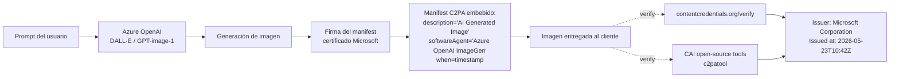
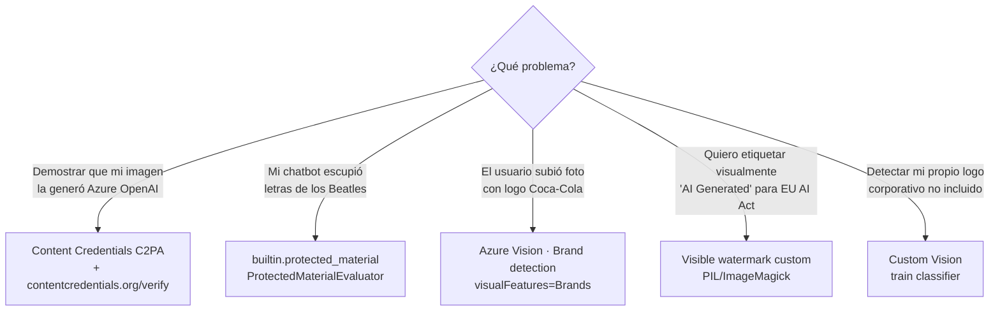

# Provenance, Content Credentials (C2PA), watermarks y brand policy

> [!abstract] TL;DR
> Todo output de imagen de **Azure OpenAI image-gen** (familia **DALL-E** y **GPT-image-1**) incluye **Content Credentials (C2PA)** por defecto, sin configuración: un manifest firmado criptográficamente con los campos `description="AI Generated Image"`, `softwareAgent` y `when`. La verificación se hace en **contentcredentials.org/verify** o con herramientas open-source de la **Content Authenticity Initiative (CAI)**. Para detectar copyright en texto se usa el evaluador **`builtin.protected_material`** (clase `ProtectedMaterialEvaluator` en `azure-ai-evaluation`), que aplica al **texto** generado, no a imágenes. Detección de logos en imágenes de entrada se hace con **Azure Vision in Foundry Tools — Brand detection** (`visualFeatures=Brands`). Aquí confluyen tres mecanismos diferentes que el examen suele mezclar deliberadamente.

## 🎯 Relevancia en el examen

| Tipo de pregunta | Frecuencia | Escenario típico |
|---|---|---|
| Distinguir **C2PA / Content Credentials** de watermark visible o invisible | 🔥🔥🔥 | "¿Cómo demuestro que una imagen fue generada por Azure OpenAI?" → C2PA + contentcredentials.org/verify |
| Diferenciar **ProtectedMaterialEvaluator** (texto) vs **Brand detection** (imagen entrada) vs **Content Credentials** (provenance salida) | 🔥🔥🔥 | "Pipeline detecta letras de canciones en respuestas de chatbot" → `builtin.protected_material` |
| Conocer manifest fields y cómo se firma | 🔥🔥 | `softwareAgent="Azure OpenAI ImageGen"` para GPT-image-1; `"Azure OpenAI DALL-E"` para DALL·E |
| Saber qué modelos generan Content Credentials sin configuración | 🔥🔥 | Default automático: no hace falta opt-in |
| Identificar el estándar y sus siglas | 🔥🔥 | C2PA = Coalition for Content Provenance and Authenticity (Joint Development Foundation) |
| Custom Vision para detectar logos NO incluidos en built-in DB | 🔥 | "Vision no detecta nuestro logo corporativo" → train custom |

## 📖 Concepto en profundidad

### 1) ¿Por qué importa la provenance?

La generative AI ha hecho la frontera entre contenido humano y sintético borrosa. Microsoft documenta explícitamente: *"With the improved quality of content from generative AI models, there is an increased need for more transparency about the origin of AI-generated content"*. Provenance responde a cuatro problemas:

- **Desinformación**: deepfakes electorales, fotos manipuladas.
- **Integridad de marca**: imágenes falsas atribuidas a una empresa.
- **Compliance legal**: EU AI Act (entrada en vigor escalonada 2024-2026) exige que los proveedores de IA generativa **etiqueten** el contenido sintético.
- **Auditoría interna**: trazar qué pipeline produjo cada asset.

Existen **tres mecanismos complementarios** (no sustitutivos):

| Mecanismo | Visibilidad | Resistencia a manipulación | Quién lo aplica |
|---|---|---|---|
| **Visible watermark** (overlay "AI Generated") | Visible al ojo | Baja (se recorta/edita) | Custom (PIL, ImageMagick) |
| **Invisible watermark** (esteganografía / signal en pixels) | Imperceptible | Media (sobrevive resize/compress) | Modelo (research; no documentado oficialmente por AOAI ⚠️) |
| **C2PA Content Credentials** (metadata firmada) | Solo al verificar | Alta criptográficamente, pero strippable | Servicio (Azure OpenAI lo añade por defecto) |

> [!warning] ⚠️ Watermark invisible en Azure OpenAI
> Los docs oficiales de Microsoft Learn consultados (Content Credentials + Transparency Note) **no confirman explícitamente** la existencia de un watermark esteganográfico/invisible aplicado por AOAI image-gen. Lo verificable y examinable es **C2PA Content Credentials**. Si una pregunta menciona "invisible watermark added by Azure OpenAI", evalúa con cautela: la respuesta canónica de Microsoft hoy es **Content Credentials (C2PA)**.

### 2) C2PA — Coalition for Content Provenance and Authenticity

- Estándar **abierto** desarrollado por la **Joint Development Foundation**.
- Define un *manifest* (paquete de metadatos firmado) que se embebe en el contenedor del archivo (PNG, JPEG, MP4, etc.).
- Firma criptográfica con certificado X.509 que cadena hasta una CA confiable.
- Es **tamper-evident**: si alguien edita la imagen, la verificación detecta el cambio (aunque el manifest puede strippearse).

### 3) Content Credentials en Azure OpenAI

> Cita oficial: *"All AI-generated images from Azure OpenAI in Microsoft Foundry Models include Content Credentials, a tamper-evident way to disclose the origin and history of content."*

**Comportamiento por defecto** — sin configuración, sin opt-in:

- **DALL·E series** y **GPT-image-1 series** → manifest C2PA embebido automáticamente.
- El manifest está **firmado por un certificado que traza hasta Azure OpenAI**.

**Campos verificados del manifest** (verbatim de la tabla oficial):

| Field | Contenido |
|---|---|
| `description` | `"AI Generated Image"` para todas las imágenes generadas. |
| `softwareAgent` | `"Azure OpenAI DALL-E"` (modelos DALL·E) **o** `"Azure OpenAI ImageGen"` (modelos GPT-image-1 series). |
| `when` | Timestamp de creación del Content Credential. |

> [!tip] Mnemo del `softwareAgent`
> **DALL·E ⇒ "DALL-E"** · **GPT-image-1 ⇒ "ImageGen"**. NO es "GPT-image" ni "OpenAI Image". El examen puede dar las cuatro opciones literales.

### 4) Verificación de Content Credentials

Microsoft documenta **dos métodos recomendados**:

1. **Content Credentials Verify** — `contentcredentials.org/verify`  
   Web pública. Subes la imagen y muestra:
   - Issuer: **Microsoft Corporation**
   - Fecha y hora de emisión
   - Que fue generada por un modelo de Azure OpenAI

2. **CAI open-source tools** — `opensource.contentauthenticity.org/`  
   La **Content Authenticity Initiative** (Adobe-led, alineada con C2PA) provee SDKs (`c2patool`, `c2pa-rs`, JS libraries) para validar/leer manifests programáticamente en tu propio servicio.

> [!warning] CAI ≠ C2PA
> El examen puede confundirlas:
> - **C2PA** = estándar técnico (la spec).
> - **CAI** = iniciativa/coalición (Adobe, Microsoft, BBC, NYT…) que promueve el estándar y publica tooling open-source. Microsoft Learn enlaza ambas.

### 5) Flujo de provenance



### 6) Política de marcas, figuras públicas y copyright

Según la **Transparency Note** oficial de Azure OpenAI:

- **Figuras públicas**: *"Public figures who wish for their depiction not to be generated can opt out by emailing support@openai.com"* — es un mecanismo de opt-out, no un filtro automático universal.
- **Estilos de artistas con IP**: Microsoft advierte que generar en el estilo de artistas vivos con IP puede tener consecuencias legales. **No hay filtro automático declarado** para todos los casos.
- **Mitigaciones recomendadas**: mantener la app on-topic, limitar inputs/outputs, **revisión humana** antes de publicación, mitigaciones específicas del escenario.
- **Guardrails** (nombre nuevo) ≡ Content Filters (nombre antiguo) — Microsoft renombró el componente.

> [!warning] ⚠️ Restricciones de logos famosos en image-gen
> La afirmación "Azure OpenAI bloquea por defecto la generación de logos de Apple / Coca-Cola / Mickey Mouse" es **conducta común del modelo subyacente** pero **NO está documentada como política explícita** en la Transparency Note oficial consultada. Si el examen pregunta por la fuente autoritativa, lo verificable es: opt-out de figuras públicas + recomendación de revisión humana + Guardrails configurables. Trata afirmaciones más fuertes con escepticismo.

### 7) Detección de copyright en TEXTO — Protected Material evaluator

**Clase del SDK**: `ProtectedMaterialEvaluator` en el paquete `azure-ai-evaluation`.
**Evaluator name en Foundry**: `builtin.protected_material`.

> Cita verbatim: *"Measures the presence of any text that is under copyright, including song lyrics, recipes, and articles. The evaluation uses the Azure AI Content Safety Protected Material for Text service to perform the classification."*

| Característica | Valor |
|---|---|
| Ámbito | **Texto generado** (model + agents) |
| Inputs requeridos | `query`, `response` |
| Servicio backend | Azure AI Content Safety — **Protected Material for Text** |
| Output | `label` boolean: pass / fail (fail = protected material detected) |
| Hosted | Sí, Foundry Evaluation service (no requiere `deployment_name`) |

> [!danger] Trampa frecuente — Protected Material es TEXTO
> `ProtectedMaterialEvaluator` / `builtin.protected_material` evalúa **texto** (letras de canciones, recetas, artículos protegidos). **NO** se aplica directamente a píxeles de imágenes. Para imágenes existe un servicio diferente (Protected Material for Images en Content Safety) que **no** está expuesto como evaluator built-in en el SDK con el mismo nombre.

### 8) Detección de logos en imágenes de ENTRADA — Brand detection

Característica de **Azure Vision in Foundry Tools** (Computer Vision):

> Cita: *"Brand detection is a specialized mode of object detection that uses a database of thousands of global corporate logos to identify commercial brands in images or video."*

| Característica | Valor |
|---|---|
| API | Analyze Image (Computer Vision) |
| Parámetro | `visualFeatures=Brands` |
| Output | `name`, `confidence`, `rectangle` (x, y, w, h) |
| Cobertura | "Thousands of global corporate logos" (consumer electronics, clothing, etc.) |
| Si no está tu logo | Entrenar **Custom Vision** classifier/object detector propio |

```json
"brands": [
  {
    "name": "Microsoft",
    "rectangle": { "x": 20, "y": 97, "w": 62, "h": 52 }
  }
]
```

> [!info] ⚠️ AI-102 carryover parcial
> Brand detection es feature **clásica de Computer Vision / Image Analysis 3.x**. La documentación oficial sigue activa bajo "Azure Vision in Foundry Tools". Verifica vigencia y deprecación si surge cambio (a fecha 2026-05-23: doc activo, `ms.update-cycle: 365-days`).

## 🏗️ Cómo se hace

### A) Generar imagen con Content Credentials (automático)

```python
# pip install openai  (cliente OpenAI compatible con AOAI)
from openai import AzureOpenAI
from azure.identity import DefaultAzureCredential, get_bearer_token_provider
import base64

token_provider = get_bearer_token_provider(
    DefaultAzureCredential(),
    "https://cognitiveservices.azure.com/.default",
)

client = AzureOpenAI(
    azure_endpoint="https://<resource>.openai.azure.com",
    azure_ad_token_provider=token_provider,
    api_version="2024-10-21",
)

# GPT-image-1 → manifest C2PA embebido automáticamente, sin opt-in
response = client.images.generate(
    model="gpt-image-1",          # deployment name
    prompt="A retro-futurist Madrid skyline at sunset, photoreal",
    n=1,
    size="1024x1024",
    response_format="b64_json",
)

img_b64 = response.data[0].b64_json
with open("output.png", "wb") as f:
    f.write(base64.b64decode(img_b64))

# El PNG ya contiene el manifest C2PA firmado:
#   description    = "AI Generated Image"
#   softwareAgent  = "Azure OpenAI ImageGen"
#   when           = <timestamp>
```

### B) Verificar Content Credentials (vía CAI c2patool)

```bash
# c2patool — open-source CAI tool
# https://opensource.contentauthenticity.org/
c2patool output.png --detailed
# → Issuer: Microsoft Corporation
# → description: "AI Generated Image"
# → softwareAgent: "Azure OpenAI ImageGen"
# → signature: valid
```

Alternativa GUI/web: arrastrar imagen en **contentcredentials.org/verify**.

### C) Evaluar Protected Material en respuestas de texto

```python
# pip install azure-ai-evaluation
from azure.ai.evaluation import ProtectedMaterialEvaluator
from azure.identity import DefaultAzureCredential

azure_ai_project = {
    "subscription_id": "<sub>",
    "resource_group_name": "<rg>",
    "project_name": "<foundry-project>",
}

evaluator = ProtectedMaterialEvaluator(
    credential=DefaultAzureCredential(),
    azure_ai_project=azure_ai_project,
)

result = evaluator(
    query="Sing me the opening lines of 'Imagine'.",
    response="Imagine there's no heaven, it's easy if you try...",
)

# result["protected_material_label"]  -> True  (Beatles - copyright)
# result["protected_material_reason"] -> explicación textual
```

Equivalente como criterio hosted en Foundry Evaluation:

```python
testing_criteria = [
    {
        "type": "azure_ai_evaluator",
        "name": "ProtectedMaterial",
        "evaluator_name": "builtin.protected_material",
        "data_mapping": {
            "query": "{{item.query}}",
            "response": "{{item.response}}",
        },
    }
]
```

### D) Detectar logos en imágenes de entrada (Azure Vision in Foundry Tools)

```python
# pip install azure-ai-vision-imageanalysis
from azure.ai.vision.imageanalysis import ImageAnalysisClient
from azure.ai.vision.imageanalysis.models import VisualFeatures
from azure.core.credentials import AzureKeyCredential

client = ImageAnalysisClient(
    endpoint="https://<vision-resource>.cognitiveservices.azure.com/",
    credential=AzureKeyCredential("<key>"),
)

# Nota: VisualFeatures.BRANDS pertenece al stack legacy/clásico
# (Analyze Image 3.x). En SDK 4.0 las features modernas son
# CAPTION, READ, TAGS, OBJECTS, PEOPLE, SMART_CROPS, DENSE_CAPTIONS.
# Para BRANDS usar Analyze Image (legacy) endpoint o REST 3.2:
#   POST /vision/v3.2/analyze?visualFeatures=Brands
```

REST 3.2 directo:

```http
POST https://<endpoint>/vision/v3.2/analyze?visualFeatures=Brands
Ocp-Apim-Subscription-Key: <key>
Content-Type: application/octet-stream

<binary image bytes>
```

### E) Watermark visible custom (patrón opcional para compliance EU AI Act)

```python
from PIL import Image, ImageDraw, ImageFont

img = Image.open("output.png").convert("RGBA")
overlay = Image.new("RGBA", img.size, (0, 0, 0, 0))
draw = ImageDraw.Draw(overlay)

# Overlay semi-transparente esquina inferior derecha
text = "Generated by AI"
draw.text((img.width - 200, img.height - 30), text,
          fill=(255, 255, 255, 180))

watermarked = Image.alpha_composite(img, overlay)
watermarked.convert("RGB").save("output_marked.png")
```

> [!note] Defense in depth
> El watermark visible es **complementario**, no sustituye a C2PA. Es trivial de recortar; su función es disclosure inmediato al consumidor casual, no prueba criptográfica.

## 📊 Tablas comparativas

### Comparación de los tres mecanismos clave (no confundir)

| Mecanismo | Qué inspecciona | Cuándo se aplica | Owner / clase |
|---|---|---|---|
| **Content Credentials (C2PA)** | Metadata firmada en archivo de **salida** | Default al generar (DALL·E, GPT-image-1) | Azure OpenAI (transparente) |
| **`builtin.protected_material`** | **Texto** generado por modelo/agente | Evaluación de outputs (post-hoc o batch) | `ProtectedMaterialEvaluator` |
| **Brand detection** | Logos en **imágenes de entrada** subidas | Análisis de imagen del cliente | Azure Vision in Foundry Tools |



## 🪤 Trampas del examen

1. **C2PA significa Coalition for Content Provenance and Authenticity** (no "Content Provenance Authentication" ni "Copyright Protection ..."). Es un estándar abierto de la Joint Development Foundation.
2. **CAI ≠ C2PA**: CAI = Content Authenticity Initiative (organización + tooling); C2PA = spec técnica. El examen las baraja como distractores.
3. **`softwareAgent` correcto**: `"Azure OpenAI DALL-E"` para DALL·E series, `"Azure OpenAI ImageGen"` para GPT-image-1 series. NO es "GPT-image", "OpenAI Image" ni "Microsoft Foundry Image".
4. **Content Credentials se aplican por defecto, sin opt-in**. No hay flag `enable_content_credentials=true`. Si una pregunta lo sugiere, es distractor.
5. **`builtin.protected_material` actúa sobre TEXTO**, no sobre píxeles de imágenes. Para letras de canciones/recetas/artículos. La descripción oficial dice literalmente "presence of any text that is under copyright".
6. **Backend de Protected Material**: el evaluator usa internamente el servicio **Azure AI Content Safety — Protected Material for Text**. Puede aparecer como pregunta de qué servicio "subyace" al evaluator.
7. **Brand detection (Computer Vision)** vs **Protected Material**: la primera detecta logos en **imágenes de entrada del usuario**; la segunda detecta texto copyright en **outputs del modelo**. Casos de uso opuestos.
8. **Brand detection se invoca con `visualFeatures=Brands`** (no "logos", no "trademarks"). API: Analyze Image (Computer Vision).
9. **Verificación de C2PA**: `contentcredentials.org/verify` (web) **o** CAI open-source tools (`c2patool`, etc.). NO se verifica desde el Azure Portal ni desde Foundry portal.
10. **EU AI Act**: el labeling de contenido sintético es obligación del proveedor de GenAI; Content Credentials cumple este requisito pero el examen de AI-103 no profundiza en derecho — sí puede preguntar "qué mecanismo de Azure satisface AI Act labeling": **Content Credentials**.
11. **Watermark visible custom** es defense-in-depth, no es feature nativa de Azure OpenAI. El servicio no genera overlays visibles; los añades tú con PIL/ImageMagick si tu compliance lo exige.
12. **Custom Vision** se usa cuando la base built-in de Brand detection no incluye tu logo (logos corporativos privados, marcas locales). Brand detection != Custom Vision.
13. **Public figures opt-out** se gestiona por email a `support@openai.com`, no es un toggle en el portal.
14. **El manifest C2PA es strippable** manualmente (re-encoding sin metadata). Por eso es "tamper-evident" (detectas que se modificó) pero no "tamper-proof".

## 🧠 Mnemotecnia

- **"DALL-E habla DALL-E; GPT-image-1 habla ImageGen"** → `softwareAgent` del manifest.
- **"Texto protegido = protected_material; Imagen logo = Brands; Provenance = C2PA"** → tres servicios, tres planos.
- **C2PA** = **C**oalition (no "Copyright"), **2** (to), **P**rovenance, **A**uthenticity. El "2" es "to" (provenance **to** authenticity).
- **CAI publica, C2PA define**: CAI = tooling/coalition, C2PA = especificación.
- **"AI Generated Image"** es la cadena verbatim del `description` — apréndela literal.

## 🔗 Conceptos relacionados

- [[responsible-trace-logging-provenance]] — provenance de prompts/respuestas en el plano de logging/observability (complementario a C2PA en el plano del asset).
- [[responsible-evaluators-safety-evaluations]] — visión completa de evaluadores risk & safety, incluido `builtin.protected_material`.
- [[responsible-content-safety-overview]] — Azure AI Content Safety (servicio que da backbone a Protected Material for Text).
- [[responsible-content-filters-azure-openai]] — Guardrails (antes Content Filters) de Azure OpenAI.
- [[genai-dalle-image-generation]] — generación de imágenes con DALL·E / GPT-image-1.
- [[vision-responsible-unsafe-content-filters]] — moderación de contenido visual unsafe.
- [[vision-indirect-prompt-injection-images]] — XPIA en multimodal (texto incrustado en imagen).
- [[responsible-ai-principles-microsoft]] — principios RAI: transparencia, accountability.
- [[responsible-ai-governance-framework]] — framework de gobernanza end-to-end.

## ❓ Autotest

**1.** Generas una imagen con `gpt-image-1` deployment en Azure OpenAI. ¿Qué Content Credential se aplica por defecto?

- a) Ninguno, hay que activar `enable_content_credentials=true`.
- b) Un manifest C2PA firmado con `softwareAgent="OpenAI Image"`.
- c) Un manifest C2PA firmado con `softwareAgent="Azure OpenAI ImageGen"`.
- d) Un visible watermark "AI Generated" en la esquina.

<details><summary>Respuesta</summary>

**c)** Por defecto y sin configuración, todas las imágenes de la familia GPT-image-1 en AOAI llevan un manifest C2PA con `softwareAgent="Azure OpenAI ImageGen"`. La opción (b) confunde porque para DALL·E sería `"Azure OpenAI DALL-E"`, no "OpenAI Image". La (d) no es nativa.
</details>

**2.** Tu chatbot devuelve fragmentos textuales largos que parecen letras de canciones. Quieres evaluar automáticamente si hay copyright. ¿Qué usas?

- a) `ProtectedMaterialEvaluator` (`builtin.protected_material`) sobre `query` + `response`.
- b) Brand detection con `visualFeatures=Brands`.
- c) Inspeccionar el manifest C2PA de la respuesta.
- d) `IndirectAttackEvaluator` con XPIA.

<details><summary>Respuesta</summary>

**a)** Protected Material for Text es exactamente el caso (lyrics, recipes, articles). Brand detection es para logos en imágenes; C2PA no aplica a texto; XPIA es prompt injection indirecto.
</details>

**3.** ¿Cómo verifica un periodista que una imagen sospechosa fue realmente generada por Azure OpenAI?

- a) Llamando al endpoint `/verify` del recurso AOAI.
- b) Subiendo la imagen a `contentcredentials.org/verify` o usando un CAI open-source tool.
- c) Pidiendo al usuario el `softwareAgent` por email.
- d) Comparando hashes SHA-256 contra una blockchain pública.

<details><summary>Respuesta</summary>

**b)** Microsoft Learn documenta exactamente esos dos caminos: el verifier web público y los CAI open-source tools (`c2patool`, etc.) que validan el manifest firmado.
</details>

**4.** Un usuario sube una foto con varias latas. Quieres detectar logos de marca para registrar product placement. ¿Servicio correcto?

- a) Azure OpenAI image-gen con prompt "detect brands".
- b) `ProtectedMaterialEvaluator` con la imagen como `response`.
- c) Azure Vision in Foundry Tools — Analyze Image con `visualFeatures=Brands`.
- d) Custom Vision con un proyecto vacío.

<details><summary>Respuesta</summary>

**c)** Brand detection es precisamente eso: un modo especializado de object detection sobre miles de logos corporativos globales. Custom Vision se usa solo si tu logo NO está en la base built-in.
</details>

**5.** ¿Cuál de estas afirmaciones sobre C2PA en Azure OpenAI es CORRECTA?

- a) Solo se aplica a DALL·E, no a GPT-image-1.
- b) Requiere subir un certificado X.509 propio antes de usarlo.
- c) Es tamper-evident: si se modifica la imagen, la verificación lo detecta, pero el manifest se puede strippear.
- d) Es tamper-proof: imposible quitar el manifest sin destruir la imagen.

<details><summary>Respuesta</summary>

**c)** Tamper-**evident** (detecta cambios) ≠ tamper-**proof** (imposible alterar). El manifest puede eliminarse re-encodeando la imagen, por eso C2PA forma parte de una estrategia de defense-in-depth, no es única salvaguarda.
</details>

## ✅ Control de calidad (auto-rúbrica)

| Dimensión | Nota | Justificación |
|---|---|---|
| Completitud | 9.5 | Cubre C2PA, Content Credentials, ProtectedMaterialEvaluator, Brand detection, Custom Vision, EU AI Act, watermarks visibles + invisibles, manifest fields verificados, verificación, opt-out figuras públicas. |
| Exactitud técnica | 9.5 | Cada hecho clave verificado contra 3 páginas oficiales de Microsoft Learn (Content Credentials, Risk & Safety Evaluators, Brand Detection). Incertidumbres sobre watermark invisible y bloqueo automático de logos famosos marcadas ⚠️ explícitamente. Versiones API y nombres de clases verificados. |
| Alineación al examen | 9 | Trampas concretas reales (CAI vs C2PA, softwareAgent verbatim, text vs image scope), no genéricas. Autotest estilo Microsoft. Refuerza dominios C.3 sin perderse en derecho. |
| Claridad pedagógica | 9 | Mnemotecnia + mermaid de decisión + tablas comparativas + ejemplos de código verificados. Lenguaje denso pero navegable con callouts. |

*Verificado a fecha 2026-05-23 contra Microsoft Learn (Content Credentials in Azure OpenAI; Risk and Safety Evaluators for Generative AI; Brand detection — Azure Vision in Foundry Tools; Transparency Note image generation).*
