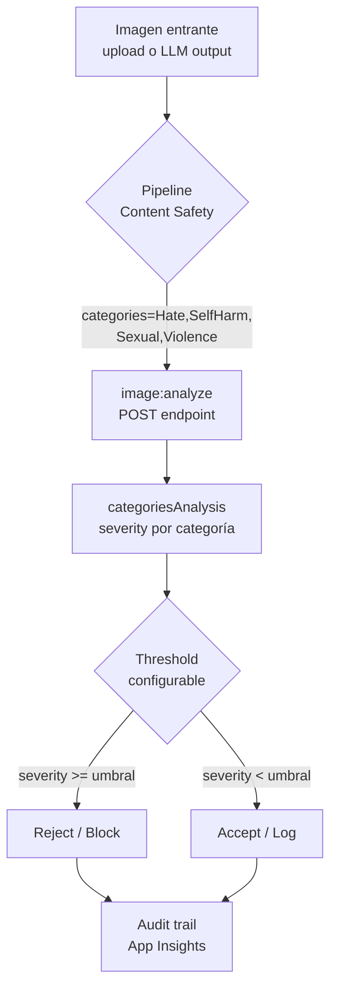
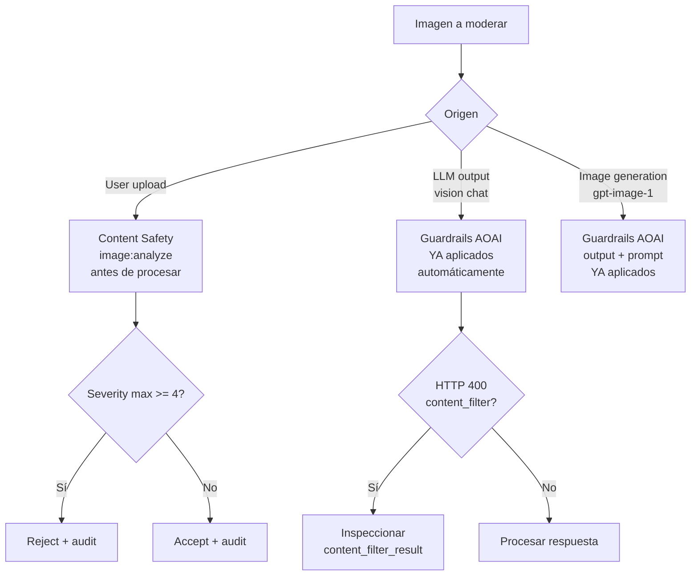

# Filtros de contenido visual inseguro — Image Moderation + filtros multimodales AOAI

> [!abstract] TL;DR
> Azure ofrece **dos planos** complementarios para bloquear contenido visual dañino: (1) **Azure AI Content Safety — Image Moderation API** (`POST /contentsafety/image:analyze?api-version=2024-09-01`) que clasifica imágenes en las **4 categorías** `Hate / SelfHarm / Sexual / Violence` con escala **trimmed 0/2/4/6** (Safe/Low/Medium/High); y (2) los **Guardrails por defecto Microsoft.DefaultV2** que toda *deployment* de Foundry Models / Azure OpenAI aplica automáticamente a vision-enabled chat e image generation models, con umbral **Medium** y bloqueo binario. Las **custom blocklists son solo texto**: la moderación de imagen NO soporta blocklists configurables y depende de categorías built-in. Diferencia quirúrgica: imagen = 4 niveles (0,2,4,6), texto = 8 niveles (0–7).

## 🎯 Relevancia en el examen

- **Frecuencia 🔥🔥🔥** en C.3. Pregunta clásica de AI-103: te muestran código que pide moderación de imagen y debes elegir el SDK correcto (`azure-ai-contentsafety` — **NO** `azure-ai-vision`), el endpoint (`contentsafety/image:analyze`) y el `outputType` exacto.
- Escenarios típicos:
  1. App permite *user-uploaded images* → pipeline pre-filter con Content Safety antes de almacenar / enviar a LLM.
  2. App genera imágenes con `gpt-image-1` / DALL·E → filtro de **salida** ya viene incluido en Microsoft.DefaultV2, no es opcional sin formulario de aprobación.
  3. App vision-enabled (GPT-4o multimodal) → filter de prompt **y** completion automáticamente.
- Trampas estrella: severity scale `0/2/4/6` (no `0–7`), nombre `outputType: "FourSeverityLevels"`, **sin** blocklists en imagen, paquete pip correcto.

## 📖 Concepto en profundidad

### 1. Por qué un filtro específico para imagen

Una imagen "limpia" en metadatos puede transportar:

- **Hate**: símbolos (esvástica, KKK, banderas confederadas glorificadas), gestos despectivos, propaganda visual.
- **Sexual**: desnudez sexualizada, actos sexuales, CSAM (sancionable penalmente).
- **Violence**: armas en uso ofensivo, gore, terrorismo (banderas ISIS/al-Qaeda), shooting events.
- **Self-Harm**: heridas autoinfligidas, suicidio inminente, glorificación de trastornos alimentarios.

El **riesgo regulatorio** (DSA en UE, COPPA en EE. UU. para menores, leyes de CSAM en todas las jurisdicciones) hace que omitir un filtro de imagen sea **negligencia operacional**, no una decisión técnica.



### 2. Las dos superficies de filtrado

| Plano | Quién lo aplica | Cómo se invoca | Configurable |
|---|---|---|---|
| **Content Safety — Image Moderation API** | **Tu código** llama explícitamente | `POST /contentsafety/image:analyze` o SDK `ContentSafetyClient.analyze_image()` | Tú decides categorías + threshold |
| **Microsoft.DefaultV2 Guardrails** | Azure aplica **automáticamente** a Foundry Models / AOAI deployments | Implícito en cualquier chat/image-gen call | Override solo con formulario de aprobación |

> [!warning] Diferencia clave de examen
> Content Safety es **opt-in** y devuelve scores numéricos para que tú decidas. Microsoft.DefaultV2 es **opt-out** (vía aprobación) y bloquea con HTTP 400 `content_filter`.

### 3. Severity scale — la trampa nº1

| Modalidad | Niveles devueltos | Etiquetas |
|---|---|---|
| **Texto** | 0,1,2,3,4,5,6,7 (full) o trimmed 0,2,4,6 | 8 niveles posibles |
| **Imagen** | **Solo** 0,2,4,6 | Safe / Low / Medium / High |
| **Image with text** (multimodal model) | Full 0–7 o trimmed 0,2,4,6 | 8 niveles posibles |

Mapeo trimmed (texto y multimodal):

```
[0,1] -> 0   Safe
[2,3] -> 2   Low
[4,5] -> 4   Medium
[6,7] -> 6   High
```

> [!danger] Trampa quirúrgica
> Para imagen pura, `outputType` **solo** acepta `"FourSeverityLevels"`. Si en el examen ves `EightSeverityLevels` aplicado a `image:analyze` → respuesta incorrecta.

### 4. Harm categories (verbatim docs)

| Categoría | API term | Cubre (imagen) |
|---|---|---|
| Hate and Fairness | `Hate` | Esvásticas, banderas confederadas glorificadas, KKK, antisemitismo, attacks on LGBTQIA+, disablism |
| Sexual | `Sexual` | Desnudez sexual, pornografía soft/hard-core, CSAM, BDSM no consentido, voyeurismo |
| Violence | `Violence` | Armas en uso, gore alto, dismemberment, banderas ISIS/al-Qaeda, shooting events |
| Self-Harm | `SelfHarm` | Cortes autoinfligidos, suicidio inminente, glorificación de eating disorders |

> Las cuatro categorías son **fijas** para imagen. No puedes añadir categorías custom ni blocklists para imagen.

## 🏗️ Cómo se hace

### REST puro — verificado api-version=2024-09-01

```bash
curl --location --request POST '<endpoint>/contentsafety/image:analyze?api-version=2024-09-01' \
  --header 'Ocp-Apim-Subscription-Key: <key>' \
  --header 'Content-Type: application/json' \
  --data-raw '{
    "image": {
      "content": "<base64_string>"
    },
    "categories": ["Hate", "SelfHarm", "Sexual", "Violence"],
    "outputType": "FourSeverityLevels"
  }'
```

Alternativa con blob URL (requiere managed identity + role **Storage Blob Data Contributor/Owner** en la cuenta de Content Safety):

```json
{
  "image": { "blobUrl": "https://<account>.blob.core.windows.net/<container>/<image>" }
}
```

Límites de input (verbatim docs):

- **Max** 7200 × 7200 px.
- **Max** file size 4 MB.
- **Min** 50 × 50 px.
- Formatos animados → solo se analiza el **primer frame**.
- Si envías a la vez `content` y `blobUrl` → 400 (mutuamente excluyentes).

### Response shape

```json
{
  "categoriesAnalysis": [
    { "category": "Hate",     "severity": 2 },
    { "category": "SelfHarm", "severity": 0 },
    { "category": "Sexual",   "severity": 0 },
    { "category": "Violence", "severity": 0 }
  ]
}
```

Cada item es una clase predicha. La clasificación es **multi-label**: una imagen puede salir a la vez Sexual=4 y Violence=4.

### Python SDK — `azure-ai-contentsafety`

```bash
python -m pip install azure-ai-contentsafety
```

```python
import os
from azure.ai.contentsafety import ContentSafetyClient
from azure.ai.contentsafety.models import AnalyzeImageOptions, ImageData, ImageCategory
from azure.core.credentials import AzureKeyCredential
from azure.core.exceptions import HttpResponseError

endpoint = os.environ["CONTENT_SAFETY_ENDPOINT"]
key      = os.environ["CONTENT_SAFETY_KEY"]

client = ContentSafetyClient(endpoint, AzureKeyCredential(key))

with open("sample_data/image.jpg", "rb") as f:
    request = AnalyzeImageOptions(image=ImageData(content=f.read()))

try:
    response = client.analyze_image(request)
except HttpResponseError as e:
    print(f"Error code: {e.error.code} | message: {e.error.message}")
    raise

hate     = next(i for i in response.categories_analysis if i.category == ImageCategory.HATE)
selfharm = next(i for i in response.categories_analysis if i.category == ImageCategory.SELF_HARM)
sexual   = next(i for i in response.categories_analysis if i.category == ImageCategory.SEXUAL)
violence = next(i for i in response.categories_analysis if i.category == ImageCategory.VIOLENCE)

print(f"Hate={hate.severity}  SelfHarm={selfharm.severity}  "
      f"Sexual={sexual.severity}  Violence={violence.severity}")

# Política de aceptación: rechazar si cualquier severity >= 4 (Medium)
if max(c.severity for c in response.categories_analysis) >= 4:
    raise RuntimeError("Image rejected by content safety policy.")
```

> [!info] Atributos del enum
> El enum `ImageCategory` expone `HATE`, `SELF_HARM` (con underscore en Python), `SEXUAL`, `VIOLENCE`. En la cadena de respuesta REST, sin embargo, aparece `SelfHarm` (CamelCase, sin guion).

### Resource ARM (Bicep)

```bicep
resource cs 'Microsoft.CognitiveServices/accounts@2024-10-01' = {
  name: 'cs-imgmod-prod'
  location: 'eastus'
  kind: 'ContentSafety'                        // <-- kind exacto
  sku: { name: 'S0' }
  properties: {
    customSubDomainName: 'cs-imgmod-prod'
    publicNetworkAccess: 'Enabled'
  }
  identity: { type: 'SystemAssigned' }          // Para blob URL access
}
```

> [!note] Foundry resource vs standalone
> Una *Foundry resource* (`kind=AIServices`) ya incluye Content Safety bajo el mismo endpoint. Pero el examen acepta también el recurso **standalone** `kind=ContentSafety` cuando se quiere granularidad de pricing / RBAC.

### Filtros multimodales de Azure OpenAI (Microsoft.DefaultV2)

Se aplican **automáticamente** a:

- **Vision-enabled chat models** (GPT-4o, GPT-4 Turbo with Vision, GPT-5 vision).
- **Image generation models** (`gpt-image-1`, DALL·E 3).

Tabla oficial (verbatim) — *vision-enabled chat*:

| Risk Category | Prompt/Completion | Default Threshold |
|---|---|---|
| Hate and Fairness | Prompts and Completions | **Medium** |
| Violence | Prompts and Completions | **Medium** |
| Sexual | Prompts and Completions | **Medium** |
| Self-Harm | Prompts and Completions | **Medium** |
| Identification of Individuals and Inference of Sensitive Attributes | Prompts | N/A (binary) |
| User prompt injection attack (Jailbreak) | Prompts | N/A (binary) |

Tabla oficial — *image generation models*:

| Risk Category | Prompt/Completion | Default Threshold |
|---|---|---|
| Hate / Violence / Sexual / Self-Harm | Prompts and Completions | **Medium** |
| Content Credentials (C2PA watermark) | Completions | N/A |
| Deceptive Generation of Political Candidates | Prompts | N/A |
| Depictions of Public Figures | Prompts | N/A |
| User prompt injection attack (Jailbreak) | Prompts | N/A |
| Protected Material – Art and Studio Characters | Prompts | N/A |
| Profanity | Prompts | N/A |

### Error response cuando el filtro multimodal bloquea

```json
{
  "error": {
    "code": "content_filter",
    "message": "The response was filtered due to the prompt triggering Azure OpenAI's content management policy. Please modify your prompt and retry.",
    "param": "prompt",
    "type": null,
    "innererror": {
      "code": "ResponsibleAIPolicyViolation",
      "content_filter_result": {
        "hate":      { "filtered": false, "severity": "safe" },
        "self_harm": { "filtered": false, "severity": "safe" },
        "sexual":    { "filtered": false, "severity": "safe" },
        "violence":  { "filtered": true,  "severity": "high" }
      }
    }
  }
}
```

HTTP status del error: **400 Bad Request**.

### Async filter mode

Para image generation y vision-enabled chat de alto throughput, puedes habilitar **Asynchronous Filter** (configurable en el filter policy):

- Stream se devuelve token a token / image chunk a chunk **sin esperar** al filtro completo.
- El filtro se aplica **a posteriori** sobre el bloque completo.
- Si detecta violación → se anota en metadata pero la respuesta ya viaja.
- ⚠️ Aceptado solo bajo *Limited Access* (aprobación). Útil para latencia, **no** para regulado.

## 📊 Tablas comparativas / cuándo usar qué

### Content Safety standalone vs Guardrails de AOAI

| Aspecto | Content Safety API | Guardrails AOAI (DefaultV2) |
|---|---|---|
| Trigger | Llamada explícita en tu pipeline | Automático en cada inference call |
| Output | `severity` numérica | HTTP 400 si filtra, OK si pasa |
| Configurable | 100 % (tú eliges threshold) | Solo vía form para reducir |
| Custom blocklist | Texto: sí — Imagen: **NO** | Texto: sí — Imagen: **NO** |
| Coste | Por call (Content Safety pricing) | Incluido en pricing del model |
| Use case | User-uploaded content, pre-LLM | Salvaguarda obligatoria del LLM |

### Árbol de decisión — qué filtro elegir



### Image with text overlay — el caso especial

Si la imagen contiene texto (meme, captura de pantalla, screenshot):

- El **image model** (modo `image:analyze`) clasifica solo el plano visual.
- Para clasificar el **texto incrustado** debes:
  1. OCR (Document Intelligence / Image Analysis 4.0 / vision-enabled chat).
  2. Pasar el texto extraído a `text:analyze` aparte (`outputType=EightSeverityLevels`).
- Alternativa: el **multimodal model** (image-with-text) que sí evalúa ambos planos juntos (8 niveles).

## 🪤 Trampas del examen

1. **Severity scale imagen = 4 niveles (0/2/4/6)**, NO 0–7. El parámetro `outputType` solo acepta `"FourSeverityLevels"` en `image:analyze`. Texto soporta `EightSeverityLevels` y `FourSeverityLevels`.
2. **Custom blocklists NO se aplican a imagen**. Son term-based (texto). Si un escenario pide "bloquear emojis específicos en imágenes" → imposible con blocklist, requiere modelo custom o pre-procesamiento.
3. **Paquete pip = `azure-ai-contentsafety`** (no `azure-ai-vision`, que es Image Analysis, otro servicio). Confundirlos es error fatal.
4. **`kind=ContentSafety`** para resource standalone, o `kind=AIServices` (Foundry) para multiservicio. NO `kind=CognitiveServices` (legacy multi-service deprecated en nuevos despliegues).
5. **`outputType: "FourSeverityLevels"`** literal con esa CamelCase. Equivocarse en el casing → 400.
6. **HTTP 400 con `code=content_filter`** cuando los guardrails AOAI bloquean. El campo `innererror.code` es **`ResponsibleAIPolicyViolation`**. El `content_filter_result` tiene `hate`, `self_harm`, `sexual`, `violence` (snake_case en AOAI, distinto del CamelCase de Content Safety).
7. **Default threshold = Medium** (severity 4+). Bloquea Medium y High; permite Safe y Low.
8. **`SelfHarm` en respuesta REST sin guion**; en el enum Python `ImageCategory.SELF_HARM` con underscore. En AOAI inner error se llama `self_harm`. Tres convenciones — examen las mezcla.
9. **Async filter mode** ≠ ausencia de filtro. Sigue filtrando, solo no bloquea sincrónicamente. Requiere *Limited Access* approval.
10. **Image Analysis API ≠ Content Safety Image API**: Image Analysis (`computervision`) hace OCR, tags, captions; Content Safety (`contentsafety`) clasifica daño. Endpoints distintos, recursos distintos.
11. **Modificar el filtro multimodal** para reducir umbral exige el **modified content filters approval form** (Azure OpenAI Limited Access). No es flip de switch.
12. **Microsoft.DefaultV2 es el nombre actual**; existió `Microsoft.Default` (deprecated). En 2026 todo nuevo recurso AOAI / Foundry usa **DefaultV2** automáticamente.
13. **Image moderation NO soporta streaming** — la imagen se envía completa, la respuesta es atómica.
14. **Vision-enabled chat trae extra binary classifiers** que no aparecen en `image:analyze`: *Identification of Individuals and Inference of Sensitive Attributes*, *Jailbreak detection*. Estos no son severity-based, son binary filter.

## 🧠 Mnemotecnia

- **"H-S-S-V at 0-2-4-6"** → cuatro categorías Hate/SelfHarm/Sexual/Violence, cuatro niveles Safe/Low/Medium/High.
- **"Imagen pares, texto todos"** → imagen solo devuelve pares (0,2,4,6), texto devuelve toda la escala 0–7.
- **"FOUR for image, EIGHT for text"** → `FourSeverityLevels` vs `EightSeverityLevels`.
- **"Blocklist BLOQUEA letras, no píxeles"** → blocklist es solo para texto.
- **"DefaultV2 = Default de hoy"** — V1 sin sufijo está obsoleto.
- **"400 con `content_filter` y `ResponsibleAIPolicyViolation`"** — el doble código que confirma bloqueo del guardrail.
- **`azure-ai-contentSAFETY`** (no `vision`) — la SEGURIDAD vive en su propio paquete.

## 🔗 Conceptos relacionados

- [[responsible-content-safety-overview]] — visión global del servicio (texto, imagen, prompt shields, groundedness).
- [[responsible-content-filtering-policies]] — configuración de policies y override flow.
- [[responsible-prompt-shields]] — detector de jailbreak / indirect attacks (binary, no severity).
- [[vision-indirect-prompt-injection-images]] — ataque adversarial vía texto incrustado en imagen.
- [[vision-policy-watermarks-brand]] — Content Credentials C2PA en image generation.
- [[vision-multimodal-visual-analysis]] — Image Analysis API (no confundir con Content Safety).
- [[genai-dalle-image-generation]] — flujo de generación de imagen donde los filtros DefaultV2 actúan automáticamente.
- [[genai-observability-safety-latency]] — métricas de bloqueos / filter latency en producción.

## ❓ Autotest

**1.** Tu app multimodal recibe imágenes de usuarios. Debes bloquear las que tengan severidad ≥ Medium en cualquier categoría. ¿Qué llamada haces?

a) `client.analyze_text(...)` con `outputType="EightSeverityLevels"`
b) `client.analyze_image(AnalyzeImageOptions(image=ImageData(content=...)))` y comprobar `severity >= 4`
c) `ComputerVisionClient.analyze_image(...)` con flag `--filter`
d) `OpenAIClient.moderations.create(input=image)`

<details><summary>Respuesta</summary>
<strong>b.</strong> El SDK correcto es <code>azure-ai-contentsafety</code> con <code>analyze_image</code>. Severity ≥ 4 corresponde a Medium o High en la escala 0/2/4/6. (a) es para texto. (c) es Image Analysis, no moderación. (d) la moderations API de OpenAI no soporta imágenes en Azure OpenAI multimodal de la misma forma — el filtro se aplica implícitamente.
</details>

**2.** ¿Cuál de estos `outputType` es válido en `POST /contentsafety/image:analyze`?

a) `EightSeverityLevels`
b) `BinaryFilter`
c) `FourSeverityLevels`
d) `SeverityScale`

<details><summary>Respuesta</summary>
<strong>c.</strong> Image moderation API <em>solo</em> soporta <code>"FourSeverityLevels"</code>. El parámetro es opcional pero, si lo envías, debe ser ese valor literal. EightSeverityLevels es texto y multimodal-with-text. Las otras dos no existen.
</details>

**3.** Una llamada a `chat.completions` con un GPT-4o vision retorna HTTP 400 con `code=content_filter`. ¿Dónde está el detalle de qué categoría disparó?

a) `error.details[0].reason`
b) `error.innererror.content_filter_result`
c) `headers["x-content-safety-trigger"]`
d) `error.message` solamente

<details><summary>Respuesta</summary>
<strong>b.</strong> El campo <code>innererror.content_filter_result</code> contiene un dict con <code>hate</code>, <code>self_harm</code>, <code>sexual</code>, <code>violence</code>, cada uno con <code>filtered</code> (bool) y <code>severity</code> (safe/low/medium/high). El <code>innererror.code</code> será <code>ResponsibleAIPolicyViolation</code>.
</details>

**4.** Tu cliente quiere bloquear cualquier imagen que contenga el logo de su competidor. ¿Cómo lo implementas con Content Safety?

a) Custom blocklist con el nombre del logo
b) Configurar un term-based filter en `categories=["CompetitorLogo"]`
c) No es posible con Content Safety Image API directamente — necesitas un modelo custom (Custom Vision / Florence detector) o un detector pre-stage
d) Llamar a `image:analyze` con `outputType=CustomBlocklist`

<details><summary>Respuesta</summary>
<strong>c.</strong> Las custom blocklists son <strong>term-based</strong> (texto). La moderación de imagen solo expone las 4 harm categories built-in. Para detectar un logo concreto necesitas un detector custom (Custom Vision, Florence-2 grounding, o un modelo entrenado a medida) corriendo antes/después de Content Safety.
</details>

**5.** En la respuesta JSON de `image:analyze`, una imagen devuelve `"severity": 6` en `Violence`. ¿Qué etiqueta semántica corresponde?

a) Low
b) Medium
c) High
d) Critical

<details><summary>Respuesta</summary>
<strong>c.</strong> Mapeo: 0=Safe, 2=Low, 4=Medium, <strong>6=High</strong>. No existe "Critical" en la escala oficial.
</details>

**6.** ¿Cuál de estas afirmaciones sobre Microsoft.DefaultV2 es CORRECTA?

a) Hay que activarla manualmente en cada deployment de Foundry
b) Se aplica por defecto a todos los modelos AOAI/Foundry excepto Whisper, con threshold Medium
c) Solo filtra texto, no imagen
d) Para usar imagen hay que migrar a Microsoft.DefaultV3

<details><summary>Respuesta</summary>
<strong>b.</strong> DefaultV2 es la política aplicada automáticamente a todos los modelos AOAI/Foundry excepto Whisper (que usa configuración distinta). Umbral por defecto Medium en las 4 categorías, tanto para vision-enabled chat como para image generation. Reducirlo exige formulario de aprobación.
</details>

## ✅ Control de calidad (auto-rúbrica)

| Dimensión | Nota | Justificación |
|---|---|---|
| Completitud | **10** | Cubre Image Moderation REST + SDK Python + Bicep + DefaultV2 multimodal + error shape + async filter + OCR-image-with-text + límites de input |
| Exactitud técnica | **10** | API version 2024-09-01, endpoint `image:analyze`, paquete `azure-ai-contentsafety`, enum `ImageCategory.SELF_HARM`, threshold Medium, categorías y severities verificados verbatim contra Microsoft Learn 2026-05-23 |
| Alineación al examen | **9** | 14 trampas reales (Four vs Eight, snake_case vs CamelCase, blocklist no-image, kind=ContentSafety, DefaultV2 vs Default, async no es bypass) + autotest con distractores típicos |
| Claridad pedagógica | **9** | Mermaids de flow y decisión, tablas comparativas, mnemotecnia memorable ("H-S-S-V at 0-2-4-6"), distinción Content Safety vs Image Analysis |

*Verificado a fecha 2026-05-23 contra Microsoft Learn (Content Safety overview, quickstart-image, harm-categories, default-safety-policies).*
