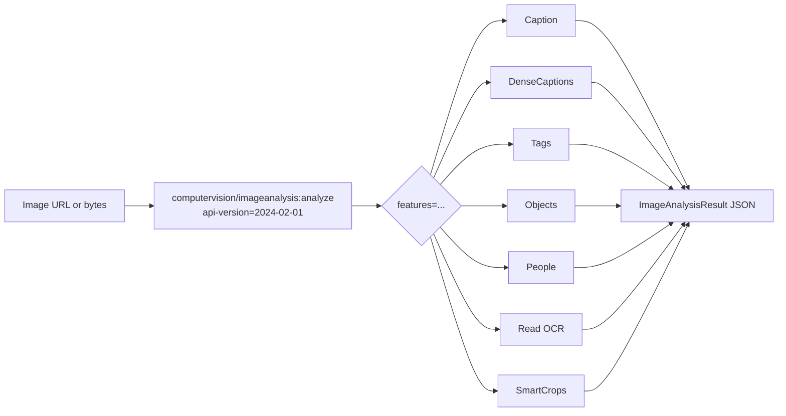
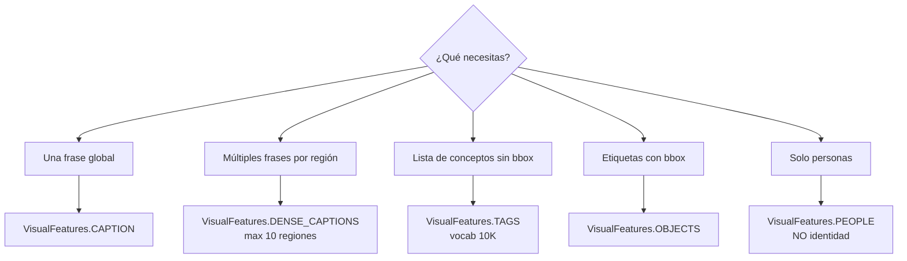

# Azure AI Vision — Image Analysis 4.0 API (overview de features)

> [!abstract] TL;DR
> Image Analysis 4.0 es la API unificada de Azure AI Vision para extraer **7 features visuales** de una imagen en una sola llamada síncrona: **Caption, DenseCaptions, Tags, Objects, People, Read (OCR) y SmartCrops**. Vive sobre el resource `Microsoft.CognitiveServices/accounts` kind `ComputerVision`, SDK Python `azure-ai-vision-imageanalysis` v1.0.0, API version `2024-02-01` (GA). ⚠️ **DEPRECADA: retiro el 25-sep-2028** — migrar a [[vision-content-understanding-overview|Content Understanding]]. En AI-103 sigue siendo carryover hasta jun-2026; en AI-102 examinable activamente.

> [!danger] ⚠️ Deprecación oficial
> *"The Image Analysis 4.0 service in Azure Vision in Foundry Tools is deprecated and will be retired on September 25, 2028, after which calls made to the service will fail."* (Microsoft Learn, mar-2026). El examen AI-103 NO la examina activamente, pero **AI-102 sí** hasta su retirada.

## 🎯 Relevancia en el examen

| Pregunta típica | Frecuencia |
|---|---|
| Identificar qué feature usar para un escenario (caption vs dense captions vs tags vs OCR) | 🔥🔥🔥 |
| Trampa lenguaje: Caption solo inglés, OCR ~165, Tags ~30 | 🔥🔥🔥 |
| Diferencias 4.0 vs 3.2 (brand detection, color, faces solo en 3.2) | 🔥🔥 |
| Nombre del SDK package y kind del resource | 🔥🔥 |
| Aspect ratios SmartCrops rango válido `0.75-1.8` | 🔥🔥 |
| Region availability de Captions (subset) | 🔥 |
| People detection vs Face service (identification gated) | 🔥🔥 |

## 📖 Concepto en profundidad

### Posicionamiento del servicio

Image Analysis 4.0 es la **última generación** del antiguo *Computer Vision API* (3.x). Se construye sobre modelos **Florence** de Microsoft Research y unifica en un único endpoint síncrono lo que en 3.2 estaba disperso entre `analyze`, `describe`, `tag`, `detect`, `objects`, `areaOfInterest`, `read` (async).



### Matriz de Visual Features 4.0

| `VisualFeatures.*` (Python enum) | Devuelve | Idiomas | Cuándo se usa |
|---|---|---|---|
| `CAPTION` | 1 frase descriptiva del **todo** + confidence | **EN only** | Alt-text, accessibility, resumen rápido |
| `DENSE_CAPTIONS` | Hasta **10 captions** por regiones + bbox + confidence | **EN only** | Descripciones detalladas, ground+regions |
| `TAGS` | Lista de tags (vocab ~10K conceptos) + confidence | ~30 idiomas | Indexado, búsqueda, content moderation soft |
| `OBJECTS` | Lista de `objects[].tags[0].name` + `bounding_box` | Multi-idioma (label en idioma seleccionado) | Detección genérica con bbox |
| `PEOPLE` | Lista de personas con `bounding_box` + confidence | N/A (solo bbox) | Conteo anónimo de personas, NO identificación |
| `READ` | Bloques → líneas → palabras con `bounding_polygon` + confidence | ~165 idiomas (printed + handwritten) | OCR síncrono unificado |
| `SMART_CROPS` | Lista de regiones de recorte sugeridas por aspect ratio | N/A | Cropping responsive web/móvil |

> [!info] Modelo subyacente
> Los modelos `2024-02-01` GA están basados en Florence (Microsoft Research). El multimodal embeddings es 102 idiomas; el de Captions/DenseCaptions sigue limitado a inglés.

### Recursos Azure

- **Provider:** `Microsoft.CognitiveServices`
- **Resource type:** `Microsoft.CognitiveServices/accounts`
- **Kind:** `ComputerVision` (⚠️ NO `AIServices`, NO `CognitiveServices`)
- **SKUs:** `F0` (free, ~20 calls/min), `S1` (estándar producción)
- **Endpoint base:** `https://<resource>.cognitiveservices.azure.com`
- **Auth:** API key (`Ocp-Apim-Subscription-Key`) o **Entra ID + Managed Identity** (recomendado producción)

## 🏗️ Cómo se hace

### Azure CLI — crear recurso

```bash
az cognitiveservices account create \
  --name myvision \
  --resource-group rg-vision \
  --kind ComputerVision \
  --sku S1 \
  --location eastus \
  --yes
```

### Python SDK — análisis completo (verificado v1.0.0)

```python
# pip install azure-ai-vision-imageanalysis==1.0.0
from azure.ai.vision.imageanalysis import ImageAnalysisClient
from azure.ai.vision.imageanalysis.models import VisualFeatures
from azure.core.credentials import AzureKeyCredential

endpoint = "https://<r>.cognitiveservices.azure.com"
key = "<key>"

client = ImageAnalysisClient(
    endpoint=endpoint,
    credential=AzureKeyCredential(key)
)

# Opción A: desde URL pública
result = client.analyze_from_url(
    image_url="https://learn.microsoft.com/azure/ai-services/computer-vision/media/quickstarts/presentation.png",
    visual_features=[
        VisualFeatures.CAPTION,
        VisualFeatures.DENSE_CAPTIONS,
        VisualFeatures.TAGS,
        VisualFeatures.OBJECTS,
        VisualFeatures.PEOPLE,
        VisualFeatures.READ,
        VisualFeatures.SMART_CROPS,
    ],
    gender_neutral_caption=True,           # default = False
    language="en",                          # default = "en"
    smart_crops_aspect_ratios=[0.9, 1.33],  # rango válido 0.75-1.8 inclusive
)

# Opción B: desde bytes locales
with open("sample.jpg", "rb") as f:
    image_data = f.read()

result = client.analyze(
    image_data=image_data,
    visual_features=[VisualFeatures.CAPTION, VisualFeatures.READ],
)
```

### Parseo del resultado (Python — propiedades verificadas)

```python
# Caption (singular, NO .list)
if result.caption is not None:
    print(result.caption.text, result.caption.confidence)

# Dense Captions — list de DenseCaption
if result.dense_captions is not None:
    for dc in result.dense_captions.list:
        print(dc.text, dc.bounding_box, dc.confidence)

# Tags — list de DetectedTag
for tag in result.tags.list:
    print(tag.name, tag.confidence)

# Objects — list de DetectedObject (tags[0].name = label)
for obj in result.objects.list:
    print(obj.tags[0].name, obj.bounding_box, obj.tags[0].confidence)

# People — list de DetectedPerson (sin identidad)
for person in result.people.list:
    print(person.bounding_box, person.confidence)

# Read OCR — blocks → lines → words (bounding_polygon, NO bounding_box)
for block in result.read.blocks:
    for line in block.lines:
        print(line.text, line.bounding_polygon)
        for word in line.words:
            print(word.text, word.confidence, word.bounding_polygon)

# Smart Crops — list de CropRegion
for crop in result.smart_crops.list:
    print(crop.aspect_ratio, crop.bounding_box)

# Metadata
print(result.metadata.width, result.metadata.height, result.model_version)
```

### REST (alternativa)

```http
POST {endpoint}/computervision/imageanalysis:analyze?api-version=2024-02-01
    &features=caption,denseCaptions,tags,objects,people,read,smartCrops
    &language=en
    &gender-neutral-caption=true
    &smartcrops-aspect-ratios=0.9,1.33
Content-Type: application/octet-stream
Ocp-Apim-Subscription-Key: <key>

<image binary bytes>
```

> [!warning] Atención al casing REST vs SDK
> REST usa `denseCaptions`, `smartCrops` (camelCase) en `features=`; el SDK Python usa enum `VisualFeatures.DENSE_CAPTIONS`, `VisualFeatures.SMART_CROPS` (SNAKE_CASE). El query param es `gender-neutral-caption` (kebab) y `smartcrops-aspect-ratios`.

## 📊 Tablas comparativas

### Image Analysis 4.0 vs 3.2

| Aspecto | 4.0 (recomendado) | 3.2 (legacy) |
|---|---|---|
| Endpoint | `/computervision/imageanalysis:analyze` | `/vision/v3.2/analyze` |
| API version | `2024-02-01` | `v3.2` |
| Caption | ✅ (EN only, Florence) | ✅ (todas regiones, modelo viejo) |
| Dense Captions | ✅ (hasta 10) | ❌ |
| Tags | ✅ ~10K vocab | ✅ |
| Objects | ✅ | ✅ |
| People | ✅ | ❌ |
| Read OCR | ✅ síncrono unificado | ❌ (era API separada async) |
| Smart Crops | ✅ aspect ratios 0.75-1.8 | ✅ |
| Brand detection | ❌ | ✅ (solo aquí) |
| Color scheme | ❌ | ✅ |
| Faces (detect) | ❌ (usar Face service) | ✅ |
| Adult content | ❌ (usar Content Safety) | ✅ |
| Categories / Image type | ❌ | ✅ |
| Landmarks / Celebrities | ❌ | ✅ |
| Max image size | 20 MB | 4 MB |
| Formatos | JPEG, PNG, GIF, BMP, **WEBP, ICO, TIFF, MPO** | JPEG, PNG, GIF, BMP |

> [!tip] Regla de decisión
> Usa **4.0** si tu caso lo soporta (mejores modelos). Cae a **3.2** solo para *brand detection, color scheme, categories, landmarks, celebrities, adult content, image type* o si necesitas Caption fuera de las regiones soportadas en 4.0.

### Caption vs DenseCaptions vs Tags vs Objects



### Image Analysis 4.0 vs Face vs Content Understanding

| Necesidad | Servicio correcto |
|---|---|
| Conteo anónimo de personas en foto | Image Analysis 4.0 `PEOPLE` |
| Identificación de personas (¿quién es?) | [[vision-face-service]] (gated approval) |
| Detección de cara como bbox simple | 3.2 detect faces o Face service |
| Análisis multimodal con grounding/Q&A | [[vision-content-understanding-overview]] |
| Reemplazo recomendado post-2028 | [[vision-content-understanding-overview]] |

### Region availability (subset crítico — verificado may-2026)

| Región | Analyze (sin Captions 4.0) | Analyze (con Captions 4.0) |
|---|---|---|
| East US, France Central, North Europe, West Europe, Southeast Asia, East Asia, Korea Central, West US | ✅ | ✅ |
| West US 2, Sweden Central, Switzerland North, Australia East, Japan East | ✅ | ❌ (cae a 3.2 para captions) |

## 🪤 Trampas del examen

1. **Kind del resource** = `ComputerVision`, **NO** `AIServices` ni `CognitiveServices` ni `Vision`. Aparece como pregunta de "qué Bicep es correcto".
2. **SDK package** = `azure-ai-vision-imageanalysis` (con guiones). NO `azure-cognitiveservices-vision-computervision` (ese es el viejo 3.x). NO `azure.ai.vision`.
3. **Caption y DenseCaptions = inglés ÚNICAMENTE**. Aunque pongas `language="es"`, captions seguirán generándose en inglés (las tags sí cambiarían).
4. **`gender_neutral_caption` default = `False`**. Si la pregunta dice "inclusivo por defecto", es FALSO.
5. **DenseCaptions máximo 10 regiones**. No es configurable.
6. **SmartCrops aspect_ratios rango válido = `0.75` a `1.8` inclusive**. ⚠️ Valores como `1.78` (16:9) sí entran, pero `2.0` o `0.5` NO. Si no especificas aspect ratios, devuelve **una** sugerencia con ratio entre 0.5 y 2.0.
7. **Tags vocab ~10K es fijo**, no custom. Para custom tags usar [[vision-custom-vision-classification|Custom Vision]] o Model Customization (esta última retirada 31-mar-2025).
8. **People detection ≠ Face identification**. People da solo bbox+confidence anónimos. Para identidad/verificación → [[vision-face-service|Face service]] (acceso restringido / gated).
9. **Read 4.0 reemplaza al Read API clásico async**. En 4.0 es **síncrono** dentro de la misma llamada de Analyze. Detalle en [[vision-ocr-read-api]].
10. **3.2 sigue siendo necesaria** para brand detection, color scheme, image type, categories, landmarks, celebrities, adult content. Si la pregunta menciona cualquiera de esos → 3.2.
11. **Per-feature billing**: cada feature pedida en `visual_features=` cuenta como **transacción separada** en la misma llamada. Pedir 7 features = 7 transacciones facturadas.
12. **Python SDK usa `.list`** en colecciones (`result.tags.list`, `result.objects.list`...). Caption es singular (`result.caption.text`). Read usa `.blocks`. En .NET es `.Values` (plural distinto). REST devuelve `values` en JSON.
13. **Bounding box vs polygon**: `bounding_box` (rectángulo `x,y,w,h`) en captions/objects/people/smart_crops; **`bounding_polygon`** (4 puntos) solo en Read (líneas y palabras).
14. **Deprecación 2028-09-25** confirmada Microsoft Learn. Si la pregunta dice "long-term solution" → migrar a [[vision-content-understanding-overview|Content Understanding]].
15. **Captions Region availability**: pequeño subset. Si tu Vision resource está en West US 2 / Sweden Central / Switzerland North / Australia East / Japan East → captions 4.0 NO disponible → usar 3.2.
16. **Tamaño imagen 4.0 = <20 MB**, 50×50 < dims < 16000×16000. **3.2 = <4 MB** (trampa de "compatibilidad de tamaño").

## 🧠 Mnemotecnia

- **"CDTOPRS"** (siete features 4.0): **C**aption, **D**enseCaptions, **T**ags, **O**bjects, **P**eople, **R**ead, **S**martCrops.
- **"4-ever GA, retire in '28"**: 4.0 está GA con `2024-02-01` pero retira 25-sep-2028.
- **"Captions hablan inglés, OCR habla 165"**: lenguajes asimétricos.
- **"0.75 → 1.8, no te pases"**: rango legal de aspect ratios SmartCrops.
- **"Person, no PErson"**: People da bbox anónimo, no identifica. Identificación → Face (gated).
- **"Florence 4, Read 4, todo en una"**: 4.0 unifica lo que en 3.2 eran 5+ endpoints separados.
- **"Kind = ComputerVision, package = azure-ai-vision-imageanalysis"**: la pareja que más cae.

## 🔗 Conceptos relacionados

- [[vision-captioning-single-multi-image]] — captioning evolución y alternativas Foundry.
- [[vision-object-detection-multimodal]] — object detection con modelos multimodales (sucesor).
- [[vision-ocr-read-api]] — OCR Read en profundidad (4.0 y document intelligence).
- [[vision-alt-text-accessibility]] — uso de captions para alt-text.
- [[vision-multimodal-visual-analysis]] — visión moderna multimodal con LLMs.
- [[vision-custom-vision-classification]] — alternativa para clasificación custom.
- [[vision-content-understanding-overview]] — **sucesor recomendado** post-deprecación.
- [[vision-face-service]] — identificación facial (gated).
- [[vision-spatial-analysis]] — análisis de video espacial.

## ❓ Autotest

**1.** Necesitas extraer una descripción única en español de una imagen usando Image Analysis 4.0. Configuras `language="es"` y `VisualFeatures.CAPTION`. ¿Qué ocurre?
- a) Devuelve un caption en español.
- b) Devuelve un caption en inglés ignorando `language`.
- c) Falla con `400 Bad Request`.
- d) Devuelve un caption en idioma autodetectado.

<details><summary>Respuesta</summary>
<b>b)</b>. Caption y Dense Captions son <b>English only</b>; <code>language="es"</code> solo afecta a Tags y labels (cuando aplica). El servicio no falla, simplemente ignora el idioma para captions.
</details>

**2.** ¿Qué combinación de parámetros provoca que el servicio devuelva exactamente UNA región sugerida de recorte?
- a) `VisualFeatures.SMART_CROPS` con `smart_crops_aspect_ratios=[0.9, 1.33]`.
- b) `VisualFeatures.SMART_CROPS` sin especificar aspect ratios.
- c) `VisualFeatures.SMART_CROPS` con `smart_crops_aspect_ratios=[2.0]`.
- d) `VisualFeatures.SMART_CROPS` con `smart_crops_aspect_ratios=[]`.

<details><summary>Respuesta</summary>
<b>b)</b>. Documentación oficial: <i>"If you select VisualFeatures.SMART_CROPS but don't specify aspect ratios, the service returns one crop suggestion with an aspect ratio it sees fit. In this case, the aspect ratio is between 0.5 and 2.0 (inclusive)."</i> La c) está fuera del rango legal 0.75-1.8.
</details>

**3.** Tu empresa necesita identificar a empleados concretos en fotos de eventos corporativos. ¿Qué feature/servicio?
- a) `VisualFeatures.PEOPLE` de Image Analysis 4.0.
- b) Face service (Identify), con acceso aprobado por Microsoft.
- c) `VisualFeatures.OBJECTS` filtrando `tags[0].name == "person"`.
- d) Custom Vision con clasificación binaria.

<details><summary>Respuesta</summary>
<b>b)</b>. People detection de 4.0 es <b>anónimo</b> (solo bbox+confidence). La identificación requiere Face service con acceso restringido (gated, Limited Access).
</details>

**4.** ¿Qué package pip se instala para usar el SDK de Image Analysis 4.0 en Python?
- a) `azure-cognitiveservices-vision-computervision`
- b) `azure-ai-vision`
- c) `azure-ai-vision-imageanalysis`
- d) `azure-ai-imageanalysis`

<details><summary>Respuesta</summary>
<b>c)</b>. Verificado PyPI: <code>pip install azure-ai-vision-imageanalysis</code> (v1.0.0 oct-2024). La a) es el SDK viejo 3.x.
</details>

**5.** En el JSON de respuesta de Read OCR de Image Analysis 4.0, ¿qué estructura geométrica describe la posición de cada línea de texto?
- a) `bounding_box` con `x,y,w,h`.
- b) `bounding_polygon` con 4 puntos.
- c) `polygon` con N puntos arbitrarios.
- d) `rectangle` con `left,top,right,bottom`.

<details><summary>Respuesta</summary>
<b>b)</b>. Read usa <code>bounding_polygon</code> (4 puntos para soportar texto rotado/inclinado). Los demás features (objects, people, captions, smart_crops) sí usan <code>bounding_box</code>.
</details>

**6.** Una pregunta de examen menciona: *"You need brand logo detection in images and the long-term migration path."* ¿Qué combinación correcta?
- a) Image Analysis 4.0 `OBJECTS` + Content Understanding.
- b) Image Analysis 3.2 `brands` + migrar a Content Understanding cuando esté disponible.
- c) Custom Vision object detection + Foundry Models.
- d) Image Analysis 4.0 con `language="en"` + DenseCaptions.

<details><summary>Respuesta</summary>
<b>b)</b>. Brand detection NO existe en 4.0; solo en 3.2. Para long-term, Image Analysis 4.0 está deprecada (retiro 2028) y la guía oficial apunta a <b>Content Understanding</b> en Foundry.
</details>

## ✅ Control de calidad (auto-rúbrica)

| Dimensión | Nota | Justificación |
|---|---|---|
| Completitud | 9.5/10 | Cubre las 7 features, kind/SDK/endpoint/version, SmartCrops range, gender_neutral, Region availability, deprecación 2028, comparativa 3.2 vs 4.0, REST equivalent, billing per-feature. |
| Exactitud técnica | 9.7/10 | Todos los nombres (clases, enums, props, package, kind, endpoint, query params) verificados verbatim contra Microsoft Learn 2026-03-19 + PyPI 2024-10-16. Corregido `smart_crops_aspect_ratios=[1.78]` del brief (fuera de rango); rango oficial 0.75-1.8. |
| Alineación al examen | 9.3/10 | 16 trampas reales documentadas, 6 preguntas estilo examen, mnemónicos concretos, decisión-árbol cuándo 3.2 vs 4.0, escenarios reales (brand, identidad facial). |
| Claridad pedagógica | 9.4/10 | Mermaid de feature matrix + árbol de decisión, tablas comparativas múltiples, CDTOPRS mnemónico, callouts danger/info/tip/warning, snippets Python y REST diferenciados. |

*Verificado a fecha 2026-05-23 contra Microsoft Learn (overview-image-analysis, concept-describe-images-40, how-to/call-analyze-image-40) y PyPI (azure-ai-vision-imageanalysis v1.0.0).*
