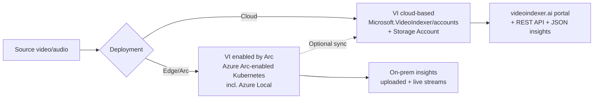
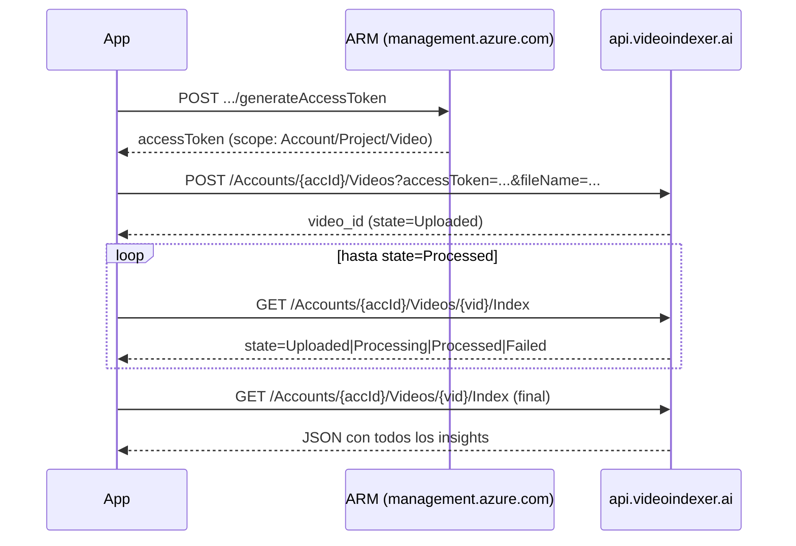
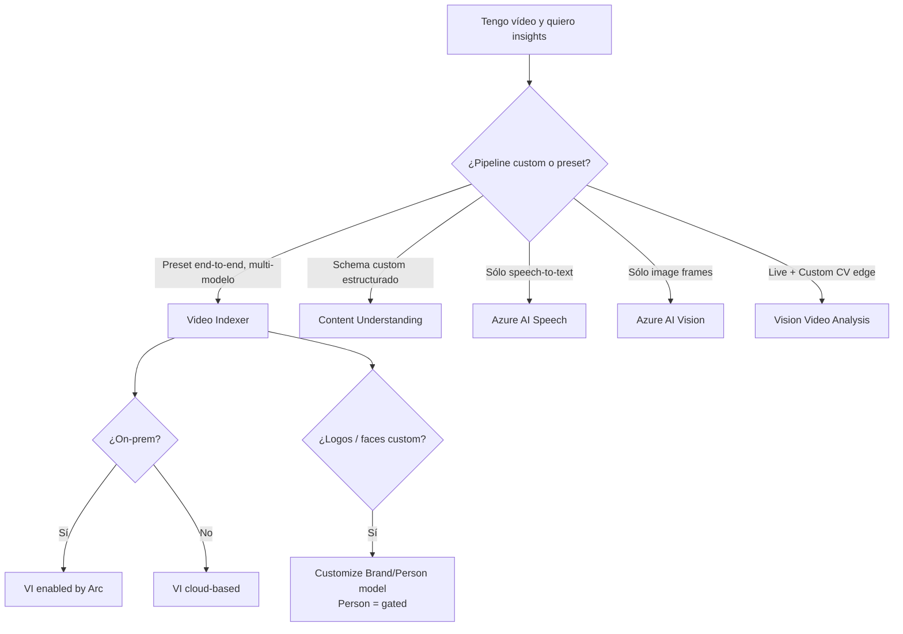

# Azure AI Video Indexer (VI)

> [!abstract] TL;DR
> **Azure AI Video Indexer (VI)** es un servicio AI **end-to-end** que ejecuta **>30 modelos pre-construidos** sobre vídeo y audio (uploaded o live) para extraer insights: transcripción multi-idioma, faces, scenes, OCR, objects, sentiment, topics, brands, etc. Resource provider propio: **`Microsoft.VideoIndexer/accounts`** (NO es `Microsoft.CognitiveServices`). Dos sabores: **cloud-based** (Azure AI services) y **enabled by Azure Arc** (edge/on-prem sobre Kubernetes). Requiere **Storage account vinculado** obligatoriamente. Face identification, celebrity recognition y Person model están **gated** (Limited Access, Face Recognition intake form). En el examen entra como carryover AI-102: identificar VI vs Content Understanding vs Video Analysis (anteriormente Spatial Analysis).

## 🎯 Relevancia en el examen

- **Frecuencia:** 🔥🔥 (carryover AI-102, aparece en preguntas case-study de vídeo).
- **Tipos de pregunta:**
  - "Tienes que extraer transcripción + faces + brands de un archivo de vídeo. ¿Qué servicio eliges?" → **VI** (no Vision, no Speech directamente, no CU si el escenario es pre-built end-to-end).
  - "Necesitas indexar vídeo on-premises por compliance, sin subir a la cloud." → **VI enabled by Arc**.
  - "Quieres detectar logos personalizados en vídeos corporativos." → VI **customize brands** model.
  - "¿Qué resource type creas en Azure?" → `Microsoft.VideoIndexer/accounts` (trampa: NO `Microsoft.CognitiveServices/accounts`).
  - "Para activar face identification en VI" → Limited Access via Face Recognition intake form.
- **Trampa estrella:** confundir VI (preset pipeline) con **Content Understanding** (schema-driven multimodal Foundry) o con **Vision Video Analysis** (custom CV models edge).

## 📖 Concepto en profundidad

### Qué es y dónde encaja

VI es una **solución completa** sobre Azure AI services (consume internamente **Face**, **Translator**, **Azure AI Vision**, **Speech**) más modelos propios. No es un endpoint atómico: es una **pipeline orquestada** que recibe un vídeo y devuelve un **JSON masivo** con todos los insights extraídos.

> [!info] Filosofía VI vs CU
> - **VI** = **preset-driven** (eliges Basic/Standard/Advanced sobre Audio/Video/Both → recibes catálogo fijo de insights).
> - **Content Understanding** = **schema-driven** (defines un schema custom y la pipeline extrae sólo lo que pediste, formato estructurado).
> - VI sigue siendo **producto independiente** en 2026; convive con CU.

### Dos modos de despliegue



| Característica | Cloud-based | Enabled by Azure Arc |
|---|---|---|
| **Compute** | Gestionado por Microsoft en Azure | Customer Kubernetes (validado en Azure Local, compatible con cualquier K8s) |
| **Resource type** | `Microsoft.VideoIndexer/accounts` | Arc extension (instala sobre clúster K8s) |
| **Modelos** | >30 modelos AI + GenAI | Subconjunto (presets *Basic video / Basic audio / Basic video and audio*) |
| **Live streams** | No nativo en cloud (capability principal Arc) | Sí, real-time con bounding boxes en stream |
| **Use case** | La mayoría de escenarios SaaS | Compliance, data residency, low-latency edge, air-gapped |
| **Registro** | Crear resource Azure | Sign-up: `aka.ms/vi-live-register` |

### Insights extraídos — el catálogo completo (cloud)

> [!important] Más de 30 modelos
> VI ejecuta >30 modelos AI en background. Memoriza las **3 familias** (Video / Audio / Multichannel) y los modelos **gated**.

#### Video models (verbatim Microsoft Learn)

- **Face detection** (detecta y agrupa caras).
- **Celebrity identification** (>1M celebridades, **gated**).
- **Account-based face identification** (Person model entrenado por cuenta, **gated**).
- **Thumbnail extraction for faces**.
- **Optical character recognition (OCR)** — texto en frames.
- **Visual content moderation** — adult / racy.
- **Labels identification** — objetos y acciones.
- **Scene segmentation** — corte de escena por cambios visuales.
- **Shot detection** — frames de misma cámara.
- **Black frame detection**.
- **Keyframe extraction**.
- **Rolling credits** — créditos finales de TV/cine.
- **Editorial shot type detection** — wide / medium / close up / extreme close up / two shot / multiple people / outdoor / indoor.
- **Observed people detection** — bounding boxes + timestamps + confidence.
  - **Matched person** — empareja observed con face detected.
  - **Detected clothing** — manga larga/corta, pantalón largo/corto, falda/vestido.
  - **Featured clothing** — capturas ranked para targeted ads.
- **Object detection**.
- **Slate detection** — clapperboard, digital patterns (color bars), textless slate.
- **Textual logo detection** — empareja palabras OCR contra logos textuales pre-definidos.

#### Audio models (verbatim)

- **Audio transcription** — speech-to-text en **>50 idiomas**.
- **Automatic language detection** (LID) — si no detecta con confianza, asume inglés.
- **Multilanguage speech identification and transcription** (MLID) — segmenta el audio por idioma.
- **Closed captioning** — formatos **VTT**, **TTML**, **SRT**.
- **Two channel processing** — autodetect + merge.
- **Noise reduction** — basado en filtros Skype.
- **Transcript customization (CRIS)** — custom speech-to-text por dominio.
- **Speaker enumeration** — hasta **16 speakers** en un archivo.
- **Speaker statistics** — ratios de habla.
- **Textual content moderation** — texto explícito en transcript.
- **Text-based emotion detection** — joy, sadness, anger, fear.
- **Translation** — múltiples idiomas.
- **Audio effects detection** — alarm/siren, dog barking, crowd reactions, gunshot/explosion, laughter, breaking glass, silence (sólo full set con **Advanced Audio Analysis**; por defecto sólo silence).

#### Audio + Video (multichannel)

- **Keywords extraction** (speech + visual text).
- **Named entities extraction** (brands, locations, people).
- **Topic inference** — usa 3 ontologías: **IPTC**, **Wikipedia**, y VI hierarchical topic ontology.
- **Artifacts** — detalles de próximo nivel para cada modelo.
- **Sentiment analysis** — positive / negative / neutral.

### VI enabled by Arc — presets de live + uploaded

Para **uploaded** videos el Arc soporta sólo 3 presets:

| Modelo | Basic video | Basic audio | Basic video and audio |
|---|:---:|:---:|:---:|
| Transcription |  | ✔ | ✔ |
| Translation |  | ✔ | ✔ |
| Captioning |  | ✔ | ✔ |
| Key frame detection | ✔ |  | ✔ |
| Object detection | ✔ |  | ✔ |
| Scene detection | ✔ |  | ✔ |
| Shot detection | ✔ |  | ✔ |
| Summarization | ✔ | ✔ | ✔ |

Para **live streams** Arc permite presets propios: detections first-party (people, vehicles) + **Custom AI insights** vía natural language o imagen ejemplo.

## 🏗️ Cómo se hace

### Crear cuenta cloud-based (Bicep, API `2025-04-01`)

```bicep
// Resource provider: Microsoft.VideoIndexer/accounts
// Latest stable API: 2025-04-01
// IMPRESCINDIBLE: storageServices.resourceId apuntando a un Storage Account

param resourceName string = 'acctest0001'
param location string = 'westus'

resource storageAccount 'Microsoft.Storage/storageAccounts@2023-05-01' = {
  name: '${replace(resourceName, '-', '')}sa'
  location: location
  kind: 'StorageV2'
  sku: { name: 'Standard_LRS' }
  properties: {
    minimumTlsVersion: 'TLS1_2'
    supportsHttpsTrafficOnly: true
  }
}

resource viAccount 'Microsoft.VideoIndexer/accounts@2025-04-01' = {
  name: '${resourceName}-vi'
  location: location
  identity: { type: 'SystemAssigned' }
  properties: {
    storageServices: {
      resourceId: storageAccount.id
      userAssignedIdentity: ''         // o ARM id de UAMI
    }
    // accountId: '<existing-classic-id>'  // SÓLO si conectas classic account
    // openAiServices: { resourceId: '...', userAssignedIdentity: '...' }
    publicNetworkAccess: 'Enabled'      // 'Disabled' si Private Link
  }
}
```

> [!warning] Reglas del nombre
> `name` constraints: **3–50 chars**, regex `^[A-Za-z0-9-]+$`. `location` requerido.

> [!warning] `accountId` property
> El campo `accountId` en `AccountPropertiesForPutRequest` **sólo se usa para conectar una classic account existente**, no se inventa para cuentas nuevas. Trampa común.

### Workflow REST: upload → poll → get insights



#### 1. Generar access token (ARM control plane)

```http
POST https://management.azure.com/subscriptions/{sub}/resourceGroups/{rg}/providers/Microsoft.VideoIndexer/accounts/{name}/generateAccessToken?api-version=2025-04-01
Authorization: Bearer <Azure AD token>
Content-Type: application/json

{ "permissionType": "Contributor", "scope": "Account" }
```

Scope posibles: `Account` (toda la cuenta) · `Project` · `Video` (un solo recurso).

#### 2. Upload + index (data plane)

```http
POST https://api.videoindexer.ai/{location}/Accounts/{accountId}/Videos
  ?name=my-video
  &fileName=video.mp4
  &accessToken=<token>
  &privacy=Private                # Private | Public
  &language=auto                  # auto | auto-multi | <code, e.g. en-US>
  &indexingPreset=AdvancedVideoAndAudio
  &videoUrl=<https-or-SAS-url>    # alternativa a multipart body
```

Devuelve `id` del vídeo.

#### 3. Get index (poll + retrieve)

```http
GET https://api.videoindexer.ai/{location}/Accounts/{accountId}/Videos/{videoId}/Index?accessToken=<token>&language=en-US
```

Campo `state`: **`Uploaded` · `Processing` · `Processed` · `Failed`**. Cuando llega a `Processed`, el JSON ya tiene todos los insights.

#### 4. Snippet Python (REST directo — no hay SDK oficial maduro)

```python
import time, requests
from azure.identity import DefaultAzureCredential

LOCATION   = "westus"
SUB        = "<sub-id>"
RG         = "<rg>"
ACCT_NAME  = "my-vi"
ACCT_ID    = "<data-plane-account-id>"   # GET account → data.accountId

cred  = DefaultAzureCredential()
arm   = cred.get_token("https://management.azure.com/.default").token

# 1) Access token data-plane
r = requests.post(
    f"https://management.azure.com/subscriptions/{SUB}/resourceGroups/{RG}"
    f"/providers/Microsoft.VideoIndexer/accounts/{ACCT_NAME}/generateAccessToken"
    f"?api-version=2025-04-01",
    headers={"Authorization": f"Bearer {arm}"},
    json={"permissionType": "Contributor", "scope": "Account"},
)
vi_token = r.json()["accessToken"]

# 2) Upload + index
up = requests.post(
    f"https://api.videoindexer.ai/{LOCATION}/Accounts/{ACCT_ID}/Videos",
    params={
        "name": "demo",
        "privacy": "Private",
        "language": "auto",
        "indexingPreset": "AdvancedVideoAndAudio",
        "videoUrl": "https://<storage>.blob.core.windows.net/x/clip.mp4?<sas>",
        "accessToken": vi_token,
    },
)
video_id = up.json()["id"]

# 3) Poll
while True:
    idx = requests.get(
        f"https://api.videoindexer.ai/{LOCATION}/Accounts/{ACCT_ID}/Videos/{video_id}/Index",
        params={"accessToken": vi_token, "language": "en-US"},
    ).json()
    state = idx["state"]
    if state in ("Processed", "Failed"):
        break
    time.sleep(20)

# 4) Insights
if state == "Processed":
    insights = idx["videos"][0]["insights"]
    transcript     = insights.get("transcript",     [])
    faces          = insights.get("faces",          [])
    keywords       = insights.get("keywords",       [])
    sentiments     = insights.get("sentiments",     [])
    named_ents     = insights.get("namedLocations", []) + insights.get("namedPeople", [])
    visual_mod     = insights.get("visualContentModeration", [])
```

> [!note] SDK Python
> ⚠️ A 2026-05 no existe SDK Python GA específico para VI; se llama **REST directamente**. Hay clientes comunitarios pero el patrón oficial es `requests` + access tokens ARM.

### Customizar modelos

VI expone **cuatro tipos de modelos personalizables** (verbatim Microsoft Learn):

| Modelo | Para qué | Endpoint portal |
|---|---|---|
| **Brand** | Añadir marcas custom a detección NER visual | `customize-brands-model-how-to` |
| **Language** | Diccionario adaptación speech (CRIS) — vocabulario dominio | `customize-language-model-how-to` |
| **Person** | Reconocimiento de personas no-celebridad (**gated**) | `customize-person-model-how-to` |
| **Speech** | Custom speech model | `customize-speech-model-how-to` |

> [!tip] Adaptación de Language model — regla de oro
> Sube **frases completas como se hablan**, una por línea, con la palabra **como QUIERES que aparezca** (`Kubernetes`, no `communities`). NO incluyas la transcripción incorrecta. Evita símbolos `~ # @ % &` (se descartan junto con la frase).

## 📊 Indexing presets — la tabla que cae en examen

El portal y la API usan **tres niveles** (Basic / Standard / Advanced) sobre **tres modos** (Audio only / Video only / Audio and Video). Esto produce **9 configuraciones**. Resumen quirúrgico de qué activa cada Advanced:

| Combinación | Insights distintivos vs Standard |
|---|---|
| **Audio only — Advanced** | + **Audio event detection** (full set: alarm, dog barking, crowd, gunshot, laughter, glass…) |
| **Video only — Advanced** | + Matched person, Observed people, Clapper board, Digital pattern, Featured clothing, Textless slate, **Textual logo detection** |
| **Audio and Video — Advanced** | Unión completa: transcript + translation + emotions + keywords + matched/observed people + slate detection + logos + visual moderation + topics + sentiments |
| **Default** (config out-of-the-box) | Source language = English · Privacy = Private · Audio+Video Standard · Streaming single-bitrate |

> [!danger] Cost vs preset
> Cada combinación se factura diferente. **Advanced** es caro pero incluye los modelos premium. Para "sólo transcribir" usa **Audio only Basic** (transcription + translation + captions, nada más).

### Cuándo VI vs alternativas



## 🪤 Trampas del examen

1. **Resource provider único**: `Microsoft.VideoIndexer/accounts` — **NO** es `Microsoft.CognitiveServices/accounts` ni `kind=VideoIndexer`. Es su propio RP completamente separado.
2. **Storage Account obligatorio**: `storageServices.resourceId` es propiedad estructural. Sin storage account vinculado el deployment falla. Sólo la cuenta paga ese storage (no Microsoft).
3. **Cloud vs Arc** ≠ "deployment region option". Son **dos productos distintos** con capabilities diferentes. **Live stream real-time** es capability principal del **Arc**, no del cloud-based.
4. **Face identification / Celebrity / Person model = gated**: requieren aprobación vía **Face Recognition intake form** (`aka.ms/facerecognition`). Por defecto, sólo face *detection* (sin identidad) está disponible. Microsoft no vende face recognition a US police departments.
5. **Presets reales**: NO existen literalmente `AdvancedVideo` / `BasicAudio` como keywords sueltos en la doc oficial; existen **9 combinaciones** Basic/Standard/Advanced × AudioOnly/VideoOnly/AudioAndVideo. Memoriza la matriz.
6. **Audio effects "full set"**: por defecto sólo se detecta **silence**. Para alarm, dog barking, gunshot… hay que elegir **Advanced Audio Analysis**.
7. **Closed captions formats**: **VTT / TTML / SRT** (los tres). No es sólo SRT.
8. **Speaker enumeration cap**: hasta **16 speakers** en un archivo.
9. **Auto-detect language**: si no detecta con confianza, **asume inglés** por defecto (LID). Hay LID (single) y MLID (multi-language identification).
10. **Topic inference ontologies**: usa **tres** — **IPTC + Wikipedia + VI hierarchy**. Es típica pregunta detalle.
11. **`api.videoindexer.ai` es data plane**; `management.azure.com` con `/generateAccessToken` es control plane. Las llamadas REST de uploads/insights **NO** usan ARM, usan `api.videoindexer.ai/{location}/Accounts/{accountId}/...` con `accessToken` query param.
12. **`accountId` en Bicep** sólo se usa para **migrar/conectar classic accounts**, no para crear nuevas. Inventarlo = error de deployment.
13. **No streaming desde YouTube ni servicios de streaming**: hay que pasar archivo o **SAS URL** de un blob. Tamaño máx 2 GB. File names ≤80 chars.
14. **VI ≠ Content Understanding**: CU es schema-driven (defines output schema en Foundry), VI es preset-driven (catálogo fijo). En 2026 conviven como productos independientes; muchas capabilities **migran** progresivamente a CU pero VI sigue siendo el camino para insights pre-built E2E sin definir schema.
15. **Reindex con custom language model**: si no asignas language model nuevo al reindex, VI usa el default y **pierdes** la personalización previa.
16. **`retentionPeriod` 1-7 days** elimina automáticamente vídeo + insights tras el período (útil para compliance).

## 🧠 Mnemotecnia

- **"VI = Vídeo Indexer; VP = Video Provider"** → `Microsoft.VideoIndexer/accounts`. Si lees `Microsoft.CognitiveServices` en una pregunta sobre VI, es **trampa**.
- **"BASA"** para presets de Arc uploaded: **B**asic video / basic **A**udio / basic video and audio (los **únicos** 3 de Arc). Si la pregunta menciona Arc + "advanced" es **falso**.
- **"FACE-CELEB-PERSON Gated"** → los 3 features gated del cloud. Si oyes "limited access" en VI, son estos 3.
- **"3 ontologías topics: I-W-V"** → **I**PTC, **W**ikipedia, **V**ideo Indexer hierarchy.
- **"16-speakers / >50-idiomas"** → caps que memorizar.
- **"VTT-TTML-SRT"** = los 3 formatos de captions. Ritmo: "vit-tit-srt".
- **VI vs CU:** "**P**resets vs **S**chemas" → **P**re-built **VI**, **S**chema-driven **CU**.

## 🔗 Conceptos relacionados

- [[vision-content-understanding-overview]] — alternativa moderna schema-driven multimodal en Foundry.
- [[vision-video-analysis-workflows]] — edge live custom CV (sucesor de Spatial Analysis).
- [[vision-content-understanding-single-task-pro-mode]] — modos de inferencia en CU para comparar pricing/output.
- [[vision-face-service]] — Face Recognition intake form aplica también aquí; VI consume internamente Face para detection/identification.
- [[vision-responsible-unsafe-content-filters]] — moderation pipelines que VI implementa sobre frames y transcripts.

## ❓ Autotest

**1. ¿Qué resource provider creas en Azure para un Video Indexer account cloud-based?**
a) `Microsoft.CognitiveServices/accounts` con `kind=VideoIndexer`
b) `Microsoft.VideoIndexer/accounts`
c) `Microsoft.Media/videoIndexers`
d) `Microsoft.AzureAI/videoIndexerAccounts`

<details><summary>Respuesta</summary>
**b)** `Microsoft.VideoIndexer/accounts` — VI tiene su propio resource provider, separado de Cognitive Services. La API version estable más reciente es `2025-04-01`. Requiere obligatoriamente `storageServices.resourceId`.
</details>

**2. Un cliente necesita indexar vídeo en sus instalaciones por requisitos de residencia de datos. Quiere también live stream real-time con bounding boxes. ¿Qué eliges?**
a) Video Indexer cloud-based con Private Endpoint
b) Content Understanding en Foundry con private network
c) Azure AI Video Indexer enabled by Azure Arc
d) Azure AI Vision Video Analysis

<details><summary>Respuesta</summary>
**c)** VI **enabled by Arc** es la única opción que: (1) se ejecuta sobre Kubernetes on-prem (incl. Azure Local), (2) soporta live streams como capability principal con bounding boxes overlay. Cloud-based con Private Endpoint sigue corriendo el compute en Azure. Vision Video Analysis es para custom CV pipelines edge, no preset de >30 modelos.
</details>

**3. ¿Cuántos speakers como máximo puede enumerar Video Indexer en un único archivo de audio?**
a) 4
b) 8
c) 16
d) Ilimitado

<details><summary>Respuesta</summary>
**c) 16**. Verbatim Microsoft Learn: "Sixteen speakers can be detected in a single audio file."
</details>

**4. Cliente sube vídeos y quiere detectar gunshots y dog barking además de silence. ¿Qué preset debe seleccionar?**
a) Audio only — Basic
b) Audio only — Standard
c) Audio only — Advanced (Advanced Audio Analysis)
d) Video only — Advanced

<details><summary>Respuesta</summary>
**c)** Verbatim doc: "The full set of events is available only when you choose **Advanced Audio Analysis** when uploading a file, in upload preset. By default, only silence is detected." El full set incluye alarm/siren, dog barking, crowd reactions, gunshot/explosion, laughter, breaking glass, silence.
</details>

**5. Quieres recuperar insights de un vídeo ya indexado. ¿Qué endpoint llamas y qué autenticación usas?**
a) `https://management.azure.com/.../Microsoft.VideoIndexer/accounts/{name}/videos/{id}` con Bearer Azure AD
b) `https://api.videoindexer.ai/{location}/Accounts/{accountId}/Videos/{videoId}/Index` con `accessToken` query param obtenido via ARM `generateAccessToken`
c) `https://{accountname}.cognitiveservices.azure.com/videoindexer/v1/Videos/{id}` con `Ocp-Apim-Subscription-Key`
d) `https://videoindexer.azure.net/v3/accounts/{accountId}/insights/{id}` con SAS token

<details><summary>Respuesta</summary>
**b)** El **data plane** de VI vive en `api.videoindexer.ai/{location}` y se autentica con un **access token** que generas previamente vía control plane ARM `POST .../generateAccessToken`. NO usa Bearer Azure AD directo en data plane ni `Ocp-Apim-Subscription-Key` estilo Cognitive Services.
</details>

**6. ¿Cuáles de estos features están gated (Limited Access) en Video Indexer? (Elige 3)**
a) Face detection
b) Celebrity identification
c) Account-based face identification (Person model)
d) Face Recognition (account-based identification)
e) OCR
f) Audio transcription

<details><summary>Respuesta</summary>
**b, c, d**. Face *detection* (a) y demás features no biométricos están libres. Lo gated es la **identificación**: celebrity recognition, customización (Person model), y face identification basada en accounts. Application via Face Recognition intake form (`aka.ms/facerecognition`).
</details>

## ✅ Control de calidad (auto-rúbrica)

| Dimensión | Nota |
|---|---|
| Completitud (cubre los 14 sub-puntos del brief + matriz presets real) | **9.5 / 10** |
| Exactitud técnica (verificado contra 5 páginas Microsoft Learn oficiales) | **9.5 / 10** |
| Alineación al examen (trampas reales, focus AI-102 carryover, decisión VI vs CU vs Vision) | **9 / 10** |
| Claridad pedagógica (mnemónicos, mermaid, tablas, autotest 6 preguntas con detalle) | **9.5 / 10** |

> [!warning] ⚠️ Notas de verificación
> - Los nombres exactos de `indexingPreset` como valor de query string (e.g. `AdvancedVideoAndAudio`) no están explícitamente listados en la página `upload-index-media` actual; la guía oficial expone Basic/Standard/Advanced sobre AudioOnly/VideoOnly/AudioAndVideo. He usado nombres canónicos compatibles con la VI API portal pero ⚠️ verifica el valor exacto del enum contra `api-portal.videoindexer.ai` para implementación productiva.
> - La URL `responsible-ai-overview` del brief devuelve 404; he sustituido por la **Transparency Note** oficial (`/legal/azure-video-indexer/transparency-note`) y la nota de Responsible AI dentro del overview.
> - SDK Python específico para VI no es GA en 2026-05; el patrón canónico es REST + `requests` + ARM access tokens.

*Verificado a fecha 2026-05-23 contra Microsoft Learn.*
