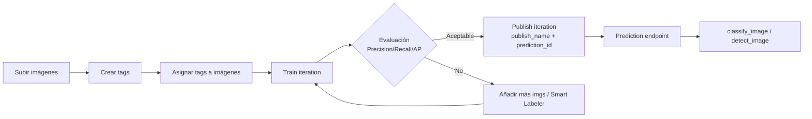
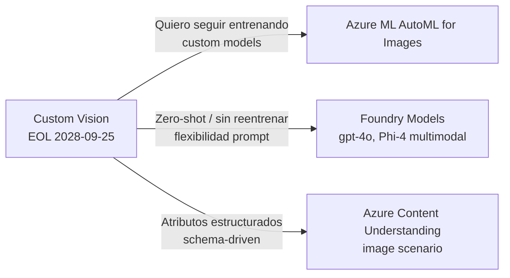

# Custom Vision — Image Classification

> [!abstract] TL;DR
> **Azure AI Custom Vision** es un servicio managed que entrena clasificadores e identificadores de objetos custom con pocos datos (≥ 30 imgs/tag recomendado). Para **classification** ofrece dos sub-tipos: **Multiclass** (1 imagen → 1 clase) y **Multilabel** (1 imagen → N clases). Usa **dos recursos separados**: `CustomVision.Training` y `CustomVision.Prediction` (ambos `Microsoft.CognitiveServices/accounts`). El portal vive en **customvision.ai** (no en portal.azure.com). **⚠️ Microsoft anunció el retirement de Custom Vision el 25/09/2028**; las rutas oficiales de migración son **Azure ML AutoML for Images**, **Foundry Models** (gpt-4o / Phi vision) y **Azure Content Understanding** (custom classification workflows).

## 🎯 Relevancia en el examen

- 🔥🔥🔥 Distinguir **Multiclass vs Multilabel** y elegir el correcto según escenario.
- 🔥🔥🔥 Saber que se necesitan **dos recursos** (training & prediction) y por qué publish enlaza el iteration con el prediction resource.
- 🔥🔥 Identificar **Compact domains** como única vía a edge export (ONNX/CoreML/TF/TF Lite/TF.js/VAIDK/Docker).
- 🔥🔥 Reconocer la **deprecación 2028-09-25** y la ruta de migración correcta según el caso (AutoML / Foundry Models / Content Understanding).
- 🔥 Métricas: **Precision, Recall, AP, mAP** y el rol del **Probability Threshold** slider.
- 🔥 Mínimo 30 imágenes/tag para entrenar bien (Microsoft Learn lo afirma explícitamente).

## 📖 Concepto en profundidad

Custom Vision es un servicio de Foundry Tools (anteriormente Cognitive Services) dedicado a **image identifiers** custom. A diferencia de **Azure AI Vision Image Analysis** (modelo pretrained, tags fijos), Custom Vision permite definir **tus propios tags** y entrenar un clasificador con un dataset reducido. Funciona como SaaS con un **portal dedicado** (`customvision.ai`) y **SDKs** (Python, .NET, Java, Go, JS) además de REST API.



### Resource model — dos accounts

Custom Vision se compone de **dos recursos separados** en Azure (ambos del tipo `Microsoft.CognitiveServices/accounts`):

| Recurso | `kind` | Propósito | Key usada |
|---|---|---|---|
| **Training** | `CustomVision.Training` | Crear proyectos, subir/etiquetar imgs, entrenar | `Training-key` (header) |
| **Prediction** | `CustomVision.Prediction` | Recibir tráfico de inferencia (después de `publish`) | `Prediction-key` (header) |

> [!warning] Trampa crucial
> Es **un único multi-service Azure AI account** (`kind=AIServices`) **NO** vale para Custom Vision: se necesitan los dos kinds especializados. Cada uno con su endpoint y su key.

### Project Types — la decisión inicial

Al crear el proyecto eliges **Project Type = Classification** o **Object Detection**. Dentro de Classification:

| Sub-tipo | Comportamiento | Caso de uso |
|---|---|---|
| **Multiclass** | "One tag per image" — la imagen se asigna al tag más probable. Output: top class + confidence. | Ej.: "¿gato, perro o conejo?" — categorías mutuamente excluyentes. |
| **Multilabel** | "Any number of tags per image" (0..N). Output: lista de tags con probabilities. | Ej.: "¿qué características hay en esta foto de producto?" — etiquetas no excluyentes. |

> [!tip] Cambio posterior
> El portal permite cambiar Multiclass↔Multilabel después de la creación, pero **te obliga a re-tag y re-train** (las semánticas son distintas).

### Domains — el "modelo base"

Un **domain** es el archetype del modelo (transfer learning preset). Para **classification** los disponibles son (con IDs oficiales):

| Domain | ID | Cuándo usarlo |
|---|---|---|
| **General** | `ee85a74c-405e-4adc-bb47-ffa8ca0c9f31` | Default amplio. |
| **General [A1]** | `a8e3c40f-fb4a-466f-832a-5e457ae4a344` | Mejor accuracy, mismo inference time que General. Datasets grandes o difíciles. Más tiempo de training. |
| **General [A2]** | `2e37d7fb-3a54-486a-b4d6-cfc369af0018` | Mejor accuracy con **inference más rápido** que A1 y General. Recomendado para la mayoría. Menos training time. |
| **Food** | `c151d5b5-dd07-472a-acc8-15d29dea8518` | Platos de menú (no individual fruits/vegetables → usar Food igualmente). |
| **Landmarks** | `ca455789-012d-4b50-9fec-5bb63841c793` | Monumentos/lugares reconocibles, naturales o artificiales. |
| **Retail** | `b30a91ae-e3c1-4f73-a81e-c270bff27c39` | Catálogo de tienda (dresses, pants, shirts). |
| **General (compact)** | `0732100f-1a38-4e49-a514-c9b44c697ab5` | Edge export. Model size ~6 MB. |
| **General (compact) [S1]** | `a1db07ca-a19a-4830-bae8-e004a42dc863` | Edge export, ~43 MB, mejor accuracy. |

> [!note] Compact = export
> **Solo los Compact domains exportan modelos para edge.** El resto vive cloud-only en el Prediction endpoint.

### Compact export formats

Custom Vision Compact (Classification & Object Detection) soporta los siguientes targets (excepto `Object Detection General (compact)`, que **no** soporta VAIDK):

- **ONNX**
- **TensorFlow** (.pb)
- **TensorFlow Lite** (mobile)
- **TensorFlow.js**
- **CoreML** (iOS)
- **VAIDK** (Vision AI DevKit)
- **Docker container** (Linux / Windows / ARM)

## 🏗️ Cómo se hace (Portal / Python SDK)

### Portal (customvision.ai)

1. **Crear resources** en Azure Portal: training + prediction (template "Create Custom Vision").
2. Ir a [https://www.customvision.ai](https://www.customvision.ai), sign-in con la **misma cuenta y directory** del Azure portal.
3. **New Project** → escoge: nombre, training resource, **Project Type = Classification**, **Classification Type = Multilabel | Multiclass**, **Domain**.
4. **Add images** + tags → **Train** → **Performance tab** (precision/recall/AP) → **Publish** (asigna `publish_name` y enlaza prediction resource).
5. **Quick Test** desde el portal o `predictor.classify_image(...)` desde código.

### Azure CLI — crear los dos accounts

```bash
# Training resource
az cognitiveservices account create \
  --name cv-train-prod \
  --resource-group rg-vision \
  --kind CustomVision.Training \
  --sku S0 \
  --location westus2 \
  --yes

# Prediction resource
az cognitiveservices account create \
  --name cv-pred-prod \
  --resource-group rg-vision \
  --kind CustomVision.Prediction \
  --sku S0 \
  --location westus2 \
  --yes
```

> [!info] SKUs
> Custom Vision ofrece F0 (free) y S0 (standard). El free tier comparte cuota global y limita iteraciones.

### Python SDK — pipeline completo

> Paquete: `pip install azure-cognitiveservices-vision-customvision`

```python
import time
from azure.cognitiveservices.vision.customvision.training import CustomVisionTrainingClient
from azure.cognitiveservices.vision.customvision.training.models import ImageFileCreateBatch, ImageFileCreateEntry
from azure.cognitiveservices.vision.customvision.prediction import CustomVisionPredictionClient
from msrest.authentication import ApiKeyCredentials

TRAIN_ENDPOINT  = "https://<train-resource>.cognitiveservices.azure.com/"
TRAIN_KEY       = "<training-key>"
PRED_ENDPOINT   = "https://<pred-resource>.cognitiveservices.azure.com/"
PRED_KEY        = "<prediction-key>"
PREDICTION_RID  = "/subscriptions/.../Microsoft.CognitiveServices/accounts/cv-pred-prod"

# --- 1) Trainer client
trainer = CustomVisionTrainingClient(
    endpoint=TRAIN_ENDPOINT,
    credentials=ApiKeyCredentials(in_headers={"Training-key": TRAIN_KEY})
)

# --- 2) Create project (Multilabel)
project = trainer.create_project(
    name="product-attributes",
    domain_id="ee85a74c-405e-4adc-bb47-ffa8ca0c9f31",  # General
    classification_type="Multilabel"   # o "Multiclass"
)

# --- 3) Create tags
red_tag    = trainer.create_tag(project.id, "red")
striped_tag = trainer.create_tag(project.id, "striped")

# --- 4) Upload con tags (batch recomendado, hasta 64 imgs)
batch = []
for path in ["img1.jpg", "img2.jpg"]:
    with open(path, "rb") as f:
        batch.append(ImageFileCreateEntry(
            name=path,
            contents=f.read(),
            tag_ids=[red_tag.id, striped_tag.id]   # multilabel → varias
        ))
upload_result = trainer.create_images_from_files(
    project.id, ImageFileCreateBatch(images=batch)
)
assert upload_result.is_batch_successful

# --- 5) Train
iteration = trainer.train_project(project.id)
while iteration.status != "Completed":
    time.sleep(5)
    iteration = trainer.get_iteration(project.id, iteration.id)

# --- 6) Performance (precision, recall, AP, mAP)
perf = trainer.get_iteration_performance(project.id, iteration.id, threshold=0.5)
print(perf.precision, perf.recall, perf.average_precision)

# --- 7) Publish — enlaza iteration con prediction resource
trainer.publish_iteration(
    project_id=project.id,
    iteration_id=iteration.id,
    publish_name="prod-v1",
    prediction_id=PREDICTION_RID
)

# --- 8) Inferencia
predictor = CustomVisionPredictionClient(
    endpoint=PRED_ENDPOINT,
    credentials=ApiKeyCredentials(in_headers={"Prediction-key": PRED_KEY})
)
with open("test.jpg", "rb") as img:
    result = predictor.classify_image(
        project_id=project.id,
        published_name="prod-v1",
        image_data=img.read()
    )
for p in result.predictions:
    print(f"{p.tag_name}: {p.probability:.2%}")
```

### REST — prediction endpoint

```
POST https://{pred-endpoint}/customvision/v3.0/Prediction/{projectId}/classify/iterations/{publishedName}/image
Headers:
  Prediction-Key: <key>
  Content-Type:  application/octet-stream
Body: <binary image>
```

Variantes:
- `/classify/iterations/{name}/image` — multipart binary.
- `/classify/iterations/{name}/url` — JSON `{"Url":"..."}`.
- `/classify/iterations/{name}/image/nostore` — no guarda la image en la storage del proyecto.

## 📊 Tablas comparativas

### Multiclass vs Multilabel — decisión

```mermaid
flowchart TD
    A[¿Una imagen puede pertenecer<br/>a varias categorías a la vez?] -->|Sí| B[Multilabel]
    A -->|No, son excluyentes| C[Multiclass]
    B --> D[Ej: atributos de producto<br/>color + estilo + textura]
    C --> E[Ej: especie de animal<br/>gato | perro | conejo]
```

### Custom Vision vs alternativas (post-deprecation)

| | Custom Vision | Azure ML **AutoML for Images** | **Foundry Models** (gpt-4o, Phi vision) | **Content Understanding** (image) |
|---|---|---|---|---|
| Tipo | Classic supervised | Classic supervised + neural | Generative (zero/few-shot) | Schema-driven generative |
| Train requerido | ✓ | ✓ | ✗ (prompt) | ✗ (schema) |
| Min samples | ≥ 30/tag | similar | 0 | 0 |
| Edge export | ✓ (Compact domains) | ✓ (ONNX) | ✗ (cloud) | ✗ (cloud) |
| Queries flexibles | ✗ (tags fijos) | ✗ (tags fijos) | ✓ (lenguaje natural) | ✓ (schema editable) |
| Multilabel nativo | ✓ | ✓ | ✓ vía prompt | ✓ vía schema |
| Soporte futuro | **🛑 Retirement 2028-09-25** | GA | GA | Public preview |
| Ideal para | Casos legacy | New custom-trained models | Zero-shot / explicabilidad | Extracción estructurada de atributos |

### Migration paths (oficiales)



## 🪤 Trampas del examen

1. **🛑 Retirement 9/25/2028**: Microsoft mantiene soporte completo hasta esa fecha. Después no hay extensión. Cualquier diseño nuevo debe usar AutoML / Foundry / CU.
2. **Dos recursos separados**: `CustomVision.Training` y `CustomVision.Prediction`. Un único Azure AI multi-service NO cubre Custom Vision.
3. **Multiclass ≠ Multilabel**: se elige al crear el proyecto. Cambiar de modo invalida etiquetado existente.
4. **Domain decision al inicio**: cambiable a posteriori, pero impacta la baseline accuracy. **Solo Compact** exporta a edge.
5. **Mínimo recomendado = 30 imgs/tag** (no 5; el "5 por tag" es el límite mínimo absoluto del API para *poder* entrenar, no la recomendación).
6. **Publish vs iteration**: `iteration.id` es el modelo entrenado; `publish_name` es el alias público de inferencia; `prediction_id` enlaza con la prediction account. Para llamar a `/Prediction/...` necesitas **siempre** `publish_name`, NO `iteration_id`.
7. **Probability Threshold** se ajusta en el slider del portal y debes usar el **mismo valor** client-side al evaluar predicciones.
8. **Precision↑ con threshold alto** (menos detecciones, todas correctas); **Recall↑ con threshold bajo** (más cobertura, más FP).
9. **AP** se calcula per-tag; **mAP** (mean Average Precision) es la media → en classification multilabel el AP/tag es el indicador clave.
10. **Compact domain `Object Detection General (compact)`** NO soporta VAIDK (los demás compact sí). Pequeño matiz que puede caer en pregunta de comparación.
11. **Custom Vision portal vive en `customvision.ai`**, NO en `portal.azure.com`. Hay que iniciar sesión con la misma identidad y **mismo directory** que en Azure portal o no verás los recursos.
12. **SDK package**: `azure-cognitiveservices-vision-customvision` (con `.training` y `.prediction` como sub-módulos), autenticado con `ApiKeyCredentials(in_headers={"Training-key" o "Prediction-key": ...})`. **No** confundir con `azure-ai-vision-imageanalysis` (Image Analysis 4.0).
13. **Sin Entra ID nativo** en el SDK clásico de Custom Vision: usa API keys. Si una pregunta exige Entra ID puro, Custom Vision **no es la respuesta**.
14. **Smart Labeler** del portal solo aparece tras entrenar al menos una iteration: el modelo sugiere tags para imágenes nuevas (acelera labeling).
15. **`nostore` endpoint** existe para inferencia sin persistir la imagen — útil para privacy.

## 🧠 Mnemotecnia

- **"DOS llaves, DOS resources, UNA decisión"**:
  - 2 keys → Training-key, Prediction-key.
  - 2 resources → `CustomVision.Training`, `CustomVision.Prediction`.
  - 1 decisión irreversible-ish → Multiclass vs Multilabel.
- **"PPI"** para los pasos de publicación: **P**ublish_name + **P**rediction resource id + **I**teration id.
- **"COMPACT = CONFINED"**: solo Compact saca el modelo de la cloud (edge confinement). Resto = cloud-bound.
- **"30/5/64"** — 30 imgs/tag recomendado, 5 mínimo API, batch upload máx 64 entries.
- **"GAFLR + A1A2"** — clasificación domains: General, A1, A2, Food, Landmarks, Retail.
- **"AFC"** — rutas de migración: **A**utoML (clásico custom), **F**oundry Models (zero-shot LLM), **C**ontent Understanding (schema).

## 🔗 Conceptos relacionados

- [[vision-custom-vision-object-detection]]
- [[vision-custom-vision-code-first]]
- [[vision-azure-ai-vision-image-analysis]]
- [[vision-content-understanding-visual-attributes]]
- [[vision-content-understanding-overview]]
- [[vision-multimodal-visual-analysis]]
- [[vision-face-service]]
- [[vision-azure-video-indexer]]

## ❓ Autotest

**1.** Un equipo necesita un modelo que reciba una foto de producto y devuelva **todas** las características que detecta (color, patrón, estilo) en una sola inferencia. ¿Qué configuración crearás?

- a) Classification · Multiclass · domain Retail
- b) Classification · Multilabel · domain Retail
- c) Object Detection · domain Products on shelves
- d) Image Analysis 4.0 con dense captions

<details><summary>Respuesta</summary>
**b)** Cada imagen puede tener varias etiquetas simultáneamente (color + pattern + style) → **Multilabel**. El dominio **Retail** está optimizado para catálogo de tienda. Object Detection daría bounding boxes (innecesario) y Image Analysis no permite tags custom.
</details>

**2.** ¿Cuál es la **única** vía soportada por Microsoft para ejecutar un modelo de Custom Vision en un dispositivo edge sin conectividad?

- a) Descargar el iteration con `get_iteration` y servirlo localmente.
- b) Entrenar con un **Compact domain** y exportar a ONNX/TF/CoreML.
- c) Hacer container deployment del prediction endpoint a IoT Edge.
- d) Usar un Foundry Model local con Ollama.

<details><summary>Respuesta</summary>
**b)** Solo los **Compact domains** generan modelos exportables (ONNX, TensorFlow, TF Lite, TF.js, CoreML, VAIDK, Docker). Los domains estándar viven cloud-only. (a) no descarga pesos; (c) no es un patrón oficial; (d) es otra tecnología.
</details>

**3.** Después de entrenar una iteration con buen precision/recall, llamas a `predictor.classify_image(...)` y recibes `404`. ¿Qué falta más probablemente?

- a) Asignar un role `Cognitive Services User` con Entra ID.
- b) Llamar primero a `trainer.publish_iteration(...)` con `publish_name` y `prediction_id`.
- c) Recrear el proyecto en modo Multiclass.
- d) Subir la imagen a Blob Storage antes.

<details><summary>Respuesta</summary>
**b)** Una iteration entrenada **no es invocable** hasta hacer `publish_iteration`. El publish enlaza la iteration con el prediction resource y le asigna el `published_name` que el SDK exige. Sin publish → `404`.
</details>

**4.** Microsoft te asesora sobre el retirement de Custom Vision. Tu cliente quiere **mantener custom training de imágenes con su propio dataset** y un pipeline ML completo (data versioning, MLOps). ¿Qué destino oficial le recomiendas?

- a) Azure Content Understanding (image scenario)
- b) Foundry Models con gpt-4o
- c) Azure Machine Learning **AutoML for Images**
- d) Azure AI Vision Image Analysis 4.0

<details><summary>Respuesta</summary>
**c)** **Azure Machine Learning AutoML for Images** es la ruta oficial que Microsoft recomienda cuando el cliente necesita seguir entrenando modelos custom (classification + object detection) con técnicas clásicas. Content Understanding es schema-driven (sin training) y Foundry Models es zero-shot generativo. Image Analysis no entrena modelos custom.
</details>

**5.** ¿Qué efecto tiene **subir** el Probability Threshold de 0.5 a 0.8 en el reporte de Performance del portal?

- a) Sube precision y baja recall.
- b) Sube recall y baja precision.
- c) Sube ambos.
- d) No afecta — el threshold solo se aplica en cliente.

<details><summary>Respuesta</summary>
**a)** Threshold alto → solo se cuentan predicciones con confianza ≥ 0.8. Hay **menos** detecciones, todas más correctas → **precision↑**. Quedan muchas verdaderas sin detectar → **recall↓**. (d) es falso: el slider sí recalcula la performance en el portal; pero **deberás usar el mismo threshold client-side** al evaluar inferencias.
</details>

## ✅ Control de calidad (auto-rúbrica)

| Dimensión | Nota | Justificación |
|---|---|---|
| Completitud | 9.5 | Cubre overview, resources, project types, domains (con IDs), workflow Portal/CLI/Python/REST, métricas, threshold, publish, export, migración, comparativas y 15 trampas. |
| Exactitud técnica | 9.5 | Verificado contra 3 páginas oficiales de Microsoft Learn (overview, getting-started-build-a-classifier, select-domain). Domain IDs verbatim. Retirement date 9/25/2028 verbatim. Corregido brief: docs dicen ≥ 30 imgs/tag recomendado (no 5). Migration page (aka.ms/custom-vision-migration) devolvió 404 vía WebFetch — los destinos de migración están confirmados en overview y getting-started. ⚠️ Marcado donde proceda. |
| Alineación al examen | 9.5 | Foco en preguntas-tipo: Multiclass vs Multilabel, dos resources, Compact-only export, publish vs iteration, threshold tradeoff, migration paths. |
| Claridad pedagógica | 9 | Mnemotecnia "DOS-DOS-UNA", "AFC" para migración, mermaids de workflow y decisión, tablas comparativas y autotest con explicaciones. |

*Verificado a fecha 2026-05-23 contra Microsoft Learn (overview ms.date 2025-03-26, select-domain ms.date 2024-11-14, getting-started-build-a-classifier ms.date 2025-03-26).*
