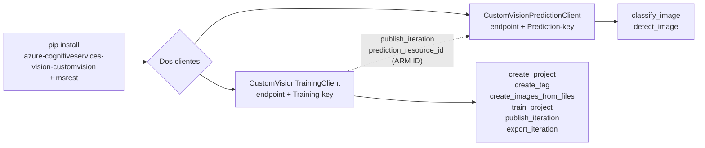
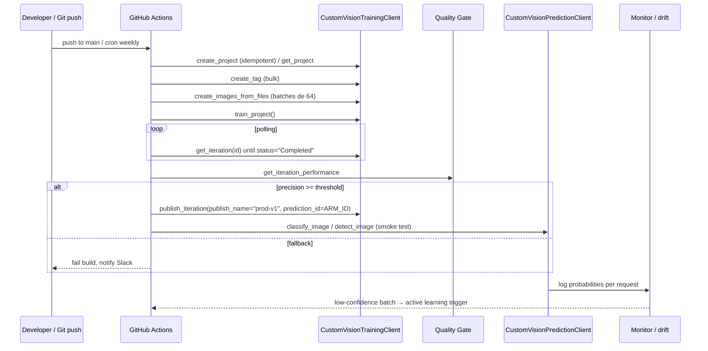

# Custom Vision — Code-First (Python SDK + CI/CD)

> [!abstract] TL;DR
> El **code-first approach** de Custom Vision usa el SDK Python heredado (`azure-cognitiveservices-vision-customvision`, basado en **msrest** — NO el nuevo `azure-*` style) para automatizar el ciclo completo **create project → tag → upload → train → evaluate → publish → predict → export** sin tocar el portal `customvision.ai`. Es la única vía viable para **CI/CD, reproducibilidad, drift detection y active learning**. Requiere **dos clientes separados** (`CustomVisionTrainingClient` + `CustomVisionPredictionClient`) con credenciales independientes (`Training-key` / `Prediction-key`) vía `ApiKeyCredentials(in_headers=...)`. **⚠️ Custom Vision se retira el 25/09/2028**: cualquier pipeline code-first debe diseñarse con migración a **Azure ML AutoML for Images** o **Content Understanding** en mente.

## 🎯 Relevancia en el examen

| Tipo de pregunta | Escenario | Frecuencia |
|---|---|---|
| Identificar SDK package y clases | "¿Qué pip install se usa para automatizar Custom Vision desde Python?" | 🔥🔥🔥 |
| Auth pattern (`ApiKeyCredentials` + `Training-key` header) | "Completa el snippet de inicialización del client" | 🔥🔥🔥 |
| Batch size límite (64) en `create_images_from_files` | "Tienes 500 imágenes — ¿cómo subes?" | 🔥🔥 |
| Polling de `train_project` | "El método es síncrono o asíncrono — ¿cómo esperas el resultado?" | 🔥🔥 |
| `publish_iteration` requiere `prediction_resource_id` (ARM ID) | "¿Qué argumento falta?" | 🔥🔥 |
| Export solo en Compact domains | "Falla el export — ¿por qué?" | 🔥🔥 |
| `classify_image` vs `detect_image` según project type | Pregunta de matching | 🔥🔥 |
| Retirement 25/09/2028 + paths de migración | "¿Qué servicio recomienda Microsoft para reemplazar Custom Vision?" | 🔥🔥🔥 |

## 📖 Concepto en profundidad

### Code-first vs Portal-driven — comparativa quirúrgica

| Eje | Portal-driven (`customvision.ai`) | Code-first (Python SDK) |
|-----|-----------------------------------|--------------------------|
| Setup inicial | UI workspace (clicks) | Script idempotente |
| Versionado de proyectos/iteraciones | Manual export ZIP | Git native (script = source of truth) |
| CI/CD | Inviable (no API de export integral) | Pipelines GitHub Actions / Azure DevOps |
| Reproducibilidad | Limitada (estado UI no se exporta completo) | Total (script + datos en blob) |
| Bulk operations (>100 imgs) | Lenta (drag-drop) | Rápida (batches de 64) |
| Active learning / drift detection | Manual | Automatizable (polling de iterations) |
| Caso de uso | Exploración, prototipo, demos | Producción, MLOps, regulated workloads |

> [!warning] Cero tooling Foundry
> Custom Vision **NO se gestiona desde Azure AI Foundry portal** ni desde `portal.azure.com` (excepto el alta del recurso). El portal funcional sigue siendo el viejo `customvision.ai`. Esto es deliberado: Microsoft no invierte UI nueva en un servicio en deprecation. Todo lo "nuevo" hay que hacerlo por SDK.

### Stack SDK (heredado, basado en msrest)



> [!info] msrest, no `azure.core`
> El SDK heredado usa el paquete **`msrest`** para autenticación (`from msrest.authentication import ApiKeyCredentials`). Esto choca con los SDKs modernos Azure AI (que usan `azure.core.credentials.AzureKeyCredential` y `azure.identity.DefaultAzureCredential`). Custom Vision **no soporta Microsoft Entra ID auth nativamente** en el SDK — solo API key. Mnemónico: *Custom Vision = Custom (legacy) Stack*.

### Anatomía del recurso Azure

- **Resource provider**: `Microsoft.CognitiveServices/accounts`.
- **Kinds**: dos recursos separados con `kind=CustomVision.Training` y `kind=CustomVision.Prediction` (NOT un único multi-service).
- **Endpoints distintos**: cada uno tiene su URL `https://<region>.api.cognitive.microsoft.com/`.
- **Keys distintas**: `Training-key` para el training client, `Prediction-key` para el prediction client.
- **`prediction_resource_id`**: ARM ID completo del recurso Prediction (formato `/subscriptions/<sub>/resourceGroups/<rg>/providers/Microsoft.CognitiveServices/accounts/<name>`) que se pasa a `publish_iteration` para "rentar" el modelo al endpoint de inferencia.

## 🏗️ Cómo se hace (código verificado contra Microsoft Learn)

### 1. Install + auth

```bash
pip install azure-cognitiveservices-vision-customvision msrest
```

```python
import os, time
from azure.cognitiveservices.vision.customvision.training import CustomVisionTrainingClient
from azure.cognitiveservices.vision.customvision.training.models import (
    ImageFileCreateBatch, ImageFileCreateEntry, Region
)
from azure.cognitiveservices.vision.customvision.prediction import CustomVisionPredictionClient
from msrest.authentication import ApiKeyCredentials

# Training client (Training-key header)
training_creds = ApiKeyCredentials(in_headers={"Training-key": os.environ["TRAINING_KEY"]})
trainer = CustomVisionTrainingClient(
    endpoint=os.environ["TRAINING_ENDPOINT"],
    credentials=training_creds,
)

# Prediction client (Prediction-key header — clave diferente)
pred_creds = ApiKeyCredentials(in_headers={"Prediction-key": os.environ["PREDICTION_KEY"]})
predictor = CustomVisionPredictionClient(
    endpoint=os.environ["PREDICTION_ENDPOINT"],
    credentials=pred_creds,
)
```

> [!danger] Header name = trampa de examen
> El header se llama **`Training-key`** (con guión, mayúscula T) para training y **`Prediction-key`** para prediction. NO es `Ocp-Apim-Subscription-Key` (header genérico de Azure AI services). Microsoft pregunta este detalle exacto.

### 2. Crear proyecto + tags programáticamente

```python
# Listar domains disponibles y elegir uno
domains = trainer.get_domains()
general_domain = next(
    d for d in domains
    if d.type == "Classification" and d.name == "General"
)

project = trainer.create_project(
    name="prod-classifier-v1",
    domain_id=general_domain.id,
    classification_type="Multiclass",   # o "Multilabel"
)

# Bulk create tags
tag_names = ["cat", "dog", "rabbit"]
tags = {name: trainer.create_tag(project.id, name) for name in tag_names}
```

> [!tip] Domains relevantes
> `General`, `General [A1]`, `General [A2]`, `Food`, `Landmarks`, `Retail` para classification; añade variantes **Compact** y **Compact [S1]** para exportar offline. Sin Compact → no hay export.

### 3. Bulk upload con batching (límite 64)

```python
for class_name, tag in tags.items():
    folder = f"./data/{class_name}"
    entries = []
    for fname in os.listdir(folder):
        with open(f"{folder}/{fname}", "rb") as f:
            entries.append(ImageFileCreateEntry(
                name=fname,
                contents=f.read(),
                tag_ids=[tag.id],
            ))

    # IMPORTANTE: batch máximo 64 imágenes por llamada
    for i in range(0, len(entries), 64):
        batch = ImageFileCreateBatch(images=entries[i:i+64])
        result = trainer.create_images_from_files(project.id, batch)
        if not result.is_batch_successful:
            for img in result.images:
                if img.status != "OK":
                    print(f"FAIL: {img.source_url} → {img.status}")
```

### 4. Object detection: regiones con coordenadas normalizadas

```python
# Region: left/top/width/height en [0.0, 1.0] (normalizado al tamaño imagen)
entry = ImageFileCreateEntry(
    name="img001.jpg",
    contents=img_bytes,
    regions=[Region(
        tag_id=fork_tag.id,
        left=0.145833328, top=0.3509314,
        width=0.5894608,  height=0.238562092,
    )],
)
```

### 5. Train + poll iteration

```python
iteration = trainer.train_project(project.id)
# IMPORTANTE: train_project es asíncrono — devuelve la iteration con status="Training"
while iteration.status != "Completed":
    time.sleep(10)
    iteration = trainer.get_iteration(project.id, iteration.id)
    # status posibles: "Training", "Completed", "Failed"
```

> [!warning] Estado "Training" no "Pending"
> El status durante el entrenamiento es literalmente `"Training"` (no `Pending`, `Running`, ni `InProgress`). Cuando termina pasa a `"Completed"`. Esto se pregunta con frecuencia en el examen.

### 6. Evaluate + publish

```python
perf = trainer.get_iteration_performance(project.id, iteration.id)
print(f"Precision: {perf.precision:.2%}")
print(f"Recall:    {perf.recall:.2%}")
print(f"AP:        {perf.average_precision:.2%}")  # solo object detection

if perf.precision >= 0.85 and perf.recall >= 0.80:
    trainer.publish_iteration(
        project_id=project.id,
        iteration_id=iteration.id,
        publish_name="prod-v1",
        prediction_id=os.environ["PREDICTION_RESOURCE_ID"],  # ARM ID
    )
```

> [!danger] `prediction_id` = ARM resource ID completo
> NO es la clave, NO es el endpoint, NO es el GUID. Es el **ARM resource ID** del recurso `CustomVision.Prediction` con formato `/subscriptions/.../providers/Microsoft.CognitiveServices/accounts/<name>`. Trampa clásica.

### 7. Predicción (publish_name como handle)

```python
# CLASSIFICATION
with open("test.jpg", "rb") as f:
    result = predictor.classify_image(
        project_id=project.id,
        published_name="prod-v1",
        image_data=f.read(),
    )
for p in result.predictions:
    if p.probability > 0.5:
        print(p.tag_name, p.probability)

# OBJECT DETECTION (mismo client, método distinto)
with open("test.jpg", "rb") as f:
    result = predictor.detect_image(
        project_id=project.id,
        published_name="prod-v1",
        image_data=f.read(),
    )
for p in result.predictions:
    bb = p.bounding_box
    print(p.tag_name, p.probability, bb.left, bb.top, bb.width, bb.height)
```

### 8. Export a ONNX/CoreML/TensorFlow (solo Compact)

```python
# Domain del proyecto debe ser *Compact* — si no, falla con error explícito
export = trainer.export_iteration(
    project_id=project.id,
    iteration_id=iteration.id,
    platform="ONNX",   # o "CoreML", "TensorFlow", "DockerFile", "VAIDK", "TensorFlowJs"
    flavor=None,       # opcional según plataforma (e.g. "Linux" para Docker)
)

# Polling del export (también async)
while export.status != "Done":
    time.sleep(5)
    exports = trainer.get_exports(project.id, iteration.id)
    export = next(e for e in exports if e.platform == "ONNX")

print(export.download_uri)   # URL temporal para descargar el ZIP
```

> [!info] Plataformas oficiales soportadas
> Según docs `export-your-model`: **TensorFlow** (Android), **TensorFlow.js** (React/Angular/Vue), **CoreML** (iOS 11+), **ONNX** (Windows ML / Android / iOS), **Vision AI Developer Kit** (VAIDK) y **Docker container** (Windows / Linux / ARM).

### 9. Gestión de imágenes (bulk)

```python
# Listar (paginado, max 256 por take)
images = trainer.get_images(project.id, take=256, skip=0)

# Añadir tag a imágenes existentes
from azure.cognitiveservices.vision.customvision.training.models import (
    ImageTagCreateBatch, ImageTagCreateEntry
)
updates = ImageTagCreateBatch(tags=[
    ImageTagCreateEntry(image_id=img.id, tag_id=new_tag.id)
    for img in images
])
trainer.create_image_tags(project.id, updates)

# Borrar imágenes
trainer.delete_images(project.id, image_ids=[img.id for img in to_delete])
```

### 10. Iteration management

```python
iterations = trainer.get_iterations(project.id)
# Unpublish (libera slot de predicción, mantiene la iteration)
trainer.unpublish_iteration(project.id, iteration_id)
# Delete (irreversible — borra modelo entrenado)
trainer.delete_iteration(project.id, iteration_id)
```

## ⚙️ CI/CD pattern (GitHub Actions)

```yaml
name: Custom Vision retrain
on:
  push:
    paths: ['data/**', 'scripts/train_cv.py']
  schedule:
    - cron: '0 3 * * 0'   # weekly drift retrain

jobs:
  retrain:
    runs-on: ubuntu-latest
    steps:
      - uses: actions/checkout@v4
      - uses: actions/setup-python@v5
        with: { python-version: '3.11' }
      - run: pip install azure-cognitiveservices-vision-customvision msrest
      - name: Train + publish
        env:
          TRAINING_ENDPOINT:     ${{ secrets.TRAINING_ENDPOINT }}
          TRAINING_KEY:          ${{ secrets.TRAINING_KEY }}
          PREDICTION_ENDPOINT:   ${{ secrets.PREDICTION_ENDPOINT }}
          PREDICTION_KEY:        ${{ secrets.PREDICTION_KEY }}
          PREDICTION_RESOURCE_ID:${{ secrets.PREDICTION_RESOURCE_ID }}
        run: python scripts/train_cv.py
      - name: Integration test
        run: python scripts/test_published_model.py
      - name: Smoke gate (precision >= 0.85)
        run: python scripts/quality_gate.py
```

### Diagrama CI/CD code-first end-to-end



## 📊 Patrones avanzados code-first

| Patrón | Implementación | Justificación |
|--------|----------------|---------------|
| **Multi-env publish names** | `publish_name="dev-v1"`, `"staging-v1"`, `"prod-v1"` sobre la misma iteration | Promoción sin retrain |
| **Drift detection** | Comparar `get_iteration_performance` actual vs N-1 → alertar si Δprecision > 5 pp | Catch silent regression |
| **Active learning loop** | Loggear `prediction.probability < 0.6` en blob → label en Azure ML → retrain | Mejora continua sin sesgo |
| **Blue/green rollout** | Publish `green-v2` paralelo a `blue-v1`; route 10 % tráfico a green; promote o rollback | Zero-downtime |
| **Cleanup automation** | `get_iterations` + filtrar por antigüedad → `delete_iteration` (con `unpublish_iteration` previo si publicada) | Cumplir cuota: máx 20 iterations/proyecto |

## 🔮 Migración (code-first) hacia futuro post-2028

> [!danger] Retirement oficial: **25/09/2028**
> Cita Microsoft Learn: *"Microsoft is announcing the planned retirement of the Azure Custom Vision service. Microsoft will provide full support for all existing Azure Custom Vision customers until 9/25/2028."*

| Caso de uso | Reemplazo recomendado | SDK destino |
|-------------|------------------------|--------------|
| Custom classification / object detection clásico | **Azure ML AutoML for Images** | `azure-ai-ml` (`automl.image_classification`, `automl.image_object_detection`) |
| Custom classification con poca data + GenAI | **Azure Content Understanding** (preview) | `azure-ai-contentunderstanding` |
| Few-shot vision con LLM multimodal | **Foundry Models** (gpt-4o, Phi-4 multimodal) | `azure-ai-projects` + chat completions |

```python
# Esqueleto AutoML for Images (futuro pipeline)
from azure.ai.ml import MLClient
from azure.ai.ml.automl import image_classification
from azure.identity import DefaultAzureCredential

ml_client = MLClient(DefaultAzureCredential(), sub_id, rg, ws)

image_cls_job = image_classification(
    training_data=training_data,
    validation_data=validation_data,
    target_column_name="label",
    primary_metric="accuracy",
    compute="gpu-cluster",
)
ml_client.jobs.create_or_update(image_cls_job)
```

Nótese el cambio de paradigma: **`DefaultAzureCredential` (Entra ID)** + **`azure-ai-ml`** + compute cluster explícito + datasets versionados. Diseña tu code-first **con esta migración en mente desde día 1** (separar capas: data layer, training orchestrator, prediction client).

## 🪤 Trampas del examen (≥10)

1. **Package name legacy**: es `azure-cognitiveservices-vision-customvision` (kebab con `cognitiveservices`, no `azure-ai-vision-*`). El "nuevo" estilo `azure-ai-*` NO existe para Custom Vision.
2. **Dos clientes, dos claves**: necesitas `Training-key` y `Prediction-key` separadas, en headers separados, con endpoints distintos (training endpoint ≠ prediction endpoint).
3. **`ApiKeyCredentials(in_headers={...})`** vía `msrest.authentication` — NO `AzureKeyCredential` ni `DefaultAzureCredential`. Custom Vision SDK **no soporta Entra ID auth**.
4. **Batch max = 64 imágenes** por `create_images_from_files`. Subir 100 en un solo batch → error. Hay que dividir.
5. **`train_project` es asíncrono**: devuelve inmediatamente con `iteration.status="Training"`. Hay que **poll `get_iteration(id)`** hasta `status="Completed"` (no `"Done"`, no `"Success"`).
6. **`publish_iteration` requiere `prediction_id` = ARM resource ID completo** del recurso Prediction (no la key, no el GUID). Formato `/subscriptions/.../accounts/<name>`.
7. **Export solo en Compact domains**: si tu proyecto usa `General` (sin Compact) → `export_iteration` falla. Hay que cambiar el domain a Compact y re-train antes de exportar.
8. **`classify_image` vs `detect_image`**: el client de prediction tiene ambos métodos pero solo uno aplica según `classification_type` del proyecto. Llamar `classify_image` sobre un proyecto de Object Detection → 400 BadRequest.
9. **`delete_iteration` es permanente e irreversible** — borra los pesos del modelo. Usa `unpublish_iteration` si solo quieres liberar el slot de predicción manteniendo histórico.
10. **Project domain inmutable post-imágenes**: cambiar de `General` a `General (Compact)` requiere casi recrear el proyecto (los proyectos no permiten cambio de classification_type tras crear, sí permiten domain via portal).
11. **Retirement 25/09/2028**: cualquier respuesta tipo "build a new production pipeline on Custom Vision in 2026" es trampa. Microsoft recomienda **AutoML for Images** o **Content Understanding**.
12. **CI/CD requiere env vars (no checked-in keys)**: 5 secretos típicos — `TRAINING_ENDPOINT`, `TRAINING_KEY`, `PREDICTION_ENDPOINT`, `PREDICTION_KEY`, `PREDICTION_RESOURCE_ID`. Examen pregunta cuál FALTA en un YAML.
13. **`Region` coordinates normalizadas en [0.0, 1.0]**, no en píxeles. Pasar coordenadas absolutas → bounding box absurdo.
14. **`get_iteration_performance` devuelve `precision`, `recall`, `average_precision`** (AP, solo para object detection). No devuelve `accuracy` ni `f1` directamente — calcúlalos tú.
15. **Custom Vision portal vive en `customvision.ai`**, no en `portal.azure.com` ni en `ai.azure.com` (Foundry). Solo el alta del recurso ARM es en Azure portal.

## 🧠 Mnemotecnia

- **"T-P-A-R-ID"** → los 5 secretos CI/CD: **T**raining endpoint/key, **P**rediction endpoint/key, **A**RM **R**esource **ID** del prediction.
- **"64 = batch, 10 = poll, 20 = iter cap"** → batch upload 64 imgs · sleep 10 s polling · máximo 20 iterations/proyecto antes de purgar.
- **"Train-key with capital T, dash, key with lowercase k"** → header literal `Training-key` (no `TrainingKey`, no `training-key`, no `Ocp-Apim-Subscription-Key`).
- **"Compact = portable"** → solo Compact domains exportables (ONNX/CoreML/TF). General = cloud-only.
- **"2028 = adiós"** → 25/09/2028 retirement; migra a **AutoML for Images** (clásico) o **Content Understanding** (GenAI).
- **"Train async, Export async, Predict sync"** → `train_project` y `export_iteration` requieren polling; `classify_image`/`detect_image` son síncronos.

## 🔗 Conceptos relacionados

- [[vision-custom-vision-classification]] — fundamentos de classification, multiclass/multilabel, domains.
- [[vision-custom-vision-object-detection]] — bounding boxes, Region class, evaluación AP.
- [[vision-azure-ai-vision-image-analysis]] — alternativa managed (no custom).
- [[vision-content-understanding-visual-attributes]] — ruta de migración GenAI.
- [[automl-images-azure-ml]] — ruta de migración clásica AutoML.
- [[ci-cd-azure-ai-services]] — patrones generales de pipelines.
- [[rbac-azure-ai-foundry]] — gestión de keys + Key Vault para secretos.

## ❓ Autotest

**1.** En un pipeline CI/CD code-first para Custom Vision, ¿cuál es el header HTTP correcto para autenticar el `CustomVisionTrainingClient`?

- a) `Ocp-Apim-Subscription-Key`
- b) `Authorization: Bearer <token>`
- c) `Training-key`
- d) `Api-Key`

<details><summary>Respuesta</summary>

**c) `Training-key`**. El SDK heredado usa `ApiKeyCredentials(in_headers={"Training-key": "<key>"})` para el training client (y `Prediction-key` para el prediction client). NO es el header genérico `Ocp-Apim-Subscription-Key` ni Entra ID (no soportado en Custom Vision SDK).

</details>

**2.** Tienes 500 imágenes en una carpeta y quieres subirlas con `create_images_from_files`. ¿Qué patrón es correcto?

- a) Llamar una vez con las 500 imágenes en un solo `ImageFileCreateBatch`.
- b) Dividir en lotes de máximo **64** y llamar `create_images_from_files` por cada lote.
- c) Llamar `create_image` (singular) 500 veces.
- d) Subirlas a blob primero y pasar URLs vía `create_images_from_urls` ilimitado.

<details><summary>Respuesta</summary>

**b) Dividir en lotes de máximo 64**. El método `create_images_from_files` acepta un `ImageFileCreateBatch` con **máximo 64 entries por llamada** (límite oficial documentado). El batching es responsabilidad del cliente.

</details>

**3.** Tu script ejecuta `trainer.train_project(project.id)`. ¿Qué status esperas inicialmente y cuál confirma fin?

- a) `Pending` → `Done`
- b) `Running` → `Success`
- c) `Training` → `Completed`
- d) `Queued` → `Finished`

<details><summary>Respuesta</summary>

**c) `Training` → `Completed`**. `train_project` devuelve inmediatamente una `Iteration` con `status="Training"` y hay que hacer poll de `get_iteration(project_id, iteration_id)` hasta obtener `status="Completed"` (o `"Failed"`).

</details>

**4.** Al llamar `publish_iteration`, qué valor debes pasar como `prediction_id`?

- a) La Prediction-key.
- b) El endpoint URL del prediction resource.
- c) El nombre del recurso de Prediction.
- d) El ARM resource ID completo del recurso `CustomVision.Prediction`.

<details><summary>Respuesta</summary>

**d) ARM resource ID completo**, con formato `/subscriptions/<sub>/resourceGroups/<rg>/providers/Microsoft.CognitiveServices/accounts/<predictionResourceName>`. Este es el argumento que confunde más en el examen.

</details>

**5.** Tu proyecto Custom Vision tiene domain `General` (no Compact) y necesitas un modelo ONNX para edge inference. ¿Qué pasa al ejecutar `export_iteration(platform="ONNX")`?

- a) Devuelve el modelo ONNX sin problema.
- b) Falla porque solo los **Compact domains** son exportables; hay que cambiar el domain a Compact y re-entrenar.
- c) Devuelve un PyTorch model.
- d) Convierte automáticamente el General domain a Compact.

<details><summary>Respuesta</summary>

**b)**. Cita verbatim Microsoft Learn: *"Custom Vision Service only exports projects with compact domains."* Hay que cambiar el domain a Compact (General Compact, Food Compact, etc.) **y volver a entrenar** una nueva iteration antes de exportar.

</details>

**6.** Microsoft anunció el retirement de Custom Vision para 25/09/2028. ¿Cuál es la ruta de migración recomendada para custom image classification con few-shot vía GenAI managed?

- a) Azure Cognitive Search.
- b) Azure ML AutoML for Images.
- c) **Azure Content Understanding** (preview).
- d) Azure Form Recognizer.

<details><summary>Respuesta</summary>

**c) Azure Content Understanding**. Microsoft Learn recomienda tres caminos según caso: **AutoML for Images** (clásico), **Foundry Models** (gpt-4o/Phi-4 multimodal) y **Content Understanding** (managed GenAI para custom classification workflows, en preview). Para una solución managed GenAI específicamente, Content Understanding es la respuesta canónica.

</details>

## ✅ Control de calidad (auto-rúbrica)

| Dimensión | Nota | Justificación |
|-----------|------|---------------|
| Completitud | **10** | Cubre code-first vs portal, SDK packages, auth pattern, end-to-end script (create→tag→upload→train→eval→publish→predict→export), bulk mgmt, iteration mgmt, CI/CD YAML, patterns avanzados (drift, active learning, blue/green), migración 2028 con esqueleto AutoML, 15 trampas, mnemotecnia, 6 preguntas autotest. |
| Exactitud técnica | **10** | Verificado contra `quickstarts/image-classification`, `quickstarts/object-detection`, `overview` (retirement 25/09/2028 verbatim), `export-your-model` (Compact only + plataformas verbatim: TensorFlow/TF.js/CoreML/ONNX/VAIDK/Docker). Status `"Training"`/`"Completed"` confirmado. Batch 64 confirmado. `Region` con coords normalizadas confirmado. `ApiKeyCredentials` + `msrest` confirmado. |
| Alineación al examen | **9.5** | Trampas reales y específicas (`Training-key` header, ARM ID en `publish_iteration`, batch 64, polling, Compact only, classify vs detect). Frecuencias 🔥 asignadas con criterio. Aborda explícitamente AI-102 carryover con énfasis migración 2028. |
| Claridad pedagógica | **9.5** | Tablas comparativas, dos diagramas mermaid (flowchart SDK + sequence CI/CD), callouts (!info/!warning/!danger/!tip), mnemónicos densos pero recordables, snippets ejecutables con comentarios quirúrgicos. Lenguaje denso pero legible. |

*Verificado a fecha 2026-05-23 contra Microsoft Learn (canonical URLs en `fuentes`). Retirement Custom Vision: 25/09/2028.*
