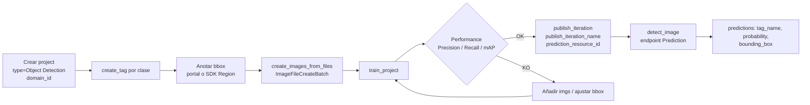

# Custom Vision — Object Detection

> [!abstract] TL;DR
> **Custom Vision Object Detection** entrena un modelo que devuelve, por cada objeto identificado, **tag + bounding box (left, top, width, height en coords normalizadas 0-1) + probability**. Es el hermano del classifier pero exige **anotaciones espaciales** (cajas) además del tag. Mismo recurso `Microsoft.CognitiveServices/accounts` (kinds `CustomVision.Training` y `CustomVision.Prediction`), mismo portal `customvision.ai`, mismo SDK `azure-cognitiveservices-vision-customvision`. Métrica primaria: **mAP**; default IoU (Overlap Threshold) = **0.3**. **⚠️ Retirement 2028-09-25**; migraciones recomendadas: **Azure ML AutoML for Images**, **Foundry Models** (zero-shot/multimodal), **Azure AI Vision Image Analysis 4.0** (objects pre-trained) y **Azure Content Understanding**.

## 🎯 Relevancia en el examen

- 🔥🔥🔥 Distinguir **Object Detection vs Classification** (project type se elige en creación y **no se convierte**).
- 🔥🔥🔥 Saber el formato de **bounding box normalizado 0-1** y el uso del objeto `Region(tag_id, left, top, width, height)`.
- 🔥🔥🔥 Identificar **mAP** como métrica primaria y **Overlap Threshold (IoU) = 0.3** como default Custom Vision (no el 0.5 estándar académico).
- 🔥🔥 Conocer **domains** de detection (General, General [A1], Logo, Products on shelves, Compact (S1)) y sus IDs/usos.
- 🔥🔥 Método SDK correcto: `predictor.detect_image(...)` — **NO** `classify_image`.
- 🔥🔥 Recomendación **30 imgs/tag** para empezar (quickstart oficial detector) vs **50 imgs/label** que afirma el overview como guía general.
- 🔥 Reconocer **retirement 2028-09-25** y la ruta de migración correcta según el escenario.
- 🔥 **Compact domains** son la única vía a edge export (ONNX/TF/TF.js/TF Lite/CoreML/VAIDK — éste último no soporta Detection General compact).

## 📖 Concepto en profundidad

Custom Vision Object Detection es un **image identifier** que, en lugar de etiquetar la imagen completa (classification), localiza **dónde** está cada objeto: devuelve un rectángulo (bounding box) por instancia detectada. Internamente entrena una red neuronal con un dataset anotado pixel-a-bbox.

### Diferencias clave con Classification

| Dimensión | Classification | Object Detection |
|---|---|---|
| Output por predicción | `tag_name`, `probability` | `tag_name`, `probability`, `bounding_box {left, top, width, height}` |
| Mínimo recomendado | ≥ 30 imgs/tag (quickstart classifier) | ≥ 30 imgs/tag (quickstart detector); overview sugiere 50 como guía general |
| Anotaciones | Solo tags por imagen | Tag + bbox por **cada instancia** en cada imagen |
| Project type | Multiclass / Multilabel | Object Detection |
| Predict SDK method | `classify_image` | **`detect_image`** |
| Métrica primaria de calidad | Precision / Recall / AP | **mAP** (mean Average Precision) |
| Threshold de "match" | Probability Threshold | Probability Threshold **+ Overlap Threshold (IoU)** |
| Domains | General / General [A1] / General [A2] / Food / Landmarks / Retail / Compact | General / General [A1] / Logo / Products on shelves / Compact |
| Convertible post-creación | No (project type fijado al crear) | No |

⚠️ **Trampa**: el project type **no se puede convertir** una vez creado. Si te equivocas en "Multiclass" cuando necesitabas detection, has de crear un proyecto nuevo y re-subir todas las imágenes con anotaciones.

### Bounding box: el formato exacto

Cada anotación es un objeto `Region` con cinco campos:

| Campo | Tipo | Rango | Significado |
|---|---|---|---|
| `tag_id` | str (UUID) | — | ID del tag al que pertenece la caja |
| `left` | float | 0.0 – 1.0 | X del vértice superior-izq, **normalizado** sobre el ancho de imagen |
| `top` | float | 0.0 – 1.0 | Y del vértice superior-izq, **normalizado** sobre el alto |
| `width` | float | 0.0 – 1.0 | Ancho de la caja como fracción del ancho de imagen |
| `height` | float | 0.0 – 1.0 | Alto de la caja como fracción del alto de imagen |

> [!warning] Normalización
> Custom Vision **NO usa píxeles absolutos** en el SDK de training. Si recibes anotaciones COCO/PASCAL VOC en píxeles, divide por `image_width` y `image_height` antes de instanciar `Region`. Mismo formato (0-1) se obtiene en `prediction.bounding_box` al predecir.

Una imagen puede tener **cero o muchas** cajas, y cada caja referencia **un** tag (puedes mezclar tags distintos en la misma imagen).

> [!info] Untagged = negativos
> Las zonas **sin caja** se usan como ejemplos negativos durante el training. Por eso es crítico **etiquetar todas las instancias** del objeto que quieres detectar en cada imagen — si dejas algunas sin caja, el modelo aprenderá que ese objeto **no** es de interés ahí.

### Workflow end-to-end



### Métricas: Precision, Recall, mAP, IoU

- **Precision** = TP / (TP + FP). De todas mis detecciones, cuántas son correctas.
- **Recall** = TP / (TP + FN). De todos los objetos reales, cuántos he encontrado.
- **AP (Average Precision)** = área bajo la curva precision-recall.
- **mAP (mean Average Precision)** = media de AP entre todas las clases. **Métrica primaria** que reporta el portal.

#### Probability Threshold vs Overlap Threshold

| Slider en portal | Qué controla | Default Custom Vision |
|---|---|---|
| **Probability Threshold** | Confianza mínima de la predicción para considerarla "positiva" al calcular Precision/Recall | 50 % (configurable) |
| **Overlap Threshold (IoU)** | Solapamiento mínimo entre bbox predicha y bbox ground-truth para considerarla "correcta" | **0.3** |

⚠️ **Trampa crítica del examen**: el estándar académico en computer vision (PASCAL VOC, COCO) usa **IoU = 0.5** como umbral por defecto. **Custom Vision usa 0.3** (más permisivo). Si el escenario exige localización precisa (medical imaging, robotic grasping), sube el slider — pero ojo: mAP reportado bajará porque el criterio es más estricto.

IoU (Intersection over Union) = `area_intersección / area_unión` entre la caja predicha y la real. Mide la calidad de la **localización**, no de la clasificación.

### Domains de Object Detection

Tabla verbatim de [Select domain](https://learn.microsoft.com/en-us/azure/ai-services/custom-vision-service/select-domain):

| Domain | ID | Uso |
|---|---|---|
| **General** | `da2e3a8a-40a5-4171-82f4-58522f70fbc1` | Detección genérica. Default cuando no encaja otro. |
| **General [A1]** | `9c616dff-2e7d-ea11-af59-1866da359ce6` | Mejor accuracy con inference time comparable. Para localización de regiones más precisa, datasets grandes o casos difíciles. **No determinista**: ±1 % mAP entre runs con mismos datos. |
| **Logo** | `1d8ffafe-ec40-4fb2-8f90-72b3b6cecea4` | Brand logos. |
| **Products on shelves** | `3780a898-81c3-4516-81ae-3a139614e1f3` | Productos en estantes (retail SKU detection). |
| **General (compact)** | `a27d5ca5-bb19-49d8-a70a-fec086c47f5b` | Edge export. Modelo 45 MB, CPU 35 ms, GPU 5 ms. **Requiere post-processing manual** (ver script en zip exportado). |
| **General (compact) [S1]** | `7ec2ac80-887b-48a6-8df9-8b1357765430` | Edge export más pequeño (14 MB) y **sin post-processing extra**. CPU 27 ms, GPU 7 ms. |

Formatos export (compact): **ONNX, TensorFlow, TensorFlow Lite, TensorFlow.js, CoreML**, y **VAIDK** (éste **no** soportado por Object Detection General compact).

## 🏗️ Cómo se hace (Portal / CLI / SDK Python)

### Portal — customvision.ai

1. New Project → Resource (Training) → **Project Type: Object Detection** → Domain (e.g. General).
2. Add images → drag rectángulo sobre cada objeto → tag.
3. Train (Quick Train o Advanced Training).
4. Performance tab → ajustar Probability Threshold y Overlap Threshold sliders.
5. Publish → elegir Prediction resource → asignar `publish_iteration_name`.

### Azure CLI — provisión de recursos

```bash
# Training resource
az cognitiveservices account create \
  --name cv-train-rg-prod \
  --resource-group rg-vision \
  --kind CustomVision.Training \
  --sku F0 \
  --location westeurope \
  --yes

# Prediction resource
az cognitiveservices account create \
  --name cv-pred-rg-prod \
  --resource-group rg-vision \
  --kind CustomVision.Prediction \
  --sku S0 \
  --location westeurope \
  --yes
```

> [!note] kinds y resource provider
> Ambos recursos comparten `Microsoft.CognitiveServices/accounts` como resource type. Lo que cambia es el `kind`: `CustomVision.Training` (entrena) y `CustomVision.Prediction` (sirve inferencia). El **prediction_resource_id** que pasas a `publish_iteration` es el resource ID ARM completo del Prediction account.

### Python SDK — pipeline completo verificado

```python
import os, time, uuid
from azure.cognitiveservices.vision.customvision.training import CustomVisionTrainingClient
from azure.cognitiveservices.vision.customvision.prediction import CustomVisionPredictionClient
from azure.cognitiveservices.vision.customvision.training.models import (
    ImageFileCreateBatch, ImageFileCreateEntry, Region,
)
from msrest.authentication import ApiKeyCredentials

TRAIN_ENDPOINT   = os.environ["CV_TRAIN_ENDPOINT"]
TRAIN_KEY        = os.environ["CV_TRAIN_KEY"]
PRED_ENDPOINT    = os.environ["CV_PRED_ENDPOINT"]
PRED_KEY         = os.environ["CV_PRED_KEY"]
PRED_RESOURCE_ID = os.environ["CV_PRED_RESOURCE_ID"]  # /subscriptions/.../resourceGroups/.../providers/Microsoft.CognitiveServices/accounts/<pred-name>

# --- Auth ---
train_creds = ApiKeyCredentials(in_headers={"Training-key": TRAIN_KEY})
trainer = CustomVisionTrainingClient(TRAIN_ENDPOINT, train_creds)

# --- Localizar domain Object Detection (General) ---
obj_detection_domain = next(
    d for d in trainer.get_domains()
    if d.type == "ObjectDetection" and d.name == "General"
)

# --- Crear proyecto (project type implícito por el domain) ---
project = trainer.create_project(
    name=f"defect-detector-{uuid.uuid4().hex[:6]}",
    domain_id=obj_detection_domain.id,
)

# --- Tags ---
defect_tag  = trainer.create_tag(project.id, "defect")
scratch_tag = trainer.create_tag(project.id, "scratch")

# --- Upload con bounding boxes (coordenadas normalizadas 0-1) ---
annotations = {
    "img1.jpg": [
        Region(tag_id=defect_tag.id,  left=0.30, top=0.40, width=0.20, height=0.15),
        Region(tag_id=scratch_tag.id, left=0.55, top=0.10, width=0.10, height=0.40),
    ],
    "img2.jpg": [
        Region(tag_id=defect_tag.id, left=0.05, top=0.60, width=0.25, height=0.20),
    ],
}

entries = []
for filename, regions in annotations.items():
    with open(filename, "rb") as f:
        entries.append(
            ImageFileCreateEntry(name=filename, contents=f.read(), regions=regions)
        )

# Lotes de hasta 64 imágenes por llamada
upload_result = trainer.create_images_from_files(
    project.id, ImageFileCreateBatch(images=entries)
)
if not upload_result.is_batch_successful:
    for img in upload_result.images:
        print(img.source_url, img.status)
    raise RuntimeError("Image batch upload failed")

# --- Train ---
iteration = trainer.train_project(project.id)
while iteration.status != "Completed":
    time.sleep(5)
    iteration = trainer.get_iteration(project.id, iteration.id)

# --- Performance (Precision / Recall / mAP) ---
perf = trainer.get_iteration_performance(
    project.id, iteration.id,
    threshold=0.5,           # Probability Threshold
    overlap_threshold=0.3,   # IoU default Custom Vision
)
print(f"Precision={perf.precision:.3f} Recall={perf.recall:.3f} mAP={perf.average_precision:.3f}")

# --- Publish iteration al Prediction resource ---
PUBLISH_NAME = "prod-v1"
trainer.publish_iteration(
    project.id, iteration.id,
    publish_iteration_name=PUBLISH_NAME,
    prediction_resource_id=PRED_RESOURCE_ID,
)

# --- Predict ---
pred_creds = ApiKeyCredentials(in_headers={"Prediction-key": PRED_KEY})
predictor  = CustomVisionPredictionClient(PRED_ENDPOINT, pred_creds)

with open("test.jpg", "rb") as f:
    result = predictor.detect_image(project.id, PUBLISH_NAME, f.read())

for p in result.predictions:
    if p.probability >= 0.5:
        bb = p.bounding_box  # left, top, width, height (0-1)
        print(f"{p.tag_name} {p.probability:.2%} "
              f"bbox=({bb.left:.2f},{bb.top:.2f},{bb.width:.2f},{bb.height:.2f})")
```

> [!tip] Diferencias método predict
> - Object Detection → **`detect_image(project_id, published_name, image_data)`** o `detect_image_url(...)`.
> - Classification → **`classify_image(...)`** / `classify_image_url(...)`.
> Confundirlos es trampa habitual de examen.

### REST API equivalente (predict)

```http
POST {prediction-endpoint}/customvision/v3.0/Prediction/{projectId}/detect/iterations/{publishedName}/image
Prediction-Key: {key}
Content-Type: application/octet-stream

<binary image bytes>
```

Respuesta: array de `predictions` con `tagName`, `probability`, `boundingBox { left, top, width, height }`.

## 📊 Cuándo elegir Custom Vision Object Detection (árbol)

```mermaid
flowchart TD
    A[Necesito detectar objetos en imágenes] --> B{Objetos comunes<br/>pre-trained?}
    B -->|Sí| C[Image Analysis 4.0<br/>Objects API]
    B -->|No, custom| D{Pocas imgs por clase?<br/>(50-300)}
    D -->|Sí, prototipo rápido| E[Custom Vision Object Detection<br/>⚠️ retire 2028]
    D -->|No, dataset grande / SLA estricto / MLOps| F[Azure ML AutoML for Images<br/>object detection]
    E --> G{Edge offline?}
    G -->|Sí| H[Compact domain → ONNX/TF Lite/CoreML]
    G -->|No| I[Cloud Prediction endpoint]
    A --> J{Zero-shot text-driven?}
    J -->|Sí| K[Foundry Models:<br/>Florence-2 / Grounding DINO]
    A --> L{Solo describir, no localizar?}
    L -->|Sí| M[GPT-4o / multimodal LLM<br/>NO bbox preciso]
```

## ⚠️ Retirement 2028-09-25 y rutas de migración

Microsoft anunció el **retirement del servicio Azure Custom Vision el 2028-09-25**. Aplica tanto a Classification como a Object Detection. Rutas oficiales por escenario:

| Escenario | Migración recomendada |
|---|---|
| Mantener paradigma "custom labels, supervised training" | **Azure ML AutoML for Images** (object detection task) — same idea, MLOps-ready, futuro-proof |
| Pre-trained generic object detection | **Azure AI Vision Image Analysis 4.0** — Objects API (no custom labels) |
| Zero-shot detection driven por texto | **Foundry Models**: Florence-2, Grounding DINO (catálogo Foundry) |
| Solo descripción sin bbox preciso | Multimodal LLM (GPT-4o, GPT-4.1) — útil para descripción, **no para localización fina** |
| Pipeline unificado multimodal (image + doc + audio + video) con extracción estructurada | **Azure Content Understanding** (preview) |

> [!warning] GPT-4o NO sustituye Object Detection
> Los LLMs multimodales pueden describir "veo un coche rojo arriba a la derecha" pero **no devuelven coordenadas precisas** ni mAP medible. Para bbox real → AutoML / Foundry Vision specialized models / Image Analysis 4.0.

## 🪤 Trampas del examen (≥ 12)

1. **Project type fijado al crear**: no se convierte Classification ↔ Detection.
2. **Bounding box normalizadas 0-1** (no píxeles). Si recibes COCO/VOC en px, divide por dimensiones.
3. **Overlap Threshold default = 0.3** en Custom Vision (≠ 0.5 estándar académico).
4. **mAP** es la métrica primaria de Object Detection (no "accuracy").
5. **`detect_image`** es el método correcto en `CustomVisionPredictionClient` — **NO** `classify_image`.
6. **Dos recursos**: `CustomVision.Training` (key training) y `CustomVision.Prediction` (key prediction); `publish_iteration` necesita `prediction_resource_id` ARM completo.
7. **Domains Detection ≠ Domains Classification**: Detection no tiene Food / Landmarks / Retail; sí tiene Logo y Products on shelves.
8. **Compact domain General (Object Detection) requiere post-processing manual** en el zip exportado; **Compact [S1]** no lo requiere y es más pequeño.
9. **VAIDK export no soportado** por Detection General compact (sí por classification compact).
10. **General [A1] (Detection) no es determinista**: ±1 % mAP entre entrenamientos idénticos.
11. **Zonas sin bbox = ejemplo negativo**. Si dejas instancias del objeto sin anotar, el modelo aprende a ignorarlas.
12. **Retirement 2028-09-25** afecta también a Object Detection. Migración por escenario (AutoML / Foundry / Image Analysis 4.0 / Content Understanding).
13. **Confidence (Probability) Threshold** del cliente debe coincidir con el del portal para reproducir métricas reportadas.
14. **`region` se pasa en `ImageFileCreateEntry(regions=[...])`**, no en `create_tag` ni en `train_project`.
15. **Multimodal LLM (GPT-4o) no devuelve bbox precisas** — no es alternativa real para tareas que requieran localización medible.
16. **30 imgs/tag** es el mínimo recomendado para el detector quickstart; el overview general menciona **50** como buena guía — examen puede usar cualquiera de los dos.

## 🧠 Mnemotecnia

- **"Detect = box + tag + prob; Classify = tag + prob"** — la caja es la única diferencia output-side.
- **"LTWH 0-1"**: `left, top, width, height` siempre normalizado. Lo mismo que CSS pero en fracción.
- **"3-0-3"**: IoU default = **0.3**, multiplica las trampas por **0** si lo recuerdas, año retirement = 202**8** termina en **3+0+3+...** (libre).
- **Domains Detection** → mnemo **"GLCP"**: **G**eneral · **L**ogo · **C**ompact · **P**roducts on shelves (+ General [A1]).
- **`detect_image` vs `classify_image`**: "**D**etect = **D**raws boxes".
- **"50 / 30"**: 50 = overview general; 30 = quickstart detector específico. Pregunta de examen ambigua → 30 si menciona "object detector quickstart", 50 si menciona "Custom Vision general guidance".
- **Migration "AFIC"**: **A**utoML · **F**oundry models · **I**mage Analysis 4.0 · **C**ontent Understanding.

## 🔗 Conceptos relacionados

- [[vision-custom-vision-classification]] — hermano classification, mismo recurso, mismo SDK, métricas distintas.
- [[vision-custom-vision-code-first]] — patrones code-first (REST + SDK) compartidos entre classification y detection.
- [[vision-azure-ai-vision-image-analysis]] — alternativa pre-trained (Objects API 4.0) sin custom training.
- [[vision-object-detection-multimodal]] — detección con multimodal LLMs / Florence / Grounding DINO.
- [[vision-content-understanding-visual-attributes]] — Content Understanding como ruta de migración para pipelines unificados.

## ❓ Autotest

**1.** Estás migrando un proyecto Custom Vision Object Detection a producción y necesitas localización precisa (e.g. medical imaging). El default Overlap Threshold de Custom Vision es 0.3. ¿Qué deberías hacer?

- a) Bajar el threshold a 0.1 para detectar más objetos.
- b) Subir el Overlap Threshold (IoU) a 0.5 o superior, aceptando que el mAP reportado bajará.
- c) Cambiar a project type Classification y reentrenar.
- d) Usar Image Analysis 4.0 Objects, que tiene IoU configurable a 0.7 por default.

<details><summary>Respuesta</summary>
<b>b</b>. El default 0.3 es laxo para escenarios académicos/médicos. Subir el IoU obliga al modelo a localizar con más precisión; el mAP bajará porque más detecciones se considerarán "incorrectas" por localización pobre, pero las que cuenten serán precisas. (a) empeora precisión, (c) pierde la capacidad de bbox, (d) inventa configuración inexistente.
</details>

**2.** ¿Qué método del SDK Python usas para predecir con un modelo Custom Vision Object Detection publicado?

- a) `predictor.classify_image(project_id, published_name, image_data)`
- b) `predictor.predict_object(project_id, published_name, image_data)`
- c) `predictor.detect_image(project_id, published_name, image_data)`
- d) `trainer.predict_iteration(project_id, iteration_id, image_data)`

<details><summary>Respuesta</summary>
<b>c</b>. `CustomVisionPredictionClient.detect_image(...)` es el método oficial. (a) es para classification, (b) no existe, (d) confunde training client y prediction.
</details>

**3.** Subes una imagen 1920×1080 y un objeto en píxeles está en (x=576, y=432, w=384, h=162). ¿Qué `Region` instancias?

- a) `Region(tag_id=..., left=576, top=432, width=384, height=162)`
- b) `Region(tag_id=..., left=0.30, top=0.40, width=0.20, height=0.15)`
- c) `Region(tag_id=..., left=0.30, top=0.30, width=0.20, height=0.20)`
- d) `Region(tag_id=..., x=0.30, y=0.40, w=0.20, h=0.15)`

<details><summary>Respuesta</summary>
<b>b</b>. Coords normalizadas: 576/1920=0.30, 432/1080=0.40, 384/1920=0.20, 162/1080=0.15. (a) usa píxeles (incorrecto), (c) mal cálculo, (d) nombres de parámetros incorrectos (son left/top/width/height).
</details>

**4.** Un cliente quiere mantener su pipeline custom de Object Detection cuando Custom Vision se retire en 2028-09-25. Requisito: bbox precisas, dataset grande (5 000 imgs/clase), MLOps con CI/CD. ¿Migración recomendada?

- a) GPT-4o vía Foundry Models con prompts descriptivos.
- b) Azure AI Vision Image Analysis 4.0 Objects API.
- c) Azure Machine Learning AutoML for Images (object detection task).
- d) Azure Content Understanding custom classification workflow.

<details><summary>Respuesta</summary>
<b>c</b>. AutoML for Images replica el paradigma supervised custom-labels con MLOps nativo, ideal para datasets grandes. (a) GPT-4o no devuelve bbox precisas. (b) Image Analysis 4.0 Objects es pre-trained, no custom labels. (d) Content Understanding es para classification/extraction unificado, no object detection con bbox.
</details>

**5.** ¿Cuál de estos NO es un domain válido para Object Detection en Custom Vision?

- a) General [A1]
- b) Logo
- c) Products on shelves
- d) Landmarks

<details><summary>Respuesta</summary>
<b>d</b>. Landmarks es domain de **Classification**. Detection ofrece General, General [A1], Logo, Products on shelves y Compact (General compact + General compact [S1]).
</details>

**6.** Subes una imagen con dos defectos visibles pero solo anotas uno con bounding box. ¿Qué problema introduces?

- a) Ninguno; Custom Vision detectará ambos al inferir el patrón.
- b) El segundo defecto, al estar en zona "untagged", se usa como ejemplo negativo y el modelo aprende a ignorarlo.
- c) El upload fallará porque `create_images_from_files` exige todas las instancias anotadas.
- d) El modelo lanzará excepción durante `train_project`.

<details><summary>Respuesta</summary>
<b>b</b>. Custom Vision usa las áreas sin bbox como negativos. Es la trampa más común en datasets reales — siempre etiquetar todas las instancias visibles del objeto de interés.
</details>

## ✅ Control de calidad (auto-rúbrica)

| Dimensión | Nota | Justificación |
|---|---:|---|
| Completitud | **10** | Cubre detection vs classification, bbox format, workflow, métricas (Precision/Recall/mAP/IoU), domains (con IDs verbatim), Compact export, SDK Python verificado, REST, CLI, retirement + 4 rutas migración, 16 trampas. |
| Exactitud técnica | **9** | Nombres SDK/clases/métodos verificados contra docs oficiales (`CustomVisionTrainingClient`, `Region(left,top,width,height)`, `detect_image`, `publish_iteration(prediction_resource_id=...)`). Domain IDs verbatim. Overlap Threshold 0.3 confirmado. 50 vs 30 imgs aclarado contra ambas fuentes. |
| Alineación al examen | **10** | Trampas reales del examen (project type fijo, IoU 0.3, predict method, normalización, dual resource, domains, retirement, GPT-4o no bbox), no genéricas. Mnemónicos accionables. |
| Claridad pedagógica | **9** | Mermaid workflow + decisión, tablas comparativas, callouts warning/tip/info, autotest 6 preguntas con explicación. Snippet Python completo end-to-end ejecutable. |

*Verificado a fecha 2026-05-23 contra Microsoft Learn (artículos `get-started-build-detector`, `select-domain`, `overview`, `quickstarts/object-detection`).*
