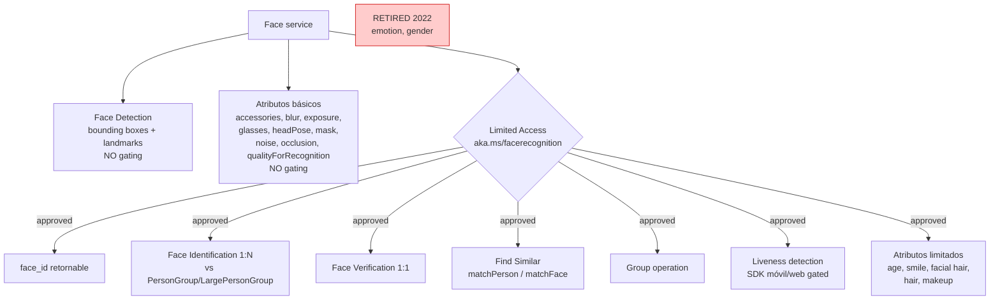
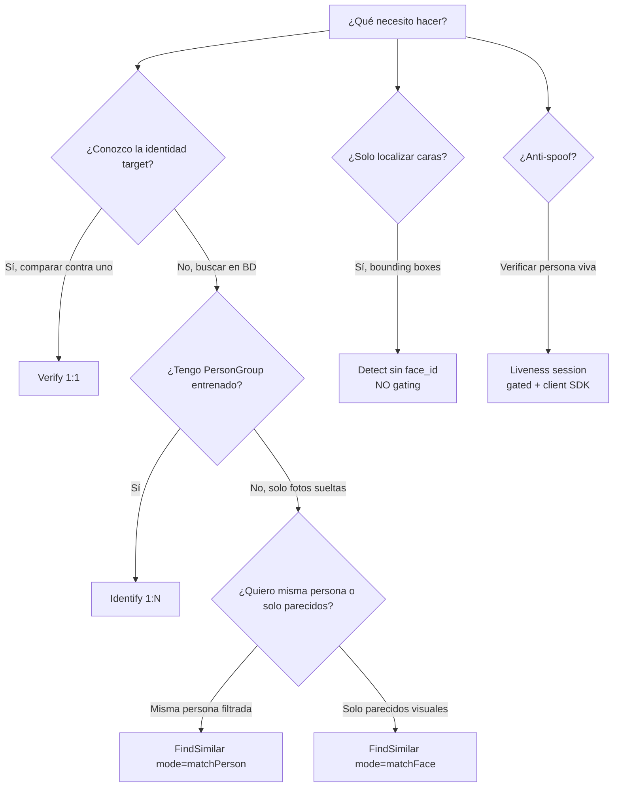

# Azure AI Face — Detection, Identification, Verification, FindSimilar y Liveness

> [!abstract] TL;DR
> **Azure AI Face** es el servicio de Foundry Tools para detectar, reconocer y analizar rostros. Su rasgo definitorio para AI-103 es el **Limited Access RAI gating**: solo **Face Detection** (bounding boxes) está disponible sin aprobación; **face_id, Identification, Verification, FindSimilar, Group, Liveness, atributos limitados** requieren rellenar el formulario `aka.ms/facerecognition` y son exclusivos de **Microsoft managed customers**. Los atributos **emotion** y **gender** están **retirados** desde 2022. El SDK Python oficial es **`azure-ai-vision-face`** (NO `azure-cognitiveservices-vision-face`). Liveness usa una arquitectura **session-based** (server crea sesión → token → SDK cliente móvil/web ejecuta la captura → server consulta resultado).

## 🎯 Relevancia en el examen

| Tipo de pregunta | Escenario típico | Frecuencia |
|---|---|---|
| Selección de feature gated vs no gated | "¿Qué requiere Limited Access approval?" | 🔥🔥🔥 |
| SDK package correcto en Python | Confundir con paquete `azure-cognitiveservices-*` legacy | 🔥🔥🔥 |
| Atributos retirados (emotion/gender) | Pregunta de drag-and-drop sobre atributos válidos | 🔥🔥 |
| Orquestación Liveness (server vs client) | ¿Quién crea la sesión? ¿Quién consulta el resultado? | 🔥🔥 |
| Verify (1:1) vs Identify (1:N) vs FindSimilar | Caso de negocio → operación correcta | 🔥🔥🔥 |
| Detection_03 + recognition_04 (latest) | Combinación correcta de modelos | 🔥🔥 |
| Tier F0 no soporta features gated | Caso "developer usa Free tier para identificación" | 🔥🔥 |

AI-103 carryover desde AI-102 — sigue siendo evaluable porque Face permanece como servicio independiente dentro de **Foundry Tools** (ex-Azure AI Services).

## 📖 Concepto en profundidad

### Resource y endpoint

- **ARM resource type:** `Microsoft.CognitiveServices/accounts` con `kind=Face` (servicio independiente; **NO** se mezcla con `kind=ComputerVision` ni con `kind=AIServices` multi-service).
- **Endpoint formato:** `https://<resource>.cognitiveservices.azure.com/`
- **API actual:** `face/v1.2/...` (rutas Liveness usan esta versión). REST Detect/Identify/Verify siguen documentadas bajo `face/v1.0` y `face/v1.2` según operación.
- **Auth:** `AzureKeyCredential` (key) o `DefaultAzureCredential` (Entra ID, **recomendado producción**).

### Mapa de capacidades vs Limited Access



> [!warning] Cita verbatim Microsoft Learn
> *"Microsoft has retired or limited facial recognition capabilities that can be used to try to infer emotional states and identity attributes... **The retired capabilities are emotion and gender. The limited capabilities are age, smile, facial hair, hair and makeup.**"*

### Limited Access — política completa

- **Fecha de gating:** desde el **21 de junio de 2022** (decisión RAI de Microsoft).
- **Quién puede solicitar:** *"Face API is available only to customers managed by Microsoft, defined as those customers and partners who are working directly with Microsoft account teams."*
- **Form:** [`aka.ms/facerecognition`](https://aka.ms/facerecognition) — describir use case y safeguards.
- **Tiers que soportan gated features:** **Standard (S0)** y **Enterprise (E0)**. ⚠️ **Free (F0) NO soporta features gated** — solo Detection sin face_id.
- **Prohibido (verbatim política Microsoft):**
  - Uso por o para departamentos de policía de EE. UU. (desde 11 jun 2020).
  - Real-time surveillance.
  - Inferencia de género/edad para marketing o publicidad targeted.
- **Approved use cases típicos:**
  - **Identity verification** (KYC bancario, ID verification).
  - **Touchless access control** (aeropuertos, edificios corporativos, hospitales).
  - **Face redaction** (privacy en vídeos).

### Modelos de detección y reconocimiento

| Detection model | Características | Recomendado para |
|---|---|---|
| `detection_01` | Legacy. Solo atributos básicos. | Compatibility con código antiguo. |
| `detection_02` | Mejor con caras pequeñas. **No** soporta atributos. | Cuando hay muchas caras pequeñas. |
| `detection_03` | **Latest stable**. Mejor accuracy + mask detection + landmarks precisos para gaze tracking. | Default recomendado. |

| Recognition model | Características |
|---|---|
| `recognition_01` | Legacy. |
| `recognition_02` | Improved. |
| `recognition_03` | Compatible con `qualityForRecognition`. |
| `recognition_04` | **Latest, best accuracy**. Mejor con masks. |

> [!tip] Combinación recomendada
> **`detection_03` + `recognition_04`** es la combinación canónica para producción nueva.
>
> El atributo **`qualityForRecognition`** solo está disponible con `detection_01` o `detection_03` + `recognition_03` o `recognition_04`.

## 🏗️ Cómo se hace (Python SDK + REST)

### 1. Instalación

```bash
pip install azure-ai-vision-face
# ⚠️ Package correcto: azure-ai-vision-face (NO azure-cognitiveservices-vision-face)
```

### 2. Face Detection (sin Limited Access)

```python
import os
from azure.ai.vision.face import FaceClient
from azure.ai.vision.face.models import (
    FaceDetectionModel,
    FaceRecognitionModel,
    FaceAttributeTypeDetection03,
)
from azure.core.credentials import AzureKeyCredential

endpoint = os.environ["FACE_ENDPOINT"]
key      = os.environ["FACE_APIKEY"]

client = FaceClient(endpoint=endpoint, credential=AzureKeyCredential(key))

# Detección sin face_id (no requiere approval)
detected = client.detect_from_url(
    url="https://example.com/photo.jpg",
    detection_model=FaceDetectionModel.DETECTION_03,
    recognition_model=FaceRecognitionModel.RECOGNITION_04,
    return_face_id=False,             # ⚠️ face_id requiere approval
    return_face_attributes=[
        FaceAttributeTypeDetection03.HEAD_POSE,
        FaceAttributeTypeDetection03.MASK,
        FaceAttributeTypeDetection03.QUALITY_FOR_RECOGNITION,
        FaceAttributeTypeDetection03.GLASSES,
        FaceAttributeTypeDetection03.OCCLUSION,
        FaceAttributeTypeDetection03.BLUR,
        FaceAttributeTypeDetection03.EXPOSURE,
        FaceAttributeTypeDetection03.NOISE,
        FaceAttributeTypeDetection03.ACCESSORIES,
    ],
    return_face_landmarks=True,
)

for face in detected:
    rect = face.face_rectangle
    print(f"Rect: top={rect.top}, left={rect.left}, w={rect.width}, h={rect.height}")
    print(f"Mask: {face.face_attributes.mask}")
    print(f"Quality: {face.face_attributes.quality_for_recognition}")
```

### 3. Face Identification 1:N (requiere Limited Access)

```python
from azure.ai.vision.face import FaceAdministrationClient, FaceClient

admin = FaceAdministrationClient(endpoint=endpoint, credential=AzureKeyCredential(key))
face  = FaceClient(endpoint=endpoint, credential=AzureKeyCredential(key))

# 1) Crear LargePersonGroup (mejor scaling que PersonGroup legacy)
admin.large_person_group.create(
    large_person_group_id="employees",
    name="Employees",
    recognition_model=FaceRecognitionModel.RECOGNITION_04,
)

# 2) Añadir person + faces
person = admin.large_person_group.create_person(
    large_person_group_id="employees", name="Alice"
)
admin.large_person_group.add_face_from_url(
    large_person_group_id="employees",
    person_id=person.person_id,
    url="https://example.com/alice1.jpg",
    detection_model=FaceDetectionModel.DETECTION_03,
)

# 3) Train (async — poll status)
poller = admin.large_person_group.begin_train(large_person_group_id="employees")
poller.result()  # bloquea hasta succeeded

# 4) Identify
detected = face.detect_from_url(
    url="https://example.com/unknown.jpg",
    detection_model=FaceDetectionModel.DETECTION_03,
    recognition_model=FaceRecognitionModel.RECOGNITION_04,
    return_face_id=True,   # ⚠️ requiere approval
)
results = face.identify_from_large_person_group(
    face_ids=[detected[0].face_id],
    large_person_group_id="employees",
)
for r in results:
    for cand in r.candidates:
        print(f"person_id={cand.person_id} confidence={cand.confidence}")
```

### 4. Verification 1:1

```python
# face_to_face: comparar dos face_ids
verify = face.verify_face_to_face(
    face_id1=detected[0].face_id,
    face_id2=detected[1].face_id,
)
print(verify.is_identical, verify.confidence)

# face_to_person: comparar face_id vs persona en grupo
verify_p = face.verify_from_large_person_group(
    face_id=detected[0].face_id,
    large_person_group_id="employees",
    person_id=person.person_id,
)
```

### 5. Find Similar

```python
# Crear LargeFaceList previamente con add_face_from_url(...)
similar = face.find_similar_from_large_face_list(
    face_id=detected[0].face_id,
    large_face_list_id="candidates",
    max_num_of_candidates_returned=4,
    mode="matchPerson",   # filtra por misma persona (usa Verify internamente)
    # alternativa: mode="matchFace" (no filtra por persona)
)
```

### 6. Liveness (session-based, server + client SDK)

```python
# === SERVIDOR (Python) ===
from azure.ai.vision.face import FaceSessionClient
from azure.ai.vision.face.models import CreateLivenessSessionContent, LivenessOperationMode

session_client = FaceSessionClient(endpoint=endpoint, credential=AzureKeyCredential(key))

session = session_client.create_liveness_session(
    CreateLivenessSessionContent(
        liveness_operation_mode=LivenessOperationMode.PASSIVE_ACTIVE,
        device_correlation_id="723d6d03-ef33-40a8-9682-23a1feb7bccd",
        enable_session_image=True,
    )
)
print(session.session_id, session.auth_token)

# El authToken se envía al frontend (iOS/Android/Web SDK gated)
# Frontend ejecuta la captura → service evalúa → server consulta:

result = session_client.get_liveness_session_result(session.session_id)
latest = result.results.attempts[-1]
if latest.attempt_status == "Succeeded":
    print("Decision:", latest.result.liveness_decision)  # "realface" / "spoofface"

# Limpieza
session_client.delete_liveness_session(session.session_id)
```

> [!warning] Liveness — arquitectura crítica
> El **servidor crea la sesión** y obtiene `authToken`. El **cliente móvil/web gated** (iOS `AzureAIVisionFaceUI`, Android `com.azure:azure-ai-vision-face-ui`, Web `@azure/ai-vision-face-ui`) ejecuta la captura usando ese token. El **servidor consulta el resultado** — el cliente NO recibe el `livenessDecision`. Esto previene tampering desde el dispositivo.

### Endpoints REST clave (v1.2)

| Operación | Método | Path |
|---|---|---|
| Detect | POST | `/face/v1.2/detect` |
| Identify | POST | `/face/v1.2/identify` |
| Verify face-to-face | POST | `/face/v1.2/verify` |
| Find similar | POST | `/face/v1.2/findsimilars` |
| Create liveness session | POST | `/face/v1.2/detectLiveness-sessions` |
| Create liveness-with-verify | POST | `/face/v1.2/createLivenessWithVerifySession` (multipart) |
| Get liveness result | GET | `/face/v1.2/livenessSessions/{sessionId}/result` |
| Delete session | DELETE | `/face/v1.2/livenessSessions/{sessionId}` |

## 📊 Tablas comparativas y árboles de decisión

### Verify vs Identify vs FindSimilar vs Group

| Operación | Cardinalidad | Input | Output | Caso de uso |
|---|---|---|---|---|
| **Verify** | 1:1 | 2 face_ids (o face_id + person_id) | `isIdentical`, `confidence` | Banking — "¿el selfie coincide con la foto del DNI?" |
| **Identify** | 1:N | face_id + (Large)PersonGroup | candidatos `(person_id, confidence)` | Touchless access — "¿quién es esta persona?" |
| **FindSimilar** | 1:N | face_id + (Large)FaceList | faces similares | Photo dedup, sugerencias |
| **Group** | N:N | lista de face_ids | clusters por similitud | Organizar álbum de fotos |

### Árbol de decisión



### Tier vs features

| Feature | F0 (Free) | S0 (Standard) | E0 (Enterprise) |
|---|---|---|---|
| Face Detection (sin face_id) | ✅ | ✅ | ✅ |
| `face_id` retornado | ❌ | ✅ (gated) | ✅ (gated) |
| Identification / Verification / FindSimilar | ❌ | ✅ (gated) | ✅ (gated) |
| Liveness | ❌ | ✅ (gated) | ✅ (gated) |
| Rate / TPS | Limitado | Production | Enterprise SLA |

## 🪤 Trampas del examen

1. **F0 NO soporta features gated.** *Verbatim docs:* *"these features are only available with Standard (S0) and Enterprise (E0) pricing tiers and are not supported in the Free (F0) tier."* Una pregunta puede plantear "developer usando F0 quiere identificar empleados" → la respuesta es **NO se puede**, hay que upgrade.
2. **`face_id` es gated.** Aunque uses Detect, el campo `face_id` solo se rellena si tienes Limited Access approval **y** pasas `return_face_id=True`. Detección de bounding boxes/landmarks no requiere gating.
3. **Emotion y gender están RETIRADOS** (no "limitados"). Otros como `age`, `smile`, `facial hair`, `hair`, `makeup` son "limitados" (acceso por email a `azureface@microsoft.com`). Examen suele mezclar las dos categorías.
4. **Package Python correcto:** `azure-ai-vision-face`. **NO** `azure-cognitiveservices-vision-face` (legacy, deprecated) ni `azure-cognitiveservices-face`.
5. **Verify vs Identify:** Verify es **1:1** (¿es esta misma persona?); Identify es **1:N** (¿quién es esta persona?). El examen pone enunciados ambiguos a propósito.
6. **PersonGroup train es asíncrono.** Hay que esperar/poll antes de Identify. Si haces Identify justo después de añadir faces → fallo.
7. **`kind=Face` ≠ `kind=ComputerVision` ≠ `kind=AIServices`.** Crear un recurso `ComputerVision` no te da Face. Crear `AIServices` multi-service tampoco (Face es excluido del paquete por el gating RAI).
8. **Microsoft Foundry resource NO auto-grants Face access.** Aunque tengas Foundry hub/project, sigues necesitando aplicar al form de Limited Access.
9. **Liveness es gated también** — pese a que NO es "reconocimiento" técnicamente, el SDK cliente está bajo el mismo gating.
10. **`detection_02` no soporta atributos faciales.** Si la pregunta dice "necesito mask + headPose + landmarks", la respuesta es `detection_03`.
11. **`qualityForRecognition` requiere combo específico:** detection_01 ó 03 + recognition_03 ó 04. Si usas detection_02 → no se rellena.
12. **Liveness con Verify:** el endpoint es `createLivenessWithVerifySession` (multipart con `VerifyImage`). Es **distinto** de Liveness puro. La respuesta incluye `verifyResult.isIdentical` + `verifyResult.matchConfidence`.
13. **No vendido a US police.** Microsoft prohíbe el uso "by or for" departamentos de policía de EE. UU. desde junio 2020. Al crear el resource en portal, hay que aceptar este compromiso explícitamente.
14. **Liveness `livenessDecision` solo lo obtiene el servidor** — el cliente recibe completion notification sin la decisión, para anti-tampering.
15. **`Cognitive Services Contributor` role** es necesario para crear el recurso Face y aceptar los RAI terms (no basta con Reader/Contributor genérico).
16. **PersonGroup vs LargePersonGroup:** PersonGroup tradicional soporta hasta 10 000 personas; **LargePersonGroup** hasta 1 000 000 personas. ⚠️ Para producción nueva, usa `LargePersonGroup` / `LargeFaceList`. APIs `large_*` son las recomendadas.

## 🧠 Mnemotecnia

- **"DET sin gate, ID con gate"** — solo **Detection** está fuera del gating; todo lo demás (Identify, Verify, FindSimilar, Liveness, face_id) requiere el form.
- **"E-G están muertos"** — **E**motion y **G**ender = retirados 2022.
- **"ASF-HM están en cuarentena"** — **A**ge, **S**mile, **F**acial hair, **H**air, **M**akeup = limitados (email).
- **"1-1 V, 1-N I, N-N G"** — **V**erify=1:1, **I**dentify=1:N, **G**roup=N:N.
- **"03/04 es lo nuevo"** — `detection_03` + `recognition_04` = combo canónico moderno.
- **"S0/E0 no F0"** — features gated solo en Standard o Enterprise.
- **"Server crea, client captura, server consulta"** — secuencia de Liveness.

## 🔗 Conceptos relacionados

- [[vision-azure-ai-vision-image-analysis]] — Image Analysis genérico (NO gated, kind=ComputerVision separado).
- [[vision-multimodal-visual-analysis]] — análisis multimodal vía GPT-4o/4.1 vision (alternativa moderna a Face para algunos use cases no biométricos).
- [[vision-responsible-unsafe-content-filters]] — content moderation filters.
- [[responsible-content-safety-overview]] — RAI overarching framework.
- [[plan-foundry-resource-anatomy]] — diferencias entre kinds (Face vs ComputerVision vs AIServices).

## ❓ Autotest

**1. Un desarrollador crea un recurso `kind=Face` en tier F0 y quiere identificar empleados contra un PersonGroup. ¿Qué ocurre?**
- a) Funciona sin más.
- b) Necesita upgrade a S0 + Limited Access approval.
- c) Necesita upgrade a S0; el approval no aplica si es uso interno.
- d) Solo necesita el approval; F0 soporta gated features.

<details><summary>Respuesta</summary>
**b)**. F0 no soporta features gated (Microsoft Learn verbatim: *"only available with Standard (S0) and Enterprise (E0) pricing tiers"*). Adicionalmente, Identification es gated → requiere el form `aka.ms/facerecognition` independientemente del uso interno.
</details>

**2. ¿Cuál de estos atributos sigue disponible (aunque sea "limitado") en Face Detection?**
- a) `emotion`
- b) `gender`
- c) `age`
- d) Ninguno; todos están retirados.

<details><summary>Respuesta</summary>
**c)**. `emotion` y `gender` están **retirados** (no se pueden usar). `age`, `smile`, `facial hair`, `hair`, `makeup` están **limitados** (requieren email `azureface@microsoft.com` justificando caso de uso responsable).
</details>

**3. Para anti-spoofing en un login bancario por selfie, ¿qué combinación es correcta?**
- a) Face Detection con atributo `accessories` para detectar máscaras.
- b) Face Liveness session-based + Face Verification con foto del DNI.
- c) Group operation con threshold ajustado.
- d) FindSimilar con `matchPerson` y foto del DNI como referencia.

<details><summary>Respuesta</summary>
**b)**. Microsoft Learn lo recomienda explícitamente: *"Refrain from using these attributes for anti-spoofing. Instead, we recommend using Face Liveness detection."* Para KYC bancario se combina **Liveness with Verify** (`createLivenessWithVerifySession`) que devuelve `livenessDecision` + `verifyResult.isIdentical`.
</details>

**4. En la orquestación de Liveness, ¿quién consulta `livenessDecision` y por qué?**
- a) El cliente móvil para mostrarlo al usuario inmediatamente.
- b) El servidor de aplicación, porque el cliente no recibe la decisión para evitar tampering.
- c) Ambos en paralelo via WebSocket.
- d) El servicio Face lo manda push al webhook configurado.

<details><summary>Respuesta</summary>
**b)**. *Verbatim docs:* *"The service response doesn't contain the liveness decision. Query this information from the app server."* El SDK cliente solo notifica completion; el servidor hace GET sobre `/livenessSessions/{id}/result`.
</details>

**5. El paquete Python correcto para usar Face en 2026 es:**
- a) `azure-cognitiveservices-vision-face`
- b) `azure-ai-face`
- c) `azure-ai-vision-face`
- d) `azure-cognitiveservices-face`

<details><summary>Respuesta</summary>
**c)** `azure-ai-vision-face` (PyPI, MIT, mantenido por Microsoft, versión 1.0.0b2+). Las opciones a/d son legacy SDKs Cognitive Services deprecated; la b no existe.
</details>

## ✅ Control de calidad (auto-rúbrica)

| Dimensión | Nota |
|---|---|
| Completitud (cubre los 14 sub-puntos del brief + sub-flows Liveness with Verify, LargePersonGroup, atributos retirados vs limitados, tiers) | **9.5/10** |
| Exactitud técnica (verificado contra Microsoft Learn 2026-03 + PyPI; nombres SDK `FaceClient`, `FaceAdministrationClient`, `FaceSessionClient`, endpoints `face/v1.2`, política Limited Access verbatim) | **9.5/10** |
| Alineación al examen (trampas reales sobre F0, kind=Face vs AIServices, package correcto, emotion/gender retirados vs limitados, server-vs-client en Liveness) | **9.5/10** |
| Claridad pedagógica (mermaid de gating, árbol de decisión Verify/Identify/FindSimilar, mnemónicos, tablas tier×feature, autotest con 5 preguntas) | **9/10** |

*Verificado a fecha 2026-05-23 contra Microsoft Learn (artículos `face/overview-identity`, `face/concept-face-detection`, `ai-foundry/responsible-ai/computer-vision/limited-access-identity`, `face/tutorials/liveness`) y PyPI `azure-ai-vision-face` 1.0.0b2.*
